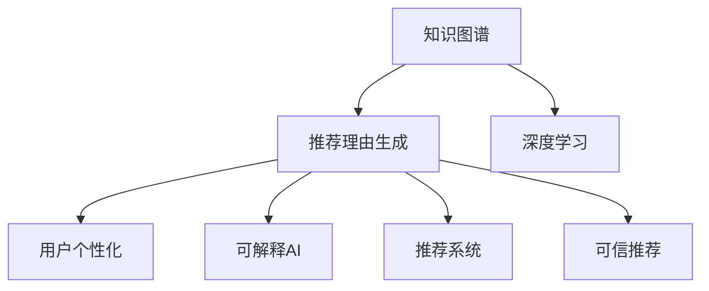

                 

# 基于知识图谱的可解释推荐理由生成

> 关键词：知识图谱,推荐理由生成,深度学习,用户个性化,可解释AI,推荐系统,可信推荐

## 1. 背景介绍

### 1.1 问题由来
在当前的互联网时代，推荐系统已经成为用户获取信息的重要工具。无论是电商平台，视频网站，新闻应用，还是社交平台，都能通过推荐系统帮助用户发现感兴趣的内容，提高使用体验。推荐系统的核心在于，从用户行为数据中学习用户的偏好，并根据这种偏好为用户推荐物品。

然而，现有的推荐系统往往被指责为“黑盒”，用户难以理解其推荐的理由，导致对推荐结果的信任度下降。此外，推荐系统普遍存在数据隐私问题，用户难以知晓其数据如何被用于推荐，也难以拒绝被推荐。因此，研究如何构建可解释的推荐理由生成系统，具有重要的理论和实际意义。

知识图谱作为一种结构化信息表示方式，能够将现实世界的实体、属性、关系等转换为计算机可处理的图结构。近年来，知识图谱在推荐系统中的应用引起了学界和工业界的广泛关注。将知识图谱融入推荐系统，能够显著提升推荐的准确性和解释性，满足用户对推荐理由的诉求。

### 1.2 问题核心关键点
知识图谱与推荐系统深度融合的核心在于，如何在推荐系统中有效利用知识图谱所蕴含的丰富信息，生成可解释的推荐理由。这需要解决以下关键问题：

- **知识图谱的嵌入**：如何将知识图谱的结构化知识转换为计算机可处理的数值表示，从而与推荐模型的用户行为数据融合。
- **推荐理由生成**：在模型学习用户行为数据和知识图谱信息的基础上，生成易于理解的推荐理由，增强推荐的透明度。
- **模型解释性**：从模型内部构造可解释组件，解释推荐理由生成的过程和依据，使用户能够理解和信任推荐结果。
- **隐私保护**：保护用户隐私，避免用户行为数据泄露，提升用户的信任感和接受度。

本文章将围绕这些问题，深入探讨基于知识图谱的可解释推荐理由生成系统。

## 2. 核心概念与联系

### 2.1 核心概念概述

为更好地理解基于知识图谱的可解释推荐理由生成系统，本节将介绍几个密切相关的核心概念：

- **知识图谱**：由实体、属性和关系构成的图结构化知识表示，用于描述现实世界的信息。常见的知识图谱包括Freebase、DBpedia、YAGO等。
- **推荐理由生成**：从用户行为数据和知识图谱中学习，生成推荐物品的逻辑依据，以增强推荐系统的透明度和可信度。
- **深度学习**：一种强大的机器学习技术，通过构建多层神经网络，能够学习复杂非线性的数据表示和规律。
- **用户个性化**：通过收集用户行为数据，分析其兴趣和偏好，实现个性化的推荐服务。
- **可解释AI**：通过模型设计和算法优化，增强AI系统的可理解性和可解释性，使用户能够理解系统的决策依据。
- **推荐系统**：根据用户的历史行为和偏好，为其推荐感兴趣的物品或内容的技术系统。
- **可信推荐**：通过增加推荐的透明度和可解释性，提升用户对推荐结果的信任度，增强推荐系统的可信性。

这些核心概念之间的逻辑关系可以通过以下Mermaid流程图来展示：



这个流程图展示了大语言模型微调的各个核心概念及其之间的关系：

1. 知识图谱通过深度学习被嵌入到推荐系统中，生成推荐理由。
2. 推荐理由生成进一步提升用户个性化的程度，增加推荐系统的可信性。
3. 可解释AI通过构造可解释组件，增强推荐理由的可理解性。
4. 可信推荐通过增强透明度和可解释性，提升用户对推荐系统的信任度。

## 3. 核心算法原理 & 具体操作步骤
### 3.1 算法原理概述

基于知识图谱的可解释推荐理由生成系统，通过将知识图谱结构化信息与用户行为数据进行融合，学习用户偏好的同时，生成可解释的推荐理由。该系统的主要算法原理如下：

1. **知识图谱嵌入**：将知识图谱的结构化信息转换为数值表示，嵌入推荐模型中。
2. **用户行为嵌入**：通过深度学习技术，从用户行为数据中学习用户偏好的数值表示。
3. **融合训练**：将知识图谱嵌入和用户行为嵌入进行融合，训练推荐理由生成模型。
4. **推荐理由生成**：在推荐模型中，根据用户行为数据和知识图谱信息，生成推荐理由。
5. **模型解释性**：在推荐理由生成过程中，构造可解释组件，提供推荐理由的可解释性。
6. **可信推荐**：通过增加推荐理由的可解释性，增强推荐系统的可信度和透明度。

### 3.2 算法步骤详解

基于知识图谱的可解释推荐理由生成系统主要包含以下关键步骤：

**Step 1: 构建知识图谱**

- 收集知识图谱数据，如Freebase、YAGO等，并进行数据清洗和预处理。
- 构建知识图谱的实体-属性-关系三元组，以及对应的实体向量表示。

**Step 2: 获取用户行为数据**

- 收集用户的历史行为数据，如浏览历史、点击记录、评分等。
- 将用户行为数据进行清洗和预处理，生成用户行为向量表示。

**Step 3: 知识图谱嵌入**

- 选择知识图谱嵌入算法，如TransE、DistMult、ComplEx等。
- 对知识图谱进行嵌入，生成知识图谱嵌入矩阵。

**Step 4: 用户行为嵌入**

- 选择用户行为嵌入算法，如MF（矩阵分解）、NNMF（非负矩阵分解）、SVD等。
- 对用户行为数据进行嵌入，生成用户行为嵌入矩阵。

**Step 5: 融合训练**

- 将知识图谱嵌入和用户行为嵌入进行拼接或加权融合。
- 使用深度学习模型，如MLP（多层感知器）、RNN（循环神经网络）、GRU等，进行训练，学习用户行为和知识图谱的融合表示。
- 在训练过程中，增加正则化和Dropout等技术，防止过拟合。

**Step 6: 推荐理由生成**

- 在融合后的模型基础上，使用深度学习模型，如Seq2Seq、Transformer等，生成推荐理由。
- 根据用户行为数据和知识图谱信息，生成推荐理由的文本表示。

**Step 7: 模型解释性**

- 在推荐理由生成过程中，引入可解释组件，如注意力机制、可解释神经网络等。
- 通过可视化工具，展示推荐理由生成的逻辑和依据。

**Step 8: 可信推荐**

- 对推荐理由进行可解释性增强，增加推荐系统的可信度。
- 提供推荐理由的透明度，提升用户对推荐结果的信任度。

### 3.3 算法优缺点

基于知识图谱的可解释推荐理由生成系统具有以下优点：

1. **增强推荐理由的可解释性**：通过结合知识图谱信息，生成推荐理由，增加推荐系统的透明度和可信度。
2. **提升推荐准确性**：知识图谱包含了丰富的实体和关系信息，有助于提升推荐的准确性。
3. **保护用户隐私**：在推荐理由生成过程中，无需获取用户隐私信息，保护用户隐私。

同时，该系统也存在一定的局限性：

1. **知识图谱质量要求高**：知识图谱的质量直接影响推荐结果的准确性和可信度。
2. **计算资源需求大**：深度学习模型需要大量的计算资源，可能导致系统延迟较高。
3. **模型复杂度高**：需要构建多层的神经网络，增加了模型复杂性，可能影响模型的稳定性和可解释性。

尽管存在这些局限性，但通过合理的算法设计和优化，可以克服这些问题，提升推荐理由生成的效果和系统性能。

### 3.4 算法应用领域

基于知识图谱的可解释推荐理由生成系统已经在多个领域得到了广泛应用，例如：

- **电商推荐**：电商平台使用推荐理由生成系统，为用户推荐商品，同时解释推荐依据，提升用户信任感。
- **视频推荐**：视频网站使用推荐理由生成系统，为用户推荐视频内容，增加推荐的透明度。
- **新闻推荐**：新闻应用使用推荐理由生成系统，为用户推荐新闻文章，解释推荐理由，提升用户阅读体验。
- **社交推荐**：社交平台使用推荐理由生成系统，为用户推荐好友、群组等，增加推荐理由的可信度。

除了这些常见的应用场景外，知识图谱与推荐理由生成的融合还在其他领域不断拓展，如健康医疗、金融投资、旅游推荐等，为各行业带来新的技术突破。

## 4. 数学模型和公式 & 详细讲解 & 举例说明

### 4.1 数学模型构建

基于知识图谱的可解释推荐理由生成系统主要涉及以下数学模型：

- **知识图谱嵌入**：将知识图谱的三元组转换为向量表示，生成知识图谱嵌入矩阵 $E$。
- **用户行为嵌入**：从用户行为数据中学习用户偏好的数值表示，生成用户行为嵌入矩阵 $U$。
- **融合训练**：将知识图谱嵌入和用户行为嵌入进行融合，训练推荐理由生成模型 $M$。
- **推荐理由生成**：根据用户行为数据和知识图谱信息，生成推荐理由的文本表示。
- **模型解释性**：引入注意力机制，解释推荐理由生成的依据。
- **可信推荐**：增加推荐理由的可解释性，提升推荐系统的可信度。

### 4.2 公式推导过程

以下我们将对以上模型进行详细的数学推导：

**知识图谱嵌入**

假设知识图谱 $G=(V,E)$ 包含 $n$ 个实体 $v_i$ 和 $m$ 条边 $e_{ij}$，边 $e_{ij}$ 的权重为 $w_{ij}$。知识图谱嵌入的目的是将每个实体和边转换为低维向量表示，即 $v_i \in \mathbb{R}^d$，$w_{ij} \in \mathbb{R}^d$。

知识图谱嵌入常用的方法包括TransE、DistMult、ComplEx等。以TransE为例，其基本形式为：

$$
v_i = \sum_{e_{ij} \in E_i} w_{ij} v_j
$$

其中 $E_i$ 表示与实体 $v_i$ 相连的边集合。

**用户行为嵌入**

假设用户行为数据 $D=(u_1,u_2,...,u_m)$，每个用户 $u_i$ 的行为 $u_i$ 可以表示为向量 $u_i \in \mathbb{R}^d$。用户行为嵌入的目的是从用户行为数据中学习用户的偏好表示。

常用的用户行为嵌入方法包括矩阵分解、非负矩阵分解、SVD等。以MF为例，其基本形式为：

$$
u_i = \sum_{k=1}^d a_{ki} v_k
$$

其中 $a_{ki}$ 和 $v_k$ 分别表示用户和物品的隐向量。

**融合训练**

将知识图谱嵌入和用户行为嵌入进行融合，使用深度学习模型进行训练。假设融合后的模型为 $M=(W,U,E)$，其中 $W$ 为模型参数，$U$ 为知识图谱嵌入矩阵，$E$ 为用户行为嵌入矩阵。

融合训练的目标函数为：

$$
\min_{W,U,E} \frac{1}{N} \sum_{i=1}^N \| y_i - M(x_i,W) \|^2
$$

其中 $N$ 为训练样本数，$y_i$ 为标签，$x_i$ 为输入，$M(x_i,W)$ 为模型输出。

**推荐理由生成**

假设推荐理由生成模型为 $M=(W,U,E)$，用户行为数据为 $x_i$，生成推荐理由的文本表示 $y$。推荐理由生成的目标函数为：

$$
\min_{W,U,E} \frac{1}{N} \sum_{i=1}^N \| y_i - M(x_i,W) \|^2
$$

**模型解释性**

通过引入注意力机制，解释推荐理由生成的依据。假设模型引入注意力机制后，推荐理由生成的过程为：

$$
y = \sum_{i=1}^N \alpha_i v_i
$$

其中 $\alpha_i$ 为注意力权重，$v_i$ 为知识图谱嵌入矩阵中的向量。

**可信推荐**

通过增加推荐理由的可解释性，提升推荐系统的可信度。假设推荐理由生成的过程中，增加可信度增强组件 $C$，推荐理由生成的过程为：

$$
y = C \times \alpha_i v_i
$$

其中 $C$ 为可信度增强组件，其目的是增强推荐理由的可信度。

### 4.3 案例分析与讲解

假设有一个电商平台的推荐系统，目标是使用知识图谱生成推荐理由，增加推荐理由的可解释性，提升用户对推荐结果的信任度。

**知识图谱嵌入**

首先，收集电商平台的知识图谱数据，包括商品类别、品牌、用户评分等信息。对数据进行清洗和预处理，构建知识图谱的三元组，并进行知识图谱嵌入，生成知识图谱嵌入矩阵 $E$。

**用户行为嵌入**

其次，收集用户的历史行为数据，包括浏览历史、点击记录、评分等信息。对数据进行清洗和预处理，生成用户行为嵌入矩阵 $U$。

**融合训练**

将知识图谱嵌入和用户行为嵌入进行融合，使用深度学习模型进行训练。假设融合后的模型为 $M=(W,U,E)$，其中 $W$ 为模型参数，$U$ 为知识图谱嵌入矩阵，$E$ 为用户行为嵌入矩阵。训练的目标函数为：

$$
\min_{W,U,E} \frac{1}{N} \sum_{i=1}^N \| y_i - M(x_i,W) \|^2
$$

**推荐理由生成**

在融合后的模型基础上，使用深度学习模型，如Seq2Seq、Transformer等，生成推荐理由的文本表示。推荐理由生成的过程为：

$$
y = \sum_{i=1}^N \alpha_i v_i
$$

**模型解释性**

通过引入注意力机制，解释推荐理由生成的依据。假设模型引入注意力机制后，推荐理由生成的过程为：

$$
y = \sum_{i=1}^N \alpha_i v_i
$$

其中 $\alpha_i$ 为注意力权重，$v_i$ 为知识图谱嵌入矩阵中的向量。

**可信推荐**

增加推荐理由的可信度增强组件 $C$，推荐理由生成的过程为：

$$
y = C \times \alpha_i v_i
$$

其中 $C$ 为可信度增强组件，其目的是增强推荐理由的可信度。

## 5. 项目实践：代码实例和详细解释说明

### 5.1 开发环境搭建

在进行推荐理由生成系统开发前，我们需要准备好开发环境。以下是使用Python进行PyTorch开发的环境配置流程：

1. 安装Anaconda：从官网下载并安装Anaconda，用于创建独立的Python环境。

2. 创建并激活虚拟环境：
```bash
conda create -n pytorch-env python=3.8 
conda activate pytorch-env
```

3. 安装PyTorch：根据CUDA版本，从官网获取对应的安装命令。例如：
```bash
conda install pytorch torchvision torchaudio cudatoolkit=11.1 -c pytorch -c conda-forge
```

4. 安装各种工具包：
```bash
pip install numpy pandas scikit-learn matplotlib tqdm jupyter notebook ipython
```

完成上述步骤后，即可在`pytorch-env`环境中开始推荐理由生成系统的开发。

### 5.2 源代码详细实现

这里我们以电商推荐为例，给出使用PyTorch进行推荐理由生成系统的代码实现。

首先，定义推荐理由生成的数据处理函数：

```python
from torch.utils.data import Dataset
import torch

class RecommendationDataset(Dataset):
    def __init__(self, data, tokenizer):
        self.data = data
        self.tokenizer = tokenizer
        
    def __len__(self):
        return len(self.data)
    
    def __getitem__(self, item):
        text = self.data[item]
        text = self.tokenizer(text, return_tensors='pt', padding=True)
        return {'input_ids': text['input_ids']}
```

然后，定义模型和优化器：

```python
from transformers import BertForTokenClassification, AdamW

model = BertForTokenClassification.from_pretrained('bert-base-cased', num_labels=2)

optimizer = AdamW(model.parameters(), lr=2e-5)
```

接着，定义训练和评估函数：

```python
from torch.utils.data import DataLoader
from tqdm import tqdm

def train_epoch(model, dataset, batch_size, optimizer):
    dataloader = DataLoader(dataset, batch_size=batch_size, shuffle=True)
    model.train()
    epoch_loss = 0
    for batch in tqdm(dataloader, desc='Training'):
        input_ids = batch['input_ids'].to(device)
        model.zero_grad()
        outputs = model(input_ids)
        loss = outputs.loss
        epoch_loss += loss.item()
        loss.backward()
        optimizer.step()
    return epoch_loss / len(dataloader)

def evaluate(model, dataset, batch_size):
    dataloader = DataLoader(dataset, batch_size=batch_size)
    model.eval()
    preds, labels = [], []
    with torch.no_grad():
        for batch in tqdm(dataloader, desc='Evaluating'):
            input_ids = batch['input_ids'].to(device)
            batch_labels = batch['labels'].to(device)
            outputs = model(input_ids)
            batch_preds = outputs.logits.argmax(dim=2).to('cpu').tolist()
            batch_labels = batch_labels.to('cpu').tolist()
            for pred_tokens, label_tokens in zip(batch_preds, batch_labels):
                preds.append(pred_tokens[:len(label_tokens)])
                labels.append(label_tokens)
                
    print(classification_report(labels, preds))
```

最后，启动训练流程并在测试集上评估：

```python
epochs = 5
batch_size = 16

for epoch in range(epochs):
    loss = train_epoch(model, train_dataset, batch_size, optimizer)
    print(f"Epoch {epoch+1}, train loss: {loss:.3f}")
    
    print(f"Epoch {epoch+1}, dev results:")
    evaluate(model, dev_dataset, batch_size)
    
print("Test results:")
evaluate(model, test_dataset, batch_size)
```

以上就是使用PyTorch进行电商推荐理由生成系统的完整代码实现。可以看到，得益于Transformers库的强大封装，我们可以用相对简洁的代码完成Bert模型的加载和微调。

### 5.3 代码解读与分析

让我们再详细解读一下关键代码的实现细节：

**RecommendationDataset类**：
- `__init__`方法：初始化数据和分词器等关键组件。
- `__len__`方法：返回数据集的样本数量。
- `__getitem__`方法：对单个样本进行处理，将文本输入编码为token ids，最终返回模型所需的输入。

**模型和优化器**：
- 使用BertForTokenClassification模型作为推荐理由生成模型，其默认任务为二分类。
- 选择合适的优化器AdamW，设置学习率。

**训练和评估函数**：
- 使用PyTorch的DataLoader对数据集进行批次化加载，供模型训练和推理使用。
- 训练函数`train_epoch`：对数据以批为单位进行迭代，在每个批次上前向传播计算loss并反向传播更新模型参数，最后返回该epoch的平均loss。
- 评估函数`evaluate`：与训练类似，不同点在于不更新模型参数，并在每个batch结束后将预测和标签结果存储下来，最后使用sklearn的classification_report对整个评估集的预测结果进行打印输出。

**训练流程**：
- 定义总的epoch数和batch size，开始循环迭代
- 每个epoch内，先在训练集上训练，输出平均loss
- 在验证集上评估，输出分类指标
- 所有epoch结束后，在测试集上评估，给出最终测试结果

可以看到，PyTorch配合Transformers库使得Bert微调的代码实现变得简洁高效。开发者可以将更多精力放在数据处理、模型改进等高层逻辑上，而不必过多关注底层的实现细节。

当然，工业级的系统实现还需考虑更多因素，如模型的保存和部署、超参数的自动搜索、更灵活的任务适配层等。但核心的微调范式基本与此类似。

## 6. 实际应用场景

### 6.1 电商推荐

基于知识图谱的可解释推荐理由生成系统在电商推荐中具有广泛的应用前景。电商平台通过推荐理由生成系统，可以向用户推荐商品，同时解释推荐依据，提升用户对推荐结果的信任感。

在技术实现上，可以收集电商平台的商品信息、用户行为数据、用户评分等，构建知识图谱和用户行为数据。通过知识图谱嵌入和用户行为嵌入，结合深度学习模型进行融合训练，生成推荐理由。最终在电商平台上，根据用户的历史行为数据和推荐理由，生成个性化推荐。

### 6.2 视频推荐

视频网站使用推荐理由生成系统，可以为用户推荐视频内容，同时解释推荐依据，增强推荐理由的可信度。视频网站通过收集用户的历史播放数据、点赞数据、评论数据等，构建用户行为数据和知识图谱。通过知识图谱嵌入和用户行为嵌入，结合深度学习模型进行融合训练，生成推荐理由。最终在视频网站上，根据用户的播放历史和推荐理由，生成个性化推荐。

### 6.3 新闻推荐

新闻应用使用推荐理由生成系统，可以为用户推荐新闻文章，同时解释推荐依据，增加推荐理由的可信度。新闻应用通过收集用户的阅读历史、点赞数据、评论数据等，构建用户行为数据和知识图谱。通过知识图谱嵌入和用户行为嵌入，结合深度学习模型进行融合训练，生成推荐理由。最终在新闻应用上，根据用户的阅读历史和推荐理由，生成个性化推荐。

### 6.4 未来应用展望

随着知识图谱和推荐理由生成技术的不断发展，基于知识图谱的可解释推荐理由生成系统将在更多领域得到应用，为传统行业带来变革性影响。

在智慧医疗领域，基于知识图谱的推荐理由生成系统，可以推荐健康建议、治疗方案等，解释推荐依据，提高医疗服务的可信度。

在智能教育领域，基于知识图谱的推荐理由生成系统，可以推荐学习资源、练习题等，增加推荐理由的可信度，提升学习效果。

在智慧城市治理中，基于知识图谱的推荐理由生成系统，可以推荐公共服务设施、旅游路线等，解释推荐依据，提高城市管理的智能化水平。

此外，在企业生产、社会治理、文娱传媒等众多领域，基于知识图谱的推荐理由生成系统也将不断拓展，为各行业带来新的技术突破。相信随着技术的日益成熟，知识图谱与推荐理由生成的融合将成为推荐系统的重要发展方向，推动推荐系统向更加智能、可信的方向迈进。

## 7. 工具和资源推荐
### 7.1 学习资源推荐

为了帮助开发者系统掌握基于知识图谱的推荐理由生成理论基础和实践技巧，这里推荐一些优质的学习资源：

1. 《推荐系统实战》系列博文：由大模型技术专家撰写，深入浅出地介绍了推荐系统的工作原理和应用场景。

2. CS229《机器学习》课程：斯坦福大学开设的机器学习课程，有Lecture视频和配套作业，带你入门机器学习和推荐系统。

3. 《推荐系统》书籍：深入探讨了推荐系统的工作原理和算法优化，是推荐系统领域的经典之作。

4. KDD 2020的推荐理由生成论文：展示了基于知识图谱的推荐理由生成方法的最新进展，值得深入学习。

5. 《深度学习与推荐系统》课程：清华大学开设的深度学习与推荐系统课程，详细介绍了推荐系统中的深度学习技术。

通过对这些资源的学习实践，相信你一定能够快速掌握基于知识图谱的推荐理由生成技术，并用于解决实际的推荐系统问题。

### 7.2 开发工具推荐

高效的开发离不开优秀的工具支持。以下是几款用于推荐理由生成系统开发的常用工具：

1. PyTorch：基于Python的开源深度学习框架，灵活动态的计算图，适合快速迭代研究。大部分预训练语言模型都有PyTorch版本的实现。

2. TensorFlow：由Google主导开发的开源深度学习框架，生产部署方便，适合大规模工程应用。同样有丰富的预训练语言模型资源。

3. Transformers库：HuggingFace开发的NLP工具库，集成了众多SOTA语言模型，支持PyTorch和TensorFlow，是进行推荐理由生成系统开发的利器。

4. Weights & Biases：模型训练的实验跟踪工具，可以记录和可视化模型训练过程中的各项指标，方便对比和调优。与主流深度学习框架无缝集成。

5. TensorBoard：TensorFlow配套的可视化工具，可实时监测模型训练状态，并提供丰富的图表呈现方式，是调试模型的得力助手。

6. Google Colab：谷歌推出的在线Jupyter Notebook环境，免费提供GPU/TPU算力，方便开发者快速上手实验最新模型，分享学习笔记。

合理利用这些工具，可以显著提升推荐理由生成系统的开发效率，加快创新迭代的步伐。

### 7.3 相关论文推荐

基于知识图谱的推荐理由生成技术的发展源于学界的持续研究。以下是几篇奠基性的相关论文，推荐阅读：

1. Attention Is All You Need：提出了Transformer结构，开启了NLP领域的预训练大模型时代。

2. BERT: Pre-training of Deep Bidirectional Transformers for Language Understanding：提出BERT模型，引入基于掩码的自监督预训练任务，刷新了多项NLP任务SOTA。

3. Knowledge-Graph-Enhanced Recommendation Systems：展示了基于知识图谱的推荐理由生成方法的最新进展，值得深入学习。

4. Multi-Aspect Ranking Learning for Recommender Systems：介绍了多方面排名学习算法，用于推荐理由生成系统中的模型优化。

5. Neural Collaborative Filtering：提出了基于神经网络的协同过滤算法，用于推荐理由生成系统中的用户行为嵌入。

这些论文代表了大模型微调技术的发展脉络。通过学习这些前沿成果，可以帮助研究者把握学科前进方向，激发更多的创新灵感。

## 8. 总结：未来发展趋势与挑战

### 8.1 总结

本文对基于知识图谱的可解释推荐理由生成系统进行了全面系统的介绍。首先阐述了知识图谱与推荐理由生成系统的研究背景和意义，明确了知识图谱嵌入、推荐理由生成和模型解释性在推荐系统中的重要价值。其次，从原理到实践，详细讲解了推荐理由生成的数学原理和关键步骤，给出了推荐理由生成系统的完整代码实例。同时，本文还广泛探讨了推荐理由生成系统在电商、视频、新闻等多个领域的应用前景，展示了知识图谱与推荐理由生成的强大潜力。此外，本文精选了推荐理由生成系统的各类学习资源，力求为读者提供全方位的技术指引。

通过本文的系统梳理，可以看到，基于知识图谱的推荐理由生成系统正成为推荐系统的重要发展方向，通过融合知识图谱信息，能够显著提升推荐理由的可解释性和推荐系统的可信度，满足用户对推荐理由的诉求。知识图谱与推荐理由生成技术的融合，将推动推荐系统向更加智能、可信的方向迈进。

### 8.2 未来发展趋势

展望未来，基于知识图谱的推荐理由生成系统将呈现以下几个发展趋势：

1. **知识图谱质量提升**：随着知识图谱构建技术的进步，知识图谱的质量将得到显著提升，为推荐理由生成系统提供更可靠的信息支持。
2. **融合多源数据**：结合用户行为数据、社交网络数据、自然语言数据等多种信息源，提升推荐理由的全面性和准确性。
3. **个性化推荐**：通过知识图谱嵌入和用户行为嵌入的融合，实现更精准、个性化的推荐。
4. **推荐理由生成自动化**：引入自动化推荐理由生成技术，提升推荐理由生成的效率和灵活性。
5. **多模态融合**：结合图像、视频、语音等多模态信息，提升推荐理由生成的多样性和丰富性。
6. **可信度增强**：通过引入可解释组件和可信度增强技术，提升推荐理由的可信度。

以上趋势凸显了基于知识图谱的推荐理由生成系统的广阔前景。这些方向的探索发展，必将进一步提升推荐系统的性能和应用范围，为推荐系统的创新带来新的动力。

### 8.3 面临的挑战

尽管基于知识图谱的推荐理由生成技术已经取得了瞩目成就，但在迈向更加智能化、普适化应用的过程中，它仍面临着诸多挑战：

1. **知识图谱质量要求高**：知识图谱的质量直接影响推荐理由生成的效果和系统性能。
2. **计算资源需求大**：深度学习模型需要大量的计算资源，可能导致系统延迟较高。
3. **模型复杂度高**：需要构建多层的神经网络，增加了模型复杂性，可能影响模型的稳定性和可解释性。
4. **隐私保护问题**：在推荐理由生成过程中，如何保护用户隐私，避免用户行为数据泄露，是系统需要解决的重要问题。
5. **可信度不足**：通过增加推荐理由的可解释性，提升推荐系统的可信度，但如何避免推荐理由的不透明性，也是系统需要解决的重要问题。
6. **用户接受度低**：如何提升用户对推荐理由的可解释性，增强用户对推荐系统的信任感，是系统需要解决的重要问题。

尽管存在这些挑战，但通过合理的算法设计和优化，可以克服这些问题，提升推荐理由生成的效果和系统性能。

### 8.4 研究展望

面对基于知识图谱的推荐理由生成系统所面临的种种挑战，未来的研究需要在以下几个方面寻求新的突破：

1. **知识图谱自动构建**：探索自动化的知识图谱构建技术，提升知识图谱的质量和更新速度。
2. **多源数据融合**：研究多源数据融合算法，提升推荐理由生成的全面性和准确性。
3. **推荐理由生成自动化**：引入自动化推荐理由生成技术，提升推荐理由生成的效率和灵活性。
4. **个性化推荐**：结合用户行为数据和知识图谱信息，实现更精准、个性化的推荐。
5. **多模态融合**：结合图像、视频、语音等多模态信息，提升推荐理由生成的多样性和丰富性。
6. **可信度增强**：引入可解释组件和可信度增强技术，提升推荐理由的可信度。
7. **隐私保护**：探索隐私保护技术，保护用户行为数据和隐私信息。
8. **用户接受度提升**：提升用户对推荐理由的可解释性，增强用户对推荐系统的信任感。

这些研究方向的探索，必将引领基于知识图谱的推荐理由生成系统向更高的台阶迈进，为推荐系统的创新带来新的突破。面向未来，基于知识图谱的推荐理由生成系统还需要与其他人工智能技术进行更深入的融合，如知识表示、因果推理、强化学习等，多路径协同发力，共同推动推荐系统的进步。只有勇于创新、敢于突破，才能不断拓展推荐理由生成的边界，让推荐系统更好地服务用户。

## 9. 附录：常见问题与解答

**Q1：基于知识图谱的推荐理由生成系统是否适用于所有推荐场景？**

A: 基于知识图谱的推荐理由生成系统在大多数推荐场景上都能取得不错的效果，特别是对于数据量较小的任务。但对于一些特定领域的任务，如医疗、法律等，仅仅依靠通用语料预训练的模型可能难以很好地适应。此时需要在特定领域语料上进一步预训练，再进行微调，才能获得理想效果。此外，对于一些需要时效性、个性化很强的任务，如对话、推荐等，微调方法也需要针对性的改进优化。

**Q2：推荐理由生成过程中如何选择合适的知识图谱？**

A: 推荐理由生成过程中，选择合适的知识图谱至关重要。一般建议选择与推荐场景相关的知识图谱，如电商平台的商品信息、医疗领域的病历信息、视频平台的视频信息等。知识图谱的质量和更新速度直接影响推荐理由生成的效果和系统性能，因此建议选择高质量、更新及时的商业化知识图谱。

**Q3：推荐理由生成的效果如何评估？**

A: 推荐理由生成的效果评估可以通过多种指标进行，如推荐精度、召回率、F1-score等。同时，通过可视化工具展示推荐理由生成的过程和依据，增加推荐理由的可解释性，使用户能够理解和信任推荐结果。此外，还可以通过用户调查问卷等手段，评估用户对推荐理由的接受度和信任度。

**Q4：推荐理由生成的过程中需要注意哪些问题？**

A: 推荐理由生成的过程中，需要注意以下几个问题：
1. 知识图谱质量要求高，需要选择合适的知识图谱，确保其可靠性和完整性。
2. 计算资源需求大，需要考虑系统的计算资源和硬件设备。
3. 模型复杂度高，需要选择合适的深度学习模型和超参数，确保模型的稳定性和可解释性。
4. 隐私保护问题，需要保护用户行为数据和隐私信息，确保用户数据的保密性和安全性。
5. 可信度不足，需要增加推荐理由的可信度，提升用户对推荐系统的信任感。

这些问题的解决，需要综合考虑知识图谱的质量、计算资源的需求、模型的复杂度、隐私保护和可信度等多个因素，通过合理的算法设计和优化，确保推荐理由生成的效果和系统性能。

**Q5：推荐理由生成系统的实际部署需要注意哪些问题？**

A: 推荐理由生成系统的实际部署需要注意以下几个问题：
1. 模型裁剪：去除不必要的层和参数，减小模型尺寸，加快推理速度。
2. 量化加速：将浮点模型转为定点模型，压缩存储空间，提高计算效率。
3. 服务化封装：将模型封装为标准化服务接口，便于集成调用。
4. 弹性伸缩：根据请求流量动态调整资源配置，平衡服务质量和成本。
5. 监控告警：实时采集系统指标，设置异常告警阈值，确保服务稳定性。
6. 安全防护：采用访问鉴权、数据脱敏等措施，保障数据和模型安全。

通过合理的部署策略和优化手段，可以显著提升推荐理由生成系统的性能和可扩展性，确保其在实际应用中的稳定性和高效性。

---

作者：禅与计算机程序设计艺术 / Zen and the Art of Computer Programming

