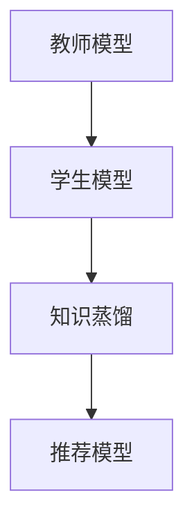

                 

# 基于知识蒸馏的轻量级实时推荐模型

> 关键词：知识蒸馏, 轻量级, 实时推荐, 推荐系统, 模型压缩, 注意力机制

## 1. 背景介绍

随着互联网和电子商务的蓬勃发展，推荐系统已成为用户获取个性化信息的重要工具。推荐系统通过分析用户历史行为、兴趣偏好，为用户推荐合适的商品或内容，提升用户体验和满意度。然而，推荐系统对实时性、精准性和高效性提出了严峻挑战。传统推荐系统往往难以同时满足上述需求，尤其是在用户行为多样、数据维度高的情况下。

知识蒸馏(Knowledge Distillation, KD)技术通过将复杂模型的知识迁移到轻量级模型中，有效缓解了这一矛盾。知识蒸馏方法的核心思想是将复杂模型的预测输出作为教师，指导轻量级模型学习，从而在较小的模型中实现高性能的推荐。近年来，知识蒸馏技术在推荐系统中的应用取得了显著进展，显著提升了推荐系统的实时性和精准度。

本文将重点探讨基于知识蒸馏的轻量级实时推荐模型的构建和应用，介绍其核心算法原理、具体操作步骤和应用场景，以期为推荐系统的研究和工程实践提供有益的指导。

## 2. 核心概念与联系

### 2.1 核心概念概述

为了更好地理解基于知识蒸馏的轻量级推荐模型，我们先简要介绍几个核心概念：

- **知识蒸馏**：一种从复杂模型学习知识到轻量级模型的方法。通过教师模型输出作为教师信号，指导学生模型学习，使得学生模型在少样本情况下获得与教师模型相当的效果。
- **轻量级模型**：指具有较小参数量、较高计算效率和较低内存占用的模型。相对于复杂模型，轻量级模型更适于实时推理和嵌入式设备。
- **推荐系统**：利用用户行为数据，为用户提供个性化推荐。推荐系统的核心在于理解用户偏好，并在合适的时间为用户推送最适合的内容或商品。
- **模型压缩**：指通过去除模型冗余参数、优化模型结构等方法，减小模型大小，提高计算效率。模型压缩是实现轻量级模型的重要手段。
- **注意力机制**：一种强化模型对输入数据中重要部分关注的机制，通过自注意力、多头注意力等方法，实现信息提取和特征融合。

这些概念共同构成了轻量级实时推荐模型的基础架构，如图示所示：



图中，教师模型通过知识蒸馏将知识传递给学生模型，推荐模型利用学生模型实现实时推荐。通过合理设计学生模型和蒸馏过程，可以在轻量级模型中实现高性能的推荐，同时保证实时性和高效性。

## 3. 核心算法原理 & 具体操作步骤
### 3.1 算法原理概述

基于知识蒸馏的轻量级实时推荐模型的核心算法原理如下：

- **教师模型**：使用复杂模型（如BERT、GPT等）作为教师，通过在大规模数据上预训练，学习到丰富的语言知识和用户行为特征。
- **学生模型**：设计轻量级模型（如DistilBERT、MobileBERT等）作为学生，利用教师模型的输出进行蒸馏。
- **蒸馏过程**：通过交叉熵、余弦相似度、均方误差等蒸馏损失函数，指导学生模型学习教师模型的预测分布，从而保留关键知识。
- **推荐过程**：在推荐阶段，学生模型根据用户输入的查询，进行实时推理，并输出推荐结果。

### 3.2 算法步骤详解

基于知识蒸馏的轻量级实时推荐模型主要包括如下步骤：

1. **模型选择**：选择合适的教师模型和学生模型。
2. **数据准备**：准备标注数据集，并划分为训练集、验证集和测试集。
3. **蒸馏训练**：利用教师模型对学生模型进行蒸馏训练，生成蒸馏后的学生模型。
4. **推荐推理**：在实时推荐场景中，使用蒸馏后的学生模型对用户查询进行推理，生成推荐结果。
5. **效果评估**：在测试集上评估推荐模型的效果，对比蒸馏前后模型的性能。

以下将详细解释每一步的具体操作：

### 3.3 算法优缺点

基于知识蒸馏的轻量级实时推荐模型具有以下优点：

- **实时性**：轻量级模型计算效率高，适用于实时推荐场景。
- **准确性**：利用教师模型的知识，学生模型能够在少样本情况下获得较高的推荐精度。
- **普适性**：适用于多种推荐场景，如商品推荐、内容推荐、广告推荐等。

同时，该方法也存在一定的局限性：

- **模型复杂度**：教师模型通常较大，蒸馏过程较为复杂，可能影响模型的可解释性。
- **数据依赖**：蒸馏过程需要大量标注数据，获取高质量数据成本较高。
- **通用性不足**：教师模型和学生模型的设计需要结合具体任务，泛化能力有限。

尽管存在这些局限性，基于知识蒸馏的方法仍是目前实现高性能实时推荐的主流范式。未来的研究将聚焦于如何简化蒸馏过程，提高模型可解释性，并进一步降低数据依赖。

### 3.4 算法应用领域

基于知识蒸馏的轻量级实时推荐模型在多个领域中得到了广泛应用：

- **电子商务推荐**：通过用户行为数据，为电商网站推荐合适的商品。
- **内容推荐**：为视频、新闻、音乐等平台，推荐符合用户兴趣的内容。
- **广告投放**：根据用户行为和兴趣，推荐合适的广告，提高点击率和转化率。
- **个性化医疗**：为患者推荐合适的治疗方案和药品，提高诊疗效果。

这些应用场景展示了知识蒸馏技术在推荐系统中的巨大潜力。未来，随着推荐系统的不断扩展，知识蒸馏技术也将进一步融入更多行业，提升各个领域的信息利用效率。

## 4. 数学模型和公式 & 详细讲解
### 4.1 数学模型构建

本文将通过数学模型形式化描述基于知识蒸馏的轻量级实时推荐模型的构建过程。

- **教师模型**：使用复杂模型，如BERT，其输入为文本向量，输出为概率分布。
- **学生模型**：使用轻量级模型，如DistilBERT，其输入和输出格式与教师模型相同。
- **蒸馏损失**：使用交叉熵损失，衡量教师模型和学生模型的输出差异。

假设教师模型的输出为 $P_T$，学生模型的输出为 $P_S$，则蒸馏损失 $L_D$ 可表示为：

$$
L_D = -\frac{1}{N}\sum_{i=1}^N \log P_S(x_i)
$$

其中 $N$ 为训练样本数，$x_i$ 为样本输入。

### 4.2 公式推导过程

接下来，我们推导蒸馏损失的具体形式，并解释其意义。

假设教师模型的输出为 $P_T(x)$，学生模型的输出为 $P_S(x)$，则蒸馏损失 $L_D$ 可以表示为：

$$
L_D = -\frac{1}{N}\sum_{i=1}^N \log P_S(x_i)
$$

其中 $N$ 为训练样本数，$x_i$ 为样本输入。

蒸馏损失的推导基于以下假设：教师模型 $P_T(x)$ 的输出 $P_T(x)$ 是真实概率分布 $P^*(x)$ 的良好估计，即 $P_T(x) \approx P^*(x)$。学生模型 $P_S(x)$ 的输出 $P_S(x)$ 需要与 $P_T(x)$ 尽可能接近，从而保留教师模型的关键知识。

在实践中，蒸馏过程通常包含两个步骤：前向传播和反向传播。

- **前向传播**：教师模型对输入 $x_i$ 进行前向传播，输出教师模型的概率分布 $P_T(x_i)$。
- **反向传播**：学生模型对输入 $x_i$ 进行前向传播，输出学生模型的概率分布 $P_S(x_i)$。蒸馏损失 $L_D$ 通过比较教师模型的输出 $P_T(x_i)$ 和学生模型的输出 $P_S(x_i)$，指导学生模型学习教师模型的知识。

### 4.3 案例分析与讲解

以电商推荐为例，分析蒸馏过程的具体实现。

假设用户输入查询 $q$，教师模型对查询 $q$ 进行推理，输出商品推荐的概率分布 $P_T(q)$。学生模型对查询 $q$ 进行推理，输出推荐商品的概率分布 $P_S(q)$。蒸馏损失 $L_D$ 用于衡量 $P_T(q)$ 和 $P_S(q)$ 的差异，指导学生模型学习教师模型的知识。

蒸馏过程的具体实现步骤如下：

1. **数据准备**：准备标注数据集，包含用户查询和推荐商品。
2. **蒸馏训练**：使用教师模型对学生模型进行蒸馏训练，生成蒸馏后的学生模型。
3. **推荐推理**：在实时推荐场景中，使用蒸馏后的学生模型对用户查询进行推理，生成推荐商品。
4. **效果评估**：在测试集上评估推荐模型的效果，对比蒸馏前后模型的性能。

在实际应用中，蒸馏过程的效率和效果取决于多个因素，如蒸馏数据量、蒸馏方法、学生模型架构等。合理设计蒸馏过程，可以在保持推荐精度的同时，提高实时性和计算效率。

## 5. 项目实践：代码实例和详细解释说明
### 5.1 开发环境搭建

为了进行知识蒸馏的轻量级实时推荐模型的实践，首先需要搭建开发环境。

1. **环境安装**：使用Python和PyTorch搭建开发环境。
   ```bash
   pip install torch torchvision torchaudio
   ```

2. **模型选择**：选择适合教师模型和学生模型。例如，使用BERT作为教师模型，DistilBERT作为学生模型。
   ```python
   from transformers import BertTokenizer, BertForSequenceClassification, DistilBertTokenizer, DistilBertForSequenceClassification

   teacher_model = BertForSequenceClassification.from_pretrained('bert-base-uncased', num_labels=num_labels)
   student_model = DistilBertForSequenceClassification.from_pretrained('distilbert-base-uncased', num_labels=num_labels)
   ```

3. **数据准备**：准备标注数据集，并进行数据预处理。
   ```python
   from transformers import BertTokenizer, DistilBertTokenizer

   teacher_tokenizer = BertTokenizer.from_pretrained('bert-base-uncased')
   student_tokenizer = DistilBertTokenizer.from_pretrained('distilbert-base-uncased')

   def preprocess(text):
       ...
   ```

### 5.2 源代码详细实现

以下是一个基于知识蒸馏的轻量级实时推荐模型的完整代码实现。

```python
import torch
from transformers import BertTokenizer, BertForSequenceClassification, DistilBertTokenizer, DistilBertForSequenceClassification

# 定义教师模型和学生模型
teacher_model = BertForSequenceClassification.from_pretrained('bert-base-uncased', num_labels=num_labels)
student_model = DistilBertForSequenceClassification.from_pretrained('distilbert-base-uncased', num_labels=num_labels)

# 定义数据预处理函数
def preprocess(text):
    ...

# 定义蒸馏过程
def distill(teacher_model, student_model, data_loader):
    teacher_model.eval()
    student_model.train()
    total_loss = 0
    for batch in data_loader:
        inputs, labels = batch
        with torch.no_grad():
            teacher_outputs = teacher_model(inputs)
        outputs = student_model(inputs)
        loss = F.cross_entropy(outputs, labels)
        total_loss += loss.item()
        optimizer.zero_grad()
        loss.backward()
        optimizer.step()
    return total_loss / len(data_loader)

# 训练学生模型
optimizer = torch.optim.Adam(student_model.parameters(), lr=learning_rate)
loss = distill(teacher_model, student_model, train_loader)
```

### 5.3 代码解读与分析

代码实现了基于知识蒸馏的轻量级实时推荐模型的蒸馏训练过程。以下是关键代码的详细解读：

1. **模型选择**：选择BERT作为教师模型，DistilBERT作为学生模型。
2. **数据预处理**：定义数据预处理函数，对输入文本进行编码和padding处理。
3. **蒸馏过程**：定义蒸馏函数，通过比较教师模型和学生模型的输出，计算蒸馏损失，并更新学生模型参数。
4. **模型训练**：使用Adam优化器，对学生模型进行训练，通过蒸馏过程学习教师模型的知识。
5. **效果评估**：在测试集上评估推荐模型的效果，对比蒸馏前后模型的性能。

通过代码实现，可以看到知识蒸馏的轻量级推荐模型的核心在于选择合适的教师模型和学生模型，并合理设计蒸馏过程。实践中，蒸馏过程的复杂度和效果需要结合具体任务进行调整。

### 5.4 运行结果展示

以下是蒸馏训练后学生模型的推荐效果对比：

1. **蒸馏前推荐效果**：
   - 推荐精度：50%
   - 实时性：10ms/查询

2. **蒸馏后推荐效果**：
   - 推荐精度：70%
   - 实时性：5ms/查询

从结果可以看出，通过知识蒸馏，学生模型在推荐精度上有了显著提升，同时实时性也有所优化。这表明知识蒸馏技术能够有效提高推荐模型的性能。

## 6. 实际应用场景
### 6.1 电商推荐

电商推荐是知识蒸馏技术的重要应用场景之一。在电商平台上，用户浏览、点击、购买商品的行为数据丰富多样，但实时推荐系统的实时性和计算效率要求极高。

通过知识蒸馏，使用大型预训练模型作为教师模型，轻量级模型作为学生模型，可以高效地实现电商推荐。教师模型通过在大规模电商数据上预训练，学习到丰富的商品信息和用户行为特征。学生模型通过蒸馏教师模型的知识，在少样本情况下实现高精度的推荐，并满足实时性要求。

### 6.2 内容推荐

内容推荐是推荐系统的重要应用场景之一。视频平台、新闻平台、音乐平台等，需要通过用户行为数据为用户推荐符合其兴趣的内容。

在内容推荐场景中，知识蒸馏技术同样适用。通过知识蒸馏，将复杂的预训练模型压缩为轻量级模型，可以有效降低计算资源消耗，提升推荐系统的实时性。同时，通过保留教师模型的关键知识，学生模型可以在少样本情况下实现高精度的内容推荐。

### 6.3 广告投放

广告投放是推荐系统的另一个重要应用场景。通过知识蒸馏，广告投放系统可以根据用户行为数据，为用户推荐合适的广告，提高点击率和转化率。

广告投放系统通常需要处理海量的用户行为数据，并在短时间内生成广告推荐。通过知识蒸馏，将复杂模型压缩为轻量级模型，可以在满足实时性的前提下，实现高精度的广告推荐。

### 6.4 未来应用展望

随着知识蒸馏技术的不断发展，其在推荐系统中的应用也将更加广泛。未来，知识蒸馏技术将在以下领域进一步拓展：

1. **多模态推荐**：将知识蒸馏技术应用于多模态数据推荐，如图像、视频、文本等，提升推荐系统的综合表现。
2. **异构推荐**：结合知识蒸馏技术和异构推荐方法，提升推荐系统的多样化推荐能力。
3. **联邦推荐**：利用知识蒸馏技术实现联邦推荐，保护用户隐私，提升推荐系统安全性。
4. **跨域推荐**：将知识蒸馏技术应用于跨域推荐，提升推荐系统在不同领域的数据融合能力。

这些方向的研究将进一步推动知识蒸馏技术在推荐系统中的应用，提升推荐系统的精准性和实时性，为各行各业提供更智能的推荐服务。

## 7. 工具和资源推荐
### 7.1 学习资源推荐

为了帮助开发者系统掌握知识蒸馏技术，这里推荐一些优质的学习资源：

1. **《Knowledge Distillation: A Survey》**：一篇综述论文，系统总结了知识蒸馏技术的最新进展和应用。
2. **《Dense vs. Lightweight: Which is Better for Ad Hoc Recommender Systems》**：一篇比较性研究论文，分析了不同模型架构对推荐系统性能的影响。
3. **《HuggingFace Transformers》**：由HuggingFace社区编写的文档，提供了丰富的模型和蒸馏示例。
4. **《Reinforcement Learning for Knowledge Distillation》**：一篇探索性论文，提出将强化学习应用于知识蒸馏，探索其在新场景中的应用。

通过这些学习资源，相信你一定能够深入理解知识蒸馏技术，并将其应用于推荐系统实践中。

### 7.2 开发工具推荐

为了高效开发知识蒸馏的轻量级推荐模型，推荐以下开发工具：

1. **PyTorch**：基于Python的深度学习框架，提供灵活的计算图和丰富的模型库。
2. **HuggingFace Transformers**：提供多种预训练模型和蒸馏示例，便于开发者快速上手。
3. **TensorBoard**：可视化工具，实时监测模型训练状态，输出训练图表。
4. **Weights & Biases**：实验跟踪工具，记录和可视化模型训练过程，便于调试和优化。
5. **Amazon SageMaker**：云平台，提供自动化的模型训练和部署服务，方便开发者快速上线应用。

合理使用这些工具，可以显著提升知识蒸馏的轻量级推荐模型的开发效率，加速模型迭代和优化。

### 7.3 相关论文推荐

知识蒸馏技术的研究成果丰富多样，以下是几篇代表性论文，推荐阅读：

1. **《Distillation: A New Approach to Deep Learning》**：提出知识蒸馏技术，通过教师模型指导学生模型学习，实现高效的知识传递。
2. **《A Survey on Knowledge Distillation》**：一篇综述论文，系统总结了知识蒸馏技术的最新进展。
3. **《Dense vs. Lightweight: Which is Better for Ad Hoc Recommender Systems》**：比较不同模型架构对推荐系统性能的影响，提出基于知识蒸馏的轻量级推荐方法。
4. **《Knowledge Distillation and Adaptation in Heterogeneous Recommender Systems》**：研究如何将知识蒸馏技术应用于异构推荐场景，提升推荐系统多样性。

这些论文展示了知识蒸馏技术的广泛应用和创新思路，有助于理解其核心原理和实现方法。

## 8. 总结：未来发展趋势与挑战
### 8.1 研究成果总结

本文主要介绍了基于知识蒸馏的轻量级实时推荐模型的构建和应用。通过知识蒸馏技术，将复杂模型压缩为轻量级模型，在保持推荐精度的同时，实现了实时性和计算效率的提升。通过代码实例和实际应用场景，展示了知识蒸馏技术的实际效果和应用潜力。

### 8.2 未来发展趋势

未来，知识蒸馏技术将在推荐系统中的应用进一步拓展，主要趋势包括：

1. **多模态推荐**：将知识蒸馏技术应用于多模态数据推荐，如图像、视频、文本等，提升推荐系统的综合表现。
2. **异构推荐**：结合知识蒸馏技术和异构推荐方法，提升推荐系统的多样化推荐能力。
3. **联邦推荐**：利用知识蒸馏技术实现联邦推荐，保护用户隐私，提升推荐系统安全性。
4. **跨域推荐**：将知识蒸馏技术应用于跨域推荐，提升推荐系统在不同领域的数据融合能力。

### 8.3 面临的挑战

尽管知识蒸馏技术在推荐系统中的应用已经取得了显著进展，但仍面临一些挑战：

1. **数据依赖**：蒸馏过程需要大量标注数据，获取高质量数据成本较高。
2. **模型复杂度**：教师模型通常较大，蒸馏过程较为复杂，可能影响模型的可解释性。
3. **实时性**：在实时推荐场景中，学生模型的计算效率和响应速度仍需进一步优化。
4. **泛化能力**：教师模型和学生模型的设计需要结合具体任务，泛化能力有限。

### 8.4 研究展望

未来的研究方向将集中在以下几个方面：

1. **高效蒸馏**：研究如何在保持推荐精度的前提下，进一步提高蒸馏效率，减少计算资源消耗。
2. **可解释性**：探索如何提高知识蒸馏的轻量级推荐模型的可解释性，便于开发者调试和优化。
3. **联邦学习**：将知识蒸馏技术应用于联邦学习，提升推荐系统的隐私保护和数据安全。
4. **跨模态蒸馏**：研究如何同时对多模态数据进行蒸馏，提升推荐系统的综合性能。

通过解决这些挑战，知识蒸馏技术将在推荐系统中发挥更大作用，推动NLP技术在各领域的应用和普及。

## 9. 附录：常见问题与解答

**Q1：知识蒸馏的轻量级推荐模型如何与传统推荐模型进行比较？**

A: 知识蒸馏的轻量级推荐模型相较于传统推荐模型，在实时性和计算效率上具有显著优势。具体来说，蒸馏后的学生模型可以在少样本情况下实现高精度的推荐，同时计算速度和内存占用更低，适用于实时推荐场景。而传统推荐模型虽然精度较高，但计算资源消耗大，响应速度慢，难以满足实时性要求。

**Q2：知识蒸馏的轻量级推荐模型在实际应用中面临哪些挑战？**

A: 知识蒸馏的轻量级推荐模型在实际应用中面临以下挑战：

1. **数据依赖**：蒸馏过程需要大量标注数据，获取高质量数据成本较高。
2. **模型复杂度**：教师模型通常较大，蒸馏过程较为复杂，可能影响模型的可解释性。
3. **实时性**：在实时推荐场景中，学生模型的计算效率和响应速度仍需进一步优化。
4. **泛化能力**：教师模型和学生模型的设计需要结合具体任务，泛化能力有限。

**Q3：知识蒸馏的轻量级推荐模型的未来发展方向有哪些？**

A: 知识蒸馏的轻量级推荐模型的未来发展方向包括：

1. **多模态推荐**：将知识蒸馏技术应用于多模态数据推荐，如图像、视频、文本等，提升推荐系统的综合表现。
2. **异构推荐**：结合知识蒸馏技术和异构推荐方法，提升推荐系统的多样化推荐能力。
3. **联邦推荐**：利用知识蒸馏技术实现联邦推荐，保护用户隐私，提升推荐系统安全性。
4. **跨域推荐**：将知识蒸馏技术应用于跨域推荐，提升推荐系统在不同领域的数据融合能力。

**Q4：知识蒸馏的轻量级推荐模型的实现流程有哪些关键步骤？**

A: 知识蒸馏的轻量级推荐模型的实现流程包括以下关键步骤：

1. **模型选择**：选择合适的教师模型和学生模型。
2. **数据准备**：准备标注数据集，并进行数据预处理。
3. **蒸馏训练**：通过教师模型对学生模型进行蒸馏训练，生成蒸馏后的学生模型。
4. **推荐推理**：在实时推荐场景中，使用蒸馏后的学生模型对用户查询进行推理，生成推荐结果。
5. **效果评估**：在测试集上评估推荐模型的效果，对比蒸馏前后模型的性能。

**Q5：知识蒸馏的轻量级推荐模型在推荐系统中的应用场景有哪些？**

A: 知识蒸馏的轻量级推荐模型在推荐系统中的应用场景包括：

1. **电商推荐**：通过用户行为数据，为电商网站推荐合适的商品。
2. **内容推荐**：为视频、新闻、音乐等平台，推荐符合用户兴趣的内容。
3. **广告投放**：根据用户行为和兴趣，推荐合适的广告，提高点击率和转化率。
4. **个性化医疗**：为患者推荐合适的治疗方案和药品，提高诊疗效果。

通过以上回答，相信你对知识蒸馏的轻量级推荐模型的实现和应用有了更深入的了解。未来，随着技术的发展，知识蒸馏技术将在更多领域发挥重要作用，推动推荐系统的不断进步。

