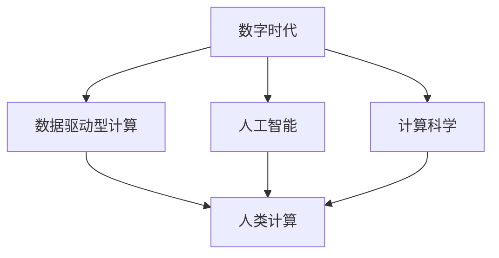

                 

# 塑造数字时代的未来：人类计算的关键作用

> 关键词：数字时代,人类计算,人工智能,计算科学,未来技术

## 1. 背景介绍

### 1.1 问题由来
随着科技的不断进步，我们正在步入一个以数字技术为核心的全新时代——数字时代。这一时代以高度自动化、智能化为特征，极大地推动了社会的经济、文化、教育等多个方面的发展。而这一切的背后，都离不开计算力的提升和计算方式的变化。

数字时代的计算，已经不再局限于传统的数值计算和程序计算，而是扩展到了更广泛的数据处理、知识发现、决策支持等领域。这种转变，不仅要求计算能力的飞跃，也需要计算方式与人类行为的高度融合。这就引出了“人类计算”的概念。

人类计算指的是将人类的判断、推理、直觉等认知能力与计算机的计算能力相结合，形成一种新的计算模式。在数字时代，人类计算不仅是计算能力的补充，更是推动社会进步的关键力量。

### 1.2 问题核心关键点
1. 计算模式的演进：从传统的数值计算到程序计算，再到现在的数据驱动型计算，计算模式正在不断演变。
2. 人类计算的定义与意义：将人类智慧与计算机能力结合，形成新的计算模式。
3. 数字时代的计算需求：高效的数据处理、知识发现、决策支持等。
4. 人类计算在数字时代的作用：提升决策的准确性、增强人类创造力、推动社会进步。
5. 未来技术趋势：大数据、人工智能、量子计算等技术的发展，将进一步促进人类计算的演进。

## 2. 核心概念与联系

### 2.1 核心概念概述

为了更好地理解人类计算的概念及其与数字时代的关联，本节将介绍几个核心概念：

- 数字时代：以信息技术为核心，以数据为驱动的社会发展阶段。
- 人类计算：结合人类的判断、推理、直觉等认知能力与计算机的计算能力，形成一种新的计算模式。
- 数据驱动型计算：以数据为输入，通过算法和模型进行分析和预测，辅助决策和行为。
- 人工智能：利用算法和模型，模拟人类智能，实现自动化的数据处理和决策支持。
- 计算科学：研究计算机的计算能力及其在科学、工程等领域的应用，推动计算模式的演进。

这些概念之间的逻辑关系可以通过以下Mermaid流程图来展示：



这个流程图展示了大时代背景下的主要概念及其相互关系：

1. 数字时代是背景，数据驱动型计算、人工智能和计算科学是其核心组成部分。
2. 数据驱动型计算是人工智能的基础，而人工智能又是计算科学的延伸。
3. 人类计算将人类的认知能力与计算机的计算能力相结合，是数据驱动型计算和人工智能的关键补充。

## 3. 核心算法原理 & 具体操作步骤
### 3.1 算法原理概述

人类计算的核心算法原理，是利用计算机的计算能力和人类的认知能力相结合，形成一种新型的计算模式。其基本思想是：

- 计算机负责处理大量数据和复杂计算，提供高效的数据处理能力。
- 人类负责对数据进行判断、推理和直觉上的判断，提供高质量的决策支持。
- 两者相互结合，形成一种高效、精确的计算模式，以应对数字时代的各种需求。

### 3.2 算法步骤详解

基于上述原理，人类计算的算法步骤通常包括以下几个关键步骤：

1. **数据采集与预处理**：收集和清洗各种来源的数据，为后续的计算提供基础。

2. **特征提取与表示**：利用算法和模型对数据进行特征提取，将原始数据转换为易于计算和分析的表示形式。

3. **模型构建与训练**：选择合适的算法和模型，利用训练数据对其进行训练，形成具有预测和推理能力的模型。

4. **决策与反馈**：将模型应用于实际问题，通过人类专家的反馈，不断优化模型，提升其准确性和鲁棒性。

5. **结果验证与调整**：对计算结果进行验证，根据实际应用效果进行调整，确保模型的实用性和可靠性。

### 3.3 算法优缺点

人类计算在提升计算效率和决策质量方面具有显著优势，但也存在一些局限性：

**优点**：
- **结合人类智慧**：利用人类的认知能力和直觉，提升决策的准确性和可靠性。
- **高效的数据处理**：结合计算机的高效计算能力，能够处理海量数据，快速提取有价值的信息。
- **多样性**：能够应对各种复杂场景，提供灵活的解决方案。

**缺点**：
- **依赖专业人才**：需要专业的数据科学家、算法工程师等，对人才的依赖较高。
- **计算成本高**：结合人类智慧的计算模式，需要大量的人力和资源投入。
- **不确定性**：人类的判断和推理存在主观性和不确定性，可能影响计算结果的稳定性。

### 3.4 算法应用领域

人类计算在各个领域都有广泛的应用，以下是几个典型的应用场景：

1. **医疗健康**：利用患者数据和医疗知识，进行疾病诊断和治疗方案的推荐，提升医疗服务水平。
2. **金融风险管理**：结合市场数据和专业知识，进行风险评估和预测，保障金融系统的稳定运行。
3. **智能交通**：结合交通数据和交通规则，优化交通流量管理，提高交通效率和安全性。
4. **环境保护**：结合环境数据和专家知识，进行污染源识别和环境监测，促进可持续发展。
5. **教育培训**：结合学生数据和教育知识，提供个性化的学习方案和辅导，提升教育质量。

## 4. 数学模型和公式 & 详细讲解 & 举例说明

### 4.1 数学模型构建

在人类计算中，数学模型是核心工具之一。其构建通常包括以下几个步骤：

1. **问题建模**：将现实问题抽象为数学问题，选择合适的数学模型进行描述。
2. **数据表示**：将数据表示为模型所需的数学形式，如向量、矩阵等。
3. **模型求解**：利用算法和计算工具，求解数学模型，得到计算结果。

### 4.2 公式推导过程

以医疗健康领域的疾病诊断为例，其数学模型推导过程如下：

设 $X$ 为患者的症状向量，$Y$ 为疾病的标签向量。假设存在一个线性分类器 $f(X; \theta)$，其形式为：

$$
f(X; \theta) = \theta^T \Phi(X)
$$

其中 $\theta$ 为模型参数，$\Phi(X)$ 为特征映射函数，将 $X$ 映射到高维空间中。

目标是最小化损失函数：

$$
\mathcal{L}(\theta) = \frac{1}{N} \sum_{i=1}^N [\ell(f(X_i; \theta), Y_i)]
$$

其中 $\ell(\cdot)$ 为损失函数，常用的有交叉熵损失、均方误差损失等。

求解目标函数的最小值，得到最优的模型参数 $\theta^*$，即为最终的疾病诊断模型。

### 4.3 案例分析与讲解

**案例**：金融风险评估

在金融领域，利用人类计算进行风险评估是一个典型应用。具体步骤如下：

1. **数据采集**：收集历史交易数据、市场数据、公司财务数据等。
2. **特征提取**：利用算法提取交易频率、波动率、杠杆率等特征。
3. **模型构建**：构建逻辑回归、决策树、支持向量机等模型。
4. **训练与验证**：使用历史数据进行模型训练，在验证集上进行性能验证。
5. **决策应用**：将模型应用于新交易的评估，提供风险预测和决策建议。

## 5. 项目实践：代码实例和详细解释说明

### 5.1 开发环境搭建

在进行人类计算的实践之前，我们需要准备好开发环境。以下是使用Python进行PyTorch开发的环境配置流程：

1. 安装Anaconda：从官网下载并安装Anaconda，用于创建独立的Python环境。

2. 创建并激活虚拟环境：
```bash
conda create -n pytorch-env python=3.8 
conda activate pytorch-env
```

3. 安装PyTorch：根据CUDA版本，从官网获取对应的安装命令。例如：
```bash
conda install pytorch torchvision torchaudio cudatoolkit=11.1 -c pytorch -c conda-forge
```

4. 安装各类工具包：
```bash
pip install numpy pandas scikit-learn matplotlib tqdm jupyter notebook ipython
```

完成上述步骤后，即可在`pytorch-env`环境中开始人类计算的实践。

### 5.2 源代码详细实现

这里以一个简单的例子，展示如何在医疗健康领域利用人类计算进行疾病诊断。

```python
import torch
import torch.nn as nn
import torch.optim as optim
from torch.utils.data import TensorDataset, DataLoader

# 构建数据集
class DiseaseDataset(torch.utils.data.Dataset):
    def __init__(self, X, Y):
        self.X = X
        self.Y = Y
    
    def __len__(self):
        return len(self.X)
    
    def __getitem__(self, idx):
        return torch.tensor(self.X[idx]), torch.tensor(self.Y[idx])

# 构建模型
class DiseaseClassifier(nn.Module):
    def __init__(self, n_features):
        super(DiseaseClassifier, self).__init__()
        self.fc1 = nn.Linear(n_features, 64)
        self.fc2 = nn.Linear(64, 32)
        self.fc3 = nn.Linear(32, 2)
    
    def forward(self, x):
        x = torch.relu(self.fc1(x))
        x = torch.relu(self.fc2(x))
        x = self.fc3(x)
        return x

# 训练模型
X_train = # 训练集特征
Y_train = # 训练集标签
X_test = # 测试集特征
Y_test = # 测试集标签

n_features = X_train.shape[1]
model = DiseaseClassifier(n_features)
criterion = nn.CrossEntropyLoss()
optimizer = optim.Adam(model.parameters(), lr=0.001)

# 训练过程
for epoch in range(10):
    for i, (X, Y) in enumerate(DataLoader(TensorDataset(X_train, Y_train), batch_size=32, shuffle=True)):
        optimizer.zero_grad()
        output = model(X)
        loss = criterion(output, Y)
        loss.backward()
        optimizer.step()
        print(f'Epoch {epoch+1}, Loss: {loss.item()}')

# 测试模型
test_loader = DataLoader(TensorDataset(X_test, Y_test), batch_size=32, shuffle=False)
correct = 0
total = 0
with torch.no_grad():
    for X, Y in test_loader:
        output = model(X)
        _, predicted = torch.max(output.data, 1)
        total += Y.size(0)
        correct += (predicted == Y).sum().item()
print(f'Accuracy: {correct/total}')
```

### 5.3 代码解读与分析

让我们再详细解读一下关键代码的实现细节：

**DiseaseDataset类**：
- `__init__`方法：初始化特征和标签。
- `__len__`方法：返回数据集的大小。
- `__getitem__`方法：获取单个样本，将其转换为Tensor类型。

**DiseaseClassifier类**：
- `__init__`方法：定义多层感知器模型，包括全连接层。
- `forward`方法：前向传播，计算输出。

**训练模型**：
- 构建模型，定义损失函数和优化器。
- 使用DataLoader加载数据集，进行模型训练。
- 在每个epoch后输出当前模型的损失。

**测试模型**：
- 使用DataLoader加载测试集，进行模型测试。
- 输出测试集的准确率。

## 6. 实际应用场景

### 6.1 医疗健康

在医疗健康领域，人类计算可以用于疾病诊断、治疗方案推荐等。例如，利用患者数据和医疗知识，构建疾病诊断模型，快速准确地识别疾病类型，提供个性化的治疗方案，提升医疗服务水平。

### 6.2 金融风险管理

金融风险管理是人类计算的另一个典型应用场景。通过结合市场数据和专业知识，构建风险评估模型，进行风险预测和决策支持，保障金融系统的稳定运行。

### 6.3 智能交通

智能交通领域，人类计算可以用于交通流量管理、路线规划等。通过结合交通数据和交通规则，构建交通优化模型，实时调整交通信号灯，提高交通效率和安全性。

### 6.4 环境保护

环境保护领域，人类计算可以用于污染源识别、环境监测等。通过结合环境数据和专家知识，构建环境监测模型，实时监测污染情况，提供决策支持，促进可持续发展。

### 6.5 教育培训

教育培训领域，人类计算可以用于个性化学习方案推荐、智能辅导等。通过结合学生数据和教育知识，构建学习模型，提供个性化的学习方案和辅导，提升教育质量。

## 7. 工具和资源推荐

### 7.1 学习资源推荐

为了帮助开发者系统掌握人类计算的理论基础和实践技巧，这里推荐一些优质的学习资源：

1. 《计算机算法导论》：经典教材，详细介绍了算法设计和分析的基础。
2. 《深度学习》课程：斯坦福大学开设的深度学习课程，涵盖神经网络、卷积神经网络、循环神经网络等核心内容。
3. 《人工智能基础》课程：宾夕法尼亚大学开设的AI基础课程，涵盖机器学习、数据挖掘、自然语言处理等。
4. Coursera、edX等在线教育平台：提供大量高质量的AI和计算机科学课程，包括人类计算的相关内容。
5. Kaggle：数据科学竞赛平台，提供丰富的数据集和实战案例，帮助学习者深入理解人类计算的应用。

通过对这些资源的学习实践，相信你一定能够快速掌握人类计算的精髓，并用于解决实际的AI问题。

### 7.2 开发工具推荐

高效的开发离不开优秀的工具支持。以下是几款用于人类计算开发的常用工具：

1. Python：通用编程语言，具有丰富的数据处理和科学计算库，适合人类计算的实现。
2. PyTorch：基于Python的深度学习框架，灵活动态的计算图，适合快速迭代研究。
3. TensorFlow：由Google主导开发的深度学习框架，生产部署方便，适合大规模工程应用。
4. Weights & Biases：模型训练的实验跟踪工具，可以记录和可视化模型训练过程中的各项指标，方便对比和调优。
5. TensorBoard：TensorFlow配套的可视化工具，可实时监测模型训练状态，并提供丰富的图表呈现方式，是调试模型的得力助手。

合理利用这些工具，可以显著提升人类计算的开发效率，加快创新迭代的步伐。

### 7.3 相关论文推荐

人类计算的发展源于学界的持续研究。以下是几篇奠基性的相关论文，推荐阅读：

1. 《The Quest for General Artificial Intelligence》：提出通用人工智能的概念，探讨了实现通用人工智能的路径和方法。
2. 《A Theory of Human Computation》：总结了人类计算的基本理论和应用场景，提出了计算与认知结合的新模式。
3. 《Human-Computer Interaction: Fundamentals》：探讨了人机交互的基础理论和设计原则，为人类计算提供了理论支持。
4. 《Artificial Intelligence: A Modern Approach》：全面介绍了AI的理论、方法和应用，涵盖了人类计算的相关内容。
5. 《Data Science for Business》：探讨了数据科学在商业应用中的作用，提供了人类计算在商业决策中的应用案例。

这些论文代表了大时代背景下人类计算的发展脉络。通过学习这些前沿成果，可以帮助研究者把握学科前进方向，激发更多的创新灵感。

## 8. 总结：未来发展趋势与挑战

### 8.1 总结

本文对人类计算的概念及其在数字时代的作用进行了全面系统的介绍。首先阐述了人类计算的发展背景和意义，明确了人类计算在提升决策准确性、增强人类创造力、推动社会进步方面的独特价值。其次，从原理到实践，详细讲解了人类计算的数学模型和操作步骤，给出了人类计算任务开发的完整代码实例。同时，本文还广泛探讨了人类计算在医疗健康、金融风险管理、智能交通等领域的实际应用，展示了人类计算的广泛潜力。此外，本文精选了人类计算的学习资源，力求为读者提供全方位的技术指引。

通过本文的系统梳理，可以看到，人类计算正在成为推动数字时代发展的关键力量。其强大的计算能力和认知能力的结合，使得计算模式更加高效和灵活，为各行各业带来了全新的发展机遇。未来，伴随计算能力和认知能力的持续提升，人类计算必将在更多领域得到应用，为社会进步带来深远影响。

### 8.2 未来发展趋势

展望未来，人类计算的发展趋势主要包括以下几个方面：

1. **计算能力增强**：随着计算硬件的不断进步，尤其是量子计算的发展，计算能力将得到极大提升。这将使得人类计算更加高效和灵活。
2. **认知能力提升**：人工智能和认知科学的不断进步，使得计算机的认知能力不断提升，能够更好地模拟人类智能，形成更加强大的计算模式。
3. **多模态计算**：结合视觉、语音、文本等多种数据源，构建多模态计算模型，提升计算的全面性和准确性。
4. **跨领域应用**：人类计算将不再局限于特定领域，而是广泛应用于多个领域，推动各行业的智能化发展。
5. **伦理和社会责任**：人类计算的发展将更加注重伦理和社会责任，避免计算过程中的偏见和歧视，确保计算结果的公正性和可靠性。

这些趋势将推动人类计算技术的不断演进，为构建更加智能、普适、可靠的社会奠定坚实基础。

### 8.3 面临的挑战

尽管人类计算技术已经取得了瞩目成就，但在迈向更加智能化、普适化应用的过程中，它仍面临着诸多挑战：

1. **计算资源限制**：当前的计算资源仍难以满足大规模、复杂计算的需求，特别是在涉及大规模数据和多模态数据时。
2. **数据隐私和安全**：人类计算需要大量的数据输入，数据隐私和安全问题将成为一个重要的挑战。
3. **计算的透明性和可解释性**：人类计算的过程较为复杂，如何提高计算的透明性和可解释性，将是未来的一个重要研究方向。
4. **伦理和社会问题**：人类计算的广泛应用可能会带来新的伦理和社会问题，如算法偏见、歧视等，需要引起重视。
5. **计算技术的融合**：人类计算需要将计算技术和认知技术进行深度融合，这需要跨学科的研究和实践。

这些挑战需要多方共同努力，才能克服，推动人类计算技术的进一步发展。

### 8.4 研究展望

面对人类计算所面临的挑战，未来的研究需要在以下几个方面寻求新的突破：

1. **多模态计算模型的构建**：结合视觉、语音、文本等多种数据源，构建更加全面和准确的多模态计算模型。
2. **计算能力的增强**：利用量子计算等新兴技术，提升计算能力，满足大规模、复杂计算的需求。
3. **认知能力的提升**：研究认知科学的最新进展，提升计算机的认知能力，形成更加智能的计算模式。
4. **数据隐私和安全保障**：研究数据隐私保护技术，确保计算过程的数据安全。
5. **计算的透明性和可解释性**：研究计算的透明性和可解释性，提高计算结果的可信度和可靠性。
6. **伦理和社会责任的重视**：研究伦理和社会责任，确保计算结果的公正性和可靠性。

这些研究方向的探索，将引领人类计算技术迈向更高的台阶，为构建安全、可靠、可解释、可控的智能系统铺平道路。

## 9. 附录：常见问题与解答

**Q1：人类计算和机器计算有何区别？**

A: 人类计算和机器计算的最大区别在于计算过程中结合了人类的认知能力和计算机的计算能力。人类计算强调计算的智能化和人性化，而机器计算则侧重于数值计算和程序计算。

**Q2：人类计算在实际应用中面临哪些挑战？**

A: 人类计算在实际应用中面临以下挑战：
1. 计算资源限制：大规模、复杂计算的需求难以得到满足。
2. 数据隐私和安全：数据隐私和安全问题需要引起重视。
3. 计算的透明性和可解释性：计算过程的透明性和可解释性有待提高。
4. 伦理和社会问题：算法偏见、歧视等伦理问题需要引起重视。
5. 计算技术的融合：计算技术和认知技术的深度融合需要跨学科的研究和实践。

**Q3：人类计算在医疗健康领域的应用前景如何？**

A: 人类计算在医疗健康领域有广泛的应用前景，例如：
1. 疾病诊断：利用患者数据和医疗知识，构建疾病诊断模型，提升诊断准确性。
2. 治疗方案推荐：利用医疗知识，提供个性化的治疗方案，提升治疗效果。
3. 医疗数据分析：利用数据挖掘和机器学习，进行医疗数据的分析和预测，辅助医疗决策。

**Q4：如何提高人类计算的透明性和可解释性？**

A: 提高人类计算的透明性和可解释性，需要从以下几个方面入手：
1. 数据透明性：确保数据采集和处理的透明性，提供数据来源和处理过程的详细解释。
2. 计算透明性：提供计算过程的详细解释，包括算法、模型和数据处理过程。
3. 结果透明性：提供计算结果的详细解释，包括推理过程和结果的可靠性。

**Q5：人类计算在金融风险管理中的应用如何？**

A: 人类计算在金融风险管理中有广泛的应用，例如：
1. 风险评估：利用市场数据和专业知识，构建风险评估模型，进行风险预测。
2. 投资组合管理：结合历史数据和市场动态，构建投资组合优化模型，优化投资策略。
3. 信用评估：利用信用数据和专业知识，构建信用评估模型，提升信用评估的准确性。

通过本文的系统梳理，可以看到，人类计算正在成为推动数字时代发展的关键力量。其强大的计算能力和认知能力的结合，使得计算模式更加高效和灵活，为各行各业带来了全新的发展机遇。未来，伴随计算能力和认知能力的持续提升，人类计算必将在更多领域得到应用，为社会进步带来深远影响。

