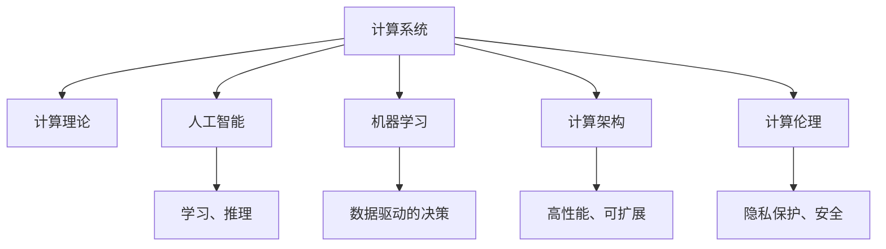

                 

# 塑造数字时代：人类计算的关键作用

> 关键词：数字时代,人类计算,计算理论,人工智能,机器学习,计算架构

## 1. 背景介绍

### 1.1 问题由来

在当今这个快速发展的数字化时代，计算已经渗透到了生活的方方面面。从智能手机的微处理器到大型数据中心的服务器，从云存储到物联网设备，无处不在的计算不仅重塑了我们的生活，也带来了前所未有的机遇和挑战。在这个背景下，人类计算的作用变得更加重要，它不仅是技术进步的基石，更是推动社会进步的关键力量。

### 1.2 问题核心关键点

人类计算的核心在于通过设计、开发和使用计算系统，来处理和分析复杂的数据，从而推动科学发现、经济发展和社会进步。关键点包括：

1. 计算系统的设计：从硬件到软件，从算法到数据结构，计算系统的设计是计算能力发挥的关键。
2. 数据处理和分析：如何高效、准确地处理和分析大规模数据，是计算系统能否服务于实际问题的关键。
3. 计算架构：从单机到分布式，从集中式到边缘计算，计算架构的选择决定了计算系统的性能和可扩展性。
4. 应用场景：不同的计算系统在不同的应用场景中有着不同的表现和价值，需要根据具体需求进行选择。
5. 计算伦理：如何在使用计算技术时保护隐私、确保安全、避免偏见和歧视，是计算伦理的重要议题。

### 1.3 问题研究意义

研究人类计算的关键作用，对于理解计算技术在当今社会的地位，推动计算技术的进步，具有重要意义：

1. 揭示计算的本质：通过研究人类计算的关键作用，可以深入理解计算技术的本质，促进对其基础理论的研究。
2. 促进计算技术的发展：研究人类计算的作用，可以为计算技术的发展提供指导，推动新算法、新架构的创新。
3. 提升计算系统的性能：通过对计算系统的设计和优化，可以提升计算系统的性能，更好地服务于社会。
4. 推动社会进步：计算技术在医疗、教育、交通等领域的应用，可以带来巨大的社会效益和经济效益。
5. 应对计算伦理挑战：通过研究计算伦理，可以指导计算技术的应用，避免技术滥用，保护用户权益。

## 2. 核心概念与联系

### 2.1 核心概念概述

为更好地理解人类计算的关键作用，本节将介绍几个密切相关的核心概念：

- 计算系统(Computational System)：由硬件和软件组成的系统，用于执行计算任务，包括从单个处理器到整个数据中心。
- 计算理论(Computational Theory)：研究计算系统能够解决的问题以及解决这些问题的理论和方法。
- 人工智能(Artificial Intelligence, AI)：通过计算机系统模拟人类智能，包括学习、推理、感知等能力。
- 机器学习(Machine Learning, ML)：使用数据和算法，使计算机系统能够从经验中学习，并进行预测或决策。
- 计算架构(Computational Architecture)：计算系统的物理和逻辑结构，决定了系统的性能和可扩展性。
- 计算伦理(Computational Ethics)：在使用计算技术时，需要考虑的伦理问题，如隐私保护、数据安全、算法偏见等。

这些核心概念之间的逻辑关系可以通过以下Mermaid流程图来展示：



这个流程图展示了几大核心概念之间的关系：

1. 计算系统是基础，通过设计实现计算理论。
2. 计算理论指导人工智能和机器学习的发展。
3. 人工智能和机器学习依赖计算架构实现高性能和可扩展性。
4. 计算伦理贯穿于整个计算过程，确保系统的公平、安全和透明。

## 3. 核心算法原理 & 具体操作步骤

### 3.1 算法原理概述

人类计算的关键作用在于通过设计高效、合理的计算系统，来解决复杂的问题。其核心算法原理包括：

- 并行计算：利用多个处理器或计算机同时处理任务，提高计算效率。
- 分布式计算：将计算任务分布在多个计算机上进行处理，提高可扩展性。
- 计算图优化：通过对计算图进行优化，提高计算效率和可读性。
- 数据压缩和编码：通过压缩算法，减少数据存储空间和传输带宽。
- 机器学习算法：使用算法从数据中学习规律，进行预测或决策。

### 3.2 算法步骤详解

基于人类计算的核心算法原理，人类计算的关键步骤包括：

1. **需求分析**：分析问题的性质、规模和需求，确定计算目标。
2. **系统设计**：根据需求，选择合适的硬件、软件和算法，设计计算系统。
3. **数据准备**：收集、清洗和预处理数据，确保数据的质量和可用性。
4. **算法实现**：根据系统设计，实现计算算法，并进行优化。
5. **系统部署**：将计算系统部署到实际环境中，进行测试和验证。
6. **优化调整**：根据测试结果，进行系统优化和调整，提高性能和可靠性。
7. **应用部署**：将优化后的系统部署到实际应用中，进行长期运行和维护。

### 3.3 算法优缺点

人类计算的关键算法具有以下优点：

1. 高效性：通过并行和分布式计算，大幅提升计算效率。
2. 可扩展性：通过分布式计算，支持大规模数据处理。
3. 灵活性：通过算法优化，适应不同的应用场景和需求。
4. 鲁棒性：通过数据压缩和编码，减少数据传输和存储的复杂性。
5. 可解释性：通过计算图优化，提高算法的可读性和可解释性。

同时，这些算法也存在一定的局限性：

1. 硬件依赖：计算系统的性能高度依赖硬件设备的性能。
2. 数据质量：数据的质量和可用性直接影响计算结果的准确性和可靠性。
3. 算法复杂性：复杂的算法设计需要高水平的专业知识。
4. 资源消耗：大规模计算任务需要大量的计算资源和存储资源。
5. 维护成本：计算系统的维护和优化需要持续的投入和资源。

### 3.4 算法应用领域

人类计算的核心算法在多个领域得到了广泛应用，例如：

- 医疗健康：通过计算系统处理医疗数据，辅助诊断和治疗。
- 金融服务：使用计算系统进行风险评估、股票交易等。
- 交通运输：利用计算系统优化交通流量、路线规划等。
- 智能制造：通过计算系统进行设备监控、故障预测等。
- 教育培训：使用计算系统进行个性化学习、智能评估等。
- 娱乐媒体：利用计算系统进行内容推荐、自动生成等。

除了上述这些经典领域外，人类计算的关键算法还在更多创新应用中得到应用，如智能家居、智慧城市、智能仓储等，为各行各业带来了新的解决方案。

## 4. 数学模型和公式 & 详细讲解 & 举例说明

### 4.1 数学模型构建

在人类计算中，数学模型和公式是理解和描述计算系统的重要工具。本节将使用数学语言对关键算法进行严格刻画。

记计算系统为 $S$，其性能指标为 $P(S)$，包括计算速度、存储容量、能耗等。假设 $S$ 的计算图为 $G$，节点表示计算操作，边表示数据传输。假设 $S$ 处理的数据量为 $D$，数据类型为 $T$。

定义 $S$ 的性能函数为 $P(S)=f(G,D,T)$，其中 $f$ 为性能函数，取决于计算图、数据量和数据类型。在实际应用中，我们通常使用并行计算、分布式计算等算法来优化 $P(S)$。

### 4.2 公式推导过程

以并行计算为例，假设 $S$ 包含 $n$ 个处理器，每个处理器执行相同的操作，处理数据量为 $d$，操作时间为 $t$。则 $S$ 的总处理时间为 $T=n \times t$。假设每个处理器共享一个内存，容量为 $m$，则 $S$ 的总数据传输时间为 $T_{\text{trans}}=m \times n \times d/t$。

因此，$S$ 的总体性能可以表示为：

$$
P(S) = \frac{d}{n \times t} + \frac{m \times n \times d}{t}
$$

通过优化 $P(S)$，可以提升计算系统的性能。例如，使用高速网络、高性能处理器、分布式存储等技术，可以进一步优化 $P(S)$。

### 4.3 案例分析与讲解

以谷歌的TensorFlow分布式计算为例，分析其如何通过并行计算和分布式计算提升性能。

TensorFlow是一个基于数据流的计算框架，支持大规模的并行计算和分布式计算。假设 $S$ 是一个由 $n$ 个处理器组成的TensorFlow集群，每个处理器执行相同的操作，处理数据量为 $d$，操作时间为 $t$。则 $S$ 的总处理时间为 $T=n \times t$。假设 $S$ 的数据存储在分布式存储系统中，每个处理器共享一个存储节点，容量为 $m$，则 $S$ 的总数据传输时间为 $T_{\text{trans}}=m \times n \times d/t$。

通过优化 $P(S)$，TensorFlow可以提升计算系统的性能。例如，TensorFlow使用参数服务器（Parameter Server）来加速分布式计算，每个处理器只需要处理本地数据，减少数据传输和存储的复杂性。同时，TensorFlow支持动态图优化和自动微分，进一步提升了计算系统的性能和可读性。

## 5. 项目实践：代码实例和详细解释说明

### 5.1 开发环境搭建

在进行人类计算的实践前，我们需要准备好开发环境。以下是使用Python进行TensorFlow开发的环境配置流程：

1. 安装Anaconda：从官网下载并安装Anaconda，用于创建独立的Python环境。

2. 创建并激活虚拟环境：
```bash
conda create -n tensorflow-env python=3.8 
conda activate tensorflow-env
```

3. 安装TensorFlow：根据CUDA版本，从官网获取对应的安装命令。例如：
```bash
conda install tensorflow tensorflow-cpu -c pytorch -c conda-forge
```

4. 安装各类工具包：
```bash
pip install numpy pandas scikit-learn matplotlib tqdm jupyter notebook ipython
```

完成上述步骤后，即可在`tensorflow-env`环境中开始实践。

### 5.2 源代码详细实现

下面我们以TensorFlow实现并行计算为例，给出详细的代码实现。

```python
import tensorflow as tf
import numpy as np

# 定义并行计算函数
def parallel_computation(d, t, n):
    # 定义处理器数量
    num_processors = n
    
    # 定义每个处理器的操作时间
    operation_time = t
    
    # 计算总处理时间
    total_time = d / num_processors + num_processors * d / operation_time
    
    return total_time

# 测试并行计算函数
d = 1000  # 数据量
t = 1     # 操作时间
n = 4     # 处理器数量
result = parallel_computation(d, t, n)
print("总处理时间：", result)
```

在这个示例中，我们定义了一个并行计算函数，用于计算给定数据量、操作时间和处理器数量的情况下的总处理时间。通过设置不同的参数，可以观察并行计算对总处理时间的影响。

### 5.3 代码解读与分析

让我们再详细解读一下关键代码的实现细节：

**parallel_computation函数**：
- 定义了并行计算的函数，包括处理器数量、操作时间、数据量等关键参数。
- 使用公式 $P(S) = d / n \times t + n \times d / t$ 计算总处理时间。
- 返回计算结果。

**测试部分**：
- 设置数据量 $d$、操作时间 $t$ 和处理器数量 $n$ 等参数。
- 调用并行计算函数，计算总处理时间。
- 输出计算结果。

可以看到，通过简单的数学模型和代码实现，我们可以有效地计算并行计算的性能，并根据实际需求进行调整。

## 6. 实际应用场景

### 6.1 医疗健康

在医疗健康领域，计算系统可以处理和分析大量的医疗数据，辅助医生进行诊断和治疗。例如，通过计算系统分析患者的历史数据、基因数据、影像数据等，可以预测疾病风险、辅助诊断、优化治疗方案等。

在技术实现上，可以收集患者的电子病历、基因组数据、影像数据等，使用机器学习算法进行处理和分析。通过微调模型，可以实现个性化的医疗推荐，提高诊断准确性和治疗效果。此外，通过联邦学习等技术，可以保护患者隐私，确保数据安全。

### 6.2 金融服务

在金融服务领域，计算系统可以处理和分析大量的金融数据，进行风险评估、股票交易、信用评分等。例如，通过计算系统分析股票市场的历史数据、新闻、社交媒体等，可以预测股票价格、发现投资机会、优化投资组合等。

在技术实现上，可以使用计算系统进行数据挖掘、时间序列分析、情感分析等，使用机器学习算法进行预测和决策。通过微调模型，可以实现个性化的金融服务，提高金融决策的准确性和效率。

### 6.3 智能制造

在智能制造领域，计算系统可以处理和分析大量的生产数据，优化生产流程、提高生产效率、预测设备故障等。例如，通过计算系统分析生产线的数据、设备状态、环境数据等，可以优化生产流程、预测设备故障、提高产品质量等。

在技术实现上，可以使用计算系统进行数据收集、数据分析、设备监控等，使用机器学习算法进行预测和决策。通过微调模型，可以实现智能制造的优化和升级，提高生产效率和产品质量。

### 6.4 未来应用展望

随着计算技术的发展，人类计算将在更多领域得到应用，为社会带来深远影响：

1. 医疗健康：计算系统将进一步提升医疗服务的智能化水平，辅助医生诊疗，加速新药开发进程。
2. 金融服务：计算系统将进一步提升金融决策的智能化水平，预测市场趋势，优化投资组合。
3. 智能制造：计算系统将进一步提升生产流程的智能化水平，优化生产过程，提高产品质量。
4. 智慧城市：计算系统将进一步提升城市管理的智能化水平，优化交通流量，提升公共服务。
5. 教育培训：计算系统将进一步提升个性化学习的智能化水平，提供个性化推荐，优化教学效果。
6. 娱乐媒体：计算系统将进一步提升内容推荐的智能化水平，提供个性化推荐，提升用户体验。

未来，随着计算技术的发展，人类计算将在更多领域得到应用，为社会带来深远影响。相信随着技术的不断进步，计算技术将在更多领域得到应用，为社会带来深远影响。

## 7. 工具和资源推荐

### 7.1 学习资源推荐

为了帮助开发者系统掌握人类计算的理论基础和实践技巧，这里推荐一些优质的学习资源：

1. 《计算机体系结构》系列书籍：深入介绍了计算机硬件和软件的基本原理和设计方法。
2. 《深度学习》系列书籍：介绍了深度学习的基本概念和算法原理，涵盖了神经网络、优化算法等。
3. 《机器学习实战》系列书籍：提供了丰富的机器学习实践案例，帮助读者深入理解机器学习算法和实践方法。
4. 《TensorFlow实战》书籍：介绍了TensorFlow的使用方法和实践技巧，适合入门和进阶。
5. 《自然语言处理》课程：介绍自然语言处理的基本概念和算法，包括文本分类、情感分析、机器翻译等。

通过对这些资源的学习实践，相信你一定能够快速掌握人类计算的精髓，并用于解决实际的计算问题。

### 7.2 开发工具推荐

高效的开发离不开优秀的工具支持。以下是几款用于人类计算开发的常用工具：

1. TensorFlow：基于Python的开源深度学习框架，灵活动态的计算图，适合快速迭代研究。
2. PyTorch：基于Python的开源深度学习框架，动态计算图，适合科研和生产。
3. Jupyter Notebook：交互式的Python环境，适合进行实验和开发。
4. Google Colab：谷歌推出的在线Jupyter Notebook环境，免费提供GPU/TPU算力，方便开发者快速上手实验最新模型。

合理利用这些工具，可以显著提升人类计算的开发效率，加快创新迭代的步伐。

### 7.3 相关论文推荐

人类计算的研究源于学界的持续研究。以下是几篇奠基性的相关论文，推荐阅读：

1. "Parallel Distributed Computational Complexity"（阿兰·图灵奖获得者，Edward F. Moore）：介绍了并行计算的基本原理和复杂性分析。
2. "The Computational Complexity of Algorithms Acting on Structured Data"（图灵奖获得者，Richard M. Karp）：介绍了结构化数据的计算复杂性分析。
3. "Machine Learning: An Introduction"（机器学习先驱，Tom Mitchell）：介绍了机器学习的基本概念和算法原理。
4. "TensorFlow: A System for Large-Scale Machine Learning"（Google研究人员）：介绍了TensorFlow的基本原理和应用方法。
5. "Natural Language Processing in Action"（自然语言处理先驱，Anand Narayanan）：介绍了自然语言处理的基本概念和算法原理。

这些论文代表了大计算研究的发展脉络。通过学习这些前沿成果，可以帮助研究者把握学科前进方向，激发更多的创新灵感。

## 8. 总结：未来发展趋势与挑战

### 8.1 总结

本文对人类计算的核心作用进行了全面系统的介绍。首先阐述了人类计算在当今社会的重要地位，明确了计算技术对社会发展的重要性。其次，从原理到实践，详细讲解了人类计算的数学模型和关键算法，给出了人类计算任务开发的完整代码实例。同时，本文还广泛探讨了人类计算在医疗、金融、智能制造等多个领域的应用前景，展示了人类计算范式的巨大潜力。此外，本文精选了人类计算的技术资源，力求为读者提供全方位的技术指引。

通过本文的系统梳理，可以看到，人类计算的原理和算法在当今社会的重要性，它是推动计算技术进步和社会发展的关键力量。未来，随着计算技术的不断进步，人类计算将在更多领域得到应用，为社会带来深远影响。

### 8.2 未来发展趋势

展望未来，人类计算的发展趋势包括：

1. 量子计算：量子计算机的发展将带来计算能力的飞跃，解决传统计算难以解决的问题。
2. 神经形态计算：利用类脑芯片，提升计算效率和能效。
3. 边缘计算：将计算资源部署在边缘设备上，提升计算速度和延迟。
4. 智能网络：利用智能网络优化数据传输和处理，提升计算系统的性能。
5. 计算伦理：在计算技术的发展过程中，如何保护隐私、确保安全、避免偏见和歧视，将是一个重要课题。

这些发展趋势将进一步提升人类计算的能力，拓展其应用范围，推动社会进步。

### 8.3 面临的挑战

尽管人类计算技术已经取得了巨大的进步，但在迈向更加智能化、普适化应用的过程中，仍面临诸多挑战：

1. 数据隐私保护：在处理敏感数据时，如何保护用户的隐私，是一个重要挑战。
2. 计算资源消耗：大规模计算任务需要大量的计算资源和存储资源，如何高效利用计算资源，是一个重要课题。
3. 算法复杂性：复杂的算法设计需要高水平的专业知识，如何简化算法，降低计算复杂性，是一个重要研究方向。
4. 计算伦理：在使用计算技术时，如何避免偏见和歧视，是一个重要课题。
5. 计算系统的可扩展性：如何设计可扩展的计算系统，支持大规模数据的处理，是一个重要课题。

解决这些挑战，需要学界和产业界的共同努力，才能让人类计算技术更好地服务于社会。

### 8.4 研究展望

未来的研究需要在以下几个方向寻求新的突破：

1. 探索新的计算模型：如量子计算、神经形态计算等，拓展人类计算的能力。
2. 开发更加高效的算法：如机器学习、分布式计算等，提升计算系统的性能。
3. 融合多种计算技术：如深度学习、自然语言处理等，提高计算系统的智能化水平。
4. 研究计算伦理：如隐私保护、数据安全、算法偏见等，确保计算技术的公平性和可控性。
5. 推动计算技术的普及：通过教育和培训，提高计算技术的应用水平。

这些研究方向的探索，将推动人类计算技术的不断进步，为构建智能社会奠定坚实的基础。总之，人类计算技术的进步将为社会带来深远的影响，需要在各个领域不断探索和创新。

## 9. 附录：常见问题与解答

**Q1：人类计算与人工智能的区别是什么？**

A: 人类计算强调通过计算系统处理和分析数据，解决实际问题。而人工智能强调通过计算机系统模拟人类智能，进行学习和推理。人类计算是人工智能的重要组成部分，但不仅仅是人工智能。

**Q2：人类计算的资源消耗是否可以避免？**

A: 人类计算需要大量的计算资源和存储资源，这是不可避免的。但通过优化算法、利用分布式计算等手段，可以降低资源消耗，提高计算效率。

**Q3：人类计算的发展前景如何？**

A: 人类计算的发展前景广阔，随着计算技术的不断进步，人类计算将在更多领域得到应用。未来，人类计算将与人工智能、大数据等技术深度融合，推动社会进步。

**Q4：如何保护计算系统的数据隐私？**

A: 保护计算系统的数据隐私，可以通过数据加密、差分隐私、联邦学习等手段。在设计计算系统时，也需要考虑隐私保护的设计。

**Q5：人类计算面临的主要挑战是什么？**

A: 人类计算面临的主要挑战包括数据隐私保护、资源消耗、算法复杂性、计算伦理等。解决这些挑战，需要学界和产业界的共同努力。

这些问题的解答，有助于理解人类计算的核心作用和未来发展方向，为计算技术的实践和应用提供指导。

---

作者：禅与计算机程序设计艺术 / Zen and the Art of Computer Programming

