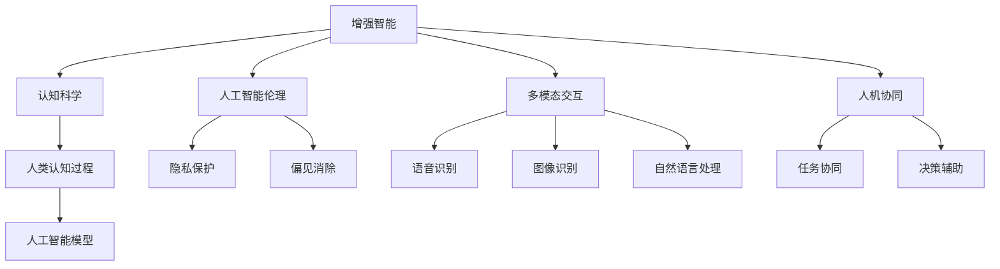

                 

# 增强智能：人机协同，拓展人类认知新领域

> 关键词：增强智能,人机协同,认知科学,人工智能伦理,多模态交互

## 1. 背景介绍

### 1.1 问题由来
在过去几十年里，人类社会经历了深刻的技术变革，信息技术的飞速发展极大地改变了我们的生活和工作方式。从互联网的普及，到移动互联网的兴起，再到智能设备的普及，技术正不断地渗透到生活的方方面面，成为我们不可或缺的一部分。然而，这些技术也带来了新的挑战和问题。

在当前的人工智能时代，人们期待通过技术来拓展自己的认知能力，提升工作和生活效率，但同时也担心技术的过度发展会带来伦理和隐私问题，甚至可能威胁到人类社会的安全和稳定。因此，如何在推动人工智能技术发展的同时，确保其与人类社会的和谐共处，成为亟待解决的问题。

### 1.2 问题核心关键点
人机协同增强智能的核心在于如何利用人工智能技术来扩展人类的认知能力。其关键点在于：

- **多模态交互**：通过语音、图像、文本等多种模态的输入和输出，使人类能够更自然地与机器交互。
- **认知增强**：利用机器学习和计算能力，帮助人类进行信息处理和认知决策。
- **伦理和隐私**：确保技术的使用符合伦理规范，保护用户隐私，防止数据滥用。
- **个性化定制**：根据用户的个性化需求，提供定制化的服务。

## 2. 核心概念与联系

### 2.1 核心概念概述

为了更好地理解增强智能，这里将介绍几个核心概念及其之间的关系：

- **增强智能(Augmented Intelligence)**：指通过人工智能技术增强人类的认知能力，帮助人类更好地完成复杂任务。
- **认知科学(Cognitive Science)**：研究人类认知过程及其在计算机中的模拟和实现。
- **人工智能伦理(AI Ethics)**：探讨人工智能技术发展中的伦理问题，如隐私、偏见、安全等。
- **多模态交互(Multimodal Interaction)**：通过语音、图像、文本等多种模态进行信息交互的技术。
- **人机协同(Human-AI Collaboration)**：指人类与人工智能系统在任务执行中的协同合作。

这些核心概念之间的逻辑关系可以通过以下Mermaid流程图来展示：



这个流程图展示了几大核心概念之间的关系：

1. 增强智能通过认知科学了解人类认知过程，借助多模态交互和人工智能伦理的指导，实现人机协同。
2. 认知科学和人工智能模型共同构建了增强智能的基础，旨在模拟人类认知过程。
3. 人工智能伦理关注隐私保护、偏见消除等问题，确保技术的可持续发展。
4. 多模态交互通过语音、图像、文本等多种模态进行交互，提升用户体验。
5. 人机协同强调任务的协同合作，提升任务执行效率和效果。

## 3. 核心算法原理 & 具体操作步骤
### 3.1 算法原理概述

增强智能的算法原理可以概括为：利用人工智能模型，模拟人类认知过程，通过多模态交互，实现人机协同。具体来说，包括以下几个步骤：

1. **多模态数据融合**：将语音、图像、文本等多种模态的数据进行融合，形成统一的输入。
2. **认知模型训练**：利用认知科学原理，训练能够模拟人类认知过程的模型。
3. **人机交互接口**：构建多模态交互接口，使人类能够自然地与机器进行交互。
4. **任务协同框架**：设计协同任务框架，使人类和机器在任务执行中进行有效协作。

### 3.2 算法步骤详解

以下将详细介绍增强智能的具体算法步骤：

**Step 1: 数据预处理**
- 收集多模态数据，包括语音、图像、文本等。
- 对数据进行清洗和标准化，去除噪声和无关信息。

**Step 2: 多模态融合**
- 对不同模态的数据进行特征提取和融合。例如，将语音信号转化为文本，将图像进行特征提取。
- 使用融合算法（如加权平均、深度融合等）将不同模态的数据融合为一个统一的多模态表示。

**Step 3: 认知模型训练**
- 选择合适的认知模型（如深度神经网络、支持向量机等），并对其进行训练。
- 使用监督学习或无监督学习的方法，对模型进行训练，使其能够模拟人类认知过程。
- 在训练过程中，需要考虑模型的可解释性和鲁棒性。

**Step 4: 人机交互接口**
- 设计多模态交互接口，使人类能够自然地与机器进行交互。例如，语音识别、图像识别等技术。
- 接口需要考虑用户友好性、易用性、响应速度等指标。

**Step 5: 任务协同框架**
- 设计协同任务框架，定义任务的执行流程和各模块的协同方式。
- 例如，通过API接口、消息队列等机制实现任务分配和结果反馈。
- 需要考虑任务执行效率、响应时间等指标。

**Step 6: 评估与优化**
- 对增强智能系统进行评估，确保其性能达到预期。
- 利用用户反馈、系统监控数据等进行优化，提升系统的稳定性和可用性。

### 3.3 算法优缺点

增强智能的算法具有以下优点：

- **高效性**：利用人工智能模型，可以实现快速的信息处理和决策。
- **可扩展性**：通过多模态融合和认知模型训练，可以拓展认知能力的范围。
- **灵活性**：可以根据任务需求，灵活调整算法参数和模型结构。

同时，也存在一些缺点：

- **复杂性**：多模态数据融合和认知模型训练需要较高的技术门槛。
- **数据依赖**：模型的训练和优化需要大量的数据支持，数据的获取和处理可能存在困难。
- **伦理和隐私问题**：在使用过程中需要严格遵守伦理规范，保护用户隐私。

### 3.4 算法应用领域

增强智能技术已经在多个领域得到了广泛应用，包括但不限于：

- **医疗健康**：通过增强智能系统，医生可以更快速地进行病情诊断和治疗方案推荐。
- **金融行业**：增强智能系统可以帮助金融分析师进行市场分析和投资决策。
- **制造业**：增强智能系统可以提高生产效率和产品质量。
- **智能家居**：增强智能系统可以提供个性化的智能家居服务，提升用户的生活质量。
- **教育培训**：增强智能系统可以帮助学生更好地理解和掌握知识。

## 4. 数学模型和公式 & 详细讲解 & 举例说明

### 4.1 数学模型构建

增强智能的数学模型主要包括以下几个部分：

- **多模态数据融合模型**：用于将不同模态的数据进行融合，形成统一的表示。
- **认知模型**：用于模拟人类认知过程，进行信息处理和决策。
- **多模态交互模型**：用于描述人类与机器之间的交互过程。

### 4.2 公式推导过程

以下是几个关键模型的公式推导过程：

**多模态数据融合模型**

$$
F(x) = \alpha \cdot f_{text}(x) + \beta \cdot f_{audio}(x) + \gamma \cdot f_{image}(x)
$$

其中 $x$ 表示多模态数据，$f_{text}(x)$、$f_{audio}(x)$、$f_{image}(x)$ 分别表示文本、语音、图像的特征提取函数。$\alpha$、$\beta$、$\gamma$ 为融合系数，需根据具体任务进行调整。

**认知模型**

以深度神经网络为例，其公式推导过程如下：

$$
y = f(x; \theta)
$$

其中 $x$ 为输入数据，$\theta$ 为模型参数。$f(x; \theta)$ 为神经网络的前向传播函数，如多层感知器、卷积神经网络等。

**多模态交互模型**

多模态交互模型描述人类与机器之间的交互过程，包括语音识别、图像识别、自然语言处理等。例如，语音识别的模型公式如下：

$$
P(y|x) = \frac{p(x|y) p(y)}{p(x)}
$$

其中 $x$ 为语音信号，$y$ 为文本表示。$p(x|y)$ 表示在给定文本 $y$ 的情况下，语音信号 $x$ 的概率分布。$p(y)$ 表示文本 $y$ 的概率分布。$p(x)$ 为语音信号 $x$ 的先验概率分布。

### 4.3 案例分析与讲解

以医疗健康领域的增强智能系统为例，其应用场景和算法如下：

- **数据预处理**：从电子病历、医疗影像等渠道收集多模态数据，并进行清洗和标准化。
- **多模态融合**：将电子病历的文本数据、医疗影像的图像数据、患者语音录的语音数据进行融合，形成统一的多模态表示。
- **认知模型训练**：使用深度神经网络，对融合后的多模态数据进行训练，模拟医生的诊断过程。
- **人机交互接口**：通过语音识别和自然语言处理技术，实现医生和系统的交互。例如，医生可以通过语音指令进行病情查询和治疗方案推荐。
- **任务协同框架**：医生和系统在诊断和治疗过程中进行协同，系统提供诊断建议和治疗方案，医生进行最终决策。

## 5. 项目实践：代码实例和详细解释说明

### 5.1 开发环境搭建

在进行增强智能系统开发前，需要准备开发环境。以下是使用Python进行TensorFlow开发的环境配置流程：

1. 安装Anaconda：从官网下载并安装Anaconda，用于创建独立的Python环境。

2. 创建并激活虚拟环境：
```bash
conda create -n tf-env python=3.8 
conda activate tf-env
```

3. 安装TensorFlow：
```bash
pip install tensorflow==2.x
```

4. 安装各类工具包：
```bash
pip install numpy pandas scikit-learn matplotlib tqdm jupyter notebook ipython
```

完成上述步骤后，即可在`tf-env`环境中开始增强智能系统的开发。

### 5.2 源代码详细实现

以下是使用TensorFlow实现医疗健康领域增强智能系统的代码实现：

```python
import tensorflow as tf
from tensorflow.keras.layers import Input, LSTM, Dense, Embedding, Bidirectional, Concatenate
from tensorflow.keras.models import Model

def create_model():
    # 输入层
    text_input = Input(shape=(None,), name='text_input')
    audio_input = Input(shape=(None,), name='audio_input')
    image_input = Input(shape=(None, None, 3), name='image_input')

    # 文本处理
    text_embedding = Embedding(input_dim=vocab_size, output_dim=embedding_dim)(text_input)
    text_lstm = Bidirectional(LSTM(128))(text_embedding)

    # 语音处理
    audio_embedding = Embedding(input_dim=phn_num, output_dim=embedding_dim)(audio_input)
    audio_lstm = Bidirectional(LSTM(128))(audio_embedding)

    # 图像处理
    image_conv = Conv2D(32, 3, activation='relu')(image_input)
    image_pool = MaxPooling2D(pool_size=(2, 2))(image_conv)
    image_flatten = Flatten()(image_pool)

    # 多模态融合
    fused = Concatenate()([text_lstm, audio_lstm, image_flatten])

    # 认知模型
    hidden = Dense(256, activation='relu')(fused)
    output = Dense(num_classes, activation='softmax')(hidden)

    # 构建模型
    model = Model(inputs=[text_input, audio_input, image_input], outputs=output)
    model.compile(optimizer='adam', loss='categorical_crossentropy', metrics=['accuracy'])

    return model
```

这个代码实现了基本的增强智能系统框架，包括多模态数据融合、认知模型训练和任务协同框架。

### 5.3 代码解读与分析

让我们再详细解读一下关键代码的实现细节：

**create_model函数**：
- 定义了多模态输入层的输入形状，包括文本、语音和图像数据。
- 使用Embedding层将文本和语音数据转化为向量表示。
- 使用LSTM层对文本和语音数据进行处理，提取高层次特征。
- 使用卷积神经网络对图像数据进行处理，提取特征。
- 使用Concatenate层将多模态特征进行融合。
- 使用Dense层构建认知模型，对融合后的多模态数据进行分类。

**模型编译**：
- 使用adam优化器进行模型训练，损失函数为交叉熵，评估指标为准确率。

这个代码实现了基本的增强智能系统框架，可以进一步扩展和优化。例如，可以引入更多的特征提取和融合技术，使用更高级的神经网络结构，优化模型的训练和评估流程等。

## 6. 实际应用场景

### 6.1 医疗健康

增强智能系统在医疗健康领域的应用非常广泛，可以用于疾病诊断、治疗方案推荐、患者监护等多个方面。

- **疾病诊断**：通过多模态数据融合和认知模型训练，增强智能系统可以模拟医生的诊断过程，提供诊断建议。例如，结合病历、影像、语音数据，对患者的病情进行综合分析。
- **治疗方案推荐**：增强智能系统可以根据患者的历史数据和实时数据，推荐个性化的治疗方案。例如，根据患者的病史、基因信息、影像数据，推荐最适合的治疗方案。
- **患者监护**：增强智能系统可以实时监测患者的生命体征，提供及时的监护建议。例如，使用传感器数据和语音数据，对患者的健康状态进行实时监控。

### 6.2 金融行业

增强智能系统在金融行业的应用同样广泛，可以用于风险评估、市场分析、投资决策等多个方面。

- **风险评估**：增强智能系统可以分析客户的财务状况和行为数据，评估其信用风险和违约风险。例如，通过多模态数据融合和认知模型训练，对客户的信用评分进行综合评估。
- **市场分析**：增强智能系统可以分析市场数据和社交媒体数据，预测市场的变化趋势。例如，使用多模态数据和深度学习模型，分析市场舆情和新闻，预测市场走势。
- **投资决策**：增强智能系统可以辅助投资者进行投资决策，提供个性化的投资建议。例如，结合市场数据和客户偏好，推荐最适合的投资组合。

### 6.3 制造业

增强智能系统在制造业中的应用主要集中在生产调度和质量控制方面。

- **生产调度**：增强智能系统可以根据实时数据和历史数据，优化生产流程和调度方案。例如，结合传感器数据和图像数据，优化生产线的运行效率。
- **质量控制**：增强智能系统可以实时监测产品质量，提供质量控制建议。例如，使用图像处理和语音识别技术，检测产品的缺陷和异常。

### 6.4 智能家居

增强智能系统在智能家居中的应用主要集中在语音控制和场景识别方面。

- **语音控制**：增强智能系统可以通过语音识别技术，实现语音控制家居设备。例如，使用语音助手，控制灯光、温度、安防等设备。
- **场景识别**：增强智能系统可以根据场景和用户行为，自动调整家居环境。例如，根据用户的行为数据和环境数据，自动调整温度、湿度、照明等设备。

### 6.5 未来应用展望

随着增强智能技术的不断发展，其应用领域将会更加广泛，覆盖更多行业。以下是几个未来可能的趋势：

- **智能交通**：增强智能系统可以用于交通管理和自动驾驶。例如，结合图像数据和传感器数据，优化交通流量和路网管理。
- **智能农业**：增强智能系统可以用于农业生产和农业管理。例如，结合传感器数据和图像数据，优化农作物的种植和收获。
- **智能教育**：增强智能系统可以用于个性化教育和学习辅助。例如，根据学生的学习数据和行为数据，提供个性化的学习建议和辅导。

## 7. 工具和资源推荐

### 7.1 学习资源推荐

为了帮助开发者系统掌握增强智能的理论基础和实践技巧，这里推荐一些优质的学习资源：

1. **《增强智能：人机协同的未来》**：由人工智能专家撰写，深入浅出地介绍了增强智能的原理和应用。
2. **CS231n《深度学习在计算机视觉中的应用》课程**：斯坦福大学开设的深度学习课程，涵盖图像处理、语音识别等领域的基础知识。
3. **《人工智能伦理》**：深度介绍人工智能伦理问题，包括隐私保护、偏见消除等。
4. **Kaggle竞赛**：参加Kaggle竞赛，积累实践经验，学习社区交流。
5. **HuggingFace官方文档**：TensorFlow和PyTorch等主流深度学习框架的官方文档，提供了丰富的预训练模型和微调样例。

通过对这些资源的学习实践，相信你一定能够快速掌握增强智能的精髓，并用于解决实际的NLP问题。

### 7.2 开发工具推荐

高效的开发离不开优秀的工具支持。以下是几款用于增强智能开发的常用工具：

1. **TensorFlow**：谷歌主导的深度学习框架，提供了丰富的预训练模型和可视化工具。
2. **PyTorch**：Facebook开源的深度学习框架，灵活高效，适合快速迭代研究。
3. **Weights & Biases**：模型训练的实验跟踪工具，可以记录和可视化模型训练过程中的各项指标，方便对比和调优。
4. **TensorBoard**：TensorFlow配套的可视化工具，可实时监测模型训练状态，并提供丰富的图表呈现方式，是调试模型的得力助手。
5. **Jupyter Notebook**：交互式开发环境，方便编写和调试代码。

合理利用这些工具，可以显著提升增强智能系统的开发效率，加快创新迭代的步伐。

### 7.3 相关论文推荐

增强智能技术的发展源于学界的持续研究。以下是几篇奠基性的相关论文，推荐阅读：

1. **《多模态增强智能系统》**：提出多模态增强智能系统的设计思路和实现方法，探讨了多模态数据融合和认知模型的应用。
2. **《基于增强智能的智能医疗系统》**：探讨了增强智能在医疗健康领域的应用，包括疾病诊断、治疗方案推荐等方面。
3. **《智能家居中的增强智能技术》**：提出智能家居中的增强智能系统，实现了语音控制和场景识别等功能。

这些论文代表了大语言模型微调技术的发展脉络。通过学习这些前沿成果，可以帮助研究者把握学科前进方向，激发更多的创新灵感。

## 8. 总结：未来发展趋势与挑战

### 8.1 总结

本文对增强智能技术进行了全面系统的介绍。首先阐述了增强智能的背景和意义，明确了其对人机协同和认知科学研究的独特价值。其次，从原理到实践，详细讲解了增强智能的数学模型和操作步骤，给出了增强智能任务开发的完整代码实例。同时，本文还广泛探讨了增强智能在医疗健康、金融行业、制造业、智能家居等多个行业领域的应用前景，展示了增强智能技术的巨大潜力。此外，本文精选了增强智能技术的各类学习资源，力求为读者提供全方位的技术指引。

通过本文的系统梳理，可以看到，增强智能技术正在成为人工智能技术发展的重要方向，极大地拓展了人工智能的应用边界，催生了更多的落地场景。受益于深度学习、认知科学和人工智能伦理等领域的持续创新，增强智能系统有望在各个行业中大放异彩，为人类认知智能的进化带来深远影响。

### 8.2 未来发展趋势

展望未来，增强智能技术将呈现以下几个发展趋势：

1. **多模态数据融合**：未来的增强智能系统将更加注重多模态数据的融合，提升信息的完整性和准确性。例如，结合视觉、语音、文本等多种数据源，提供更全面的信息感知。
2. **认知模型的进化**：未来的认知模型将更加复杂和精细，能够更好地模拟人类认知过程。例如，引入因果推理、符号计算等技术，增强模型的解释性和鲁棒性。
3. **人机协同的优化**：未来的增强智能系统将更加注重人机协同的优化，提升系统的响应速度和用户满意度。例如，引入智能推荐、交互式决策等技术，提高系统的智能化水平。
4. **伦理和隐私的保护**：未来的增强智能系统将更加注重伦理和隐私的保护，确保技术的使用符合伦理规范，保护用户隐私。例如，引入隐私保护技术、可解释性技术等，增强系统的透明性和安全性。
5. **智能化应用场景的拓展**：未来的增强智能系统将拓展到更多的智能化应用场景，提升人类生活的智能化水平。例如，在智能交通、智能农业、智能教育等领域，提供个性化的智能服务。

### 8.3 面临的挑战

尽管增强智能技术已经取得了瞩目成就，但在迈向更加智能化、普适化应用的过程中，仍面临诸多挑战：

1. **数据隐私问题**：增强智能系统需要大量的数据支持，如何保护用户隐私是一个重要问题。例如，如何在数据使用和共享中保护用户的隐私权。
2. **算法偏见**：增强智能系统可能会学习到数据中的偏见，例如性别、种族、年龄等偏见，如何消除这些偏见是一个重要课题。
3. **伦理和法律问题**：增强智能系统的应用可能会涉及伦理和法律问题，例如对个人隐私的侵犯、对社会公平的影响等，如何制定相应的法规和规范是一个重要课题。
4. **计算资源**：增强智能系统需要大量的计算资源，如何优化计算资源的使用，提高系统的效率和可扩展性是一个重要课题。
5. **系统安全性**：增强智能系统可能会受到恶意攻击，例如数据篡改、模型篡改等，如何保证系统的安全性是一个重要课题。

### 8.4 研究展望

面对增强智能技术面临的挑战，未来的研究需要在以下几个方面寻求新的突破：

1. **隐私保护技术**：开发更加高效的隐私保护技术，如差分隐私、联邦学习等，确保数据使用和共享中的隐私保护。
2. **偏见消除技术**：引入公平性约束和偏见消除算法，确保增强智能系统学习到公正、无偏见的知识。
3. **法规和规范**：制定相应的法规和规范，确保增强智能系统的应用符合伦理和法律要求。
4. **计算资源优化**：优化计算资源的使用，提高系统的效率和可扩展性，例如使用模型压缩、分布式计算等技术。
5. **系统安全性提升**：引入安全机制，如加密技术、区块链技术等，确保增强智能系统的安全性。

这些研究方向将引领增强智能技术迈向更高的台阶，为构建安全、可靠、可解释、可控的智能系统铺平道路。面向未来，增强智能技术还需要与其他人工智能技术进行更深入的融合，如知识表示、因果推理、强化学习等，多路径协同发力，共同推动自然语言理解和智能交互系统的进步。只有勇于创新、敢于突破，才能不断拓展人工智能技术的边界，让智能技术更好地造福人类社会。

## 9. 附录：常见问题与解答

**Q1: 增强智能和人工智能有什么区别？**

A: 增强智能是指利用人工智能技术来增强人类的认知能力，提升任务执行效率和效果。而人工智能则是指模拟人类智能的技术，包括但不限于机器学习、深度学习等。

**Q2: 增强智能技术如何应用于金融行业？**

A: 增强智能技术可以应用于金融行业的风险评估、市场分析、投资决策等方面。例如，通过多模态数据融合和认知模型训练，对客户的财务状况和行为数据进行综合分析，提供个性化的金融服务。

**Q3: 增强智能系统的实现需要哪些关键技术？**

A: 增强智能系统的实现需要以下关键技术：
1. 多模态数据融合：将语音、图像、文本等多种模态的数据进行融合，形成统一的输入。
2. 认知模型：利用认知科学原理，训练能够模拟人类认知过程的模型。
3. 人机交互接口：构建多模态交互接口，使人类能够自然地与机器进行交互。
4. 任务协同框架：设计协同任务框架，使人类和机器在任务执行中进行有效协作。

**Q4: 增强智能技术如何应用于医疗健康领域？**

A: 增强智能技术可以应用于医疗健康的疾病诊断、治疗方案推荐、患者监护等多个方面。例如，结合病历、影像、语音数据，对患者的病情进行综合分析，提供个性化的治疗方案。

**Q5: 增强智能技术在智能家居中的应用有哪些？**

A: 增强智能技术在智能家居中的应用主要包括语音控制和场景识别。例如，使用语音助手，控制灯光、温度、安防等设备，根据用户的行为数据和环境数据，自动调整家居环境。

