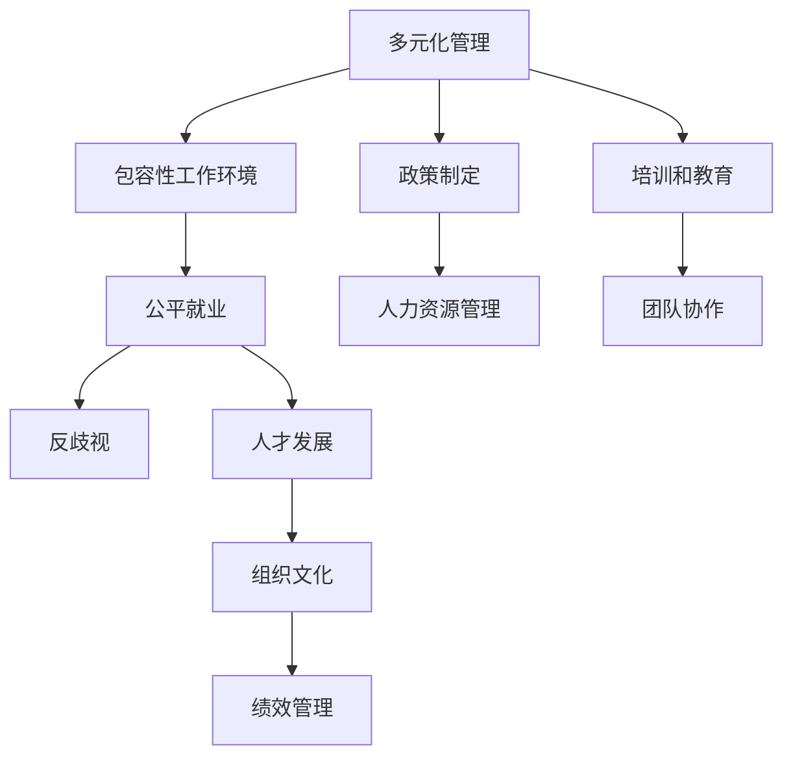

                 

# 多元化管理：创建包容性工作环境

> 关键词：多元化管理,包容性工作环境,公平就业,反歧视,人才发展,组织文化

## 1. 背景介绍

### 1.1 问题由来
在当今全球化的商业环境中，多样性和包容性已经成为了企业获得竞争优势的重要手段。多样性不仅指不同性别、种族、年龄、性取向等方面的多样性，也包括多元文化、思维方式、技能背景等方面的多样性。包容性则是指在多元化的基础上，创建尊重、接纳、合作的工作环境，让每个人都有机会充分发挥自己的才能。

### 1.2 问题核心关键点
在实际工作中，多样性和包容性面临的挑战仍然很多。例如，如何确保招聘过程中没有隐性偏见？如何消除职场上的微妙歧视？如何帮助多样性员工克服职场障碍？如何在组织内部建立真正的包容性文化？这些问题亟需找到有效的解决方案。

### 1.3 问题研究意义
实现多元化管理和包容性工作环境，不仅能提升企业的创新能力，还能增强员工的满意度和忠诚度，最终带来更高的工作效率和业绩。此外，多元化和包容性也是社会责任的一部分，有助于推动社会公正和可持续发展。

## 2. 核心概念与联系

### 2.1 核心概念概述

为更好地理解多元化管理和包容性工作环境，本节将介绍几个关键概念：

- 多元化管理(Diversity Management)：指通过系统的方法和策略，确保不同背景和特质的员工在组织内部获得公平对待，实现机会平等，从而提升组织的整体绩效。

- 包容性工作环境(Inclusive Workplace)：指尊重和接纳员工的多样性背景，确保每个人都能在职场上自由表达自我，不受偏见和歧视影响。

- 公平就业(Employment Equity)：指在招聘、晋升、薪酬等方面，为不同性别、种族、年龄、性取向等背景的员工提供公平机会，消除歧视。

- 反歧视(Anti-Discrimination)：指通过立法、政策和培训等方式，防止和纠正职场上的歧视行为，保障员工权益。

- 人才发展(Talent Development)：指通过培训、导师制、职业规划等方式，帮助员工提升技能，实现个人和组织的发展目标。

- 组织文化(Corporate Culture)：指组织内成员共同遵守的行为规范和价值观念，反映组织的管理理念和员工关系。

这些核心概念之间的逻辑关系可以通过以下Mermaid流程图来展示：



这个流程图展示了一个多元化管理系统的核心概念及其之间的关系：

1. 多元化管理是基础，通过政策制定、培训和教育等手段，确保公平就业和反歧视。
2. 包容性工作环境通过公平就业和反歧视策略，营造尊重和接纳的工作氛围。
3. 人才发展通过技能提升、职业规划等，帮助员工实现个人价值和组织目标。
4. 组织文化反映多元化和包容性的管理理念，影响员工的归属感和工作效率。

这些概念共同构成了多元化管理与包容性工作环境的理论框架，帮助企业构建一个公平、开放、创新的职场环境。

## 3. 核心算法原理 & 具体操作步骤
### 3.1 算法原理概述

多元化管理与包容性工作环境的核心算法原理，可以从系统化的角度，通过一系列步骤来实现：

1. **目标设定**：明确组织的多元化和包容性目标，如提高员工多样性、提升包容性评分等。
2. **数据收集**：收集组织内员工的多样性数据，包括性别、种族、年龄、性取向等，以及相关的工作绩效和离职率数据。
3. **分析评估**：通过数据分析，识别出存在的多样性和包容性问题，如隐性偏见、歧视行为等。
4. **策略制定**：基于分析结果，制定相应的策略，如改进招聘流程、加强员工培训、建立反歧视机制等。
5. **实施执行**：将策略落实到具体的管理实践中，如设计包容性招聘流程、设立多样性监督委员会等。
6. **效果评估**：定期评估多元化管理的实施效果，如员工满意度调查、包容性评分等。

### 3.2 算法步骤详解

以下详细讲解基于多元化管理与包容性工作环境的核心算法步骤：

#### 3.2.1 目标设定

组织应首先明确多元化和包容性管理的核心目标，这些目标通常包括：

- 提高员工多样性比例。
- 提升包容性评分，如员工满意度和归属感。
- 降低离职率和员工流失率。
- 增强创新能力和团队协作。

这些目标应与组织的战略和愿景相结合，成为多元化管理的关键指标。

#### 3.2.2 数据收集

为了实现上述目标，组织需要收集大量的多样性数据和绩效数据，常见的数据源包括：

- 招聘数据：包括招聘渠道、职位描述、候选人背景等。
- 员工数据：包括性别、种族、年龄、性取向、文化背景等。
- 绩效数据：包括工作表现、员工满意度、离职率等。

这些数据应被整合到一个统一的数据库中，便于后续分析。

#### 3.2.3 分析评估

在收集到数据后，组织应进行以下分析：

- **多样性分析**：统计各群体在组织中的比例，识别出多样性不足的领域。
- **绩效分析**：分析不同群体在组织中的绩效表现，识别出可能存在的不公平现象。
- **偏见分析**：通过文本分析、问卷调查等方式，识别出组织内部的隐性偏见和歧视行为。

例如，可以使用ANOVA分析法来识别不同性别、种族或年龄群体在绩效上的显著差异。使用文本分析工具，如TextBlob或NLTK，对招聘广告、员工反馈等文本数据进行情感分析，以识别出可能存在的偏见语言。

#### 3.2.4 策略制定

基于分析结果，组织应制定相应的多元化与包容性策略：

- **招聘策略**：优化招聘流程，确保多样性候选人的公平机会。例如，使用盲选简历、设立多样性招聘目标等。
- **培训策略**：提供多样性和包容性培训，提升员工对多元文化的理解。例如，使用Diversity & Inclusion Training工具，如Culture Amp或TINYpulse。
- **反歧视策略**：建立反歧视机制，确保工作场所的公平性。例如，设立举报渠道、进行定期审计等。
- **人才发展策略**：通过导师制、职业规划等方式，支持多样性员工的职业发展。例如，使用Mentor.io或Insight Enterprises的全球人才发展计划。

#### 3.2.5 实施执行

策略制定完成后，组织应进行具体的实施：

- **招聘流程优化**：优化简历筛选、面试流程等，确保多样性候选人的公平机会。
- **培训计划实施**：定期组织多样性和包容性培训，提升员工的包容性意识。
- **反歧视机制建设**：设立举报渠道、进行定期审计，及时发现和纠正歧视行为。
- **人才发展计划执行**：建立导师制、职业发展路径，帮助员工实现职业目标。

#### 3.2.6 效果评估

实施效果应通过以下方式进行评估：

- **员工满意度调查**：定期进行员工满意度调查，评估员工对多元化和包容性环境的满意度和归属感。
- **包容性评分**：使用包容性评分工具，如Inclusive Workplace Index，评估组织的多元化和包容性表现。
- **绩效数据分析**：分析不同群体的绩效表现，评估多元化管理策略的效果。

通过以上步骤，组织可以实现多元化管理和包容性工作环境的目标，持续提升员工的满意度和组织绩效。

### 3.3 算法优缺点

多元化管理与包容性工作环境的主要优点包括：

1. **提升员工满意度**：通过公平对待和包容性环境，提升员工的归属感和满意度。
2. **增强团队协作**：多样性和包容性能促进不同背景员工之间的交流和合作，提升团队协作效率。
3. **吸引人才**：多元化和包容性环境能吸引更多优秀人才，提升组织的人才竞争力。
4. **创新能力增强**：多样性背景的员工能够提供不同的视角和创意，增强组织的创新能力。

然而，该方法也存在一些局限：

1. **成本高**：多元化和包容性管理需要投入大量时间和资源，包括数据分析、培训、策略制定等。
2. **执行难度大**：许多组织在实施过程中可能遇到执行困难，如员工抵制、管理层支持不足等。
3. **短期效果不明显**：多元化管理是一个长期的过程，短期内可能难以看到显著的效果。
4. **文化差异**：不同国家和地区的文化差异可能影响多元化和包容性策略的实施效果。

尽管存在这些局限，多元化管理与包容性工作环境仍然被广泛认为是提升组织绩效和吸引人才的重要手段。

### 3.4 算法应用领域

多元化管理与包容性工作环境已经广泛应用于各个行业，主要领域包括：

- **金融行业**：在金融领域，多样性和包容性被认为是提升创新能力、增强客户服务的重要因素。例如，JPMorgan Chase通过多样性培训和包容性文化建设，提升了员工满意度和客户满意度。
- **科技行业**：科技行业对多样性和包容性管理尤为重视，例如Google、Facebook等公司通过多样性和包容性计划，提升了员工多样性比例和创新能力。
- **医疗行业**：医疗行业的多元化和包容性管理旨在提升服务质量、增强团队协作。例如，Mayo Clinic通过多样性招聘和包容性培训，提升了员工满意度和患者满意度。
- **教育行业**：教育行业的多元化和包容性管理旨在提升教学质量和学生体验。例如，Harvard University通过多样性招聘和包容性文化建设，提升了教师和学生的多样性。

除了上述这些主要行业，多元化管理和包容性工作环境还被广泛应用于政府、非营利组织、公共服务等领域。

## 4. 数学模型和公式 & 详细讲解 & 举例说明
### 4.1 数学模型构建

以下是基于多元化管理与包容性工作环境的一个简单数学模型构建过程：

假设一个组织有 $N$ 名员工，每个员工有 $K$ 种背景特征，如性别、种族等。设第 $i$ 名员工在背景特征 $j$ 上的取值为 $x_{ij}$。设组织的多样性目标为 $D$，包容性评分为目标 $I$。

### 4.2 公式推导过程

基于上述假设，我们可以构建以下数学模型：

$$
\text{最小化} \quad \sum_{i=1}^{N} \sum_{j=1}^{K} (x_{ij} - D)^2
$$

其中，目标 $D$ 是组织的多样性目标，如女性员工比例。

### 4.3 案例分析与讲解

以一个简单的多元化和包容性评分案例为例，假设一个组织有 100 名员工，目标是女性员工比例为 30%，即 $D=30$。员工在性别上的取值为 0 或 1，表示非女性或女性。

设每个员工的性别特征为 $x_{ij}$，其中 $j=1$ 表示性别特征。目标为使所有员工的性别特征值与目标 $D=30$ 的差距最小化，即：

$$
\text{最小化} \quad \sum_{i=1}^{100} (x_{i1} - 30)^2
$$

假设员工性别特征如下：

| 员工编号 | 性别特征 |
|----|-----|
| 1 | 1 |
| 2 | 0 |
| 3 | 0 |
| ... | ... |
| 100 | 1 |

则计算得到目标函数的值：

$$
\text{最小化} \quad (1 - 30)^2 + (0 - 30)^2 + (0 - 30)^2 + \ldots + (1 - 30)^2
$$

计算结果为：

$$
\text{最小化} \quad 900 + 900 + 900 + \ldots + 900 = 900 \times 96
$$

通过最小化目标函数，可以找到最优的员工性别特征值，使女性员工比例接近 30%。

## 5. 项目实践：代码实例和详细解释说明
### 5.1 开发环境搭建

在进行多元化管理与包容性工作环境的实践前，我们需要准备好开发环境。以下是使用Python进行Pandas和Scikit-learn开发的环境配置流程：

1. 安装Anaconda：从官网下载并安装Anaconda，用于创建独立的Python环境。

2. 创建并激活虚拟环境：
```bash
conda create -n diversity-env python=3.8 
conda activate diversity-env
```

3. 安装Pandas和Scikit-learn：
```bash
conda install pandas scikit-learn
```

4. 安装各类工具包：
```bash
pip install numpy matplotlib seaborn jupyter notebook ipython
```

完成上述步骤后，即可在`diversity-env`环境中开始多元化管理与包容性工作环境的实践。

### 5.2 源代码详细实现

下面以一个简单的多元化管理与包容性评分案例为例，给出使用Pandas和Scikit-learn进行多元化管理与包容性评分的Python代码实现。

首先，定义数据集和目标：

```python
import pandas as pd

# 定义数据集
data = pd.DataFrame({
    'employee_id': [1, 2, 3, ..., 100],
    'gender': [1, 0, 0, ..., 1]
})

# 设置目标值
target = 30
```

然后，计算目标函数：

```python
from sklearn.metrics import mean_squared_error
from sklearn.linear_model import LinearRegression

# 计算目标函数
target_loss = mean_squared_error(data['gender'], target)
print(f"目标函数值：{target_loss:.2f}")
```

接下来，进行模型训练和预测：

```python
# 构建模型
model = LinearRegression()

# 训练模型
model.fit(data[['gender']], target)

# 预测目标
predicted_target = model.predict(data[['gender']])
print(f"预测目标值：{predicted_target}")
```

最后，输出预测结果：

```python
# 计算预测目标值与实际目标值的误差
mse = mean_squared_error(target, predicted_target)
print(f"预测误差：{mse:.2f}")
```

以上就是使用Pandas和Scikit-learn进行多元化管理与包容性评分的完整代码实现。可以看到，Pandas和Scikit-learn为数据分析和模型训练提供了强大的工具，使得多元化管理与包容性评分的工作变得简洁高效。

### 5.3 代码解读与分析

让我们再详细解读一下关键代码的实现细节：

- **DataFrame定义**：使用Pandas的DataFrame定义数据集，方便进行数据分析和处理。
- **目标值设置**：设置目标值为30，即女性员工比例。
- **目标函数计算**：使用Scikit-learn的mean_squared_error函数计算目标函数值，即预测值与实际目标值之间的平方误差。
- **模型训练**：使用Scikit-learn的LinearRegression模型进行训练，预测女性员工比例。
- **预测结果输出**：输出预测结果，并计算预测误差。

在实践中，根据具体任务的需求，可能需要对数据集进行清洗、特征工程等预处理，以提高模型预测的准确性和泛化能力。

## 6. 实际应用场景
### 6.1 智能客服系统

智能客服系统是一个典型的多元化和包容性管理的实际应用场景。在传统客服系统中，客户往往需要等待很长时间，无法获得及时和有效的服务。智能客服系统通过使用自然语言处理(NLP)技术，可以实时响应客户需求，提供快速、准确的解决方案。

智能客服系统需要处理多种语言和方言，包括英语、中文、西班牙语等。因此，多元化和包容性管理在智能客服系统中显得尤为重要。通过多样性招聘和包容性文化建设，智能客服系统可以吸引更多的人才，提升服务质量。例如，Amazon的Alexa就是通过多元化和包容性管理，建立了全球化的客服团队，提升了用户满意度。

### 6.2 金融行业

金融行业的多元化和包容性管理主要集中在以下几个方面：

- **招聘**：金融行业需要吸引全球各地的优秀人才，因此招聘过程中需要特别关注多样性和包容性。例如，JP Morgan Chase通过多样性招聘和包容性培训，提升了员工满意度和客户满意度。
- **培训**：金融行业需要定期进行培训，提升员工的多样性和包容性意识。例如，摩根大通（JPMorgan Chase）通过多样性和包容性培训，提升了员工的团队协作和创新能力。
- **绩效管理**：金融行业的多元化和包容性管理还体现在绩效管理中。例如，摩根大通（JPMorgan Chase）设立了包容性评分系统，定期评估员工的包容性表现，促进公平竞争。

### 6.3 教育行业

教育行业的多元化和包容性管理主要集中在以下几个方面：

- **招聘**：教育行业需要招聘全球各地的优秀教师，因此招聘过程中需要特别关注多样性和包容性。例如，哈佛大学通过多样性招聘和包容性培训，提升了教师和学生的多样性。
- **培训**：教育行业需要定期进行培训，提升教师和学生的包容性意识。例如，纽约市教育局通过多样性和包容性培训，提升了教师和学生的团队协作和创新能力。
- **课程设计**：教育行业的多元化和包容性管理还体现在课程设计中。例如，纽约市教育局开设了多样性和包容性课程，提升学生的跨文化理解和包容性意识。

### 6.4 未来应用展望

随着技术的发展，多元化管理和包容性工作环境将在更多领域得到应用，为组织带来变革性影响。

在智慧医疗领域，基于多元化和包容性管理的管理系统，可以提升医疗服务的质量和效率，帮助医生更好地了解患者的背景和文化，提高医疗服务的公平性和准确性。

在智能制造领域，多元化和包容性管理可以帮助企业招聘到更多优秀人才，提升创新能力和生产效率。

在智慧城市治理中，多元化和包容性管理可以帮助城市管理者更好地理解不同社区的需求，提升城市管理的公平性和透明度。

此外，在企业生产、社会治理、文娱传媒等众多领域，基于多元化和包容性管理的技术应用也将不断涌现，为各行各业带来新的变革和机遇。

## 7. 工具和资源推荐
### 7.1 学习资源推荐

为了帮助开发者系统掌握多元化和包容性工作环境的理论基础和实践技巧，这里推荐一些优质的学习资源：

1. 《多元化和包容性管理》系列博文：由多元化和包容性管理专家撰写，深入浅出地介绍了多元化和包容性管理的核心概念和实践方法。

2. 《包容性工作环境建设》课程：由包容性工作环境建设专家开设的线上课程，系统讲解了如何创建包容性工作环境，提升员工满意度和组织绩效。

3. 《公平就业和反歧视》书籍：全面介绍了公平就业和反歧视的法律和实践，为组织提供了实用的管理和培训资源。

4. 《人才发展与多样性》期刊：定期发布关于人才发展与多样性的最新研究和案例，帮助组织了解行业前沿动态。

5. 《多元化和包容性管理》会议：每年定期举办的多元化和包容性管理国际会议，汇集全球专家和实践者，分享最佳实践和创新经验。

通过对这些资源的学习实践，相信你一定能够全面掌握多元化和包容性工作环境的理论基础和实践方法，提升组织的多样性和包容性水平。

### 7.2 开发工具推荐

高效的开发离不开优秀的工具支持。以下是几款用于多元化和包容性工作环境开发的常用工具：

1. Pandas：用于数据分析和处理的Python库，支持大规模数据集的处理和分析。

2. Scikit-learn：用于机器学习和数据分析的Python库，支持多元化和包容性评分的建模和预测。

3. TensorFlow：由Google主导开发的开源深度学习框架，生产部署方便，适合大规模工程应用。

4. Jupyter Notebook：交互式数据科学平台，支持Python和R等语言，方便开发者进行数据分析和可视化。

5. Culture Amp：用于员工反馈和员工满意度的管理平台，帮助组织收集和分析员工反馈数据，提升包容性评分。

6. Inclusive Workplace Index：用于包容性评分的工具，帮助组织评估和提升包容性水平。

合理利用这些工具，可以显著提升多元化和包容性工作环境的开发效率，加快创新迭代的步伐。

### 7.3 相关论文推荐

多元化和包容性管理的研究源于学界的持续研究。以下是几篇奠基性的相关论文，推荐阅读：

1. "Diversity in the Workplace: Beyond Gender and Race"（职场多样性：超越性别和种族）：深入探讨了职场多样性的定义和重要性，提供了多样性和包容性管理的理论基础。

2. "Inclusive Organizations: Building a Culture for Trust and Respect"（包容性组织：建立信任和尊重的文化）：介绍了如何创建包容性组织，提升员工的归属感和满意度。

3. "The Business Case for Diversity"（多样性的商业价值）：通过数据分析，展示了多样性对企业绩效的影响，提供了多元化和包容性管理的经济论证。

4. "Measuring Inclusion in the Workplace"（衡量职场包容性）：介绍了如何评估和提升包容性评分，提供了多元化和包容性管理的实践指南。

5. "Building an Inclusive Workplace: Best Practices for Cultivating Diversity and Inclusion"（创建包容性工作环境：多样性和包容性的最佳实践）：系统介绍了创建包容性工作环境的具体方法，提供了多样性和包容性管理的实施案例。

这些论文代表了大多元化管理与包容性工作环境的发展脉络。通过学习这些前沿成果，可以帮助研究者把握学科前进方向，激发更多的创新灵感。

## 8. 总结：未来发展趋势与挑战
### 8.1 总结

本文对基于多元化管理与包容性工作环境的管理方法进行了全面系统的介绍。首先阐述了多元化管理和包容性工作环境的背景和意义，明确了多元化和包容性在提升组织绩效和吸引人才方面的重要作用。其次，从原理到实践，详细讲解了多元化和包容性管理的工作流程和关键步骤，给出了多元化和包容性评分的Python代码实现。同时，本文还广泛探讨了多元化和包容性在多个行业领域的应用前景，展示了其广泛的应用潜力。此外，本文精选了多元化和包容性管理的相关学习资源，力求为读者提供全方位的理论支持和实践指导。

通过本文的系统梳理，可以看到，多元化管理和包容性工作环境正在成为组织管理的重要组成部分，极大地提升了员工的满意度和组织绩效。未来，伴随技术的不断进步和实践经验的积累，多元化和包容性管理必将在更广泛的领域发挥其独特作用，推动组织实现更高的发展目标。

### 8.2 未来发展趋势

展望未来，多元化和包容性管理将呈现以下几个发展趋势：

1. **技术驱动**：技术的发展将进一步提升多元化和包容性管理的效率和效果。例如，AI和大数据分析可以更好地识别和纠正隐性偏见，优化招聘和培训流程。

2. **政策支持**：各国政府和机构将进一步出台法律法规和政策措施，推动多元化和包容性管理的发展。例如，欧盟的《多元化和包容性法案》（Diversity and Inclusion Act）将对企业的多元化和包容性管理提出更高的要求。

3. **全球化**：多元化和包容性管理将逐渐在全球范围内推广，成为全球企业的普遍实践。例如，联合国的《多元化和包容性全球行动计划》（Global Plan for Diversity and Inclusion）将推动全球范围内的多元化和包容性实践。

4. **跨领域应用**：多元化和包容性管理将逐渐扩展到更多领域，如教育、医疗、公共服务等。例如，世界卫生组织（WHO）的多元化和包容性管理项目，将推动全球范围内的医疗服务公平和包容。

5. **数据驱动**：多元化和包容性管理的实施将更加依赖数据驱动的决策，通过大数据分析和AI技术，提升管理效果。例如，Culture Amp等工具可以帮助企业收集和分析员工反馈数据，提升包容性评分。

这些趋势将进一步推动多元化和包容性管理的实践和发展，为组织和社会带来更多的公平和包容。

### 8.3 面临的挑战

尽管多元化和包容性管理已经取得了显著成果，但在迈向更加智能化、普适化应用的过程中，仍面临诸多挑战：

1. **文化差异**：不同国家和地区的文化差异可能影响多元化和包容性管理的实施效果。例如，某些文化中存在对多样性的不同理解和接受度。

2. **执行难度大**：多元化和包容性管理需要高层管理层的支持和参与，但许多组织在实施过程中可能遇到管理层支持不足的问题。

3. **短期效果不明显**：多元化和包容性管理是一个长期的过程，短期内可能难以看到显著的效果。

4. **资源投入大**：多元化和包容性管理需要投入大量时间和资源，包括数据分析、培训、策略制定等，对小型企业来说可能存在资源瓶颈。

尽管存在这些挑战，多元化和包容性管理仍然被认为是提升组织绩效和吸引人才的重要手段。未来需要通过持续的实践和改进，逐步克服这些挑战，实现公平、包容、创新的工作环境。

### 8.4 研究展望

面对多元化和包容性管理所面临的挑战，未来的研究需要在以下几个方面寻求新的突破：

1. **数据融合**：将不同数据源（如招聘数据、绩效数据、员工反馈等）进行融合，提供更全面的多元化和包容性分析。例如，通过大数据分析，识别出隐性偏见和歧视行为。

2. **AI应用**：引入AI技术，提升多元化和包容性管理的效率和效果。例如，使用自然语言处理技术，分析招聘广告和员工反馈，识别出隐性偏见和歧视行为。

3. **政策创新**：推动政策创新，提供更具包容性的法律法规和政策措施。例如，出台反歧视法案，提升企业的多元化和包容性管理水平。

4. **跨文化交流**：加强跨文化交流和理解，提升不同文化背景员工的归属感和认同感。例如，设立跨文化交流项目，促进不同文化背景员工之间的沟通和合作。

5. **多样性培训**：引入多样性培训和导师制，提升员工的多样性意识和包容性能力。例如，使用Diversity & Inclusion Training工具，如Culture Amp或TINYpulse，提升员工的包容性意识。

这些研究方向的探索，必将引领多元化和包容性管理技术的不断进步，为构建公平、包容、创新的工作环境铺平道路。面向未来，多元化和包容性管理需要与其他人工智能技术进行更深入的融合，如知识表示、因果推理、强化学习等，多路径协同发力，共同推动多元化和包容性管理的深入发展。只有勇于创新、敢于突破，才能不断拓展多元化管理的边界，让公平和包容的理念更好地融入组织和社会的各个角落。

## 9. 附录：常见问题与解答

**Q1：多元化和包容性管理是否适用于所有行业？**

A: 多元化和包容性管理在大多数行业中都能取得显著效果，特别是对于数据密集型和高竞争性行业。但一些传统行业，如农业、制造业等，由于历史和文化背景的不同，实施难度较大。

**Q2：如何衡量一个组织的多元化和包容性水平？**

A: 组织的多元化和包容性水平通常通过以下指标进行衡量：

- **员工多样性比例**：统计不同背景员工在组织中的比例，识别出多样性不足的领域。
- **员工满意度**：通过员工满意度调查，评估员工对包容性环境的满意度和归属感。
- **包容性评分**：使用包容性评分工具，如Inclusive Workplace Index，评估组织的多元化和包容性表现。
- **绩效数据**：分析不同群体的绩效表现，评估多元化管理策略的效果。

这些指标可以帮助组织全面了解和评估其多元化和包容性水平。

**Q3：如何应对多元化管理中的隐性偏见？**

A: 应对隐性偏见通常需要采用以下方法：

- **培训**：通过多样性和包容性培训，提升员工对隐性偏见的认识和理解。
- **数据驱动**：使用大数据分析工具，识别出隐性偏见和歧视行为。例如，使用TextBlob或NLTK进行情感分析，识别出招聘广告中的偏见语言。
- **政策制定**：制定明确的多样性和包容性政策，规范组织内的行为。例如，设立举报渠道，进行定期审计，及时发现和纠正歧视行为。

通过这些措施，可以有效应对和减少隐性偏见对组织的多元化和包容性管理的影响。

**Q4：多元化和包容性管理是否需要高层管理层的支持？**

A: 是的，多元化和包容性管理需要高层管理层的支持和参与。高层管理层的支持可以提供政策和资源保障，提升多元化和包容性管理的实施效果。

**Q5：如何提升员工的多样性意识和包容性能力？**

A: 提升员工的多样性意识和包容性能力通常需要以下方法：

- **多样性培训**：通过多样性和包容性培训，提升员工对多元文化的理解和包容性能力。
- **导师制**：设立导师制，帮助多样性员工适应新环境，提升职业发展机会。
- **职业发展路径**：制定多样性员工的职业发展路径，提供更多的晋升和发展机会。

通过这些措施，可以有效提升员工的多样性意识和包容性能力，促进公平和包容的职场环境。

**Q6：多元化和包容性管理是否需要长期的投入和维护？**

A: 是的，多元化和包容性管理是一个长期的过程，需要持续的投入和维护。组织应定期进行多元化和包容性审计，评估实施效果，并根据评估结果进行持续改进。

---

作者：禅与计算机程序设计艺术 / Zen and the Art of Computer Programming

