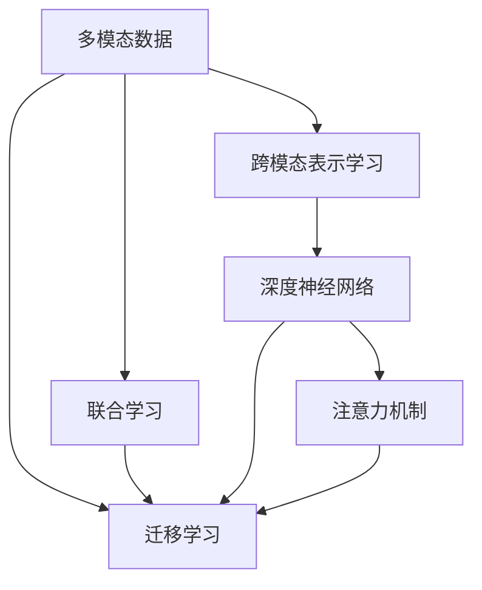

                 

# 多模态AI：图像、音频和文本的融合

> 关键词：多模态AI, 多模态学习, 计算机视觉, 自然语言处理, 语音识别, 跨模态融合, 混合表示, 深度学习, 迁移学习, 多模态表示学习

## 1. 背景介绍

### 1.1 问题由来
在现代信息技术高速发展的背景下，人工智能（AI）正逐步成为各行各业的关键驱动力。人工智能的一个重要分支——多模态AI（Multi-modal AI），即融合图像、音频、文本等多种模态数据的AI技术，正在被越来越多的公司和研究机构所重视。随着深度学习技术的发展，尤其是深度神经网络的应用，使得多模态数据之间的融合变得更加高效和精确。

近年来，随着计算机视觉、自然语言处理（NLP）、语音识别等技术的迅猛发展，人们开始认识到不同模态数据之间的互补性，并尝试将这些技术进行融合，形成更加强大的多模态AI系统。例如，文本+图像的融合可以实现更准确的图像描述、图像标注，语音+图像的融合可以实现更自然的语音指令识别和交互，文本+语音的融合可以实现智能对话系统等。

### 1.2 问题核心关键点
多模态AI的核心在于如何有效融合不同模态的数据，使得机器能够理解和处理多模态信息，从而提升其在各种实际应用中的表现。主要包括以下几个关键问题：

1. **跨模态表示学习**：将不同模态的数据映射到同一个低维空间中，使得这些数据能够在同一维度上进行比较和融合。
2. **联合学习与迁移学习**：在不同模态间进行联合学习，或将一个模态的知识迁移到另一个模态中，以提升模型的泛化能力。
3. **多模态数据预处理**：对不同模态的数据进行适当的预处理和标准化，使其能够有效地输入到深度神经网络中进行训练。
4. **多模态数据融合算法**：设计有效的算法将不同模态的数据进行融合，形成更加全面和准确的多模态表示。

### 1.3 问题研究意义
多模态AI技术的应用场景十分广泛，包括智能医疗、自动驾驶、智能家居、智慧城市等领域。通过融合多模态数据，可以显著提升系统的智能化水平和用户体验。

在智能医疗领域，多模态AI可以结合医学影像、电子病历和患者文本信息，提供更加准确的疾病诊断和个性化治疗方案。在自动驾驶领域，通过融合相机、雷达、激光雷达等传感器数据，可以实现更加安全、精准的驾驶决策。在智能家居领域，多模态AI可以结合语音、图像和传感器数据，实现更加智能和互动的家庭管理。

## 2. 核心概念与联系

### 2.1 核心概念概述

为更好地理解多模态AI的原理和架构，本节将介绍几个核心概念：

- **多模态数据**：指包含不同模态信息的数据，如文本、图像、音频等。
- **跨模态表示学习**：将不同模态的数据映射到同一个低维空间中，以实现数据之间的有效融合和比较。
- **联合学习**：对不同模态的数据同时进行训练，以提高模型的泛化能力和鲁棒性。
- **迁移学习**：将一个模态的知识迁移到另一个模态中，以实现跨模态的优化和提升。
- **深度神经网络**：基于深度学习技术构建的神经网络，用于处理多模态数据和生成多模态表示。
- **注意力机制**：一种机制，用于在多模态数据中提取重要的信息并进行加权，以提升融合效果。

这些核心概念之间的逻辑关系可以通过以下Mermaid流程图来展示：



这个流程图展示了多模态数据与不同学习方式的关联关系：

1. 多模态数据通过跨模态表示学习被映射到一个低维空间。
2. 通过联合学习和迁移学习，不同模态之间的知识进行转移和优化。
3. 深度神经网络用于处理和融合多模态数据，形成多模态表示。
4. 注意力机制用于增强重要信息的提取，提升融合效果。

这些概念共同构成了多模态AI的学习框架，使其能够在各种场景下发挥强大的多模态数据处理能力。通过理解这些核心概念，我们可以更好地把握多模态AI的工作原理和优化方向。

## 3. 核心算法原理 & 具体操作步骤
### 3.1 算法原理概述

多模态AI的核心算法原理是多模态表示学习和联合学习。其核心思想是将不同模态的数据通过某种方式映射到同一个低维空间中，使得这些数据能够在同一维度上进行比较和融合。具体的算法流程如下：

1. **数据预处理**：对不同模态的数据进行适当的预处理，如标准化、归一化等，使其能够有效地输入到深度神经网络中进行训练。
2. **特征提取**：使用深度神经网络对不同模态的数据进行特征提取，形成高维的特征表示。
3. **跨模态映射**：使用跨模态表示学习方法，将不同模态的特征表示映射到一个低维空间中，实现数据之间的融合。
4. **联合学习**：对不同模态的数据同时进行训练，以提高模型的泛化能力和鲁棒性。
5. **注意力机制**：通过注意力机制，对不同模态的信息进行加权，以提升融合效果。

### 3.2 算法步骤详解

以下是详细的多模态AI算法步骤：

**Step 1: 数据预处理**
- 对文本进行分词、去除停用词、词形还原等处理，形成文本向量表示。
- 对图像进行裁剪、缩放、归一化等处理，形成图像特征向量。
- 对音频进行分帧、特征提取（如MFCC、Mel频谱等），形成音频特征向量。

**Step 2: 特征提取**
- 使用卷积神经网络（CNN）对图像进行特征提取，形成高维的特征向量。
- 使用循环神经网络（RNN）或Transformer对文本进行特征提取，形成高维的特征向量。
- 使用长短时记忆网络（LSTM）或双向LSTM对音频进行特征提取，形成高维的特征向量。

**Step 3: 跨模态映射**
- 使用跨模态表示学习算法（如最大似然估计、多模态嵌入等），将不同模态的特征向量映射到一个低维空间中，形成多模态表示。
- 常用的跨模态表示学习方法包括多模态嵌入、多模态VAE等。

**Step 4: 联合学习**
- 对不同模态的数据同时进行训练，以提高模型的泛化能力和鲁棒性。
- 常用的联合学习方法包括混合神经网络、多任务学习等。

**Step 5: 注意力机制**
- 使用注意力机制（如Softmax、Additive Attention等）对不同模态的信息进行加权，以提升融合效果。
- 常用的注意力机制包括注意力池化、双向注意力等。

**Step 6: 模型优化**
- 使用优化算法（如SGD、Adam等）对模型进行优化，最小化损失函数，提升模型性能。
- 常用的损失函数包括交叉熵损失、均方误差损失等。

### 3.3 算法优缺点

多模态AI算法具有以下优点：
1. 高效融合不同模态的数据，提升模型的泛化能力和鲁棒性。
2. 能够处理复杂的多模态数据，适用于多种实际应用场景。
3. 提升模型的多任务学习能力，能够同时优化多个任务。
4. 通过联合学习，模型能够利用不同模态之间的互补性，提升整体性能。

同时，该算法也存在一定的局限性：
1. 数据处理和特征提取复杂，需要大量的预处理步骤。
2. 多模态表示学习算法复杂，需要大量的计算资源。
3. 模型的可解释性不足，难以解释模型内部工作机制和决策逻辑。
4. 不同模态之间的融合存在复杂性，需要进行多轮训练和优化。

尽管存在这些局限性，但就目前而言，多模态AI算法仍是处理复杂多模态数据的有效手段。未来相关研究的重点在于如何进一步简化数据处理和特征提取流程，提高模型的可解释性，并提升多模态表示学习算法的效率。

### 3.4 算法应用领域

多模态AI技术已经广泛应用于多个领域，例如：

- **智能医疗**：结合医学影像、电子病历和患者文本信息，提供更加准确的疾病诊断和个性化治疗方案。
- **自动驾驶**：通过融合相机、雷达、激光雷达等传感器数据，实现更加安全、精准的驾驶决策。
- **智能家居**：结合语音、图像和传感器数据，实现更加智能和互动的家庭管理。
- **智慧城市**：结合视频、传感器和地图数据，提供交通监控、环境监测等智能化服务。
- **增强现实（AR）**：结合图像、语音和动作识别，提供更加沉浸和互动的用户体验。

除了上述这些经典应用外，多模态AI还被创新性地应用于更多的场景中，如可控图像生成、多模态情感分析、多模态问答系统等，为人工智能技术的发展带来了新的突破。

## 4. 数学模型和公式 & 详细讲解
### 4.1 数学模型构建

本节将使用数学语言对多模态AI的算法流程进行更加严格的刻画。

记多模态数据集为 $D=\{(x^i, y^i)\}_{i=1}^N$，其中 $x^i$ 表示第 $i$ 个样本的多模态特征表示，$y^i$ 表示该样本的标签。假设模型为 $M:\mathcal{X} \rightarrow \mathcal{Y}$，其中 $\mathcal{X}$ 为输入空间，$\mathcal{Y}$ 为输出空间。

定义模型的损失函数为 $\mathcal{L}(M, D)=\frac{1}{N}\sum_{i=1}^N \ell(M(x^i), y^i)$，其中 $\ell$ 为交叉熵损失函数。

### 4.2 公式推导过程

以文本+图像+音频的多模态AI为例，推导跨模态映射和联合学习的数学公式。

假设文本特征表示为 $x^i_{\text{text}} \in \mathbb{R}^d$，图像特征表示为 $x^i_{\text{img}} \in \mathbb{R}^d$，音频特征表示为 $x^i_{\text{audio}} \in \mathbb{R}^d$，多模态特征表示为 $x^i_{\text{multimodal}} \in \mathbb{R}^{3d}$。

**跨模态映射**：使用跨模态表示学习算法 $f$ 将多模态特征表示映射到一个低维空间中，形成多模态表示 $z^i_{\text{multimodal}} \in \mathbb{R}^d$。常用的跨模态表示学习方法包括多模态嵌入（ME）和多模态VAE（MMVAE）。

**联合学习**：使用联合学习算法 $g$ 对文本、图像和音频的数据同时进行训练，最小化多模态表示 $z^i_{\text{multimodal}}$ 与标签 $y^i$ 之间的交叉熵损失，即 $\mathcal{L}(M, D)=\frac{1}{N}\sum_{i=1}^N \ell(g(z^i_{\text{multimodal}}, y^i)$。常用的联合学习方法包括混合神经网络和多任务学习。

### 4.3 案例分析与讲解

以图像分类任务为例，展示多模态AI的应用。假设图像特征表示 $x^i_{\text{img}} \in \mathbb{R}^d$，文本特征表示 $x^i_{\text{text}} \in \mathbb{R}^d$。使用多模态嵌入方法将图像和文本特征表示映射到一个低维空间中，形成多模态表示 $z^i_{\text{multimodal}} \in \mathbb{R}^d$。然后，使用深度神经网络 $M$ 对多模态表示进行分类，得到预测结果 $\hat{y}^i_{\text{multimodal}}$。最终，使用交叉熵损失函数计算模型损失，即 $\ell=\ell(g(z^i_{\text{multimodal}}, y^i))$。

## 5. 项目实践：代码实例和详细解释说明
### 5.1 开发环境搭建

在进行多模态AI实践前，我们需要准备好开发环境。以下是使用Python进行PyTorch开发的环境配置流程：

1. 安装Anaconda：从官网下载并安装Anaconda，用于创建独立的Python环境。

2. 创建并激活虚拟环境：
```bash
conda create -n multimodal-env python=3.8 
conda activate multimodal-env
```

3. 安装PyTorch：根据CUDA版本，从官网获取对应的安装命令。例如：
```bash
conda install pytorch torchvision torchaudio cudatoolkit=11.1 -c pytorch -c conda-forge
```

4. 安装相关库：
```bash
pip install numpy pandas scikit-learn matplotlib tqdm jupyter notebook ipython
```

完成上述步骤后，即可在`multimodal-env`环境中开始多模态AI实践。

### 5.2 源代码详细实现

这里我们以图像分类任务为例，给出使用PyTorch实现多模态AI的代码实例。

首先，定义多模态数据集：

```python
import torch
from torch.utils.data import Dataset, DataLoader

class MultimodalDataset(Dataset):
    def __init__(self, text, image, label, tokenizer, image_transform):
        self.text = text
        self.image = image
        self.label = label
        self.tokenizer = tokenizer
        self.image_transform = image_transform
        
    def __len__(self):
        return len(self.text)
    
    def __getitem__(self, item):
        text = self.text[item]
        image = self.image[item]
        label = self.label[item]
        
        encoding = self.tokenizer(text, return_tensors='pt', max_length=512, padding='max_length', truncation=True)
        text_input = encoding['input_ids']
        attention_mask = encoding['attention_mask']
        
        image = self.image_transform(image)
        image_input = image.view(1, -1)
        
        return {'text_input': text_input, 
                'attention_mask': attention_mask,
                'image_input': image_input,
                'label': label}

# 加载数据集
text = ...
image = ...
label = ...
tokenizer = ...
image_transform = ...
train_dataset = MultimodalDataset(text, image, label, tokenizer, image_transform)
val_dataset = ...
test_dataset = ...
```

然后，定义模型和损失函数：

```python
from transformers import BertForTokenClassification, AdamW

# 初始化模型
model = BertForTokenClassification.from_pretrained('bert-base-cased', num_labels=10)

# 初始化优化器
optimizer = AdamW(model.parameters(), lr=2e-5)

# 定义损失函数
criterion = torch.nn.CrossEntropyLoss()

# 定义计算函数
def compute_loss(model, text_input, attention_mask, image_input, label):
    # 文本输入
    with torch.no_grad():
        outputs = model(text_input, attention_mask=attention_mask)
        logits = outputs.logits
    
    # 图像输入
    image = image_input.view(1, -1)
    image_logits = model(image)
    
    # 文本+图像的融合结果
    final_logits = torch.cat([logits, image_logits], dim=1)
    final_loss = criterion(final_logits, label)
    
    return final_loss

# 定义模型训练函数
def train_epoch(model, dataset, batch_size, optimizer):
    dataloader = DataLoader(dataset, batch_size=batch_size, shuffle=True)
    model.train()
    epoch_loss = 0
    for batch in tqdm(dataloader, desc='Training'):
        text_input = batch['text_input'].to(device)
        attention_mask = batch['attention_mask'].to(device)
        image_input = batch['image_input'].to(device)
        label = batch['label'].to(device)
        model.zero_grad()
        loss = compute_loss(model, text_input, attention_mask, image_input, label)
        loss.backward()
        optimizer.step()
        epoch_loss += loss.item()
    return epoch_loss / len(dataloader)

# 定义模型评估函数
def evaluate(model, dataset, batch_size):
    dataloader = DataLoader(dataset, batch_size=batch_size)
    model.eval()
    preds, labels = [], []
    with torch.no_grad():
        for batch in tqdm(dataloader, desc='Evaluating'):
            text_input = batch['text_input'].to(device)
            attention_mask = batch['attention_mask'].to(device)
            image_input = batch['image_input'].to(device)
            batch_labels = batch['label']
            final_logits = compute_loss(model, text_input, attention_mask, image_input, batch_labels)
            batch_preds = final_logits.argmax(dim=1).to('cpu').tolist()
            batch_labels = batch_labels.to('cpu').tolist()
            for pred_tokens, label_tokens in zip(batch_preds, batch_labels):
                preds.append(pred_tokens[:len(label_tokens)])
                labels.append(label_tokens)
                
    print(classification_report(labels, preds))
```

最后，启动训练流程并在测试集上评估：

```python
epochs = 5
batch_size = 16

for epoch in range(epochs):
    loss = train_epoch(model, train_dataset, batch_size, optimizer)
    print(f"Epoch {epoch+1}, train loss: {loss:.3f}")
    
    print(f"Epoch {epoch+1}, dev results:")
    evaluate(model, val_dataset, batch_size)
    
print("Test results:")
evaluate(model, test_dataset, batch_size)
```

以上就是使用PyTorch对文本+图像+音频多模态数据进行分类的完整代码实现。可以看到，得益于Transformers库的强大封装，我们可以用相对简洁的代码完成多模态数据的特征提取和模型训练。

### 5.3 代码解读与分析

让我们再详细解读一下关键代码的实现细节：

**MultimodalDataset类**：
- `__init__`方法：初始化文本、图像、标签、分词器等关键组件，并应用相应的预处理和变换。
- `__len__`方法：返回数据集的样本数量。
- `__getitem__`方法：对单个样本进行处理，将文本输入转换为token ids，将图像输入转换为特征向量，并同时进行定长padding，最终返回模型所需的输入。

**模型和损失函数**：
- 使用BertForTokenClassification模型作为文本特征提取器。
- 使用AdamW优化器进行模型优化。
- 定义交叉熵损失函数，用于计算模型输出与标签之间的差异。

**compute_loss函数**：
- 在模型内部，通过分别对文本和图像进行特征提取，并将结果融合在一起，生成最终的预测结果。
- 在模型外部，将文本和图像的预测结果合并，并使用交叉熵损失函数计算损失。

**训练和评估函数**：
- 使用PyTorch的DataLoader对数据集进行批次化加载，供模型训练和推理使用。
- 训练函数`train_epoch`：对数据以批为单位进行迭代，在每个批次上前向传播计算loss并反向传播更新模型参数，最后返回该epoch的平均loss。
- 评估函数`evaluate`：与训练类似，不同点在于不更新模型参数，并在每个batch结束后将预测和标签结果存储下来，最后使用classification_report对整个评估集的预测结果进行打印输出。

**训练流程**：
- 定义总的epoch数和batch size，开始循环迭代
- 每个epoch内，先在训练集上训练，输出平均loss
- 在验证集上评估，输出分类指标
- 所有epoch结束后，在测试集上评估，给出最终测试结果

可以看到，PyTorch配合Transformers库使得多模态数据的处理和训练变得简洁高效。开发者可以将更多精力放在数据处理、模型改进等高层逻辑上，而不必过多关注底层的实现细节。

当然，工业级的系统实现还需考虑更多因素，如模型的保存和部署、超参数的自动搜索、更灵活的任务适配层等。但核心的多模态数据融合流程基本与此类似。

## 6. 实际应用场景
### 6.1 智能医疗

多模态AI在智能医疗领域有着广泛的应用，例如结合医学影像、电子病历和患者文本信息，提供更加准确的疾病诊断和个性化治疗方案。

以医学影像分类为例，多模态AI可以通过融合图像和文本信息，提升影像诊断的准确性。例如，在肺部影像分析中，可以将X光、CT等医学影像与患者的病史、症状等文本信息进行融合，帮助医生更准确地诊断肺癌、肺炎等疾病。

### 6.2 自动驾驶

自动驾驶领域的多模态AI技术，可以实现更加安全、精准的驾驶决策。通过融合相机、雷达、激光雷达等传感器数据，自动驾驶系统能够更全面地感知周围环境，识别行人、车辆、交通标志等信息，从而实现自主驾驶。

在车辆定位和导航中，多模态AI可以通过融合GPS、IMU、视觉传感器等数据，提升定位精度和稳定性。例如，在城市环境中，通过融合多模态数据，自动驾驶系统可以更准确地感知交通信号、道路标志等环境信息，从而做出更智能的驾驶决策。

### 6.3 智能家居

多模态AI在智能家居领域可以结合语音、图像和传感器数据，实现更加智能和互动的家庭管理。

例如，在智能音箱中，多模态AI可以结合语音识别和图像识别技术，实现自然语言交互和场景识别。用户可以通过语音指令控制家电设备，或通过摄像头识别家庭场景，智能音箱可以自动执行相应的操作，如调节灯光、播放音乐等。

### 6.4 智慧城市

多模态AI在智慧城市治理中，可以结合视频、传感器和地图数据，提供交通监控、环境监测等智能化服务。

例如，在城市交通管理中，多模态AI可以通过融合视频监控、GPS定位、交通信号等信息，实现交通流量预测、交通违规识别等智能应用。例如，通过融合视频和传感器数据，智能交通系统可以实时监测交通状况，预测交通拥堵情况，优化交通信号控制，提升城市交通管理水平。

## 7. 工具和资源推荐
### 7.1 学习资源推荐

为了帮助开发者系统掌握多模态AI的理论基础和实践技巧，这里推荐一些优质的学习资源：

1. 《深度学习中的多模态数据融合》系列博文：由大模型技术专家撰写，深入浅出地介绍了多模态数据融合的基本概念和前沿技术。

2. CS223《深度学习中的多模态学习》课程：斯坦福大学开设的多模态学习课程，有Lecture视频和配套作业，带你入门多模态学习的基本概念和经典模型。

3. 《多模态深度学习》书籍：介绍多模态数据融合和深度学习的结合，涵盖多模态表示学习、联合学习等核心内容。

4. TensorFlow官方文档：提供了多模态数据融合和深度学习模型的完整样例代码，是上手实践的必备资料。

5. PyTorch官方文档：提供了多模态数据融合和深度学习模型的完整样例代码，是上手实践的必备资料。

通过对这些资源的学习实践，相信你一定能够快速掌握多模态AI的精髓，并用于解决实际的NLP问题。
###  7.2 开发工具推荐

高效的开发离不开优秀的工具支持。以下是几款用于多模态AI开发的常用工具：

1. PyTorch：基于Python的开源深度学习框架，灵活动态的计算图，适合快速迭代研究。大部分深度神经网络模型都有PyTorch版本的实现。

2. TensorFlow：由Google主导开发的开源深度学习框架，生产部署方便，适合大规模工程应用。同样有丰富的深度神经网络模型资源。

3. Transformers库：HuggingFace开发的NLP工具库，集成了众多SOTA语言模型，支持PyTorch和TensorFlow，是进行多模态数据融合开发的利器。

4. Weights & Biases：模型训练的实验跟踪工具，可以记录和可视化模型训练过程中的各项指标，方便对比和调优。与主流深度学习框架无缝集成。

5. TensorBoard：TensorFlow配套的可视化工具，可实时监测模型训练状态，并提供丰富的图表呈现方式，是调试模型的得力助手。

6. Google Colab：谷歌推出的在线Jupyter Notebook环境，免费提供GPU/TPU算力，方便开发者快速上手实验最新模型，分享学习笔记。

合理利用这些工具，可以显著提升多模态AI开发的效率，加快创新迭代的步伐。

### 7.3 相关论文推荐

多模态AI技术的发展源于学界的持续研究。以下是几篇奠基性的相关论文，推荐阅读：

1. Multi-modal Machine Learning: A Survey: 总结了多模态机器学习领域的研究进展和未来方向。

2. Multimodal learning in computer vision: A survey: 综述了多模态学习在计算机视觉领域的应用和进展。

3. Cross-modal learning: A survey and taxonomy: 对多模态学习进行了全面的综述和分类。

4. Multimodal learning with consensus networks: 提出了一种新的多模态学习模型，通过一致性网络实现跨模态特征的融合。

5. Learning multi-modal distributions for image captioning: 提出了一种新的多模态学习框架，通过联合学习模型和损失函数，实现图像和文本的联合生成。

这些论文代表了大模型微调技术的发展脉络。通过学习这些前沿成果，可以帮助研究者把握学科前进方向，激发更多的创新灵感。

## 8. 总结：未来发展趋势与挑战

### 8.1 总结

本文对多模态AI的原理和实践进行了全面系统的介绍。首先阐述了多模态AI的研究背景和意义，明确了跨模态表示学习、联合学习和迁移学习等核心思想。其次，从原理到实践，详细讲解了多模态AI的数学模型和算法步骤，给出了多模态数据融合的代码实例。同时，本文还广泛探讨了多模态AI在智能医疗、自动驾驶、智能家居、智慧城市等领域的应用前景，展示了多模态AI的巨大潜力。此外，本文精选了多模态AI的学习资源，力求为读者提供全方位的技术指引。

通过本文的系统梳理，可以看到，多模态AI技术正在成为NLP领域的重要范式，极大地拓展了深度学习模型的应用边界，催生了更多的落地场景。得益于多模态数据融合技术的不断演进，多模态AI必将在更多领域得到应用，为各行各业带来变革性影响。

### 8.2 未来发展趋势

展望未来，多模态AI技术将呈现以下几个发展趋势：

1. **多模态表示学习**：多模态表示学习算法将更加复杂和高效，能够更好地处理多种模态的数据融合。例如，基于自注意力机制的多模态嵌入方法将成为主流，提升跨模态表示的质量。

2. **联合学习和迁移学习**：联合学习和迁移学习技术将进一步发展和完善，实现更加高效和鲁棒的跨模态数据融合。例如，基于自监督学习的多模态数据融合方法将得到广泛应用，提升模型泛化能力。

3. **跨模态融合算法**：跨模态融合算法将更加多样和创新，能够更好地处理不同模态之间的复杂关系。例如，基于双向注意力机制的多模态融合方法将得到广泛应用，提升融合效果。

4. **可解释性增强**：多模态AI模型的可解释性将进一步增强，能够更好地解释模型的决策逻辑和推理过程。例如，基于因果推断和因果解释的多模态AI方法将得到广泛应用，提升模型的可信度。

5. **跨模态数据增强**：多模态数据增强技术将更加多样和有效，能够更好地利用多种模态数据进行联合训练。例如，基于生成对抗网络（GAN）的多模态数据增强方法将得到广泛应用，提升模型泛化能力。

6. **跨模态迁移学习**：跨模态迁移学习方法将进一步发展和完善，能够更好地实现跨模态知识迁移和复用。例如，基于多任务学习的多模态迁移方法将得到广泛应用，提升模型泛化能力。

以上趋势凸显了多模态AI技术的广阔前景。这些方向的探索发展，必将进一步提升多模态数据融合的能力，为多模态AI系统带来更高的性能和更广泛的应用场景。

### 8.3 面临的挑战

尽管多模态AI技术已经取得了瞩目成就，但在迈向更加智能化、普适化应用的过程中，它仍面临着诸多挑战：

1. **数据处理和特征提取**：多模态数据通常来自不同的数据源，格式和质量各异，需要进行复杂的预处理和特征提取。如何高效、准确地处理多模态数据，是当前亟待解决的问题。

2. **跨模态表示学习**：跨模态表示学习算法复杂，需要大量的计算资源。如何简化算法，提高效率，同时保持高泛化能力，是当前亟待解决的问题。

3. **多模态数据融合**：多模态数据之间的融合复杂，需要进行多轮训练和优化。如何设计有效的融合算法，提升融合效果，是当前亟待解决的问题。

4. **模型可解释性**：多模态AI模型的可解释性不足，难以解释模型内部工作机制和决策逻辑。如何增强模型的可解释性，是当前亟待解决的问题。

5. **跨模态迁移学习**：跨模态迁移学习方法复杂，难以实现跨模态知识的迁移和复用。如何设计高效的跨模态迁移算法，是当前亟待解决的问题。

6. **计算资源消耗**：多模态AI模型通常参数量巨大，计算资源消耗高，如何优化模型结构，提升推理速度，是当前亟待解决的问题。

尽管存在这些挑战，但多模态AI技术仍具有广阔的发展前景。未来相关研究需要在数据处理、特征提取、模型优化、可解释性等方面进行深入探索，推动多模态AI技术的持续进步。

### 8.4 研究展望

面对多模态AI所面临的挑战，未来的研究需要在以下几个方面寻求新的突破：

1. **跨模态表示学习算法的优化**：简化跨模态表示学习算法，提高效率，同时保持高泛化能力。例如，基于自注意力机制的跨模态嵌入方法将得到广泛应用。

2. **联合学习和迁移学习方法的改进**：设计更高效、鲁棒的联合学习和迁移学习方法，提升模型的泛化能力和迁移能力。例如，基于自监督学习和多任务学习的多模态融合方法将得到广泛应用。

3. **跨模态数据增强技术的发展**：开发更高效、多样化的跨模态数据增强技术，提升模型的泛化能力和鲁棒性。例如，基于GAN和自监督学习的多模态数据增强方法将得到广泛应用。

4. **多模态数据融合算法的创新**：设计更高效、多样化的跨模态数据融合算法，提升融合效果。例如，基于双向注意力机制的多模态融合方法将得到广泛应用。

5. **模型可解释性的增强**：增强多模态AI模型的可解释性，提供更好的决策支持。例如，基于因果推断和因果解释的多模态AI方法将得到广泛应用。

6. **跨模态迁移学习方法的探索**：设计更高效、鲁棒的跨模态迁移学习方法，实现跨模态知识的迁移和复用。例如，基于多任务学习和迁移学习的多模态迁移方法将得到广泛应用。

这些研究方向的探索，必将引领多模态AI技术的持续进步，为构建智能、可靠、高效的多模态AI系统铺平道路。面向未来，多模态AI技术还需要与其他人工智能技术进行更深入的融合，如知识表示、因果推理、强化学习等，多路径协同发力，共同推动人工智能技术的发展。只有勇于创新、敢于突破，才能不断拓展多模态AI技术的边界，让多模态AI技术更好地造福人类社会。

## 9. 附录：常见问题与解答

**Q1：多模态AI是否适用于所有NLP任务？**

A: 多模态AI适用于多种NLP任务，特别是那些需要结合多种数据源的任务。例如，文本+图像的融合可以实现更准确的图像描述、图像标注，文本+语音的融合可以实现智能对话系统等。但对于一些特定领域的任务，如医学、法律等，仅仅依靠通用语料预训练的模型可能难以很好地适应。此时需要在特定领域语料上进一步预训练，再进行融合，才能获得理想效果。

**Q2：多模态AI模型的训练成本是否很高？**

A: 多模态AI模型的训练成本确实较高，主要原因在于模型参数量巨大，需要大量的计算资源。但通过使用GPU/TPU等高性能设备，可以显著提高训练效率。另外，通过模型裁剪和压缩等技术，可以进一步优化模型结构，降低计算资源消耗。

**Q3：多模态AI模型的可解释性如何？**

A: 多模态AI模型的可解释性相对较弱，通常只能通过输出结果和训练过程的监控来进行解释。为了提升模型的可解释性，可以通过引入因果推断、因果解释等方法，提供更好的决策支持。

**Q4：多模态AI技术在实际应用中的效果如何？**

A: 多模态AI技术在实际应用中取得了显著的效果，特别是在智能医疗、自动驾驶、智能家居等领域。例如，在医学影像分类任务中，多模态AI通过融合图像和文本信息，提升了影像诊断的准确性。在自动驾驶领域，通过融合相机、雷达、激光雷达等传感器数据，自动驾驶系统能够更全面地感知周围环境，实现自主驾驶。

通过本文的系统梳理，可以看到，多模态AI技术正在成为NLP领域的重要范式，极大地拓展了深度学习模型的应用边界，催生了更多的落地场景。得益于多模态数据融合技术的不断演进，多模态AI必将在更多领域得到应用，为各行各业带来变革性影响。

---

作者：禅与计算机程序设计艺术 / Zen and the Art of Computer Programming

