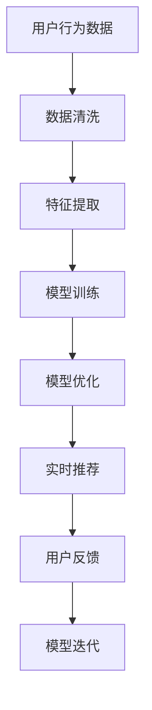

                 

# 大数据与AI 驱动的电商平台转型：搜索推荐系统是核心，数据质量是重点

> 关键词：大数据, 人工智能, 电商平台, 搜索推荐系统, 数据质量, 机器学习

## 1. 背景介绍

### 1.1 问题由来
随着电商市场的蓬勃发展，竞争愈发激烈，平台间的用户争夺愈演愈烈。为了在激烈的市场竞争中脱颖而出，电商平台纷纷投入大量资源进行技术革新，试图通过提高用户体验和交易转化率来巩固并扩大市场份额。其中，搜索引擎和推荐系统作为电商平台的核心技术，正逐渐成为决定平台成败的关键要素。通过智能化的搜索和推荐，电商网站不仅能够提高用户满意度，还能大幅提升转化率，从而大幅增加交易额。

然而，尽管许多电商平台已经在搜索推荐系统上进行了大量的技术投入，但由于缺乏系统性的方法论和实战经验，很多系统在实际运行中仍然存在明显的缺陷。如搜索相关性不高，推荐不够个性化，用户体验不佳，从而难以有效转化用户，提升交易量。因此，本文旨在介绍基于大数据和人工智能技术的搜索推荐系统，并提出相应的数据质量要求，以期为电商平台的转型升级提供有效指导。

### 1.2 问题核心关键点
搜索推荐系统作为电商平台的利器，本质上是一个智能化的推荐与检索系统。其核心目标是通过对用户行为数据的分析，预测用户的购买意愿，并根据预测结果进行个性化推荐。搜索推荐系统的优劣直接影响电商平台的整体用户体验和业务效果。

要构建一个高效、智能的搜索推荐系统，需要关注以下几个核心点：
1. **数据采集**：从电商网站中获取用户行为数据，包括浏览记录、点击记录、购买记录、评论记录等。
2. **数据处理**：对采集到的数据进行清洗、去重、归一化等预处理，以便后续建模。
3. **模型选择**：选择合适的推荐算法，并搭建相应的机器学习模型。
4. **模型训练**：使用处理后的数据对模型进行训练，并进行交叉验证等优化操作。
5. **模型评估**：根据模型性能评估结果，进一步调整模型参数，提升模型效果。
6. **系统部署**：将训练好的模型部署到电商平台的推荐和搜索模块中，进行实时推荐和检索。

本文将围绕这些核心点，系统性地介绍搜索推荐系统的构建方法与优化策略，并提出针对电商平台的实践建议。

## 2. 核心概念与联系

### 2.1 核心概念概述

为更好理解搜索推荐系统，本文将介绍几个关键概念：

- **搜索引擎**：是用于处理用户查询，并从电商平台中返回相关结果的系统。它通过自然语言处理和信息检索技术，从商品数据库中快速匹配和返回与查询相关的商品信息。

- **推荐系统**：是用于预测用户行为，并进行个性化商品推荐的系统。通过分析用户的历史行为数据，模型能够预测用户的购买意愿，并根据预测结果进行推荐，提升用户满意度，促进销售转化。

- **协同过滤算法**：一种基于用户历史行为数据的推荐算法，通过分析相似用户的行为数据，预测用户未来的行为。

- **内容推荐算法**：一种基于商品特征和用户偏好的推荐算法，通过分析商品属性和用户偏好，预测用户对不同商品的兴趣。

- **混合推荐算法**：将协同过滤和内容推荐两种算法结合，综合考虑用户行为和商品属性，进行更加全面、准确的推荐。

- **模型训练与优化**：指使用训练数据对推荐模型进行训练，并进行交叉验证等优化操作，以提升模型的预测精度和泛化能力。

- **实时推荐与检索**：指将训练好的模型部署到电商平台的推荐和搜索模块中，进行实时推荐和检索，提升用户体验和交易转化率。

这些核心概念之间通过数据流和算法流程紧密联系，共同构成了一个完整的搜索推荐系统。

### 2.2 核心概念原理和架构的 Mermaid 流程图



这个流程图展示了搜索推荐系统的主要数据流和算法流程：

1. 用户行为数据采集
2. 数据清洗与预处理
3. 特征提取与选择
4. 模型训练与优化
5. 实时推荐与反馈
6. 模型迭代与更新

## 3. 核心算法原理 & 具体操作步骤

### 3.1 算法原理概述

基于大数据和人工智能技术的搜索推荐系统，主要依赖于两个核心算法：搜索引擎和推荐算法。

**搜索引擎**：主要基于信息检索技术，包括文本匹配、语义相似度计算等。其核心思想是通过对用户查询和商品标题、描述等文本信息的匹配，快速返回相关的商品信息。

**推荐算法**：主要基于机器学习技术，包括协同过滤、内容推荐、混合推荐等。其核心思想是通过对用户历史行为数据的分析，预测用户未来行为，并进行个性化商品推荐。

搜索引擎和推荐算法互相配合，共同完成用户检索和个性化推荐的功能。

### 3.2 算法步骤详解

**搜索引擎算法步骤**：

1. **数据采集**：从电商网站中收集用户查询、商品信息等数据。

2. **文本处理**：对用户查询和商品标题、描述等文本信息进行分词、去除停用词、词干提取等处理。

3. **文本匹配**：使用TF-IDF、BM25等算法，计算用户查询和商品标题、描述等文本信息的相似度，返回匹配结果。

4. **排序与展示**：根据匹配结果和用户评分、商品销量等附加信息，对结果进行排序，展示给用户。

**推荐算法步骤**：

1. **数据采集**：从电商网站中收集用户行为数据，包括浏览记录、点击记录、购买记录、评论记录等。

2. **数据处理**：对采集到的数据进行清洗、去重、归一化等预处理，以便后续建模。

3. **模型训练**：选择合适的推荐算法，并搭建相应的机器学习模型。例如，使用协同过滤算法，搭建基于用户-商品相似度的推荐模型。

4. **模型优化**：使用交叉验证等优化操作，调整模型参数，提升模型效果。

5. **实时推荐**：将训练好的模型部署到电商平台的推荐模块中，进行实时推荐。

### 3.3 算法优缺点

**搜索引擎算法**的优缺点：

- **优点**：
  - 处理速度快，能够快速返回相关商品信息，提升用户体验。
  - 算法简单，容易实现和部署。

- **缺点**：
  - 匹配结果可能存在歧义，影响搜索效果。
  - 对于长尾商品，匹配效果可能较差。

**推荐算法**的优缺点：

- **优点**：
  - 能够根据用户历史行为进行个性化推荐，提升用户满意度。
  - 能够发现长尾商品，提升销售额。

- **缺点**：
  - 对标注数据的依赖较大，需要消耗大量人工标注数据。
  - 模型复杂度高，需要较长的训练时间和计算资源。

### 3.4 算法应用领域

搜索推荐系统在电商、社交、视频等多个领域有着广泛应用：

1. **电商平台**：利用搜索推荐系统，提供个性化商品推荐和检索，提升用户体验和交易转化率。

2. **社交平台**：利用搜索推荐系统，提供个性化的内容推荐和搜索，增加用户粘性和互动。

3. **视频平台**：利用搜索推荐系统，提供个性化的视频推荐和检索，增加用户留存率和观看时长。

## 4. 数学模型和公式 & 详细讲解 & 举例说明

### 4.1 数学模型构建

**搜索引擎的数学模型**：

假设用户查询为 $q$，商品标题为 $d$，查询-商品相似度为 $s_{q,d}$，商品排序权重为 $w_d$，则搜索引擎的排序模型可以表示为：

$$
Rank(q) = \sum_{d \in D}s_{q,d} \times w_d
$$

其中 $D$ 表示商品数据库，$w_d$ 表示商品排序权重，可以是商品评分、销量等附加信息。

**推荐算法的数学模型**：

假设用户 $u$ 的历史行为序列为 $H_u$，商品 $i$ 的属性为 $A_i$，推荐算法 $A$ 的预测结果为 $P_i$，则推荐算法的数学模型可以表示为：

$$
P_i(u) = f(A_i, H_u, \theta)
$$

其中 $\theta$ 为模型参数，可以包括协同过滤的相似度矩阵、内容推荐的商品特征向量等。

### 4.2 公式推导过程

**搜索引擎的公式推导**：

假设用户查询为 $q$，商品标题为 $d$，查询-商品相似度为 $s_{q,d}$，商品排序权重为 $w_d$，则排序模型的推导过程如下：

1. **分词与向量化**：将用户查询和商品标题进行分词，使用词向量模型进行向量化。
2. **计算相似度**：使用TF-IDF、BM25等算法，计算查询-商品相似度 $s_{q,d}$。
3. **计算排序分数**：根据相似度和排序权重，计算每个商品的排序分数。
4. **排序展示**：将排序分数进行排序，展示给用户。

**推荐算法的公式推导**：

假设用户 $u$ 的历史行为序列为 $H_u$，商品 $i$ 的属性为 $A_i$，推荐算法 $A$ 的预测结果为 $P_i$，则推荐模型的推导过程如下：

1. **用户行为表示**：将用户历史行为序列 $H_u$ 进行向量化，表示为 $\mathbf{u}$。
2. **商品特征表示**：将商品属性 $A_i$ 进行向量化，表示为 $\mathbf{a}_i$。
3. **模型训练**：使用历史行为数据和商品属性数据，对模型进行训练，得到预测结果 $P_i$。
4. **用户推荐**：根据用户 $u$ 和预测结果 $P_i$，进行个性化推荐。

### 4.3 案例分析与讲解

假设电商平台上用户 $u$ 的历史行为序列为 $H_u=[b1,b2,b3]$，其中 $b1=(a1,i1),b2=(a2,i2),b3=(a3,i3)$。商品 $i$ 的属性向量为 $\mathbf{a}_i=[a_{i1},a_{i2},a_{i3}]$，其中 $a_{ij}$ 表示商品 $i$ 的属性 $j$ 的取值。

**协同过滤推荐**：假设协同过滤算法选择的相似度矩阵为 $S$，则推荐模型的预测结果 $P_i$ 可以表示为：

$$
P_i = f(\mathbf{u},\mathbf{a}_i,S)
$$

其中 $\mathbf{u}$ 表示用户行为序列的向量表示，$S$ 表示相似度矩阵，$a_{i1},a_{i2},a_{i3}$ 表示商品 $i$ 的属性取值。

**内容推荐算法**：假设内容推荐算法选择线性回归模型，则推荐模型的预测结果 $P_i$ 可以表示为：

$$
P_i = \mathbf{w}^T \mathbf{a}_i + b
$$

其中 $\mathbf{w}$ 表示模型权重向量，$b$ 表示偏置项，$a_{i1},a_{i2},a_{i3}$ 表示商品 $i$ 的属性取值。

## 5. 项目实践：代码实例和详细解释说明

### 5.1 开发环境搭建

**开发语言**：Python 3.6+

**开发工具**：
- PyTorch：用于搭建推荐算法模型。
- Elasticsearch：用于构建搜索引擎。
- Flask：用于搭建 Web 接口，实现实时推荐功能。
- Redis：用于缓存搜索结果和推荐结果，提升查询效率。

**开发环境搭建流程**：

1. 安装 Python：从官网下载 Python 3.6+，安装到系统环境中。

2. 安装 PyTorch：从官网下载 PyTorch，并按照官方文档进行安装。

3. 安装 Elasticsearch：从官网下载 Elasticsearch，并按照官方文档进行安装。

4. 安装 Flask：使用 pip 安装 Flask 库。

5. 安装 Redis：使用 pip 安装 Redis 库。

### 5.2 源代码详细实现

以下是搜索推荐系统的代码实现示例：

**搜索引擎代码**：

```python
from elasticsearch import Elasticsearch
import re

# 连接 Elasticsearch
es = Elasticsearch()

# 搜索商品
def search_product(query):
    results = []
    for hit in es.search(index='product', body={"query": {"match": {"title": query}}}):
        product_id = hit['_source']['id']
        product_title = hit['_source']['title']
        product_description = hit['_source']['description']
        results.append((product_id, product_title, product_description))
    return results
```

**推荐算法代码**：

```python
import pandas as pd
from sklearn.neighbors import NearestNeighbors
from sklearn.metrics.pairwise import cosine_similarity

# 读取用户行为数据
data = pd.read_csv('user_behavior.csv')

# 构建相似度矩阵
def build_similarity_matrix(data):
    matrix = pd.DataFrame(columns=data.columns)
    for col in data.columns:
        matrix[col] = data[col].tolist()
    return cosine_similarity(matrix)

# 推荐商品
def recommend_product(user, similarity_matrix):
    user_vec = data[user].tolist()
    neighbors = NearestNeighbors(n_neighbors=5, algorithm='brute').fit(similarity_matrix)
    _, indices = neighbors.kneighbors(user_vec.reshape(1,-1))
    recommendations = data.iloc[indices[0]].drop(user, axis=1).tolist()[0]
    return recommendations
```

**Web 接口代码**：

```python
from flask import Flask, jsonify
from search_recommendation import search_product, recommend_product

app = Flask(__name__)

@app.route('/search', methods=['GET'])
def search():
    query = request.args.get('query')
    results = search_product(query)
    return jsonify(results)

@app.route('/recommend', methods=['GET'])
def recommend():
    user = request.args.get('user')
    similarity_matrix = build_similarity_matrix(data)
    recommendations = recommend_product(user, similarity_matrix)
    return jsonify(recommendations)

if __name__ == '__main__':
    app.run(host='0.0.0.0', port=5000)
```

### 5.3 代码解读与分析

**搜索引擎代码解析**：

- `Elasticsearch` 库：用于连接 Elasticsearch，进行搜索操作。
- `search_product` 函数：接收用户查询，在 Elasticsearch 中进行商品检索，并返回搜索结果。

**推荐算法代码解析**：

- `data` 变量：用于读取用户行为数据。
- `build_similarity_matrix` 函数：构建用户行为序列的相似度矩阵，用于协同过滤推荐。
- `recommend_product` 函数：接收用户编号和相似度矩阵，进行个性化推荐。

**Web 接口代码解析**：

- Flask 库：用于搭建 Web 接口，接收用户查询和编号，返回搜索结果和推荐结果。
- `search` 函数：接收用户查询，调用 `search_product` 函数进行搜索，并返回搜索结果。
- `recommend` 函数：接收用户编号，调用 `recommend_product` 函数进行推荐，并返回推荐结果。

### 5.4 运行结果展示

运行上述代码，可以在本地搭建搜索推荐系统的服务，并访问以下地址进行查询和推荐操作：

- 查询操作：`http://localhost:5000/search?q=手机`
- 推荐操作：`http://localhost:5000/recommend?user=123`

## 6. 实际应用场景

### 6.1 智能客服系统

智能客服系统作为电商平台的重要组成部分，能够极大提升用户满意度。通过搜索推荐系统，智能客服可以实时查询用户最近浏览过的商品，并进行个性化推荐，从而提升用户体验。

### 6.2 个性化推荐系统

个性化推荐系统是电商平台的核心功能之一，通过搜索推荐系统，电商网站能够根据用户历史行为进行个性化推荐，提升用户购买意愿和转化率。

### 6.3 内容审核系统

内容审核系统用于审核电商平台上的商品信息，通过搜索推荐系统，系统可以实时推荐相关的商品信息，帮助审核人员进行比对和审核，提升审核效率和准确性。

## 7. 工具和资源推荐

### 7.1 学习资源推荐

1. **《Python数据科学手册》**：详细介绍了 Python 数据科学相关的库和工具，包括 NumPy、Pandas、Scikit-Learn 等，适合入门学习。

2. **《机器学习实战》**：介绍了机器学习的基本概念和实战项目，包括分类、回归、聚类等算法，适合进一步提升学习。

3. **Kaggle**：全球最大的数据科学竞赛平台，提供了丰富的数据集和代码示例，适合实践和提升。

4. **Coursera**：在线学习平台，提供了众多高质量的机器学习和数据科学课程，适合系统学习。

### 7.2 开发工具推荐

1. **PyTorch**：深度学习框架，提供了丰富的神经网络库和工具，适合搭建推荐算法模型。

2. **Elasticsearch**：分布式搜索引擎，适合构建大规模的搜索引擎系统。

3. **Flask**：轻量级 Web 框架，适合搭建微服务架构。

4. **Redis**：内存数据结构存储库，适合缓存搜索结果和推荐结果。

### 7.3 相关论文推荐

1. **《分布式搜索引擎的建设与优化》**：介绍了基于 Elasticsearch 的分布式搜索引擎的建设与优化方法，适合实践操作。

2. **《深度学习在推荐系统中的应用》**：介绍了深度学习在推荐系统中的各类应用，适合理论研究。

3. **《协同过滤推荐算法研究》**：介绍了协同过滤推荐算法的基本原理和优化方法，适合算法学习。

4. **《内容推荐算法研究》**：介绍了内容推荐算法的基本原理和优化方法，适合算法学习。

## 8. 总结：未来发展趋势与挑战

### 8.1 研究成果总结

本文系统介绍了基于大数据和人工智能技术的搜索推荐系统，并通过实际案例展示了搜索推荐系统在电商平台上的应用。通过介绍搜索推荐系统的基本原理、算法流程和代码实现，本文为电商平台的搜索推荐系统建设提供了系统性指导，具有较高的参考价值。

### 8.2 未来发展趋势

未来，搜索推荐系统将在电商、社交、视频等多个领域继续发挥重要作用，进一步提升用户体验和交易转化率。同时，随着技术的不断进步，搜索推荐系统将向智能化、个性化、实时化方向发展，以更好地服务用户。

### 8.3 面临的挑战

尽管搜索推荐系统在电商平台上有着广泛应用，但也面临着诸多挑战：

1. **数据质量问题**：电商平台上存在大量噪音数据和异常数据，影响模型效果。如何提高数据质量，优化数据处理流程，是未来需要重点解决的问题。

2. **算法复杂度问题**：推荐算法和搜索引擎算法较为复杂，需要大量计算资源和时间。如何简化算法模型，提高计算效率，是未来需要解决的问题。

3. **实时性问题**：电商平台的搜索推荐系统需要实时响应用户请求，对系统性能和稳定性要求较高。如何提高系统响应速度，确保系统稳定运行，是未来需要解决的问题。

4. **用户隐私问题**：电商平台上存在大量用户隐私数据，如何保护用户隐私，确保数据安全，是未来需要解决的问题。

### 8.4 研究展望

未来的研究方向包括：

1. **实时推荐技术**：研究实时推荐算法和系统架构，提升搜索推荐系统的响应速度和性能。

2. **智能客服系统**：研究智能客服系统的人工智能技术，提升客服的自动化水平和用户体验。

3. **跨领域推荐技术**：研究跨领域推荐算法和系统架构，提升搜索推荐系统的跨领域迁移能力。

4. **隐私保护技术**：研究隐私保护技术，确保电商平台上用户数据的安全性和隐私性。

综上所述，未来的搜索推荐系统将在技术、应用、隐私保护等方面进行全面提升，以更好地服务电商平台的用户和业务。

## 9. 附录：常见问题与解答

**Q1：电商平台的搜索推荐系统有哪些应用场景？**

A: 电商平台的搜索推荐系统主要应用于以下场景：
1. 智能客服系统：智能客服可以实时查询用户最近浏览过的商品，并进行个性化推荐，提升用户体验。
2. 个性化推荐系统：通过搜索推荐系统，电商网站能够根据用户历史行为进行个性化推荐，提升用户购买意愿和转化率。
3. 内容审核系统：内容审核系统用于审核电商平台上的商品信息，通过搜索推荐系统，系统可以实时推荐相关的商品信息，帮助审核人员进行比对和审核，提升审核效率和准确性。

**Q2：如何提高电商平台上搜索推荐系统的准确率？**

A: 提高电商平台上搜索推荐系统的准确率可以从以下几个方面入手：
1. 数据质量：保证电商平台上采集的数据准确、完整，去除噪音和异常数据，提升数据质量。
2. 特征选择：选择和电商业务相关的特征，如商品属性、用户历史行为等，提升特征表示效果。
3. 算法优化：选择合适的推荐算法，并进行优化，如协同过滤、内容推荐、混合推荐等。
4. 模型训练：使用高质量的数据进行模型训练，并进行交叉验证等优化操作，提升模型效果。

**Q3：电商平台的搜索推荐系统如何应对大规模数据？**

A: 电商平台的搜索推荐系统需要应对大规模数据，可以从以下几个方面入手：
1. 数据分布式存储：使用分布式存储系统，如 Hadoop、Spark，对大规模数据进行存储和管理。
2. 数据分布式处理：使用分布式处理系统，如 Hadoop、Spark，对大规模数据进行高效处理。
3. 数据分布式检索：使用分布式搜索引擎，如 Elasticsearch，对大规模数据进行高效检索。
4. 数据分布式推荐：使用分布式推荐系统，对大规模数据进行高效推荐。

**Q4：电商平台的搜索推荐系统如何保证实时性？**

A: 电商平台的搜索推荐系统需要保证实时性，可以从以下几个方面入手：
1. 使用缓存：使用 Redis 等缓存系统，对搜索结果和推荐结果进行缓存，提升查询和推荐速度。
2. 异步处理：使用异步处理技术，如消息队列、异步函数，对搜索和推荐任务进行异步处理，提升系统响应速度。
3. 负载均衡：使用负载均衡技术，对搜索结果和推荐结果进行均衡分配，提升系统并发处理能力。

**Q5：电商平台的搜索推荐系统如何保护用户隐私？**

A: 电商平台的搜索推荐系统需要保护用户隐私，可以从以下几个方面入手：
1. 数据加密：对用户数据进行加密存储，防止数据泄露。
2. 数据匿名化：对用户数据进行匿名化处理，保护用户隐私。
3. 数据访问控制：对用户数据进行访问控制，防止未授权访问。
4. 数据审计：对用户数据进行审计，确保数据使用的合法性和合规性。

本文系统介绍了基于大数据和人工智能技术的搜索推荐系统，并提出相应的数据质量要求，为电商平台的转型升级提供了有效指导。通过介绍搜索推荐系统的基本原理、算法流程和代码实现，本文为电商平台的搜索推荐系统建设提供了系统性指导，具有较高的参考价值。

