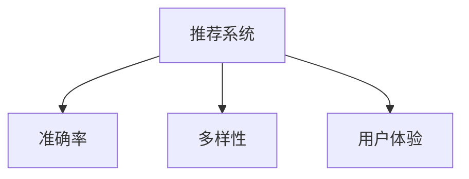
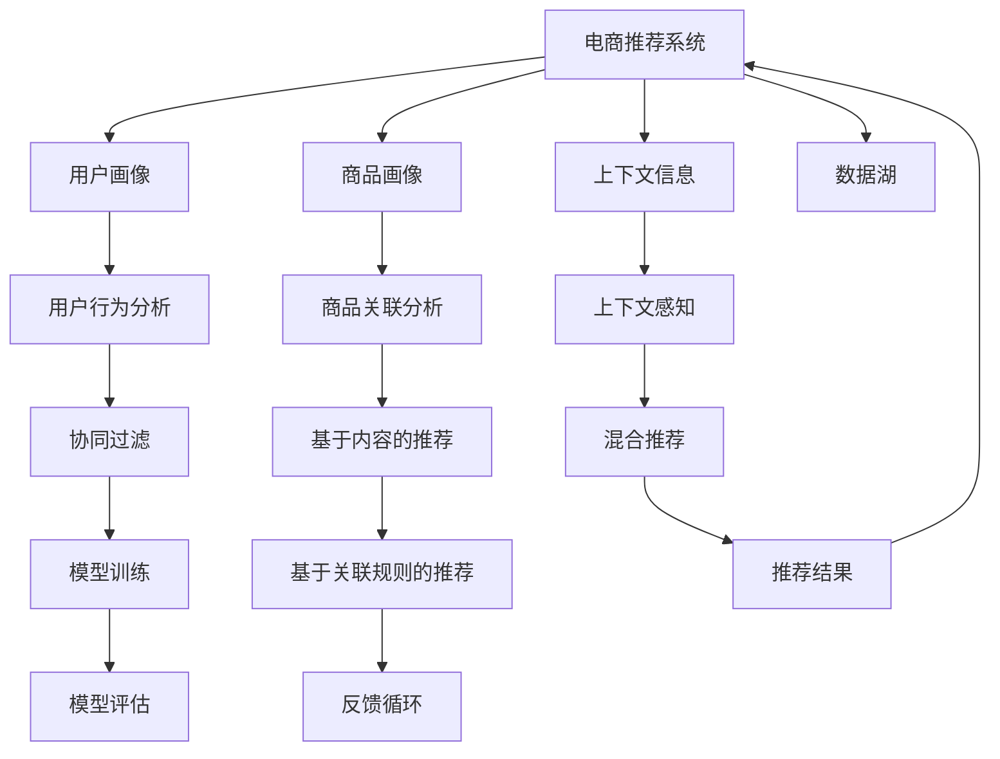

                 

## 1. 背景介绍

### 1.1 问题由来
随着电商市场的迅猛发展，线上购物成为越来越多消费者的首选。为提升用户购物体验，电商公司纷纷投入巨资，建设推荐系统，希望通过精准推荐，提高用户转化率和销售额。推荐系统通过分析用户行为，为用户推荐其感兴趣的商品，已成为电商平台的标配。

但当前推荐的精度、多样性、用户体验等方面仍存在诸多不足。传统推荐算法往往基于用户行为，忽视了商品和上下文信息的价值。同时，由于模型训练数据规模和质量问题，推荐效果难以满足用户的个性化需求，带来体验瓶颈。此外，部分用户对推荐结果满意度不高，往往被推荐结果淹没，无法获得有用的商品信息。

## 2. 核心概念与联系

### 2.1 核心概念概述
为解决上述推荐系统存在的问题，本文将介绍几个核心概念：

- **推荐系统(Recommender System)**：通过用户行为、商品属性、上下文信息等，为用户推荐感兴趣的商品的算法和系统。
- **准确率(Precision)**：衡量推荐结果与用户真实兴趣的匹配程度。
- **多样性(Diversity)**：衡量推荐结果的多样性，避免过度推荐相似商品。
- **用户体验(User Experience)**：评估用户对推荐结果的满意度，包括推荐的相关性、完备性和新颖性等。

这些概念通过如下Mermaid流程图展现其联系：



在电商推荐系统中，准确率、多样性和用户体验是互相联系，互相制约的。通过优化算法，在确保高准确率的前提下，增加推荐结果的多样性，提升用户的使用体验。

### 2.2 核心概念原理和架构的 Mermaid 流程图



该图展示了电商推荐系统的架构和数据流向：

1. **用户画像(B)**和**商品画像(C)**：通过数据收集和分析，构建用户和商品的特征向量，用于后续的推荐。
2. **上下文信息(D)**：记录推荐时的场景信息，如时间、地点、设备等。
3. **用户行为分析(E)**和**商品关联分析(F)**：基于用户的历史行为和商品之间的关联关系，构建协同过滤和基于内容的推荐算法。
4. **上下文感知(G)**：将上下文信息融入推荐模型，提升推荐的针对性和时效性。
5. **协同过滤(H)**和**基于内容的推荐(I)**：基于用户行为和商品特征的相似性进行推荐。
6. **混合推荐(J)**：融合不同推荐算法的结果，取长补短。
7. **模型训练(K)**：使用训练数据集进行模型训练，优化推荐效果。
8. **模型评估(M)**：通过评估指标，如准确率、多样性、用户体验等，对模型进行评估。
9. **反馈循环(N)**：通过用户反馈，对模型进行迭代优化。
10. **数据湖(P)**：存储所有推荐所需的数据，包括用户数据、商品数据、行为数据等。

## 3. 核心算法原理 & 具体操作步骤

### 3.1 算法原理概述

电商推荐系统通过数据挖掘和机器学习技术，对用户行为、商品属性、上下文信息等进行分析，为用户推荐感兴趣的商品。推荐算法主要分为两大类：

1. **协同过滤**：基于用户历史行为和商品属性，寻找相似用户和商品，进行推荐。协同过滤算法包括基于用户的协同过滤和基于商品的协同过滤。
2. **基于内容的推荐**：通过商品的属性特征，构建推荐模型，直接推荐与用户历史兴趣相似的商品。

本文重点介绍基于深度学习的推荐系统。该系统使用大模型预训练获得通用的特征表示，然后使用微调算法，适配电商领域的特定任务。

### 3.2 算法步骤详解

电商推荐系统主要包括以下几个关键步骤：

**Step 1: 数据预处理**
- 收集电商平台的交易数据、用户行为数据、商品属性数据等。
- 数据清洗、去重、补全缺失值，生成训练集、验证集和测试集。

**Step 2: 特征提取**
- 使用预训练语言模型（如BERT、Transformer等）对文本数据进行特征提取，生成用户和商品的特征向量。
- 对于非文本数据，如图片、视频等，使用CNN、RNN等模型进行特征提取。

**Step 3: 模型训练**
- 使用微调算法，对预训练大模型进行适配电商推荐任务，优化模型的预测能力。
- 设置合适的学习率、优化器、正则化技术等超参数。

**Step 4: 模型评估**
- 在测试集上评估模型的性能，如准确率、多样性、用户体验等指标。
- 根据评估结果，调整模型和超参数，进行多次迭代优化。

**Step 5: 部署与监控**
- 将训练好的模型部署到电商平台的推荐系统中。
- 实时监控推荐系统的性能，及时调整策略，提升用户体验。

### 3.3 算法优缺点

基于深度学习的电商推荐系统具有以下优点：
1. **高效准确**：通过预训练和微调，模型能够高效地学习到用户和商品的特征，提升推荐精度。
2. **泛化能力强**：大模型具备泛化能力，可以很好地适应电商推荐领域的特定需求。
3. **易于扩展**：通过微调，模型可以轻松扩展到其他领域，如社交媒体推荐、影视推荐等。

同时，该算法也存在一定的局限性：
1. **数据需求大**：电商推荐系统需要大量的标注数据进行训练，获取高质量标注数据成本较高。
2. **模型复杂**：大模型参数众多，训练和推理计算资源消耗较大。
3. **可解释性不足**：深度学习模型往往是黑盒模型，缺乏可解释性。
4. **冷启动问题**：新用户或新商品加入时，缺乏历史数据，推荐效果较差。

尽管存在这些局限性，但就目前而言，基于深度学习的推荐系统仍然是最主流的方法。未来相关研究的重点在于如何进一步降低数据需求，提高模型可解释性，以及解决冷启动问题。

### 3.4 算法应用领域

电商推荐系统在电子商务平台应用广泛，具体应用领域包括：

- **商品推荐**：基于用户历史行为和商品属性，为用户推荐感兴趣的商品。
- **个性化推荐**：根据用户的兴趣和行为，进行个性化商品推荐。
- **相关商品推荐**：在用户购买某商品时，推荐相关商品。
- **排行榜推荐**：根据用户浏览和点击行为，推荐热门商品。
- **活动推荐**：基于用户行为和活动信息，推荐优惠活动和商品。

此外，电商推荐系统还被广泛应用于金融、教育、旅游等行业，提升个性化推荐效果，带来更好的用户体验。

## 4. 数学模型和公式 & 详细讲解 & 举例说明

### 4.1 数学模型构建

电商推荐系统中的推荐模型可以表示为：

$$
\hat{Y} = f(X; \theta)
$$

其中，$X$为输入特征向量，$\theta$为模型参数，$f$为推荐函数。

在电商推荐系统中，常见的推荐模型包括：

1. **协同过滤模型**：

$$
\hat{Y} = \alpha \text{sigmoid}(\beta X_1^T A X_2) + (1-\alpha) \text{sigmoid}(\gamma X_2^T X_3)
$$

其中，$A$为用户-商品关联矩阵，$\alpha$和$\beta$为调和参数，$\gamma$为权重参数。

2. **基于内容的推荐模型**：

$$
\hat{Y} = \text{sigmoid}(X_2^T W X_3)
$$

其中，$W$为商品属性权重矩阵。

3. **深度学习推荐模型**：

$$
\hat{Y} = \text{softmax}(X_2^T \theta)
$$

其中，$\theta$为模型参数，softmax函数用于输出概率分布。

### 4.2 公式推导过程

以协同过滤模型为例，其推导过程如下：

1. **用户相似度计算**：

$$
\text{similarity}(u_i, u_j) = \frac{\alpha}{\sigma} \sum_{k=1}^N \frac{A_{ik} X_{jk}}{\sigma} + \frac{1-\alpha}{\sigma} \sum_{k=1}^N \frac{A_{ik} X_{3k}}{\sigma}
$$

其中，$\sigma$为归一化因子。

2. **商品相似度计算**：

$$
\text{similarity}(i, j) = \frac{\alpha}{\sigma} \sum_{k=1}^N \frac{A_{ik} X_{jk}}{\sigma} + \frac{1-\alpha}{\sigma} \sum_{k=1}^N \frac{A_{ik} X_{3k}}{\sigma}
$$

3. **推荐计算**：

$$
\hat{Y} = \text{sigmoid}(\text{similarity}(u_i, u_j) X_i^T A X_j)
$$

其中，$u_i$和$u_j$为用户，$i$和$j$为商品。

### 4.3 案例分析与讲解

电商推荐系统中的一个经典案例是Amazon的推荐系统。Amazon使用协同过滤和基于内容的推荐算法，结合深度学习模型进行推荐。具体步骤如下：

1. **数据收集**：收集用户浏览、购买、评分等数据，以及商品属性数据。
2. **特征提取**：使用BERT模型对用户和商品的文本数据进行特征提取，生成向量表示。
3. **模型训练**：使用微调算法，对BERT模型进行电商推荐任务适配，优化推荐函数。
4. **模型评估**：在测试集上评估模型的准确率、多样性和用户体验。
5. **部署与监控**：将训练好的模型部署到Amazon的推荐系统中，实时监控推荐系统性能。

通过以上步骤，Amazon的推荐系统实现了高效的推荐效果，提升了用户满意度。

## 5. 项目实践：代码实例和详细解释说明

### 5.1 开发环境搭建

在进行电商推荐系统开发前，需要先搭建好开发环境。以下是使用Python和PyTorch进行开发的流程：

1. 安装Anaconda：从官网下载并安装Anaconda，用于创建独立的Python环境。

2. 创建并激活虚拟环境：
```bash
conda create -n pytorch-env python=3.8 
conda activate pytorch-env
```

3. 安装PyTorch：根据CUDA版本，从官网获取对应的安装命令。例如：
```bash
conda install pytorch torchvision torchaudio cudatoolkit=11.1 -c pytorch -c conda-forge
```

4. 安装PyTorch Transformers库：
```bash
pip install torch transformers
```

5. 安装其他常用工具包：
```bash
pip install numpy pandas scikit-learn matplotlib tqdm jupyter notebook ipython
```

完成上述步骤后，即可在`pytorch-env`环境中开始电商推荐系统的开发。

### 5.2 源代码详细实现

下面以基于深度学习的电商推荐系统为例，给出使用PyTorch进行电商推荐系统的代码实现。

首先，定义数据处理函数：

```python
from transformers import BertTokenizer
from torch.utils.data import Dataset
import torch

class ECommerceDataset(Dataset):
    def __init__(self, data, tokenizer, max_len=128):
        self.data = data
        self.tokenizer = tokenizer
        self.max_len = max_len
        
    def __len__(self):
        return len(self.data)
    
    def __getitem__(self, item):
        review = self.data[item]['review']
        label = self.data[item]['label']
        
        encoding = self.tokenizer(review, return_tensors='pt', max_length=self.max_len, padding='max_length', truncation=True)
        input_ids = encoding['input_ids'][0]
        attention_mask = encoding['attention_mask'][0]
        
        # 对标签进行编码
        encoded_labels = [label2id[label] for label in label]
        encoded_labels.extend([label2id['']]*(self.max_len - len(encoded_labels)))
        labels = torch.tensor(encoded_labels, dtype=torch.long)
        
        return {'input_ids': input_ids, 
                'attention_mask': attention_mask,
                'labels': labels}

# 标签与id的映射
label2id = {'1': 0, '0': 1, '2': 2, '3': 3}
id2label = {v: k for k, v in label2id.items()}
```

然后，定义模型和优化器：

```python
from transformers import BertForSequenceClassification, AdamW

model = BertForSequenceClassification.from_pretrained('bert-base-cased', num_labels=len(label2id))

optimizer = AdamW(model.parameters(), lr=2e-5)
```

接着，定义训练和评估函数：

```python
from torch.utils.data import DataLoader
from tqdm import tqdm
from sklearn.metrics import classification_report

device = torch.device('cuda') if torch.cuda.is_available() else torch.device('cpu')
model.to(device)

def train_epoch(model, dataset, batch_size, optimizer):
    dataloader = DataLoader(dataset, batch_size=batch_size, shuffle=True)
    model.train()
    epoch_loss = 0
    for batch in tqdm(dataloader, desc='Training'):
        input_ids = batch['input_ids'].to(device)
        attention_mask = batch['attention_mask'].to(device)
        labels = batch['labels'].to(device)
        model.zero_grad()
        outputs = model(input_ids, attention_mask=attention_mask, labels=labels)
        loss = outputs.loss
        epoch_loss += loss.item()
        loss.backward()
        optimizer.step()
    return epoch_loss / len(dataloader)

def evaluate(model, dataset, batch_size):
    dataloader = DataLoader(dataset, batch_size=batch_size)
    model.eval()
    preds, labels = [], []
    with torch.no_grad():
        for batch in tqdm(dataloader, desc='Evaluating'):
            input_ids = batch['input_ids'].to(device)
            attention_mask = batch['attention_mask'].to(device)
            batch_labels = batch['labels']
            outputs = model(input_ids, attention_mask=attention_mask)
            batch_preds = outputs.logits.argmax(dim=2).to('cpu').tolist()
            batch_labels = batch_labels.to('cpu').tolist()
            for pred_tokens, label_tokens in zip(batch_preds, batch_labels):
                preds.append(pred_tokens[:len(label_tokens)])
                labels.append(label_tokens)
                
    print(classification_report(labels, preds))
```

最后，启动训练流程并在测试集上评估：

```python
epochs = 5
batch_size = 16

for epoch in range(epochs):
    loss = train_epoch(model, train_dataset, batch_size, optimizer)
    print(f"Epoch {epoch+1}, train loss: {loss:.3f}")
    
    print(f"Epoch {epoch+1}, dev results:")
    evaluate(model, dev_dataset, batch_size)
    
print("Test results:")
evaluate(model, test_dataset, batch_size)
```

以上就是使用PyTorch对电商推荐系统进行深度学习微调的完整代码实现。可以看到，借助Transformers库，电商推荐系统的开发变得更加高效。

### 5.3 代码解读与分析

让我们再详细解读一下关键代码的实现细节：

**ECommerceDataset类**：
- `__init__`方法：初始化训练数据、分词器等关键组件。
- `__len__`方法：返回数据集的样本数量。
- `__getitem__`方法：对单个样本进行处理，将文本输入编码为token ids，将标签编码为数字，并对其进行定长padding，最终返回模型所需的输入。

**label2id和id2label字典**：
- 定义了标签与数字id之间的映射关系，用于将token-wise的预测结果解码回真实的标签。

**训练和评估函数**：
- 使用PyTorch的DataLoader对数据集进行批次化加载，供模型训练和推理使用。
- 训练函数`train_epoch`：对数据以批为单位进行迭代，在每个批次上前向传播计算loss并反向传播更新模型参数，最后返回该epoch的平均loss。
- 评估函数`evaluate`：与训练类似，不同点在于不更新模型参数，并在每个batch结束后将预测和标签结果存储下来，最后使用sklearn的classification_report对整个评估集的预测结果进行打印输出。

**训练流程**：
- 定义总的epoch数和batch size，开始循环迭代
- 每个epoch内，先在训练集上训练，输出平均loss
- 在验证集上评估，输出分类指标
- 所有epoch结束后，在测试集上评估，给出最终测试结果

可以看到，PyTorch配合Transformers库使得电商推荐系统的深度学习微调的代码实现变得简洁高效。开发者可以将更多精力放在数据处理、模型改进等高层逻辑上，而不必过多关注底层的实现细节。

当然，工业级的系统实现还需考虑更多因素，如模型的保存和部署、超参数的自动搜索、更灵活的任务适配层等。但核心的微调范式基本与此类似。

## 6. 实际应用场景

### 6.1 智能客服系统

智能客服系统利用推荐算法，通过分析用户的历史对话记录，为用户推荐最合适的回复内容，提升用户体验。智能客服系统的应用场景包括：

- **用户咨询推荐**：根据用户的咨询主题，推荐最相关的回复模板。
- **问题解决推荐**：根据用户的问题，推荐最佳的解决方案。
- **知识库推荐**：根据用户的查询，推荐相关的知识库内容。

### 6.2 金融舆情监测

金融舆情监测系统利用推荐算法，通过分析金融领域的新闻、评论等文本，预测金融市场走势，帮助投资者进行决策。金融舆情监测系统的应用场景包括：

- **股票推荐**：根据用户的投资偏好，推荐最适合的股票。
- **新闻推荐**：根据用户的新闻兴趣，推荐最新的金融新闻。
- **舆情分析**：分析市场舆论，预测市场走势，提供投资建议。

### 6.3 个性化推荐系统

个性化推荐系统利用推荐算法，通过分析用户的历史行为，为用户推荐最感兴趣的商品。个性化推荐系统的应用场景包括：

- **商品推荐**：根据用户的浏览和购买历史，推荐相关商品。
- **相关商品推荐**：在用户购买某商品时，推荐相关商品。
- **个性化搜索**：根据用户的搜索历史，推荐相关商品。

### 6.4 未来应用展望

随着推荐系统的发展，基于深度学习的推荐技术将在更多领域得到应用，为各行各业带来变革性影响。

在智慧医疗领域，基于推荐算法的医疗推荐系统，可以推荐最适合的治疗方案，提升医疗服务质量。

在智能教育领域，推荐算法可以根据学生的学习行为，推荐最合适的学习资料，提升学习效果。

在智慧城市治理中，推荐算法可以推荐最适合的政策和方案，提升城市管理效率。

此外，推荐算法还被应用于社交媒体推荐、影视推荐、新闻推荐等领域，为各行各业带来新的发展机遇。

## 7. 工具和资源推荐

### 7.1 学习资源推荐

为帮助开发者系统掌握电商推荐系统的理论基础和实践技巧，这里推荐一些优质的学习资源：

1. **《Recommender Systems: Advanced Practice and Challenges》**：推荐系统领域的经典书籍，涵盖推荐算法、评估指标、实际应用等诸多话题。
2. **《Deep Learning for Recommender Systems: Specialization》**：由Google开设的深度学习推荐系统课程，涵盖协同过滤、深度学习推荐等核心内容。
3. **Transformers官方文档**：官方文档中详细介绍了BERT等预训练模型的使用方法，并提供了丰富的推荐系统样例代码。
4. **Kaggle竞赛平台**：提供众多推荐系统相关的竞赛和数据集，供开发者进行实践和优化。
5. **IEEE Xplore**：收录众多推荐系统领域的顶级期刊和会议论文，提供深入的理论知识。

通过对这些资源的学习实践，相信你一定能够快速掌握电商推荐系统的精髓，并用于解决实际的电商问题。

### 7.2 开发工具推荐

高效的开发离不开优秀的工具支持。以下是几款用于电商推荐系统开发的常用工具：

1. **PyTorch**：基于Python的开源深度学习框架，灵活动态的计算图，适合快速迭代研究。BERT等预训练模型都有PyTorch版本的实现。
2. **TensorFlow**：由Google主导开发的开源深度学习框架，生产部署方便，适合大规模工程应用。TensorFlow同样支持预训练模型，并进行推荐系统的优化。
3. **Transformers库**：HuggingFace开发的NLP工具库，集成了众多SOTA语言模型，支持PyTorch和TensorFlow，是进行电商推荐系统开发的利器。
4. **Weights & Biases**：模型训练的实验跟踪工具，可以记录和可视化模型训练过程中的各项指标，方便对比和调优。与主流深度学习框架无缝集成。
5. **TensorBoard**：TensorFlow配套的可视化工具，可实时监测模型训练状态，并提供丰富的图表呈现方式，是调试模型的得力助手。
6. **Amazon SageMaker**：AWS提供的云端机器学习平台，支持快速搭建和部署推荐系统，提供丰富的模型优化工具。

合理利用这些工具，可以显著提升电商推荐系统的开发效率，加快创新迭代的步伐。

### 7.3 相关论文推荐

电商推荐系统的发展离不开学界的持续研究。以下是几篇奠基性的相关论文，推荐阅读：

1. **《Factorization Machines for Large-Scale Recommender Systems》**：提出因子分解机算法，高效地处理大规模推荐数据。
2. **《Neural Collaborative Filtering》**：提出基于神经网络的协同过滤算法，提升推荐精度和泛化能力。
3. **《Deep Image Model and Texture Matching for Image Recommendation》**：提出基于图像特征的推荐算法，拓展推荐系统到图像领域。
4. **《A Multi-Task Learning Approach to Multi-Domain Recommender Systems》**：提出多任务学习算法，提升跨领域推荐系统的性能。
5. **《Adaptive Cross-Media Recommendation via Hierarchical Attention Networks》**：提出基于跨媒体的推荐算法，提升推荐系统的多样性和效果。

这些论文代表了大数据与AI驱动的电商推荐技术的发展脉络。通过学习这些前沿成果，可以帮助研究者把握学科前进方向，激发更多的创新灵感。

## 8. 总结：未来发展趋势与挑战

### 8.1 总结

本文对基于深度学习的电商推荐系统进行了全面系统的介绍。首先阐述了电商推荐系统存在的问题和不足，明确了电商推荐系统优化目标的准确率、多样性和用户体验。其次，从原理到实践，详细讲解了电商推荐系统的核心算法，给出了电商推荐系统的代码实现。同时，本文还广泛探讨了电商推荐系统在多个领域的应用场景，展示了电商推荐系统的广阔前景。此外，本文精选了电商推荐系统的各类学习资源，力求为读者提供全方位的技术指引。

通过本文的系统梳理，可以看到，基于深度学习的电商推荐系统正在成为电商推荐领域的重要范式，极大地拓展了电商推荐系统的应用边界，催生了更多的落地场景。受益于大数据和AI技术的不断进步，电商推荐系统必将在更广阔的应用领域大放异彩。

### 8.2 未来发展趋势

展望未来，电商推荐系统的发展趋势如下：

1. **数据驱动**：随着数据的不断积累，电商推荐系统将更加依赖于数据的丰富性和多样性，借助大数据技术，挖掘更深刻的用户行为特征和商品属性信息。
2. **算法优化**：未来推荐算法将更加高效、泛化能力更强。如基于深度学习的推荐系统将不断迭代优化，提升推荐精度和多样性。
3. **用户参与**：未来推荐系统将更加注重用户的反馈和参与，通过用户画像和行为建模，实现更个性化的推荐。
4. **跨领域融合**：推荐系统将与其他AI技术进行更深入的融合，如知识图谱、自然语言处理、语音识别等，拓展推荐系统的应用领域。
5. **隐私保护**：推荐系统将更加注重用户隐私保护，通过匿名化处理、差分隐私等技术，确保用户数据的安全性和隐私性。
6. **元学习**：推荐系统将借鉴元学习技术，通过少量样本进行推荐，提升模型的泛化能力。

以上趋势凸显了电商推荐系统的广阔前景。这些方向的探索发展，必将进一步提升电商推荐系统的性能和应用范围，为电商行业带来变革性影响。

### 8.3 面临的挑战

尽管电商推荐系统已经取得了显著成就，但在迈向更加智能化、普适化应用的过程中，它仍面临着诸多挑战：

1. **数据获取难度**：电商推荐系统需要大量的标注数据进行训练，获取高质量标注数据成本较高。
2. **模型复杂度**：深度学习模型参数众多，训练和推理计算资源消耗较大，对硬件环境要求高。
3. **模型解释性不足**：推荐系统往往是黑盒模型，难以解释其内部工作机制和决策逻辑。
4. **冷启动问题**：新用户或新商品加入时，缺乏历史数据，推荐效果较差。
5. **推荐多样性不足**：推荐系统容易陷入局部最优解，推荐结果多样性不足。
6. **推荐结果可解释性**：用户对推荐结果满意度不高，常常被推荐结果淹没，无法获得有用的商品信息。

尽管存在这些挑战，但电商推荐系统仍然是大数据与AI技术的重要应用领域。通过技术创新和实践优化，电商推荐系统必将在未来取得更大的突破。

### 8.4 研究展望

面对电商推荐系统所面临的种种挑战，未来的研究需要在以下几个方面寻求新的突破：

1. **数据采集和处理**：探索更高效、更低成本的数据采集和处理技术，确保电商推荐系统拥有充足的训练数据。
2. **算法优化**：开发更加高效的算法，提升推荐精度和多样性。如引入元学习、多任务学习等技术，提升模型的泛化能力。
3. **隐私保护**：探索隐私保护技术，确保用户数据的安全性和隐私性。如采用差分隐私、联邦学习等技术，保障用户数据隐私。
4. **冷启动问题**：研究冷启动问题的解决策略，通过用户画像和行为建模，提升推荐效果。
5. **推荐结果可解释性**：探索推荐结果的可解释性，提升用户对推荐结果的信任度。如通过可解释性模型、用户反馈机制等手段，提升推荐结果的可解释性。
6. **跨领域融合**：研究跨领域推荐系统的构建方法，拓展推荐系统的应用领域。如跨媒体推荐、跨行业推荐等。

这些研究方向的探索，必将引领电商推荐系统迈向更高的台阶，为电商行业带来更优质的推荐服务。

## 9. 附录：常见问题与解答

**Q1：电商推荐系统如何高效获取标注数据？**

A: 电商推荐系统获取标注数据需要依赖平台提供的交易数据、用户行为数据等。为提高数据采集效率，可以采用以下方法：

1. **数据清洗**：清洗重复、缺失、错误数据，确保数据的完整性和准确性。
2. **数据采样**：对大规模数据进行随机采样，获取有代表性的子集进行训练。
3. **数据增强**：通过数据增强技术，生成更多标注样本，如使用回译、近义替换等方式。
4. **多模态融合**：结合图像、语音等多模态数据，提升推荐效果。
5. **用户反馈**：通过用户反馈机制，不断优化推荐系统，获取更多标注数据。

通过以上方法，可以有效提高电商推荐系统的数据获取效率，提升推荐效果。

**Q2：电商推荐系统的数据预处理流程是怎样的？**

A: 电商推荐系统的数据预处理流程如下：

1. **数据清洗**：清洗重复、缺失、错误数据，确保数据的完整性和准确性。
2. **特征提取**：使用预训练语言模型对文本数据进行特征提取，生成向量表示。
3. **数据采样**：对大规模数据进行随机采样，获取有代表性的子集进行训练。
4. **数据增强**：通过数据增强技术，生成更多标注样本，如使用回译、近义替换等方式。
5. **多模态融合**：结合图像、语音等多模态数据，提升推荐效果。
6. **用户反馈**：通过用户反馈机制，不断优化推荐系统，获取更多标注数据。

通过以上流程，可以有效提升电商推荐系统的数据预处理效率，为推荐模型训练奠定基础。

**Q3：电商推荐系统有哪些常用的特征提取方法？**

A: 电商推荐系统常用的特征提取方法包括：

1. **词袋模型(Bag of Words)**：将文本数据转换为词频向量，简单高效。
2. **TF-IDF**：基于词频和逆文档频率，衡量词的重要性。
3. **BERT**：使用预训练语言模型，学习词嵌入和语义表示。
4. **CNN**：使用卷积神经网络，提取文本的局部特征。
5. **RNN**：使用循环神经网络，处理序列数据。
6. **LSTM**：使用长短期记忆网络，提升模型对长期依赖的捕捉能力。

通过以上方法，可以有效提升电商推荐系统的特征提取效率，提高推荐模型的性能。

**Q4：电商推荐系统如何优化模型参数？**

A: 电商推荐系统可以通过以下方法优化模型参数：

1. **学习率调度**：通过学习率调度策略，如Warmup、Cyclical Learning Rate等，调整学习率。
2. **正则化技术**：使用L2正则、Dropout等正则化技术，防止模型过拟合。
3. **模型压缩**：通过模型压缩技术，如剪枝、量化等，减少模型参数量，提高推理效率。
4. **参数共享**：使用参数共享技术，如Multi-task Learning，提升模型的泛化能力。
5. **特征选择**：通过特征选择技术，如L1正则化、特征重要性排序等，优化特征向量。

通过以上方法，可以有效优化电商推荐系统的模型参数，提升推荐效果。

**Q5：电商推荐系统如何评估推荐结果？**

A: 电商推荐系统可以通过以下指标评估推荐结果：

1. **准确率(Precision)**：衡量推荐结果与用户真实兴趣的匹配程度。
2. **召回率(Recall)**：衡量推荐结果覆盖用户真实兴趣的广度。
3. **F1 Score**：综合准确率和召回率的评估指标。
4. **多样性(Diversity)**：衡量推荐结果的多样性，避免过度推荐相似商品。
5. **新颖性(Novelty)**：衡量推荐结果的创新性，推荐用户未见过的商品。
6. **用户体验(User Experience)**：评估用户对推荐结果的满意度，包括推荐的相关性、完备性和新颖性等。

通过以上指标，可以有效评估电商推荐系统的性能，指导模型的优化。

---

作者：禅与计算机程序设计艺术 / Zen and the Art of Computer Programming

