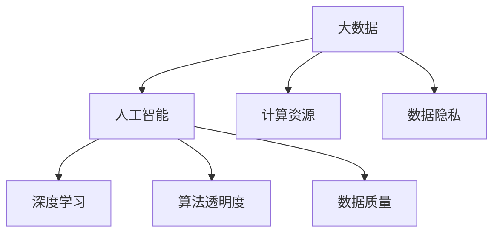

                 

# 大数据时代：人类计算的机遇与挑战并存

## 1. 背景介绍

### 1.1 问题由来

随着互联网和信息技术的迅猛发展，人类正进入大数据时代。大数据指的是规模庞大、类型多样的数据集合，其特性包括4V：Volume（规模大）、Velocity（速度快）、Variety（类型多）和Veracity（真实性）。这种数据规模的膨胀，带来了存储、处理、分析和应用等各方面的巨大挑战，也孕育了众多新的机遇。

近年来，人工智能（AI）技术在这片数据汪洋中迅速崛起，成为大数据时代的关键驱动力。机器学习、深度学习等AI技术，通过从海量数据中挖掘规律和模式，使计算能力得以充分释放，大幅提升了数据分析和决策的效率。但随之而来的问题也不容忽视，如数据隐私、计算资源的消耗、算法黑箱等，对AI技术的应用和普及带来了新的挑战。

### 1.2 问题核心关键点

大数据时代的核心挑战和机遇，主要体现在以下几个方面：

- **数据隐私与安全**：随着数据的收集和处理规模越来越大，如何保护用户隐私、防止数据泄露成为关键问题。
- **计算资源需求**：大规模数据的处理需要大量的计算资源，如何高效利用资源，避免资源浪费，是大数据时代的另一个重要议题。
- **算法透明度与可解释性**：AI模型的决策过程往往复杂难以理解，如何设计透明、可解释的算法，确保算法的可信度和安全性。
- **数据质量与真实性**：大数据虽然多而杂，但数据质量参差不齐，真实性难以保证，这直接影响到了AI模型的准确性。
- **计算与存储的成本**：大数据的存储与处理成本高昂，如何降低成本，是各行各业普遍面临的挑战。
- **技术的可普及性**：AI技术在大数据时代的应用前景广阔，但如何使得这些技术更加普及，为各行各业创造价值，仍需努力。

通过深入分析这些问题，我们可以更全面地理解大数据时代的机遇与挑战，为未来的技术应用提供参考。

## 2. 核心概念与联系

### 2.1 核心概念概述

为了更好地理解大数据时代人类计算的机遇与挑战，本节将介绍几个核心概念：

- **大数据(Big Data)**：大规模、高速、多样、真实的数据集合，是现代数据分析的基础。
- **人工智能(AI)**：通过学习、推理、决策等能力模拟人类智能的机器技术，涉及机器学习、深度学习、自然语言处理等众多领域。
- **深度学习(Deep Learning)**：一种特殊的机器学习技术，通过多层次神经网络，从数据中自动学习和提取高级特征。
- **计算资源(Computing Resources)**：指支持数据处理、存储和应用的各种硬件设施，如CPU、GPU、云服务等。
- **数据隐私(Privacy)**：保护数据不被未授权访问、使用和泄露的权利。
- **算法透明度(Algorithm Transparency)**：指算法的决策过程是否透明、可理解，可解释性(Interpretability)是其重要特征。
- **数据质量(Data Quality)**：指数据的准确性、完整性、一致性、时效性和真实性等指标。

这些核心概念之间的联系可以通过以下Mermaid流程图来展示：



这个流程图展示了大数据与人工智能的紧密联系，同时强调了数据隐私、计算资源、算法透明度和数据质量在AI技术中的应用。

## 3. 核心算法原理 & 具体操作步骤

### 3.1 算法原理概述

在大数据时代，人工智能算法通过从海量数据中学习和提取规律，使计算能力得以充分发挥。其主要算法原理包括以下几个方面：

- **监督学习(Supervised Learning)**：通过有标注的数据集，训练模型进行预测或分类，如回归、分类、聚类等。
- **无监督学习(Unsupervised Learning)**：利用无标注的数据集，发现数据的内在结构和模式，如降维、聚类、关联规则学习等。
- **强化学习(Reinforcement Learning)**：通过与环境的交互，使模型在特定任务上不断优化，如智能推荐、游戏AI等。
- **深度学习(Deep Learning)**：通过多层神经网络，自动学习数据特征，适用于复杂的图像、语音、文本等数据处理任务。

这些算法原理共同构成了大数据时代人工智能技术的基础，通过大规模数据训练，AI模型能够具备更强的预测和决策能力。

### 3.2 算法步骤详解

以深度学习为例，其典型训练流程包括以下几个关键步骤：

**Step 1: 数据准备**
- 收集并预处理大规模数据，去除噪声和异常值，保证数据质量。
- 将数据划分为训练集、验证集和测试集，确保模型在各数据集上表现稳定。

**Step 2: 模型设计**
- 根据任务需求，选择合适的神经网络架构，如卷积神经网络(CNN)、循环神经网络(RNN)等。
- 确定模型的超参数，如学习率、批大小、迭代轮数等，进行初步调参。

**Step 3: 模型训练**
- 将训练集数据分批次输入模型，前向传播计算损失函数。
- 反向传播计算参数梯度，根据设定的优化算法（如Adam、SGD等）更新模型参数。
- 周期性在验证集上评估模型性能，根据性能指标决定是否触发 Early Stopping。
- 重复上述步骤直至满足预设的迭代轮数或 Early Stopping 条件。

**Step 4: 模型评估与部署**
- 在测试集上评估模型的泛化性能，对比训练前的性能提升。
- 使用训练好的模型对新样本进行推理预测，集成到实际的应用系统中。
- 持续收集新的数据，定期重新训练模型，以适应数据分布的变化。

### 3.3 算法优缺点

深度学习算法具有以下优点：
1. 自动化特征提取：能够从数据中自动学习和提取高级特征，无需手工设计。
2. 泛化能力强：在大规模数据上训练的模型，通常具备较强的泛化能力，适用于复杂场景。
3. 应用广泛：适用于图像识别、语音识别、自然语言处理等多种应用领域。

但同时也存在一些局限：
1. 计算资源消耗大：深度学习模型参数量庞大，计算复杂度高，需要大量的计算资源。
2. 过拟合风险高：模型复杂度高，容易过拟合训练数据。
3. 算法透明度低：深度学习模型结构复杂，决策过程难以解释。
4. 数据依赖性强：需要大量高质量数据才能训练出高性能模型。

尽管有这些局限，深度学习仍然是当前大数据时代最流行的算法之一，其优越的性能和广泛的应用前景，使其成为推动技术进步的重要力量。

### 3.4 算法应用领域

深度学习算法在大数据时代得到了广泛应用，以下是几个典型领域：

- **图像识别**：如人脸识别、物体识别、医学影像分析等。通过大规模图像数据训练模型，实现高精度的识别和分析。
- **语音识别**：如智能客服、语音助手、翻译等。通过语音信号和文本的转换，实现自然语言的交互和理解。
- **自然语言处理**：如机器翻译、情感分析、自动摘要等。通过大规模文本数据训练模型，实现自然语言的理解与生成。
- **推荐系统**：如电商推荐、新闻推荐、社交网络推荐等。通过用户行为数据训练模型，实现个性化推荐。
- **金融风控**：如信用评分、欺诈检测、风险评估等。通过交易数据训练模型，提高金融系统的安全性和效率。
- **医疗健康**：如疾病诊断、健康预测、药物研发等。通过医疗数据训练模型，提升医疗服务的智能化水平。

除了上述这些领域外，深度学习算法还在智能制造、智慧城市、智能交通等多个领域得到应用，为各行各业带来了新的变革。

## 4. 数学模型和公式 & 详细讲解 & 举例说明

### 4.1 数学模型构建

深度学习模型的核心是多层神经网络，通过反向传播算法进行训练。以卷积神经网络(CNN)为例，其数学模型构建过程如下：

设输入数据为 $x \in \mathbb{R}^{n}$，输出数据为 $y \in \mathbb{R}^{m}$，定义损失函数为 $L(y, \hat{y})$。假设网络结构包括卷积层、池化层、全连接层等，其参数化表示为 $w \in \mathbb{R}^{p}$。则深度学习模型的训练目标为：

$$
\min_{w} \frac{1}{N} \sum_{i=1}^{N} L(y_i, \hat{y_i})
$$

其中，$N$ 为样本数。

### 4.2 公式推导过程

以CNN为例，其反向传播算法的具体推导过程如下：

**前向传播**：

$$
\begin{aligned}
& z^{(1)} = \sigma(w_1 x + b_1) \\
& z^{(2)} = \sigma(w_2 z^{(1)} + b_2) \\
& \hat{y} = w_3 z^{(2)} + b_3
\end{aligned}
$$

其中，$w_i$ 为权重参数，$b_i$ 为偏置参数，$\sigma$ 为激活函数。

**损失函数**：

假设使用交叉熵损失，其形式为：

$$
L(y, \hat{y}) = -\frac{1}{N} \sum_{i=1}^{N} \sum_{j=1}^{m} y_{ij} \log \hat{y}_{ij}
$$

**反向传播**：

假设当前样本 $i$ 的输出为 $\hat{y_i}$，真实标签为 $y_i$。反向传播过程如下：

$$
\begin{aligned}
& \frac{\partial L}{\partial w_3} = \sum_{i=1}^{N} (y_i - \hat{y_i}) w_3^T \\
& \frac{\partial L}{\partial w_2} = \frac{\partial L}{\partial \hat{y}} \frac{\partial \hat{y}}{\partial z^{(2)}} \frac{\partial z^{(2)}}{\partial w_2} \\
& \frac{\partial L}{\partial w_1} = \frac{\partial L}{\partial \hat{y}} \frac{\partial \hat{y}}{\partial z^{(1)}} \frac{\partial z^{(1)}}{\partial w_1}
\end{aligned}
$$

其中，$\frac{\partial \hat{y}}{\partial z^{(2)}}$ 和 $\frac{\partial z^{(1)}}{\partial w_1}$ 分别表示对 $z^{(2)}$ 和 $z^{(1)}$ 的梯度，由链式法则计算。

### 4.3 案例分析与讲解

以医学影像分类为例，其步骤如下：

1. **数据准备**：收集并预处理大规模医学影像数据，去除噪声和异常值。
2. **模型设计**：使用卷积神经网络结构，设计多层卷积、池化层，并添加全连接层进行分类。
3. **模型训练**：将数据分批次输入模型，使用交叉熵损失函数进行训练，周期性评估模型在验证集上的性能。
4. **模型评估**：在测试集上评估模型的准确性和泛化能力。
5. **模型部署**：将训练好的模型集成到医学影像分析系统中，用于疾病诊断和治疗方案推荐。

此案例展示了深度学习在大数据时代的应用潜力，通过大量医学影像数据训练，模型可以自动识别疾病类型，提高医疗诊断的效率和准确性。

## 5. 项目实践：代码实例和详细解释说明

### 5.1 开发环境搭建

在进行深度学习项目实践前，需要先准备好开发环境。以下是使用Python进行TensorFlow和Keras开发的流程：

1. 安装Anaconda：从官网下载并安装Anaconda，用于创建独立的Python环境。
2. 创建并激活虚拟环境：
```bash
conda create -n tf-env python=3.8
conda activate tf-env
```

3. 安装TensorFlow：根据CUDA版本，从官网获取对应的安装命令。例如：
```bash
conda install tensorflow
```

4. 安装Keras：
```bash
conda install keras
```

5. 安装各类工具包：
```bash
pip install numpy pandas scikit-learn matplotlib tqdm jupyter notebook ipython
```

完成上述步骤后，即可在`tf-env`环境中开始深度学习项目的开发。

### 5.2 源代码详细实现

下面以手写数字识别为例，给出使用TensorFlow和Keras进行深度学习的代码实现。

首先，定义数据处理函数：

```python
import numpy as np
import tensorflow as tf
from tensorflow.keras import datasets, layers, models

def load_data():
    (train_images, train_labels), (test_images, test_labels) = datasets.mnist.load_data()
    train_images = train_images / 255.0
    test_images = test_images / 255.0
    return train_images, train_labels, test_images, test_labels
```

然后，定义模型和优化器：

```python
model = models.Sequential([
    layers.Conv2D(32, (3, 3), activation='relu', input_shape=(28, 28, 1)),
    layers.MaxPooling2D((2, 2)),
    layers.Conv2D(64, (3, 3), activation='relu'),
    layers.MaxPooling2D((2, 2)),
    layers.Conv2D(64, (3, 3), activation='relu'),
    layers.Flatten(),
    layers.Dense(64, activation='relu'),
    layers.Dense(10)
])

optimizer = tf.keras.optimizers.Adam()
```

接着，定义训练和评估函数：

```python
batch_size = 64
epochs = 10

def train(model, data):
    train_images, train_labels, test_images, test_labels = data
    model.compile(optimizer=optimizer,
                  loss=tf.keras.losses.SparseCategoricalCrossentropy(from_logits=True),
                  metrics=['accuracy'])
    model.fit(train_images, train_labels, epochs=epochs, 
              validation_data=(test_images, test_labels))
    
def evaluate(model, data):
    test_images, test_labels = data
    test_loss, test_acc = model.evaluate(test_images, test_labels, verbose=2)
    print('Test accuracy:', test_acc)
```

最后，启动训练流程并在测试集上评估：

```python
data = load_data()
train(model, data)
evaluate(model, data)
```

以上就是使用TensorFlow和Keras进行深度学习项目的完整代码实现。通过简单的代码，可以快速搭建并训练一个手写数字识别模型，展示深度学习算法的实践过程。

### 5.3 代码解读与分析

让我们再详细解读一下关键代码的实现细节：

**load_data函数**：
- 使用TensorFlow的内置函数`mnist.load_data`加载MNIST数据集，包含手写数字的灰度图像和标签。
- 将图像数据归一化到[0,1]范围内，以便模型训练。

**model定义**：
- 使用Sequential模型，定义了多个卷积层、池化层和全连接层。
- 设置优化器为Adam，定义了交叉熵损失函数。

**train和evaluate函数**：
- 在train函数中，使用`model.compile`进行模型编译，指定优化器和损失函数。
- 使用`model.fit`进行模型训练，设置批次大小和迭代轮数。
- 在evaluate函数中，使用`model.evaluate`评估模型性能，并输出测试集的准确率。

**启动训练**：
- 调用load_data函数获取数据集。
- 调用train函数进行模型训练。
- 调用evaluate函数评估模型性能。

可以看出，深度学习项目开发相对简单，只需要利用Python和主流深度学习框架，便可以快速实现复杂模型的训练和评估。同时，TensorFlow和Keras的强大封装能力，使得模型设计和训练过程更加直观和高效。

## 6. 实际应用场景

### 6.1 智能客服系统

深度学习在大数据时代的智能客服系统中得到了广泛应用。通过自然语言处理和机器学习技术，智能客服能够自动理解用户输入，提供个性化服务，有效提高客服效率。

具体而言，可以收集企业内部的历史客服对话记录，将问题和最佳答复构建成监督数据，在此基础上对预训练语言模型进行微调。微调后的模型能够自动理解用户意图，匹配最合适的答案模板进行回复。对于用户提出的新问题，还可以接入检索系统实时搜索相关内容，动态组织生成回答。如此构建的智能客服系统，能大幅提升客户咨询体验和问题解决效率。

### 6.2 金融舆情监测

在金融领域，深度学习技术被用于舆情监测和风险管理。通过自然语言处理和情感分析技术，深度学习模型能够实时监测社交媒体、新闻等网络文本，分析舆情变化趋势，预测市场动向。

具体实现中，可以收集金融领域相关的新闻、报道、评论等文本数据，并对其进行情感标注和主题标注。在此基础上对预训练语言模型进行微调，使其能够自动判断文本属于何种情感倾向和主题，预测市场舆情变化。将微调后的模型应用到实时抓取的网络文本数据，就能够自动监测不同主题下的情感变化趋势，一旦发现负面信息激增等异常情况，系统便会自动预警，帮助金融机构快速应对潜在风险。

### 6.3 个性化推荐系统

深度学习在个性化推荐系统中也得到了广泛应用。通过用户行为数据和物品特征数据训练推荐模型，实现更加精准的个性化推荐。

具体实现中，可以收集用户浏览、点击、评论、分享等行为数据，以及物品的标题、描述、标签等文本内容。将文本内容作为模型输入，用户的后续行为（如是否点击、购买等）作为监督信号，在此基础上对预训练语言模型进行微调。微调后的模型能够从文本内容中准确把握用户的兴趣点。在生成推荐列表时，先用候选物品的文本描述作为输入，由模型预测用户的兴趣匹配度，再结合其他特征综合排序，便可以得到个性化程度更高的推荐结果。

### 6.4 未来应用展望

随着深度学习技术的发展，其在大数据时代的应用前景将更加广阔。未来，深度学习将继续在智能制造、智慧城市、智能交通等多个领域得到应用，为各行各业带来新的变革。

在智慧医疗领域，深度学习可以用于疾病诊断、健康预测、药物研发等。通过医疗数据训练模型，提升医疗服务的智能化水平，辅助医生诊疗，加速新药开发进程。

在智能教育领域，深度学习可以用于作业批改、学情分析、知识推荐等方面，因材施教，促进教育公平，提高教学质量。

在智慧城市治理中，深度学习可以用于城市事件监测、舆情分析、应急指挥等环节，提高城市管理的自动化和智能化水平，构建更安全、高效的未来城市。

此外，在企业生产、社会治理、文娱传媒等众多领域，深度学习技术也将不断涌现，为传统行业数字化转型升级提供新的技术路径。

## 7. 工具和资源推荐

### 7.1 学习资源推荐

为了帮助开发者系统掌握深度学习理论基础和实践技巧，这里推荐一些优质的学习资源：

1. **《深度学习》课程**：斯坦福大学的吴恩达教授开设的《深度学习》课程，系统讲解深度学习的基本概念、算法原理和应用实例。
2. **Kaggle竞赛平台**：全球最大的数据科学竞赛平台，提供海量数据集和挑战，帮助开发者实践深度学习技术。
3. **深度学习框架文档**：如TensorFlow、Keras、PyTorch等主流深度学习框架的官方文档，提供了丰富的代码示例和教程，适合入门和进阶学习。
4. **书籍推荐**：如《深度学习》（Ian Goodfellow等著）、《神经网络与深度学习》（Michael Nielsen等著）等，深入讲解深度学习的基本理论和实际应用。
5. **在线课程**：如Coursera、edX等平台提供的深度学习相关课程，覆盖从入门到高级的各种内容。

通过学习这些资源，开发者可以快速掌握深度学习的基本原理和实践技巧，在实际项目中灵活应用。

### 7.2 开发工具推荐

深度学习项目的开发离不开优秀的工具支持。以下是几款常用的开发工具：

1. **TensorFlow**：由Google主导开发的深度学习框架，功能丰富，支持多种硬件平台。
2. **PyTorch**：由Facebook开发的深度学习框架，动态计算图设计，便于模型迭代和调试。
3. **Keras**：高级深度学习框架，提供简单易用的API，支持多种深度学习模型。
4. **MXNet**：由Apache开发的深度学习框架，支持多种编程语言，灵活高效。
5. **Jupyter Notebook**：开源的交互式笔记本，支持多种编程语言，便于开发和协作。
6. **Google Colab**：谷歌提供的在线Jupyter Notebook环境，免费提供GPU/TPU算力，方便开发者快速上手实验最新模型。

合理利用这些工具，可以显著提升深度学习项目的开发效率，加快创新迭代的步伐。

### 7.3 相关论文推荐

深度学习的发展离不开学界的持续研究。以下是几篇奠基性的相关论文，推荐阅读：

1. **AlexNet**：2012年ImageNet比赛冠军，首次展示了深度卷积神经网络在大规模图像识别任务中的强大能力。
2. **ResNet**：2015年ImageNet比赛冠军，提出残差连接结构，大幅提升了深度网络的训练效果。
3. **BERT**：2018年自然语言处理任务SOTA，提出预训练语言模型，展示了大规模语料训练的潜力。
4. **AlphaGo**：2016年围棋世界冠军，展示了深度强化学习在复杂博弈问题中的应用潜力。
5. **GANs**：2014年提出的生成对抗网络，展示了深度生成模型在图像生成、音频生成等领域的强大能力。

这些论文代表了深度学习技术的发展脉络，通过学习这些前沿成果，可以帮助研究者把握学科前进方向，激发更多的创新灵感。

## 8. 总结：未来发展趋势与挑战

### 8.1 总结

本文对大数据时代人类计算的机遇与挑战进行了全面系统的介绍。首先阐述了大数据时代人工智能技术的发展背景和挑战，明确了深度学习算法在数据处理、模型训练、应用部署等方面的应用潜力。其次，从原理到实践，详细讲解了深度学习模型的训练流程和实际应用案例，展示了深度学习在大数据时代的广泛应用。同时，本文还广泛探讨了深度学习在智能客服、金融舆情、个性化推荐等多个领域的应用前景，展示了深度学习范式的巨大潜力。此外，本文精选了深度学习的各类学习资源，力求为开发者提供全方位的技术指引。

通过本文的系统梳理，可以看到，深度学习技术在大数据时代的巨大应用前景和面临的挑战。这些方向的探索发展，必将进一步提升人工智能技术的性能和应用范围，为人类认知智能的进化带来深远影响。

### 8.2 未来发展趋势

展望未来，深度学习技术的发展趋势主要体现在以下几个方面：

1. **计算能力提升**：随着硬件算力的提升，深度学习模型的规模和复杂度将进一步扩大，模型性能也将得到提升。
2. **模型泛化能力增强**：深度学习模型的泛化能力将进一步提升，能够适应更多类型的复杂数据和任务。
3. **数据处理自动化**：数据预处理、清洗、标注等环节将进一步自动化，提高数据处理效率。
4. **模型解释性加强**：深度学习模型的解释性和可解释性将成为新的研究方向，有助于提升算法的可信度和安全性。
5. **跨领域融合**：深度学习技术将与更多领域的技术进行融合，如自然语言处理、图像处理、语音识别等，形成更全面、更高效的技术体系。
6. **边缘计算应用**：深度学习模型将更多应用到边缘计算设备上，实现本地数据处理和实时响应。

这些趋势凸显了深度学习技术在大数据时代的广泛应用前景和深远影响。只有不断突破技术瓶颈，才能将深度学习推向新的高度，为各行各业创造更多价值。

### 8.3 面临的挑战

尽管深度学习技术在大数据时代展现了巨大的潜力，但在应用过程中仍面临诸多挑战：

1. **计算资源消耗大**：深度学习模型参数量庞大，计算复杂度高，需要大量的计算资源，限制了其在资源受限场景中的应用。
2. **数据质量依赖强**：深度学习模型对数据质量的要求高，数据噪声和异常值会影响模型性能。
3. **算法透明性低**：深度学习模型结构复杂，决策过程难以解释，增加了应用中的不确定性。
4. **隐私保护问题**：深度学习模型需要大量的数据进行训练，隐私保护问题日益凸显。
5. **过拟合风险高**：深度学习模型容易过拟合训练数据，泛化性能受到限制。
6. **模型鲁棒性差**：深度学习模型对数据分布的变化敏感，鲁棒性有待提升。

这些挑战亟需进一步研究和解决，才能使深度学习技术在大数据时代发挥更大的作用。

### 8.4 研究展望

未来，深度学习研究需要在以下几个方向进行深入探索：

1. **计算资源优化**：通过模型压缩、剪枝、量化等技术，降低深度学习模型的计算复杂度，提升模型在资源受限环境中的应用。
2. **数据质量增强**：研究高效的数据预处理和清洗技术，提高数据质量，减少噪声和异常值的影响。
3. **算法透明性提升**：设计更加透明、可解释的深度学习模型，增强模型的可信度和安全性。
4. **隐私保护技术**：研究隐私保护算法，保护用户数据隐私，提高数据使用过程中的安全性。
5. **鲁棒性提升**：研究鲁棒性强的深度学习模型，增强模型对数据分布变化的适应能力。
6. **跨领域融合**：探索深度学习与其他领域技术的融合，如自然语言处理、图像处理、语音识别等，形成更全面、更高效的技术体系。

这些研究方向将进一步推动深度学习技术的发展，为大数据时代的技术应用带来更多创新和突破。

## 9. 附录：常见问题与解答

**Q1：深度学习在大数据时代的应用场景有哪些？**

A: 深度学习在大数据时代得到了广泛应用，以下是几个典型场景：

1. **图像识别**：如人脸识别、物体识别、医学影像分析等。通过大规模图像数据训练模型，实现高精度的识别和分析。
2. **语音识别**：如智能客服、语音助手、翻译等。通过语音信号和文本的转换，实现自然语言的交互和理解。
3. **自然语言处理**：如机器翻译、情感分析、自动摘要等。通过大规模文本数据训练模型，实现自然语言的理解与生成。
4. **推荐系统**：如电商推荐、新闻推荐、社交网络推荐等。通过用户行为数据训练模型，实现个性化推荐。
5. **金融风控**：如信用评分、欺诈检测、风险评估等。通过交易数据训练模型，提高金融系统的安全性和效率。
6. **医疗健康**：如疾病诊断、健康预测、药物研发等。通过医疗数据训练模型，提升医疗服务的智能化水平。

这些场景展示了深度学习在大数据时代的广泛应用，通过大规模数据的训练，深度学习模型能够具备更强的预测和决策能力，推动各行各业的智能化进程。

**Q2：深度学习模型容易过拟合的原因有哪些？**

A: 深度学习模型容易过拟合的原因主要包括以下几个方面：

1. **模型复杂度高**：深度学习模型通常包含大量参数，容易过拟合训练数据。
2. **训练数据量小**：数据量小的情况下，模型容易学习到数据的噪声和异常值。
3. **正则化不足**：训练过程中正则化技术（如L2正则、Dropout等）使用不当，导致模型过拟合。
4. **优化算法选择不当**：优化算法选择不当，如学习率过大或过小，导致模型收敛不稳定。
5. **数据分布不均衡**：训练数据分布不均衡，导致模型在少数类别上表现优异，而在多数类别上泛化性能差。

为解决这些问题，可以采用以下策略：

1. **数据增强**：通过对训练数据进行扩充、旋转、裁剪等操作，增加训练样本数量，提高模型泛化能力。
2. **正则化技术**：使用L2正则、Dropout等技术，防止模型过拟合训练数据。
3. **优化算法调整**：调整学习率、批大小等超参数，选择适合的数据集和模型结构的优化算法。
4. **模型简化**：通过模型压缩、剪枝等技术，简化模型结构，减少参数量，提升模型泛化性能。

这些策略可以有效缓解深度学习模型的过拟合问题，提高模型的泛化性能。

**Q3：如何保护深度学习模型的隐私？**

A: 深度学习模型的隐私保护主要包括以下几个方面：

1. **数据匿名化**：在数据预处理阶段，对敏感数据进行匿名化处理，防止数据泄露。
2. **差分隐私**：在训练过程中，采用差分隐私技术，保证模型对个体数据的隐私保护。
3. **模型加密**：对模型参数进行加密处理，防止模型参数被未授权访问和篡改。
4. **联邦学习**：采用联邦学习技术，模型在本地训练，数据在本地处理，避免敏感数据泄露。

通过这些策略，可以有效保护深度学习模型的隐私，提高数据使用过程中的安全性。

**Q4：深度学习模型在大数据时代的优势是什么？**

A: 深度学习模型在大数据时代具有以下优势：

1. **自动化特征提取**：能够从数据中自动学习和提取高级特征，无需手工设计，提高数据利用效率。
2. **泛化能力强**：在大规模数据上训练的模型，通常具备较强的泛化能力，适用于复杂场景。
3. **应用广泛**：适用于图像识别、语音识别、自然语言处理等多种应用领域，具有广泛的应用前景。
4. **高精度**：深度学习模型通过多层网络结构，能够提取更复杂的特征，提高预测和决策的准确性。
5. **实时响应**：深度学习模型能够在实时数据流中进行预测和决策，提升业务效率。

这些优势使得深度学习模型在大数据时代得到了广泛应用，成为推动各行各业智能化转型的重要技术。

**Q5：如何设计透明的深度学习模型？**

A: 设计透明的深度学习模型主要包括以下几个方面：

1. **模型简化**：通过模型压缩、剪枝等技术，简化模型结构，提高模型的透明性。
2. **模型解释性增强**：通过引入可解释性技术，如LIME、SHAP等，增强模型决策的可解释性。
3. **模型可视化**：通过可视化技术，展示模型训练过程和特征提取结果，帮助理解模型行为。
4. **透明性指标设计**：设计透明性指标，评估模型的透明性，指导模型设计和优化。

通过这些策略，可以有效提升深度学习模型的透明性，增强模型的可信度和安全性。

---

作者：禅与计算机程序设计艺术 / Zen and the Art of Computer Programming

