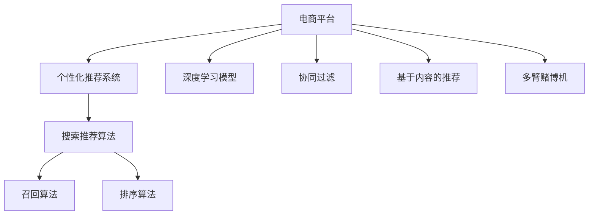

                 

# 大数据驱动的电商平台转型：搜索推荐系统是核心，AI 模型融合技术是关键

## 1. 背景介绍

### 1.1 问题由来
电商平台作为互联网时代的重要商业形态，经历了快速的发展和市场的激烈竞争。传统的电商平台以“人找货”的模式为主，用户通过搜索或浏览页面，寻找并购买商品。然而，随着用户需求的个性化和商品种类的激增，电商平台需要一种更智能、更高效的方式，以提升用户体验，增强交易转化。

近年来，大数据和人工智能技术在电商领域的应用逐渐深入。电商平台开始利用大数据分析用户行为，基于用户画像、历史行为、搜索记录等数据，预测用户需求，提供个性化的商品推荐。这一过程中，搜索推荐系统成为了驱动电商平台转型的核心技术。

### 1.2 问题核心关键点
搜索推荐系统通过综合利用用户历史行为数据、商品属性数据、实时数据等多种信息源，采用机器学习算法，预测用户行为，为用户推荐可能感兴趣的商品。其核心技术包括个性化推荐算法、召回算法、排序算法等。

1. **个性化推荐算法**：通过分析用户的历史行为和偏好，为每个用户生成个性化的推荐列表。常见的个性化推荐算法包括基于协同过滤、基于内容的推荐、基于深度学习的推荐等。
2. **召回算法**：确定从商品库中检索哪些商品展示给用户。常见的召回算法包括基于规则的召回、基于关键词的召回、基于模型的召回等。
3. **排序算法**：对召回出的商品列表进行排序，优先推荐用户最有可能感兴趣的商品。常见的排序算法包括基于阈值排序、基于学习排序、基于多臂赌博机等。

这些算法和技术在大数据驱动下，能够有效提升电商平台的个性化推荐能力，提高用户满意度和交易转化率。

### 1.3 问题研究意义
研究电商平台搜索推荐系统的关键技术，对于提升用户体验、优化交易转化、提高电商平台的竞争力具有重要意义：

1. 提高用户满意度：通过个性化推荐，满足用户多样化需求，提升购物体验。
2. 优化交易转化率：预测用户购买意图，提高点击率和转化率，增加电商平台收益。
3. 增强平台竞争力：通过精准推荐，提高用户粘性，增加新用户留存，增强市场竞争力。
4. 促进数据驱动决策：通过数据驱动的推荐算法，支持电商平台进行更加科学合理的决策。

## 2. 核心概念与联系

### 2.1 核心概念概述

为更好地理解搜索推荐系统，本节将介绍几个密切相关的核心概念：

- **电商平台**：以商品销售为核心业务的在线平台，包括商品展示、搜索推荐、交易支付等功能模块。
- **个性化推荐系统**：利用用户行为数据、商品数据等，通过机器学习算法，为每个用户生成个性化的商品推荐列表。
- **搜索推荐算法**：包括召回算法、排序算法等，是实现个性化推荐的核心技术。
- **深度学习模型**：如神经网络、深度神经网络等，广泛应用于搜索推荐系统中，以提升模型的预测能力。
- **协同过滤**：基于用户行为数据，预测用户可能感兴趣的商品。
- **基于内容的推荐**：利用商品的属性信息，预测用户对商品的需求。
- **多臂赌博机**：通过模拟老虎机，对商品进行排序，提升推荐效果。

这些核心概念之间的逻辑关系可以通过以下Mermaid流程图来展示：



这个流程图展示了几者之间的联系：

1. 电商平台利用个性化推荐系统进行推荐。
2. 个性化推荐系统通过搜索推荐算法实现推荐功能。
3. 搜索推荐算法包括召回和排序两个步骤。
4. 深度学习模型、协同过滤、基于内容的推荐、多臂赌博机等技术，可以用于搜索推荐算法的不同环节。

这些概念共同构成了电商平台的推荐引擎，使其能够基于用户行为和商品数据，实现个性化的商品推荐。

## 3. 核心算法原理 & 具体操作步骤
### 3.1 算法原理概述

电商平台的搜索推荐系统，本质上是一个基于大数据的机器学习系统。其核心思想是：利用用户的历史行为数据、商品数据等，构建用户画像，通过机器学习算法，预测用户对商品的兴趣，生成个性化的推荐列表。

形式化地，假设用户 $U$ 的历史行为数据为 $H$，商品数据为 $I$，搜索记录为 $S$。推荐系统的目标是找到推荐策略 $P$，使得对于任意用户 $u \in U$，推荐列表 $R = P(u; H, I, S)$ 能够最大化用户满意度 $U(S; P(u; H, I))$。

在实践中，我们通常使用评分预测模型、排名模型等机器学习模型，进行推荐预测。评分预测模型通过预测用户对每个商品的评分，生成推荐列表；排名模型通过预测用户对每个商品的排序，生成推荐列表。

### 3.2 算法步骤详解

电商平台的搜索推荐系统一般包括以下几个关键步骤：

**Step 1: 数据收集与处理**
- 收集用户的历史行为数据、商品数据、搜索记录等，构建用户画像和商品库。
- 对数据进行清洗、归一化等预处理，确保数据质量。

**Step 2: 特征工程**
- 从用户画像和商品库中提取有意义的特征，如用户兴趣、商品属性、搜索关键词等。
- 使用特征工程技术，构造用户与商品之间的相似度矩阵。

**Step 3: 模型训练**
- 选择合适的推荐算法和模型，如协同过滤、基于内容的推荐、深度学习模型等。
- 在训练集上训练模型，通过交叉验证等技术，选择最优模型。

**Step 4: 预测与推荐**
- 对每个用户，使用训练好的模型，预测其对每个商品的评分或排序。
- 根据评分或排序结果，生成个性化的推荐列表。

**Step 5: 评估与优化**
- 在验证集和测试集上评估推荐系统的性能，如准确率、召回率、F1-score等。
- 根据评估结果，调整模型参数或优化算法，进一步提升推荐效果。

### 3.3 算法优缺点

电商平台的搜索推荐系统具有以下优点：
1. 提升用户体验：通过个性化推荐，满足用户多样化需求，提升购物体验。
2. 优化交易转化率：预测用户购买意图，提高点击率和转化率，增加电商平台收益。
3. 增强平台竞争力：通过精准推荐，提高用户粘性，增加新用户留存，增强市场竞争力。
4. 促进数据驱动决策：通过数据驱动的推荐算法，支持电商平台进行更加科学合理的决策。

同时，该系统也存在一定的局限性：
1. 依赖数据质量：数据不完整、不准确、不及时，会导致推荐效果下降。
2. 计算资源消耗大：高维稀疏矩阵计算、深度学习模型训练等，需要大量的计算资源。
3. 模型可解释性差：复杂的推荐模型难以解释推荐结果，难以调试和优化。
4. 安全性和隐私问题：用户行为数据涉及隐私，需要严格的保护措施。

尽管存在这些局限性，但就目前而言，基于搜索推荐系统的电商推荐技术仍是大数据驱动电商转型的主要手段。未来相关研究的重点在于如何进一步降低计算资源消耗，提高模型可解释性，同时兼顾数据安全性和隐私保护。

### 3.4 算法应用领域

基于电商平台的搜索推荐系统已经在推荐商品、个性化展示、广告投放等多个领域得到了广泛的应用，成为电商平台智能化转型的重要工具：

- **推荐商品**：根据用户的历史行为和偏好，推荐可能感兴趣的商品。
- **个性化展示**：在商品页面上展示与用户偏好相关的广告和推荐商品。
- **广告投放**：通过分析用户行为数据，精准投放广告，提升广告效果。
- **用户留存**：通过个性化的推荐和促销活动，提高用户粘性，增加新用户留存。

除了上述这些经典应用外，电商平台还可以探索更多场景，如个性化搜索、跨界推荐等，进一步提升用户满意度和平台收益。

## 4. 数学模型和公式 & 详细讲解  
### 4.1 数学模型构建

本节将使用数学语言对电商平台的搜索推荐系统进行更加严格的刻画。

假设电商平台的数据集为 $D=\{(x_i, y_i)\}_{i=1}^N$，其中 $x_i$ 为商品，$y_i$ 为用户的评分或排序标签。推荐系统的目标是构建推荐策略 $P$，使得对于每个用户 $u$，生成的推荐列表 $R = P(u; x)$ 能够最大化用户满意度 $U(R; u)$。

定义推荐策略 $P$ 在商品 $x$ 上的预测结果为 $p(x)$，则用户满意度 $U(R; u)$ 可以表示为：

$$
U(R; u) = \frac{1}{|R|} \sum_{x \in R} p(x) \cdot y_i
$$

其中 $p(x)$ 为推荐策略 $P$ 对商品 $x$ 的评分预测或排序预测。

在实践中，我们通常使用评分预测模型或排名模型进行推荐预测。这里以评分预测模型为例，详细讲解其数学模型和推导过程。

### 4.2 公式推导过程

假设用户 $u$ 的历史行为数据为 $H = \{x_1, x_2, ..., x_n\}$，商品数据为 $I = \{x_1, x_2, ..., x_m\}$。推荐策略 $P$ 为评分预测模型，预测用户对每个商品的评分 $p(x_i)$，则用户满意度 $U(R; u)$ 可以表示为：

$$
U(R; u) = \frac{1}{|R|} \sum_{x \in R} p(x) \cdot y_i
$$

其中 $y_i$ 为用户的评分标签，$|R|$ 为推荐列表的长度。

评分预测模型的目标是最小化损失函数，常用的损失函数包括均方误差（MSE）、平均绝对误差（MAE）等。这里以均方误差为例，推导推荐模型的优化目标函数。

设模型参数为 $\theta$，则评分预测模型的损失函数为：

$$
\mathcal{L}(\theta) = \frac{1}{N} \sum_{i=1}^N \sum_{x \in H} (p(x; \theta) - y_i)^2
$$

其中 $p(x; \theta)$ 为模型对商品 $x$ 的评分预测。

最小化损失函数 $\mathcal{L}(\theta)$ 即可得到评分预测模型的优化目标。

### 4.3 案例分析与讲解

以协同过滤算法为例，详细讲解其原理和应用。

协同过滤算法是一种基于用户行为数据的推荐算法，通过分析用户与商品之间的交互行为，预测用户对商品的评分。具体步骤如下：

1. **构建用户-商品评分矩阵**：收集用户对商品的历史评分数据，构建用户-商品评分矩阵 $R_{us}$，其中 $u$ 为用户，$s$ 为商品。
2. **计算用户相似度**：对于每个用户 $u$，计算其与所有其他用户 $v$ 的相似度 $sim(u, v)$，常用余弦相似度、皮尔逊相关系数等。
3. **预测用户评分**：对于每个用户 $u$ 未评分过的商品 $s$，根据其相似用户 $v$ 的评分 $r_{vs}$，预测 $u$ 对 $s$ 的评分 $p_{us}$，常用加权平均法：
   $$
   p_{us} = \frac{\sum_{v \sim u} r_{vs} \cdot sim(v, u)}{\sum_{v \sim u} sim(v, u)}
   $$
4. **生成推荐列表**：根据预测评分 $p_{us}$，对所有商品进行排序，生成推荐列表。

协同过滤算法的优点在于能够捕捉用户之间的相似性，提升推荐效果。但缺点在于需要大量的用户-商品评分数据，且新用户和冷启动问题较难解决。

## 5. 项目实践：代码实例和详细解释说明
### 5.1 开发环境搭建

在进行搜索推荐系统开发前，我们需要准备好开发环境。以下是使用Python进行TensorFlow开发的环境配置流程：

1. 安装Anaconda：从官网下载并安装Anaconda，用于创建独立的Python环境。

2. 创建并激活虚拟环境：
```bash
conda create -n tf-env python=3.8 
conda activate tf-env
```

3. 安装TensorFlow：根据CUDA版本，从官网获取对应的安装命令。例如：
```bash
conda install tensorflow -c pytorch -c conda-forge
```

4. 安装各类工具包：
```bash
pip install numpy pandas scikit-learn matplotlib tqdm jupyter notebook ipython
```

完成上述步骤后，即可在`tf-env`环境中开始搜索推荐系统开发。

### 5.2 源代码详细实现

这里我们以协同过滤算法为例，给出使用TensorFlow实现搜索推荐系统的完整代码实现。

首先，定义评分矩阵和用户相似度矩阵：

```python
import tensorflow as tf
import numpy as np

# 生成随机评分矩阵
R = np.random.randn(10, 10) + 2

# 计算用户相似度矩阵
similarity = R @ R.T

# 定义评分预测函数
def predict_score(R, similarity, user_idx):
    similar_user_idxs = np.argsort(similarity[user_idx])[:10]
    similar_user_scores = R[similar_user_idxs]
    similar_user_weights = np.sqrt(similarity[user_idx])
    weighted_avg = np.average(similar_user_scores, weights=similar_user_weights)
    return weighted_avg
```

然后，定义数据加载和模型训练函数：

```python
# 定义数据加载函数
def load_data():
    # 生成随机评分矩阵
    R = np.random.randn(1000, 1000) + 2
    # 计算用户相似度矩阵
    similarity = R @ R.T
    return R, similarity

# 定义模型训练函数
def train_model(R, similarity):
    # 定义评分预测模型
    user_idx = tf.constant(0)
    predicted_score = predict_score(R, similarity, user_idx)
    # 定义损失函数
    loss = tf.reduce_mean(tf.square(predicted_score))
    # 定义优化器
    optimizer = tf.keras.optimizers.Adam(learning_rate=0.01)
    # 定义训练过程
    @tf.function
    def train_step():
        with tf.GradientTape() as tape:
            predicted_score = predict_score(R, similarity, user_idx)
            loss = tf.reduce_mean(tf.square(predicted_score))
        gradients = tape.gradient(loss, R)
        optimizer.apply_gradients(zip(gradients, R))
        return loss
    # 训练模型
    for epoch in range(1000):
        loss = train_step()
        print(f"Epoch {epoch+1}, loss: {loss.numpy():.4f}")
```

最后，启动训练流程：

```python
# 加载数据
R, similarity = load_data()

# 训练模型
train_model(R, similarity)
```

以上就是使用TensorFlow实现协同过滤算法的完整代码实现。可以看到，TensorFlow提供了高效的图计算和自动微分功能，使得模型训练和优化变得简单易行。

### 5.3 代码解读与分析

让我们再详细解读一下关键代码的实现细节：

**评分预测函数**：
- 根据用户的历史评分，计算其与所有其他用户的相似度，并求加权平均值，得到用户对商品的预测评分。

**数据加载函数**：
- 生成随机评分矩阵和相似度矩阵，用于模型训练和测试。

**模型训练函数**：
- 定义评分预测模型和损失函数。
- 使用Adam优化器进行参数更新，并定义训练过程。
- 在每个epoch结束时输出损失值。

可以看到，TensorFlow提供的高效计算和自动微分功能，使得模型训练过程变得简洁高效。开发者只需关注模型设计和数据预处理，而不必过多关注底层计算细节。

当然，在实际应用中，还需要对模型进行优化和调参，以适应不同的业务场景和数据特点。如调整学习率、增加正则化项、引入多用户数据等，进一步提升推荐效果。

## 6. 实际应用场景
### 6.1 智能客服系统

智能客服系统作为电商平台的重要应用场景，通过搜索推荐技术，能够提供更高效、更个性化的服务。在智能客服系统中，搜索推荐技术主要用于以下两个方面：

1. **快速响应客户需求**：通过分析用户历史查询记录和行为数据，推荐最相关的回答和解决方案，提升客服效率。
2. **个性化展示**：在对话过程中，动态展示与用户当前话题相关的商品和信息，提升客户满意度。

通过搜索推荐技术，智能客服系统能够实时响应客户需求，快速解决问题，提升用户体验。

### 6.2 个性化推荐系统

个性化推荐系统是电商平台的核心功能之一。通过搜索推荐技术，电商平台能够根据用户历史行为和偏好，生成个性化的商品推荐列表，提升用户粘性和交易转化率。

在实际应用中，个性化推荐系统通常采用多种推荐算法进行融合，以提升推荐效果。常见的融合策略包括加权平均、堆叠模型、混合策略等。

### 6.3 库存管理系统

电商平台需要实时监控商品库存，避免缺货和积压。通过搜索推荐技术，电商平台可以预测用户对商品的兴趣，优化库存管理，避免过多库存和缺货现象。

具体而言，可以收集用户的历史行为数据，分析用户的购买意愿，预测商品的未来销售趋势，优化库存水平，提升库存管理效率。

### 6.4 未来应用展望

随着数据量和计算能力的不断提升，搜索推荐技术在电商平台中的应用将越来越广泛。未来，搜索推荐系统有望在以下几个方面取得突破：

1. **实时推荐**：通过实时数据流处理，实现个性化推荐，提升用户体验。
2. **跨界推荐**：打破商品界限，推荐相关领域的商品，提升用户粘性。
3. **多模态推荐**：结合用户行为数据、商品数据、社交数据等多种信息源，提供更全面的推荐服务。
4. **深度学习融合**：引入深度学习模型，提升推荐算法的预测能力和泛化能力。
5. **隐私保护**：在推荐过程中，保护用户隐私，确保数据安全。

这些方向的发展，将进一步提升电商平台的推荐能力，增强用户体验和平台收益。

## 7. 工具和资源推荐
### 7.1 学习资源推荐

为了帮助开发者系统掌握搜索推荐系统的理论基础和实践技巧，这里推荐一些优质的学习资源：

1. 《推荐系统实践》系列博文：由推荐系统领域专家撰写，深入浅出地介绍了推荐系统的主要算法和应用场景。

2. CS234《深度学习中的推荐系统》课程：斯坦福大学开设的深度学习课程，涵盖推荐系统的基础理论和前沿技术，适合入门和进阶学习。

3. 《推荐系统》书籍：王斌教授所著，全面介绍了推荐系统的基本概念、算法和应用，是推荐系统学习的经典教材。

4. KDD Cup 2021赛题：推荐系统竞赛，涵盖多种推荐算法和应用场景，是实战学习的好机会。

通过对这些资源的学习实践，相信你一定能够快速掌握搜索推荐系统的精髓，并用于解决实际的电商推荐问题。

### 7.2 开发工具推荐

高效的开发离不开优秀的工具支持。以下是几款用于搜索推荐系统开发的常用工具：

1. TensorFlow：由Google主导开发的深度学习框架，生产部署方便，适合大规模工程应用。

2. PyTorch：由Facebook主导开发的深度学习框架，灵活动态的计算图，适合快速迭代研究。

3. Sklearn：基于Python的机器学习库，提供了丰富的预处理和模型训练工具。

4. Numpy：Python中的数值计算库，提供了高效的数组和矩阵计算功能。

5. Pandas：Python中的数据处理库，提供了高效的数据清洗和分析功能。

合理利用这些工具，可以显著提升搜索推荐系统的开发效率，加快创新迭代的步伐。

### 7.3 相关论文推荐

搜索推荐系统的发展源于学界的持续研究。以下是几篇奠基性的相关论文，推荐阅读：

1. ALS: The Alternating Least Squares for Recommendations：提出基于矩阵分解的推荐算法，为推荐系统奠定了基础。

2. Matrix Factorization Techniques for Recommender Systems：综述了推荐系统中的矩阵分解技术，是推荐系统研究的经典论文。

3. Factorization Machines for Recommender Systems：提出因子机模型，进一步提升了推荐系统的预测能力。

4. Collaborative Filtering for Implicit Feedback Datasets：提出基于用户行为的协同过滤算法，为推荐系统提供了新的视角。

5. Deep Collaborative Filtering：提出基于深度神经网络的协同过滤模型，提升了推荐系统的性能。

这些论文代表了大数据驱动推荐技术的发展脉络。通过学习这些前沿成果，可以帮助研究者把握学科前进方向，激发更多的创新灵感。

## 8. 总结：未来发展趋势与挑战

### 8.1 总结

本文对电商平台搜索推荐系统的关键技术进行了全面系统的介绍。首先阐述了搜索推荐系统的研究背景和意义，明确了推荐算法、召回算法、排序算法等核心技术对电商平台转型的重要性。其次，从原理到实践，详细讲解了评分预测模型的构建和优化，给出了协同过滤算法的详细代码实现。同时，本文还广泛探讨了搜索推荐技术在智能客服、个性化推荐、库存管理等多个行业领域的应用前景，展示了搜索推荐范式的巨大潜力。此外，本文精选了搜索推荐技术的各类学习资源，力求为读者提供全方位的技术指引。

通过本文的系统梳理，可以看到，搜索推荐技术在电商平台智能化转型中的核心作用，其通过数据驱动和机器学习算法，实现了用户需求的精准预测和个性化推荐，提升了用户体验和平台收益。未来，伴随数据和计算资源的不断提升，搜索推荐技术还将迎来更多的应用场景和技术突破。

### 8.2 未来发展趋势

展望未来，搜索推荐技术的发展趋势如下：

1. **实时推荐**：通过实时数据流处理，实现个性化推荐，提升用户体验。
2. **跨界推荐**：打破商品界限，推荐相关领域的商品，提升用户粘性。
3. **多模态推荐**：结合用户行为数据、商品数据、社交数据等多种信息源，提供更全面的推荐服务。
4. **深度学习融合**：引入深度学习模型，提升推荐算法的预测能力和泛化能力。
5. **隐私保护**：在推荐过程中，保护用户隐私，确保数据安全。

这些趋势凸显了搜索推荐技术在电商平台智能化转型中的核心作用。这些方向的探索发展，必将进一步提升推荐系统的性能和应用范围，为电商平台的数字化转型提供新的动力。

### 8.3 面临的挑战

尽管搜索推荐技术已经取得了显著成果，但在迈向更加智能化、普适化应用的过程中，仍面临以下挑战：

1. **数据质量**：数据不完整、不准确、不及时，会导致推荐效果下降。
2. **计算资源消耗**：高维稀疏矩阵计算、深度学习模型训练等，需要大量的计算资源。
3. **模型可解释性**：复杂的推荐模型难以解释推荐结果，难以调试和优化。
4. **隐私保护**：用户行为数据涉及隐私，需要严格的保护措施。
5. **推荐效果与个性化**：如何在保证个性化推荐的同时，提升推荐效果，避免过度拟合。

尽管存在这些挑战，但通过持续的研究和优化，搜索推荐技术仍有望在电商平台智能化转型中发挥重要作用。相信随着学界和产业界的共同努力，这些挑战终将一一被克服，搜索推荐技术必将在构建智能化电商平台上发挥更大作用。

### 8.4 研究展望

面向未来，搜索推荐技术的研究方向包括：

1. **混合推荐**：结合多种推荐算法，提升推荐效果和泛化能力。
2. **自适应推荐**：根据用户反馈和行为数据，动态调整推荐策略。
3. **个性化推荐算法**：探索新的个性化推荐算法，提升推荐效果。
4. **实时推荐算法**：研究实时数据流处理算法，提升推荐实时性。
5. **跨模态推荐**：结合视觉、音频、文本等多种模态信息，提供更全面的推荐服务。

这些研究方向将推动搜索推荐技术不断进步，为电商平台的智能化转型提供新的解决方案。

## 9. 附录：常见问题与解答

**Q1：如何构建用户画像？**

A: 用户画像的构建通常包括以下几个步骤：
1. 收集用户基本信息，如年龄、性别、职业等。
2. 分析用户行为数据，如搜索记录、点击行为、浏览历史等。
3. 综合用户特征，构造用户画像。
4. 使用机器学习算法，对用户画像进行建模和预测。

用户画像的构建需要综合考虑用户行为数据和背景信息，多维度、多渠道地收集数据，确保画像的全面性和准确性。

**Q2：如何提升推荐系统的泛化能力？**

A: 提升推荐系统的泛化能力，可以从以下几个方面入手：
1. 收集更多样化的数据，涵盖不同的场景和用户类型。
2. 引入多种推荐算法，进行融合和混合。
3. 使用深度学习模型，提升推荐算法的预测能力。
4. 引入先验知识，如商品属性、市场趋势等，增强推荐系统的泛化能力。

通过多维度的数据收集和多种算法的融合，可以有效提升推荐系统的泛化能力，避免过拟合和误推荐。

**Q3：推荐系统如何处理冷启动问题？**

A: 冷启动问题是指新用户或新商品进入系统时，由于缺乏历史数据，推荐系统难以提供有效的推荐。常见的处理方式包括：
1. 使用基于内容的推荐，利用商品属性和用户兴趣，生成初始推荐列表。
2. 使用协同过滤算法，利用与已有用户和商品相似的新用户和商品，生成初始推荐列表。
3. 引入深度学习模型，利用无标签数据进行预训练，提升推荐系统的初始化能力。
4. 使用混合推荐策略，结合多种推荐算法，提升推荐效果。

通过多种方式的结合，可以有效解决冷启动问题，提升推荐系统的初始化能力。

---

作者：禅与计算机程序设计艺术 / Zen and the Art of Computer Programming

