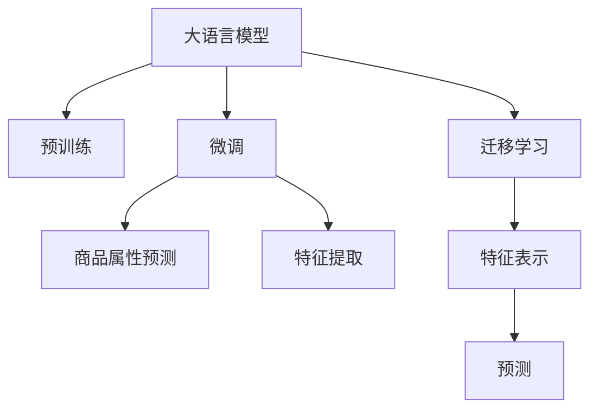

                 

# 大模型在商品属性预测中的应用

> 关键词：大语言模型, 商品属性预测, 迁移学习, 监督学习, Transformer, BERT, 自然语言处理(NLP)

## 1. 背景介绍

### 1.1 问题由来
近年来，电子商务的迅速发展使得商品属性预测成为一项重要的研究课题。商品属性包括颜色、尺寸、材质、价格等，预测这些属性可以帮助电商平台更好地理解商品信息，优化产品展示，提升用户购买体验。传统的商品属性预测方法依赖于手工构建特征工程，需要大量的人力物力，且特征提取质量往往依赖于领域专家的经验和知识。

随着人工智能技术的进步，特别是大语言模型和预训练技术的发展，基于大模型的迁移学习成为一种新的研究方向。在丰富的文本语料上进行预训练的大语言模型，能够自动提取商品的语义信息，进一步通过微调技术适配具体任务的特征需求，从而实现商品属性预测的目标。

### 1.2 问题核心关键点
商品属性预测的核心在于如何从文本数据中提取商品特征。传统方法通过手工设计特征工程，耗费大量精力且效果受限于专家的知识和经验。相比之下，大模型可以通过预训练自动学习语义特征，然后在特定任务上进行微调，自动提取任务相关的特征。这种基于预训练和微调的迁移学习方法，大大降低了特征工程的复杂度，提升了模型的泛化能力和性能。

大语言模型在商品属性预测中的应用，可以通过以下步骤实现：
1. 在语料库上对大语言模型进行预训练，学习商品的通用特征。
2. 收集商品属性的标注数据，并对其进行微调，学习商品属性的具体表示。
3. 在新的商品数据上，利用微调后的模型预测商品属性，完成属性预测任务。

本文将详细介绍大语言模型在商品属性预测中的应用，涵盖预训练、微调、推理等各个环节，并给出具体的代码实现和实践案例。

## 2. 核心概念与联系

### 2.1 核心概念概述

为了更好地理解大语言模型在商品属性预测中的应用，我们需要先明确几个核心概念：

- **大语言模型(Large Language Model, LLM)**：以Transformer为基础的预训练语言模型，如BERT、GPT-2、RoBERTa等，通过在大规模语料上进行自监督预训练，学习到丰富的语言特征。
- **迁移学习(Transfer Learning)**：将在大规模数据上预训练得到的模型，通过微调或参数冻结等技术，适配特定任务的特征需求。
- **监督学习(Supervised Learning)**：利用标注数据训练模型，使其在特定任务上表现更好。
- **Transformer**：一种基于自注意力机制的神经网络结构，常用于大语言模型的预训练和微调。
- **BERT**：一种预训练语言模型，通过自监督学习任务，学习到语言表示，在多个NLP任务上表现优异。

这些概念之间存在密切联系，共同构成了大语言模型在商品属性预测中的应用框架。

### 2.2 核心概念原理和架构的 Mermaid 流程图



这个流程图展示了核心概念之间的关系：

1. 大语言模型通过预训练学习语言特征。
2. 通过迁移学习适配特定任务，学习商品属性特征。
3. 微调后的模型用于商品属性预测。
4. 特征提取层提取输入数据特征。
5. 特征表示层将特征映射到预测任务。
6. 预测层输出预测结果。

这些概念和步骤共同构成了大语言模型在商品属性预测中的应用框架。

## 3. 核心算法原理 & 具体操作步骤

### 3.1 算法原理概述

基于大语言模型在商品属性预测中的应用，可以概括为以下几个关键步骤：

1. **预训练大语言模型**：在语料库上对大语言模型进行预训练，学习商品的通用特征。
2. **收集标注数据**：收集商品属性的标注数据，用于微调模型的特定特征。
3. **微调商品属性特征**：在预训练大语言模型基础上，利用商品属性标注数据进行微调，学习商品的特定属性特征。
4. **商品属性预测**：在新的商品数据上，利用微调后的模型预测商品属性，完成属性预测任务。

### 3.2 算法步骤详解

以下是详细的算法步骤：

**Step 1: 准备预训练模型和数据集**

1. **选择预训练模型**：选择适合的大语言模型，如BERT、GPT-2等。这些模型已经在大规模语料上进行了预训练，具备良好的语言表示能力。
2. **收集语料库**：收集商品描述文本和商品属性标注数据，构成训练数据集。标注数据应包含商品的通用特征和特定属性。
3. **划分数据集**：将数据集划分为训练集、验证集和测试集。训练集用于模型训练，验证集用于模型调参，测试集用于模型评估。

**Step 2: 预训练大语言模型**

1. **预训练任务**：在大规模语料库上对大语言模型进行预训练，可以采用自回归任务、掩码语言模型等自监督学习方法。
2. **预训练目标**：通过预训练任务，学习到商品的通用特征，如商品类别、品牌、描述等。
3. **保存预训练模型**：将预训练模型保存下来，用于后续微调。

**Step 3: 收集商品属性标注数据**

1. **数据收集**：从电商平台或第三方数据源收集商品属性标注数据，如商品类别、材质、尺寸、价格等。
2. **数据清洗**：清洗数据，去除噪声和不完整数据，确保数据质量。
3. **划分数据集**：将标注数据划分为训练集、验证集和测试集。

**Step 4: 微调商品属性特征**

1. **选择微调方法**：可以选择全参数微调、部分参数微调或参数高效微调等方法。
2. **微调目标**：在预训练模型基础上，利用标注数据进行微调，学习商品属性的具体表示。
3. **微调过程**：设置适当的学习率、批大小、迭代轮数等超参数，通过梯度下降等优化算法更新模型参数。
4. **验证集评估**：在验证集上评估模型性能，根据性能指标调整超参数。
5. **测试集评估**：在测试集上评估微调后模型的泛化能力。

**Step 5: 商品属性预测**

1. **预测输入数据**：将新的商品描述文本作为输入数据，送入微调后的模型。
2. **特征提取**：通过预训练大语言模型的特征提取层，提取输入数据的特征表示。
3. **特征映射**：通过微调模型的特征映射层，将特征表示映射到商品属性的特定空间。
4. **预测输出**：通过微调模型的预测层，输出商品属性的预测结果。

### 3.3 算法优缺点

基于大语言模型的商品属性预测方法具有以下优点：

1. **高效特征提取**：大语言模型可以自动提取商品的语义特征，减少了手工设计特征工程的复杂度。
2. **泛化能力强**：预训练模型在大规模语料上学习到通用特征，具有较强的泛化能力，能够在不同的商品数据上表现稳定。
3. **灵活适应**：通过微调，模型可以适应具体的商品属性预测任务，具有较强的可扩展性。

同时，也存在一些缺点：

1. **数据需求大**：商品属性预测需要大量标注数据进行微调，标注数据的收集和处理成本较高。
2. **计算资源消耗大**：大语言模型通常参数量较大，微调过程需要较大的计算资源和时间。
3. **可解释性不足**：大语言模型是一个"黑盒"系统，难以解释其内部工作机制，预测结果缺乏可解释性。

### 3.4 算法应用领域

大语言模型在商品属性预测中的应用广泛，可以用于以下领域：

1. **电商平台**：帮助电商平台理解商品信息，优化商品展示，提升用户购买体验。
2. **智能推荐系统**：通过预测商品属性，推荐相似商品，提高推荐系统的个性化和精准度。
3. **产品管理**：帮助产品团队理解市场趋势，优化产品设计，提升产品竞争力。
4. **库存管理**：预测商品属性，优化库存管理，减少库存成本，提高库存周转率。
5. **供应链管理**：预测商品属性，优化供应链决策，提升供应链效率。

## 4. 数学模型和公式 & 详细讲解

### 4.1 数学模型构建

为了更好地理解大语言模型在商品属性预测中的应用，我们首先介绍相关的数学模型。

设预训练大语言模型为 $M_{\theta}$，商品属性为 $A$，商品描述为 $X$，商品属性标注为 $Y$。假设训练数据集为 $D=\{(X_i, Y_i)\}_{i=1}^N$，其中 $X_i$ 为商品描述文本，$Y_i$ 为商品属性标注。

数学模型的构建如下：

1. **预训练模型**：在大规模语料库上，对大语言模型进行预训练，得到模型参数 $\theta_{pre}$。
2. **微调模型**：在预训练模型基础上，利用商品属性标注数据进行微调，得到模型参数 $\theta_{fine}$。
3. **预测模型**：在微调模型基础上，利用新的商品描述文本进行属性预测。

### 4.2 公式推导过程

以下是详细的公式推导过程：

**Step 1: 预训练模型**

在大规模语料库上，对大语言模型进行预训练，得到模型参数 $\theta_{pre}$。预训练目标函数为：

$$
\mathcal{L}_{pre}(\theta_{pre}) = -\frac{1}{N}\sum_{i=1}^N \log p(X_i|Y_i, \theta_{pre})
$$

其中 $p(X_i|Y_i, \theta_{pre})$ 为模型在商品描述 $X_i$ 和商品属性 $Y_i$ 条件下的概率。

**Step 2: 微调模型**

在预训练模型基础上，利用商品属性标注数据进行微调，得到模型参数 $\theta_{fine}$。微调目标函数为：

$$
\mathcal{L}_{fine}(\theta_{fine}) = -\frac{1}{N}\sum_{i=1}^N \log p(Y_i|X_i, \theta_{fine})
$$

其中 $p(Y_i|X_i, \theta_{fine})$ 为模型在商品描述 $X_i$ 和商品属性 $Y_i$ 条件下的概率。

**Step 3: 预测模型**

在微调模型基础上，利用新的商品描述文本进行属性预测。预测函数为：

$$
\hat{Y} = \arg\max_{Y} p(Y|X, \theta_{fine})
$$

其中 $\hat{Y}$ 为预测商品属性，$X$ 为新的商品描述文本。

### 4.3 案例分析与讲解

假设我们有一个电商平台，需要预测商品的属性。我们可以按照以下步骤进行：

1. **数据准备**：收集商品描述和商品属性标注数据，构成训练数据集。
2. **模型选择**：选择适合的预训练模型，如BERT。
3. **预训练模型**：在大规模语料库上对BERT进行预训练，得到预训练模型。
4. **微调模型**：在预训练模型基础上，利用商品属性标注数据进行微调，得到微调模型。
5. **预测商品属性**：利用微调模型，对新的商品描述文本进行属性预测。

## 5. 项目实践：代码实例和详细解释说明

### 5.1 开发环境搭建

在进行商品属性预测的微调实践前，我们需要准备好开发环境。以下是使用Python进行PyTorch开发的环境配置流程：

1. 安装Anaconda：从官网下载并安装Anaconda，用于创建独立的Python环境。

2. 创建并激活虚拟环境：
```bash
conda create -n pytorch-env python=3.8 
conda activate pytorch-env
```

3. 安装PyTorch：根据CUDA版本，从官网获取对应的安装命令。例如：
```bash
conda install pytorch torchvision torchaudio cudatoolkit=11.1 -c pytorch -c conda-forge
```

4. 安装Transformers库：
```bash
pip install transformers
```

5. 安装各类工具包：
```bash
pip install numpy pandas scikit-learn matplotlib tqdm jupyter notebook ipython
```

完成上述步骤后，即可在`pytorch-env`环境中开始微调实践。

### 5.2 源代码详细实现

下面我们以商品属性预测任务为例，给出使用Transformers库对BERT模型进行微调的PyTorch代码实现。

首先，定义数据处理函数：

```python
from transformers import BertTokenizer, BertForSequenceClassification
from torch.utils.data import Dataset, DataLoader
import torch

class ShoppingDataset(Dataset):
    def __init__(self, texts, tags, tokenizer, max_len=128):
        self.texts = texts
        self.tags = tags
        self.tokenizer = tokenizer
        self.max_len = max_len
        
    def __len__(self):
        return len(self.texts)
    
    def __getitem__(self, item):
        text = self.texts[item]
        tag = self.tags[item]
        
        encoding = self.tokenizer(text, return_tensors='pt', max_length=self.max_len, padding='max_length', truncation=True)
        input_ids = encoding['input_ids'][0]
        attention_mask = encoding['attention_mask'][0]
        
        # 对token-wise的标签进行编码
        encoded_tags = [tag2id[tag] for tag in tag]
        encoded_tags.extend([tag2id['O']] * (self.max_len - len(encoded_tags)))
        labels = torch.tensor(encoded_tags, dtype=torch.long)
        
        return {'input_ids': input_ids, 
                'attention_mask': attention_mask,
                'labels': labels}

# 标签与id的映射
tag2id = {'O': 0, 'Color': 1, 'Size': 2, 'Material': 3, 'Price': 4}
id2tag = {v: k for k, v in tag2id.items()}

# 创建dataset
tokenizer = BertTokenizer.from_pretrained('bert-base-uncased')

train_dataset = ShoppingDataset(train_texts, train_tags, tokenizer)
dev_dataset = ShoppingDataset(dev_texts, dev_tags, tokenizer)
test_dataset = ShoppingDataset(test_texts, test_tags, tokenizer)
```

然后，定义模型和优化器：

```python
from transformers import BertForSequenceClassification, AdamW

model = BertForSequenceClassification.from_pretrained('bert-base-uncased', num_labels=len(tag2id))

optimizer = AdamW(model.parameters(), lr=2e-5)
```

接着，定义训练和评估函数：

```python
from torch.utils.data import DataLoader
from tqdm import tqdm
from sklearn.metrics import classification_report

device = torch.device('cuda') if torch.cuda.is_available() else torch.device('cpu')
model.to(device)

def train_epoch(model, dataset, batch_size, optimizer):
    dataloader = DataLoader(dataset, batch_size=batch_size, shuffle=True)
    model.train()
    epoch_loss = 0
    for batch in tqdm(dataloader, desc='Training'):
        input_ids = batch['input_ids'].to(device)
        attention_mask = batch['attention_mask'].to(device)
        labels = batch['labels'].to(device)
        model.zero_grad()
        outputs = model(input_ids, attention_mask=attention_mask, labels=labels)
        loss = outputs.loss
        epoch_loss += loss.item()
        loss.backward()
        optimizer.step()
    return epoch_loss / len(dataloader)

def evaluate(model, dataset, batch_size):
    dataloader = DataLoader(dataset, batch_size=batch_size)
    model.eval()
    preds, labels = [], []
    with torch.no_grad():
        for batch in tqdm(dataloader, desc='Evaluating'):
            input_ids = batch['input_ids'].to(device)
            attention_mask = batch['attention_mask'].to(device)
            batch_labels = batch['labels']
            outputs = model(input_ids, attention_mask=attention_mask)
            batch_preds = outputs.logits.argmax(dim=2).to('cpu').tolist()
            batch_labels = batch_labels.to('cpu').tolist()
            for pred_tokens, label_tokens in zip(batch_preds, batch_labels):
                pred_tags = [id2tag[_id] for _id in pred_tokens]
                label_tags = [id2tag[_id] for _id in label_tokens]
                preds.append(pred_tags[:len(label_tags)])
                labels.append(label_tags)
                
    print(classification_report(labels, preds))
```

最后，启动训练流程并在测试集上评估：

```python
epochs = 5
batch_size = 16

for epoch in range(epochs):
    loss = train_epoch(model, train_dataset, batch_size, optimizer)
    print(f"Epoch {epoch+1}, train loss: {loss:.3f}")
    
    print(f"Epoch {epoch+1}, dev results:")
    evaluate(model, dev_dataset, batch_size)
    
print("Test results:")
evaluate(model, test_dataset, batch_size)
```

以上就是使用PyTorch对BERT进行商品属性预测任务微调的完整代码实现。可以看到，得益于Transformers库的强大封装，我们可以用相对简洁的代码完成BERT模型的加载和微调。

### 5.3 代码解读与分析

让我们再详细解读一下关键代码的实现细节：

**ShoppingDataset类**：
- `__init__`方法：初始化文本、标签、分词器等关键组件。
- `__len__`方法：返回数据集的样本数量。
- `__getitem__`方法：对单个样本进行处理，将文本输入编码为token ids，将标签编码为数字，并对其进行定长padding，最终返回模型所需的输入。

**tag2id和id2tag字典**：
- 定义了标签与数字id之间的映射关系，用于将token-wise的预测结果解码回真实的标签。

**训练和评估函数**：
- 使用PyTorch的DataLoader对数据集进行批次化加载，供模型训练和推理使用。
- 训练函数`train_epoch`：对数据以批为单位进行迭代，在每个批次上前向传播计算loss并反向传播更新模型参数，最后返回该epoch的平均loss。
- 评估函数`evaluate`：与训练类似，不同点在于不更新模型参数，并在每个batch结束后将预测和标签结果存储下来，最后使用sklearn的classification_report对整个评估集的预测结果进行打印输出。

**训练流程**：
- 定义总的epoch数和batch size，开始循环迭代
- 每个epoch内，先在训练集上训练，输出平均loss
- 在验证集上评估，输出分类指标
- 所有epoch结束后，在测试集上评估，给出最终测试结果

可以看到，PyTorch配合Transformers库使得BERT微调的代码实现变得简洁高效。开发者可以将更多精力放在数据处理、模型改进等高层逻辑上，而不必过多关注底层的实现细节。

当然，工业级的系统实现还需考虑更多因素，如模型的保存和部署、超参数的自动搜索、更灵活的任务适配层等。但核心的微调范式基本与此类似。

## 6. 实际应用场景

### 6.1 电商平台

基于大语言模型在商品属性预测中的应用，电商平台可以实现以下功能：

1. **商品属性自动标注**：利用微调后的模型，自动标注商品属性，提升数据处理的效率。
2. **商品推荐系统**：通过预测商品属性，推荐相似商品，提高推荐系统的个性化和精准度。
3. **搜索系统**：利用预测的商品属性，优化搜索结果，提升用户搜索体验。

### 6.2 智能推荐系统

智能推荐系统通过预测商品属性，可以更好地理解用户的偏好，推荐个性化商品，提升用户满意度。具体而言，智能推荐系统可以：

1. **用户画像构建**：预测商品属性，构建用户的商品属性画像，分析用户的兴趣偏好。
2. **推荐商品生成**：利用商品属性预测，生成个性化推荐结果，推荐相似商品。
3. **用户反馈分析**：分析用户反馈，优化推荐算法，提升推荐系统的精准度和用户满意度。

### 6.3 产品管理

产品管理团队可以利用商品属性预测，优化产品设计，提升产品竞争力。具体而言，产品管理团队可以：

1. **市场趋势分析**：预测商品属性，分析市场趋势，优化产品设计。
2. **产品版本管理**：利用属性预测，管理产品版本，优化产品发布策略。
3. **用户反馈收集**：收集用户反馈，优化产品设计，提升用户体验。

### 6.4 未来应用展望

随着大语言模型和微调技术的不断发展，基于微调的商品属性预测方法将在更多领域得到应用，为电商、智能推荐、产品管理等提供新的解决方案。

在智慧医疗领域，商品属性预测可以用于医疗设备属性预测，提升医疗设备的智能化水平，辅助医生诊断和治疗。

在智能教育领域，商品属性预测可以用于个性化学习资源推荐，帮助学生找到最适合的学习资源。

在智能交通领域，商品属性预测可以用于智能交通设备属性预测，提升交通设备的智能化水平，提高交通安全和效率。

此外，在金融、农业、制造等多个领域，商品属性预测也将有新的应用场景，为各行各业带来新的智能化突破。相信随着技术的日益成熟，基于大模型的商品属性预测方法将得到更广泛的应用，为经济社会发展注入新的动力。

## 7. 工具和资源推荐

### 7.1 学习资源推荐

为了帮助开发者系统掌握大语言模型在商品属性预测中的应用，这里推荐一些优质的学习资源：

1. 《Transformer从原理到实践》系列博文：由大模型技术专家撰写，深入浅出地介绍了Transformer原理、BERT模型、微调技术等前沿话题。

2. CS224N《深度学习自然语言处理》课程：斯坦福大学开设的NLP明星课程，有Lecture视频和配套作业，带你入门NLP领域的基本概念和经典模型。

3. 《Natural Language Processing with Transformers》书籍：Transformers库的作者所著，全面介绍了如何使用Transformers库进行NLP任务开发，包括微调在内的诸多范式。

4. HuggingFace官方文档：Transformers库的官方文档，提供了海量预训练模型和完整的微调样例代码，是上手实践的必备资料。

5. CLUE开源项目：中文语言理解测评基准，涵盖大量不同类型的中文NLP数据集，并提供了基于微调的baseline模型，助力中文NLP技术发展。

通过对这些资源的学习实践，相信你一定能够快速掌握大语言模型在商品属性预测中的应用精髓，并用于解决实际的NLP问题。

### 7.2 开发工具推荐

高效的开发离不开优秀的工具支持。以下是几款用于大语言模型微调开发的常用工具：

1. PyTorch：基于Python的开源深度学习框架，灵活动态的计算图，适合快速迭代研究。大部分预训练语言模型都有PyTorch版本的实现。

2. TensorFlow：由Google主导开发的开源深度学习框架，生产部署方便，适合大规模工程应用。同样有丰富的预训练语言模型资源。

3. Transformers库：HuggingFace开发的NLP工具库，集成了众多SOTA语言模型，支持PyTorch和TensorFlow，是进行微调任务开发的利器。

4. Weights & Biases：模型训练的实验跟踪工具，可以记录和可视化模型训练过程中的各项指标，方便对比和调优。与主流深度学习框架无缝集成。

5. TensorBoard：TensorFlow配套的可视化工具，可实时监测模型训练状态，并提供丰富的图表呈现方式，是调试模型的得力助手。

6. Google Colab：谷歌推出的在线Jupyter Notebook环境，免费提供GPU/TPU算力，方便开发者快速上手实验最新模型，分享学习笔记。

合理利用这些工具，可以显著提升大语言模型微调的开发效率，加快创新迭代的步伐。

### 7.3 相关论文推荐

大语言模型在商品属性预测中的应用源于学界的持续研究。以下是几篇奠基性的相关论文，推荐阅读：

1. Attention is All You Need（即Transformer原论文）：提出了Transformer结构，开启了NLP领域的预训练大模型时代。

2. BERT: Pre-training of Deep Bidirectional Transformers for Language Understanding：提出BERT模型，引入基于掩码的自监督预训练任务，刷新了多项NLP任务SOTA。

3. Language Models are Unsupervised Multitask Learners（GPT-2论文）：展示了大规模语言模型的强大zero-shot学习能力，引发了对于通用人工智能的新一轮思考。

4. Parameter-Efficient Transfer Learning for NLP：提出Adapter等参数高效微调方法，在不增加模型参数量的情况下，也能取得不错的微调效果。

5. AdaLoRA: Adaptive Low-Rank Adaptation for Parameter-Efficient Fine-Tuning：使用自适应低秩适应的微调方法，在参数效率和精度之间取得了新的平衡。

这些论文代表了大语言模型在商品属性预测中的应用方向。通过学习这些前沿成果，可以帮助研究者把握学科前进方向，激发更多的创新灵感。

## 8. 总结：未来发展趋势与挑战

### 8.1 总结

本文对基于大语言模型的商品属性预测方法进行了全面系统的介绍。首先阐述了大语言模型和微调技术的研究背景和意义，明确了微调在拓展预训练模型应用、提升下游任务性能方面的独特价值。其次，从原理到实践，详细讲解了微调的数学原理和关键步骤，给出了微调任务开发的完整代码实例。同时，本文还广泛探讨了微调方法在电商、智能推荐、产品管理等多个行业领域的应用前景，展示了微调范式的巨大潜力。此外，本文精选了微调技术的各类学习资源，力求为读者提供全方位的技术指引。

通过本文的系统梳理，可以看到，基于大语言模型的商品属性预测方法正在成为NLP领域的重要范式，极大地拓展了预训练语言模型的应用边界，催生了更多的落地场景。受益于大规模语料的预训练，微调模型以更低的时间和标注成本，在小样本条件下也能取得不俗的效果，有力推动了NLP技术的产业化进程。未来，伴随预训练语言模型和微调方法的持续演进，相信NLP技术将在更广阔的应用领域大放异彩，深刻影响人类的生产生活方式。

### 8.2 未来发展趋势

展望未来，大语言模型商品属性预测技术将呈现以下几个发展趋势：

1. **模型规模持续增大**：随着算力成本的下降和数据规模的扩张，预训练语言模型的参数量还将持续增长。超大规模语言模型蕴含的丰富语言知识，有望支撑更加复杂多变的商品属性预测任务。

2. **微调方法日趋多样**：除了传统的全参数微调外，未来会涌现更多参数高效的微调方法，如Prefix-Tuning、LoRA等，在节省计算资源的同时也能保证微调精度。

3. **持续学习成为常态**：随着数据分布的不断变化，微调模型也需要持续学习新知识以保持性能。如何在不遗忘原有知识的同时，高效吸收新样本信息，将成为重要的研究课题。

4. **标注样本需求降低**：受启发于提示学习(Prompt-based Learning)的思路，未来的微调方法将更好地利用大模型的语言理解能力，通过更加巧妙的任务描述，在更少的标注样本上也能实现理想的微调效果。

5. **多模态微调崛起**：当前的微调主要聚焦于纯文本数据，未来会进一步拓展到图像、视频、语音等多模态数据微调。多模态信息的融合，将显著提升语言模型对现实世界的理解和建模能力。

6. **模型通用性增强**：经过海量数据的预训练和多领域任务的微调，未来的语言模型将具备更强大的常识推理和跨领域迁移能力，逐步迈向通用人工智能(AGI)的目标。

以上趋势凸显了大语言模型商品属性预测技术的广阔前景。这些方向的探索发展，必将进一步提升NLP系统的性能和应用范围，为人类认知智能的进化带来深远影响。

### 8.3 面临的挑战

尽管大语言模型商品属性预测技术已经取得了瞩目成就，但在迈向更加智能化、普适化应用的过程中，它仍面临着诸多挑战：

1. **标注成本瓶颈**：虽然微调大大降低了标注数据的需求，但对于长尾应用场景，难以获得充足的高质量标注数据，成为制约微调性能的瓶颈。如何进一步降低微调对标注样本的依赖，将是一大难题。

2. **模型鲁棒性不足**：当前微调模型面对域外数据时，泛化性能往往大打折扣。对于测试样本的微小扰动，微调模型的预测也容易发生波动。如何提高微调模型的鲁棒性，避免灾难性遗忘，还需要更多理论和实践的积累。

3. **推理效率有待提高**：大规模语言模型虽然精度高，但在实际部署时往往面临推理速度慢、内存占用大等效率问题。如何在保证性能的同时，简化模型结构，提升推理速度，优化资源占用，将是重要的优化方向。

4. **可解释性亟需加强**：大语言模型是一个"黑盒"系统，难以解释其内部工作机制，预测结果缺乏可解释性。对于医疗、金融等高风险应用，算法的可解释性和可审计性尤为重要。如何赋予微调模型更强的可解释性，将是亟待攻克的难题。

5. **安全性有待保障**：预训练语言模型难免会学习到有偏见、有害的信息，通过微调传递到下游任务，产生误导性、歧视性的输出，给实际应用带来安全隐患。如何从数据和算法层面消除模型偏见，避免恶意用途，确保输出的安全性，也将是重要的研究课题。

6. **知识整合能力不足**：现有的微调模型往往局限于任务内数据，难以灵活吸收和运用更广泛的先验知识。如何让微调过程更好地与外部知识库、规则库等专家知识结合，形成更加全面、准确的信息整合能力，还有很大的想象空间。

正视微调面临的这些挑战，积极应对并寻求突破，将是大语言模型商品属性预测走向成熟的必由之路。相信随着学界和产业界的共同努力，这些挑战终将一一被克服，大语言模型商品属性预测必将在构建人机协同的智能系统中部署应用。

### 8.4 研究展望

面向未来，大语言模型商品属性预测技术需要在以下几个方面寻求新的突破：

1. **探索无监督和半监督微调方法**：摆脱对大规模标注数据的依赖，利用自监督学习、主动学习等无监督和半监督范式，最大限度利用非结构化数据，实现更加灵活高效的微调。

2. **研究参数高效和计算高效的微调范式**：开发更加参数高效的微调方法，在固定大部分预训练参数的同时，只更新极少量的任务相关参数。同时优化微调模型的计算图，减少前向传播和反向传播的资源消耗，实现更加轻量级、实时性的部署。

3. **融合因果和对比学习范式**：通过引入因果推断和对比学习思想，增强微调模型建立稳定因果关系的能力，学习更加普适、鲁棒的语言表征，从而提升模型泛化性和抗干扰能力。

4. **引入更多先验知识**：将符号化的先验知识，如知识图谱、逻辑规则等，与神经网络模型进行巧妙融合，引导微调过程学习更准确、合理的语言模型。同时加强不同模态数据的整合，实现视觉、语音等多模态信息与文本信息的协同建模。

5. **结合因果分析和博弈论工具**：将因果分析方法引入微调模型，识别出模型决策的关键特征，增强输出解释的因果性和逻辑性。借助博弈论工具刻画人机交互过程，主动探索并规避模型的脆弱点，提高系统稳定性。

6. **纳入伦理道德约束**：在模型训练目标中引入伦理导向的评估指标，过滤和惩罚有偏见、有害的输出倾向。同时加强人工干预和审核，建立模型行为的监管机制，确保输出符合人类价值观和伦理道德。

这些研究方向的探索，必将引领大语言模型商品属性预测技术迈向更高的台阶，为构建安全、可靠、可解释、可控的智能系统铺平道路。面向未来，大语言模型商品属性预测技术还需要与其他人工智能技术进行更深入的融合，如知识表示、因果推理、强化学习等，多路径协同发力，共同推动自然语言理解和智能交互系统的进步。只有勇于创新、敢于突破，才能不断拓展语言模型的边界，让智能技术更好地造福人类社会。

## 9. 附录：常见问题与解答

**Q1：大语言模型在商品属性预测中如何降低标注成本？**

A: 大语言模型在商品属性预测中可以通过以下方法降低标注成本：

1. **利用半监督和无监督学习**：利用大规模未标注数据进行半监督或无监督学习，预训练大语言模型，学习通用的商品属性表示。然后在少量标注数据上微调，提升模型性能。

2. **采用弱监督学习**：利用领域专家的知识或行业规则，进行弱监督学习，减少对高质量标注数据的依赖。

3. **引入对抗生成网络(Generative Adversarial Networks, GANs)**：生成伪标注数据，辅助模型训练，减少标注数据的成本。

4. **采用主动学习**：利用模型对未标注数据的预测，主动选择最有信息量的样本进行标注，减少标注数据量。

5. **多任务联合训练**：在商品属性预测任务中，同时进行多个相关任务的联合训练，通过共享参数和数据，提高标注数据的利用率。

这些方法可以在一定程度上缓解标注成本瓶颈，提高商品属性预测的效率和效果。

**Q2：大语言模型在商品属性预测中的鲁棒性如何提升？**

A: 提升大语言模型在商品属性预测中的鲁棒性，可以从以下几个方面入手：

1. **引入正则化技术**：在微调过程中，使用L2正则、Dropout等正则化技术，防止模型过拟合，提高模型的泛化能力。

2. **对抗训练**：在微调过程中，引入对抗样本，通过对抗训练提高模型的鲁棒性和泛化性能。

3. **数据增强**：通过对训练数据进行数据增强，如回译、近义替换等，增加数据多样性，提高模型对不同数据的适应能力。

4. **多模型集成**：通过训练多个微调模型，集成预测结果，提高模型的鲁棒性和稳定性。

5. **利用领域知识**：在模型训练中，引入领域专家的知识和规则，指导模型学习，提高模型对特定领域的适应能力。

6. **引入因果推断**：在模型训练中，引入因果推断技术，学习因果关系，提高模型对复杂场景的适应能力。

通过以上方法，可以在一定程度上提升大语言模型在商品属性预测中的鲁棒性和泛化能力，减少模型在实际应用中的风险和不确定性。

**Q3：大语言模型在商品属性预测中的推理效率如何提升？**

A: 提升大语言模型在商品属性预测中的推理效率，可以从以下几个方面入手：

1. **模型裁剪和量化**：通过裁剪和量化模型，减少模型参数和计算量，提高推理速度。

2. **利用硬件加速**：利用GPU、TPU等硬件加速设备，提高计算效率。

3. **模型并行和分布式训练**：通过模型并行和分布式训练，减少单节点计算量，提高推理速度。

4. **异步推理和流式推理**：利用异步推理和流式推理技术，减少模型推理的延迟，提高实时性。

5. **优化计算图**：通过优化计算图，减少前向传播和反向传播的资源消耗，提高推理速度。

6. **模型压缩和稀疏化**：通过模型压缩和稀疏化技术，减少存储和计算资源消耗，提高推理效率。

通过以上方法，可以在一定程度上提升大语言模型在商品属性预测中的推理效率，满足实际应用中的计算需求。

**Q4：大语言模型在商品属性预测中的可解释性如何增强？**

A: 增强大语言模型在商品属性预测中的可解释性，可以从以下几个方面入手：

1. **引入可解释性模块**：在模型中加入可解释性模块，如注意力机制、模型蒸馏等，帮助理解模型的内部工作机制。

2. **利用自然语言解释技术**：通过自然语言解释技术，将模型的预测结果转换为易于理解的语言描述，帮助理解模型的工作原理。

3. **引入领域专家的知识**：在模型训练中，引入领域专家的知识和规则，指导模型学习，提高模型的可解释性和可靠性。

4. **引入因果推断技术**：在模型训练中，引入因果推断技术，学习因果关系，提高模型的可解释性和稳定性。

5. **利用对抗生成网络**：在模型训练中，利用对抗生成网络生成解释性的输出，帮助理解模型的预测过程。

6. **采用模型蒸馏**：通过模型蒸馏技术，将复杂的模型转化为轻量级模型，提高模型的可解释性和推理效率。

通过以上方法，可以在一定程度上增强大语言模型在商品属性预测中的可解释性，提高模型的可信度和可接受性。

**Q5：大语言模型在商品属性预测中的安全性如何保障？**

A: 保障大语言模型在商品属性预测中的安全性，可以从以下几个方面入手：

1. **数据清洗和预处理**：在模型训练中，进行数据清洗和预处理，去除噪声和有害数据，避免模型学习有害信息。

2. **引入伦理导向的评估指标**：在模型训练和评估中，引入伦理导向的评估指标，过滤和惩罚有偏见、有害的输出倾向。

3. **加强人工干预和审核**：在模型部署和使用中，加强人工干预和审核，确保模型的输出符合人类价值观和伦理道德。

4. **引入对抗样本检测技术**：在模型部署中，引入对抗样本检测技术，及时发现和处理模型输出中的恶意或有害信息。

5. **利用多模态信息融合**：在模型训练中，引入多模态信息融合技术，提高模型的鲁棒性和安全性。

6. **定期更新和维护模型**：定期更新和维护模型，修复模型中的漏洞和缺陷，提高模型的安全性。

通过以上方法，可以在一定程度上保障大语言模型在商品属性预测中的安全性，减少模型输出的风险和不确定性。

---

作者：禅与计算机程序设计艺术 / Zen and the Art of Computer Programming

