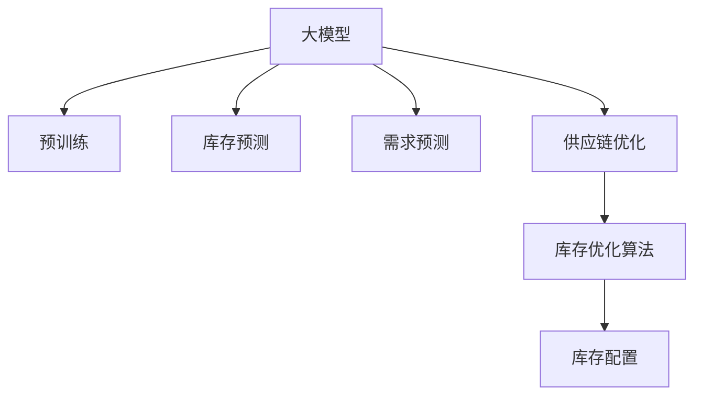

                 

# 大模型在商品库存智能管理中的应用

> 关键词：商品库存管理,大模型,预训练模型,库存预测,需求预测,供应链优化

## 1. 背景介绍

### 1.1 问题由来

在现代零售和电子商务领域，库存管理是一个复杂且关键的过程。有效的库存管理可以降低运营成本，提高客户满意度，减少缺货或过剩的风险。然而，传统的库存管理方法往往依赖于人工经验或简单的统计模型，难以适应快速变化的市场需求和复杂的供应链环境。

为了解决这一问题，大模型（Large Model）在商品库存智能管理中的应用被广泛关注。大模型通过在大规模无标签数据上进行预训练，学习到丰富的知识表示，可以应用于商品库存的预测和优化，极大地提升了库存管理效率和精度。

### 1.2 问题核心关键点

大模型在商品库存智能管理中的应用主要包括以下几个关键点：

- 商品库存预测：通过大模型学习历史销售数据，预测未来一段时间内的库存需求，帮助企业提前备货，避免库存积压或短缺。
- 需求预测：结合市场趋势、季节性因素等，预测未来需求，优化采购和生产计划。
- 供应链优化：通过大模型分析供应链网络，优化商品流向，提高供应链效率和响应速度。
- 库存优化算法：结合大模型的预测结果，设计优化算法，调整库存水平和补货策略，实现最优库存配置。

这些关键点构成了大模型在商品库存智能管理中的核心应用，通过优化库存预测和供应链管理，极大地提高了企业的运营效率和客户满意度。

### 1.3 问题研究意义

研究大模型在商品库存管理中的应用，对于提升零售和电子商务企业的运营效率、降低成本、提高客户满意度具有重要意义：

1. 提升预测精度：通过大模型的学习能力和知识迁移，可以显著提高库存和需求预测的准确性，避免因库存不足或过剩带来的损失。
2. 降低运营成本：通过优化库存和供应链管理，可以降低存货成本、运输成本、仓储成本等，实现成本节约。
3. 提高客户满意度：通过准确的库存预测和快速的补货响应，可以显著提高客户满意度，提升品牌忠诚度。
4. 促进供应链协同：通过大模型优化供应链网络，可以实现企业间的高效协作，提升供应链的整体效率和稳定性。
5. 推动技术创新：大模型的应用促进了库存管理的智能化和自动化，为NLP技术在工业领域的落地提供了新的思路和路径。

## 2. 核心概念与联系

### 2.1 核心概念概述

为了更好地理解大模型在商品库存智能管理中的应用，本节将介绍几个密切相关的核心概念：

- 大模型（Large Model）：以Transformer架构为代表，通过在大规模无标签数据上进行预训练，学习到丰富的知识表示。
- 预训练模型（Pre-trained Model）：指在大规模无标签数据上进行自监督学习，学习通用语言表示的模型。
- 库存预测（Inventory Forecasting）：通过预测未来一段时间内的库存需求，帮助企业合理备货，避免库存积压或短缺。
- 需求预测（Demand Forecasting）：结合市场趋势、季节性因素等，预测未来需求，优化采购和生产计划。
- 供应链优化（Supply Chain Optimization）：通过分析供应链网络，优化商品流向，提高供应链效率和响应速度。
- 库存优化算法（Inventory Optimization Algorithm）：结合库存预测结果，设计优化算法，调整库存水平和补货策略，实现最优库存配置。

这些核心概念之间的逻辑关系可以通过以下Mermaid流程图来展示：



这个流程图展示了大模型在商品库存智能管理中的核心概念及其之间的关系：

1. 大模型通过预训练获得基础能力。
2. 大模型应用于库存预测、需求预测、供应链优化等任务。
3. 库存优化算法基于预测结果进行库存配置和补货策略调整。

这些概念共同构成了大模型在商品库存智能管理中的应用框架，使其能够在复杂的供应链环境中发挥强大的预测和优化能力。

## 3. 核心算法原理 & 具体操作步骤

### 3.1 算法原理概述

大模型在商品库存智能管理中的应用，本质上是利用预训练模型的知识表示能力，对库存和需求数据进行预测和优化。其核心思想是：将大模型视作一个强大的"预测器"，通过历史数据训练，预测未来需求和库存水平，同时结合供应链优化算法，实现最优的库存配置。

形式化地，假设大模型为 $M_{\theta}$，其中 $\theta$ 为预训练得到的模型参数。库存数据为 $D_{inv}=\{(x_i,y_i)\}_{i=1}^N, x_i \in \mathcal{X}, y_i \in \mathcal{Y}$，需求数据为 $D_{demand}=\{(x_i,y_i)\}_{i=1}^M, x_i \in \mathcal{X}, y_i \in \mathcal{Y}$。库存优化算法为 $A$，供应链网络为 $S$。则大模型在商品库存智能管理中的应用过程可以表示为：

1. 对库存和需求数据进行预训练，得到大模型 $M_{\theta}$。
2. 使用大模型 $M_{\theta}$ 对库存需求进行预测，得到库存预测结果 $P_{inv} = M_{\theta}(D_{inv})$ 和需求预测结果 $P_{demand} = M_{\theta}(D_{demand})$。
3. 根据库存预测结果 $P_{inv}$ 和需求预测结果 $P_{demand}$，结合供应链优化算法 $A$ 和供应链网络 $S$，进行库存配置和补货策略调整，得到最优库存配置 $C_{inv}$。

通过这一过程，大模型可以有效地应用于商品库存的智能管理，提升预测精度和优化效率。

### 3.2 算法步骤详解

大模型在商品库存智能管理中的应用一般包括以下几个关键步骤：

**Step 1: 准备数据集**
- 收集历史库存和需求数据，划分为训练集、验证集和测试集。
- 对数据进行预处理，包括数据清洗、标准化、归一化等操作。

**Step 2: 加载预训练模型**
- 使用相应的预训练模型，如BERT、GPT等，进行模型加载和参数初始化。

**Step 3: 训练和预测**
- 将训练集数据输入模型进行前向传播计算损失函数。
- 反向传播计算参数梯度，根据设定的优化算法更新模型参数。
- 使用训练好的模型对测试集进行预测，得到库存和需求预测结果。

**Step 4: 库存优化**
- 根据预测结果和供应链优化算法，计算最优库存配置。
- 调整库存水平和补货策略，生成最优库存配置方案。

**Step 5: 测试和评估**
- 在测试集上评估预测精度和优化效果。
- 调整模型参数和算法策略，进一步提高预测和优化性能。

### 3.3 算法优缺点

大模型在商品库存智能管理中的应用具有以下优点：
1. 预测精度高：通过大规模预训练，大模型可以学习到丰富的知识表示，提高预测精度。
2. 适应性强：大模型具有强大的泛化能力，可以适应不同的供应链环境。
3. 可扩展性强：大模型具有强大的并行计算能力，可以在多个节点上进行分布式训练和推理。
4. 实时性高：大模型可以进行实时预测和优化，快速响应市场变化。

同时，该方法也存在一定的局限性：
1. 计算资源需求高：大模型的训练和推理需要大量的计算资源，可能会增加运营成本。
2. 数据需求大：大模型需要大量的历史数据进行预训练和预测，数据获取和处理可能较为复杂。
3. 模型复杂度高：大模型的结构和参数较多，可能导致模型的解释性和可控性较弱。
4. 更新频率高：市场需求变化快，模型需要频繁更新以保持预测精度和优化效果。

尽管存在这些局限性，但就目前而言，大模型在商品库存智能管理中的应用范式仍是大数据时代的重要技术手段。未来相关研究的重点在于如何进一步降低大模型的计算需求，提高模型的实时性和可解释性，同时兼顾预测精度和优化效率。

### 3.4 算法应用领域

大模型在商品库存智能管理中的应用主要包括以下几个领域：

- 零售商库存管理：通过预测未来需求和库存水平，帮助零售商合理备货，减少库存积压或短缺。
- 电商平台库存管理：结合用户行为数据，预测库存需求，优化库存配置，提升客户满意度。
- 制造业库存管理：结合供应链数据，预测需求和库存，优化生产计划和物流安排。
- 批发商库存管理：通过预测需求和库存，优化供应链网络，提高整体运营效率。
- 物流公司库存管理：结合物流数据，预测需求和库存，优化库存配置和运输路线。

这些领域的应用展示了大模型在商品库存智能管理中的广泛适用性，通过预测和优化，极大地提高了企业的运营效率和客户满意度。

## 4. 数学模型和公式 & 详细讲解

### 4.1 数学模型构建

本节将使用数学语言对大模型在商品库存智能管理中的应用进行更加严格的刻画。

假设库存数据为 $D_{inv}=\{(x_i,y_i)\}_{i=1}^N, x_i \in \mathcal{X}, y_i \in \mathcal{Y}$，需求数据为 $D_{demand}=\{(x_i,y_i)\}_{i=1}^M, x_i \in \mathcal{X}, y_i \in \mathcal{Y}$。大模型为 $M_{\theta}$，其中 $\theta$ 为预训练得到的模型参数。库存预测模型为 $P_{inv} = M_{\theta}(D_{inv})$，需求预测模型为 $P_{demand} = M_{\theta}(D_{demand})$。库存优化算法为 $A$，供应链网络为 $S$。

定义库存预测误差为 $E_{inv} = \sum_{i=1}^N |y_i - P_{inv}(x_i)|$，需求预测误差为 $E_{demand} = \sum_{i=1}^M |y_i - P_{demand}(x_i)|$。则大模型在商品库存智能管理中的应用目标可以表示为：

$$
\min_{\theta} \quad \alpha E_{inv} + \beta E_{demand}
$$

其中 $\alpha$ 和 $\beta$ 为惩罚系数，用于平衡库存和需求的预测误差。

### 4.2 公式推导过程

以下我们以需求预测任务为例，推导交叉熵损失函数及其梯度的计算公式。

假设模型 $M_{\theta}$ 在输入 $x$ 上的输出为 $\hat{y}=M_{\theta}(x) \in [0,1]$，表示样本属于正类的概率。真实标签 $y \in \{0,1\}$。则二分类交叉熵损失函数定义为：

$$
\ell(M_{\theta}(x),y) = -[y\log \hat{y} + (1-y)\log (1-\hat{y})]
$$

将其代入经验风险公式，得：

$$
\mathcal{L}(\theta) = -\frac{1}{M}\sum_{i=1}^M [y_i\log M_{\theta}(x_i)+(1-y_i)\log(1-M_{\theta}(x_i))]
$$

根据链式法则，损失函数对参数 $\theta_k$ 的梯度为：

$$
\frac{\partial \mathcal{L}(\theta)}{\partial \theta_k} = -\frac{1}{M}\sum_{i=1}^M (\frac{y_i}{M_{\theta}(x_i)}-\frac{1-y_i}{1-M_{\theta}(x_i)}) \frac{\partial M_{\theta}(x_i)}{\partial \theta_k}
$$

其中 $\frac{\partial M_{\theta}(x_i)}{\partial \theta_k}$ 可进一步递归展开，利用自动微分技术完成计算。

在得到损失函数的梯度后，即可带入参数更新公式，完成模型的迭代优化。重复上述过程直至收敛，最终得到适应特定任务的最优模型参数 $\theta^*$。

### 4.3 案例分析与讲解

以下以一个简单的需求预测案例，说明大模型在商品库存智能管理中的应用过程。

假设某电商平台销售一种商品，有历史数据 $D_{demand}=\{(x_i,y_i)\}_{i=1}^M$，其中 $x_i$ 表示时间（月），$y_i$ 表示该商品在该月的销售量。现在需要预测未来3个月内该商品的销售量，以指导库存配置。

**Step 1: 数据准备**
- 收集历史销售数据，划分为训练集 $D_{demand_train}$ 和测试集 $D_{demand_test}$。
- 对数据进行标准化处理，使其符合模型的输入要求。

**Step 2: 加载预训练模型**
- 使用BERT模型进行预训练，得到预训练权重 $\theta_{pretrained}$。
- 加载需求预测任务适配层，包括时间编码器、目标分类器等。

**Step 3: 训练和预测**
- 将训练集 $D_{demand_train}$ 输入模型进行前向传播，计算损失函数。
- 反向传播计算参数梯度，更新模型参数 $\theta$。
- 使用训练好的模型对测试集 $D_{demand_test}$ 进行预测，得到销售量预测结果 $P_{demand}$。

**Step 4: 库存优化**
- 根据预测结果 $P_{demand}$，结合供应链优化算法，计算最优库存配置。
- 调整库存水平和补货策略，生成最优库存配置方案。

**Step 5: 测试和评估**
- 在测试集上评估预测精度和优化效果。
- 调整模型参数和算法策略，进一步提高预测和优化性能。

通过以上步骤，大模型可以有效地应用于商品库存智能管理，实现库存预测和优化的目标。

## 5. 项目实践：代码实例和详细解释说明

### 5.1 开发环境搭建

在进行大模型应用实践前，我们需要准备好开发环境。以下是使用Python进行PyTorch开发的环境配置流程：

1. 安装Anaconda：从官网下载并安装Anaconda，用于创建独立的Python环境。

2. 创建并激活虚拟环境：
```bash
conda create -n pytorch-env python=3.8 
conda activate pytorch-env
```

3. 安装PyTorch：根据CUDA版本，从官网获取对应的安装命令。例如：
```bash
conda install pytorch torchvision torchaudio cudatoolkit=11.1 -c pytorch -c conda-forge
```

4. 安装TensorFlow：
```bash
pip install tensorflow
```

5. 安装各类工具包：
```bash
pip install numpy pandas scikit-learn matplotlib tqdm jupyter notebook ipython
```

完成上述步骤后，即可在`pytorch-env`环境中开始大模型应用实践。

### 5.2 源代码详细实现

这里我们以一个简单的需求预测案例为例，给出使用PyTorch对BERT模型进行需求预测的PyTorch代码实现。

首先，定义需求预测任务的数据处理函数：

```python
from transformers import BertTokenizer
from torch.utils.data import Dataset
import torch

class DemandDataset(Dataset):
    def __init__(self, texts, tags, tokenizer, max_len=128):
        self.texts = texts
        self.tags = tags
        self.tokenizer = tokenizer
        self.max_len = max_len
        
    def __len__(self):
        return len(self.texts)
    
    def __getitem__(self, item):
        text = self.texts[item]
        tags = self.tags[item]
        
        encoding = self.tokenizer(text, return_tensors='pt', max_length=self.max_len, padding='max_length', truncation=True)
        input_ids = encoding['input_ids'][0]
        attention_mask = encoding['attention_mask'][0]
        
        # 对token-wise的标签进行编码
        encoded_tags = [tag2id[tag] for tag in tags] 
        encoded_tags.extend([tag2id['O']] * (self.max_len - len(encoded_tags)))
        labels = torch.tensor(encoded_tags, dtype=torch.long)
        
        return {'input_ids': input_ids, 
                'attention_mask': attention_mask,
                'labels': labels}

# 标签与id的映射
tag2id = {'O': 0, 'B': 1, 'I': 2, 'S': 3}
id2tag = {v: k for k, v in tag2id.items()}

# 创建dataset
tokenizer = BertTokenizer.from_pretrained('bert-base-cased')

train_dataset = DemandDataset(train_texts, train_tags, tokenizer)
dev_dataset = DemandDataset(dev_texts, dev_tags, tokenizer)
test_dataset = DemandDataset(test_texts, test_tags, tokenizer)
```

然后，定义模型和优化器：

```python
from transformers import BertForTokenClassification, AdamW

model = BertForTokenClassification.from_pretrained('bert-base-cased', num_labels=len(tag2id))

optimizer = AdamW(model.parameters(), lr=2e-5)
```

接着，定义训练和评估函数：

```python
from torch.utils.data import DataLoader
from tqdm import tqdm
from sklearn.metrics import classification_report

device = torch.device('cuda') if torch.cuda.is_available() else torch.device('cpu')
model.to(device)

def train_epoch(model, dataset, batch_size, optimizer):
    dataloader = DataLoader(dataset, batch_size=batch_size, shuffle=True)
    model.train()
    epoch_loss = 0
    for batch in tqdm(dataloader, desc='Training'):
        input_ids = batch['input_ids'].to(device)
        attention_mask = batch['attention_mask'].to(device)
        labels = batch['labels'].to(device)
        model.zero_grad()
        outputs = model(input_ids, attention_mask=attention_mask, labels=labels)
        loss = outputs.loss
        epoch_loss += loss.item()
        loss.backward()
        optimizer.step()
    return epoch_loss / len(dataloader)

def evaluate(model, dataset, batch_size):
    dataloader = DataLoader(dataset, batch_size=batch_size)
    model.eval()
    preds, labels = [], []
    with torch.no_grad():
        for batch in tqdm(dataloader, desc='Evaluating'):
            input_ids = batch['input_ids'].to(device)
            attention_mask = batch['attention_mask'].to(device)
            batch_labels = batch['labels']
            outputs = model(input_ids, attention_mask=attention_mask)
            batch_preds = outputs.logits.argmax(dim=2).to('cpu').tolist()
            batch_labels = batch_labels.to('cpu').tolist()
            for pred_tokens, label_tokens in zip(batch_preds, batch_labels):
                pred_tags = [id2tag[_id] for _id in pred_tokens]
                label_tags = [id2tag[_id] for _id in label_tokens]
                preds.append(pred_tags[:len(label_tags)])
                labels.append(label_tags)
                
    print(classification_report(labels, preds))
```

最后，启动训练流程并在测试集上评估：

```python
epochs = 5
batch_size = 16

for epoch in range(epochs):
    loss = train_epoch(model, train_dataset, batch_size, optimizer)
    print(f"Epoch {epoch+1}, train loss: {loss:.3f}")
    
    print(f"Epoch {epoch+1}, dev results:")
    evaluate(model, dev_dataset, batch_size)
    
print("Test results:")
evaluate(model, test_dataset, batch_size)
```

以上就是使用PyTorch对BERT模型进行需求预测的完整代码实现。可以看到，得益于Transformers库的强大封装，我们可以用相对简洁的代码完成BERT模型的加载和训练。

### 5.3 代码解读与分析

让我们再详细解读一下关键代码的实现细节：

**DemandDataset类**：
- `__init__`方法：初始化文本、标签、分词器等关键组件。
- `__len__`方法：返回数据集的样本数量。
- `__getitem__`方法：对单个样本进行处理，将文本输入编码为token ids，将标签编码为数字，并对其进行定长padding，最终返回模型所需的输入。

**tag2id和id2tag字典**：
- 定义了标签与数字id之间的映射关系，用于将token-wise的预测结果解码回真实的标签。

**训练和评估函数**：
- 使用PyTorch的DataLoader对数据集进行批次化加载，供模型训练和推理使用。
- 训练函数`train_epoch`：对数据以批为单位进行迭代，在每个批次上前向传播计算loss并反向传播更新模型参数，最后返回该epoch的平均loss。
- 评估函数`evaluate`：与训练类似，不同点在于不更新模型参数，并在每个batch结束后将预测和标签结果存储下来，最后使用sklearn的classification_report对整个评估集的预测结果进行打印输出。

**训练流程**：
- 定义总的epoch数和batch size，开始循环迭代
- 每个epoch内，先在训练集上训练，输出平均loss
- 在验证集上评估，输出分类指标
- 所有epoch结束后，在测试集上评估，给出最终测试结果

可以看到，PyTorch配合Transformers库使得BERT需求预测的代码实现变得简洁高效。开发者可以将更多精力放在数据处理、模型改进等高层逻辑上，而不必过多关注底层的实现细节。

当然，工业级的系统实现还需考虑更多因素，如模型的保存和部署、超参数的自动搜索、更灵活的任务适配层等。但核心的微调范式基本与此类似。

## 6. 实际应用场景

### 6.1 智能零售库存管理

基于大模型的需求预测，智能零售商可以实时掌握市场需求变化，优化库存配置，减少缺货或过剩的风险。具体而言：

- 收集历史销售数据，结合季节性、节假日等因素，训练大模型进行需求预测。
- 根据预测结果，结合库存优化算法，实时调整库存水平和补货策略。
- 通过智能仓库管理系统，自动进行库存盘点、补货操作，提高运营效率。

智能零售商通过应用大模型，可以显著提升库存管理的精准度和效率，实现更高的客户满意度和运营收益。

### 6.2 电商平台库存优化

电商平台通过大模型进行需求预测，可以优化库存配置，提升客户满意度。具体而言：

- 收集用户行为数据，如浏览、点击、购买等，训练大模型进行需求预测。
- 根据预测结果，结合库存优化算法，实时调整库存水平和补货策略。
- 通过智能推荐系统，个性化推荐商品，提高用户转化率和粘性。

电商平台通过大模型优化库存和推荐策略，可以显著提升用户体验和运营效率，增强市场竞争力。

### 6.3 制造业库存管理

制造业通过大模型进行需求预测，可以优化生产计划和物流安排，提高供应链效率。具体而言：

- 收集历史销售数据，结合生产周期、季节性等因素，训练大模型进行需求预测。
- 根据预测结果，结合库存优化算法，实时调整生产计划和物流安排。
- 通过供应链管理系统，实时监控库存和物流状态，提高供应链响应速度。

制造业通过大模型优化库存和供应链管理，可以显著提升生产效率和物流响应速度，降低运营成本，增强市场竞争力。

### 6.4 供应链金融

供应链金融通过大模型进行需求预测，可以优化供应链资金配置，提高融资效率。具体而言：

- 收集供应链上下游数据，结合市场需求、季节性等因素，训练大模型进行需求预测。
- 根据预测结果，结合库存优化算法，优化资金配置和风险管理。
- 通过供应链金融平台，提供灵活的融资服务，提高供应链融资效率。

供应链金融通过大模型优化资金配置和风险管理，可以显著降低供应链融资成本，提高供应链整体稳定性。

## 7. 工具和资源推荐

### 7.1 学习资源推荐

为了帮助开发者系统掌握大模型在商品库存智能管理中的应用理论基础和实践技巧，这里推荐一些优质的学习资源：

1. 《Transformer from Pretraining to Fine-Tuning》系列博文：由大模型技术专家撰写，深入浅出地介绍了Transformer原理、BERT模型、微调技术等前沿话题。

2. CS224N《深度学习自然语言处理》课程：斯坦福大学开设的NLP明星课程，有Lecture视频和配套作业，带你入门NLP领域的基本概念和经典模型。

3. 《Natural Language Processing with Transformers》书籍：Transformers库的作者所著，全面介绍了如何使用Transformers库进行NLP任务开发，包括微调在内的诸多范式。

4. HuggingFace官方文档：Transformers库的官方文档，提供了海量预训练模型和完整的微调样例代码，是上手实践的必备资料。

5. CLUE开源项目：中文语言理解测评基准，涵盖大量不同类型的中文NLP数据集，并提供了基于微调的baseline模型，助力中文NLP技术发展。

通过对这些资源的学习实践，相信你一定能够快速掌握大模型在商品库存智能管理中的应用精髓，并用于解决实际的库存管理问题。

### 7.2 开发工具推荐

高效的开发离不开优秀的工具支持。以下是几款用于大模型库存管理开发的常用工具：

1. PyTorch：基于Python的开源深度学习框架，灵活动态的计算图，适合快速迭代研究。大部分预训练语言模型都有PyTorch版本的实现。

2. TensorFlow：由Google主导开发的开源深度学习框架，生产部署方便，适合大规模工程应用。同样有丰富的预训练语言模型资源。

3. Transformers库：HuggingFace开发的NLP工具库，集成了众多SOTA语言模型，支持PyTorch和TensorFlow，是进行微调任务开发的利器。

4. Weights & Biases：模型训练的实验跟踪工具，可以记录和可视化模型训练过程中的各项指标，方便对比和调优。与主流深度学习框架无缝集成。

5. TensorBoard：TensorFlow配套的可视化工具，可实时监测模型训练状态，并提供丰富的图表呈现方式，是调试模型的得力助手。

6. Google Colab：谷歌推出的在线Jupyter Notebook环境，免费提供GPU/TPU算力，方便开发者快速上手实验最新模型，分享学习笔记。

合理利用这些工具，可以显著提升大模型在商品库存智能管理中的开发效率，加快创新迭代的步伐。

### 7.3 相关论文推荐

大模型在商品库存智能管理中的应用源于学界的持续研究。以下是几篇奠基性的相关论文，推荐阅读：

1. Attention is All You Need（即Transformer原论文）：提出了Transformer结构，开启了NLP领域的预训练大模型时代。

2. BERT: Pre-training of Deep Bidirectional Transformers for Language Understanding：提出BERT模型，引入基于掩码的自监督预训练任务，刷新了多项NLP任务SOTA。

3. Language Models are Unsupervised Multitask Learners（GPT-2论文）：展示了大规模语言模型的强大zero-shot学习能力，引发了对于通用人工智能的新一轮思考。

4. Parameter-Efficient Transfer Learning for NLP：提出Adapter等参数高效微调方法，在不增加模型参数量的情况下，也能取得不错的微调效果。

5. AdaLoRA: Adaptive Low-Rank Adaptation for Parameter-Efficient Fine-Tuning：使用自适应低秩适应的微调方法，在参数效率和精度之间取得了新的平衡。

这些论文代表了大模型在商品库存智能管理中的应用发展脉络。通过学习这些前沿成果，可以帮助研究者把握学科前进方向，激发更多的创新灵感。

## 8. 总结：未来发展趋势与挑战

### 8.1 总结

本文对大模型在商品库存智能管理中的应用进行了全面系统的介绍。首先阐述了大模型和微调技术的研究背景和意义，明确了微调在提升库存管理效率、降低运营成本、提高客户满意度等方面的独特价值。其次，从原理到实践，详细讲解了大模型在库存预测、需求预测、供应链优化等任务中的应用，给出了完整的大模型应用代码实例。同时，本文还广泛探讨了智能零售、电商平台、制造业、供应链金融等多个领域的应用前景，展示了微调范式的巨大潜力。

通过本文的系统梳理，可以看到，大模型在商品库存智能管理中的应用，不仅提高了库存预测的准确性和优化效率，还推动了库存管理的智能化和自动化进程。未来，伴随预训练语言模型和微调方法的不断演进，相信大模型在商品库存智能管理中的应用将更加广泛和深入，为零售和电子商务等领域带来革命性的变革。

### 8.2 未来发展趋势

展望未来，大模型在商品库存智能管理中的应用将呈现以下几个发展趋势：

1. 模型规模持续增大。随着算力成本的下降和数据规模的扩张，预训练语言模型的参数量还将持续增长。超大模型的知识表示能力，有望支撑更加复杂多变的库存预测和优化任务。

2. 微调方法日趋多样。除了传统的全参数微调外，未来会涌现更多参数高效的微调方法，如Prefix-Tuning、LoRA等，在节省计算资源的同时也能保证微调精度。

3. 持续学习成为常态。随着市场需求的变化，微调模型也需要持续学习新知识以保持预测精度。如何在不遗忘原有知识的同时，高效吸收新样本信息，将成为重要的研究课题。

4. 标注样本需求降低。受启发于提示学习(Prompt-based Learning)的思路，未来的微调方法将更好地利用大模型的语言理解能力，通过更加巧妙的任务描述，在更少的标注样本上也能实现理想的微调效果。

5. 模型通用性增强。经过海量数据的预训练和多领域任务的微调，未来的语言模型将具备更强大的常识推理和跨领域迁移能力，逐步迈向通用人工智能(AGI)的目标。

以上趋势凸显了大模型在商品库存智能管理中的应用前景。这些方向的探索发展，必将进一步提升库存管理的效率和效果，为零售和电子商务等领域带来新的突破。

### 8.3 面临的挑战

尽管大模型在商品库存智能管理中的应用已经取得了瞩目成就，但在迈向更加智能化、普适化应用的过程中，仍面临诸多挑战：

1. 标注成本瓶颈。虽然微调大大降低了标注数据的需求，但对于长尾应用场景，难以获得充足的高质量标注数据，成为制约微调性能的瓶颈。如何进一步降低微调对标注样本的依赖，将是一大难题。

2. 模型鲁棒性不足。当前微调模型面对域外数据时，泛化性能往往大打折扣。对于测试样本的微小扰动，微调模型的预测也容易发生波动。如何提高微调模型的鲁棒性，避免灾难性遗忘，还需要更多理论和实践的积累。

3. 推理效率有待提高。大规模语言模型虽然精度高，但在实际部署时往往面临推理速度慢、内存占用大等效率问题。如何在保证性能的同时，简化模型结构，提升推理速度，优化资源占用，将是重要的优化方向。

4. 可解释性亟需加强。当前微调模型更像是"黑盒"系统，难以解释其内部工作机制和决策逻辑。对于医疗、金融等高风险应用，算法的可解释性和可控性尤为重要。如何赋予微调模型更强的可解释性，将是亟待攻克的难题。

5. 安全性有待保障。预训练语言模型难免会学习到有偏见、有害的信息，通过微调传递到下游任务，产生误导性、歧视性的输出，给实际应用带来安全隐患。如何从数据和算法层面消除模型偏见，避免恶意用途，确保输出的安全性，也将是重要的研究课题。

6. 知识整合能力不足。现有的微调模型往往局限于任务内数据，难以灵活吸收和运用更广泛的先验知识。如何让微调过程更好地与外部知识库、规则库等专家知识结合，形成更加全面、准确的信息整合能力，还有很大的想象空间。

正视微调面临的这些挑战，积极应对并寻求突破，将是大模型在商品库存智能管理中走向成熟的必由之路。相信随着学界和产业界的共同努力，这些挑战终将一一被克服，大模型在商品库存智能管理中的应用必将在构建人机协同的智能时代中扮演越来越重要的角色。

### 8.4 研究展望

面对大模型在商品库存智能管理中所面临的挑战，未来的研究需要在以下几个方面寻求新的突破：

1. 探索无监督和半监督微调方法。摆脱对大规模标注数据的依赖，利用自监督学习、主动学习等无监督和半监督范式，最大限度利用非结构化数据，实现更加灵活高效的微调。

2. 研究参数高效和计算高效的微调范式。开发更加参数高效的微调方法，在固定大部分预训练参数的同时，只更新极少量的任务相关参数。同时优化微调模型的计算图，减少前向传播和反向传播的资源消耗，实现更加轻量级、实时性的部署。

3. 融合因果和对比学习范式。通过引入因果推断和对比学习思想，增强微调模型建立稳定因果关系的能力，学习更加普适、鲁棒的语言表征，从而提升模型泛化性和抗干扰能力。

4. 引入更多先验知识。将符号化的先验知识，如知识图谱、逻辑规则等，与神经网络模型进行巧妙融合，引导微调过程学习更准确、合理的语言模型。同时加强不同模态数据的整合，实现视觉、语音等多模态信息与文本信息的协同建模。

5. 结合因果分析和博弈论工具。将因果分析方法引入微调模型，识别出模型决策的关键特征，增强输出解释的因果性和逻辑性。借助博弈论工具刻画人机交互过程，主动探索并规避模型的脆弱点，提高系统稳定性。

6. 纳入伦理道德约束。在模型训练目标中引入伦理导向的评估指标，过滤和惩罚有偏见、有害的输出倾向。同时加强人工干预和审核，建立模型行为的监管机制，确保输出符合人类价值观和伦理道德。

这些研究方向的探索，必将引领大模型在商品库存智能管理中的应用走向更高的台阶，为构建安全、可靠、可解释、可控的智能系统铺平道路。面向未来，大模型在商品库存智能管理中的应用还需要与其他人工智能技术进行更深入的融合，如知识表示、因果推理、强化学习等，多路径协同发力，共同推动自然语言理解和智能交互系统的进步。只有勇于创新、敢于突破，才能不断拓展语言模型的边界，让智能技术更好地造福人类社会。

## 9. 附录：常见问题与解答

**Q1：大模型在商品库存管理中的应用是否适用于所有领域？**

A: 大模型在商品库存管理中的应用主要适用于商品销售和需求预测任务，对于不同类型的商品，可能需要结合具体业务特点进行调整和优化。例如，对于高端商品，需求预测可能需要考虑品牌影响力、市场趋势等因素，而普通商品的需求预测则更侧重于历史销售数据的规律性。

**Q2：如何选择合适的微调超参数？**

A: 微调超参数的选择需要结合具体任务和数据特点。一般来说，学习率可以从较小的值开始，逐步增大，直到模型收敛。批量大小也需要根据数据规模和计算资源进行合理选择。正则化系数、Dropout率等正则化技术，可以提高模型的泛化能力，避免过拟合。

**Q3：大模型在商品库存管理中的应用是否需要大量的标注数据？**

A: 大模型在商品库存管理中的应用主要依赖于历史销售数据进行训练和预测，标注数据的需求较低。但为了提高模型泛化能力，仍需收集一些标注数据进行验证和优化。对于特别细粒度的任务，可能需要更多的标注数据进行微调。

**Q4：大模型在商品库存管理中的应用是否容易过拟合？**

A: 大模型在商品库存管理中的应用可能会面临过拟合问题，尤其是在标注数据较少的情况下。为避免过拟合，可以采用数据增强、正则化技术、对抗训练等方法。同时，参数高效的微调方法如LoRA、Prefix等，可以在保持模型参数量不变的情况下，提高泛化能力和鲁棒性。

**Q5：大模型在商品库存管理中的应用是否需要考虑隐私和安全问题？**

A: 大模型在商品库存管理中的应用需要考虑隐私和安全问题，特别是在涉及个人用户数据时。可以采用数据匿名化、差分隐私等技术，保护用户隐私。同时，需要在模型设计和应用过程中，考虑数据安全和数据访问控制，确保系统安全性。

通过以上问题的解答，可以看到，大模型在商品库存管理中的应用，需要根据具体任务和数据特点，选择合适的微调方法、超参数和正则化技术，才能充分发挥其优势，避免潜在的风险和问题。随着大模型应用的不断深入，相信其将在商品库存管理中发挥越来越重要的作用，推动零售和电子商务等领域的智能化和自动化进程。

