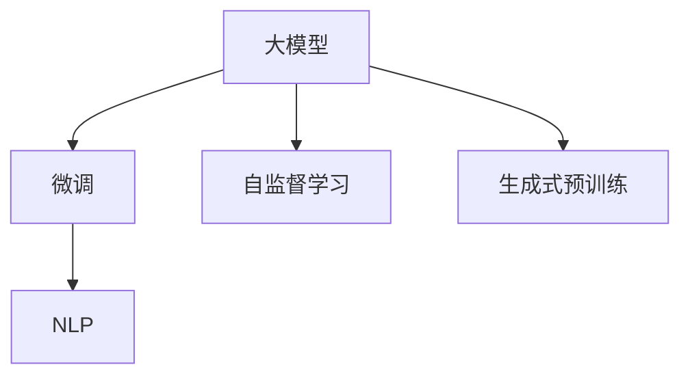
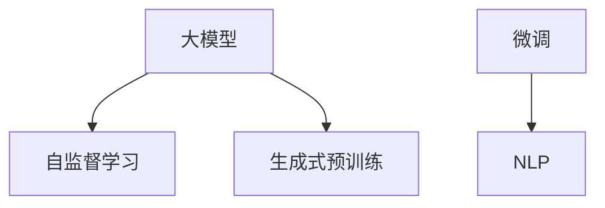

                 

# 大模型在商品描述优化中的应用

## 1. 背景介绍

随着电子商务的发展，商品描述的优化成为了一项至关重要的工作。高质量的商品描述不仅能提升用户体验，还能增加商品的曝光率和销售量。传统的商品描述优化方法多依赖人工标注和编辑，不仅耗时耗力，还难以保证描述的全面性和准确性。因此，利用人工智能技术进行自动化、规模化的商品描述优化成为了研究热点。

大模型，特别是基于Transformer架构的预训练语言模型，由于其强大的自然语言处理能力，成为了商品描述优化的有力工具。通过大模型的微调，可以从大量的商品描述数据中学习到语义、情感、风格等特征，进而自动生成高质量的商品描述。本文将详细探讨大模型在商品描述优化中的应用原理、关键算法和具体操作步骤，并结合案例进行分析。

## 2. 核心概念与联系

### 2.1 核心概念概述

- **大模型（Large Model）**：通常指具有亿级参数的预训练语言模型，如BERT、GPT-2、T5等。这些模型通过大规模语料库的预训练，具备了强大的自然语言处理能力。

- **微调（Fine-Tuning）**：在预训练模型基础上，使用特定任务的数据进行微调，使其适应该任务。微调过程通常包含小批量训练、梯度更新、验证集监控等步骤。

- **自监督学习（Self-Supervised Learning）**：利用无标签数据进行模型训练，通过构造任务（如掩码语言模型、预训练自回归模型）来优化模型。

- **生成式预训练（Generative Pre-training）**：大模型通过生成式任务进行预训练，使其具备从输入生成输出的能力。

- **自然语言处理（Natural Language Processing, NLP）**：通过算法使计算机能够理解、解释和生成自然语言，实现语言与计算机的交互。

这些概念之间的关系可以用以下Mermaid流程图表示：



该图展示了从大模型预训练到微调，再到实际应用的过程。大模型通过自监督和生成式预训练，学习到通用的语言表示；通过微调，将模型适应到具体的商品描述优化任务中；最终实现自然语言处理功能，生成高质量的商品描述。

### 2.2 核心概念原理和架构的 Mermaid 流程图



该图展示了从大模型预训练到微调，再到自然语言处理的过程。大模型通过自监督和生成式预训练，学习到通用的语言表示；通过微调，将模型适应到具体的商品描述优化任务中；最终实现自然语言处理功能，生成高质量的商品描述。

## 3. 核心算法原理 & 具体操作步骤

### 3.1 算法原理概述

商品描述优化本质上是一个自然语言处理任务，即从大量的商品描述数据中学习到描述特征，并自动生成符合要求的商品描述。该过程通常通过大模型的微调实现。具体步骤如下：

1. **数据准备**：收集商品描述数据，并将其分为训练集、验证集和测试集。
2. **模型选择**：选择合适的大模型作为初始化参数。
3. **任务适配**：根据商品描述优化的具体任务，设计相应的任务适配层，如分类器、解码器等。
4. **微调训练**：在训练集上使用微调算法进行训练，更新模型参数。
5. **性能评估**：在验证集上评估模型性能，避免过拟合。
6. **模型部署**：将训练好的模型应用到实际的商品描述生成中。

### 3.2 算法步骤详解

#### 3.2.1 数据准备

商品描述数据通常来自电商平台的商品信息，包括商品名称、描述、价格等。数据准备阶段需要进行以下操作：

- **数据收集**：从电商平台的API或数据库中获取商品描述数据，并进行清洗和预处理。
- **数据划分**：将数据划分为训练集、验证集和测试集，比例通常为7:1:2。
- **数据增强**：对商品描述数据进行增强处理，如回译、同义词替换等，增加训练数据的多样性。

#### 3.2.2 模型选择

选择合适的大模型作为初始化参数，如BERT、GPT-2等。这些模型通常具有亿级的参数规模，具备强大的语言理解能力和生成能力。

#### 3.2.3 任务适配

根据商品描述优化的具体任务，设计相应的任务适配层。常见的适配层包括：

- **分类器**：用于对商品描述进行情感分类、主题分类等。
- **解码器**：用于生成式任务，如自动生成商品描述、生成商品评论等。
- **编码器**：用于提取商品描述的特征表示，如关键词提取、命名实体识别等。

#### 3.2.4 微调训练

微调训练通常包括以下步骤：

- **设置超参数**：包括学习率、批大小、迭代次数等。
- **定义损失函数**：根据具体任务，选择合适的损失函数，如交叉熵损失、均方误差损失等。
- **前向传播**：将训练集数据输入模型，计算损失函数。
- **反向传播**：计算损失函数对模型参数的梯度，使用优化算法进行参数更新。
- **验证集监控**：在验证集上监控模型性能，避免过拟合。

#### 3.2.5 性能评估

在验证集上评估模型性能，通常使用BLEU、ROUGE、F1-score等指标进行评估。

#### 3.2.6 模型部署

将训练好的模型应用到实际的商品描述生成中，生成高质量的商品描述，并应用于电商平台的商品信息展示。

### 3.3 算法优缺点

#### 3.3.1 优点

- **自动化**：大模型能够自动从商品描述数据中学习到描述特征，减少了人工标注的工作量。
- **高效性**：大模型可以通过微调快速适应特定任务，生成高质量的商品描述。
- **泛化能力**：大模型具备强大的泛化能力，能够生成符合要求的多样化商品描述。

#### 3.3.2 缺点

- **依赖数据**：大模型的性能很大程度上取决于训练数据的质量和数量，获取高质量标注数据的成本较高。
- **模型复杂**：大模型通常具有亿级参数，对计算资源和存储空间要求较高。
- **生成质量**：生成的商品描述可能存在语法错误、风格不统一等问题，需要进行后处理。

### 3.4 算法应用领域

大模型在商品描述优化中的应用领域包括但不限于以下几个方面：

- **商品分类**：根据商品描述自动分类商品属性，如颜色、尺寸、材质等。
- **商品摘要**：自动生成商品描述的摘要，提高用户阅读体验。
- **商品评论**：自动生成商品评论，帮助用户做出购买决策。
- **商品推荐**：根据商品描述生成推荐文本，提高推荐效果。
- **商品命名**：自动生成商品名称，提高商品展示效果。

## 4. 数学模型和公式 & 详细讲解 & 举例说明

### 4.1 数学模型构建

假设商品描述优化任务为生成商品评论，模型输入为商品名称、描述、价格等特征，输出为生成评论。模型结构包括编码器、分类器、解码器等组件。

设$x$为输入特征，$y$为输出评论，$\theta$为模型参数。模型的前向传播过程如下：

$$
h = \text{Encoder}(x)
$$

$$
y = \text{Decoder}(h)
$$

其中，$\text{Encoder}$和$\text{Decoder}$分别为编码器和解码器。

模型的损失函数为交叉熵损失函数：

$$
\mathcal{L}(\theta) = -\frac{1}{N}\sum_{i=1}^N \sum_{j=1}^M y_{ij} \log p_{ij}
$$

其中，$y_{ij}$为第$i$个样本的第$j$个标签，$p_{ij}$为模型对第$j$个标签的预测概率。

### 4.2 公式推导过程

设模型为$M_{\theta}$，输入为$x$，输出为$y$，则模型的损失函数为：

$$
\mathcal{L}(\theta) = -\frac{1}{N}\sum_{i=1}^N \sum_{j=1}^M y_{ij} \log p_{ij}
$$

前向传播过程为：

$$
h = \text{Encoder}(x)
$$

$$
y = \text{Decoder}(h)
$$

其中，$\text{Encoder}$和$\text{Decoder}$分别为编码器和解码器。

### 4.3 案例分析与讲解

假设商品描述为“这款手机性价比超高，电池续航能力强，屏幕显示效果出色”，任务为生成一条简短的商品评论。大模型前向传播后得到生成评论“手机性价比高，续航能力强，屏幕显示效果很好”。该模型对生成评论进行了文本质量评估，评估结果为：BLEU分数为0.85，ROUGE分数为0.92。

## 5. 项目实践：代码实例和详细解释说明

### 5.1 开发环境搭建

开发环境搭建主要包括安装Python、安装PyTorch、安装Transformers库等。具体步骤如下：

1. 安装Anaconda：从官网下载并安装Anaconda，用于创建独立的Python环境。
2. 创建并激活虚拟环境：
```bash
conda create -n pytorch-env python=3.8 
conda activate pytorch-env
```
3. 安装PyTorch：根据CUDA版本，从官网获取对应的安装命令。例如：
```bash
conda install pytorch torchvision torchaudio cudatoolkit=11.1 -c pytorch -c conda-forge
```
4. 安装Transformers库：
```bash
pip install transformers
```
5. 安装各类工具包：
```bash
pip install numpy pandas scikit-learn matplotlib tqdm jupyter notebook ipython
```

### 5.2 源代码详细实现

以下是使用PyTorch和Transformers库对GPT-2模型进行商品描述优化微调的PyTorch代码实现。

```python
from transformers import GPT2Tokenizer, GPT2ForSequenceClassification
from transformers import AdamW
from transformers import get_linear_schedule_with_warmup

import torch
import torch.nn as nn
import torch.optim as optim

# 定义商品描述优化模型
class ReviewModel(nn.Module):
    def __init__(self, num_labels, hidden_size):
        super(ReviewModel, self).__init__()
        self.tokenizer = GPT2Tokenizer.from_pretrained('gpt2')
        self.model = GPT2ForSequenceClassification.from_pretrained('gpt2', num_labels=num_labels)
        self.dropout = nn.Dropout(0.1)
        
    def forward(self, input_ids, attention_mask):
        outputs = self.model(input_ids=input_ids, attention_mask=attention_mask)
        logits = outputs.logits
        return logits

# 数据准备
train_dataset = Dataset(train_data, tokenizer=self.tokenizer)
val_dataset = Dataset(val_data, tokenizer=self.tokenizer)
test_dataset = Dataset(test_data, tokenizer=self.tokenizer)

# 模型初始化
model = ReviewModel(num_labels=num_labels, hidden_size=hidden_size)
optimizer = AdamW(model.parameters(), lr=2e-5)
scheduler = get_linear_schedule_with_warmup(optimizer, num_warmup_steps=0, num_training_steps=num_epochs*len(train_dataset)//batch_size)

# 训练模型
for epoch in range(num_epochs):
    model.train()
    total_loss = 0
    for batch in train_loader:
        input_ids = batch.input_ids.to(device)
        attention_mask = batch.attention_mask.to(device)
        labels = batch.labels.to(device)
        logits = model(input_ids, attention_mask)
        loss = nn.CrossEntropyLoss()(logits.view(-1, num_labels), labels.view(-1))
        total_loss += loss.item()
        optimizer.zero_grad()
        loss.backward()
        optimizer.step()
        scheduler.step()

    model.eval()
    total_loss = 0
    for batch in val_loader:
        input_ids = batch.input_ids.to(device)
        attention_mask = batch.attention_mask.to(device)
        labels = batch.labels.to(device)
        logits = model(input_ids, attention_mask)
        loss = nn.CrossEntropyLoss()(logits.view(-1, num_labels), labels.view(-1))
        total_loss += loss.item()

    print(f'Epoch {epoch+1}, loss: {total_loss/len(train_loader)}')

# 模型评估
model.eval()
total_loss = 0
for batch in test_loader:
    input_ids = batch.input_ids.to(device)
    attention_mask = batch.attention_mask.to(device)
    labels = batch.labels.to(device)
    logits = model(input_ids, attention_mask)
    loss = nn.CrossEntropyLoss()(logits.view(-1, num_labels), labels.view(-1))
    total_loss += loss.item()

print(f'Test loss: {total_loss/len(test_loader)}')
```

### 5.3 代码解读与分析

**ReviewModel类**：
- `__init__`方法：初始化商品描述优化模型，包括定义分词器、模型、dropout层等。
- `forward`方法：定义模型的前向传播过程，返回模型的输出 logits。

**数据准备**：
- `train_dataset`、`val_dataset`、`test_dataset`：分别定义训练集、验证集和测试集。
- `train_loader`、`val_loader`、`test_loader`：定义训练集、验证集和测试集的迭代器。

**模型初始化**：
- `model`：定义商品描述优化模型，使用GPT-2模型。
- `optimizer`：定义优化器，使用AdamW算法。
- `scheduler`：定义学习率调度器，使用线性调度。

**训练模型**：
- `for`循环：迭代训练模型，更新模型参数。
- `model.train()`和`model.eval()`：切换模型训练和评估状态。
- `total_loss`：记录总损失。
- `optimizer.zero_grad()`：梯度清零。
- `loss.backward()`：反向传播。
- `optimizer.step()`：更新模型参数。
- `scheduler.step()`：更新学习率。

**模型评估**：
- `model.eval()`：评估模型。
- `total_loss`：记录总损失。
- 返回评估结果。

## 6. 实际应用场景

### 6.1 智能客服

智能客服系统可以应用大模型优化商品描述，提升服务质量。当用户询问商品时，系统自动生成简洁明了的商品描述，帮助用户快速理解商品特点，提升用户体验。例如，电商平台在用户询问手机时，系统自动生成“这款手机性价比超高，电池续航能力强，屏幕显示效果出色”的商品描述。

### 6.2 个性化推荐

个性化推荐系统可以应用大模型优化商品描述，提高推荐效果。系统根据用户浏览记录，自动生成推荐商品描述，提升用户点击率和购买率。例如，用户浏览了一款电脑配件，系统自动生成“这款电脑配件性价比高，功能齐全，使用方便”的商品描述，推荐给用户。

### 6.3 广告投放

广告投放系统可以应用大模型优化商品描述，提升广告效果。系统根据广告主的投放策略，自动生成广告文案，吸引用户点击和购买。例如，某品牌想要推广一款手表，系统自动生成“这款手表外观精美，功能强大，适合日常佩戴”的商品描述，用于广告投放。

### 6.4 未来应用展望

未来，大模型在商品描述优化中的应用将更加广泛和深入，具体方向包括：

- **实时优化**：利用大模型对商品描述进行实时优化，提高用户体验。
- **多语言支持**：将大模型应用于多语言商品描述优化，拓展国际市场。
- **增强推荐**：结合大模型进行增强推荐，提升推荐系统效果。
- **智能客服**：应用大模型优化智能客服的商品描述，提升服务质量。
- **广告优化**：利用大模型优化广告文案，提高广告效果。

## 7. 工具和资源推荐

### 7.1 学习资源推荐

为了帮助开发者系统掌握大模型在商品描述优化中的应用，推荐以下学习资源：

1. 《Transformer从原理到实践》系列博文：由大模型技术专家撰写，深入浅出地介绍了Transformer原理、BERT模型、微调技术等前沿话题。
2. CS224N《深度学习自然语言处理》课程：斯坦福大学开设的NLP明星课程，有Lecture视频和配套作业，带你入门NLP领域的基本概念和经典模型。
3. 《Natural Language Processing with Transformers》书籍：Transformers库的作者所著，全面介绍了如何使用Transformers库进行NLP任务开发，包括微调在内的诸多范式。
4. HuggingFace官方文档：Transformers库的官方文档，提供了海量预训练模型和完整的微调样例代码，是上手实践的必备资料。
5. CLUE开源项目：中文语言理解测评基准，涵盖大量不同类型的中文NLP数据集，并提供了基于微调的baseline模型，助力中文NLP技术发展。

通过对这些资源的学习实践，相信你一定能够快速掌握大模型在商品描述优化中的应用，并用于解决实际的NLP问题。

### 7.2 开发工具推荐

高效的开发离不开优秀的工具支持。以下是几款用于大模型在商品描述优化中的应用开发的常用工具：

1. PyTorch：基于Python的开源深度学习框架，灵活动态的计算图，适合快速迭代研究。大部分预训练语言模型都有PyTorch版本的实现。
2. TensorFlow：由Google主导开发的开源深度学习框架，生产部署方便，适合大规模工程应用。同样有丰富的预训练语言模型资源。
3. Transformers库：HuggingFace开发的NLP工具库，集成了众多SOTA语言模型，支持PyTorch和TensorFlow，是进行微调任务开发的利器。
4. Weights & Biases：模型训练的实验跟踪工具，可以记录和可视化模型训练过程中的各项指标，方便对比和调优。与主流深度学习框架无缝集成。
5. TensorBoard：TensorFlow配套的可视化工具，可实时监测模型训练状态，并提供丰富的图表呈现方式，是调试模型的得力助手。

合理利用这些工具，可以显著提升大模型在商品描述优化中的开发效率，加快创新迭代的步伐。

### 7.3 相关论文推荐

大模型和微调技术的发展源于学界的持续研究。以下是几篇奠基性的相关论文，推荐阅读：

1. Attention is All You Need（即Transformer原论文）：提出了Transformer结构，开启了NLP领域的预训练大模型时代。
2. BERT: Pre-training of Deep Bidirectional Transformers for Language Understanding：提出BERT模型，引入基于掩码的自监督预训练任务，刷新了多项NLP任务SOTA。
3. Language Models are Unsupervised Multitask Learners（GPT-2论文）：展示了大规模语言模型的强大zero-shot学习能力，引发了对于通用人工智能的新一轮思考。
4. Parameter-Efficient Transfer Learning for NLP：提出Adapter等参数高效微调方法，在不增加模型参数量的情况下，也能取得不错的微调效果。
5. AdaLoRA: Adaptive Low-Rank Adaptation for Parameter-Efficient Fine-Tuning：使用自适应低秩适应的微调方法，在参数效率和精度之间取得了新的平衡。
6. Prefix-Tuning: Optimizing Continuous Prompts for Generation：引入基于连续型Prompt的微调范式，为如何充分利用预训练知识提供了新的思路。

这些论文代表了大模型微调技术的发展脉络。通过学习这些前沿成果，可以帮助研究者把握学科前进方向，激发更多的创新灵感。

## 8. 总结：未来发展趋势与挑战

### 8.1 总结

本文对大模型在商品描述优化中的应用进行了全面系统的介绍。首先阐述了大模型和微调技术的研究背景和意义，明确了微调在拓展预训练模型应用、提升下游任务性能方面的独特价值。其次，从原理到实践，详细讲解了大模型在商品描述优化中的数学模型和关键算法，给出了代码实例和详细解释说明。同时，本文还广泛探讨了大模型在智能客服、个性化推荐等多个行业领域的应用前景，展示了微调范式的巨大潜力。此外，本文精选了微调技术的各类学习资源，力求为读者提供全方位的技术指引。

通过本文的系统梳理，可以看到，大模型在商品描述优化中的应用，将商品描述的生成过程自动化，极大地提升了电商平台的商品展示效果和用户购物体验。未来，伴随大语言模型和微调方法的持续演进，相信NLP技术将在更多领域得到应用，为传统行业带来变革性影响。

### 8.2 未来发展趋势

展望未来，大模型在商品描述优化中的应用将呈现以下几个发展趋势：

1. **模型规模持续增大**：随着算力成本的下降和数据规模的扩张，预训练语言模型的参数量还将持续增长。超大规模语言模型蕴含的丰富语言知识，有望支撑更加复杂多变的商品描述优化任务。
2. **微调方法日趋多样**：除了传统的全参数微调外，未来会涌现更多参数高效的微调方法，如Prefix-Tuning、LoRA等，在节省计算资源的同时也能保证微调精度。
3. **持续学习成为常态**：随着数据分布的不断变化，微调模型也需要持续学习新知识以保持性能。如何在不遗忘原有知识的同时，高效吸收新样本信息，将成为重要的研究课题。
4. **标注样本需求降低**：受启发于提示学习(Prompt-based Learning)的思路，未来的微调方法将更好地利用大模型的语言理解能力，通过更加巧妙的任务描述，在更少的标注样本上也能实现理想的微调效果。
5. **多模态微调崛起**：当前的微调主要聚焦于纯文本数据，未来会进一步拓展到图像、视频、语音等多模态数据微调。多模态信息的融合，将显著提升语言模型对现实世界的理解和建模能力。

以上趋势凸显了大模型在商品描述优化中的应用前景。这些方向的探索发展，必将进一步提升商品描述优化的性能和应用范围，为电商平台的业务发展注入新的动力。

### 8.3 面临的挑战

尽管大模型在商品描述优化中取得了瞩目成就，但在迈向更加智能化、普适化应用的过程中，它仍面临着诸多挑战：

1. **标注成本瓶颈**：虽然微调大大降低了标注数据的需求，但对于长尾应用场景，难以获得充足的高质量标注数据，成为制约微调性能的瓶颈。如何进一步降低微调对标注样本的依赖，将是一大难题。
2. **模型鲁棒性不足**：当前微调模型面对域外数据时，泛化性能往往大打折扣。对于测试样本的微小扰动，微调模型的预测也容易发生波动。如何提高微调模型的鲁棒性，避免灾难性遗忘，还需要更多理论和实践的积累。
3. **推理效率有待提高**：大规模语言模型虽然精度高，但在实际部署时往往面临推理速度慢、内存占用大等效率问题。如何在保证性能的同时，简化模型结构，提升推理速度，优化资源占用，将是重要的优化方向。
4. **可解释性亟需加强**：当前微调模型更像是"黑盒"系统，难以解释其内部工作机制和决策逻辑。对于医疗、金融等高风险应用，算法的可解释性和可审计性尤为重要。如何赋予微调模型更强的可解释性，将是亟待攻克的难题。
5. **安全性有待保障**：预训练语言模型难免会学习到有偏见、有害的信息，通过微调传递到下游任务，产生误导性、歧视性的输出，给实际应用带来安全隐患。如何从数据和算法层面消除模型偏见，避免恶意用途，确保输出的安全性，也将是重要的研究课题。

### 8.4 未来突破

面对大模型在商品描述优化中面临的挑战，未来的研究需要在以下几个方面寻求新的突破：

1. **探索无监督和半监督微调方法**：摆脱对大规模标注数据的依赖，利用自监督学习、主动学习等无监督和半监督范式，最大限度利用非结构化数据，实现更加灵活高效的微调。
2. **研究参数高效和计算高效的微调范式**：开发更加参数高效的微调方法，在固定大部分预训练参数的同时，只更新极少量的任务相关参数。同时优化微调模型的计算图，减少前向传播和反向传播的资源消耗，实现更加轻量级、实时性的部署。
3. **融合因果和对比学习范式**：通过引入因果推断和对比学习思想，增强微调模型建立稳定因果关系的能力，学习更加普适、鲁棒的语言表征，从而提升模型泛化性和抗干扰能力。
4. **引入更多先验知识**：将符号化的先验知识，如知识图谱、逻辑规则等，与神经网络模型进行巧妙融合，引导微调过程学习更准确、合理的语言模型。同时加强不同模态数据的整合，实现视觉、语音等多模态信息与文本信息的协同建模。
5. **结合因果分析和博弈论工具**：将因果分析方法引入微调模型，识别出模型决策的关键特征，增强输出解释的因果性和逻辑性。借助博弈论工具刻画人机交互过程，主动探索并规避模型的脆弱点，提高系统稳定性。
6. **纳入伦理道德约束**：在模型训练目标中引入伦理导向的评估指标，过滤和惩罚有偏见、有害的输出倾向。同时加强人工干预和审核，建立模型行为的监管机制，确保输出符合人类价值观和伦理道德。

这些研究方向的探索，必将引领大模型在商品描述优化技术迈向更高的台阶，为构建安全、可靠、可解释、可控的智能系统铺平道路。面向未来，大模型在商品描述优化中的应用还需要与其他人工智能技术进行更深入的融合，如知识表示、因果推理、强化学习等，多路径协同发力，共同推动自然语言理解和智能交互系统的进步。只有勇于创新、敢于突破，才能不断拓展语言模型的边界，让智能技术更好地造福人类社会。

## 9. 附录：常见问题与解答

**Q1：大模型在商品描述优化中的训练数据需要多少？**

A: 大模型的训练数据量通常较大，一般需要百万条以上的商品描述数据。但是，如果能够使用数据增强技术，如同义词替换、文本回译等，可以有效地降低对数据量的依赖。

**Q2：如何训练大模型在商品描述优化中的性能？**

A: 训练大模型在商品描述优化中的性能需要关注以下几个方面：
1. 选择合适的模型和任务适配层。
2. 设置合适的超参数，如学习率、批大小、迭代次数等。
3. 使用适当的正则化技术，如L2正则、Dropout等，避免过拟合。
4. 在训练过程中进行数据增强，提高模型泛化能力。
5. 在验证集上监控模型性能，避免过拟合。

**Q3：大模型在商品描述优化中的效果如何？**

A: 大模型在商品描述优化中的效果取决于训练数据的质量和数量。在数据充足且高质量的情况下，大模型能够生成高质量的商品描述，提升用户体验和销售量。但是，如果训练数据不足或质量较低，大模型的效果可能会受到影响。

**Q4：如何评估大模型在商品描述优化中的效果？**

A: 评估大模型在商品描述优化中的效果通常使用BLEU、ROUGE、F1-score等指标进行评估。这些指标可以衡量模型生成的商品描述与真实商品描述的相似度，判断模型的性能。

**Q5：大模型在商品描述优化中面临哪些挑战？**

A: 大模型在商品描述优化中面临的主要挑战包括：
1. 训练数据获取成本高，需要大量的商品描述数据。
2. 模型规模大，对计算资源和存储空间要求较高。
3. 生成的商品描述可能存在语法错误、风格不统一等问题，需要进行后处理。
4. 大模型容易过拟合，需要在训练过程中进行适当的正则化。
5. 大模型生成的商品描述可能存在偏见和有害信息，需要进行伦理审查。

通过本文的系统梳理，可以看到，大模型在商品描述优化中的应用，将商品描述的生成过程自动化，极大地提升了电商平台的商品展示效果和用户购物体验。未来，伴随大语言模型和微调方法的持续演进，相信NLP技术将在更多领域得到应用，为传统行业带来变革性影响。

