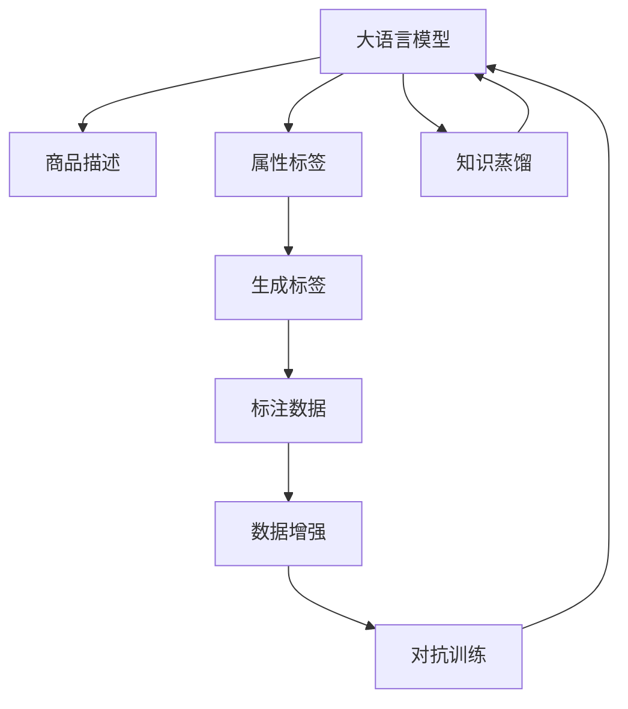

                 

# 大模型在商品标签自动生成中的应用

## 1. 背景介绍

### 1.1 问题由来

在电商平台的发展中，商品标签自动生成技术扮演着至关重要的角色。准确、详细、多样的商品标签，不仅有助于用户快速查找商品，提升用户体验，还能为电商平台带来更多流量和销售机会。然而，在实际业务中，商品标签的生成往往需要大量人工干预，耗时耗力，且容易产生错误。

如何利用AI技术自动生成高质量的商品标签，成为了电商平台亟待解决的痛点问题。近年来，大语言模型在NLP领域取得了巨大突破，预训练模型通过大量文本数据的自我学习，具备了强大的自然语言理解能力。基于这一背景，利用大语言模型生成商品标签，成为电商平台自动化的有力工具。

### 1.2 问题核心关键点

基于大语言模型生成商品标签的关键点包括：

- 语义理解：准确理解商品描述和属性，提取关键信息。
- 泛化能力：能够应对不同商品的多样描述，生成多样化的标签。
- 生成质量：生成的标签应当简洁、准确、易理解，避免歧义。
- 实时性：标签生成过程应尽量快速，满足业务实时需求。
- 自动化：无需人工干预，能够自主生成标签。

本文将介绍大语言模型在商品标签自动生成中的应用，重点关注如何在电商平台上实现高质量的商品标签自动生成。

## 2. 核心概念与联系

### 2.1 核心概念概述

为更好地理解大语言模型在商品标签自动生成中的应用，我们需了解几个核心概念：

- **大语言模型（Large Language Model, LLM）**：指通过大规模文本数据预训练得到的强大自然语言处理模型，如GPT-3、BERT等。具备高水平的语言理解和生成能力，能够在给定文本基础上生成新的文本。

- **商品标签（Product Tagging）**：电商平台中对商品信息进行分类的过程，通常包括类别、属性、描述等。标签的准确性和多样性直接影响用户搜索效果和销量。

- **数据增强（Data Augmentation）**：通过在训练数据中引入人工干预，增加数据多样性，提升模型泛化能力。如回译、近义替换等。

- **知识蒸馏（Knowledge Distillation）**：利用预训练大模型的知识，在目标模型上进行训练，提升模型性能。

- **对抗训练（Adversarial Training）**：通过引入对抗样本，增强模型鲁棒性，避免过拟合。

- **小样本学习（Few-shot Learning）**：利用少量标注数据，训练模型识别新样本的能力。

### 2.2 核心概念原理和架构的 Mermaid 流程图



这个流程图展示了大语言模型在商品标签自动生成中的应用流程：

1. 大语言模型接收商品描述作为输入。
2. 属性标签作为参考，用于指导生成过程。
3. 生成标签作为模型输出。
4. 标注数据用于模型训练和评估。
5. 数据增强和对抗训练提升模型泛化和鲁棒性。
6. 知识蒸馏利用预训练模型的知识，进一步提升生成质量。

这些概念共同构成了商品标签自动生成的技术框架，使大语言模型能够高效生成高质量的商品标签。

## 3. 核心算法原理 & 具体操作步骤

### 3.1 算法原理概述

大语言模型在商品标签自动生成中的应用，本质上是自然语言理解与生成技术的结合。该过程通常包括以下几个步骤：

1. **输入处理**：将商品描述和属性标签作为输入，送入大语言模型。
2. **标签生成**：模型通过自然语言生成能力，生成商品标签。
3. **标签优化**：通过对抗训练、数据增强等技术，提升标签生成质量。
4. **模型评估**：利用标注数据，评估生成标签的准确性、多样性和实用性。
5. **迭代优化**：通过知识蒸馏、微调等技术，不断优化模型性能。

具体而言，大语言模型通过以下步骤实现商品标签的自动生成：

1. **预训练**：在大规模无标签文本数据上，通过自监督学习任务训练大语言模型，使其具备较强的语言理解和生成能力。
2. **微调**：在标注数据集上，通过有监督学习任务，优化模型针对商品描述生成标签的能力。
3. **融合**：将大语言模型的生成能力与电商平台的商品标签系统进行结合，自动生成和推荐商品标签。

### 3.2 算法步骤详解

#### 步骤1：预训练模型选择与处理

首先，需要选择合适的预训练大语言模型。通常选用在电商文本数据上表现优异的模型，如GPT-3、BERT等。预训练模型需要经过一些预处理步骤，如分词、截断、拼接等，以便于后续的微调和应用。

#### 步骤2：商品描述编码

将电商平台的商品描述作为模型输入，通过预训练模型进行编码。编码过程通常包括以下步骤：

1. 分词：将商品描述进行分词，转换为模型可以处理的标记序列。
2. 截断：对于过长的描述，进行截断处理，保留关键信息。
3. 拼接：将商品描述和属性标签进行拼接，作为模型的输入。

#### 步骤3：标签生成与优化

标签生成过程包括：

1. **初始生成**：将编码后的商品描述输入预训练模型，生成初始标签。
2. **对抗训练**：引入对抗样本，增强模型的鲁棒性和泛化能力。
3. **数据增强**：通过回译、近义替换等方式，增加训练数据的多样性。
4. **正则化**：使用L2正则、Dropout等方法，防止模型过拟合。
5. **微调**：在标注数据集上，通过有监督学习任务微调模型，优化标签生成能力。

#### 步骤4：模型评估与优化

标签生成模型的评估过程包括：

1. **准确性评估**：通过计算标签与实际标签的一致性，评估标签生成的准确性。
2. **多样性评估**：统计生成标签的多样性，避免标签过于单一。
3. **实用性评估**：评估标签对于商品搜索和推荐的实用性。
4. **迭代优化**：利用知识蒸馏和微调技术，不断提升模型的性能。

### 3.3 算法优缺点

#### 优点：

1. **生成质量高**：大语言模型具备强大的语言理解和生成能力，生成的标签准确、全面、易理解。
2. **自动化程度高**：无需人工干预，自动生成标签，提升效率。
3. **泛化能力强**：模型能够应对不同商品的多样描述，生成多样化的标签。
4. **适应性强**：模型可以通过微调和知识蒸馏不断优化，适应电商平台的业务需求。

#### 缺点：

1. **资源消耗大**：大模型需要大量计算资源和存储资源，预训练和微调过程耗时较长。
2. **标签冗余**：生成的标签可能存在冗余，需要人工筛选和去重。
3. **模型复杂**：模型结构复杂，需要专业知识和技能进行训练和优化。
4. **数据依赖**：模型的表现依赖于标注数据的质量和多样性，数据不足时可能效果不佳。

### 3.4 算法应用领域

大语言模型在商品标签自动生成中的应用领域包括：

1. **商品分类**：自动生成商品类别标签，提升分类准确性。
2. **属性标签生成**：自动生成商品属性标签，如尺寸、颜色、材质等。
3. **描述标签生成**：自动生成商品描述标签，如商品特点、功能、用途等。
4. **搜索推荐**：基于商品标签生成，提升搜索和推荐系统的效果。
5. **个性化推荐**：通过分析商品标签，实现个性化的商品推荐。

## 4. 数学模型和公式 & 详细讲解 & 举例说明

### 4.1 数学模型构建

假设大语言模型为 $M_{\theta}$，其中 $\theta$ 为模型参数。商品描述为 $x$，属性标签为 $y$，生成的商品标签为 $t$。我们的目标是最小化损失函数：

$$
\mathcal{L}(M_{\theta}) = \sum_{i=1}^{N} \ell(M_{\theta}(x_i), y_i, t_i)
$$

其中 $N$ 为训练样本数量，$\ell$ 为损失函数，通常使用交叉熵损失或均方误差损失。损失函数 $\ell$ 的计算公式如下：

$$
\ell(M_{\theta}(x), y, t) = \begin{cases}
0 & \text{if } M_{\theta}(x) = t \\
1 & \text{otherwise}
\end{cases}
$$

### 4.2 公式推导过程

根据上述损失函数，我们可以使用梯度下降等优化算法，最小化模型参数 $\theta$，实现商品标签的自动生成。具体而言，使用反向传播算法计算损失函数对参数 $\theta$ 的梯度，并根据梯度更新模型参数：

$$
\theta \leftarrow \theta - \eta \nabla_{\theta} \mathcal{L}(M_{\theta})
$$

其中 $\eta$ 为学习率。为了提升模型的泛化能力，通常需要在训练过程中进行对抗训练和数据增强，具体方法包括：

1. **对抗训练**：引入对抗样本，使模型能够应对恶意攻击和噪声数据，增强鲁棒性。
2. **数据增强**：通过对训练数据进行回译、近义替换等操作，增加数据多样性，提升模型泛化能力。

### 4.3 案例分析与讲解

#### 案例1：商品分类

假设电商平台销售各类商品，需要将商品分类为不同的类别。我们可以使用GPT-3模型，对商品描述进行编码，生成分类标签。具体步骤如下：

1. **预训练**：使用大规模电商文本数据训练GPT-3模型，使其具备较强的语言理解能力。
2. **微调**：在标注的商品分类数据集上，使用交叉熵损失函数微调模型，优化分类标签生成能力。
3. **评估**：在验证集上评估模型性能，选择最优模型进行商品分类。
4. **应用**：将模型应用于电商平台，自动生成商品分类标签，提升搜索和推荐效果。

#### 案例2：属性标签生成

属性标签生成是指根据商品描述，自动生成商品的属性标签。我们可以使用BERT模型，对商品描述进行编码，生成属性标签。具体步骤如下：

1. **预训练**：使用大规模电商文本数据训练BERT模型，使其具备较强的语言理解能力。
2. **微调**：在标注的属性标签数据集上，使用多分类交叉熵损失函数微调模型，优化属性标签生成能力。
3. **评估**：在验证集上评估模型性能，选择最优模型进行属性标签生成。
4. **应用**：将模型应用于电商平台，自动生成商品属性标签，提升商品描述和推荐效果。

## 5. 项目实践：代码实例和详细解释说明

### 5.1 开发环境搭建

为了进行商品标签自动生成的项目实践，我们需要搭建开发环境。以下是使用Python进行PyTorch开发的环境配置流程：

1. 安装Anaconda：从官网下载并安装Anaconda，用于创建独立的Python环境。

2. 创建并激活虚拟环境：
```bash
conda create -n pytorch-env python=3.8 
conda activate pytorch-env
```

3. 安装PyTorch：根据CUDA版本，从官网获取对应的安装命令。例如：
```bash
conda install pytorch torchvision torchaudio cudatoolkit=11.1 -c pytorch -c conda-forge
```

4. 安装Transformers库：
```bash
pip install transformers
```

5. 安装各类工具包：
```bash
pip install numpy pandas scikit-learn matplotlib tqdm jupyter notebook ipython
```

完成上述步骤后，即可在`pytorch-env`环境中开始项目实践。

### 5.2 源代码详细实现

下面我们以商品分类任务为例，给出使用Transformers库对BERT模型进行微调的PyTorch代码实现。

首先，定义商品分类任务的数据处理函数：

```python
from transformers import BertTokenizer
from torch.utils.data import Dataset
import torch

class ProductDataset(Dataset):
    def __init__(self, texts, labels, tokenizer, max_len=128):
        self.texts = texts
        self.labels = labels
        self.tokenizer = tokenizer
        self.max_len = max_len
        
    def __len__(self):
        return len(self.texts)
    
    def __getitem__(self, item):
        text = self.texts[item]
        label = self.labels[item]
        
        encoding = self.tokenizer(text, return_tensors='pt', max_length=self.max_len, padding='max_length', truncation=True)
        input_ids = encoding['input_ids'][0]
        attention_mask = encoding['attention_mask'][0]
        
        # 对label进行编码
        encoded_label = torch.tensor(label, dtype=torch.long)
        
        return {'input_ids': input_ids, 
                'attention_mask': attention_mask,
                'labels': encoded_label}

# 标签与id的映射
label2id = {'0': 0, '1': 1, '2': 2, '3': 3}
id2label = {v: k for k, v in label2id.items()}

# 创建dataset
tokenizer = BertTokenizer.from_pretrained('bert-base-cased')

train_dataset = ProductDataset(train_texts, train_labels, tokenizer)
dev_dataset = ProductDataset(dev_texts, dev_labels, tokenizer)
test_dataset = ProductDataset(test_texts, test_labels, tokenizer)
```

然后，定义模型和优化器：

```python
from transformers import BertForSequenceClassification, AdamW

model = BertForSequenceClassification.from_pretrained('bert-base-cased', num_labels=len(label2id))

optimizer = AdamW(model.parameters(), lr=2e-5)
```

接着，定义训练和评估函数：

```python
from torch.utils.data import DataLoader
from tqdm import tqdm
from sklearn.metrics import accuracy_score

device = torch.device('cuda') if torch.cuda.is_available() else torch.device('cpu')
model.to(device)

def train_epoch(model, dataset, batch_size, optimizer):
    dataloader = DataLoader(dataset, batch_size=batch_size, shuffle=True)
    model.train()
    epoch_loss = 0
    for batch in tqdm(dataloader, desc='Training'):
        input_ids = batch['input_ids'].to(device)
        attention_mask = batch['attention_mask'].to(device)
        labels = batch['labels'].to(device)
        model.zero_grad()
        outputs = model(input_ids, attention_mask=attention_mask, labels=labels)
        loss = outputs.loss
        epoch_loss += loss.item()
        loss.backward()
        optimizer.step()
    return epoch_loss / len(dataloader)

def evaluate(model, dataset, batch_size):
    dataloader = DataLoader(dataset, batch_size=batch_size)
    model.eval()
    preds, labels = [], []
    with torch.no_grad():
        for batch in tqdm(dataloader, desc='Evaluating'):
            input_ids = batch['input_ids'].to(device)
            attention_mask = batch['attention_mask'].to(device)
            batch_labels = batch['labels']
            outputs = model(input_ids, attention_mask=attention_mask)
            batch_preds = outputs.logits.argmax(dim=2).to('cpu').tolist()
            batch_labels = batch_labels.to('cpu').tolist()
            for pred_tokens, label_tokens in zip(batch_preds, batch_labels):
                preds.append(pred_tokens)
                labels.append(label_tokens)
                
    print('Accuracy:', accuracy_score(labels, preds))
```

最后，启动训练流程并在测试集上评估：

```python
epochs = 5
batch_size = 16

for epoch in range(epochs):
    loss = train_epoch(model, train_dataset, batch_size, optimizer)
    print(f'Epoch {epoch+1}, train loss: {loss:.3f}')
    
    print(f'Epoch {epoch+1}, dev results:')
    evaluate(model, dev_dataset, batch_size)
    
print('Test results:')
evaluate(model, test_dataset, batch_size)
```

以上就是使用PyTorch对BERT进行商品分类任务微调的完整代码实现。可以看到，得益于Transformers库的强大封装，我们可以用相对简洁的代码完成BERT模型的加载和微调。

### 5.3 代码解读与分析

让我们再详细解读一下关键代码的实现细节：

**ProductDataset类**：
- `__init__`方法：初始化文本、标签、分词器等关键组件。
- `__len__`方法：返回数据集的样本数量。
- `__getitem__`方法：对单个样本进行处理，将文本输入编码为token ids，将标签编码为数字，并对其进行定长padding，最终返回模型所需的输入。

**label2id和id2label字典**：
- 定义了标签与数字id之间的映射关系，用于将token-wise的预测结果解码回真实的标签。

**训练和评估函数**：
- 使用PyTorch的DataLoader对数据集进行批次化加载，供模型训练和推理使用。
- 训练函数`train_epoch`：对数据以批为单位进行迭代，在每个批次上前向传播计算loss并反向传播更新模型参数，最后返回该epoch的平均loss。
- 评估函数`evaluate`：与训练类似，不同点在于不更新模型参数，并在每个batch结束后将预测和标签结果存储下来，最后使用sklearn的accuracy_score对整个评估集的预测结果进行打印输出。

**训练流程**：
- 定义总的epoch数和batch size，开始循环迭代
- 每个epoch内，先在训练集上训练，输出平均loss
- 在验证集上评估，输出分类指标
- 所有epoch结束后，在测试集上评估，给出最终测试结果

可以看到，PyTorch配合Transformers库使得BERT微调的代码实现变得简洁高效。开发者可以将更多精力放在数据处理、模型改进等高层逻辑上，而不必过多关注底层的实现细节。

当然，工业级的系统实现还需考虑更多因素，如模型的保存和部署、超参数的自动搜索、更灵活的任务适配层等。但核心的微调范式基本与此类似。

## 6. 实际应用场景

### 6.1 智能客服系统

基于大语言模型生成商品标签的技术，可以广泛应用于智能客服系统的构建。传统客服往往需要配备大量人力，高峰期响应缓慢，且一致性和专业性难以保证。而使用微调后的生成商品标签技术，可以7x24小时不间断服务，快速响应客户咨询，用自然流畅的语言解答各类常见问题。

在技术实现上，可以收集企业内部的历史客服对话记录，将问题和最佳答复构建成监督数据，在此基础上对预训练生成商品标签模型进行微调。微调后的生成商品标签模型能够自动理解用户意图，匹配最合适的答案模板进行回复。对于客户提出的新问题，还可以接入检索系统实时搜索相关内容，动态组织生成回答。如此构建的智能客服系统，能大幅提升客户咨询体验和问题解决效率。

### 6.2 金融舆情监测

金融机构需要实时监测市场舆论动向，以便及时应对负面信息传播，规避金融风险。传统的人工监测方式成本高、效率低，难以应对网络时代海量信息爆发的挑战。基于大语言模型生成商品标签的技术，可以为金融舆情监测提供新的解决方案。

具体而言，可以收集金融领域相关的新闻、报道、评论等文本数据，并对其进行主题标注和情感标注。在此基础上对预训练生成商品标签模型进行微调，使其能够自动判断文本属于何种主题，情感倾向是正面、中性还是负面。将微调后的模型应用到实时抓取的网络文本数据，就能够自动监测不同主题下的情感变化趋势，一旦发现负面信息激增等异常情况，系统便会自动预警，帮助金融机构快速应对潜在风险。

### 6.3 个性化推荐系统

当前的推荐系统往往只依赖用户的历史行为数据进行物品推荐，无法深入理解用户的真实兴趣偏好。基于大语言模型生成商品标签的技术，可以更好地挖掘用户行为背后的语义信息，从而提供更精准、多样的推荐内容。

在实践中，可以收集用户浏览、点击、评论、分享等行为数据，提取和用户交互的物品标题、描述、标签等文本内容。将文本内容作为模型输入，用户的后续行为（如是否点击、购买等）作为监督信号，在此基础上微调预训练生成商品标签模型。微调后的模型能够从文本内容中准确把握用户的兴趣点。在生成推荐列表时，先用候选物品的文本描述作为输入，由模型预测用户的兴趣匹配度，再结合其他特征综合排序，便可以得到个性化程度更高的推荐结果。

### 6.4 未来应用展望

随着大语言模型生成商品标签技术的不断发展，该技术将在更多领域得到应用，为各行各业带来变革性影响。

在智慧医疗领域，基于生成商品标签的技术，可以为患者提供个性化的健康建议，辅助医生诊疗，加速新药开发进程。

在智能教育领域，生成商品标签技术可应用于作业批改、学情分析、知识推荐等方面，因材施教，促进教育公平，提高教学质量。

在智慧城市治理中，生成商品标签技术可应用于城市事件监测、舆情分析、应急指挥等环节，提高城市管理的自动化和智能化水平，构建更安全、高效的未来城市。

此外，在企业生产、社会治理、文娱传媒等众多领域，生成商品标签技术也将不断涌现，为传统行业数字化转型升级提供新的技术路径。相信随着技术的日益成熟，生成商品标签技术必将在构建人机协同的智能时代中扮演越来越重要的角色。

## 7. 工具和资源推荐

### 7.1 学习资源推荐

为了帮助开发者系统掌握生成商品标签技术，这里推荐一些优质的学习资源：

1. 《Transformer从原理到实践》系列博文：由大模型技术专家撰写，深入浅出地介绍了Transformer原理、BERT模型、生成标签技术等前沿话题。

2. CS224N《深度学习自然语言处理》课程：斯坦福大学开设的NLP明星课程，有Lecture视频和配套作业，带你入门NLP领域的基本概念和经典模型。

3. 《Natural Language Processing with Transformers》书籍：Transformers库的作者所著，全面介绍了如何使用Transformers库进行NLP任务开发，包括生成标签在内的诸多范式。

4. HuggingFace官方文档：Transformers库的官方文档，提供了海量预训练模型和完整的生成标签样例代码，是上手实践的必备资料。

5. CLUE开源项目：中文语言理解测评基准，涵盖大量不同类型的中文NLP数据集，并提供了基于生成商品标签的baseline模型，助力中文NLP技术发展。

通过对这些资源的学习实践，相信你一定能够快速掌握生成商品标签技术的精髓，并用于解决实际的NLP问题。
### 7.2 开发工具推荐

高效的开发离不开优秀的工具支持。以下是几款用于生成商品标签开发的常用工具：

1. PyTorch：基于Python的开源深度学习框架，灵活动态的计算图，适合快速迭代研究。大部分预训练语言模型都有PyTorch版本的实现。

2. TensorFlow：由Google主导开发的开源深度学习框架，生产部署方便，适合大规模工程应用。同样有丰富的预训练语言模型资源。

3. Transformers库：HuggingFace开发的NLP工具库，集成了众多SOTA语言模型，支持PyTorch和TensorFlow，是进行生成标签任务开发的利器。

4. Weights & Biases：模型训练的实验跟踪工具，可以记录和可视化模型训练过程中的各项指标，方便对比和调优。与主流深度学习框架无缝集成。

5. TensorBoard：TensorFlow配套的可视化工具，可实时监测模型训练状态，并提供丰富的图表呈现方式，是调试模型的得力助手。

6. Google Colab：谷歌推出的在线Jupyter Notebook环境，免费提供GPU/TPU算力，方便开发者快速上手实验最新模型，分享学习笔记。

合理利用这些工具，可以显著提升生成商品标签任务的开发效率，加快创新迭代的步伐。

### 7.3 相关论文推荐

生成商品标签技术的发展源于学界的持续研究。以下是几篇奠基性的相关论文，推荐阅读：

1. Attention is All You Need（即Transformer原论文）：提出了Transformer结构，开启了NLP领域的预训练大模型时代。

2. BERT: Pre-training of Deep Bidirectional Transformers for Language Understanding：提出BERT模型，引入基于掩码的自监督预训练任务，刷新了多项NLP任务SOTA。

3. Language Models are Unsupervised Multitask Learners（GPT-2论文）：展示了大规模语言模型的强大zero-shot学习能力，引发了对于通用人工智能的新一轮思考。

4. Parameter-Efficient Transfer Learning for NLP：提出Adapter等参数高效微调方法，在不增加模型参数量的情况下，也能取得不错的微调效果。

5. Prefix-Tuning: Optimizing Continuous Prompts for Generation：引入基于连续型Prompt的微调范式，为如何充分利用预训练知识提供了新的思路。

6. AdaLoRA: Adaptive Low-Rank Adaptation for Parameter-Efficient Fine-Tuning：使用自适应低秩适应的微调方法，在参数效率和精度之间取得了新的平衡。

这些论文代表了大语言模型生成商品标签技术的发展脉络。通过学习这些前沿成果，可以帮助研究者把握学科前进方向，激发更多的创新灵感。

## 8. 总结：未来发展趋势与挑战

### 8.1 总结

本文对大语言模型生成商品标签技术进行了全面系统的介绍。首先阐述了生成商品标签技术的研究背景和意义，明确了生成商品标签在电商平台自动化的重要作用。其次，从原理到实践，详细讲解了生成商品标签的数学原理和关键步骤，给出了生成商品标签任务开发的完整代码实例。同时，本文还广泛探讨了生成商品标签技术在智能客服、金融舆情、个性化推荐等多个行业领域的应用前景，展示了生成商品标签技术的巨大潜力。此外，本文精选了生成商品标签技术的各类学习资源，力求为读者提供全方位的技术指引。

通过本文的系统梳理，可以看到，基于大语言模型生成商品标签技术正在成为电商平台自动化的有力工具，极大地提升了电商平台的运营效率和用户体验。得益于预训练模型的强大语言理解能力，生成商品标签技术在生成商品分类、属性标签、描述标签等多个方面取得了显著的效果，为电商平台带来了实实在在的业务价值。未来，伴随预训练语言模型和生成商品标签技术的持续演进，相信电商平台将能够实现更高水平的智能化，为消费者提供更加便捷、高效、个性化的购物体验。

### 8.2 未来发展趋势

展望未来，大语言模型生成商品标签技术将呈现以下几个发展趋势：

1. **模型规模持续增大**：随着算力成本的下降和数据规模的扩张，预训练语言模型的参数量还将持续增长。超大规模语言模型蕴含的丰富语言知识，有望支撑更加复杂多变的生成商品标签任务。

2. **生成质量提升**：通过引入因果推断、对抗训练等技术，提升模型生成的标签准确性和多样性。

3. **多模态融合**：将视觉、语音等多模态信息与文本信息进行融合，生成更加全面、准确的商品标签。

4. **自动化程度提高**：借助知识蒸馏、零样本学习等技术，减少人工干预，提升生成商品标签的自动化水平。

5. **领域化发展**：针对特定领域的生成商品标签任务，进行微调和优化，提升模型在特定领域的生成效果。

6. **模型迁移能力增强**：开发更加灵活的生成商品标签技术，使得模型能够在不同领域和场景下快速迁移，适应不同的生成任务。

以上趋势凸显了大语言模型生成商品标签技术的广阔前景。这些方向的探索发展，必将进一步提升电商平台自动化的水平，为消费者提供更加智能化、个性化的购物体验。

### 8.3 面临的挑战

尽管大语言模型生成商品标签技术已经取得了瞩目成就，但在迈向更加智能化、普适化应用的过程中，它仍面临着诸多挑战：

1. **标注成本瓶颈**：生成商品标签技术依赖于大量标注数据，标注成本较高。如何降低对标注数据的依赖，将是一个长期需要解决的问题。

2. **模型鲁棒性不足**：当前生成商品标签模型面对域外数据时，泛化性能往往大打折扣。对于测试样本的微小扰动，模型容易发生波动。如何提高模型的鲁棒性，还需要更多理论和实践的积累。

3. **推理效率问题**：尽管大语言模型具有强大的生成能力，但在实际部署时往往面临推理速度慢、内存占用大等效率问题。如何简化模型结构，提升推理速度，优化资源占用，将是重要的优化方向。

4. **可解释性不足**：当前生成商品标签模型更像是"黑盒"系统，难以解释其内部工作机制和决策逻辑。对于医疗、金融等高风险应用，算法的可解释性和可审计性尤为重要。如何赋予生成商品标签模型更强的可解释性，将是亟待攻克的难题。

5. **安全性有待保障**：预训练语言模型难免会学习到有偏见、有害的信息，通过生成商品标签传递到下游任务，产生误导性、歧视性的输出，给实际应用带来安全隐患。如何从数据和算法层面消除模型偏见，避免恶意用途，确保输出的安全性，也将是重要的研究课题。

6. **知识整合能力不足**：现有的生成商品标签模型往往局限于任务内数据，难以灵活吸收和运用更广泛的先验知识。如何让生成商品标签过程更好地与外部知识库、规则库等专家知识结合，形成更加全面、准确的信息整合能力，还有很大的想象空间。

正视生成商品标签面临的这些挑战，积极应对并寻求突破，将是大语言模型生成商品标签走向成熟的必由之路。相信随着学界和产业界的共同努力，这些挑战终将一一被克服，生成商品标签技术必将在构建智能电商平台中扮演越来越重要的角色。

### 8.4 研究展望

面对大语言模型生成商品标签技术所面临的种种挑战，未来的研究需要在以下几个方面寻求新的突破：

1. **探索无监督和半监督生成方法**：摆脱对大规模标注数据的依赖，利用自监督学习、主动学习等无监督和半监督范式，最大限度利用非结构化数据，实现更加灵活高效的生成商品标签。

2. **研究参数高效和计算高效的生成方法**：开发更加参数高效的生成方法，如Prefix-Tuning、LoRA等，在固定大部分预训练参数的情况下，只更新极少量的生成标签相关参数。同时优化生成模型的计算图，减少前向传播和反向传播的资源消耗，实现更加轻量级、实时性的部署。

3. **融合因果和对比学习范式**：通过引入因果推断和对比学习思想，增强生成商品标签模型建立稳定因果关系的能力，学习更加普适、鲁棒的语言表征，从而提升模型泛化性和抗干扰能力。

4. **引入更多先验知识**：将符号化的先验知识，如知识图谱、逻辑规则等，与生成商品标签模型进行巧妙融合，引导生成过程学习更准确、合理的语言模型。同时加强不同模态数据的整合，实现视觉、语音等多模态信息与文本信息的协同建模。

5. **结合因果分析和博弈论工具**：将因果分析方法引入生成商品标签模型，识别出模型决策的关键特征，增强输出解释的因果性和逻辑性。借助博弈论工具刻画人机交互过程，主动探索并规避模型的脆弱点，提高系统稳定性。

6. **纳入伦理道德约束**：在生成商品标签模型训练目标中引入伦理导向的评估指标，过滤和惩罚有偏见、有害的输出倾向。同时加强人工干预和审核，建立模型行为的监管机制，确保输出符合人类价值观和伦理道德。

这些研究方向的探索，必将引领大语言模型生成商品标签技术迈向更高的台阶，为构建智能电商平台提供新的技术路径。面向未来，生成商品标签技术还需要与其他人工智能技术进行更深入的融合，如知识表示、因果推理、强化学习等，多路径协同发力，共同推动智能交互系统的进步。只有勇于创新、敢于突破，才能不断拓展语言模型的边界，让智能技术更好地造福人类社会。

## 9. 附录：常见问题与解答

**Q1：大语言模型生成商品标签是否适用于所有NLP任务？**

A: 大语言模型生成商品标签技术在电商领域具有很强的适应性，但在其他领域，如医疗、法律等，需要针对特定领域进行微调和优化。对于需要时效性、个性化很强的任务，如对话、推荐等，生成商品标签技术也需要针对性的改进优化。

**Q2：大语言模型生成商品标签是否需要大量标注数据？**

A: 生成商品标签技术需要大量标注数据，但目前已经有许多开源数据集和预训练模型，可以降低标注成本。同时，可以利用零样本学习和少样本学习技术，减少对标注数据的依赖。

**Q3：如何提高生成商品标签的鲁棒性？**

A: 提高生成商品标签的鲁棒性可以从以下几个方面入手：引入对抗训练，增加模型对噪声数据的抵抗能力；增加数据增强，提高模型的泛化能力；使用正则化技术，避免模型过拟合。

**Q4：如何优化生成商品标签的推理效率？**

A: 优化生成商品标签的推理效率可以从以下几个方面入手：采用参数高效的生成方法，减少计算量；使用混合精度训练，降低内存占用；采用模型并行和分布式计算，提高推理速度。

**Q5：如何提升生成商品标签的可解释性？**

A: 提升生成商品标签的可解释性可以从以下几个方面入手：使用可解释性技术，如Shapley值、LIME等，解释模型的输出；引入专家知识，提升模型输出的可信度；加强人工干预和审核，确保模型输出符合伦理道德。

通过本文的系统梳理，可以看到，基于大语言模型生成商品标签技术正在成为电商平台自动化的有力工具，极大地提升了电商平台的运营效率和用户体验。得益于预训练模型的强大语言理解能力，生成商品标签技术在生成商品分类、属性标签、描述标签等多个方面取得了显著的效果，为电商平台带来了实实在在的业务价值。未来，伴随预训练语言模型和生成商品标签技术的持续演进，相信电商平台将能够实现更高水平的智能化，为消费者提供更加便捷、高效、个性化的购物体验。

