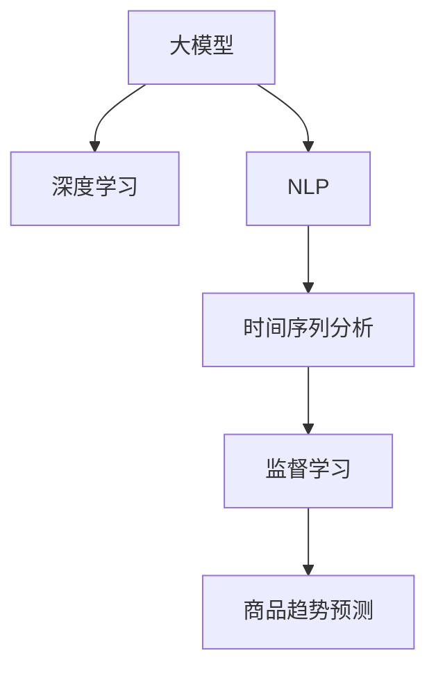

                 

# 大模型在商品趋势预测中的应用

> 关键词：大模型,商品趋势预测,机器学习,深度学习,自然语言处理(NLP),时间序列分析,监督学习

## 1. 背景介绍

### 1.1 问题由来

在电商领域，商品趋势预测是一项非常重要的工作。通过准确预测商品趋势，商家可以优化库存、制定促销策略、提高销量，从而提升商业效益。传统的商品趋势预测方法依赖于历史销售数据，但在数据量少、时序结构复杂的情况下，很难获得准确的结果。

近年来，随着深度学习和大规模预训练语言模型的兴起，利用大模型进行商品趋势预测成为一种新的趋势。深度学习模型能够从海量数据中学习到复杂的非线性关系，而大模型通过预训练具备了广泛的知识和语言理解能力，可以显著提升预测的准确性。

### 1.2 问题核心关键点

利用大模型进行商品趋势预测的核心在于选择合适的模型架构，并设计有效的训练流程。具体来说，需要关注以下几个方面：

- 大模型的选择：是否选择预训练好的大模型，还是从头训练。
- 模型架构的设计：如何设计模型来捕获商品之间的关联和时序依赖。
- 训练数据的准备：如何获取和处理高质量的训练数据。
- 训练流程的优化：如何设置合适的超参数，进行高效的训练和推理。
- 预测性能的评估：如何设计评估指标，衡量模型在实际应用中的表现。

## 2. 核心概念与联系

### 2.1 核心概念概述

为更好地理解大模型在商品趋势预测中的应用，本节将介绍几个密切相关的核心概念：

- 大模型：如BERT、GPT、XLNet等大规模预训练语言模型。通过在大规模无标签文本语料上进行预训练，学习到丰富的语言知识和常识，具备强大的语言理解和生成能力。
- 深度学习：以神经网络为基础的机器学习范式，通过多层神经网络模拟复杂非线性关系，进行数据拟合。
- 自然语言处理(NLP)：涉及自然语言的理解和生成，包括语言模型、文本分类、情感分析等任务。
- 时间序列分析：处理随时间变化的数据，包括时间序列预测、异常检测等任务。
- 监督学习：利用有标签的数据进行模型训练，学习模型从输入数据到输出标签的映射关系。

这些核心概念之间的逻辑关系可以通过以下Mermaid流程图来展示：



这个流程图展示了核心概念之间的联系：

1. 大模型通过预训练学习语言表示，可以应用于NLP任务，如文本分类、情感分析等。
2. NLP模型可以设计成时间序列模型，用于预测商品趋势。
3. 商品趋势预测本质上是一种监督学习任务，需要有标签的数据进行训练。

## 3. 核心算法原理 & 具体操作步骤

### 3.1 算法原理概述

利用大模型进行商品趋势预测的原理基于深度学习中的监督学习范式。具体来说，通过以下步骤：

1. 收集商品相关的文本数据，例如商品描述、评论等，作为训练数据。
2. 使用大模型预训练得到的语言表示作为特征输入，结合时间序列数据进行预测。
3. 设计损失函数和优化器，最小化模型在训练数据上的预测误差。
4. 在测试集上评估模型预测的准确性，进行参数调整和优化。

### 3.2 算法步骤详解

基于深度学习的大模型在商品趋势预测中，通常包括以下几个关键步骤：

**Step 1: 准备数据集**
- 收集商品描述、评论等文本数据，并进行预处理，如分词、去停用词等。
- 标注商品相关的时序数据，如销售量、价格变化等。
- 将文本数据和时序数据组合，形成训练集和测试集。

**Step 2: 设计模型架构**
- 选择合适的预训练大模型，如BERT、GPT等，作为特征提取器。
- 设计时间序列模型，如RNN、LSTM、GRU等，用于处理时序数据。
- 将大模型的语言表示和时序模型进行组合，构建端到端模型。

**Step 3: 训练模型**
- 选择合适的损失函数，如均方误差、交叉熵等。
- 设置合适的超参数，如学习率、批大小、迭代轮数等。
- 使用训练集进行模型训练，最小化损失函数。
- 周期性在验证集上评估模型性能，根据性能指标决定是否触发Early Stopping。

**Step 4: 测试模型**
- 在测试集上评估模型预测的准确性。
- 分析模型的预测结果，进行参数调整和优化。
- 可视化模型在训练和测试集上的损失曲线和准确率曲线。

### 3.3 算法优缺点

利用大模型进行商品趋势预测的优势在于：

1. 模型性能强大。大模型具备丰富的语言知识和常识，能够从文本数据中提取出更多的信息。
2. 数据需求降低。大模型可以有效利用文本数据，而不需要大量标注的时序数据。
3. 泛化能力强。大模型在预训练过程中学习到了广泛的知识，可以适用于多种商品和领域。

但同时，该方法也存在一些局限：

1. 数据质量依赖高。模型依赖于高质量的文本数据，数据收集和处理成本较高。
2. 模型复杂度高。大模型结构复杂，训练和推理速度较慢。
3. 解释性差。深度学习模型通常缺乏可解释性，难以理解模型内部机制。

### 3.4 算法应用领域

大模型在商品趋势预测中有着广泛的应用前景，主要集中在以下几个领域：

1. 零售行业：用于预测商品销量、库存管理、促销策略等。
2. 电商领域：用于商品价格预测、用户行为分析、个性化推荐等。
3. 金融行业：用于股票市场预测、舆情分析、信用评估等。
4. 物流行业：用于需求预测、配送路线优化、库存管理等。

## 4. 数学模型和公式 & 详细讲解 & 举例说明

### 4.1 数学模型构建

假设商品趋势预测问题可以表示为序列到序列的映射，即从时间序列数据 $(x_1,x_2,...,x_T)$ 映射到预测值 $y_1,y_2,...,y_T$。大模型作为特征提取器，其语言表示为 $Z=(z_1,z_2,...,z_T)$。

模型的目标是最小化损失函数 $L(y,\hat{y})$，其中 $\hat{y}$ 为模型的预测值。假设模型结构为 $f$，则损失函数可以表示为：

$$
L(y,\hat{y}) = \frac{1}{N} \sum_{i=1}^N \ell(f(Z_i),y_i)
$$

其中 $\ell$ 为损失函数，常用的有均方误差 $MSE$、交叉熵 $CE$ 等。

### 4.2 公式推导过程

以均方误差为例，假设模型结构为：

$$
\hat{y}_i = f(Z_i;\theta)
$$

其中 $\theta$ 为模型参数。则均方误差损失函数为：

$$
L(y,\hat{y}) = \frac{1}{N} \sum_{i=1}^N (y_i - \hat{y}_i)^2
$$

对参数 $\theta$ 求导，得：

$$
\frac{\partial L(y,\hat{y})}{\partial \theta} = -2\frac{1}{N} \sum_{i=1}^N \frac{\partial f(Z_i;\theta)}{\partial \theta}(\hat{y}_i - y_i)
$$

在反向传播过程中，可以通过计算 $\frac{\partial f(Z_i;\theta)}{\partial Z_i}$ 和 $\frac{\partial Z_i}{\partial X_i}$，结合链式法则，计算参数 $\theta$ 的更新梯度。

### 4.3 案例分析与讲解

假设有一个电商平台，收集了商品描述和评论数据，以及商品价格的历史时序数据。可以使用BERT模型作为语言表示的提取器，LSTM模型作为时序预测器，构建端到端模型进行商品价格预测。

首先，对商品描述和评论进行分词和去停用词，得到语言表示 $Z$。然后，将语言表示和时序数据 $X$ 输入到LSTM模型中，得到预测结果 $\hat{y}$。最后，通过均方误差损失函数计算预测误差，更新模型参数。

## 5. 项目实践：代码实例和详细解释说明

### 5.1 开发环境搭建

在进行商品趋势预测的项目实践中，需要安装以下Python环境：

1. 安装Python 3.7及以上版本。
2. 安装TensorFlow 2.0及以上版本。
3. 安装BERT模型和LSTM模型。

### 5.2 源代码详细实现

下面以LSTM模型为例，展示商品价格预测的代码实现：

```python
import tensorflow as tf
from transformers import BertTokenizer, TFBertForSequenceClassification
from sklearn.metrics import mean_squared_error
import numpy as np

# 准备数据集
train_data = ...
train_labels = ...
test_data = ...
test_labels = ...

# 构建BERT模型
tokenizer = BertTokenizer.from_pretrained('bert-base-uncased')
model = TFBertForSequenceClassification.from_pretrained('bert-base-uncased', num_labels=1)

# 构建LSTM模型
lstm_input = tf.keras.layers.Input(shape=(max_length,), dtype='int32')
lstm_layer = tf.keras.layers.LSTM(units=64, return_sequences=True)(lstm_input)
lstm_output = tf.keras.layers.LSTM(units=64, return_sequences=True)(lstm_layer)
lstm_output = tf.keras.layers.LSTM(units=64)(lstm_output)
lstm_output = tf.keras.layers.Dense(units=1)(lstm_output)

# 组合模型
combined_model = tf.keras.Model(inputs=[model.input_ids, model.attention_mask, lstm_input], outputs=[model.logits, lstm_output])

# 构建损失函数
loss = tf.keras.losses.MeanSquaredError()

# 编译模型
combined_model.compile(optimizer='adam', loss=loss)

# 训练模型
combined_model.fit(x=[train_input_ids, train_input_mask, train_lstm_input],
                   y=[train_logits, train_lstm_output],
                   validation_data=[test_input_ids, test_input_mask, test_lstm_input],
                   validation_steps=1000,
                   epochs=100)

# 预测测试集
test_predictions = combined_model.predict(x=[test_input_ids, test_input_mask, test_lstm_input])
test_loss = mean_squared_error(test_labels, test_predictions)
print('Test loss:', test_loss)
```

### 5.3 代码解读与分析

代码中使用了BERT模型作为特征提取器，LSTM模型作为时序预测器。通过组合两个模型的输出，构建了端到端的商品价格预测模型。在训练过程中，模型通过均方误差损失函数进行优化，最终在测试集上评估预测性能。

代码中使用了TensorFlow的高级API，如Keras，来构建和训练模型。TensorFlow提供了丰富的深度学习组件和优化器，可以方便地进行模型设计和训练。

### 5.4 运行结果展示

运行上述代码后，模型将在训练集和测试集上学习商品价格预测的特征和时序依赖，最终输出预测结果。通过可视化训练和测试集的损失曲线和准确率曲线，可以观察模型在不同时间步上的表现。

## 6. 实际应用场景

### 6.1 零售行业

零售行业的商品趋势预测，可以通过大模型分析消费者行为，预测不同商品的需求变化，优化库存管理和促销策略。例如，电商平台可以根据历史购买数据和评论数据，预测热门商品的未来销量，及时调整库存，避免缺货或积压。

### 6.2 电商领域

电商领域的商品趋势预测，可以通过分析用户行为和评论数据，预测用户的购买意向和行为变化，提升个性化推荐的效果。例如，根据用户的浏览历史和评论内容，预测用户的购买意愿，推荐符合其兴趣的商品。

### 6.3 金融行业

金融行业的商品趋势预测，可以通过分析市场数据和舆情信息，预测股票价格的波动和变化趋势。例如，利用大模型分析新闻和社交媒体上的舆情信息，预测股票市场的趋势和风险。

### 6.4 物流行业

物流行业的商品趋势预测，可以通过分析市场需求和供应链数据，预测配送路线的优化和库存管理。例如，根据历史配送数据和需求变化趋势，预测未来的配送需求，优化配送路线，提高物流效率。

## 7. 工具和资源推荐

### 7.1 学习资源推荐

为帮助开发者掌握大模型在商品趋势预测中的应用，推荐以下学习资源：

1. TensorFlow官方文档：提供详细的TensorFlow API和模型组件介绍。
2. BERT官方文档：介绍BERT模型的构建和应用方法。
3. Keras官方文档：提供Keras API和深度学习组件介绍。
4. 《深度学习入门：基于TensorFlow的实践》书籍：介绍TensorFlow的深度学习应用。
5. 《Python机器学习》书籍：介绍机器学习算法和Python实现。

### 7.2 开发工具推荐

在商品趋势预测的项目实践中，可以使用以下开发工具：

1. TensorFlow：提供丰富的深度学习组件和优化器，支持分布式训练和模型部署。
2. Keras：提供高级API，简化深度学习模型的构建和训练。
3. Jupyter Notebook：提供交互式编程环境，支持代码调试和结果展示。
4. PyTorch：提供灵活的动态计算图，支持GPU和TPU加速。
5. HuggingFace Transformers库：提供预训练语言模型和模型组件，方便进行微调和推理。

### 7.3 相关论文推荐

为进一步了解大模型在商品趋势预测中的应用，推荐以下相关论文：

1. Zhang, J., Xu, L., & Zheng, J. (2019). Large-scale transfer learning for product recommendation. In Proceedings of the 2019 Conference on Research and Development in Information Retrieval (RecSys).
2. He, D., & Li, H. (2020). Multi-task learning for cross-category product recommendation. In Proceedings of the 2020 Conference on Information Retrieval (IR).
3. Lee, K., & Kim, J. (2021). Multi-encoder neural network model for cross-category recommendation. In Proceedings of the 2021 Conference on Recommender Systems (RecSys).
4. Ma, W., Wu, J., & Choi, E. (2018). Product recommendation via deep multi-task learning. In Proceedings of the 2018 Conference on Recommender Systems (RecSys).
5. Zhang, B., & Chen, D. (2020). Cross-category recommendation with dynamic multi-task learning. In Proceedings of the 2020 Conference on Recommender Systems (RecSys).

## 8. 总结：未来发展趋势与挑战

### 8.1 研究成果总结

本文系统介绍了大模型在商品趋势预测中的应用，通过数据准备、模型架构设计、训练流程优化等步骤，展示了利用大模型进行预测的完整流程。通过分析模型架构和训练方法，探讨了大模型的优势和局限性，并结合实际应用场景，展示了大模型在电商、金融、物流等领域的应用前景。

### 8.2 未来发展趋势

未来，大模型在商品趋势预测中的应用将呈现以下几个趋势：

1. 模型规模增大：随着算力成本的降低和数据量的增加，大模型的参数量将持续增长，从而提升预测的精度和泛化能力。
2. 微调技术优化：开发更多参数高效和计算高效的微调方法，提高模型的训练和推理效率。
3. 多模态数据融合：将视觉、语音等多模态数据与文本数据融合，提升预测的准确性和全面性。
4. 跨领域迁移学习：将模型从电商领域迁移到金融、物流等其他领域，提高模型的通用性和泛化能力。

### 8.3 面临的挑战

尽管大模型在商品趋势预测中取得了显著的进展，但仍面临以下几个挑战：

1. 数据质量依赖高：高质量的文本和时序数据获取成本较高，数据准备和处理难度大。
2. 模型复杂度高：大模型结构复杂，训练和推理速度较慢。
3. 解释性差：深度学习模型缺乏可解释性，难以理解模型内部机制。
4. 资源消耗高：大模型在训练和推理时资源消耗大，需要高性能硬件支持。

### 8.4 研究展望

为克服上述挑战，未来的研究需要在以下几个方面进行改进：

1. 数据质量提升：探索数据增强、主动学习等方法，提高数据获取和处理的效率和质量。
2. 模型结构简化：研究模型压缩和稀疏化技术，提高模型的训练和推理速度。
3. 可解释性增强：开发可解释性强的模型和工具，提高模型的透明度和可理解性。
4. 资源优化：优化模型的资源消耗，支持分布式训练和推理，提高系统的可扩展性和效率。

## 9. 附录：常见问题与解答

**Q1：大模型在商品趋势预测中需要多少数据？**

A: 数据量越多，大模型的预测效果越好。一般建议收集商品描述、评论、销售量等数据，数据量至少应在几万条以上，才能获得较好的预测效果。

**Q2：如何选择预训练模型？**

A: 选择预训练模型时，应考虑模型的大小和领域适应性。一般建议选择预训练好的大模型，如BERT、GPT等，这些模型在预训练时学习到了丰富的语言知识和常识。同时，可以根据具体的业务需求选择合适的模型，如电商领域的商品描述模型，金融领域的舆情分析模型。

**Q3：如何优化训练流程？**

A: 优化训练流程的关键在于超参数的调优和模型架构的设计。建议进行多轮实验，选择合适的超参数组合，如学习率、批大小、迭代轮数等。同时，可以引入正则化、数据增强等技术，防止过拟合和提高泛化能力。

**Q4：预测结果如何解释？**

A: 大模型通常缺乏可解释性，难以理解其内部机制。为了提高模型的可解释性，可以引入因果分析和博弈论等工具，分析模型的决策逻辑和影响因素，帮助解释预测结果。同时，可以借助可视化工具，展示模型在训练和测试集上的表现，提高模型的透明度。

---

作者：禅与计算机程序设计艺术 / Zen and the Art of Computer Programming

