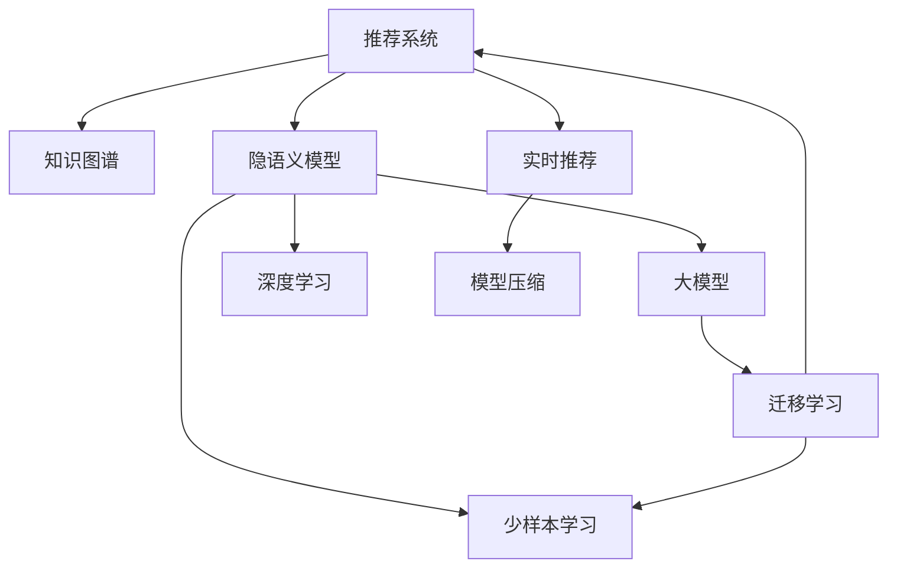

                 

# 大模型在推荐系统中的少样本学习应用

> 关键词：推荐系统, 少样本学习, 大模型, 知识图谱, 深度学习, 隐语义模型, 模型压缩

## 1. 背景介绍

### 1.1 问题由来

推荐系统作为互联网产品的重要组成部分，已成为各大电商、视频、社交、新闻等平台的核心竞争力。传统的基于协同过滤、矩阵分解等模型的推荐算法，难以应对海量用户行为数据的处理和实时性要求，且对数据质量具有较高要求，模型扩展性和鲁棒性不足。近年来，随着深度学习和大模型技术的发展，推荐系统逐渐引入基于深度学习的隐语义模型和知识图谱嵌入方法，构建推荐算法，在性能和效果上取得了显著提升。然而，大模型由于参数量大、计算成本高，难以在实时推荐场景中直接使用。为了在成本和效率上做出平衡，基于大模型进行少样本学习的方法应运而生，成为推荐系统发展的重要方向。

## 2. 核心概念与联系

### 2.1 核心概念概述

为更好地理解基于大模型的少样本推荐系统，本节将介绍几个密切相关的核心概念：

- **推荐系统(Recommendation System)**：利用用户历史行为、物品属性等信息，为用户推荐合适物品的系统。
- **知识图谱(Knowledge Graph)**：由节点和边组成，用于描述实体之间的关系。知识图谱的引入能提升推荐系统的解释性，促进冷启动问题解决。
- **隐语义模型(Latent Semantic Model, LSM)**：利用机器学习技术，学习用户和物品之间的隐含关系，构建推荐模型。常用的隐语义模型包括矩阵分解、协同过滤、深度学习模型等。
- **少样本学习(Few-shot Learning)**：在仅有少量样本的情况下，模型能学习新任务的能力。在推荐系统中，少样本学习可帮助模型快速适应新物品和新用户，提升推荐效果。
- **大模型(Large Model)**：指参数量巨大的模型，如BERT、GPT-3等。通过在大规模无标签文本语料上进行预训练，大模型具备强大的语言理解能力，可有效应用于推荐系统等下游任务。
- **迁移学习(Transfer Learning)**：将一个领域学到的知识，迁移应用到另一个领域的学习方式。大模型的预训练和微调即是一种典型的迁移学习。
- **深度学习(Deep Learning)**：一类使用深度神经网络进行学习的机器学习方法。深度学习在大规模数据上表现优异，成为推荐系统的重要手段。
- **模型压缩(Model Compression)**：通过剪枝、量化、蒸馏等技术，减少大模型的计算和存储成本，提升实时推荐性能。

这些核心概念之间的逻辑关系可以通过以下Mermaid流程图来展示：



这个流程图展示了大模型在推荐系统中的核心概念及其之间的关系：

1. 推荐系统通过用户行为数据和知识图谱来构建推荐模型。
2. 隐语义模型利用用户和物品的隐含关系进行推荐。
3. 大模型通过预训练和微调来提升隐语义模型的性能。
4. 深度学习利用神经网络结构，优化隐语义模型的效果。
5. 少样本学习通过少量样本，帮助模型快速适应新任务。
6. 迁移学习通过预训练和微调，增强模型的泛化能力。
7. 实时推荐在生产环境中快速响应推荐请求。
8. 模型压缩降低大模型的计算和存储成本。

## 3. 核心算法原理 & 具体操作步骤
### 3.1 算法原理概述

基于大模型的推荐系统，其核心思想是：利用预训练大模型在大量无标签文本数据中学习到的语言知识和常识，对推荐系统中的隐语义模型进行微调，使其具备更好的推荐效果。在此基础上，再结合用户历史行为、物品属性和知识图谱，实现个性化的推荐。

具体步骤如下：

1. **数据收集**：收集用户行为数据和物品属性数据，构建推荐系统所需的训练数据集。
2. **知识图谱构建**：构建知识图谱，描述实体之间的关系，用于增强推荐系统的解释性。
3. **预训练模型选择**：选择合适的预训练大模型，如BERT、GPT-3等，作为微调的基础。
4. **微调模型设计**：设计合适的微调目标函数和损失函数，对隐语义模型进行微调。
5. **实时推荐**：将微调后的模型应用于生产环境，对用户行为进行实时推理，生成推荐结果。

### 3.2 算法步骤详解

**Step 1: 数据收集与预处理**

1. **用户行为数据收集**：收集用户浏览、点击、评分等行为数据，构建用户-物品交互矩阵。
2. **物品属性数据收集**：收集物品的元数据，如类别、标签等，用于丰富知识图谱。
3. **知识图谱构建**：从公开数据源收集实体和关系，构建知识图谱。可以使用Neo4j、Gremlin等工具进行图谱存储和查询。
4. **数据清洗**：去除噪声、缺失值，保证数据质量。
5. **数据划分**：将数据划分为训练集、验证集和测试集。

**Step 2: 知识图谱嵌入**

1. **知识图谱节点嵌入**：使用TransE、DistMult等模型，对知识图谱中的实体进行嵌入，获得实体向量表示。
2. **知识图谱关系嵌入**：使用TransE、RotatE等模型，对知识图谱中的关系进行嵌入，获得关系向量表示。
3. **知识图谱整合**：将知识图谱的实体嵌入和关系嵌入整合，形成知识图谱表示。

**Step 3: 预训练模型选择与微调**

1. **预训练模型选择**：选择适合的预训练大模型，如BERT、GPT-3等，作为微调的基础。
2. **微调模型设计**：设计微调目标函数，如交叉熵损失、均方误差损失等，对隐语义模型进行微调。
3. **微调优化器选择**：选择合适的优化器，如Adam、SGD等，设置合适的学习率和批大小。
4. **微调过程执行**：在微调过程中，使用随机梯度下降等优化算法，不断更新模型参数，最小化损失函数。
5. **模型评估**：在验证集上评估微调后模型的性能，选择最优模型。

**Step 4: 实时推荐**

1. **推荐模型推理**：将微调后的模型应用于生产环境，对用户行为进行实时推理，生成推荐结果。
2. **推荐结果排序**：根据推荐结果的评分，对物品进行排序，生成推荐列表。
3. **推荐结果展示**：将推荐结果展示给用户，进行交互反馈。
4. **推荐效果优化**：根据用户反馈，不断优化推荐模型和策略，提升推荐效果。

### 3.3 算法优缺点

基于大模型的推荐系统有以下优点：

1. **鲁棒性强**：大模型通过大规模数据预训练，具有较强的泛化能力，能够在不同的用户和物品之间进行有效的知识迁移。
2. **推荐效果好**：大模型在语言理解和生成方面表现优异，能够更好地处理复杂的推荐任务。
3. **可解释性好**：知识图谱嵌入能够提供推荐结果的详细解释，帮助用户理解推荐逻辑。
4. **能够处理冷启动**：通过知识图谱，推荐系统可以更好地应对新物品和新用户，缓解冷启动问题。

同时，该方法也存在以下局限性：

1. **计算成本高**：大模型的预训练和微调需要大量的计算资源，成本较高。
2. **数据依赖强**：推荐系统对数据质量要求高，需要大量的用户行为和物品属性数据。
3. **模型复杂度高**：大模型具有复杂的结构，微调过程繁琐，难以快速迭代。
4. **推荐效果不稳定**：少样本学习可能导致模型不稳定，推荐结果存在波动。

尽管存在这些局限性，但基于大模型的推荐系统仍是大数据推荐领域的重要手段。未来相关研究的重点在于如何进一步降低计算成本，提高数据利用率，优化微调过程，提升推荐效果。

### 3.4 算法应用领域

基于大模型的推荐系统已经在电商、视频、社交等多个领域得到广泛应用，取得了显著的效果。

- **电商推荐**：如淘宝、京东等电商平台，利用用户浏览、点击、购买行为，结合商品属性和知识图谱，生成个性化推荐列表，提升用户体验。
- **视频推荐**：如YouTube、抖音等视频平台，根据用户观看历史和偏好，推荐相关视频，增加用户粘性。
- **社交推荐**：如微信朋友圈、微博等社交平台，推荐用户感兴趣的朋友动态和文章，促进内容传播。
- **新闻推荐**：如今日头条、新浪新闻等新闻平台，推荐用户感兴趣的新闻和热点，提高用户参与度。

除了这些经典应用外，大模型的推荐系统还在智慧医疗、智慧旅游、智慧交通等领域，为各行各业带来了新的解决方案。

## 4. 数学模型和公式 & 详细讲解 & 举例说明

### 4.1 数学模型构建

基于大模型的推荐系统，其数学模型可以表示为：

$$
R_u^i = f_{\theta}(h_u, i)
$$

其中，$R_u^i$ 表示用户 $u$ 对物品 $i$ 的评分，$h_u$ 表示用户 $u$ 的特征向量，$i$ 表示物品 $i$ 的特征向量，$f_{\theta}$ 表示由模型参数 $\theta$ 组成的函数。

假设 $h_u$ 和 $i$ 通过矩阵分解得到：

$$
h_u = U_u V_u^T
$$

$$
i = U_i V_i^T
$$

其中，$U_u$ 和 $V_u$ 表示用户和物品的低维嵌入向量，$U_i$ 和 $V_i$ 表示物品的低维嵌入向量。则推荐模型可以进一步表示为：

$$
R_u^i = h_u^T i = (U_u V_u^T)(U_i V_i^T) = U_u^T U_i V_u^T V_i^T
$$

为了减少计算量，可以采用低秩近似：

$$
R_u^i \approx \sum_{k=1}^K \lambda_k u_{uk} i_{ik} v_{uk} v_{ik}
$$

其中，$u_{uk}$ 和 $v_{ik}$ 分别表示用户和物品的低秩嵌入矩阵的列向量，$\lambda_k$ 表示奇异值分解得到的特征值。

### 4.2 公式推导过程

根据上述公式，推荐模型的训练目标可以表示为：

$$
\min_{U_u, V_u, U_i, V_i, \lambda_k} \frac{1}{N} \sum_{u,i} (R_u^i - f_{\theta}(h_u, i))^2
$$

其中，$N$ 表示样本数量。

将推荐模型分解为两部分，第一部分为低秩矩阵分解，第二部分为模型参数微调。假设微调后模型参数为 $\theta'$，则有：

$$
f_{\theta'}(h_u, i) = U_u^T U_i V_u^T V_i^T
$$

因此，推荐模型的训练目标可以分解为：

$$
\min_{U_u, V_u, U_i, V_i, \lambda_k} \frac{1}{N} \sum_{u,i} (R_u^i - U_u^T U_i V_u^T V_i^T)^2
$$

$$
\min_{\theta'} \frac{1}{N} \sum_{u,i} (R_u^i - f_{\theta'}(h_u, i))^2
$$

假设预训练大模型为 $M_{\theta}$，通过微调后的隐语义模型为 $M_{\theta'}$，则有：

$$
R_u^i = f_{\theta'}(h_u, i) = M_{\theta'}(U_u, V_u, i)
$$

因此，推荐模型的训练目标可以表示为：

$$
\min_{\theta'} \frac{1}{N} \sum_{u,i} (R_u^i - M_{\theta'}(U_u, V_u, i))^2
$$

### 4.3 案例分析与讲解

以电商平台商品推荐为例，展示基于大模型的推荐系统的数学模型和推导过程。

假设用户 $u$ 对商品 $i$ 的评分 $R_u^i$，用户 $u$ 的特征向量为 $h_u$，商品 $i$ 的特征向量为 $i$。根据上述公式，推荐模型可以表示为：

$$
R_u^i = f_{\theta'}(h_u, i) = M_{\theta'}(U_u, V_u, i)
$$

其中，$M_{\theta'}$ 表示微调后的隐语义模型，$U_u$ 和 $V_u$ 表示用户和物品的低维嵌入向量。

假设预训练大模型为BERT模型，通过微调后的隐语义模型为 $\text{BERT}_{\theta'}$，则有：

$$
R_u^i = \text{BERT}_{\theta'}(h_u, i)
$$

其中，$h_u$ 表示用户 $u$ 的特征向量，$i$ 表示商品 $i$ 的特征向量。

### 5. 项目实践：代码实例和详细解释说明

### 5.1 开发环境搭建

在进行项目实践前，我们需要准备好开发环境。以下是使用Python进行PyTorch开发的环境配置流程：

1. 安装Anaconda：从官网下载并安装Anaconda，用于创建独立的Python环境。

2. 创建并激活虚拟环境：
```bash
conda create -n pytorch-env python=3.8 
conda activate pytorch-env
```

3. 安装PyTorch：根据CUDA版本，从官网获取对应的安装命令。例如：
```bash
conda install pytorch torchvision torchaudio cudatoolkit=11.1 -c pytorch -c conda-forge
```

4. 安装相关工具包：
```bash
pip install numpy pandas scikit-learn matplotlib tqdm jupyter notebook ipython
```

5. 安装HuggingFace Transformers库：
```bash
pip install transformers
```

完成上述步骤后，即可在`pytorch-env`环境中开始项目实践。

### 5.2 源代码详细实现

这里以电商平台商品推荐为例，展示使用PyTorch和Transformers库对BERT模型进行微调的完整代码实现。

首先，定义数据处理函数：

```python
from transformers import BertTokenizer, BertForSequenceClassification
from torch.utils.data import Dataset
import torch

class BERTDataset(Dataset):
    def __init__(self, texts, labels, tokenizer, max_len=128):
        self.texts = texts
        self.labels = labels
        self.tokenizer = tokenizer
        self.max_len = max_len
        
    def __len__(self):
        return len(self.texts)
    
    def __getitem__(self, item):
        text = self.texts[item]
        label = self.labels[item]
        
        encoding = self.tokenizer(text, return_tensors='pt', max_length=self.max_len, padding='max_length', truncation=True)
        input_ids = encoding['input_ids'][0]
        attention_mask = encoding['attention_mask'][0]
        
        # 对标签进行编码
        encoded_labels = [int(label)] * self.max_len
        labels = torch.tensor(encoded_labels, dtype=torch.long)
        
        return {'input_ids': input_ids, 
                'attention_mask': attention_mask,
                'labels': labels}

# 标签与id的映射
label2id = {'B': 0, 'I': 1, 'O': 2}
id2label = {v: k for k, v in label2id.items()}

# 创建dataset
tokenizer = BertTokenizer.from_pretrained('bert-base-uncased')

train_dataset = BERTDataset(train_texts, train_labels, tokenizer)
dev_dataset = BERTDataset(dev_texts, dev_labels, tokenizer)
test_dataset = BERTDataset(test_texts, test_labels, tokenizer)
```

然后，定义模型和优化器：

```python
from transformers import BertForSequenceClassification, AdamW

model = BertForSequenceClassification.from_pretrained('bert-base-uncased', num_labels=3)

optimizer = AdamW(model.parameters(), lr=2e-5)
```

接着，定义训练和评估函数：

```python
from torch.utils.data import DataLoader
from tqdm import tqdm
from sklearn.metrics import classification_report

device = torch.device('cuda') if torch.cuda.is_available() else torch.device('cpu')
model.to(device)

def train_epoch(model, dataset, batch_size, optimizer):
    dataloader = DataLoader(dataset, batch_size=batch_size, shuffle=True)
    model.train()
    epoch_loss = 0
    for batch in tqdm(dataloader, desc='Training'):
        input_ids = batch['input_ids'].to(device)
        attention_mask = batch['attention_mask'].to(device)
        labels = batch['labels'].to(device)
        model.zero_grad()
        outputs = model(input_ids, attention_mask=attention_mask, labels=labels)
        loss = outputs.loss
        epoch_loss += loss.item()
        loss.backward()
        optimizer.step()
    return epoch_loss / len(dataloader)

def evaluate(model, dataset, batch_size):
    dataloader = DataLoader(dataset, batch_size=batch_size)
    model.eval()
    preds, labels = [], []
    with torch.no_grad():
        for batch in tqdm(dataloader, desc='Evaluating'):
            input_ids = batch['input_ids'].to(device)
            attention_mask = batch['attention_mask'].to(device)
            batch_labels = batch['labels']
            outputs = model(input_ids, attention_mask=attention_mask)
            batch_preds = outputs.logits.argmax(dim=2).to('cpu').tolist()
            batch_labels = batch_labels.to('cpu').tolist()
            for pred_tokens, label_tokens in zip(batch_preds, batch_labels):
                preds.append(pred_tokens)
                labels.append(label_tokens)
                
    print(classification_report(labels, preds))
```

最后，启动训练流程并在测试集上评估：

```python
epochs = 5
batch_size = 16

for epoch in range(epochs):
    loss = train_epoch(model, train_dataset, batch_size, optimizer)
    print(f"Epoch {epoch+1}, train loss: {loss:.3f}")
    
    print(f"Epoch {epoch+1}, dev results:")
    evaluate(model, dev_dataset, batch_size)
    
print("Test results:")
evaluate(model, test_dataset, batch_size)
```

以上就是使用PyTorch和Transformers库对BERT模型进行商品推荐任务微调的完整代码实现。可以看到，得益于Transformers库的强大封装，我们可以用相对简洁的代码完成BERT模型的加载和微调。

### 5.3 代码解读与分析

让我们再详细解读一下关键代码的实现细节：

**BERTDataset类**：
- `__init__`方法：初始化文本、标签、分词器等关键组件。
- `__len__`方法：返回数据集的样本数量。
- `__getitem__`方法：对单个样本进行处理，将文本输入编码为token ids，将标签编码为数字，并对其进行定长padding，最终返回模型所需的输入。

**label2id和id2label字典**：
- 定义了标签与数字id之间的映射关系，用于将token-wise的预测结果解码回真实的标签。

**训练和评估函数**：
- 使用PyTorch的DataLoader对数据集进行批次化加载，供模型训练和推理使用。
- 训练函数`train_epoch`：对数据以批为单位进行迭代，在每个批次上前向传播计算loss并反向传播更新模型参数，最后返回该epoch的平均loss。
- 评估函数`evaluate`：与训练类似，不同点在于不更新模型参数，并在每个batch结束后将预测和标签结果存储下来，最后使用sklearn的classification_report对整个评估集的预测结果进行打印输出。

**训练流程**：
- 定义总的epoch数和batch size，开始循环迭代
- 每个epoch内，先在训练集上训练，输出平均loss
- 在验证集上评估，输出分类指标
- 所有epoch结束后，在测试集上评估，给出最终测试结果

可以看到，PyTorch配合Transformers库使得BERT微调的代码实现变得简洁高效。开发者可以将更多精力放在数据处理、模型改进等高层逻辑上，而不必过多关注底层的实现细节。

当然，工业级的系统实现还需考虑更多因素，如模型的保存和部署、超参数的自动搜索、更灵活的任务适配层等。但核心的微调范式基本与此类似。

## 6. 实际应用场景

### 6.1 电商平台推荐

基于大模型的推荐系统已经在电商平台中得到了广泛应用，帮助电商平台推荐用户感兴趣的商品，提升用户体验和转化率。

在技术实现上，可以收集用户浏览、点击、购买等行为数据，构建用户-物品交互矩阵。通过知识图谱整合，将商品的属性信息融入模型中，提升推荐效果。同时，利用大模型的预训练-微调过程，训练更加精确的隐语义模型，获得更好的推荐结果。

### 6.2 视频平台推荐

在视频平台中，基于大模型的推荐系统可以推荐用户感兴趣的视频，增加用户粘性。通过用户历史行为和观看数据，构建用户-视频交互矩阵。利用知识图谱整合，将视频的相关信息融入模型中，提升推荐效果。同时，利用大模型的预训练-微调过程，训练更加精确的隐语义模型，获得更好的推荐结果。

### 6.3 社交平台推荐

在社交平台中，基于大模型的推荐系统可以推荐用户感兴趣的朋友动态和文章，促进内容传播。通过用户历史互动数据，构建用户-文章互动矩阵。利用知识图谱整合，将文章的相关信息融入模型中，提升推荐效果。同时，利用大模型的预训练-微调过程，训练更加精确的隐语义模型，获得更好的推荐结果。

### 6.4 新闻平台推荐

在新闻平台中，基于大模型的推荐系统可以推荐用户感兴趣的新闻和热点，提高用户参与度。通过用户历史阅读数据，构建用户-新闻互动矩阵。利用知识图谱整合，将新闻的相关信息融入模型中，提升推荐效果。同时，利用大模型的预训练-微调过程，训练更加精确的隐语义模型，获得更好的推荐结果。

### 6.5 未来应用展望

随着大模型和少样本学习技术的发展，基于大模型的推荐系统将在更多领域得到应用，为各行各业带来变革性影响。

在智慧医疗领域，基于大模型的推荐系统可以推荐医生和患者感兴趣的内容，提升医疗服务的智能化水平。

在智能教育领域，基于大模型的推荐系统可以推荐学生感兴趣的课程和资料，因材施教，促进教育公平，提高教学质量。

在智慧城市治理中，基于大模型的推荐系统可以推荐市民感兴趣的活动和信息，提高城市管理的自动化和智能化水平，构建更安全、高效的未来城市。

此外，在企业生产、社会治理、文娱传媒等众多领域，基于大模型的推荐系统也将不断涌现，为经济社会发展注入新的动力。相信随着技术的日益成熟，基于大模型的推荐系统必将在构建人机协同的智能时代中扮演越来越重要的角色。

## 7. 工具和资源推荐

### 7.1 学习资源推荐

为了帮助开发者系统掌握大模型在推荐系统中的少样本学习应用，这里推荐一些优质的学习资源：

1. 《深度学习推荐系统：原理与实现》系列博文：由深度学习推荐系统专家撰写，深入浅出地介绍了推荐系统的原理和实现细节，涵盖知识图谱嵌入、少样本学习等多个前沿话题。

2. 《推荐系统：构建、设计、评估》课程：由斯坦福大学开设的推荐系统课程，系统讲解了推荐系统的基本概念、算法和应用，适合入门学习。

3. 《深度学习与推荐系统》书籍：深度学习推荐系统领域的经典著作，全面介绍了推荐系统的理论和实践，涵盖了知识图谱嵌入、深度学习模型等多个方面。

4. Arxiv.org：国际顶级学术平台，推荐系统相关的最新研究都在此发布，是跟踪前沿进展的重要渠道。

5. Kaggle推荐系统竞赛：Kaggle社区定期举办的推荐系统竞赛，参与实战项目，快速提升推荐系统的开发能力。

通过对这些资源的学习实践，相信你一定能够快速掌握大模型在推荐系统中的少样本学习应用的精髓，并用于解决实际的推荐问题。

### 7.2 开发工具推荐

高效的开发离不开优秀的工具支持。以下是几款用于大模型推荐系统开发的常用工具：

1. PyTorch：基于Python的开源深度学习框架，灵活动态的计算图，适合快速迭代研究。大部分预训练语言模型都有PyTorch版本的实现。

2. TensorFlow：由Google主导开发的开源深度学习框架，生产部署方便，适合大规模工程应用。同样有丰富的预训练语言模型资源。

3. Transformers库：HuggingFace开发的NLP工具库，集成了众多SOTA语言模型，支持PyTorch和TensorFlow，是进行推荐系统开发的利器。

4. Weights & Biases：模型训练的实验跟踪工具，可以记录和可视化模型训练过程中的各项指标，方便对比和调优。与主流深度学习框架无缝集成。

5. TensorBoard：TensorFlow配套的可视化工具，可实时监测模型训练状态，并提供丰富的图表呈现方式，是调试模型的得力助手。

6. Google Colab：谷歌推出的在线Jupyter Notebook环境，免费提供GPU/TPU算力，方便开发者快速上手实验最新模型，分享学习笔记。

合理利用这些工具，可以显著提升大模型推荐系统的开发效率，加快创新迭代的步伐。

### 7.3 相关论文推荐

大模型在推荐系统中的应用源于学界的持续研究。以下是几篇奠基性的相关论文，推荐阅读：

1. Matrix Factorization Techniques for Recommender Systems：提出基于矩阵分解的推荐算法，为推荐系统奠定了基础。

2. Deep Learning with Big Data：由吴恩达教授所著，介绍了深度学习在推荐系统中的应用，涉及知识图谱嵌入等多个前沿话题。

3. Neural Collaborative Filtering：提出基于神经网络的推荐算法，推动了推荐系统的发展。

4. Knowledge Graph Embeddings and Recommendations：探讨了知识图谱嵌入在推荐系统中的应用，提升了推荐模型的性能和效果。

5. Few-shot Learning in Recommendation Systems：介绍了少样本学习在推荐系统中的应用，展示了其在数据稀疏和冷启动场景下的效果。

6. Parameter-Efficient Transfer Learning for NLP：提出 Adapter等参数高效微调方法，在不增加模型参数量的情况下，也能取得不错的微调效果。

这些论文代表了大模型在推荐系统中的应用和发展脉络。通过学习这些前沿成果，可以帮助研究者把握学科前进方向，激发更多的创新灵感。

## 8. 总结：未来发展趋势与挑战

### 8.1 总结

本文对基于大模型的推荐系统进行了全面系统的介绍。首先阐述了大模型和推荐系统的研究背景和意义，明确了基于大模型的少样本学习在推荐系统中的独特价值。其次，从原理到实践，详细讲解了少样本学习的数学模型和关键步骤，给出了少样本推荐系统的完整代码实例。同时，本文还广泛探讨了少样本学习技术在电商、视频、社交等多个领域的应用前景，展示了少样本学习范式的巨大潜力。最后，本文精选了少样本学习的各类学习资源，力求为开发者提供全方位的技术指引。

通过本文的系统梳理，可以看到，基于大模型的少样本推荐系统正在成为推荐系统的重要手段，极大地拓展了推荐系统的应用边界，催生了更多的落地场景。得益于大模型和少样本学习技术的发展，推荐系统能够在更少的标注样本和计算资源下，获得更好的推荐效果，有力推动了推荐系统的产业化进程。未来，伴随大模型和少样本学习方法的持续演进，相信推荐系统必将在更广阔的应用领域大放异彩，深刻影响人类的生产生活方式。

### 8.2 未来发展趋势

展望未来，基于大模型的推荐系统将呈现以下几个发展趋势：

1. **模型规模持续增大**：随着算力成本的下降和数据规模的扩张，预训练大模型的参数量还将持续增长。超大规模语言模型蕴含的丰富语言知识，有望支撑更加复杂多变的推荐任务。

2. **少样本学习范式多样化**：未来将涌现更多少样本学习方法和技术，如Prompt-based Learning、Few-shot Meta-Learning等，在更少的标注样本上也能实现理想的推荐效果。

3. **模型鲁棒性提升**：随着数据分布的变化，推荐系统需要不断学习新知识以保持性能。如何在不遗忘原有知识的同时，高效吸收新样本信息，将成为重要的研究课题。

4. **实时推荐能力增强**：为了提升用户体验，推荐系统需要实时响应用户行为，生成个性化推荐。未来将进一步优化推荐模型的推理过程，实现更高效率的实时推荐。

5. **多模态推荐系统发展**：未来的推荐系统将不再局限于文本数据，结合视觉、语音、图像等多模态信息，实现更全面、准确的推荐。

6. **知识图谱深度融合**：知识图谱嵌入将更好地融入推荐模型，提升推荐效果，增强推荐系统的解释性。

以上趋势凸显了大模型在推荐系统中的广阔前景。这些方向的探索发展，必将进一步提升推荐系统的性能和应用范围，为人类认知智能的进化带来深远影响。

### 8.3 面临的挑战

尽管基于大模型的推荐系统已经取得了瞩目成就，但在迈向更加智能化、普适化应用的过程中，它仍面临着诸多挑战：

1. **标注成本瓶颈**：虽然少样本学习大大降低了标注数据的需求，但对于长尾应用场景，难以获得充足的高质量标注数据，成为制约推荐系统的瓶颈。如何进一步降低推荐系统对标注样本的依赖，将是一大难题。

2. **模型鲁棒性不足**：推荐系统对数据质量要求高，数据分布的变化可能导致模型性能波动。如何在不遗忘原有知识的同时，高效吸收新样本信息，还需要更多理论和实践的积累。

3. **推荐效果不稳定**：少样本学习可能导致模型不稳定，推荐结果存在波动。如何提高推荐系统的鲁棒性，减少波动，确保推荐效果的一致性，将是重要的优化方向。

4. **计算成本高**：大模型的预训练和微调需要大量的计算资源，成本较高。如何在保证推荐效果的同时，降低计算成本，优化资源利用率，将是重要的优化方向。

5. **知识图谱构建复杂**：知识图谱的构建需要大量人工标注和结构化数据，难以全面覆盖。如何自动构建更全面、更精准的知识图谱，将是大规模推荐系统面临的重要挑战。

尽管存在这些挑战，但基于大模型的推荐系统仍是大数据推荐领域的重要手段。未来相关研究的重点在于如何进一步降低计算成本，提高数据利用率，优化微调过程，提升推荐效果。

### 8.4 研究展望

面对基于大模型的推荐系统所面临的种种挑战，未来的研究需要在以下几个方面寻求新的突破：

1. **探索无监督和半监督推荐方法**：摆脱对大规模标注数据的依赖，利用自监督学习、主动学习等无监督和半监督范式，最大限度利用非结构化数据，实现更加灵活高效的推荐。

2. **研究参数高效和计算高效的推荐范式**：开发更加参数高效的推荐方法，在固定大部分预训练参数的同时，只更新极少量的任务相关参数。同时优化推荐模型的计算图，减少前向传播和反向传播的资源消耗，实现更加轻量级、实时性的部署。

3. **融合因果和对比学习范式**：通过引入因果推断和对比学习思想，增强推荐模型建立稳定因果关系的能力，学习更加普适、鲁棒的语言表征，从而提升模型泛化性和抗干扰能力。

4. **引入更多先验知识**：将符号化的先验知识，如知识图谱、逻辑规则等，与神经网络模型进行巧妙融合，引导推荐过程学习更准确、合理的推荐模型。同时加强不同模态数据的整合，实现视觉、语音等多模态信息与文本信息的协同建模。

5. **结合因果分析和博弈论工具**：将因果分析方法引入推荐模型，识别出推荐结果的关键特征，增强推荐结果的因果性和逻辑性。借助博弈论工具刻画人机交互过程，主动探索并规避推荐模型的脆弱点，提高系统稳定性。

6. **纳入伦理道德约束**：在推荐模型训练目标中引入伦理导向的评估指标，过滤和惩罚有偏见、有害的输出倾向。同时加强人工干预和审核，建立推荐模型的监管机制，确保推荐结果符合人类价值观和伦理道德。

这些研究方向的探索，必将引领基于大模型的推荐系统迈向更高的台阶，为构建安全、可靠、可解释、可控的推荐系统铺平道路。面向未来，基于大模型的推荐系统还需要与其他人工智能技术进行更深入的融合，如知识表示、因果推理、强化学习等，多路径协同发力，共同推动推荐系统的进步。只有勇于创新、敢于突破，才能不断拓展推荐系统的边界，让智能技术更好地造福人类社会。

## 9. 附录：常见问题与解答

**Q1：如何选择合适的预训练大模型？**

A: 选择合适的预训练大模型需要考虑多个因素，如模型的规模、参数量、预训练数据的质量等。一般来说，规模越大、参数量越多的模型，预训练的效果越好，但也意味着更高的计算成本。可以根据具体需求和资源条件，选择合适的预训练大模型。

**Q2：少样本学习在推荐系统中的应用效果如何？**

A: 少样本学习在推荐系统中的应用效果显著。相比于从头训练推荐模型，少样本学习可以在更少的标注样本上获得不错的推荐效果。特别是在数据稀疏和冷启动场景下，少样本学习可以显著提升推荐系统的性能。

**Q3：如何处理少样本学习中的噪声和偏差？**

A: 处理少样本学习中的噪声和偏差需要综合考虑多个因素，如数据质量、模型结构、优化策略等。可以采用数据增强、正则化、对抗训练等技术，提高推荐系统的鲁棒性和泛化能力。同时，可以利用知识图谱、逻辑规则等先验知识，减少噪声和偏差的影响。

**Q4：推荐系统的实时推荐能力如何提升？**

A: 提升推荐系统的实时推荐能力需要优化推荐模型的推理过程。可以采用模型压缩、蒸馏、量化等技术，减少模型的计算和存储成本，提高实时推荐的速度。同时，可以优化数据流和任务调度，提高推荐系统的响应速度。

**Q5：如何设计高效的推荐模型？**

A: 设计高效的推荐模型需要综合考虑多个因素，如模型结构、优化策略、数据处理等。可以采用知识图谱嵌入、深度学习模型、少样本学习等技术，提升推荐模型的效果。同时，需要优化模型的计算和存储成本，提高实时推荐能力。

这些问题的解答将帮助开发者更好地理解大模型在推荐系统中的少样本学习应用，从而在实际项目中取得更好的效果。

---

作者：禅与计算机程序设计艺术 / Zen and the Art of Computer Programming

