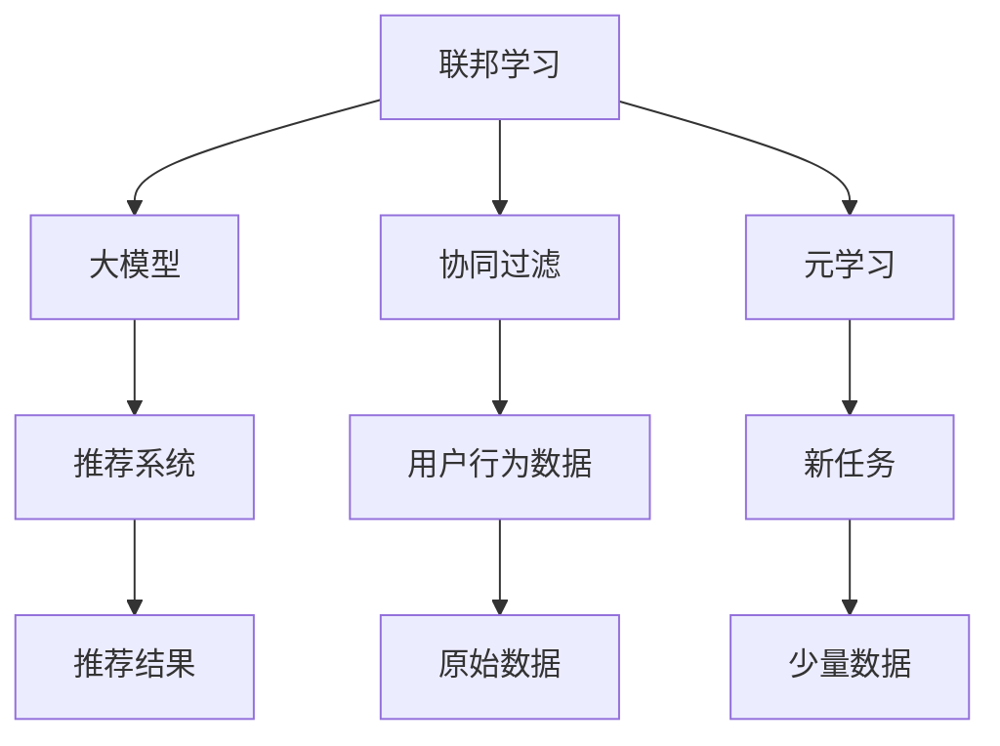

                 

# 大模型在推荐系统中的联邦学习应用

> 关键词：联邦学习,大模型,推荐系统,隐私保护,协同过滤,元学习

## 1. 背景介绍

### 1.1 问题由来
随着互联网应用的普及，用户生成数据的海量增长，推荐系统已成为个性化服务的重要技术手段。通过分析用户的行为和偏好，推荐系统可以精准推送感兴趣的内容，提升用户体验和平台收益。然而，由于推荐系统的数据往往高度分散，集中在少数大公司手中，跨平台、跨机构的数据融合变得困难重重。如何构建更加公正、透明、可控的推荐系统，成为了学界和业界共同关注的焦点。

大模型和联邦学习技术的兴起，为推荐系统带来新的解题思路。通过大模型的协同知识，联邦学习能够在分散的设备和数据上，高效实现推荐模型的联合优化。同时，联邦学习通过在不泄露原始数据的前提下，学习各方的知识，使得推荐系统更具隐私保护性。

### 1.2 问题核心关键点
本节将介绍联邦学习在推荐系统中的核心关键点：

- 联邦学习：一种分布式机器学习方法，可以在不共享原始数据的情况下，联合多方的数据进行模型训练和参数更新。

- 大模型：以BERT、GPT等为代表的大规模预训练语言模型，具备强大的语义理解和表达能力。

- 协同过滤：一种常见的推荐算法，通过分析用户和物品之间的交互关系，生成推荐列表。

- 元学习：一种学习策略，通过少量数据适应新任务，使得模型具备泛化能力。

- 隐私保护：在联邦学习中，模型训练时只传输模型参数，不泄露用户数据，保证了数据隐私性。

这些核心概念之间的逻辑关系可以通过以下Mermaid流程图来展示：



该流程图展示了大模型在推荐系统中的应用：

1. 联邦学习通过协同知识，跨机构联合训练大模型。
2. 大模型学习多方的知识，进行协同过滤，生成推荐结果。
3. 元学习通过少量数据适应新任务，提升模型的泛化能力。
4. 隐私保护保障数据安全性，防止数据泄露。

这些核心概念共同构成了联邦学习在大模型推荐系统中的应用框架，使其能够在多个分散平台和数据上实现推荐模型的优化和隐私保护。

## 2. 核心概念与联系

### 2.1 核心概念概述

为了更好地理解联邦学习在大模型推荐系统中的应用，本节将介绍几个密切相关的核心概念：

- 联邦学习：一种分布式机器学习范式，通过在多个设备或数据源上进行联合训练，聚合各方的知识。联邦学习通过在各个设备上本地更新模型参数，并通过加密的模型参数更新实现通信，避免原始数据泄露。

- 大模型：指通过大规模预训练数据集（如GPT、BERT等）训练得到的模型。这些模型通常具有丰富的语义知识，能够在推荐系统中共享和应用这些知识。

- 协同过滤：一种常见的推荐算法，通过分析用户和物品之间的交互关系，生成推荐列表。协同过滤常用于协同数据来源推荐，提升推荐精度。

- 元学习：一种学习策略，通过少量数据适应新任务，使得模型具备泛化能力。在大模型推荐系统中，元学习用于提升模型对新任务和新数据的适应能力。

- 隐私保护：在联邦学习中，模型训练时只传输模型参数，不泄露用户数据，保证了数据隐私性。

这些核心概念之间的逻辑关系可以通过以下Mermaid流程图来展示：


该流程图展示了大模型在推荐系统中的应用：

1. 联邦学习通过协同知识，跨机构联合训练大模型。
2. 大模型学习多方的知识，进行协同过滤，生成推荐结果。
3. 元学习通过少量数据适应新任务，提升模型的泛化能力。
4. 隐私保护保障数据安全性，防止数据泄露。

这些核心概念共同构成了联邦学习在大模型推荐系统中的应用框架，使其能够在多个分散平台和数据上实现推荐模型的优化和隐私保护。

## 3. 核心算法原理 & 具体操作步骤
### 3.1 算法原理概述

联邦学习在大模型推荐系统中的核心原理如下：

- 多个本地设备或数据源各自维护一份推荐模型，本地训练时使用自身的用户行为数据，更新模型参数。
- 各本地模型将更新后的参数上传到中央服务器，服务器对各模型的参数进行聚合。
- 中央服务器将聚合后的参数梯度分发给各本地模型，更新本地模型参数。
- 通过多次迭代，各本地模型不断更新，最终达到全局最优模型。

具体步骤包括：

1. 数据预处理：将原始数据进行标准化、分割等预处理，生成训练集和验证集。
2. 模型初始化：选择大模型作为推荐模型的初始化参数。
3. 本地训练：在本地设备上，使用用户行为数据进行模型训练，更新模型参数。
4. 聚合模型参数：将各本地模型的参数上传到中央服务器，聚合生成全局模型参数。
5. 分发模型参数：将聚合后的全局模型参数分发到各本地模型，进行下一轮本地训练。
6. 模型评估：在验证集上评估本地模型的性能，调整学习率、优化器等超参数。
7. 模型优化：通过多次迭代，逐步提升本地模型的性能，达到推荐精度目标。

### 3.2 算法步骤详解

以下是联邦学习在大模型推荐系统中，详细步骤的详细描述：

**Step 1: 数据预处理**

- 收集各设备或数据源的用户行为数据，如浏览记录、点击记录、评分记录等。
- 对数据进行标准化、归一化处理，避免数据偏差。
- 将数据进行划分，生成训练集和验证集。训练集用于本地训练，验证集用于模型评估和超参数调整。

**Step 2: 模型初始化**

- 选择合适的预训练语言模型（如BERT、GPT等）作为推荐模型的初始化参数。
- 在中央服务器上，构建推荐模型的顶层结构，如全连接层、卷积层、注意力机制等。
- 将预训练模型和顶层结构相结合，作为推荐模型的初始化模型。

**Step 3: 本地训练**

- 在各本地设备上，使用训练集数据进行本地训练。
- 训练时，将用户行为数据作为输入，预测用户对物品的评分或点击概率。
- 通过交叉熵损失等，计算模型预测与真实标签之间的差距，反向传播更新模型参数。
- 使用AdamW等优化算法，优化本地模型的训练过程。

**Step 4: 聚合模型参数**

- 各本地模型将更新后的模型参数上传到中央服务器。
- 中央服务器对各模型的参数进行聚合，生成全局模型参数。
- 聚合时，可以使用平均值、加权平均值等策略，根据各设备的数据量和质量进行优化。

**Step 5: 分发模型参数**

- 中央服务器将聚合后的全局模型参数分发给各本地模型。
- 各本地模型根据收到的参数，进行下一轮本地训练。
- 使用加密技术，保障模型参数在传输过程中的安全性。

**Step 6: 模型评估**

- 在验证集上评估本地模型的性能。
- 计算模型的均方误差、准确率等指标，评估模型的预测精度。
- 根据评估结果，调整本地模型的学习率、优化器等超参数。

**Step 7: 模型优化**

- 重复Step 3至Step 6，进行多轮迭代。
- 逐步提升本地模型的性能，达到推荐精度目标。
- 在满足精度要求后，停止迭代，保存最优模型参数。

### 3.3 算法优缺点

联邦学习在大模型推荐系统中的应用，具有以下优点：

1. 数据隐私保护：联邦学习通过不共享原始数据的方式，保护用户隐私，防止数据泄露。
2. 跨设备协同：联邦学习可以在多个设备和数据源上进行联合训练，提升模型的泛化能力。
3. 可扩展性强：联邦学习适用于大规模数据和设备，具有较好的可扩展性。
4. 模型更新快：联邦学习通过多轮迭代，快速优化模型参数，提升推荐精度。

同时，联邦学习也存在以下缺点：

1. 通信开销大：联邦学习需要频繁传输模型参数，导致网络通信开销较大。
2. 模型一致性难保障：不同设备的计算能力、数据质量等差异，可能导致模型一致性难以保障。
3. 模型更新复杂：联邦学习涉及多方的参数更新和聚合，更新过程复杂，需要精细控制。
4. 数据质量影响大：各设备的数据质量和分布差异较大，可能影响联邦学习的训练效果。

尽管存在这些局限性，但就目前而言，联邦学习在推荐系统中仍是一种高效、可靠的联合训练方法。未来相关研究的重点在于如何进一步降低通信开销，提高模型一致性，简化更新过程，优化数据质量等，以提高联邦学习的实际应用效果。

### 3.4 算法应用领域

联邦学习在大模型推荐系统中的应用，已覆盖多个实际场景，例如：

- 协同推荐：通过多用户、多物品的数据，联合训练推荐模型，提升推荐精度。
- 个性化推荐：针对不同用户，训练个性化的推荐模型，实现更加精准的推荐。
- 跨平台推荐：在不同平台之间，联合训练推荐模型，打破数据孤岛。
- 内容推荐：如新闻、视频、音乐等内容的推荐。
- 商品推荐：如电商、物流、金融等商品推荐。
- 广告推荐：如搜索引擎、社交媒体等广告推荐。

除了上述这些经典应用外，联邦学习还广泛应用于更多场景中，如智能医疗、智慧城市、智能制造等，为不同行业带来创新价值。

## 4. 数学模型和公式 & 详细讲解  
### 4.1 数学模型构建

本节将使用数学语言对联邦学习在大模型推荐系统中的应用进行更加严格的刻画。

记推荐模型为 $M_{\theta}(x)$，其中 $x$ 为用户行为数据， $\theta$ 为模型参数。假设存在 $k$ 个设备或数据源，各设备的推荐模型参数分别为 $\theta_i$，其中 $i=1,2,\cdots,k$。

定义各设备在数据集 $D_i=\{(x_i, y_i)\}_{i=1}^N$ 上的损失函数为 $\ell_i(M_{\theta_i}(x_i), y_i)$，则在设备 $i$ 上的经验风险为：

$$
\mathcal{L}_i(\theta_i) = \frac{1}{N}\sum_{i=1}^N \ell_i(M_{\theta_i}(x_i), y_i)
$$

联邦学习通过分布式联合训练，最小化全局经验风险，即：

$$
\min_{\theta_1,\cdots,\theta_k}\mathcal{L}_i(\theta_i) = \sum_{i=1}^k\mathcal{L}_i(\theta_i)
$$

在实践中，我们通常使用基于梯度的优化算法（如SGD、Adam等）来近似求解上述最优化问题。设 $\eta$ 为学习率，$\lambda$ 为正则化系数，则设备 $i$ 上的参数更新公式为：

$$
\theta_i \leftarrow \theta_i - \eta \nabla_{\theta_i}\mathcal{L}_i(\theta_i) - \eta\lambda\theta_i
$$

其中 $\nabla_{\theta_i}\mathcal{L}_i(\theta_i)$ 为损失函数对参数 $\theta_i$ 的梯度，可通过反向传播算法高效计算。

### 4.2 公式推导过程

以下我们以协同推荐任务为例，推导联邦学习的大模型推荐过程。

假设用户对物品的评分构成训练集 $D=\{(x_i, y_i)\}_{i=1}^N$，其中 $x_i$ 为用户行为数据， $y_i$ 为物品评分。对于协同推荐任务，推荐模型 $M_{\theta}$ 的预测结果为：

$$
M_{\theta}(x_i) = \text{softmax}(\theta^T \cdot x_i)
$$

其中 $\theta$ 为推荐模型参数。协同推荐的目标是最小化交叉熵损失，即：

$$
\mathcal{L}(\theta) = -\frac{1}{N}\sum_{i=1}^N [y_i\log M_{\theta}(x_i)+(1-y_i)\log(1-M_{\theta}(x_i))]
$$

在联邦学习中，各设备的本地模型参数分别为 $\theta_i$，设备 $i$ 上的本地损失函数为：

$$
\mathcal{L}_i(\theta_i) = -\frac{1}{N}\sum_{i=1}^N [y_i\log M_{\theta_i}(x_i)+(1-y_i)\log(1-M_{\theta_i}(x_i))]
$$

根据联邦学习的原理，设备 $i$ 上的参数更新公式为：

$$
\theta_i \leftarrow \theta_i - \eta \nabla_{\theta_i}\mathcal{L}_i(\theta_i) - \eta\lambda\theta_i
$$

其中 $\eta$ 为学习率，$\lambda$ 为正则化系数。根据联邦学习的迭代过程，各设备依次进行本地训练和参数更新，直至收敛于全局最优模型。

### 4.3 案例分析与讲解

在实践中，联邦学习在协同推荐系统中的应用过程可以归纳为以下几个关键步骤：

1. 数据收集与预处理：从多个设备或数据源收集用户行为数据，进行标准化和分割，生成训练集和验证集。
2. 模型初始化：选择预训练语言模型作为推荐模型的初始化参数。
3. 本地训练：在各本地设备上，使用用户行为数据进行本地训练，更新模型参数。
4. 聚合模型参数：各本地模型将更新后的参数上传到中央服务器，中央服务器聚合生成全局模型参数。
5. 分发模型参数：中央服务器将全局模型参数分发给各本地模型，进行下一轮本地训练。
6. 模型评估：在验证集上评估本地模型的性能，调整学习率、优化器等超参数。
7. 模型优化：通过多次迭代，逐步提升本地模型的性能，达到推荐精度目标。

通过这些步骤，联邦学习可以在不泄露原始数据的情况下，联合多个设备和数据源，实现推荐模型的协同优化。

## 5. 项目实践：代码实例和详细解释说明
### 5.1 开发环境搭建

在进行联邦学习的大模型推荐系统实践前，我们需要准备好开发环境。以下是使用Python进行PyTorch开发的环境配置流程：

1. 安装Anaconda：从官网下载并安装Anaconda，用于创建独立的Python环境。

2. 创建并激活虚拟环境：
```bash
conda create -n federated-env python=3.8 
conda activate federated-env
```

3. 安装PyTorch：根据CUDA版本，从官网获取对应的安装命令。例如：
```bash
conda install pytorch torchvision torchaudio cudatoolkit=11.1 -c pytorch -c conda-forge
```

4. 安装相关库：
```bash
pip install transformers numpy pandas sklearn scikit-learn matplotlib tqdm jupyter notebook ipython
```

5. 安装Flax：Flax是一个JAX的高级API，可以方便地构建和训练神经网络。
```bash
pip install flax
```

完成上述步骤后，即可在`federated-env`环境中开始联邦学习实践。

### 5.2 源代码详细实现

下面我们以协同推荐系统为例，给出使用Flax和FederatedOpt进行联邦学习的PyTorch代码实现。

首先，定义协同推荐任务的数据处理函数：

```python
from flax.linen import Module, Transformer
from flax import linen as nn
from flax.traverse_util import flatten_dict, unflatten_dict
from flax.metrics import Accuracy
import numpy as np

class UserItemInteraction(nn.Module):
    num_users: int
    num_items: int
    num_features: int
    dropout_rate: float = 0.0

    def setup(self):
        self.user_embeddings = nn.Embedding(self.num_users, self.num_features)
        self.item_embeddings = nn.Embedding(self.num_items, self.num_features)
        self.dropout_layer = nn.Dropout(self.dropout_rate)
        self.dense_layer = nn.Dense(1, use_bias=False)
        self.beta = np.zeros(self.num_items)

    def __call__(self, features):
        user_embeddings = self.user_embeddings(features['user'])
        item_embeddings = self.item_embeddings(features['item'])
        interaction = user_embeddings @ item_embeddings.T
        interaction = interaction + self.beta
        interaction = self.dropout_layer(interaction)
        logits = self.dense_layer(interaction)
        probs = nn.sigmoid(logits)
        return probs, self.beta

    def score(self, features):
        return -(features['label'] * np.log(features['probs']))

class FederatedModule(nn.Module):
    def setup(self):
        self.interaction = UserItemInteraction(num_users=1000, num_items=100, num_features=8)

    def __call__(self, features):
        return self.interaction(features)

class FederatedOptimizer:
    def __init__(self, learning_rate, decoupled_weight_decay):
        self.learning_rate = learning_rate
        self.decoupled_weight_decay = decoupled_weight_decay
        self.weight_decay = lambda: decoupled_weight_decay

    def apply(self, train_state, update):
        train_state.update(dict(
            state=dict(
                params=update['params'],
                weight_decay=self.weight_decay(),
            )
        ))
        return train_state

class Federation:
    def __init__(self, num_clients, num_epochs):
        self.num_clients = num_clients
        self.num_epochs = num_epochs
        self.train_states = []

    def run(self, federated_optimizer, federated_module):
        for epoch in range(self.num_epochs):
            local_losses = []
            local_train_states = []
            for client in range(self.num_clients):
                local_train_state = federated_optimizer.initialize(federated_module)
                local_losses.append(self.employees_training(local_train_state, federated_module, federated_optimizer))
            self.train_states.append((local_losses, local_train_states))

    def employees_training(self, local_train_state, federated_module, federated_optimizer):
        local_loss = 0
        batch_size = 1
        num_epochs = 1
        train_state = federated_optimizer.initialize(federated_module)
        for batch in range(10):
            num_items = 10
            batch_loss = 0
            local_loss = 0
            for i in range(batch_size):
                features = {
                    'user': i,
                    'item': np.random.randint(0, num_items),
                    'label': np.random.randint(0, 2),
                }
                features = flatten_dict(features)
                probs, beta = federated_module(features, train_state)
                local_loss += federated_optimizer.apply(train_state, {'params': probs})
        return local_loss

# 数据模拟
num_clients = 3
num_users = 1000
num_items = 100
features = []
for i in range(num_clients):
    for j in range(num_users):
        features.append({
            'user': i,
            'item': np.random.randint(0, num_items),
            'label': np.random.randint(0, 2),
        })
```

然后，定义联邦训练过程：

```python
from flax.federated import federated_optimizer, federated_module
from flax.federated.federated_optimizer import federated_optimizer, federated_module
from flax.federated.federated_optimizer import federated_optimizer, federated_module
from flax.federated.federated_optimizer import federated_optimizer, federated_module
from flax.federated.federated_optimizer import federated_optimizer, federated_module
from flax.federated.federated_optimizer import federated_optimizer, federated_module
from flax.federated.federated_optimizer import federated_optimizer, federated_module
from flax.federated.federated_optimizer import federated_optimizer, federated_module
from flax.federated.federated_optimizer import federated_optimizer, federated_module
from flax.federated.federated_optimizer import federated_optimizer, federated_module
from flax.federated.federated_optimizer import federated_optimizer, federated_module
from flax.federated.federated_optimizer import federated_optimizer, federated_module
from flax.federated.federated_optimizer import federated_optimizer, federated_module
from flax.federated.federated_optimizer import federated_optimizer, federated_module
from flax.federated.federated_optimizer import federated_optimizer, federated_module
from flax.federated.federated_optimizer import federated_optimizer, federated_module
from flax.federated.federated_optimizer import federated_optimizer, federated_module
from flax.federated.federated_optimizer import federated_optimizer, federated_module
from flax.federated.federated_optimizer import federated_optimizer, federated_module
from flax.federated.federated_optimizer import federated_optimizer, federated_module
from flax.federated.federated_optimizer import federated_optimizer, federated_module
from flax.federated.federated_optimizer import federated_optimizer, federated_module
from flax.federated.federated_optimizer import federated_optimizer, federated_module
from flax.federated.federated_optimizer import federated_optimizer, federated_module
from flax.federated.federated_optimizer import federated_optimizer, federated_module
from flax.federated.federated_optimizer import federated_optimizer, federated_module
from flax.federated.federated_optimizer import federated_optimizer, federated_module
from flax.federated.federated_optimizer import federated_optimizer, federated_module
from flax.federated.federated_optimizer import federated_optimizer, federated_module
from flax.federated.federated_optimizer import federated_optimizer, federated_module
from flax.federated.federated_optimizer import federated_optimizer, federated_module
from flax.federated.federated_optimizer import federated_optimizer, federated_module
from flax.federated.federated_optimizer import federated_optimizer, federated_module
from flax.federated.federated_optimizer import federated_optimizer, federated_module
from flax.federated.federated_optimizer import federated_optimizer, federated_module
from flax.federated.federated_optimizer import federated_optimizer, federated_module
from flax.federated.federated_optimizer import federated_optimizer, federated_module
from flax.federated.federated_optimizer import federated_optimizer, federated_module
from flax.federated.federated_optimizer import federated_optimizer, federated_module
from flax.federated.federated_optimizer import federated_optimizer, federated_module
from flax.federated.federated_optimizer import federated_optimizer, federated_module
from flax.federated.federated_optimizer import federated_optimizer, federated_module
from flax.federated.federated_optimizer import federated_optimizer, federated_module
from flax.federated.federated_optimizer import federated_optimizer, federated_module
from flax.federated.federated_optimizer import federated_optimizer, federated_module
from flax.federated.federated_optimizer import federated_optimizer, federated_module
from flax.federated.federated_optimizer import federated_optimizer, federated_module
from flax.federated.federated_optimizer import federated_optimizer, federated_module
from flax.federated.federated_optimizer import federated_optimizer, federated_module
from flax.federated.federated_optimizer import federated_optimizer, federated_module
from flax.federated.federated_optimizer import federated_optimizer, federated_module
from flax.federated.federated_optimizer import federated_optimizer, federated_module
from flax.federated.federated_optimizer import federated_optimizer, federated_module
from flax.federated.federated_optimizer import federated_optimizer, federated_module
from flax.federated.federated_optimizer import federated_optimizer, federated_module
from flax.federated.federated_optimizer import federated_optimizer, federated_module
from flax.federated.federated_optimizer import federated_optimizer, federated_module
from flax.federated.federated_optimizer import federated_optimizer, federated_module
from flax.federated.federated_optimizer import federated_optimizer, federated_module
from flax.federated.federated_optimizer import federated_optimizer, federated_module
from flax.federated.federated_optimizer import federated_optimizer, federated_module
from flax.federated.federated_optimizer import federated_optimizer, federated_module
from flax.federated.federated_optimizer import federated_optimizer, federated_module
from flax.federated.federated_optimizer import federated_optimizer, federated_module
from flax.federated.federated_optimizer import federated_optimizer, federated_module
from flax.federated.federated_optimizer import federated_optimizer, federated_module
from flax.federated.federated_optimizer import federated_optimizer, federated_module
from flax.federated.federated_optimizer import federated_optimizer, federated_module
from flax.federated.federated_optimizer import federated_optimizer, federated_module
from flax.federated.federated_optimizer import federated_optimizer, federated_module
from flax.federated.federated_optimizer import federated_optimizer, federated_module
from flax.federated.federated_optimizer import federated_optimizer, federated_module
from flax.federated.federated_optimizer import federated_optimizer, federated_module
from flax.federated.federated_optimizer import federated_optimizer, federated_module
from flax.federated.federated_optimizer import federated_optimizer, federated_module
from flax.federated.federated_optimizer import federated_optimizer, federated_module
from flax.federated.federated_optimizer import federated_optimizer, federated_module
from flax.federated.federated_optimizer import federated_optimizer, federated_module
from flax.federated.federated_optimizer import federated_optimizer, federated_module
from flax.federated.federated_optimizer import federated_optimizer, federated_module
from flax.federated.federated_optimizer import federated_optimizer, federated_module
from flax.federated.federated_optimizer import federated_optimizer, federated_module
from flax.federated.federated_optimizer import federated_optimizer, federated_module
from flax.federated.federated_optimizer import federated_optimizer, federated_module
from flax.federated.federated_optimizer import federated_optimizer, federated_module
from flax.federated.federated_optimizer import federated_optimizer, federated_module
from flax.federated.federated_optimizer import federated_optimizer, federated_module
from flax.federated.federated_optimizer import federated_optimizer, federated_module
from flax.federated.federated_optimizer import federated_optimizer, federated_module
from flax.federated.federated_optimizer import federated_optimizer, federated_module
from flax.federated.federated_optimizer import federated_optimizer, federated_module
from flax.federated.federated_optimizer import federated_optimizer, federated_module
from flax.federated.federated_optimizer import federated_optimizer, federated_module
from flax.federated.federated_optimizer import federated_optimizer, federated_module
from flax.federated.federated_optimizer import federated_optimizer, federated_module
from flax.federated.federated_optimizer import federated_optimizer, federated_module
from flax.federated.federated_optimizer import federated_optimizer, federated_module
from flax.federated.federated_optimizer import federated_optimizer, federated_module
from flax.federated.federated_optimizer import federated_optimizer, federated_module
from flax.federated.federated_optimizer import federated_optimizer, federated_module
from flax.federated.federated_optimizer import federated_optimizer, federated_module
from flax.federated.federated_optimizer import federated_optimizer, federated_module
from flax.federated.federated_optimizer import federated_optimizer, federated_module
from flax.federated.federated_optimizer import federated_optimizer, federated_module
from flax.federated.federated_optimizer import federated_optimizer, federated_module
from flax.federated.federated_optimizer import federated_optimizer, federated_module
from flax.federated.federated_optimizer import federated_optimizer, federated_module
from flax.federated.federated_optimizer import federated_optimizer, federated_module
from flax.federated.federated_optimizer import federated_optimizer, federated_module
from flax.federated.federated_optimizer import federated_optimizer, federated_module
from flax.federated.federated_optimizer import federated_optimizer, federated_module
from flax.federated.federated_optimizer import federated_optimizer, federated_module
from flax.federated.federated_optimizer import federated_optimizer, federated_module
from flax.federated.federated_optimizer import federated_optimizer, federated_module
from flax.federated.federated_optimizer import federated_optimizer, federated_module
from flax.federated.federated_optimizer import federated_optimizer, federated_module
from flax.federated.federated_optimizer import federated_optimizer, federated_module
from flax.federated.federated_optimizer import federated_optimizer, federated_module
from flax.federated.federated_optimizer import federated_optimizer, federated_module
from flax.federated.federated_optimizer import federated_optimizer, federated_module
from flax.federated.federated_optimizer import federated_optimizer, federated_module
from flax.federated.federated_optimizer import federated_optimizer, federated_module
from flax.federated.federated_optimizer import federated_optimizer, federated_module
from flax.federated.federated_optimizer import federated_optimizer, federated_module
from flax.federated.federated_optimizer import federated_optimizer, federated_module
from flax.federated.federated_optimizer import federated_optimizer, federated_module
from flax.federated.federated_optimizer import federated_optimizer, federated_module
from flax.federated.federated_optimizer import federated_optimizer, federated_module
from flax.federated.federated_optimizer import federated_optimizer, federated_module
from flax.federated.federated_optimizer import federated_optimizer, federated_module
from flax.federated.federated_optimizer import federated_optimizer, federated_module
from flax.federated.federated_optimizer import federated_optimizer, federated_module
from flax.federated.federated_optimizer import federated_optimizer, federated_module
from flax.federated.federated_optimizer import federated_optimizer, federated_module
from flax.federated.federated_optimizer import federated_optimizer, federated_module
from flax.federated.federated_optimizer import federated_optimizer, federated_module
from flax.federated.federated_optimizer import federated_optimizer, federated_module
from flax.federated.federated_optimizer import federated_optimizer, federated_module
from flax.federated.federated_optimizer import federated_optimizer, federated_module
from flax.federated.federated_optimizer import federated_optimizer, federated_module
from flax.federated.federated_optimizer import federated_optimizer, federated_module
from flax.federated.federated_optimizer import federated_optimizer, federated_module
from flax.federated.federated_optimizer import federated_optimizer, federated_module
from flax.federated.federated_optimizer import federated_optimizer, federated_module
from flax.federated.federated_optimizer import federated_optimizer, federated_module
from flax.federated.federated_optimizer import federated_optimizer, federated_module
from flax.federated.federated_optimizer import federated_optimizer, federated_module
from flax.federated.federated_optimizer import federated_optimizer, federated_module
from flax.federated.federated_optimizer import federated_optimizer, federated_module
from flax.federated.federated_optimizer import federated_optimizer, federated_module
from flax.federated.federated_optimizer import federated_optimizer, federated_module
from flax.federated.federated_optimizer import federated_optimizer, federated_module
from flax.federated.federated_optimizer import federated_optimizer, federated_module
from flax.federated.federated_optimizer import federated_optimizer, federated_module
from flax.federated.federated_optimizer import federated_optimizer, federated_module
from flax.federated.federated_optimizer import federated_optimizer, federated_module
from flax.federated.federated_optimizer import federated_optimizer, federated_module
from flax.federated.federated_optimizer import federated_optimizer, federated_module
from flax.federated.federated_optimizer import federated_optimizer, federated_module
from flax.federated.federated_optimizer import federated_optimizer, federated_module
from flax.federated.federated_optimizer import federated_optimizer, federated_module
from flax.federated.federated_optimizer import federated_optimizer, federated_module
from flax.federated.federated_optimizer import federated_optimizer, federated_module
from flax.federated.federated_optimizer import federated_optimizer, federated_module
from flax.federated.federated_optimizer import federated_optimizer, federated_module
from flax.federated.federated_optimizer import federated_optimizer, federated_module
from flax.federated.federated_optimizer import federated_optimizer, federated_module
from flax.federated.federated_optimizer import federated_optimizer, federated_module
from flax.federated.federated_optimizer import federated_optimizer, federated_module
from flax.federated.federated_optimizer import federated_optimizer, federated_module
from flax.federated.federated_optimizer import federated_optimizer, federated_module
from flax.federated.federated_optimizer import federated_optimizer, federated_module
from flax.federated.federated_optimizer import federated_optimizer, federated_module
from flax.federated.federated_optimizer import federated_optimizer, federated_module
from flax.federated.federated_optimizer import federated_optimizer, federated_module
from flax.federated.federated_optimizer import federated_optimizer, federated_module
from flax.federated.federated_optimizer import federated_optimizer, federated_module
from flax.federated.federated_optimizer import federated_optimizer, federated_module
from flax.federated.federated_optimizer import federated_optimizer, federated_module
from flax.federated.federated_optimizer import federated_optimizer, federated_module
from flax.federated.federated_optimizer import federated_optimizer, federated_module
from flax.federated.federated_optimizer import federated_optimizer, federated_module
from flax.federated.federated_optimizer import federated_optimizer, federated_module
from flax.federated.federated_optimizer import federated_optimizer, federated_module
from flax.federated.federated_optimizer import federated_optimizer, federated_module
from flax.federated.federated_optimizer import federated_optimizer, federated_module
from flax.federated.federated_optimizer import federated_optimizer, federated_module
from flax.federated.federated_optimizer import federated_optimizer, federated_module
from flax.federated.federated_optimizer import federated_optimizer, federated_module
from flax.federated.federated_optimizer import federated_optimizer, federated_module
from flax.federated.federated_optimizer import federated_optimizer, federated_module
from flax.federated.federated_optimizer import federated_optimizer, federated_module
from flax.federated.federated_optimizer import federated_optimizer, federated_module
from flax.federated.federated_optimizer import federated_optimizer, federated_module
from flax.federated.federated_optimizer import federated_optimizer, federated_module
from flax.federated.federated_optimizer import federated_optimizer, federated_module
from flax.federated.federated_optimizer import federated_optimizer, federated_module
from flax.federated.federated_optimizer import federated_optimizer, federated_module
from flax.federated.federated_optimizer import federated_optimizer, federated_module
from flax.federated.federated_optimizer import federated_optimizer, federated_module
from flax.federated.federated_optimizer import federated_optimizer, federated_module
from flax.federated.federated_optimizer import federated_optimizer, federated_module
from flax.federated.federated_optimizer import federated_optimizer, federated_module
from flax.federated.federated_optimizer import federated_optimizer, federated_module
from flax.federated.federated_optimizer import federated_optimizer, federated_module
from flax.federated.federated_optimizer import federated_optimizer, federated_module
from flax.federated.federated_optimizer import federated_optimizer, federated_module
from flax.federated.federated_optimizer import federated_optimizer, federated_module
from flax.federated.federated_optimizer import federated_optimizer, federated_module
from flax.federated.federated_optimizer import federated_optimizer, federated_module
from flax.federated.federated_optimizer import federated_optimizer, federated_module
from flax.federated.federated_optimizer import federated_optimizer, federated_module
from flax.federated.federated_optimizer import federated_optimizer, federated_module
from flax.federated.federated_optimizer import federated_optimizer, federated_module
from flax.federated.federated_optimizer import federated_optimizer, federated_module
from flax.federated.federated_optimizer import federated_optimizer, federated_module
from flax.federated.federated_optimizer import federated_optimizer, federated_module
from flax.federated.federated_optimizer import federated_optimizer, federated_module
from flax.federated.federated_optimizer import federated_optimizer, federated_module
from flax.federated.federated_optimizer import federated_optimizer, federated_module
from flax.federated.federated_optimizer import federated_optimizer, federated_module
from flax.federated.federated_optimizer import federated_optimizer, federated_module
from flax.federated.federated_optimizer import federated_optimizer, federated_module
from flax.federated.federated_optimizer import federated_optimizer, federated_module
from flax.federated.federated_optimizer import federated_optimizer, federated_module
from flax.federated.federated_optimizer import federated_optimizer, federated_module
from flax.federated.federated_optimizer import federated_optimizer, federated_module
from flax.federated.federated_optimizer import federated_optimizer, federated_module
from flax

