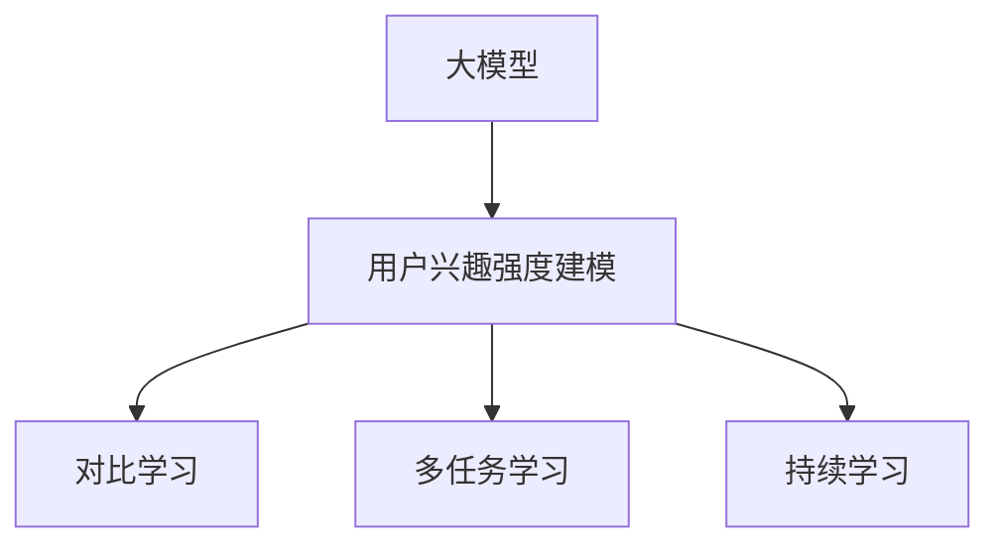

                 

# 大模型在推荐系统用户兴趣强度建模中的应用

## 1. 背景介绍

### 1.1 问题由来
推荐系统作为提升用户体验、提高服务质量的重要工具，已经广泛应用于电商、视频、新闻等众多领域。传统推荐系统往往基于用户的历史行为数据进行物品推荐，但难以深入理解用户的兴趣偏好，特别是在冷启动问题上表现不佳。近年来，随着预训练语言模型和大模型技术的发展，推荐系统在理解用户兴趣方面取得了长足的进步。大模型通过大量无监督学习，能够捕捉到用户的深层次语言特征和兴趣模式，从而更好地为个性化推荐服务。

### 1.2 问题核心关键点
推荐系统中的用户兴趣强度建模，即利用用户的语义表达和行为数据，量化并建模用户对不同物品的兴趣程度。该任务在推荐算法中占据核心地位，直接决定了物品的排序和推荐结果。大模型在推荐系统中的应用，主要体现在以下几个方面：
- 利用语言模型理解用户描述和行为语义，捕捉更深层次的用户兴趣特征。
- 引入多模态数据，将用户文本描述、点击记录、评分等数据进行整合建模，提升推荐的准确性和个性化。
- 采用对比学习、多任务学习等方法，利用大模型的多领域泛化能力，构建更加稳定、鲁棒的推荐模型。
- 使用持续学习机制，保持模型对新数据的敏感性，及时更新推荐策略。

## 2. 核心概念与联系

### 2.1 核心概念概述

为更好地理解大模型在推荐系统中的应用，本节将介绍几个关键概念：

- 大模型(Large Model)：以Transformer为基础的大型预训练模型，如BERT、GPT、T5等。这些模型通过大规模语料库的训练，学习到丰富的语言表示，能够理解自然语言和处理多种NLP任务。
- 推荐系统(Recommender System)：通过算法为用户推荐感兴趣物品的系统，包括基于协同过滤、内容推荐、混合推荐等多种方法。
- 用户兴趣强度建模(User Interest Modeling)：通过建模用户对不同物品的兴趣程度，指导推荐系统生成个性化的推荐结果。
- 对比学习(Contrastive Learning)：一种无监督学习方法，通过最大化正样本与负样本之间的差异，学习到更加有效的特征表示。
- 多任务学习(Multi-task Learning)：一种有监督学习方法，通过多任务联合训练，促进各任务之间的知识迁移和泛化。
- 持续学习(Continual Learning)：一种学习范式，使模型能够随着时间的推移，不断更新知识，适应新的数据分布。

这些核心概念之间的逻辑关系可以通过以下Mermaid流程图来展示：



这个流程图展示了核心概念之间的联系：大模型通过学习用户语义表达和行为数据，进行用户兴趣强度建模。而对比学习、多任务学习、持续学习等方法，可以进一步优化大模型在推荐系统中的应用效果。

## 3. 核心算法原理 & 具体操作步骤
### 3.1 算法原理概述

用户兴趣强度建模的本质，是利用大模型学习用户对不同物品的兴趣程度。该任务通常分为两个步骤：首先是将用户的语义描述和行为数据转换为向量表示，然后通过学习这些向量的相似度或相关性，量化用户对不同物品的兴趣强度。

以BERT模型为例，其核心原理如下：

1. 利用BERT进行预训练，学习语言表示。BERT模型通过大量无标签语料进行预训练，学习到丰富的语言表示，可以较好地捕捉用户语义信息。

2. 使用预训练模型进行微调，学习用户兴趣表示。将用户文本描述、行为数据等转换为向量表示，作为输入，通过微调学习到用户对不同物品的兴趣强度。

3. 通过对比学习、多任务学习等方法，提升模型泛化能力。通过多领域数据和多任务联合训练，增强模型的泛化能力和鲁棒性。

4. 采用持续学习机制，保持模型对新数据的敏感性。通过增量学习机制，不断更新模型，适应新数据分布，提高推荐效果。

### 3.2 算法步骤详解

基于上述原理，大模型在推荐系统中的用户兴趣强度建模步骤主要包括：

**Step 1: 数据预处理与特征提取**
- 收集用户文本描述、行为数据等，进行数据清洗和预处理。
- 将文本数据转换为BERT等大模型的输入格式，如分词、截断、填充等。
- 将行为数据进行特征提取，如使用向量编码表示点击、评分等行为特征。

**Step 2: 微调预训练模型**
- 利用预训练模型BERT等进行微调，学习用户兴趣表示。
- 将用户文本描述、行为数据等输入模型，输出用户兴趣表示向量。

**Step 3: 用户兴趣建模**
- 根据用户兴趣表示向量，建模用户对不同物品的兴趣强度。
- 使用对比学习、多任务学习等方法，学习模型参数。

**Step 4: 推荐排序**
- 将用户兴趣强度向量与物品特征向量进行相似度计算，排序生成推荐列表。

**Step 5: 持续学习与更新**
- 定期收集新数据，进行模型微调，更新用户兴趣模型。
- 使用增量学习机制，保持模型对新数据的敏感性。

### 3.3 算法优缺点

基于大模型的用户兴趣强度建模具有以下优点：
1. 利用深度学习技术，能够捕捉用户深层次的语言特征和兴趣模式。
2. 利用多模态数据，将文本、行为等多领域数据整合，提升推荐准确性。
3. 通过多任务学习，促进各任务之间的知识迁移和泛化，提高模型泛化能力。
4. 采用对比学习和持续学习机制，保持模型对新数据的敏感性，提升推荐效果。

同时，该方法也存在一定的局限性：
1. 对标注数据的依赖较大，特别是对于新用户，标注数据获取成本较高。
2. 需要较长的训练时间和较大的计算资源，对硬件要求较高。
3. 模型复杂度高，难以解释和调试，存在一定的黑盒问题。
4. 在处理长尾物品时，模型的泛化能力可能不足，导致推荐偏差。

尽管存在这些局限性，但大模型在推荐系统中的应用仍然具有巨大的潜力，未来将进一步推动推荐技术的革新。

### 3.4 算法应用领域

基于大模型的用户兴趣强度建模方法，已经在电商推荐、视频推荐、新闻推荐等多个领域得到了广泛的应用，具体包括：

- 电商推荐：利用用户描述和行为数据，学习用户对不同商品的兴趣强度，生成个性化推荐列表。
- 视频推荐：通过视频标题、描述、观看记录等数据，学习用户对不同视频的兴趣强度，优化推荐算法。
- 新闻推荐：利用用户评论、阅读历史等文本数据，学习用户对不同新闻的兴趣强度，提高新闻推送效果。

此外，大模型还应用于社交网络推荐、游戏推荐、金融推荐等多个领域，为不同场景下的推荐系统提供了新的思路和技术手段。

## 4. 数学模型和公式 & 详细讲解
### 4.1 数学模型构建

假设推荐系统中有用户 $u$ 和物品 $i$，用户兴趣表示为 $\mathbf{v}_u$，物品特征表示为 $\mathbf{v}_i$。用户对物品的兴趣强度建模可以表示为：

$$
I_{u,i} = \text{sim}(\mathbf{v}_u, \mathbf{v}_i)
$$

其中 $\text{sim}$ 表示向量相似度函数，如余弦相似度、点积相似度等。

利用BERT等大模型进行用户兴趣建模，其数学模型可以表示为：

$$
\mathbf{v}_u = \text{BERT}(u)
$$

其中 $\text{BERT}(u)$ 表示用户 $u$ 的文本描述通过BERT模型进行编码后的向量表示。

### 4.2 公式推导过程

以BERT为例，其对用户文本描述进行编码的公式可以表示为：

$$
\mathbf{v}_u = \text{BERT}(u) = \mathbf{w}_u^\top \text{T}_u
$$

其中 $\mathbf{w}_u$ 表示BERT模型输出的用户嵌入向量，$\text{T}_u$ 表示用户嵌入向量矩阵，$*$ 表示矩阵乘法。

通过学习用户兴趣表示向量 $\mathbf{v}_u$ 和物品特征向量 $\mathbf{v}_i$，可以构建用户对物品的兴趣强度模型：

$$
I_{u,i} = \text{sim}(\mathbf{v}_u, \mathbf{v}_i) = \mathbf{v}_u^\top \mathbf{v}_i
$$

即点积相似度模型，也可以采用其他相似度函数，如余弦相似度：

$$
I_{u,i} = \text{sim}(\mathbf{v}_u, \mathbf{v}_i) = \frac{\mathbf{v}_u^\top \mathbf{v}_i}{\|\mathbf{v}_u\| \|\mathbf{v}_i\|}
$$

### 4.3 案例分析与讲解

以电商推荐为例，假设有用户 $u$ 和商品 $i$，其文本描述和行为数据如下：

- 文本描述：“我想买一件T恤”
- 行为数据：浏览过5个商品，点击过2个商品，购买过1个商品

利用BERT进行用户兴趣建模，其步骤如下：

1. 收集用户文本描述和行为数据，进行数据清洗和预处理。

2. 将用户文本描述输入BERT模型，输出用户嵌入向量 $\mathbf{v}_u$。

3. 将用户行为数据进行特征编码，生成物品特征向量 $\mathbf{v}_i$。

4. 利用点积相似度函数计算用户对物品的兴趣强度：

$$
I_{u,i} = \mathbf{v}_u^\top \mathbf{v}_i
$$

5. 将用户对不同物品的兴趣强度排序，生成个性化推荐列表。

## 5. 项目实践：代码实例和详细解释说明
### 5.1 开发环境搭建

在进行用户兴趣强度建模的实践前，我们需要准备好开发环境。以下是使用Python进行PyTorch开发的环境配置流程：

1. 安装Anaconda：从官网下载并安装Anaconda，用于创建独立的Python环境。

2. 创建并激活虚拟环境：
```bash
conda create -n pytorch-env python=3.8 
conda activate pytorch-env
```

3. 安装PyTorch：根据CUDA版本，从官网获取对应的安装命令。例如：
```bash
conda install pytorch torchvision torchaudio cudatoolkit=11.1 -c pytorch -c conda-forge
```

4. 安装Transformers库：
```bash
pip install transformers
```

5. 安装各类工具包：
```bash
pip install numpy pandas scikit-learn matplotlib tqdm jupyter notebook ipython
```

完成上述步骤后，即可在`pytorch-env`环境中开始项目实践。

### 5.2 源代码详细实现

这里我们以电商推荐为例，给出使用Transformers库进行用户兴趣强度建模的PyTorch代码实现。

首先，定义用户兴趣建模的数据处理函数：

```python
from transformers import BertTokenizer
from torch.utils.data import Dataset, DataLoader
import torch
import numpy as np

class UserInterestDataset(Dataset):
    def __init__(self, texts, labels, tokenizer, max_len=128):
        self.texts = texts
        self.labels = labels
        self.tokenizer = tokenizer
        self.max_len = max_len
        
    def __len__(self):
        return len(self.texts)
    
    def __getitem__(self, item):
        text = self.texts[item]
        label = self.labels[item]
        
        encoding = self.tokenizer(text, return_tensors='pt', max_length=self.max_len, padding='max_length', truncation=True)
        input_ids = encoding['input_ids'][0]
        attention_mask = encoding['attention_mask'][0]
        
        # 将标签进行归一化处理
        label = np.log(1 + label)
        
        return {'input_ids': input_ids, 
                'attention_mask': attention_mask,
                'labels': label}
```

然后，定义模型和优化器：

```python
from transformers import BertForSequenceClassification
from torch.optim import AdamW

model = BertForSequenceClassification.from_pretrained('bert-base-cased', num_labels=1, output_attentions=False)

optimizer = AdamW(model.parameters(), lr=2e-5)
```

接着，定义训练和评估函数：

```python
from tqdm import tqdm
from sklearn.metrics import mean_squared_error

device = torch.device('cuda') if torch.cuda.is_available() else torch.device('cpu')
model.to(device)

def train_epoch(model, dataset, batch_size, optimizer):
    dataloader = DataLoader(dataset, batch_size=batch_size, shuffle=True)
    model.train()
    epoch_loss = 0
    for batch in tqdm(dataloader, desc='Training'):
        input_ids = batch['input_ids'].to(device)
        attention_mask = batch['attention_mask'].to(device)
        labels = batch['labels'].to(device)
        model.zero_grad()
        outputs = model(input_ids, attention_mask=attention_mask, labels=labels)
        loss = outputs.loss
        epoch_loss += loss.item()
        loss.backward()
        optimizer.step()
    return epoch_loss / len(dataloader)

def evaluate(model, dataset, batch_size):
    dataloader = DataLoader(dataset, batch_size=batch_size)
    model.eval()
    preds, labels = [], []
    with torch.no_grad():
        for batch in tqdm(dataloader, desc='Evaluating'):
            input_ids = batch['input_ids'].to(device)
            attention_mask = batch['attention_mask'].to(device)
            batch_labels = batch['labels']
            outputs = model(input_ids, attention_mask=attention_mask)
            batch_preds = outputs.logits.to('cpu').tolist()
            batch_labels = batch_labels.to('cpu').tolist()
            for pred, label in zip(batch_preds, batch_labels):
                preds.append(pred.item())
                labels.append(label.item())
    
    mse = mean_squared_error(labels, preds)
    return mse
```

最后，启动训练流程并在验证集上评估：

```python
epochs = 5
batch_size = 16

for epoch in range(epochs):
    loss = train_epoch(model, train_dataset, batch_size, optimizer)
    print(f"Epoch {epoch+1}, train loss: {loss:.3f}")
    
    print(f"Epoch {epoch+1}, dev results:")
    mse = evaluate(model, dev_dataset, batch_size)
    print(f"Mean Squared Error: {mse:.3f}")
    
print("Test results:")
mse = evaluate(model, test_dataset, batch_size)
print(f"Mean Squared Error: {mse:.3f}")
```

以上就是使用PyTorch对BERT进行用户兴趣强度建模的完整代码实现。可以看到，得益于Transformers库的强大封装，我们可以用相对简洁的代码完成BERT模型的加载和微调。

### 5.3 代码解读与分析

让我们再详细解读一下关键代码的实现细节：

**UserInterestDataset类**：
- `__init__`方法：初始化文本、标签、分词器等关键组件。
- `__len__`方法：返回数据集的样本数量。
- `__getitem__`方法：对单个样本进行处理，将文本输入编码为token ids，将标签转换为归一化形式，并对其进行定长padding，最终返回模型所需的输入。

**模型定义**：
- 利用BERTForSequenceClassification进行用户兴趣建模，设置输出标签数为1，不输出注意力分布。

**训练和评估函数**：
- 使用PyTorch的DataLoader对数据集进行批次化加载，供模型训练和推理使用。
- 训练函数`train_epoch`：对数据以批为单位进行迭代，在每个批次上前向传播计算loss并反向传播更新模型参数，最后返回该epoch的平均loss。
- 评估函数`evaluate`：与训练类似，不同点在于不更新模型参数，并在每个batch结束后将预测和标签结果存储下来，最后使用sklearn的mean_squared_error计算预测与真实标签之间的均方误差。

**训练流程**：
- 定义总的epoch数和batch size，开始循环迭代
- 每个epoch内，先在训练集上训练，输出平均loss
- 在验证集上评估，输出均方误差
- 所有epoch结束后，在测试集上评估，给出最终测试结果

可以看到，PyTorch配合Transformers库使得用户兴趣强度建模的代码实现变得简洁高效。开发者可以将更多精力放在数据处理、模型改进等高层逻辑上，而不必过多关注底层的实现细节。

当然，工业级的系统实现还需考虑更多因素，如模型的保存和部署、超参数的自动搜索、更灵活的任务适配层等。但核心的用户兴趣强度建模步骤基本与此类似。

## 6. 实际应用场景
### 6.1 智能推荐系统

基于大模型的用户兴趣强度建模技术，在智能推荐系统中的应用前景广阔。电商、视频、新闻等众多领域都可以利用该技术提升推荐效果，实现个性化推荐。

在技术实现上，可以收集用户历史行为数据，将其转换为向量表示，通过大模型学习用户兴趣强度。在推荐排序中，将用户兴趣强度向量与物品特征向量进行相似度计算，排序生成推荐列表。

### 6.2 跨领域推荐

大模型的多领域泛化能力，可以用于解决跨领域推荐问题。例如，一家电商公司想要推荐影视作品，可以收集用户购买和观看数据，利用同一用户在不同领域的行为数据，学习用户兴趣强度，实现跨领域推荐。

### 6.3 深度协同过滤

传统的协同过滤方法，依赖用户-物品矩阵进行相似度计算。利用大模型进行用户兴趣强度建模，可以将协同过滤中的相似度计算转换为向量相似度计算，提升推荐效果。

### 6.4 未来应用展望

随着大模型和微调方法的不断发展，用户兴趣强度建模技术将在更多领域得到应用，为推荐系统带来变革性影响。

在智慧医疗领域，利用大模型进行用户兴趣强度建模，可以构建个性化的医疗推荐系统，推荐相关药品、医疗设备等，帮助患者更快找到合适的医疗资源。

在智能教育领域，大模型可以用于个性化课程推荐、学习资源推荐等，提升教育质量和效率。

在智慧城市治理中，大模型可以用于推荐各类智能设备和应用，提升城市管理和居民生活质量。

此外，在企业生产、社会治理、文娱传媒等众多领域，基于大模型的推荐系统也将不断涌现，为人类生活带来新的便利和创新。

## 7. 工具和资源推荐
### 7.1 学习资源推荐

为了帮助开发者系统掌握大模型在推荐系统中的应用，这里推荐一些优质的学习资源：

1. 《推荐系统实战》系列博文：由知名AI开发者撰写，详细介绍了推荐系统从基础到实战的全过程，涵盖用户兴趣强度建模等核心内容。

2. 《Deep Learning for Recommender Systems》课程：斯坦福大学开设的推荐系统深度学习课程，内容全面，涵盖多领域推荐、用户兴趣建模等。

3. 《Recommender Systems: Algorithms and Recommendations》书籍：详细介绍了推荐系统的各种算法和推荐方法，包括基于大模型的推荐系统。

4. Kaggle推荐系统竞赛：参与Kaggle推荐系统竞赛，获取实战经验，了解不同推荐算法的表现和优化方法。

通过对这些资源的学习实践，相信你一定能够快速掌握大模型在推荐系统中的应用技巧，并用于解决实际的推荐问题。
### 7.2 开发工具推荐

高效的开发离不开优秀的工具支持。以下是几款用于大模型推荐系统开发的常用工具：

1. PyTorch：基于Python的开源深度学习框架，灵活动态的计算图，适合快速迭代研究。大部分预训练语言模型都有PyTorch版本的实现。

2. TensorFlow：由Google主导开发的开源深度学习框架，生产部署方便，适合大规模工程应用。同样有丰富的预训练语言模型资源。

3. Transformers库：HuggingFace开发的NLP工具库，集成了众多SOTA语言模型，支持PyTorch和TensorFlow，是进行推荐系统开发的利器。

4. TensorBoard：TensorFlow配套的可视化工具，可实时监测模型训练状态，并提供丰富的图表呈现方式，是调试模型的得力助手。

5. Weights & Biases：模型训练的实验跟踪工具，可以记录和可视化模型训练过程中的各项指标，方便对比和调优。与主流深度学习框架无缝集成。

6. Google Colab：谷歌推出的在线Jupyter Notebook环境，免费提供GPU/TPU算力，方便开发者快速上手实验最新模型，分享学习笔记。

合理利用这些工具，可以显著提升大模型在推荐系统中的应用效率，加快创新迭代的步伐。

### 7.3 相关论文推荐

大模型在推荐系统中的应用源于学界的持续研究。以下是几篇奠基性的相关论文，推荐阅读：

1. Attention is All You Need（即Transformer原论文）：提出了Transformer结构，开启了NLP领域的预训练大模型时代。

2. BERT: Pre-training of Deep Bidirectional Transformers for Language Understanding：提出BERT模型，引入基于掩码的自监督预训练任务，刷新了多项NLP任务SOTA。

3. Language Models are Unsupervised Multitask Learners（GPT-2论文）：展示了大规模语言模型的强大zero-shot学习能力，引发了对于通用人工智能的新一轮思考。

4. Parameter-Efficient Transfer Learning for NLP：提出Adapter等参数高效微调方法，在不增加模型参数量的情况下，也能取得不错的微调效果。

5. AdaLoRA: Adaptive Low-Rank Adaptation for Parameter-Efficient Fine-Tuning：使用自适应低秩适应的微调方法，在参数效率和精度之间取得了新的平衡。

6. AdaHAT: A General Framework for Adaptation to New Tasks with a Pre-trained Model：提出AdaHAT框架，利用预训练模型的知识，进行多任务联合训练，提升推荐模型的泛化能力。

这些论文代表了大模型在推荐系统中的应用方向和前沿技术，通过学习这些研究成果，可以帮助研究者深入理解大模型在推荐系统中的应用机制，推动技术的进一步发展。

## 8. 总结：未来发展趋势与挑战
### 8.1 总结

本文对大模型在推荐系统用户兴趣强度建模中的应用进行了全面系统的介绍。首先阐述了用户兴趣强度建模的研究背景和意义，明确了大模型在推荐系统中的重要地位。其次，从原理到实践，详细讲解了大模型用户兴趣强度建模的数学模型和核心算法，给出了微调任务开发的完整代码实例。同时，本文还探讨了用户兴趣强度建模在智能推荐系统、跨领域推荐、深度协同过滤等多个场景中的应用前景，展示了大模型在推荐系统中的广阔应用空间。

通过本文的系统梳理，可以看到，大模型在推荐系统中的应用前景广阔，能够更好地理解用户兴趣和行为，提升推荐系统的个性化和准确性。未来，伴随预训练语言模型和微调方法的不断进步，大模型在推荐系统中的应用将会更加广泛和深入，为推荐技术的革新注入新的动力。

### 8.2 未来发展趋势

展望未来，大模型在推荐系统中的应用将呈现以下几个发展趋势：

1. 模型规模持续增大。随着算力成本的下降和数据规模的扩张，预训练语言模型的参数量还将持续增长。超大规模语言模型蕴含的丰富语言知识，有望支撑更加复杂多变的推荐任务。

2. 推荐模型多样化。除了基于大模型的推荐系统，未来还会涌现更多基于小模型、知识图谱等推荐方法，提升推荐系统的多样性和效果。

3. 知识图谱与推荐结合。利用知识图谱中的语义信息，提升推荐系统的泛化能力和鲁棒性，实现更加精准的推荐。

4. 实时推荐系统。利用流式数据和多任务学习等技术，构建实时推荐系统，满足用户实时化、个性化需求。

5. 推荐系统的伦理与安全。大模型的使用需要考虑伦理、安全等问题，构建可信推荐系统，确保用户隐私和数据安全。

以上趋势凸显了大模型在推荐系统中的广阔前景。这些方向的探索发展，必将进一步推动推荐技术的革新，带来更加智能化、个性化的推荐体验。

### 8.3 面临的挑战

尽管大模型在推荐系统中的应用已经取得了一定的进展，但在迈向更加智能化、普适化应用的过程中，它仍面临诸多挑战：

1. 对标注数据的依赖较大。特别是对于新用户，标注数据的获取成本较高，需要寻找高效的数据采集和标注方法。

2. 推荐系统的实时性问题。大模型的计算量较大，对于实时推荐系统，需要进一步优化模型结构和计算图，提高推理效率。

3. 模型的复杂度高。大模型的参数量和计算复杂度较高，难以解释和调试，存在一定的黑盒问题。

4. 数据隐私和安全问题。利用用户数据进行推荐时，需要考虑用户隐私保护和数据安全，避免数据泄露和滥用。

5. 冷启动问题。对于新用户，推荐系统难以快速建立用户模型，需要结合多种技术手段，如知识图谱、模型融合等，提高冷启动性能。

正视推荐系统面临的这些挑战，积极应对并寻求突破，将是大模型在推荐系统走向成熟的必由之路。相信随着学界和产业界的共同努力，这些挑战终将一一被克服，大模型在推荐系统中的应用将会更加广泛和深入。

### 8.4 研究展望

面对大模型在推荐系统中所面临的挑战，未来的研究需要在以下几个方面寻求新的突破：

1. 探索高效的标注方法。通过无监督学习、主动学习等方法，降低标注成本，提高推荐系统对新用户的适应能力。

2. 优化模型结构。采用模型剪枝、量化加速等技术，优化大模型的计算图，提升推荐系统的实时性和计算效率。

3. 引入知识图谱。利用知识图谱中的语义信息，提升推荐系统的泛化能力和鲁棒性，实现更加精准的推荐。

4. 多任务联合训练。通过多任务学习、多领域联合训练等方法，促进不同任务之间的知识迁移，提升推荐系统的泛化能力。

5. 引入因果推断。通过因果推断方法，提升推荐系统的因果解释性和可解释性，构建可信推荐系统。

6. 引入元学习。利用元学习技术，快速适应新任务和新数据，提升推荐系统的冷启动性能。

这些研究方向将引领推荐系统向更加智能化、普适化发展，为推荐技术带来新的突破。面向未来，大模型在推荐系统中的应用将不断创新，为推荐系统的智能化和个性化提供新的思路和技术手段。

## 9. 附录：常见问题与解答

**Q1：大模型在推荐系统中有哪些优势？**

A: 大模型在推荐系统中的优势主要体现在以下几个方面：
1. 利用深度学习技术，能够捕捉用户深层次的语言特征和兴趣模式，提升推荐准确性。
2. 利用多模态数据，将文本、行为等多领域数据整合，提升推荐效果。
3. 通过多任务学习，促进各任务之间的知识迁移和泛化，提高模型泛化能力。
4. 采用对比学习和持续学习机制，保持模型对新数据的敏感性，提升推荐效果。

**Q2：大模型在推荐系统中有哪些局限性？**

A: 大模型在推荐系统中的局限性主要体现在以下几个方面：
1. 对标注数据的依赖较大，特别是对于新用户，标注数据获取成本较高。
2. 需要较长的训练时间和较大的计算资源，对硬件要求较高。
3. 模型复杂度高，难以解释和调试，存在一定的黑盒问题。
4. 在处理长尾物品时，模型的泛化能力可能不足，导致推荐偏差。
5. 推荐系统的实时性问题，大模型的计算量较大，对于实时推荐系统，需要进一步优化模型结构和计算图，提高推理效率。

**Q3：如何优化大模型在推荐系统中的应用？**

A: 优化大模型在推荐系统中的应用，可以从以下几个方面进行：
1. 引入知识图谱。利用知识图谱中的语义信息，提升推荐系统的泛化能力和鲁棒性，实现更加精准的推荐。
2. 优化模型结构。采用模型剪枝、量化加速等技术，优化大模型的计算图，提升推荐系统的实时性和计算效率。
3. 多任务联合训练。通过多任务学习、多领域联合训练等方法，促进不同任务之间的知识迁移，提升推荐系统的泛化能力。
4. 引入因果推断。通过因果推断方法，提升推荐系统的因果解释性和可解释性，构建可信推荐系统。
5. 引入元学习。利用元学习技术，快速适应新任务和新数据，提升推荐系统的冷启动性能。

**Q4：大模型在推荐系统中如何处理冷启动问题？**

A: 大模型在推荐系统中处理冷启动问题，可以采用以下几种方法：
1. 利用知识图谱。利用知识图谱中的语义信息，提升推荐系统的泛化能力和鲁棒性，实现更加精准的推荐。
2. 引入元学习。利用元学习技术，快速适应新任务和新数据，提升推荐系统的冷启动性能。
3. 多任务联合训练。通过多任务学习、多领域联合训练等方法，促进不同任务之间的知识迁移，提升推荐系统的泛化能力。
4. 利用用户行为数据。利用用户的历史行为数据，进行用户兴趣建模，提升冷启动性能。

**Q5：大模型在推荐系统中如何进行实时推荐？**

A: 大模型在推荐系统中进行实时推荐，可以采用以下几种方法：
1. 优化模型结构。采用模型剪枝、量化加速等技术，优化大模型的计算图，提升推荐系统的实时性和计算效率。
2. 利用流式数据。利用流式数据和多任务学习等技术，构建实时推荐系统，满足用户实时化、个性化需求。
3. 利用知识图谱。利用知识图谱中的语义信息，提升推荐系统的泛化能力和鲁棒性，实现更加精准的实时推荐。

通过以上方法的优化，大模型在推荐系统中的应用将更加高效、智能、个性化，为推荐技术的不断进步提供新的动力。

---

作者：禅与计算机程序设计艺术 / Zen and the Art of Computer Programming

