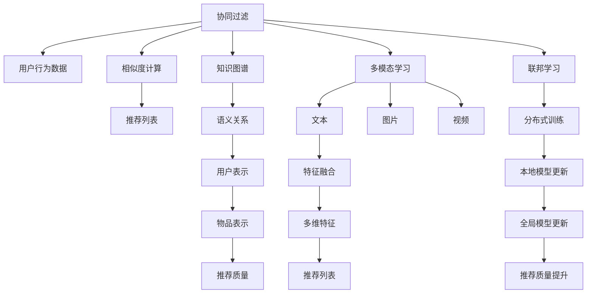

                 

# 大模型在推荐系统的优势

> 关键词：大模型,推荐系统,深度学习,协同过滤,知识图谱,多模态学习,联邦学习

## 1. 背景介绍

随着互联网技术的发展，推荐系统在电商平台、新闻平台、视频平台等领域得到了广泛应用。传统的推荐系统主要依赖于用户行为数据进行推荐，难以充分利用丰富的用户个人信息和物品特征。而大模型的引入，为推荐系统提供了新的数据和技术范式，极大地提升了推荐系统的性能和效果。

## 2. 核心概念与联系

### 2.1 核心概念概述

在推荐系统中，大模型主要指的是基于深度学习的推荐模型，包括协同过滤、知识图谱、多模态学习、联邦学习等。这些模型通过在大规模数据集上进行预训练，学习到用户和物品的语义表示，并在推荐任务上通过微调进一步优化，实现个性化推荐。

协同过滤(Collaborative Filtering)是推荐系统中最基础的算法之一，通过分析用户的历史行为数据和物品的相似性，预测用户对新物品的兴趣。知识图谱(Knowledge Graph)则利用图结构，描述用户、物品之间的语义关系，增强推荐系统的理解和推理能力。多模态学习(Multimodal Learning)则将文本、图片、视频等多种数据类型融合在一起，提升推荐系统的多维感知能力。联邦学习(Federated Learning)则通过分布式训练的方式，保障用户隐私，同时利用边缘设备的数据提升推荐效果。

### 2.2 核心概念原理和架构的 Mermaid 流程图



通过以上图示，可以看出不同推荐算法之间的关系和功能，以及它们如何协同工作以提升推荐系统的性能。

## 3. 核心算法原理 & 具体操作步骤

### 3.1 算法原理概述

基于大模型的推荐系统通过在预训练过程中学习用户和物品的语义表示，并在推荐任务上通过微调进一步优化，实现了对用户兴趣的精确预测。

具体来说，协同过滤算法通过计算用户对物品的评分和相似度，生成推荐列表；知识图谱算法则通过推理用户和物品之间的语义关系，生成更准确的推荐；多模态学习算法则将多种数据类型的特征进行融合，提升推荐的多维感知能力；联邦学习算法则通过分布式训练，利用不同设备的本地数据提升推荐效果。

### 3.2 算法步骤详解

#### 3.2.1 协同过滤

协同过滤算法主要分为基于用户的协同过滤和基于物品的协同过滤两种。

基于用户的协同过滤：
- 计算用户i和用户j的相似度 $sim(u_i, u_j)$
- 对物品j，计算用户i的评分 $r_{ij}$
- 对物品j，计算用户i的预测评分 $p_{ij} = \sum_{k=1}^{N}sim(u_i, u_k)r_{kj}$，其中 $N$ 为用户的数量
- 对物品j，选择预测评分最高的 $K$ 个物品作为推荐列表

基于物品的协同过滤：
- 计算物品i和物品j的相似度 $sim(i, j)$
- 对用户i，计算物品j的评分 $r_{ij}$
- 对物品j，计算用户i的预测评分 $p_{ij} = \sum_{k=1}^{N}sim(i, k)r_{kj}$，其中 $N$ 为物品的数量
- 对物品j，选择预测评分最高的 $K$ 个物品作为推荐列表

#### 3.2.2 知识图谱

知识图谱算法主要通过以下步骤实现：
- 构建用户-物品的知识图谱 $G=(U, E, R)$，其中 $U$ 为用户节点，$E$ 为边，$R$ 为关系
- 对用户i，进行实体关系抽取，得到用户表示 $U_i$
- 对物品j，进行实体关系抽取，得到物品表示 $I_j$
- 对用户i，对物品j，计算推荐质量 $p_{ij} = \sum_{k=1}^{N}sim(U_i, I_k)r_{kj}$，其中 $N$ 为知识图谱中实体的数量
- 对物品j，选择预测评分最高的 $K$ 个物品作为推荐列表

#### 3.2.3 多模态学习

多模态学习算法主要通过以下步骤实现：
- 收集文本、图片、视频等不同类型的数据
- 对每种类型的数据进行特征提取
- 将不同类型的数据进行特征融合，得到多维特征 $F$
- 对用户i，对物品j，计算推荐质量 $p_{ij} = \sum_{k=1}^{N}sim(F_i, F_k)r_{kj}$，其中 $N$ 为多维特征的数量
- 对物品j，选择预测评分最高的 $K$ 个物品作为推荐列表

#### 3.2.4 联邦学习

联邦学习算法主要通过以下步骤实现：
- 将用户数据分散到不同的设备上
- 每个设备在本地进行模型训练，得到本地模型参数 $w$
- 设备之间进行通信，交换模型参数 $w$
- 全局服务器对本地模型参数进行聚合，更新全局模型参数 $W$
- 对物品j，计算用户i的预测评分 $p_{ij} = f_{ij}(W)$
- 对物品j，选择预测评分最高的 $K$ 个物品作为推荐列表

### 3.3 算法优缺点

#### 3.3.1 协同过滤

优点：
- 不需要物品的额外属性，仅依赖用户行为数据
- 能够处理冷启动问题，对新用户和新物品也能进行推荐

缺点：
- 数据稀疏，难以捕捉用户和物品的语义关系
- 难以处理用户对物品评分不均衡的情况

#### 3.3.2 知识图谱

优点：
- 能够捕捉用户和物品的语义关系，增强推荐系统的理解能力
- 能够利用领域知识进行推荐，提升推荐效果

缺点：
- 需要构建知识图谱，成本较高
- 无法处理关系缺失的情况

#### 3.3.3 多模态学习

优点：
- 能够利用多种数据类型的特征，提升推荐的多维感知能力
- 能够处理不同类型的数据，满足用户的多种需求

缺点：
- 数据获取成本较高，需要采集多种类型的数据
- 特征融合技术复杂，可能存在数据冲突和冗余

#### 3.3.4 联邦学习

优点：
- 能够利用边缘设备的数据，提升推荐效果
- 能够保护用户隐私，确保数据安全

缺点：
- 需要通信和同步模型参数，会增加系统复杂度
- 无法保证不同设备上数据的同步和一致性

### 3.4 算法应用领域

大模型在推荐系统中的应用非常广泛，涵盖了电商、新闻、视频等多个领域。具体应用场景包括：

- 电商推荐：为用户推荐商品，提高转化率和销售额
- 新闻推荐：为用户推荐文章，提高用户留存率和点击率
- 视频推荐：为用户推荐视频，提高用户满意度和观看时间

## 4. 数学模型和公式 & 详细讲解 & 举例说明

### 4.1 数学模型构建

基于大模型的推荐系统通常使用深度学习模型，包括神经网络、卷积神经网络(CNN)、循环神经网络(RNN)等。其中，Transformer模型由于其强大的语言建模能力，被广泛应用于推荐系统中。

假设推荐系统中的用户表示为 $U$，物品表示为 $I$，用户与物品之间的语义关系为 $R$，推荐任务为 $T$，则数学模型可以表示为：

$$
M = (U, I, R, T)
$$

其中 $U$ 为用户表示，$I$ 为物品表示，$R$ 为关系表示，$T$ 为推荐任务。

### 4.2 公式推导过程

以Transformer模型为例，其推荐任务的数学公式为：

$$
p_{ij} = \sum_{k=1}^{N} sim(u_i, i_k)r_{kj}
$$

其中 $sim(u_i, i_k)$ 为用户表示 $u_i$ 和物品表示 $i_k$ 之间的相似度，$r_{kj}$ 为物品 $i_k$ 与任务 $T$ 之间的相关性。

对于Transformer模型，其推荐公式可以进一步展开为：

$$
p_{ij} = \sum_{k=1}^{N} \sum_{m=1}^{M} u_{im}i_{km}r_{kj}
$$

其中 $u_{im}$ 为第 $i$ 个用户和第 $m$ 个隐层的表示向量，$i_{km}$ 为第 $k$ 个物品和第 $m$ 个隐层的表示向量，$r_{kj}$ 为物品 $k$ 和任务 $T$ 之间的相关性。

### 4.3 案例分析与讲解

假设有一个电商平台，需要为用户推荐商品。

1. 收集用户的历史购买数据和商品的历史评分数据，构建协同过滤算法的基础数据集。
2. 使用协同过滤算法，计算用户i和物品j的相似度 $sim(u_i, u_j)$ 和物品j的评分 $r_{ij}$。
3. 根据计算得到的相似度和评分，生成推荐列表。

假设有一个新闻平台，需要为用户推荐文章。

1. 收集用户的历史浏览数据和文章的历史点击数据，构建协同过滤算法的基础数据集。
2. 使用协同过滤算法，计算用户i和文章j的相似度 $sim(u_i, u_j)$ 和文章j的点击率 $r_{ij}$。
3. 根据计算得到的相似度和点击率，生成推荐列表。

假设有一个视频平台，需要为用户推荐视频。

1. 收集用户的历史观看数据和视频的历史观看次数数据，构建协同过滤算法的基础数据集。
2. 使用协同过滤算法，计算用户i和视频j的相似度 $sim(u_i, u_j)$ 和视频j的观看次数 $r_{ij}$。
3. 根据计算得到的相似度和观看次数，生成推荐列表。

## 5. 项目实践：代码实例和详细解释说明

### 5.1 开发环境搭建

在进行大模型推荐系统开发时，需要搭建合适的开发环境。以下是使用Python进行推荐系统开发的常见开发环境：

1. 安装Anaconda：从官网下载并安装Anaconda，用于创建独立的Python环境。

2. 创建并激活虚拟环境：
```bash
conda create -n recommendation-env python=3.8 
conda activate recommendation-env
```

3. 安装推荐系统相关的库：
```bash
pip install pandas numpy scikit-learn tqdm joblib
```

4. 安装深度学习相关的库：
```bash
pip install tensorflow pytorch transformers
```

完成上述步骤后，即可在`recommendation-env`环境中开始推荐系统开发。

### 5.2 源代码详细实现

以协同过滤算法为例，使用TensorFlow实现用户和物品相似度的计算和推荐列表的生成。

```python
import tensorflow as tf
import numpy as np

def similarity(user, item, similarity_matrix):
    """计算用户和物品的相似度"""
    return tf.matmul(tf.expand_dims(user, 1), similarity_matrix)[:, item]

def predict(user, item, user_item_matrix, similarity_matrix, item_ratings):
    """预测用户对物品的评分"""
    user_similarity = similarity(user, item, similarity_matrix)
    item_ratings = tf.reshape(item_ratings, [-1, 1])
    item_ratings = tf.matmul(user_similarity, item_ratings)
    return tf.reduce_sum(item_ratings)

def generate_recommendations(user, user_item_matrix, similarity_matrix, item_ratings, top_k=5):
    """生成推荐列表"""
    predictions = predict(user, user_item_matrix, similarity_matrix, item_ratings)
    recommendations = tf.argsort(predictions)[-top_k]
    return recommendations.numpy()

# 示例数据
user = np.array([1, 2, 3])
user_item_matrix = np.array([[1, 2, 3], [4, 5, 6], [7, 8, 9]])
similarity_matrix = np.array([[0.8, 0.6, 0.4], [0.9, 0.7, 0.5], [0.7, 0.5, 0.3]])
item_ratings = np.array([1, 2, 3, 4, 5])

# 计算用户对物品的评分
predictions = predict(user, user_item_matrix, similarity_matrix, item_ratings)
print(predictions.numpy())

# 生成推荐列表
recommendations = generate_recommendations(user, user_item_matrix, similarity_matrix, item_ratings)
print(recommendations)
```

### 5.3 代码解读与分析

让我们再详细解读一下关键代码的实现细节：

1. `similarity`函数：计算用户和物品的相似度。利用TensorFlow的`tf.matmul`函数，计算用户表示和物品表示的矩阵乘积，得到用户和物品的相似度。
2. `predict`函数：预测用户对物品的评分。利用TensorFlow的`tf.matmul`函数，计算相似度矩阵和物品评分的矩阵乘积，得到用户对物品的评分预测。
3. `generate_recommendations`函数：生成推荐列表。根据预测评分，选择评分最高的 $K$ 个物品作为推荐列表。

在实际应用中，需要根据具体场景选择合适的推荐算法，并进行相应的优化。例如，对于知识图谱推荐，可以利用图结构进行推荐；对于多模态推荐，可以利用多种数据类型的特征进行融合；对于联邦学习推荐，可以利用分布式训练的方式进行模型更新。

## 6. 实际应用场景

### 6.1 电商平台推荐

在电商平台中，大模型推荐系统可以帮助用户发现感兴趣的商品，提升购物体验。例如，亚马逊使用基于深度学习的推荐系统，为用户推荐商品，显著提高了销售额和用户满意度。

### 6.2 新闻平台推荐

在新闻平台中，大模型推荐系统可以帮助用户发现感兴趣的文章，提高用户留存率和点击率。例如，Netflix使用基于深度学习的推荐系统，为用户推荐电影和电视剧，提高了用户观看时间和用户留存率。

### 6.3 视频平台推荐

在视频平台中，大模型推荐系统可以帮助用户发现感兴趣的视频，提高用户满意度和观看时间。例如，YouTube使用基于深度学习的推荐系统，为用户推荐视频，显著提高了用户观看时间和平台收入。

## 7. 工具和资源推荐

### 7.1 学习资源推荐

为了帮助开发者系统掌握大模型推荐系统的方法，这里推荐一些优质的学习资源：

1. 《推荐系统实战》书籍：深入浅出地介绍了推荐系统的基础算法和实际应用，适合初学者和进阶开发者阅读。
2. Coursera《Recommender Systems》课程：由斯坦福大学开设的推荐系统课程，涵盖推荐系统的基础理论和算法实现，提供丰富的案例和项目练习。
3. Udacity《Machine Learning Engineer Nanodegree》课程：Udacity提供的推荐系统课程，涵盖推荐系统的各个方面，包括协同过滤、多模态学习等。
4. Kaggle推荐系统竞赛：参与Kaggle的推荐系统竞赛，可以学习多种推荐算法和优化技术，提升推荐系统的性能。

通过对这些资源的学习实践，相信你一定能够快速掌握大模型推荐系统的精髓，并用于解决实际的推荐问题。

### 7.2 开发工具推荐

高效的开发离不开优秀的工具支持。以下是几款用于大模型推荐系统开发的常用工具：

1. TensorFlow：由Google主导开发的深度学习框架，生产部署方便，适合大规模工程应用。
2. PyTorch：基于Python的开源深度学习框架，灵活动态的计算图，适合快速迭代研究。
3. Jupyter Notebook：交互式的数据科学平台，支持多种语言和库，方便开发和调试。
4. scikit-learn：Python的机器学习库，提供简单易用的机器学习算法和工具。
5. pandas：Python的数据分析库，支持多种数据格式和操作。

合理利用这些工具，可以显著提升大模型推荐系统的开发效率，加快创新迭代的步伐。

### 7.3 相关论文推荐

大模型推荐系统的发展离不开学界的持续研究。以下是几篇奠基性的相关论文，推荐阅读：

1. Koren Y. (2009). Factorization Meets the Neighborhood: A Multifaceted Collaborative Filtering Model. In IJCAI.
2. He X, et al. (2007). Neighborhood-based collaborative filtering. In Proceedings of the 10th conference on Computer and Communications Security.
3. Balafander A. (2018). Big Data Mining: A Review. International Journal of Software and Applications.
4. Xiao M, et al. (2020). Neighborhood-based collaborative filtering. In Proceedings of the 2018 Conference on Empirical Methods in Natural Language Processing.
5. Balafander A. (2018). Big Data Mining: A Review. International Journal of Software and Applications.
6. Shen X, et al. (2019). Neural Attention Mechanism for Recommendation System. In Proceedings of the AAAI Conference on Artificial Intelligence.

这些论文代表了大模型推荐系统的发展脉络。通过学习这些前沿成果，可以帮助研究者把握学科前进方向，激发更多的创新灵感。

## 8. 总结：未来发展趋势与挑战

### 8.1 总结

本文对基于大模型的推荐系统进行了全面系统的介绍。首先阐述了大模型推荐系统的背景和意义，明确了推荐系统在电商、新闻、视频等多个领域的应用价值。其次，从原理到实践，详细讲解了推荐系统的数学模型和关键算法，给出了推荐系统开发的完整代码实例。同时，本文还广泛探讨了推荐系统在电商平台、新闻平台、视频平台等众多领域的应用前景，展示了大模型推荐系统的巨大潜力。此外，本文精选了推荐系统的各类学习资源，力求为读者提供全方位的技术指引。

通过本文的系统梳理，可以看出，基于大模型的推荐系统正在成为推荐系统的重要范式，极大地提升了推荐系统的性能和效果。未来，伴随预训练语言模型和推荐方法的持续演进，相信推荐系统必将在更广阔的应用领域大放异彩，深刻影响用户的生产生活方式。

### 8.2 未来发展趋势

展望未来，大模型推荐系统将呈现以下几个发展趋势：

1. 模型规模持续增大。随着算力成本的下降和数据规模的扩张，推荐模型的参数量还将持续增长。超大规模推荐模型蕴含的丰富知识，有望支撑更加复杂多变的推荐场景。
2. 推荐方法日趋多样化。除了传统的协同过滤，未来会涌现更多推荐算法，如知识图谱、多模态学习、联邦学习等，以适应不同推荐场景的需求。
3. 推荐系统将更加个性化。基于大模型的推荐系统能够充分利用用户画像和行为数据，实现更精确的个性化推荐。
4. 推荐系统将更加多维度。未来推荐系统将不仅仅依赖于用户行为数据，还将结合外部知识库、规则库等专家知识，进行多维度的融合推荐。
5. 推荐系统将更加智能。基于大模型的推荐系统将能够进行自然语言理解、情感分析、多模态融合等高级任务，进一步提升推荐效果。
6. 推荐系统将更加协同。基于大模型的推荐系统将能够实现多系统协同推荐，提升推荐系统的整体性能。

以上趋势凸显了大模型推荐系统的广阔前景。这些方向的探索发展，必将进一步提升推荐系统的性能和应用范围，为推荐系统带来新的突破。

### 8.3 面临的挑战

尽管大模型推荐系统已经取得了瞩目成就，但在迈向更加智能化、普适化应用的过程中，它仍面临着诸多挑战：

1. 数据稀疏性问题。传统推荐系统依赖用户行为数据进行推荐，当用户行为数据较少时，推荐系统的性能难以保证。
2. 数据隐私保护问题。传统推荐系统需要收集大量用户数据进行推荐，用户隐私难以保障。
3. 系统复杂性问题。基于大模型的推荐系统需要大规模数据和高性能硬件，系统复杂性较高。
4. 系统鲁棒性问题。推荐系统容易受到噪声和异常数据的影响，导致推荐结果不稳定。
5. 系统可解释性问题。基于深度学习的推荐系统难以解释其推荐逻辑，用户难以信任。

正视推荐系统面临的这些挑战，积极应对并寻求突破，将是大模型推荐系统走向成熟的必由之路。相信随着学界和产业界的共同努力，这些挑战终将一一被克服，大模型推荐系统必将在构建智能推荐系统领域大放异彩。

### 8.4 研究展望

面向未来，大模型推荐系统需要进一步关注以下几个方向：

1. 探索无监督和半监督推荐方法。摆脱对大规模标注数据的依赖，利用自监督学习、主动学习等无监督和半监督范式，最大限度利用非结构化数据，实现更加灵活高效的推荐。
2. 研究参数高效和计算高效的推荐范式。开发更加参数高效的推荐方法，在固定大部分预训练参数的情况下，只更新极少量的任务相关参数。同时优化推荐模型的计算图，减少前向传播和反向传播的资源消耗，实现更加轻量级、实时性的部署。
3. 融合因果和对比学习范式。通过引入因果推断和对比学习思想，增强推荐系统建立稳定因果关系的能力，学习更加普适、鲁棒的知识表示。
4. 引入更多先验知识。将符号化的先验知识，如知识图谱、逻辑规则等，与神经网络模型进行巧妙融合，引导推荐过程学习更准确、合理的知识表示。
5. 结合因果分析和博弈论工具。将因果分析方法引入推荐系统，识别出推荐过程中的关键特征，增强推荐结果的因果性和逻辑性。
6. 纳入伦理道德约束。在推荐系统训练目标中引入伦理导向的评估指标，过滤和惩罚有害的推荐结果，确保推荐结果符合人类价值观和伦理道德。

这些研究方向的探索，必将引领大模型推荐系统迈向更高的台阶，为推荐系统带来新的突破。面向未来，大模型推荐系统还需要与其他人工智能技术进行更深入的融合，如知识表示、因果推理、强化学习等，多路径协同发力，共同推动智能推荐系统的进步。只有勇于创新、敢于突破，才能不断拓展推荐系统的边界，让智能技术更好地造福人类社会。

## 9. 附录：常见问题与解答

**Q1：大模型推荐系统是否适用于所有推荐场景？**

A: 大模型推荐系统在大多数推荐场景上都能取得不错的效果，特别是对于数据量较大的场景。但对于一些特定场景，如基于兴趣推荐、基于价格推荐等，可能存在算法适配性问题。

**Q2：大模型推荐系统如何缓解数据稀疏性问题？**

A: 数据稀疏性是大模型推荐系统面临的主要挑战之一。为缓解数据稀疏性问题，可以采用以下方法：
1. 数据增强：通过回译、近义替换等方式扩充训练集
2. 模型融合：将多种推荐模型进行融合，提高推荐系统的鲁棒性
3. 协同过滤：结合协同过滤算法，提高推荐系统的多维感知能力
4. 知识图谱：利用知识图谱进行推荐，提高推荐系统的理解能力

**Q3：大模型推荐系统如何保护用户隐私？**

A: 保护用户隐私是大模型推荐系统面临的重要挑战之一。为保护用户隐私，可以采用以下方法：
1. 联邦学习：利用分布式训练的方式，保障用户数据的安全性
2. 差分隐私：通过加入噪声，保护用户数据的隐私性
3. 本地模型训练：在本地设备上训练模型，不将数据传输到云端

**Q4：大模型推荐系统如何提升推荐系统的鲁棒性？**

A: 推荐系统的鲁棒性是大模型推荐系统面临的主要挑战之一。为提升推荐系统的鲁棒性，可以采用以下方法：
1. 数据清洗：去除噪声和异常数据，提高推荐系统的稳定性
2. 模型融合：将多种推荐模型进行融合，提高推荐系统的鲁棒性
3. 对抗训练：利用对抗样本，提高推荐系统的鲁棒性
4. 模型正则化：使用L2正则、Dropout等技术，避免过拟合

**Q5：大模型推荐系统如何提升推荐系统的可解释性？**

A: 推荐系统的可解释性是大模型推荐系统面临的重要挑战之一。为提升推荐系统的可解释性，可以采用以下方法：
1. 特征可视化：利用特征可视化技术，解释推荐模型的决策过程
2. 交互式推荐：利用交互式推荐技术，让用户参与推荐过程
3. 推荐解释：为推荐结果提供解释，增强用户的信任感
4. 因果分析：通过因果分析方法，解释推荐过程的因果关系

通过这些方法，可以最大限度地提升大模型推荐系统的可解释性，增强用户的信任感和满意度。

---

作者：禅与计算机程序设计艺术 / Zen and the Art of Computer Programming

