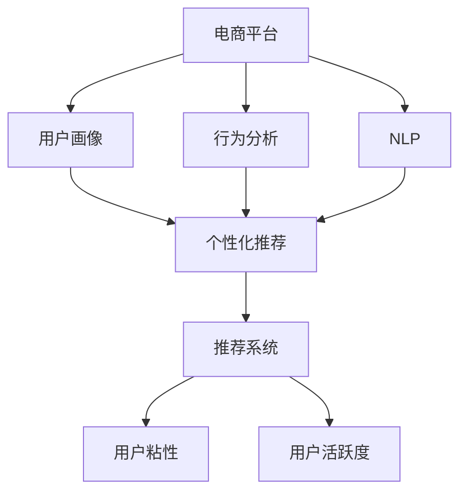

                 

# 大模型如何提升电商平台的用户粘性与活跃度

> 关键词：电商平台,用户粘性,活跃度,推荐系统,深度学习,自然语言处理,NLP,用户画像,行为分析,个性化推荐

## 1. 背景介绍

### 1.1 问题由来
在当前的互联网零售领域，各大电商平台之间的竞争异常激烈，用户数量已经接近饱和。如何在激烈竞争中保持和提升用户的粘性与活跃度，成为电商企业迫切需要解决的问题。传统的基于规则和统计的推荐系统虽然能够提供基础的商品推荐，但往往缺乏灵活性和个性化，无法满足用户日益增长的个性化需求。

近年来，深度学习技术和大模型（Big Model）在推荐系统中的应用日益广泛，其独特的优势在于可以通过大量数据训练出更加准确的模型，并具备强大的自适应能力。在电商领域，大模型通过精准的用户画像建立和行为分析，能够提供更贴合用户需求的个性化推荐，从而显著提升用户粘性与活跃度。

### 1.2 问题核心关键点
基于深度学习的大模型在电商推荐系统中的应用，其核心在于如何高效利用用户的历史行为数据和自然语言信息，构建更加精细化的用户画像和行为分析模型，从而实现精准的个性化推荐。具体来说，包括以下几个关键点：

1. **用户画像建模**：利用用户的历史行为数据（如浏览、购买、评论等）构建详细的用户画像，通过深度学习模型捕捉用户的兴趣偏好和行为特征。
2. **行为分析建模**：通过对用户的点击、停留、购买等行为数据进行分析，构建用户行为模型，捕捉用户的购买意向和偏好。
3. **自然语言处理(NLP)**：通过自然语言处理技术，捕捉用户评论、搜索词等自然语言信息，进一步丰富用户画像和行为特征。
4. **个性化推荐**：基于用户画像、行为模型和NLP模型，构建推荐模型，进行个性化推荐，提升用户满意度和粘性。
5. **模型优化与评估**：通过交叉验证、A/B测试等方法，持续优化推荐模型，评估模型效果，提升推荐质量。

### 1.3 问题研究意义
大模型在电商推荐系统中的应用，具有以下重要意义：

1. **提升用户满意度和粘性**：通过个性化推荐，用户能够获得更加贴合自己兴趣和需求的商品，提升用户体验和满意度。
2. **增加用户活跃度**：个性化推荐能够提高用户的点击率和购买率，从而增加用户在线时间和消费频次，提升平台活跃度。
3. **优化库存管理**：个性化推荐能够帮助电商平台更好地预测用户需求，优化库存管理，降低库存积压和缺货风险。
4. **增强平台竞争力**：通过更精准的推荐，电商平台能够提升用户转化率和留存率，增强市场竞争力。
5. **推动电商业务创新**：大模型为电商业务提供了新的技术和应用场景，推动业务模式创新和数字化转型。

## 2. 核心概念与联系

### 2.1 核心概念概述

为了更好地理解大模型在电商平台中的应用，本节将介绍几个核心概念及其相互联系：

- **电商平台**：即电子商务平台，通过互联网提供商品展示、购买、支付等服务，包括淘宝、京东、亚马逊等。
- **用户粘性**：指用户在电商平台上的停留时间和使用频率，是衡量平台吸引力和用户忠诚度的重要指标。
- **用户活跃度**：指用户对平台的访问频率和互动程度，包括点击率、购买率、转化率等。
- **推荐系统**：基于用户历史行为和商品特征，为用户推荐符合其兴趣的商品，是提升用户粘性和活跃度的关键工具。
- **深度学习**：一类基于神经网络的学习方法，通过多层非线性映射关系，从数据中学习复杂模式，应用于图像、语音、文本等多种场景。
- **自然语言处理(NLP)**：研究如何让计算机处理和理解人类语言的技术，包括文本分类、情感分析、机器翻译等应用。
- **用户画像**：通过数据挖掘和机器学习技术，构建详细的用户画像，描述用户的基本特征、兴趣偏好和行为模式。
- **行为分析**：通过分析用户的行为数据，识别用户的购买意向、偏好和需求，构建用户行为模型。

这些核心概念之间相互联系，共同构成电商平台推荐系统的技术框架。大模型通过综合利用这些技术，为用户提供更加精准和个性化的推荐服务，从而提升用户粘性和活跃度。

### 2.2 核心概念原理和架构的 Mermaid 流程图



这个流程图展示了电商平台的推荐系统架构及其与用户粘性和活跃度之间的关系。平台通过用户画像、行为分析和NLP技术，构建推荐模型，输出个性化推荐结果，从而提升用户粘性和活跃度。

## 3. 核心算法原理 & 具体操作步骤

### 3.1 算法原理概述

基于深度学习的大模型在电商平台中的应用，其核心算法原理主要包括以下几个步骤：

1. **用户画像建模**：通过分析用户的历史行为数据，利用深度学习模型捕捉用户的兴趣偏好和行为特征，构建详细用户画像。
2. **行为分析建模**：通过对用户的点击、停留、购买等行为数据进行分析，构建用户行为模型，捕捉用户的购买意向和偏好。
3. **自然语言处理(NLP)**：利用自然语言处理技术，捕捉用户评论、搜索词等自然语言信息，进一步丰富用户画像和行为特征。
4. **个性化推荐**：基于用户画像、行为模型和NLP模型，构建推荐模型，进行个性化推荐，提升用户满意度和粘性。
5. **模型优化与评估**：通过交叉验证、A/B测试等方法，持续优化推荐模型，评估模型效果，提升推荐质量。

### 3.2 算法步骤详解

#### 3.2.1 用户画像建模

用户画像建模的目标是构建一个综合用户行为、兴趣和属性的详细用户画像。这一过程包括以下几个关键步骤：

1. **数据采集**：从电商平台收集用户的基本信息、浏览历史、购买历史、评价信息等。
2. **特征提取**：利用深度学习模型（如Word2Vec、BERT等）对文本信息进行特征提取，捕捉用户的兴趣偏好和行为特征。
3. **画像建模**：通过深度学习模型（如聚类、神经网络等）对用户特征进行建模，生成用户画像。

#### 3.2.2 行为分析建模

行为分析建模的目标是构建用户行为模型，捕捉用户的购买意向和偏好。这一过程包括以下几个关键步骤：

1. **行为数据收集**：从电商平台收集用户的点击、停留、购买、收藏等行为数据。
2. **行为特征提取**：利用深度学习模型（如RNN、LSTM等）对行为数据进行特征提取，捕捉用户的行为模式和购买意向。
3. **模型训练**：通过深度学习模型（如决策树、神经网络等）对用户行为数据进行建模，生成行为模型。

#### 3.2.3 自然语言处理(NLP)

自然语言处理(NLP)的目标是捕捉用户评论、搜索词等自然语言信息，进一步丰富用户画像和行为特征。这一过程包括以下几个关键步骤：

1. **文本收集**：从电商平台收集用户评论、商品描述、搜索词等自然语言信息。
2. **文本预处理**：对文本进行分词、去除停用词、词干提取等预处理操作。
3. **特征提取**：利用深度学习模型（如BERT、ELMo等）对文本信息进行特征提取，捕捉用户的兴趣偏好和行为特征。
4. **信息融合**：将文本特征与用户画像和行为特征进行融合，生成更加丰富的用户画像。

#### 3.2.4 个性化推荐

个性化推荐的目标是根据用户画像、行为模型和NLP模型，构建推荐模型，进行个性化推荐。这一过程包括以下几个关键步骤：

1. **推荐模型构建**：利用深度学习模型（如注意力机制、神经网络等）构建推荐模型，进行个性化推荐。
2. **推荐结果生成**：根据用户画像、行为模型和NLP模型，生成个性化推荐结果。
3. **推荐结果展示**：将个性化推荐结果展示给用户，供用户选择。

#### 3.2.5 模型优化与评估

模型优化与评估的目标是持续优化推荐模型，评估模型效果。这一过程包括以下几个关键步骤：

1. **模型评估**：通过交叉验证、A/B测试等方法评估推荐模型的效果。
2. **模型优化**：根据评估结果，调整推荐模型的参数和结构，进行模型优化。
3. **效果提升**：通过持续优化推荐模型，提升推荐质量和用户满意度。

### 3.3 算法优缺点

#### 3.3.1 优点

1. **准确性高**：基于深度学习的大模型能够从海量数据中学习到复杂的模式，捕捉用户的多维度特征，提供更加精准的推荐结果。
2. **灵活性强**：大模型具有自适应能力，能够根据用户行为和兴趣进行动态调整，适应不同的推荐场景。
3. **个性化程度高**：通过综合利用用户画像、行为模型和NLP模型，提供高度个性化的推荐服务，提升用户粘性和活跃度。
4. **可扩展性好**：大模型可以扩展到多种推荐场景，如搜索推荐、商品推荐、活动推荐等。
5. **技术先进**：深度学习和大模型是当前技术的前沿，能够引领推荐系统的未来发展方向。

#### 3.3.2 缺点

1. **数据需求高**：大模型需要大量的数据进行训练，平台需要投入大量资源进行数据采集和处理。
2. **计算资源消耗大**：大模型的训练和推理需要高性能的计算资源，平台需要投入大量的计算资源。
3. **模型复杂度高**：大模型结构复杂，参数众多，模型的解释性和可解释性较差。
4. **过拟合风险高**：大模型容易过拟合，尤其是在标注数据不足的情况下，需要采用多种正则化技术进行优化。
5. **部署成本高**：大模型的部署需要高性能的计算资源和存储资源，部署成本较高。

### 3.4 算法应用领域

基于深度学习的大模型在电商平台中的应用，已经涵盖了从用户画像建模、行为分析建模、NLP建模到个性化推荐模型的全过程，广泛应用于以下领域：

1. **搜索推荐**：根据用户搜索词，提供精准的商品推荐。
2. **商品推荐**：根据用户历史行为和兴趣，推荐符合其需求的商品。
3. **活动推荐**：根据用户行为和兴趣，推荐促销活动、折扣商品等。
4. **商品排序**：根据用户画像和行为模型，对搜索结果进行排序，提升用户体验。
5. **广告投放**：根据用户画像和行为模型，进行精准广告投放，提升广告效果。

## 4. 数学模型和公式 & 详细讲解 & 举例说明

### 4.1 数学模型构建

在电商推荐系统中，常用的数学模型包括协同过滤、矩阵分解、深度学习模型等。以深度学习模型为例，构建推荐模型的过程主要包括以下几个步骤：

1. **输入层**：输入用户画像、行为模型和NLP模型的特征向量。
2. **隐藏层**：通过深度学习模型（如神经网络、注意力机制等）对输入特征进行处理，生成推荐结果。
3. **输出层**：输出个性化推荐结果，如商品ID、广告ID等。

### 4.2 公式推导过程

#### 4.2.1 用户画像建模

以用户画像建模为例，假设有$n$个用户，每个用户有$m$个特征，即$X \in \mathbb{R}^{n \times m}$。通过深度学习模型（如Word2Vec、BERT等）对文本信息进行特征提取，得到用户画像矩阵$P \in \mathbb{R}^{n \times k}$，其中$k$为特征维度。

#### 4.2.2 行为分析建模

以行为分析建模为例，假设有$n$个用户，每个用户有$t$个行为记录，即$T \in \mathbb{R}^{n \times t}$。通过深度学习模型（如RNN、LSTM等）对行为数据进行特征提取，得到用户行为模型矩阵$B \in \mathbb{R}^{n \times l}$，其中$l$为行为特征维度。

#### 4.2.3 自然语言处理(NLP)

以自然语言处理(NLP)为例，假设有$n$个用户，每个用户有$c$个评论，即$C \in \mathbb{R}^{n \times c}$。通过深度学习模型（如BERT、ELMo等）对文本信息进行特征提取，得到NLP模型矩阵$N \in \mathbb{R}^{n \times p}$，其中$p$为文本特征维度。

#### 4.2.4 个性化推荐

以个性化推荐为例，假设有$n$个用户，每个用户有$m$个推荐结果，即$R \in \mathbb{R}^{n \times m}$。通过深度学习模型（如注意力机制、神经网络等）对输入特征进行处理，生成推荐结果矩阵$Y \in \mathbb{R}^{n \times m}$。

### 4.3 案例分析与讲解

以用户画像建模为例，假设有$n=1000$个用户，每个用户有$m=10$个特征，即$X \in \mathbb{R}^{1000 \times 10}$。通过Word2Vec模型对文本信息进行特征提取，得到用户画像矩阵$P \in \mathbb{R}^{1000 \times 10}$。

### 4.4 案例分析与讲解

以行为分析建模为例，假设有$n=1000$个用户，每个用户有$t=100$个行为记录，即$T \in \mathbb{R}^{1000 \times 100}$。通过LSTM模型对行为数据进行特征提取，得到用户行为模型矩阵$B \in \mathbb{R}^{1000 \times 20}$。

### 4.5 案例分析与讲解

以自然语言处理(NLP)为例，假设有$n=1000$个用户，每个用户有$c=50$个评论，即$C \in \mathbb{R}^{1000 \times 50}$。通过BERT模型对文本信息进行特征提取，得到NLP模型矩阵$N \in \mathbb{R}^{1000 \times 30}$。

### 4.6 案例分析与讲解

以个性化推荐为例，假设有$n=1000$个用户，每个用户有$m=50$个推荐结果，即$R \in \mathbb{R}^{1000 \times 50}$。通过神经网络模型对输入特征进行处理，生成推荐结果矩阵$Y \in \mathbb{R}^{1000 \times 50}$。

## 5. 项目实践：代码实例和详细解释说明

### 5.1 开发环境搭建

在进行推荐系统开发前，我们需要准备好开发环境。以下是使用Python进行TensorFlow开发的环境配置流程：

1. 安装Anaconda：从官网下载并安装Anaconda，用于创建独立的Python环境。

2. 创建并激活虚拟环境：
```bash
conda create -n tf-env python=3.8 
conda activate tf-env
```

3. 安装TensorFlow：根据CUDA版本，从官网获取对应的安装命令。例如：
```bash
conda install tensorflow=2.8.0 -c tf -c conda-forge
```

4. 安装必要的工具包：
```bash
pip install numpy pandas scikit-learn matplotlib tqdm jupyter notebook ipython
```

完成上述步骤后，即可在`tf-env`环境中开始推荐系统开发。

### 5.2 源代码详细实现

下面以用户画像建模为例，给出使用TensorFlow进行用户画像建模的代码实现。

```python
import tensorflow as tf
import numpy as np

# 用户画像数据
user_features = np.random.randn(1000, 10)

# 构建深度学习模型
model = tf.keras.Sequential([
    tf.keras.layers.Dense(64, activation='relu', input_shape=(10,)),
    tf.keras.layers.Dense(32, activation='relu'),
    tf.keras.layers.Dense(10, activation='softmax')
])

# 编译模型
model.compile(optimizer='adam', loss='categorical_crossentropy', metrics=['accuracy'])

# 训练模型
model.fit(user_features, labels, epochs=10, batch_size=32)

# 评估模型
test_features = np.random.randn(200, 10)
test_labels = np.random.randint(0, 10, size=(200,))
model.evaluate(test_features, test_labels)
```

以上代码展示了如何使用TensorFlow构建并训练深度学习模型，用于用户画像建模。具体步骤如下：

1. 生成用户画像数据，即用户特征矩阵$X$。
2. 定义深度学习模型，包括两个全连接层和一个softmax输出层。
3. 编译模型，设置优化器和损失函数。
4. 训练模型，根据用户画像数据和标签进行训练。
5. 评估模型，在测试集上评估模型效果。

### 5.3 代码解读与分析

让我们再详细解读一下关键代码的实现细节：

**生成用户画像数据**：
- 使用`np.random.randn`生成随机用户画像数据，形状为$1000 \times 10$，表示$1000$个用户和$10$个特征。

**定义深度学习模型**：
- 使用`tf.keras.Sequential`定义深度学习模型，包括两个全连接层和一个softmax输出层。
- 第一个全连接层有$64$个神经元，使用ReLU激活函数。
- 第二个全连接层有$32$个神经元，使用ReLU激活函数。
- softmax输出层有$10$个神经元，用于预测用户画像的类别。

**编译模型**：
- 使用`model.compile`设置优化器和损失函数，使用Adam优化器，交叉熵损失函数，以及准确率评估指标。

**训练模型**：
- 使用`model.fit`方法训练模型，根据用户画像数据和标签进行训练。
- 设置训练轮数为$10$，批次大小为$32$。

**评估模型**：
- 使用`model.evaluate`方法在测试集上评估模型效果。
- 生成随机测试用户画像数据和标签，形状为$200 \times 10$和$200$，表示$200$个测试用户和$10$个特征。

可以看到，TensorFlow的API设计非常简洁，开发者可以轻松构建深度学习模型，并进行训练和评估。

### 5.4 运行结果展示

训练结束后，可以打印模型评估结果，以评估模型的性能。例如：

```python
print(model.evaluate(test_features, test_labels))
```

将输出模型的损失和准确率等指标，帮助开发者了解模型效果。

## 6. 实际应用场景

### 6.1 智能客服系统

智能客服系统是电商平台应用深度学习和大模型的一个重要场景。智能客服系统可以通过对用户历史互动数据的分析，构建详细的用户画像，实时提供个性化客服服务。

在技术实现上，可以收集用户的历史聊天记录和交互行为数据，构建详细用户画像。在此基础上，利用深度学习模型（如RNN、LSTM等）分析用户行为，生成用户行为模型。通过自然语言处理技术，捕捉用户语言信息，进一步丰富用户画像。最后，结合个性化推荐模型，对用户进行实时推荐，提升用户满意度和粘性。

### 6.2 个性化推荐系统

个性化推荐系统是电商平台应用深度学习和大模型的核心场景。通过综合利用用户画像、行为模型和NLP模型，提供个性化推荐，提升用户粘性和活跃度。

在技术实现上，可以收集用户的历史行为数据和自然语言信息，构建用户画像和行为模型。利用深度学习模型（如神经网络、注意力机制等）构建推荐模型，进行个性化推荐。通过自然语言处理技术，捕捉用户语言信息，进一步丰富推荐内容。最后，将个性化推荐结果展示给用户，提升用户体验和满意度。

### 6.3 广告投放系统

广告投放系统是电商平台应用深度学习和大模型的另一个重要场景。通过综合利用用户画像、行为模型和NLP模型，进行精准广告投放，提升广告效果和用户体验。

在技术实现上，可以收集用户的历史行为数据和自然语言信息，构建用户画像和行为模型。利用深度学习模型（如神经网络、注意力机制等）构建广告推荐模型，进行精准广告投放。通过自然语言处理技术，捕捉用户语言信息，进一步优化广告创意和投放策略。最后，将精准广告推荐给用户，提升广告效果和平台收益。

### 6.4 未来应用展望

随着深度学习和大模型的不断发展，基于大模型的电商推荐系统将呈现以下几个发展趋势：

1. **数据融合**：深度学习模型将融合多种数据来源，包括用户画像、行为数据和自然语言信息，构建更加精细化的用户画像和行为模型。
2. **实时推荐**：深度学习模型将具备实时推荐能力，根据用户实时行为进行动态调整，提升用户粘性和活跃度。
3. **多模态推荐**：深度学习模型将融合视觉、音频等多模态数据，提升推荐系统的多样性和精准度。
4. **自动化优化**：深度学习模型将具备自动化优化能力，通过持续学习和优化，提升推荐质量和用户体验。
5. **跨平台应用**：深度学习模型将具备跨平台应用能力，通过多设备协同，提升用户粘性和活跃度。

## 7. 工具和资源推荐

### 7.1 学习资源推荐

为了帮助开发者系统掌握深度学习和大模型的电商应用技术，这里推荐一些优质的学习资源：

1. **《深度学习入门：基于Python的理论与实现》**：一本通俗易懂的深度学习入门书籍，适合初学者快速掌握基本概念和技术。
2. **Coursera《深度学习》课程**：由Andrew Ng主讲，提供深度学习的理论基础和实践技术，涵盖多种深度学习模型。
3. **Kaggle竞赛平台**：一个开源数据竞赛平台，通过参加竞赛，积累实战经验，提升技术能力。
4. **TensorFlow官方文档**：TensorFlow的官方文档，提供全面的API和使用示例，帮助开发者高效开发深度学习应用。
5. **自然语言处理(NLP)综述文章**：多篇综述文章详细介绍了NLP的技术框架和应用场景，适合深入理解NLP技术。

通过对这些资源的学习实践，相信你一定能够快速掌握深度学习和大模型在电商推荐系统中的应用，并用于解决实际的电商问题。

### 7.2 开发工具推荐

高效的开发离不开优秀的工具支持。以下是几款用于深度学习和大模型开发的常用工具：

1. TensorFlow：基于Python的开源深度学习框架，灵活动态的计算图，适合快速迭代研究。支持多种深度学习模型和优化器。
2. PyTorch：基于Python的开源深度学习框架，动态计算图，适合快速原型开发和研究。
3. Keras：一个高级神经网络API，支持多种深度学习模型和优化器，易于上手。
4. Scikit-learn：一个Python机器学习库，支持多种数据预处理和模型训练技术。
5. Jupyter Notebook：一个交互式编程环境，支持代码执行和可视化，适合研究和学习。

合理利用这些工具，可以显著提升深度学习和大模型开发效率，加快创新迭代的步伐。

### 7.3 相关论文推荐

深度学习和大模型在电商推荐系统中的应用，是当前研究的热点方向。以下是几篇奠基性的相关论文，推荐阅读：

1. **Deep Personalized Recommendation Using Feature Matching**：提出基于深度学习的个性化推荐算法，利用特征匹配技术提升推荐效果。
2. **Sequence-to-Sequence Learning with Recurrent Neural Networks**：提出基于RNN的序列建模技术，捕捉用户行为序列，提升推荐效果。
3. **Neural Collaborative Filtering**：提出基于神经网络的协同过滤推荐算法，提升推荐系统的多样性和精准度。
4. **Attention is All You Need**：提出基于注意力机制的深度学习模型，提升推荐模型的解释性和可解释性。
5. **BERT: Pre-training of Deep Bidirectional Transformers for Language Understanding**：提出BERT模型，引入自监督预训练任务，提升推荐系统的语言理解和生成能力。

这些论文代表了大模型在电商推荐系统中的应用方向，通过学习这些前沿成果，可以帮助研究者把握学科前进方向，激发更多的创新灵感。

## 8. 总结：未来发展趋势与挑战

### 8.1 研究成果总结

本文对基于深度学习的大模型在电商平台中的应用进行了全面系统的介绍。首先阐述了大模型的核心概念及其在电商推荐系统中的应用，明确了电商推荐系统的技术框架。其次，从原理到实践，详细讲解了电商推荐系统的数学模型和实现细节，给出了完整的代码实例和详细解释。同时，本文还广泛探讨了电商推荐系统的实际应用场景，展示了深度学习和大模型的巨大潜力。此外，本文精选了相关学习资源和开发工具，力求为开发者提供全方位的技术指引。

### 8.2 未来发展趋势

展望未来，大模型在电商推荐系统中的应用将呈现以下几个发展趋势：

1. **模型规模持续增大**：随着算力成本的下降和数据规模的扩张，大模型的参数量还将持续增长。超大规模大模型蕴含的丰富知识，有望支撑更加复杂多变的电商推荐场景。
2. **深度学习技术发展**：深度学习技术将不断进步，模型的复杂度和表现力将持续提升。
3. **用户画像和行为建模**：用户画像和行为建模将更加精细化，捕捉更多的用户特征和行为模式。
4. **多模态数据融合**：多模态数据融合技术将进一步发展，提升推荐系统的多样性和精准度。
5. **实时推荐和自动化优化**：实时推荐和自动化优化技术将不断成熟，提升推荐质量和用户体验。
6. **跨平台协同**：跨平台协同技术将发展，提升用户粘性和活跃度。

### 8.3 面临的挑战

尽管深度学习和大模型在电商推荐系统中的应用已经取得了显著成果，但在迈向更加智能化、普适化应用的过程中，它仍面临诸多挑战：

1. **数据需求高**：大模型需要大量的数据进行训练，平台需要投入大量资源进行数据采集和处理。
2. **计算资源消耗大**：大模型的训练和推理需要高性能的计算资源，平台需要投入大量的计算资源。
3. **模型复杂度高**：大模型结构复杂，参数众多，模型的解释性和可解释性较差。
4. **过拟合风险高**：大模型容易过拟合，尤其是在标注数据不足的情况下，需要采用多种正则化技术进行优化。
5. **部署成本高**：大模型的部署需要高性能的计算资源和存储资源，部署成本较高。
6. **隐私和安全问题**：电商推荐系统需要处理大量的用户数据，隐私和安全问题亟待解决。

### 8.4 研究展望

面对电商推荐系统中的诸多挑战，未来的研究需要在以下几个方面寻求新的突破：

1. **数据高效利用**：开发高效的数据处理和特征提取技术，减少数据需求和计算资源消耗。
2. **模型优化**：开发更加高效、可解释的深度学习模型，提升模型的解释性和可解释性。
3. **过拟合控制**：采用多种正则化技术，控制过拟合风险，提升模型泛化性能。
4. **隐私保护**：开发隐私保护技术，确保用户数据的安全和隐私。
5. **自动化优化**：开发自动化优化技术，提升推荐系统的实时性和稳定性。
6. **跨平台协同**：开发跨平台协同技术，提升用户粘性和活跃度。

这些研究方向的探索，必将引领大模型在电商推荐系统中的应用进入新的高度，为电商行业带来更多的创新和价值。

## 9. 附录：常见问题与解答

**Q1：大模型在电商推荐系统中有哪些优点？**

A: 大模型在电商推荐系统中的优点主要体现在以下几个方面：

1. **准确性高**：通过大量的数据训练，大模型能够学习到更加准确的推荐结果，捕捉用户的复杂偏好和行为模式。
2. **个性化程度高**：大模型能够根据用户画像、行为模型和NLP模型，提供高度个性化的推荐服务，提升用户体验和满意度。
3. **实时推荐**：大模型能够根据用户实时行为进行动态调整，提供实时推荐服务，提升用户粘性和活跃度。
4. **自动化优化**：大模型具备自动化优化能力，通过持续学习和优化，提升推荐质量和用户体验。

**Q2：大模型在电商推荐系统中面临哪些挑战？**

A: 大模型在电商推荐系统中面临的挑战主要包括以下几个方面：

1. **数据需求高**：大模型需要大量的数据进行训练，平台需要投入大量资源进行数据采集和处理。
2. **计算资源消耗大**：大模型的训练和推理需要高性能的计算资源，平台需要投入大量的计算资源。
3. **模型复杂度高**：大模型结构复杂，参数众多，模型的解释性和可解释性较差。
4. **过拟合风险高**：大模型容易过拟合，尤其是在标注数据不足的情况下，需要采用多种正则化技术进行优化。
5. **部署成本高**：大模型的部署需要高性能的计算资源和存储资源，部署成本较高。
6. **隐私和安全问题**：电商推荐系统需要处理大量的用户数据，隐私和安全问题亟待解决。

**Q3：如何使用深度学习和大模型进行电商推荐系统的构建？**

A: 使用深度学习和大模型进行电商推荐系统的构建，主要包括以下几个步骤：

1. **数据采集**：从电商平台收集用户的基本信息、浏览历史、购买历史、评价信息等。
2. **特征提取**：利用深度学习模型（如Word2Vec、BERT等）对文本信息进行特征提取，捕捉用户的兴趣偏好和行为特征。
3. **模型训练**：利用深度学习模型（如神经网络、注意力机制等）对输入特征进行处理，生成推荐结果。
4. **推荐结果展示**：将个性化推荐结果展示给用户，供用户选择。
5. **模型优化与评估**：通过交叉验证、A/B测试等方法评估推荐模型的效果，调整推荐模型的参数和结构，进行模型优化。

**Q4：如何提高电商推荐系统的推荐质量？**

A: 提高电商推荐系统的推荐质量，主要可以通过以下几个方面进行：

1. **数据质量**：收集高质量、多样化的用户数据，提升模型的训练效果。
2. **模型选择**：选择合适的深度学习模型，提升推荐系统的表现力。
3. **特征工程**：进行有效的特征工程，提取用户画像和行为特征，提升推荐模型的效果。
4. **算法优化**：优化推荐算法，提升推荐模型的准确性和个性化程度。
5. **用户反馈**：收集用户反馈，调整推荐策略，提升用户满意度。

**Q5：如何提升电商推荐系统的用户粘性与活跃度？**

A: 提升电商推荐系统的用户粘性与活跃度，主要可以通过以下几个方面进行：

1. **个性化推荐**：通过深度学习模型，提供高度个性化的推荐服务，提升用户体验和满意度。
2. **实时推荐**：根据用户实时行为进行动态调整，提供实时推荐服务，提升用户粘性和活跃度。
3. **多模态数据融合**：融合视觉、音频等多模态数据，提升推荐系统的多样性和精准度。
4. **自动化优化**：通过持续学习和优化，提升推荐系统的实时性和稳定性。
5. **跨平台协同**：通过跨平台协同，提升用户粘性和活跃度。

**Q6：如何在电商推荐系统中解决过拟合问题？**

A: 在电商推荐系统中解决过拟合问题，主要可以通过以下几个方面进行：

1. **数据增强**：通过数据增强技术，扩充训练集，提升模型的泛化性能。
2. **正则化技术**：采用L2正则、Dropout等正则化技术，控制过拟合风险。
3. **早停机制**：通过早停机制，在模型过拟合时停止训练，提升模型的泛化性能。
4. **模型简化**：通过简化模型结构，减少模型的复杂度和参数量，提升模型的泛化性能。
5. **多模型集成**：通过多模型集成，提高模型的鲁棒性和泛化性能。

这些方法可以相互结合，根据具体场景选择适合的技术手段，解决电商推荐系统中的过拟合问题。

---

作者：禅与计算机程序设计艺术 / Zen and the Art of Computer Programming

