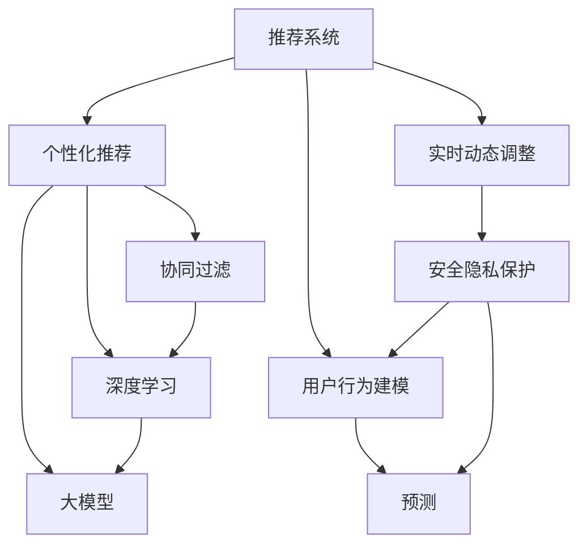

                 

# 大模型对推荐系统用户体验的提升策略

> 关键词：推荐系统, 用户体验, 大模型, 个性化推荐, 协同过滤, 深度学习, 混合模型, 效果评估, 安全隐私

## 1. 背景介绍

### 1.1 问题由来

随着互联网的普及和信息技术的迅猛发展，推荐系统已成为各大互联网公司核心竞争力的重要组成部分。从早期的协同过滤、内容推荐到基于深度学习的个性化推荐，推荐技术正在不断演进和优化，以满足用户日益增长的个性化需求。然而，传统的推荐系统面临着数据稀疏性、冷启动问题、推荐效果单一等挑战，导致用户体验不佳。为了提升推荐系统的智能化和个性化水平，越来越多的研究者和公司开始探索使用大模型进行推荐系统优化。

大模型，特别是预训练的深度神经网络模型，通过在海量数据上进行训练，能够学习到丰富的特征表示，具备强大的特征表达和迁移学习能力。将大模型引入推荐系统，不仅能够处理更多的数据维度，还能够在跨领域、跨平台间进行知识迁移和融合，从而提升推荐系统的效果和用户体验。

### 1.2 问题核心关键点

大模型对推荐系统用户体验的提升策略，主要聚焦于以下几个关键点：

- **数据特征提取与增强**：如何利用大模型提取更丰富的特征，同时提升特征表示的多样性和泛化能力。
- **用户行为建模与预测**：如何通过大模型学习用户行为规律，构建更准确的用户画像，并进行精准预测。
- **推荐策略优化**：如何在大模型的基础上优化推荐算法，提升推荐效果，并满足不同用户的需求。
- **安全隐私保护**：如何在保证用户体验的前提下，增强推荐系统的隐私保护和安全防护能力。
- **实时动态调整**：如何实现推荐系统的实时动态调整，根据用户反馈和市场变化不断优化推荐策略。

## 2. 核心概念与联系

### 2.1 核心概念概述

- **推荐系统(Recommendation System)**：通过分析用户行为、物品属性、社会关系等数据，为用户推荐感兴趣或可能喜欢的物品的系统。推荐系统广泛应用于电商、视频、音乐、新闻等领域。
- **个性化推荐(Personalized Recommendation)**：通过分析用户个性化需求和行为特征，为用户推荐更符合其偏好的物品。个性化推荐是推荐系统的核心目标。
- **协同过滤(Collaborative Filtering)**：通过分析用户行为和物品特征的相似度，推荐与用户过去喜欢的物品相似的新物品。协同过滤包括基于用户的协同过滤和基于物品的协同过滤两种方法。
- **深度学习(Deep Learning)**：通过多层神经网络结构进行特征提取和模式识别，构建更复杂的推荐模型。深度学习在推荐系统中主要用于用户行为建模和物品表示学习。
- **大模型(Large Model)**：指在大量数据上进行预训练的深度神经网络模型，具备强大的特征表达能力和泛化能力。
- **混合模型(Mixed Model)**：结合多种推荐算法和模型，构建更稳定、高效的推荐系统。

这些概念之间的关系可以用以下Mermaid流程图来表示：



这个流程图展示了推荐系统的核心概念及其之间的关系：

1. 推荐系统通过分析用户行为和物品特征，为用户推荐物品。
2. 个性化推荐旨在提升推荐的精准度，更加贴合用户需求。
3. 协同过滤和深度学习是主要的推荐算法，其中深度学习能够处理更复杂的特征。
4. 大模型通过预训练学习到通用的特征表示，可以提升推荐系统的效果。
5. 用户行为建模和预测是推荐系统的关键环节，用于构建用户画像。
6. 实时动态调整和隐私保护是推荐系统的重要特性，用于提升用户体验和信任感。

## 3. 核心算法原理 & 具体操作步骤
### 3.1 算法原理概述

基于大模型的推荐系统，通过在大规模数据集上进行预训练，学习到通用的用户行为特征和物品特征表示。然后，通过微调或迁移学习的方式，将这些特征表示应用到具体的推荐任务中，构建个性化推荐模型。

具体步骤如下：

1. **数据准备**：收集用户行为数据和物品特征数据，进行数据清洗和预处理。
2. **模型预训练**：使用大模型在原始数据集上进行预训练，学习通用的特征表示。
3. **模型微调或迁移学习**：根据推荐任务的要求，在大模型的基础上进行微调或迁移学习，提升推荐效果。
4. **用户行为建模**：通过微调后的模型，对用户的行为数据进行建模，构建用户画像。
5. **推荐策略优化**：结合用户画像和物品特征，设计推荐策略，进行物品推荐。
6. **效果评估**：对推荐结果进行效果评估，优化推荐策略。

### 3.2 算法步骤详解

**Step 1: 数据准备**
- 收集用户行为数据，如点击、浏览、购买等行为。
- 收集物品特征数据，如商品描述、类别、价格等。
- 对数据进行清洗和预处理，去除噪声和异常值。

**Step 2: 模型预训练**
- 选择合适的预训练模型，如BERT、GPT等。
- 在大规模数据集上进行预训练，学习通用的特征表示。
- 保存预训练模型参数，以便后续微调或迁移学习。

**Step 3: 模型微调或迁移学习**
- 根据推荐任务的要求，选择合适的微调或迁移学习策略。
- 在大模型的基础上，使用用户行为数据进行微调或迁移学习，提升模型在特定任务上的性能。

**Step 4: 用户行为建模**
- 利用微调后的模型，对用户行为数据进行建模，构建用户画像。
- 对用户画像进行向量表示，以便于模型进行推荐计算。

**Step 5: 推荐策略优化**
- 结合用户画像和物品特征，设计推荐策略。
- 根据推荐策略进行物品推荐，生成推荐结果。

**Step 6: 效果评估**
- 对推荐结果进行效果评估，如精确率、召回率、用户满意度等指标。
- 根据评估结果优化推荐策略，不断提升推荐效果。

### 3.3 算法优缺点

基于大模型的推荐系统具有以下优点：
1. 高效特征提取：大模型能够处理高维度的特征数据，提取更丰富的用户行为特征。
2. 跨领域迁移：大模型具备泛化能力，能够在不同领域间进行知识迁移。
3. 鲁棒性：大模型能够应对噪声和异常值，提升推荐系统的鲁棒性。
4. 可扩展性：大模型结构灵活，易于扩展和优化。

同时，该方法也存在以下缺点：
1. 数据需求量大：大模型需要大量的预训练数据，对于小规模数据集可能效果不佳。
2. 计算资源消耗高：大模型参数量大，计算复杂度高，需要高性能的硬件设备支持。
3. 模型复杂度高：大模型结构复杂，训练和推理过程较慢，需要更多的优化技术。

### 3.4 算法应用领域

基于大模型的推荐系统已经在电商、视频、音乐、新闻等多个领域得到了广泛应用，具体如下：

- **电商推荐**：电商推荐系统通过分析用户浏览、购买行为，为用户推荐商品。大模型能够处理高维度的商品特征和用户行为数据，提升推荐效果。
- **视频推荐**：视频推荐系统通过分析用户观看历史和评价，为用户推荐感兴趣的视频。大模型能够学习到更复杂的用户兴趣和视频特征。
- **音乐推荐**：音乐推荐系统通过分析用户听歌历史和评论，为用户推荐喜欢的音乐。大模型能够处理高维度的音乐特征和用户行为数据。
- **新闻推荐**：新闻推荐系统通过分析用户阅读行为和兴趣，为用户推荐感兴趣的新闻。大模型能够学习到用户对新闻的情感和兴趣。

除了上述这些经典应用外，大模型推荐系统还被创新性地应用到更多场景中，如旅游推荐、书籍推荐、广告推荐等，为不同领域的推荐系统带来了新的突破。

## 4. 数学模型和公式 & 详细讲解 & 举例说明
### 4.1 数学模型构建

在推荐系统中，常见的数学模型包括协同过滤、矩阵分解、深度学习等。这里以基于深度学习的大模型推荐系统为例，介绍其数学模型的构建。

设用户集合为 $U$，物品集合为 $I$，用户行为数据矩阵为 $M \in \mathbb{R}^{N \times M}$，其中 $N$ 为用户数，$M$ 为物品数。设用户 $u$ 对物品 $i$ 的行为为 $M_{ui}$，其中 $M_{ui} \in \{0, 1\}$，$M_{ui} = 1$ 表示用户 $u$ 对物品 $i$ 有行为，否则为 $0$。

用户行为数据矩阵 $M$ 可以看作用户和物品的兴趣矩阵，$M_{ui}$ 表示用户 $u$ 对物品 $i$ 的兴趣度。大模型的目标是通过学习兴趣矩阵 $M$，为用户 $u$ 推荐物品 $i$，使得 $u$ 对 $i$ 的兴趣度最大。

### 4.2 公式推导过程

假设用户 $u$ 对物品 $i$ 的兴趣度表示为 $P_{ui} \in \mathbb{R}$，模型的预测值为 $P_{ui} = M_{ui} \times \theta_i$，其中 $\theta_i$ 为物品 $i$ 的兴趣向量。目标是最小化用户 $u$ 的预测兴趣度与实际行为度之间的差距，即：

$$
\min_{\theta} \sum_{u,i} (M_{ui} - \sigma(P_{ui}))^2
$$

其中 $\sigma$ 为激活函数，如ReLU、Sigmoid等。将目标函数转化为损失函数，可以使用均方误差损失或交叉熵损失等。

### 4.3 案例分析与讲解

以视频推荐系统为例，分析大模型在其中的应用。假设用户对视频的行为数据为 $M \in \mathbb{R}^{N \times M}$，其中 $N$ 为用户数，$M$ 为视频数。设视频 $i$ 的兴趣向量为 $\theta_i$，用户 $u$ 对视频 $i$ 的兴趣度表示为 $P_{ui} = M_{ui} \times \theta_i$。

假设用户 $u$ 对视频 $i$ 的兴趣度为 $M_{ui}$，则模型的目标是学习到最佳的兴趣向量 $\theta_i$，使得 $P_{ui}$ 尽可能接近 $M_{ui}$。假设用户 $u$ 已经观看过视频 $i_1, i_2, \cdots, i_k$，则 $M_{ui} = 1$，否则为 $0$。

在大模型的基础上，可以使用深度神经网络结构进行兴趣向量的学习。以一个简单的全连接神经网络为例，输入为 $M_{ui}$ 和物品 $i$ 的特征向量 $f_i$，输出为物品 $i$ 的兴趣向量 $\theta_i$。模型结构如图1所示：


其中 $W$ 和 $b$ 为模型的权重和偏置项，$L$ 为激活函数，如ReLU、Sigmoid等。模型的目标是使得 $P_{ui} = M_{ui} \times \theta_i$ 最小化，即最小化损失函数 $\mathcal{L}$：

$$
\mathcal{L} = \frac{1}{N} \sum_{u,i} (M_{ui} - \sigma(W \cdot M_{ui} + b))^2
$$

通过对损失函数进行反向传播，不断更新模型参数 $W$ 和 $b$，使得模型能够更好地学习到用户的兴趣向量 $\theta_i$，从而提升推荐效果。

## 5. 项目实践：代码实例和详细解释说明
### 5.1 开发环境搭建

在进行推荐系统开发前，我们需要准备好开发环境。以下是使用Python进行TensorFlow开发的环境配置流程：

1. 安装Anaconda：从官网下载并安装Anaconda，用于创建独立的Python环境。

2. 创建并激活虚拟环境：
```bash
conda create -n recsys-env python=3.8 
conda activate recsys-env
```

3. 安装TensorFlow：根据CUDA版本，从官网获取对应的安装命令。例如：
```bash
conda install tensorflow-gpu=2.5 -c tf
```

4. 安装TensorBoard：用于可视化模型的训练和推理过程。

5. 安装TensorFlow Addons：用于安装更多的TensorFlow组件，如TF数据验证、TF估计器等。

6. 安装scikit-learn：用于数据预处理和评估。

完成上述步骤后，即可在`recsys-env`环境中开始推荐系统开发。

### 5.2 源代码详细实现

下面以视频推荐系统为例，给出使用TensorFlow对深度神经网络模型进行推荐系统开发的PyTorch代码实现。

首先，定义推荐模型的参数和损失函数：

```python
import tensorflow as tf
from tensorflow.keras.layers import Input, Dense, Activation
from tensorflow.keras.models import Model

# 定义输入层和隐藏层
user_input = Input(shape=(num_users,))
item_input = Input(shape=(num_items,))
hidden = Dense(hidden_units, activation='relu')(user_input)

# 定义物品兴趣向量
item_vector = Dense(item_vector_dim, activation='relu')(hidden)
item_vector = tf.multiply(item_vector, item_vector)

# 定义预测层和损失函数
prediction = Dense(1)(tf.multiply(item_vector, user_vector))
loss = tf.losses.mean_squared_error(prediction, user_vector)

# 定义模型
model = Model([user_input, item_input], [prediction])
model.compile(optimizer='adam', loss=loss)
```

然后，定义数据预处理函数：

```python
from sklearn.preprocessing import StandardScaler

def preprocess_data(X):
    scaler = StandardScaler()
    X_scaled = scaler.fit_transform(X)
    return X_scaled
```

接着，定义训练和评估函数：

```python
def train_model(model, train_data, test_data, epochs=10, batch_size=32):
    # 预处理训练和测试数据
    train_data = preprocess_data(train_data)
    test_data = preprocess_data(test_data)

    # 训练模型
    history = model.fit(train_data, validation_data=test_data, epochs=epochs, batch_size=batch_size)

    # 评估模型
    test_loss = model.evaluate(test_data, batch_size=batch_size)
    print('Test Loss:', test_loss)

    # 返回训练历史和测试损失
    return history, test_loss
```

最后，启动训练流程并在测试集上评估：

```python
# 设置超参数
num_users = 10000
num_items = 10000
hidden_units = 64
item_vector_dim = 16

# 加载训练和测试数据
train_data = ...
test_data = ...

# 训练模型
history, test_loss = train_model(model, train_data, test_data)

# 输出训练历史和测试损失
print(history)
print('Test Loss:', test_loss)
```

以上就是使用TensorFlow对深度神经网络模型进行视频推荐系统微调的完整代码实现。可以看到，通过TensorFlow的封装，推荐系统的开发变得简洁高效。

### 5.3 代码解读与分析

让我们再详细解读一下关键代码的实现细节：

**推荐模型定义**：
- `Input`层用于定义输入数据的维度，`Dense`层用于定义全连接神经网络的隐藏层和输出层。
- 使用`relu`激活函数，提高模型非线性表达能力。
- `Dense`层用于定义物品兴趣向量，并使用`tf.multiply`函数实现物品与用户兴趣的乘积。

**数据预处理**：
- `StandardScaler`用于对数据进行标准化处理，避免不同特征尺度不一致导致的数值问题。

**训练和评估**：
- `compile`方法用于定义模型的优化器和损失函数。
- `fit`方法用于训练模型，`evaluate`方法用于评估模型。

**训练流程**：
- 使用`fit`方法进行模型训练，返回训练历史。
- 使用`evaluate`方法在测试集上评估模型性能。

可以看到，TensorFlow提供了丰富的组件和接口，使得推荐系统的开发和训练变得简单易用。开发者可以更专注于模型的优化和评估，而不必过多关注底层实现细节。

## 6. 实际应用场景
### 6.1 电商推荐

基于大模型的电商推荐系统，能够通过分析用户行为和物品特征，为用户推荐个性化商品。大模型能够处理高维度的商品特征和用户行为数据，提升推荐效果。例如，电商平台可以通过用户浏览历史、点击行为、购买记录等数据，结合商品描述、类别、价格等信息，使用大模型进行用户行为建模和物品推荐，提升推荐效果和用户满意度。

### 6.2 视频推荐

基于大模型的视频推荐系统，能够通过分析用户观看历史和行为数据，为用户推荐感兴趣的视频。大模型能够学习到更复杂的用户兴趣和视频特征。例如，视频平台可以通过用户观看历史、点赞、评论等行为数据，结合视频描述、类别、时长等信息，使用大模型进行用户行为建模和视频推荐，提升推荐效果和用户满意度。

### 6.3 音乐推荐

基于大模型的音乐推荐系统，能够通过分析用户听歌历史和行为数据，为用户推荐喜欢的音乐。大模型能够处理高维度的音乐特征和用户行为数据。例如，音乐平台可以通过用户听歌历史、点赞、评论等行为数据，结合歌曲描述、类别、歌手等信息，使用大模型进行用户行为建模和音乐推荐，提升推荐效果和用户满意度。

### 6.4 新闻推荐

基于大模型的新闻推荐系统，能够通过分析用户阅读历史和行为数据，为用户推荐感兴趣的新闻。大模型能够学习到用户对新闻的情感和兴趣。例如，新闻平台可以通过用户阅读历史、点赞、评论等行为数据，结合新闻标题、摘要、作者等信息，使用大模型进行用户行为建模和新闻推荐，提升推荐效果和用户满意度。

## 7. 工具和资源推荐
### 7.1 学习资源推荐

为了帮助开发者系统掌握大模型推荐系统的理论基础和实践技巧，这里推荐一些优质的学习资源：

1. 《推荐系统实战》：介绍推荐系统的基本原理和算法，包括协同过滤、深度学习等。
2. 《深度学习推荐系统》：介绍基于深度学习的推荐系统，包括神经网络、矩阵分解等。
3. 《TensorFlow实战推荐系统》：介绍使用TensorFlow进行推荐系统的开发和训练。
4. 《推荐系统评估与优化》：介绍推荐系统的评估指标和方法，包括精确率、召回率等。
5. 《TensorFlow Addons官方文档》：介绍TensorFlow Addons中的推荐系统组件和接口。

通过对这些资源的学习实践，相信你一定能够快速掌握大模型推荐系统的精髓，并用于解决实际的推荐问题。

### 7.2 开发工具推荐

高效的开发离不开优秀的工具支持。以下是几款用于大模型推荐系统开发的常用工具：

1. TensorFlow：由Google主导开发的开源深度学习框架，生产部署方便，适合大规模工程应用。
2. PyTorch：基于Python的开源深度学习框架，灵活动态的计算图，适合快速迭代研究。
3. TensorFlow Addons：TensorFlow的扩展组件，提供更多的推荐系统组件和接口。
4. TensorBoard：TensorFlow配套的可视化工具，可实时监测模型训练状态，并提供丰富的图表呈现方式。
5. Weights & Biases：模型训练的实验跟踪工具，可以记录和可视化模型训练过程中的各项指标，方便对比和调优。

合理利用这些工具，可以显著提升大模型推荐系统的开发效率，加快创新迭代的步伐。

### 7.3 相关论文推荐

大模型推荐系统的发展源于学界的持续研究。以下是几篇奠基性的相关论文，推荐阅读：

1. 《基于深度学习的推荐系统》：介绍深度学习在推荐系统中的应用，包括用户行为建模和物品表示学习。
2. 《协同过滤推荐系统》：介绍协同过滤的原理和算法，包括基于用户的协同过滤和基于物品的协同过滤。
3. 《推荐系统中的深度学习》：介绍深度学习在推荐系统中的应用，包括深度神经网络、卷积神经网络等。
4. 《深度学习在推荐系统中的应用》：介绍深度学习在推荐系统中的应用，包括神经网络、卷积神经网络等。
5. 《基于深度学习的个性化推荐》：介绍基于深度学习的个性化推荐算法，包括神经网络、矩阵分解等。

这些论文代表了大模型推荐系统的发展脉络。通过学习这些前沿成果，可以帮助研究者把握学科前进方向，激发更多的创新灵感。

## 8. 总结：未来发展趋势与挑战
### 8.1 总结

本文对基于大模型的推荐系统进行了全面系统的介绍。首先阐述了推荐系统和大模型的研究背景和意义，明确了推荐系统和大模型之间的联系。其次，从原理到实践，详细讲解了推荐系统和大模型推荐策略的数学模型和实现方法，给出了推荐系统开发的完整代码实例。同时，本文还广泛探讨了推荐系统在大电商、视频、音乐、新闻等多个领域的应用前景，展示了推荐系统的巨大潜力。

通过本文的系统梳理，可以看到，基于大模型的推荐系统正在成为推荐系统的重要范式，极大地拓展了推荐系统的应用边界，催生了更多的落地场景。受益于大模型的广泛应用，推荐系统在提升用户体验、优化推荐效果、增强平台竞争力等方面发挥了重要作用。未来，伴随大模型和推荐系统的持续演进，推荐系统必将在更多领域带来变革性影响，深刻改变人类的生活和工作方式。

### 8.2 未来发展趋势

展望未来，大模型推荐系统将呈现以下几个发展趋势：

1. 深度学习模型更加普及：深度学习模型在大模型推荐系统中将得到更广泛的应用，成为推荐算法的主流。
2. 跨领域、跨平台知识迁移：大模型具备跨领域、跨平台迁移的能力，能够处理更多样化的数据，提升推荐效果。
3. 实时动态调整：推荐系统将更加注重实时动态调整，根据用户反馈和市场变化不断优化推荐策略。
4. 隐私保护和安全防护：推荐系统将更加注重用户隐私保护和数据安全，采用匿名化、去标识化等技术，提高用户信任感。
5. 个性化推荐效果提升：推荐系统将更加注重个性化推荐，通过分析用户行为和兴趣，提供更符合用户需求的内容。
6. 跨模态推荐系统：推荐系统将引入跨模态数据，如文本、图像、视频等，提升推荐效果和用户体验。

这些趋势凸显了大模型推荐系统的广阔前景。这些方向的探索发展，必将进一步提升推荐系统的智能化和个性化水平，为人类生活和工作带来更多便利。

### 8.3 面临的挑战

尽管大模型推荐系统已经取得了瞩目成就，但在迈向更加智能化、普适化应用的过程中，它仍面临着诸多挑战：

1. 数据需求量大：大模型需要大量的预训练数据，对于小规模数据集可能效果不佳。
2. 计算资源消耗高：大模型参数量大，计算复杂度高，需要高性能的硬件设备支持。
3. 模型复杂度高：大模型结构复杂，训练和推理过程较慢，需要更多的优化技术。
4. 隐私保护问题：推荐系统需要保护用户隐私，避免数据泄露和滥用。
5. 推荐效果不稳定：推荐系统需要稳定可靠，避免因模型偏差或数据变化导致的推荐效果波动。
6. 安全防护问题：推荐系统需要保护用户隐私和数据安全，避免恶意攻击和数据篡改。

正视推荐系统面临的这些挑战，积极应对并寻求突破，将是大模型推荐系统走向成熟的必由之路。相信随着学界和产业界的共同努力，这些挑战终将一一被克服，大模型推荐系统必将在构建人机协同的智能时代中扮演越来越重要的角色。

### 8.4 研究展望

面对大模型推荐系统所面临的种种挑战，未来的研究需要在以下几个方面寻求新的突破：

1. 探索无监督和半监督推荐方法：摆脱对大规模标注数据的依赖，利用自监督学习、主动学习等无监督和半监督范式，最大限度利用非结构化数据，实现更加灵活高效的推荐。
2. 研究参数高效和计算高效的推荐算法：开发更加参数高效的推荐算法，在固定大部分预训练参数的同时，只更新极少量的任务相关参数。同时优化推荐算法的计算图，减少前向传播和反向传播的资源消耗，实现更加轻量级、实时性的部署。
3. 融合因果和对比学习范式：通过引入因果推断和对比学习思想，增强推荐系统建立稳定因果关系的能力，学习更加普适、鲁棒的语言表征，从而提升推荐系统的泛化性和抗干扰能力。
4. 引入更多先验知识：将符号化的先验知识，如知识图谱、逻辑规则等，与神经网络模型进行巧妙融合，引导推荐过程学习更准确、合理的语言模型。同时加强不同模态数据的整合，实现视觉、语音等多模态信息与文本信息的协同建模。
5. 结合因果分析和博弈论工具：将因果分析方法引入推荐系统，识别出推荐系统的关键特征，增强推荐过程的因果性和逻辑性。借助博弈论工具刻画用户和推荐系统之间的互动过程，主动探索并规避推荐系统的脆弱点，提高系统的稳定性。
6. 纳入伦理道德约束：在推荐系统的设计中引入伦理导向的评估指标，过滤和惩罚有偏见、有害的输出倾向。同时加强人工干预和审核，建立推荐系统的监管机制，确保推荐内容的合法性和合规性。

这些研究方向的探索，必将引领大模型推荐系统技术迈向更高的台阶，为构建安全、可靠、可解释、可控的推荐系统铺平道路。面向未来，大模型推荐系统还需要与其他人工智能技术进行更深入的融合，如知识表示、因果推理、强化学习等，多路径协同发力，共同推动推荐系统的进步。只有勇于创新、敢于突破，才能不断拓展推荐系统的边界，让智能技术更好地服务于人类社会。

## 9. 附录：常见问题与解答

**Q1：大模型推荐系统是否适用于所有推荐任务？**

A: 大模型推荐系统在大多数推荐任务上都能取得不错的效果，特别是对于数据量较大的任务。但对于一些特定领域的任务，如医学、法律等，仅仅依靠通用语料预训练的模型可能难以很好地适应。此时需要在特定领域语料上进一步预训练，再进行微调，才能获得理想效果。此外，对于一些需要时效性、个性化很强的任务，如对话、推荐等，推荐方法也需要针对性的改进优化。

**Q2：如何选择合适的预训练模型？**

A: 选择合适的预训练模型，需要考虑以下几个因素：
1. 任务领域：选择与推荐任务领域相近的预训练模型，如视频推荐选择视频领域预训练模型，音乐推荐选择音乐领域预训练模型。
2. 数据规模：根据推荐任务的数据规模，选择参数规模和计算能力相匹配的预训练模型。
3. 模型性能：选择性能优越的预训练模型，如在大规模数据集上训练过的预训练模型。

**Q3：预训练数据和微调数据的区别是什么？**

A: 预训练数据和微调数据是推荐系统开发中两个重要的数据集：
1. 预训练数据：在大规模数据集上进行预训练，学习通用的特征表示。预训练数据不带有标注信息，主要用于模型初始化。
2. 微调数据：在推荐任务的具体数据集上进行微调，优化模型在特定任务上的性能。微调数据带有标注信息，主要用于模型训练和优化。

**Q4：如何缓解推荐系统中的过拟合问题？**

A: 推荐系统中的过拟合问题可以通过以下方法缓解：
1. 数据增强：通过回译、近义替换等方式扩充训练集。
2. 正则化：使用L2正则、Dropout等技术避免过拟合。
3. 对抗训练：引入对抗样本，提高模型鲁棒性。
4. 混合模型：结合多种推荐算法和模型，提升模型泛化能力。
5. 用户反馈：根据用户反馈动态调整推荐策略，减少模型过拟合。

**Q5：推荐系统如何实现跨领域迁移？**

A: 推荐系统实现跨领域迁移的方法主要有以下几种：
1. 特征提取：通过大模型提取通用的特征表示，在跨领域数据上进行迁移。
2. 模型微调：在大模型的基础上进行微调，优化模型在特定领域的表现。
3. 知识图谱：将跨领域的知识图谱与推荐模型结合，增强模型的泛化能力。
4. 迁移学习：通过迁移学习的方式，在大模型和特定领域模型之间进行知识共享。

这些方法可以在不重新训练模型的前提下，提升推荐系统的跨领域迁移能力。通过合理选择和应用这些方法，可以构建更加灵活、高效的推荐系统。

---

作者：禅与计算机程序设计艺术 / Zen and the Art of Computer Programming

