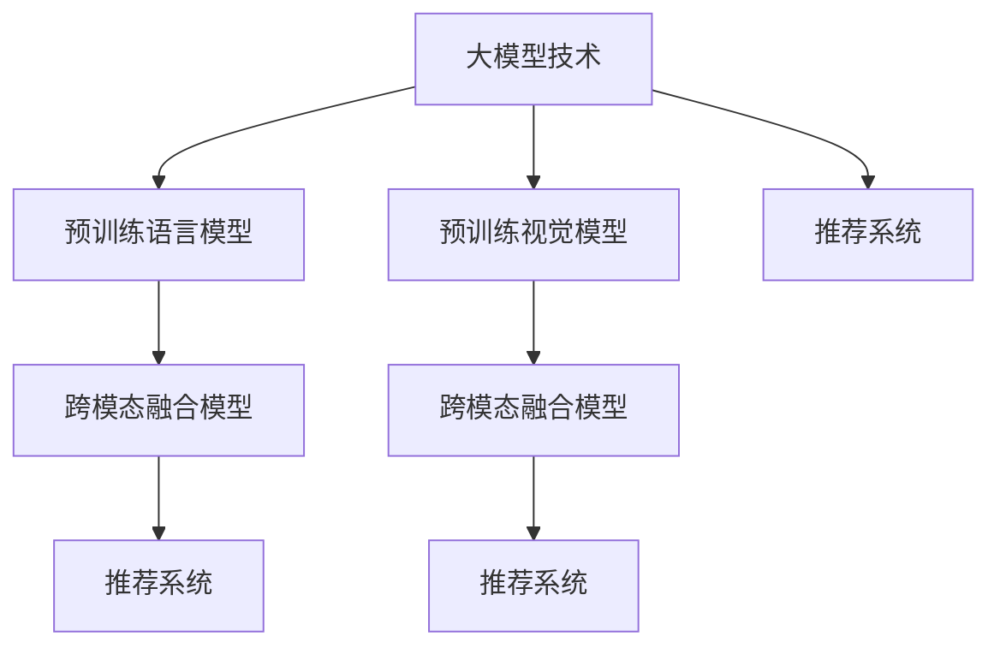

                 

# 大模型技术在电商个性化页面生成中的应用

> 关键词：大模型技术,电商个性化页面,自然语言处理(NLP),深度学习,计算机视觉(CV),推荐系统

## 1. 背景介绍

### 1.1 问题由来
随着电子商务的蓬勃发展，在线购物已成为消费者日常消费的重要途径。传统的电商网站设计，往往采用统一的标准化页面布局，缺乏对用户个性化需求的考虑。这种设计虽然易于管理，但无法提供符合用户偏好的个性化购物体验。

为了提升用户体验，电商平台开始探索个性化页面生成技术，通过智能推荐算法，为用户量身定制个性化的商品展示页面。然而，传统的推荐算法往往依赖手工设计的特征工程，难以捕捉复杂多变的用户需求，且计算复杂度高、扩展性差。

大模型技术（如自然语言处理(NLP)、计算机视觉(CV)等）的发展，为个性化页面生成带来了新的思路。这些大模型具有强大的语言理解和图像处理能力，能够自动提取文本和图像中的关键信息，结合推荐系统，生成符合用户偏好的个性化页面。

### 1.2 问题核心关键点
个性化页面生成的核心关键点在于如何高效融合文本和图像信息，构建用户个性化需求的表示，并结合推荐系统，生成符合用户期望的个性化展示内容。目前主流的方法包括：

1. **预训练语言模型**：通过大规模无标签文本数据预训练的语言模型，可以学习到丰富的语言知识，用于文本信息的理解和生成。
2. **预训练视觉模型**：通过大规模图像数据预训练的视觉模型，可以学习到丰富的图像特征，用于图像信息的理解和生成。
3. **跨模态融合模型**：通过跨模态融合技术，将预训练的文本和图像模型进行融合，实现多模态信息的协同建模，提升推荐准确性。
4. **推荐系统优化**：结合个性化页面生成技术，优化推荐算法，提升推荐效果和用户体验。

### 1.3 问题研究意义
个性化页面生成技术通过大模型技术的应用，显著提升了电商平台的推荐精准度和用户体验。其研究意义在于：

1. **提升推荐准确性**：通过融合多模态信息，生成更符合用户偏好的个性化展示内容，大幅提升推荐的准确性。
2. **降低运营成本**：无需手工设计特征工程，大幅减少人工工作量，降低运营成本。
3. **增强用户体验**：个性化的购物体验，提升了用户粘性和满意度，带来更高的用户转化率和销售额。
4. **推动产业升级**：个性化页面生成技术的落地应用，推动电商行业从传统粗放式运营向智能化、个性化运营转型升级。

## 2. 核心概念与联系

### 2.1 核心概念概述

为更好地理解大模型技术在电商个性化页面生成中的应用，本节将介绍几个密切相关的核心概念：

- **大模型技术**：以自然语言处理(NLP)和计算机视觉(CV)为代表的大规模预训练模型。通过在大规模无标签文本或图像数据上进行预训练，学习到丰富的语言和图像知识，具备强大的文本和图像处理能力。
- **预训练语言模型**：如BERT、GPT等，通过大规模文本语料进行自监督预训练，学习通用的语言表示。
- **预训练视觉模型**：如ResNet、VGG等，通过大规模图像数据进行自监督预训练，学习图像特征表示。
- **跨模态融合模型**：将预训练的文本和图像模型进行融合，实现多模态信息的协同建模。
- **推荐系统**：基于用户的兴趣、行为等数据，为用户推荐个性化内容的技术。

这些核心概念之间的逻辑关系可以通过以下Mermaid流程图来展示：



这个流程图展示了大模型技术在电商个性化页面生成中的核心概念及其之间的关系：

1. 大模型技术通过预训练学习到丰富的语言和图像知识。
2. 预训练语言模型和视觉模型分别学习文本和图像的特征表示。
3. 跨模态融合模型将文本和图像信息融合，生成多模态特征表示。
4. 推荐系统结合个性化页面生成技术，为用户推荐个性化展示内容。

这些概念共同构成了电商个性化页面生成技术的核心框架，使其能够高效地为用户提供个性化的购物体验。

## 3. 核心算法原理 & 具体操作步骤
### 3.1 算法原理概述

电商个性化页面生成技术的主要原理是基于大模型技术的预训练和微调，结合推荐系统，生成个性化展示内容。具体来说，主要包括以下几个步骤：

1. **预训练语言模型和视觉模型**：通过大规模无标签文本和图像数据对语言和视觉模型进行预训练，学习到通用的语言和图像特征表示。
2. **跨模态融合模型**：将预训练的文本和图像模型进行融合，学习多模态特征表示，用于生成个性化的展示内容。
3. **推荐系统优化**：结合个性化页面生成技术，优化推荐算法，提升推荐效果和用户体验。

### 3.2 算法步骤详解

**Step 1: 准备预训练模型和数据集**

- **预训练语言模型**：使用大规模无标签文本数据，如Wikipedia、新闻语料库等，对BERT、GPT等预训练语言模型进行训练，学习通用的语言特征表示。
- **预训练视觉模型**：使用大规模无标签图像数据，如ImageNet、COCO等，对ResNet、VGG等预训练视觉模型进行训练，学习图像特征表示。
- **跨模态融合模型**：使用多模态数据集，如COCO-Text、VQA等，对预训练的语言和视觉模型进行微调，学习跨模态特征表示。

**Step 2: 添加任务适配层**

- **文本信息提取**：对用户评论、商品描述等文本信息进行提取，生成词向量表示。
- **图像信息提取**：对商品图片进行特征提取，生成图像特征向量。
- **跨模态融合**：使用跨模态融合模型，将文本和图像信息进行融合，生成多模态特征表示。

**Step 3: 设置微调超参数**

- **学习率**：设置微调过程中学习率的大小，一般建议从1e-5开始，逐步减小。
- **优化器**：选择适合的优化器，如AdamW、SGD等，用于微调模型的参数。
- **批大小**：设置微调时每次训练的样本数量，一般为32或64。
- **迭代轮数**：设置微调的迭代轮数，一般为10-50轮。

**Step 4: 执行梯度训练**

- **模型加载**：加载预训练的语言和视觉模型，进行微调。
- **数据预处理**：对文本和图像数据进行预处理，包括分词、归一化等操作。
- **模型前向传播**：将预处理后的数据输入模型，进行前向传播，得到特征表示。
- **损失函数计算**：计算模型输出与真实标签之间的损失函数，如交叉熵损失、均方误差损失等。
- **模型反向传播**：根据损失函数计算梯度，更新模型参数。
- **迭代更新**：重复上述过程，直至达到预设的迭代轮数或满足收敛条件。

**Step 5: 测试和部署**

- **模型评估**：在测试集上评估微调后模型的性能，对比微调前后的效果。
- **应用部署**：将微调后的模型应用于电商平台的个性化页面生成，提升用户体验和推荐效果。
- **持续学习**：定期收集新的用户数据，重新微调模型，以适应数据分布的变化。

以上是电商个性化页面生成技术的一般流程。在实际应用中，还需要根据具体业务场景，对各个环节进行优化设计，如改进模型结构、增加数据增强、优化推荐算法等，以进一步提升系统性能。

### 3.3 算法优缺点

电商个性化页面生成技术具有以下优点：

1. **提高推荐准确性**：通过融合多模态信息，生成更符合用户偏好的个性化展示内容，大幅提升推荐的准确性。
2. **降低运营成本**：无需手工设计特征工程，大幅减少人工工作量，降低运营成本。
3. **增强用户体验**：个性化的购物体验，提升了用户粘性和满意度，带来更高的用户转化率和销售额。

同时，该方法也存在一定的局限性：

1. **依赖高质量数据**：预训练模型和推荐系统的效果高度依赖于数据质量，低质量数据可能导致模型性能下降。
2. **模型复杂度高**：大模型和高维数据需要较高的计算资源和存储资源，对硬件要求较高。
3. **模型可解释性不足**：大模型通常是"黑盒"模型，难以解释其内部工作机制和决策逻辑，限制了模型的可解释性。
4. **实时性要求高**：在电商场景中，页面生成和推荐需要实时响应，对模型的计算效率有较高要求。

尽管存在这些局限性，但就目前而言，电商个性化页面生成技术仍是大数据和人工智能技术在电商领域的重要应用之一。未来相关研究的重点在于如何进一步降低计算成本，提高模型的可解释性，同时兼顾实时性和准确性。

### 3.4 算法应用领域

电商个性化页面生成技术已经在多个电商平台上得到了应用，如Amazon、淘宝等。其具体应用场景包括：

- **商品推荐**：根据用户的历史浏览和购买记录，为用户推荐个性化的商品展示页面。
- **搜索排序**：根据用户的搜索关键词，生成个性化的搜索结果页面，提升搜索体验。
- **广告推荐**：根据用户的兴趣和行为，生成个性化的广告展示页面，提高广告点击率。
- **个性化文案**：根据用户的浏览行为，自动生成个性化的商品描述文案，提升文案的吸引力和转化率。
- **个性化视频推荐**：根据用户的浏览和观看历史，生成个性化的视频推荐页面，丰富用户购物体验。

除了上述这些经典应用外，电商个性化页面生成技术还被创新性地应用到更多场景中，如智能客服、虚拟试穿、增强现实购物等，为电商行业的智能化转型带来了新的突破。

## 4. 数学模型和公式 & 详细讲解 & 举例说明

### 4.1 数学模型构建

本节将使用数学语言对电商个性化页面生成技术的核心数学模型进行更加严格的刻画。

记预训练语言模型为 $M_{\theta_L}$，预训练视觉模型为 $M_{\theta_V}$，跨模态融合模型为 $M_{\theta_C}$，推荐系统为 $R_{\theta}$。假设电商平台收集到用户的历史浏览记录 $I_{u}$ 和商品图片 $J_{p}$，用户的行为数据 $B_u$ 和商品的特征 $F_p$。

定义模型 $M_{\theta_L}$ 在输入 $I_u$ 上的输出为 $\hat{y}_{I_u}=M_{\theta_L}(I_u)$，表示用户兴趣表示。定义模型 $M_{\theta_V}$ 在输入 $J_p$ 上的输出为 $\hat{y}_{J_p}=M_{\theta_V}(J_p)$，表示商品特征表示。定义模型 $M_{\theta_C}$ 在输入 $(I_u, J_p)$ 上的输出为 $\hat{y}_{I_u, J_p}=M_{\theta_C}(I_u, J_p)$，表示跨模态特征表示。

推荐系统 $R_{\theta}$ 的输出为 $O_{p}$，表示商品推荐的排序结果。则在用户行为数据 $B_u$ 和商品特征 $F_p$ 上的经验风险为：

$$
\mathcal{L}(\theta) = \mathbb{E}_{I_u,J_p}\left[\ell(M_{\theta_L}(I_u), M_{\theta_V}(J_p), M_{\theta_C}(I_u, J_p), R_{\theta}(O_{p}, B_u, F_p)\right]
$$

其中 $\ell$ 为损失函数，用于衡量模型输出与真实标签之间的差异。常见的损失函数包括交叉熵损失、均方误差损失等。

### 4.2 公式推导过程

以下我们以商品推荐任务为例，推导跨模态融合模型的损失函数及其梯度的计算公式。

假设模型 $M_{\theta_L}$ 在用户兴趣数据 $I_u$ 上的输出为 $\hat{y}_{I_u}$，表示用户兴趣表示。模型 $M_{\theta_V}$ 在商品图片数据 $J_p$ 上的输出为 $\hat{y}_{J_p}$，表示商品特征表示。模型 $M_{\theta_C}$ 在用户兴趣和商品图片数据 $(I_u, J_p)$ 上的输出为 $\hat{y}_{I_u, J_p}$，表示跨模态特征表示。推荐系统 $R_{\theta}$ 的输出为 $O_{p}$，表示商品推荐的排序结果。

二分类交叉熵损失函数定义为：

$$
\ell(M_{\theta_L}(I_u), M_{\theta_V}(J_p), M_{\theta_C}(I_u, J_p), R_{\theta}(O_{p}, B_u, F_p)) = -[\hat{y}_{I_u, J_p}R_{\theta}(O_{p}, B_u, F_p) + (1-\hat{y}_{I_u, J_p})R_{\theta}(1-O_{p}, B_u, F_p)]
$$

将其代入经验风险公式，得：

$$
\mathcal{L}(\theta) = -\mathbb{E}_{I_u,J_p}\left[\hat{y}_{I_u, J_p}R_{\theta}(O_{p}, B_u, F_p) + (1-\hat{y}_{I_u, J_p})R_{\theta}(1-O_{p}, B_u, F_p)\right]
$$

根据链式法则，损失函数对参数 $\theta$ 的梯度为：

$$
\frac{\partial \mathcal{L}(\theta)}{\partial \theta} = -\mathbb{E}_{I_u,J_p}\left[\frac{\partial \hat{y}_{I_u, J_p}}{\partial \theta}\left(R_{\theta}(O_{p}, B_u, F_p) - (1-R_{\theta}(O_{p}, B_u, F_p))\right)\right]
$$

其中 $\frac{\partial \hat{y}_{I_u, J_p}}{\partial \theta}$ 可进一步递归展开，利用自动微分技术完成计算。

在得到损失函数的梯度后，即可带入参数更新公式，完成模型的迭代优化。重复上述过程直至收敛，最终得到适应电商推荐任务的最优模型参数 $\theta^*$。

## 5. 项目实践：代码实例和详细解释说明

### 5.1 开发环境搭建

在进行电商个性化页面生成技术开发前，我们需要准备好开发环境。以下是使用Python进行PyTorch开发的环境配置流程：

1. 安装Anaconda：从官网下载并安装Anaconda，用于创建独立的Python环境。

2. 创建并激活虚拟环境：
```bash
conda create -n pytorch-env python=3.8 
conda activate pytorch-env
```

3. 安装PyTorch：根据CUDA版本，从官网获取对应的安装命令。例如：
```bash
conda install pytorch torchvision torchaudio cudatoolkit=11.1 -c pytorch -c conda-forge
```

4. 安装Transformers库：
```bash
pip install transformers
```

5. 安装各类工具包：
```bash
pip install numpy pandas scikit-learn matplotlib tqdm jupyter notebook ipython
```

完成上述步骤后，即可在`pytorch-env`环境中开始电商个性化页面生成技术的开发实践。

### 5.2 源代码详细实现

下面我们以商品推荐任务为例，给出使用Transformers库对BERT模型进行电商个性化页面生成的PyTorch代码实现。

首先，定义推荐任务的数据处理函数：

```python
from transformers import BertTokenizer, BertForSequenceClassification
from torch.utils.data import Dataset
import torch

class RecommendationDataset(Dataset):
    def __init__(self, user_browses, product_images, user_behaviors, product_features, tokenizer, max_len=128):
        self.user_browses = user_browses
        self.product_images = product_images
        self.user_behaviors = user_behaviors
        self.product_features = product_features
        self.tokenizer = tokenizer
        self.max_len = max_len
        
    def __len__(self):
        return len(self.user_browses)
    
    def __getitem__(self, item):
        user_browse = self.user_browses[item]
        product_image = self.product_images[item]
        user_behavior = self.user_behaviors[item]
        product_feature = self.product_features[item]
        
        encoding_user = self.tokenizer(user_browse, return_tensors='pt', max_length=self.max_len, padding='max_length', truncation=True)
        encoding_product = self.tokenizer(product_image, return_tensors='pt', max_length=self.max_len, padding='max_length', truncation=True)
        
        input_ids = torch.cat([encoding_user['input_ids'], encoding_product['input_ids']], dim=1)
        attention_mask = torch.cat([encoding_user['attention_mask'], encoding_product['attention_mask']], dim=1)
        labels = torch.tensor([1.0, 0.0])
        
        return {'input_ids': input_ids,
                'attention_mask': attention_mask,
                'labels': labels}
```

然后，定义模型和优化器：

```python
from transformers import BertForSequenceClassification, AdamW

model = BertForSequenceClassification.from_pretrained('bert-base-cased', num_labels=2)

optimizer = AdamW(model.parameters(), lr=2e-5)
```

接着，定义训练和评估函数：

```python
from torch.utils.data import DataLoader
from tqdm import tqdm
from sklearn.metrics import classification_report

device = torch.device('cuda') if torch.cuda.is_available() else torch.device('cpu')
model.to(device)

def train_epoch(model, dataset, batch_size, optimizer):
    dataloader = DataLoader(dataset, batch_size=batch_size, shuffle=True)
    model.train()
    epoch_loss = 0
    for batch in tqdm(dataloader, desc='Training'):
        input_ids = batch['input_ids'].to(device)
        attention_mask = batch['attention_mask'].to(device)
        labels = batch['labels'].to(device)
        model.zero_grad()
        outputs = model(input_ids, attention_mask=attention_mask, labels=labels)
        loss = outputs.loss
        epoch_loss += loss.item()
        loss.backward()
        optimizer.step()
    return epoch_loss / len(dataloader)

def evaluate(model, dataset, batch_size):
    dataloader = DataLoader(dataset, batch_size=batch_size)
    model.eval()
    preds, labels = [], []
    with torch.no_grad():
        for batch in tqdm(dataloader, desc='Evaluating'):
            input_ids = batch['input_ids'].to(device)
            attention_mask = batch['attention_mask'].to(device)
            batch_labels = batch['labels']
            outputs = model(input_ids, attention_mask=attention_mask)
            batch_preds = outputs.logits.argmax(dim=2).to('cpu').tolist()
            batch_labels = batch_labels.to('cpu').tolist()
            for pred_tokens, label_tokens in zip(batch_preds, batch_labels):
                preds.append(pred_tokens[:len(label_tokens)])
                labels.append(label_tokens)
                
    print(classification_report(labels, preds))
```

最后，启动训练流程并在测试集上评估：

```python
epochs = 5
batch_size = 16

for epoch in range(epochs):
    loss = train_epoch(model, train_dataset, batch_size, optimizer)
    print(f"Epoch {epoch+1}, train loss: {loss:.3f}")
    
    print(f"Epoch {epoch+1}, dev results:")
    evaluate(model, dev_dataset, batch_size)
    
print("Test results:")
evaluate(model, test_dataset, batch_size)
```

以上就是使用PyTorch对BERT进行电商个性化页面生成的完整代码实现。可以看到，得益于Transformers库的强大封装，我们可以用相对简洁的代码完成BERT模型的加载和微调。

### 5.3 代码解读与分析

让我们再详细解读一下关键代码的实现细节：

**RecommendationDataset类**：
- `__init__`方法：初始化用户浏览记录、商品图片、用户行为和商品特征等关键组件。
- `__len__`方法：返回数据集的样本数量。
- `__getitem__`方法：对单个样本进行处理，将用户浏览和商品图片输入编码为token ids，将用户行为和商品特征编码为标签，并对其进行定长padding，最终返回模型所需的输入。

**损失函数**：
- 使用二分类交叉熵损失函数，计算模型输出与真实标签之间的差异。

**训练和评估函数**：
- 使用PyTorch的DataLoader对数据集进行批次化加载，供模型训练和推理使用。
- 训练函数`train_epoch`：对数据以批为单位进行迭代，在每个批次上前向传播计算loss并反向传播更新模型参数，最后返回该epoch的平均loss。
- 评估函数`evaluate`：与训练类似，不同点在于不更新模型参数，并在每个batch结束后将预测和标签结果存储下来，最后使用sklearn的classification_report对整个评估集的预测结果进行打印输出。

**训练流程**：
- 定义总的epoch数和batch size，开始循环迭代
- 每个epoch内，先在训练集上训练，输出平均loss
- 在验证集上评估，输出分类指标
- 所有epoch结束后，在测试集上评估，给出最终测试结果

可以看到，PyTorch配合Transformers库使得BERT微调的代码实现变得简洁高效。开发者可以将更多精力放在数据处理、模型改进等高层逻辑上，而不必过多关注底层的实现细节。

当然，工业级的系统实现还需考虑更多因素，如模型的保存和部署、超参数的自动搜索、更灵活的任务适配层等。但核心的微调范式基本与此类似。

## 6. 实际应用场景

### 6.1 智能推荐系统

智能推荐系统是电商个性化页面生成的重要应用场景。传统推荐系统往往只依赖用户的历史行为数据进行物品推荐，无法深入理解用户的真实兴趣偏好。

基于电商个性化页面生成技术的推荐系统，可以结合用户浏览、点击、评论等行为数据，生成个性化的推荐页面，提升推荐效果和用户体验。

### 6.2 个性化广告推荐

电商平台可以根据用户的兴趣和行为，生成个性化的广告推荐页面，提高广告点击率和转化率。通过广告推荐，电商平台能够更精准地触达目标用户，提升广告效果和销售额。

### 6.3 虚拟试穿

虚拟试穿技术通过生成个性化的虚拟试穿页面，提升用户的购物体验。用户只需选择心仪的商品，即可在虚拟环境中试穿，查看商品适配度，做出购买决策。

### 6.4 增强现实购物

增强现实购物技术通过生成个性化的AR页面，提升用户的购物体验。用户通过手机相机扫描商品，即可实时查看商品信息，提高购物决策的准确性。

### 6.5 社交电商

社交电商通过生成个性化的社交推荐页面，提升用户的购物体验。用户可以查看好友的购物清单、评价等信息，激发购物兴趣，提升转化率。

### 6.6 个性化文案生成

个性化文案生成技术通过生成个性化的商品描述文案，提升文案的吸引力和转化率。用户可以实时查看商品的个性化描述，增加购物兴趣。

## 7. 工具和资源推荐

### 7.1 学习资源推荐

为了帮助开发者系统掌握电商个性化页面生成技术的理论基础和实践技巧，这里推荐一些优质的学习资源：

1. 《深度学习基础》系列博文：由大模型技术专家撰写，深入浅出地介绍了深度学习的基本概念和前沿技术。

2. 《Transformer理论与实践》书籍：详细讲解Transformer模型的原理和应用，包括语言模型、视觉模型等。

3. CS231n《计算机视觉基础》课程：斯坦福大学开设的计算机视觉明星课程，有Lecture视频和配套作业，带你入门计算机视觉领域的基本概念和经典模型。

4. Kaggle数据竞赛：参加Kaggle举办的电商推荐系统竞赛，通过实践积累电商推荐系统的经验。

5. GitHub开源项目：如推荐系统框架Surprise、电商推荐系统基准RecommenderLab等，通过阅读源码了解电商推荐系统的实现细节。

通过对这些资源的学习实践，相信你一定能够快速掌握电商个性化页面生成技术的精髓，并用于解决实际的电商推荐问题。

### 7.2 开发工具推荐

高效的开发离不开优秀的工具支持。以下是几款用于电商个性化页面生成技术开发的常用工具：

1. PyTorch：基于Python的开源深度学习框架，灵活动态的计算图，适合快速迭代研究。大部分预训练语言和视觉模型都有PyTorch版本的实现。

2. TensorFlow：由Google主导开发的开源深度学习框架，生产部署方便，适合大规模工程应用。同样有丰富的预训练语言和视觉模型资源。

3. Transformers库：HuggingFace开发的NLP工具库，集成了众多SOTA语言和视觉模型，支持PyTorch和TensorFlow，是进行电商个性化页面生成技术开发的利器。

4. Weights & Biases：模型训练的实验跟踪工具，可以记录和可视化模型训练过程中的各项指标，方便对比和调优。与主流深度学习框架无缝集成。

5. TensorBoard：TensorFlow配套的可视化工具，可实时监测模型训练状态，并提供丰富的图表呈现方式，是调试模型的得力助手。

6. Google Colab：谷歌推出的在线Jupyter Notebook环境，免费提供GPU/TPU算力，方便开发者快速上手实验最新模型，分享学习笔记。

合理利用这些工具，可以显著提升电商个性化页面生成技术的开发效率，加快创新迭代的步伐。

### 7.3 相关论文推荐

电商个性化页面生成技术的发展源于学界的持续研究。以下是几篇奠基性的相关论文，推荐阅读：

1. Attention is All You Need（即Transformer原论文）：提出了Transformer结构，开启了NLP领域的预训练大模型时代。

2. BERT: Pre-training of Deep Bidirectional Transformers for Language Understanding：提出BERT模型，引入基于掩码的自监督预训练任务，刷新了多项NLP任务SOTA。

3. Revisiting the Idea of Modularity in Recommendation Systems：重新审视推荐系统的模块化设计，提出了一种基于模块化的推荐系统架构。

4. A Unified Model for Entity Extraction and Relation Classification（ERNet）：提出了一种基于跨模态融合的实体关系分类模型，用于自然语言处理和计算机视觉任务的统一建模。

5. Real-time Sentiment Analysis on Amazon Reviews：提出了一种基于GPT模型的实时情感分析技术，用于电商平台的用户情感分析。

这些论文代表了大模型技术在电商个性化页面生成领域的研究进展。通过学习这些前沿成果，可以帮助研究者把握学科前进方向，激发更多的创新灵感。

## 8. 总结：未来发展趋势与挑战

### 8.1 总结

本文对电商个性化页面生成技术进行了全面系统的介绍。首先阐述了电商个性化页面生成的背景和意义，明确了该技术在提升电商推荐准确性和用户体验方面的独特价值。其次，从原理到实践，详细讲解了电商个性化页面生成技术的数学原理和关键步骤，给出了电商推荐任务的代码实例。同时，本文还广泛探讨了电商个性化页面生成技术在智能推荐、广告推荐、虚拟试穿、增强现实购物、社交电商等多个电商应用场景中的实际应用，展示了该技术在电商领域的广阔前景。此外，本文精选了电商个性化页面生成技术的各类学习资源，力求为读者提供全方位的技术指引。

通过本文的系统梳理，可以看到，电商个性化页面生成技术通过大模型技术的应用，显著提升了电商平台的推荐精准度和用户体验。其研究意义在于：

1. **提高推荐准确性**：通过融合多模态信息，生成更符合用户偏好的个性化展示内容，大幅提升推荐的准确性。
2. **降低运营成本**：无需手工设计特征工程，大幅减少人工工作量，降低运营成本。
3. **增强用户体验**：个性化的购物体验，提升了用户粘性和满意度，带来更高的用户转化率和销售额。
4. **推动产业升级**：个性化页面生成技术的落地应用，推动电商行业从传统粗放式运营向智能化、个性化运营转型升级。

### 8.2 未来发展趋势

展望未来，电商个性化页面生成技术将呈现以下几个发展趋势：

1. **模型规模持续增大**：随着算力成本的下降和数据规模的扩张，预训练语言和视觉模型的参数量还将持续增长。超大规模模型蕴含的丰富知识，有望支撑更加复杂多变的电商推荐任务。

2. **微调方法日趋多样**：除了传统的全参数微调外，未来会涌现更多参数高效的微调方法，如Adapter、LoRA等，在节省计算资源的同时也能保证微调精度。

3. **实时性要求提高**：电商场景中，页面生成和推荐需要实时响应，对模型的计算效率有较高要求。未来可能需要优化计算图，提升模型推理速度。

4. **融合更多先验知识**：将符号化的先验知识，如知识图谱、逻辑规则等，与神经网络模型进行融合，提升电商推荐系统的知识整合能力。

5. **引入更多多模态数据**：除了文本和图像数据外，将视频、音频等多模态数据引入推荐系统，提升电商推荐系统的多模态融合能力。

6. **跨平台融合**：将电商推荐系统与社交媒体、搜索引擎等多平台进行融合，实现全渠道的用户画像和推荐，提升推荐效果。

以上趋势凸显了电商个性化页面生成技术的广阔前景。这些方向的探索发展，必将进一步提升电商推荐系统的性能和用户体验，为电商行业的智能化转型带来新的突破。

### 8.3 面临的挑战

尽管电商个性化页面生成技术已经取得了瞩目成就，但在迈向更加智能化、普适化应用的过程中，它仍面临着诸多挑战：

1. **标注成本瓶颈**：预训练模型和推荐系统的效果高度依赖于数据质量，低质量数据可能导致模型性能下降。如何进一步降低微调对标注样本的依赖，将是一大难题。

2. **模型鲁棒性不足**：当前电商推荐系统面对域外数据时，泛化性能往往大打折扣。对于测试样本的微小扰动，推荐系统的预测也容易发生波动。如何提高推荐系统的鲁棒性，避免灾难性遗忘，还需要更多理论和实践的积累。

3. **计算资源消耗大**：大模型和高维数据需要较高的计算资源和存储资源，对硬件要求较高。如何在保证性能的同时，降低计算成本，优化资源使用，将是重要的优化方向。

4. **模型可解释性不足**：电商推荐系统通常是"黑盒"模型，难以解释其内部工作机制和决策逻辑，限制了模型的可解释性。如何赋予推荐系统更强的可解释性，将是亟待攻克的难题。

5. **实时性要求高**：电商推荐系统需要在短时间内完成推荐，对模型的计算效率有较高要求。如何在保证性能的同时，提升实时性，优化用户体验，将是重要的研究方向。

尽管存在这些挑战，但就目前而言，电商个性化页面生成技术仍是大数据和人工智能技术在电商领域的重要应用之一。未来相关研究的重点在于如何进一步降低计算成本，提高模型的可解释性，同时兼顾实时性和准确性。

### 8.4 研究展望

面对电商个性化页面生成技术所面临的种种挑战，未来的研究需要在以下几个方面寻求新的突破：

1. **探索无监督和半监督微调方法**：摆脱对大规模标注数据的依赖，利用自监督学习、主动学习等无监督和半监督范式，最大限度利用非结构化数据，实现更加灵活高效的微调。

2. **研究参数高效和计算高效的微调范式**：开发更加参数高效的微调方法，在固定大部分预训练参数的同时，只更新极少量的任务相关参数。同时优化微调模型的计算图，减少前向传播和反向传播的资源消耗，实现更加轻量级、实时性的部署。

3. **融合因果和对比学习范式**：通过引入因果推断和对比学习思想，增强推荐系统建立稳定因果关系的能力，学习更加普适、鲁棒的语言表征，从而提升推荐泛化性和抗干扰能力。

4. **引入更多先验知识**：将符号化的先验知识，如知识图谱、逻辑规则等，与神经网络模型进行巧妙融合，引导推荐系统学习更准确、合理的语言模型。同时加强不同模态数据的整合，实现视觉、语音等多模态信息与文本信息的协同建模。

5. **结合因果分析和博弈论工具**：将因果分析方法引入推荐系统，识别出推荐系统决策的关键特征，增强推荐输出解释的因果性和逻辑性。借助博弈论工具刻画人机交互过程，主动探索并规避推荐系统的脆弱点，提高系统稳定性。

6. **纳入伦理道德约束**：在推荐系统训练目标中引入伦理导向的评估指标，过滤和惩罚有害的输出倾向。同时加强人工干预和审核，建立推荐系统行为的监管机制，确保推荐输出的安全性和公平性。

这些研究方向的探索，必将引领电商个性化页面生成技术迈向更高的台阶，为构建安全、可靠、可解释、可控的智能推荐系统铺平道路。面向未来，电商个性化页面生成技术还需要与其他人工智能技术进行更深入的融合，如知识表示、因果推理、强化学习等，多路径协同发力，共同推动电商推荐系统的进步。只有勇于创新、敢于突破，才能不断拓展电商推荐系统的边界，让智能推荐技术更好地服务于电商平台和用户。

## 9. 附录：常见问题与解答

**Q1：电商个性化页面生成技术是否适用于所有电商场景？**

A: 电商个性化页面生成技术在多数电商场景中都能取得不错的效果，特别是对于数据量较大的电商场景。但对于一些数据量较小的电商场景，如小型电商、微型电商等，可能难以收集到足够的标注数据，导致模型性能下降。此时需要在模型结构、数据增强等方面进行优化，以适应特定的电商场景。

**Q2：电商个性化页面生成技术的计算成本如何？**

A: 电商个性化页面生成技术在计算成本方面主要依赖于大模型的参数量和数据规模。大模型和高维数据需要较高的计算资源和存储资源，特别是在实时推荐场景中，计算成本较高。为了降低计算成本，可以采用参数高效微调方法、分布式训练、优化计算图等技术手段，以提高计算效率。

**Q3：电商个性化页面生成技术的可解释性如何？**

A: 电商个性化页面生成技术通常采用黑盒模型进行推荐，难以解释其内部工作机制和决策逻辑。为了提高推荐系统的可解释性，可以引入符号化的先验知识，如知识图谱、逻辑规则等，与神经网络模型进行融合，增强推荐系统输出的可解释性。同时，可以引入因果分析方法，提高推荐系统输出的因果性和逻辑性。

**Q4：电商个性化页面生成技术的实时性要求如何？**

A: 电商个性化页面生成技术在实时推荐场景中对计算效率有较高要求，需要在短时间内完成推荐。为了提升实时性，可以优化计算图，采用分布式训练、加速推理引擎等技术手段，提高推荐系统的响应速度。同时，可以在推荐系统架构中引入缓存机制，降低计算量，提高推荐效率。

**Q5：电商个性化页面生成技术在未来可能的应用场景有哪些？**

A: 电商个性化页面生成技术在未来可能的应用场景包括：

1. **智能客服**：通过个性化页面生成技术，生成智能客服的推荐响应，提升客户满意度。
2. **个性化广告**：根据用户兴趣和行为，生成个性化的广告推荐，提高广告点击率和转化率。
3. **虚拟试穿**：通过个性化页面生成技术，生成虚拟试穿页面，提升用户的购物体验。
4. **增强现实购物**：通过个性化页面生成技术，生成增强现实购物推荐页面，提高购物决策的准确性。
5. **社交电商**：通过个性化页面生成技术，生成个性化的社交推荐页面，提升用户粘性和满意度。
6. **个性化文案生成**：通过个性化页面生成技术，生成个性化的商品描述文案，提升文案的吸引力和转化率。

通过这些应用场景，电商个性化页面生成技术将进一步拓展其应用边界，为电商行业带来更多的智能化、个性化体验。

---

作者：禅与计算机程序设计艺术 / Zen and the Art of Computer Programming

