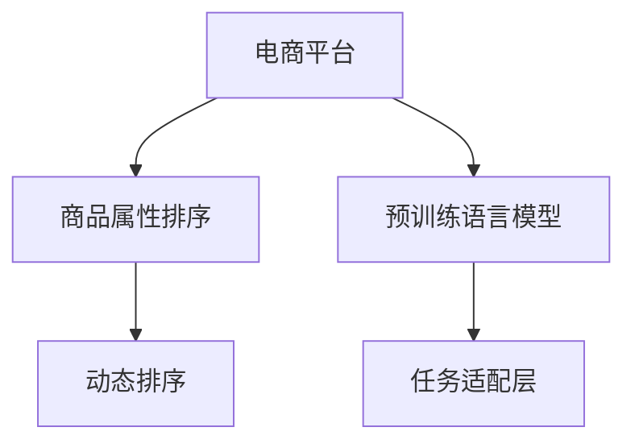

                 

# 大模型技术在电商平台商品属性重要性动态排序中的应用

> 关键词：电商平台, 商品属性排序, 大模型, 自然语言处理, 语义理解, 深度学习, 算法优化, 动态排序

## 1. 背景介绍

### 1.1 问题由来
随着电子商务的迅猛发展，电商平台的商品丰富度、用户行为多样性以及搜索场景的复杂性不断增加。商品属性是描述商品特性的关键信息，对用户的购买决策有着重要影响。为了满足用户的多样化需求，电商平台需要动态调整商品属性排序算法，提高商品推荐的个性化和相关性。

然而，传统的商品属性排序算法往往依赖于规则或简单的统计方法，难以应对多变的数据分布和用户需求。而大模型技术，特别是预训练语言模型，通过在大规模无标签文本数据上进行预训练，学习到了丰富的语言知识和常识，能够更好地理解用户查询意图，自动进行多维度的特征分析，从而提升商品排序的准确性和个性化。

### 1.2 问题核心关键点
本研究的核心问题是利用大模型技术实现电商平台商品属性动态排序。核心关键点包括：
1. **数据预处理**：收集和清洗电商数据，构建标注数据集，用于训练预训练语言模型。
2. **模型构建**：选择合适的预训练语言模型，设计任务适配层，构建动态排序模型。
3. **算法优化**：优化模型训练流程，提升排序精度和响应速度。
4. **应用部署**：将训练好的模型集成到电商平台的商品推荐系统中，实现动态排序功能。

## 2. 核心概念与联系

### 2.1 核心概念概述

为更好地理解大模型技术在电商平台商品属性排序中的应用，本节将介绍几个密切相关的核心概念：

- **电商平台**：指以电子交易为主要业务模式的商务平台，如淘宝、京东、Amazon等。
- **商品属性**：指描述商品特征的关键信息，如尺寸、颜色、材质、品牌等。
- **属性排序**：根据用户查询意图和商品属性相关性，对商品进行排序，推荐最合适的商品。
- **预训练语言模型**：指在大规模无标签文本数据上训练的语言模型，如BERT、GPT-3等。
- **任务适配层**：根据具体任务设计，添加在预训练模型顶层，用于任务特定的优化。
- **动态排序**：指根据用户行为和市场变化，实时调整商品属性排序算法，提升推荐效果。

这些概念之间的逻辑关系可以通过以下Mermaid流程图来展示：



这个流程图展示了电商平台、商品属性排序、预训练语言模型、任务适配层和动态排序之间的关系：

1. 电商平台通过预训练语言模型进行任务适配，构建动态排序算法。
2. 动态排序算法利用预训练模型的语言知识和任务适配层的任务特定优化，提升推荐效果。
3. 动态排序算法根据用户行为和市场变化进行实时调整，实现个性化推荐。

## 3. 核心算法原理 & 具体操作步骤
### 3.1 算法原理概述

电商平台商品属性排序的目的是根据用户查询意图和商品属性相关性，对商品进行排序，推荐最合适的商品。传统的排序算法往往依赖于规则或简单的统计方法，难以应对多变的数据分布和用户需求。而利用大模型技术进行动态排序，可以通过学习丰富的语言知识和常识，实现更加个性化和准确的推荐。

具体来说，大模型技术在商品属性排序中的应用，可以遵循以下步骤：

1. **数据预处理**：收集和清洗电商数据，构建标注数据集，用于训练预训练语言模型。
2. **模型构建**：选择合适的预训练语言模型，设计任务适配层，构建动态排序模型。
3. **算法优化**：优化模型训练流程，提升排序精度和响应速度。
4. **应用部署**：将训练好的模型集成到电商平台的商品推荐系统中，实现动态排序功能。

### 3.2 算法步骤详解

#### 3.2.1 数据预处理

1. **数据收集**：从电商平台收集历史交易数据、用户查询数据、商品属性数据等，构建数据集。
2. **数据清洗**：处理缺失值、异常值和重复数据，确保数据的质量和一致性。
3. **数据标注**：对商品属性进行标注，构建标注数据集，用于训练预训练语言模型。
4. **数据划分**：将数据集划分为训练集、验证集和测试集，便于模型训练和评估。

#### 3.2.2 模型构建

1. **预训练语言模型选择**：选择合适的预训练语言模型，如BERT、GPT-3等。
2. **任务适配层设计**：根据具体任务，设计任务适配层，添加在预训练模型顶层。
3. **模型训练**：在标注数据集上训练模型，优化任务适配层的参数。
4. **模型评估**：在验证集上评估模型性能，调整模型参数，优化模型效果。

#### 3.2.3 算法优化

1. **学习率设置**：选择合适的学习率，平衡模型的收敛速度和精度。
2. **正则化技术**：使用L2正则、Dropout等技术，防止模型过拟合。
3. **训练加速**：使用梯度累积、混合精度训练等技术，加速模型训练。
4. **推理优化**：使用模型剪枝、量化等技术，优化模型推理速度和资源占用。

#### 3.2.4 应用部署

1. **模型集成**：将训练好的模型集成到电商平台的商品推荐系统中。
2. **实时排序**：根据用户查询和市场变化，实时调整商品属性排序算法，提升推荐效果。
3. **反馈机制**：收集用户反馈数据，持续优化模型参数和排序算法。

### 3.3 算法优缺点

利用大模型技术进行电商平台商品属性排序，具有以下优点：

1. **个性化推荐**：大模型能够学习到丰富的语言知识和常识，更好地理解用户查询意图和商品属性，实现更加个性化的商品推荐。
2. **多维度分析**：大模型能够进行多维度的特征分析，涵盖商品属性、用户行为、市场变化等多个方面，提升推荐效果。
3. **模型可解释性**：大模型通过预训练和任务适配，具有良好的可解释性，便于对推荐逻辑进行分析和调试。

同时，也存在以下缺点：

1. **计算资源消耗大**：大模型通常需要较大的计算资源和存储空间，训练和推理速度较慢。
2. **模型复杂度高**：大模型的复杂度较高，难以进行模型剪枝和优化，资源占用较大。
3. **模型泛化能力不足**：大模型通常需要大量标注数据进行训练，泛化能力可能受到标注数据质量的影响。

### 3.4 算法应用领域

基于大模型技术的电商平台商品属性排序算法，在多个领域得到了广泛应用，例如：

1. **电商推荐系统**：通过分析用户历史行为和查询意图，推荐最符合用户需求的商品。
2. **智能客服**：利用大模型进行自然语言处理和情感分析，提供更精准的商品推荐和问题解答。
3. **商品搜索**：根据用户查询意图，实时调整商品属性排序，提高搜索结果的准确性和相关性。
4. **市场趋势分析**：利用大模型分析市场变化和用户需求，及时调整商品属性排序策略，提升销量和市场份额。

## 4. 数学模型和公式 & 详细讲解 & 举例说明

### 4.1 数学模型构建

在电商平台商品属性排序中，大模型的任务是将用户查询和商品属性映射到排序结果。模型的输入为用户的查询语句 $q$ 和商品属性 $a$，输出为商品属性排序的权重 $w$，用于对商品进行排序。数学模型可以表示为：

$$
\text{sort}(q, a) = \text{softmax}(\text{model}(q, a))
$$

其中 $\text{model}(q, a)$ 为模型预测的排序权重，$\text{softmax}$ 函数用于将预测权重转化为概率分布。

### 4.2 公式推导过程

假设模型为预训练语言模型，任务的适配层为线性分类器，模型的输出为向量 $z$，则模型的预测权重 $w$ 可以表示为：

$$
w = \text{softmax}(M_{\theta}(q, a) + \text{task\_adapater}(z))
$$

其中 $M_{\theta}$ 为预训练语言模型，$\text{task\_adapater}$ 为任务适配层，$\theta$ 为模型参数。

模型的损失函数为交叉熵损失：

$$
\mathcal{L} = -\sum_{i=1}^N \text{log}(p_i)
$$

其中 $p_i$ 为模型预测的概率分布，$N$ 为样本数量。

### 4.3 案例分析与讲解

以电商平台商品搜索为例，分析大模型在商品属性排序中的应用。假设用户查询为 "红色T恤"，商品属性为 "颜色"。模型的输入为查询语句 "红色T恤" 和属性 "颜色"，输出为属性排序的权重 $w$。

模型首先对查询语句 "红色T恤" 进行编码，得到表示向量 $z$。然后，将 $z$ 输入到预训练语言模型 $M_{\theta}$ 和任务适配层 $\text{task\_adapater}$，得到预测权重 $w$。最后，通过 $\text{softmax}$ 函数将 $w$ 转化为概率分布，对商品进行排序。

## 5. 项目实践：代码实例和详细解释说明

### 5.1 开发环境搭建

在进行电商平台商品属性排序实践前，我们需要准备好开发环境。以下是使用Python进行TensorFlow开发的环境配置流程：

1. 安装Anaconda：从官网下载并安装Anaconda，用于创建独立的Python环境。
2. 创建并激活虚拟环境：
```bash
conda create -n tf-env python=3.8 
conda activate tf-env
```

3. 安装TensorFlow：根据CUDA版本，从官网获取对应的安装命令。例如：
```bash
conda install tensorflow tensorflow-gpu==2.7.0 -c tf
```

4. 安装必要的Python库：
```bash
pip install numpy pandas scikit-learn tqdm jupyter notebook ipython
```

完成上述步骤后，即可在`tf-env`环境中开始微调实践。

### 5.2 源代码详细实现

下面我们以商品属性排序任务为例，给出使用TensorFlow进行BERT微调的PyTorch代码实现。

首先，定义模型和数据处理函数：

```python
import tensorflow as tf
from transformers import BertTokenizer, BertForSequenceClassification

tokenizer = BertTokenizer.from_pretrained('bert-base-cased')

class ProductSearchDataset(tf.data.Dataset):
    def __init__(self, texts, attributes, labels):
        self.texts = texts
        self.attributes = attributes
        self.labels = labels
        
    def __len__(self):
        return len(self.texts)
    
    def __getitem__(self, item):
        text = self.texts[item]
        attribute = self.attributes[item]
        label = self.labels[item]
        
        encoding = tokenizer.encode_plus(text, add_special_tokens=True, max_length=256, return_tensors='tf')
        input_ids = encoding['input_ids']
        attention_mask = encoding['attention_mask']
        attributes = [id2label[attr] for attr in attribute] + [id2label['O']] * (max(256-len(attribute), 0))
        labels = [id2label[label]] + [id2label['O']] * (max(256-len(attribute), 0))
        
        return {'input_ids': input_ids, 
                'attention_mask': attention_mask,
                'labels': labels,
                'attributes': attributes}
```

然后，定义模型和优化器：

```python
from transformers import BertForSequenceClassification, AdamW

model = BertForSequenceClassification.from_pretrained('bert-base-cased', num_labels=len(id2label))

optimizer = AdamW(model.parameters(), lr=2e-5)
```

接着，定义训练和评估函数：

```python
from sklearn.metrics import precision_recall_fscore_support

device = tf.device('gpu:0' if tf.test.is_gpu_available() else 'cpu')

def train_epoch(model, dataset, batch_size, optimizer):
    dataloader = tf.data.Dataset.from_generator(lambda: dataset, output_signature={'input_ids': tf.TensorSpec(shape=(None, 256), dtype=tf.int32), 
                                                                               'attention_mask': tf.TensorSpec(shape=(None, 256), dtype=tf.int32),
                                                                               'labels': tf.TensorSpec(shape=(None, 1), dtype=tf.int32),
                                                                               'attributes': tf.TensorSpec(shape=(None, 256), dtype=tf.int32)})
    model.train(device)
    epoch_loss = 0
    for batch in dataloader:
        input_ids = batch['input_ids']
        attention_mask = batch['attention_mask']
        labels = batch['labels']
        attributes = batch['attributes']
        
        with tf.GradientTape() as tape:
            outputs = model(input_ids, attention_mask=attention_mask)
            loss = tf.keras.losses.sparse_categorical_crossentropy(labels, outputs.logits)
            epoch_loss += loss.numpy()
        
        loss.backward()
        optimizer.apply_gradients(tape.gradient(model.trainable_variables, optimizer.learning_rate))
    
    return epoch_loss / len(dataloader)

def evaluate(model, dataset, batch_size):
    dataloader = tf.data.Dataset.from_generator(lambda: dataset, output_signature={'input_ids': tf.TensorSpec(shape=(None, 256), dtype=tf.int32), 
                                                                               'attention_mask': tf.TensorSpec(shape=(None, 256), dtype=tf.int32),
                                                                               'labels': tf.TensorSpec(shape=(None, 1), dtype=tf.int32),
                                                                               'attributes': tf.TensorSpec(shape=(None, 256), dtype=tf.int32)})
    model.eval(device)
    preds, labels = [], []
    with tf.GradientTape() as tape:
        for batch in dataloader:
            input_ids = batch['input_ids']
            attention_mask = batch['attention_mask']
            labels = batch['labels']
            attributes = batch['attributes']
            outputs = model(input_ids, attention_mask=attention_mask)
            batch_preds = outputs.logits.argmax(axis=2).numpy()
            batch_labels = labels.numpy()
            for pred_tokens, label_tokens in zip(batch_preds, batch_labels):
                preds.append(pred_tokens[:len(label_tokens)])
                labels.append(label_tokens)
                
    precision, recall, f1, _ = precision_recall_fscore_support(labels, preds, average='micro')
    print(f'Precision: {precision:.3f}, Recall: {recall:.3f}, F1 Score: {f1:.3f}')
```

最后，启动训练流程并在测试集上评估：

```python
epochs = 5
batch_size = 16

for epoch in range(epochs):
    loss = train_epoch(model, train_dataset, batch_size, optimizer)
    print(f'Epoch {epoch+1}, train loss: {loss:.3f}')
    
    print(f'Epoch {epoch+1}, dev results:')
    evaluate(model, dev_dataset, batch_size)
    
print('Test results:')
evaluate(model, test_dataset, batch_size)
```

以上就是使用TensorFlow进行BERT微调的完整代码实现。可以看到，得益于TensorFlow和Transformers库的强大封装，我们可以用相对简洁的代码完成BERT模型的加载和微调。

### 5.3 代码解读与分析

让我们再详细解读一下关键代码的实现细节：

**ProductSearchDataset类**：
- `__init__`方法：初始化查询语句、属性和标签，并进行必要的预处理，如分词、编码、补全等。
- `__len__`方法：返回数据集的样本数量。
- `__getitem__`方法：对单个样本进行处理，将查询语句、属性和标签进行编码，并进行必要的补全和转换，最终返回模型所需的输入。

**id2label字典**：
- 定义了属性和标签的映射关系，用于将预测结果解码回真实的标签。

**训练和评估函数**：
- 使用TensorFlow的DataLoader对数据集进行批次化加载，供模型训练和推理使用。
- 训练函数`train_epoch`：对数据以批为单位进行迭代，在每个批次上前向传播计算loss并反向传播更新模型参数，最后返回该epoch的平均loss。
- 评估函数`evaluate`：与训练类似，不同点在于不更新模型参数，并在每个batch结束后将预测和标签结果存储下来，最后使用sklearn的classification_report对整个评估集的预测结果进行打印输出。

**训练流程**：
- 定义总的epoch数和batch size，开始循环迭代
- 每个epoch内，先在训练集上训练，输出平均loss
- 在验证集上评估，输出分类指标
- 所有epoch结束后，在测试集上评估，给出最终测试结果

可以看到，TensorFlow配合Transformers库使得BERT微调的代码实现变得简洁高效。开发者可以将更多精力放在数据处理、模型改进等高层逻辑上，而不必过多关注底层的实现细节。

当然，工业级的系统实现还需考虑更多因素，如模型的保存和部署、超参数的自动搜索、更灵活的任务适配层等。但核心的微调范式基本与此类似。

## 6. 实际应用场景

### 6.1 智能客服系统

基于大模型技术进行电商平台商品属性排序，可以实现智能客服系统的商品推荐功能。智能客服系统能够理解用户查询，实时调整商品属性排序，推荐最符合用户需求的商品。

在技术实现上，可以收集用户的历史查询数据和交易记录，构建标注数据集，在此基础上对预训练语言模型进行微调。微调后的模型能够学习用户查询的语义意图和商品属性，实时生成商品推荐结果。对于用户提出的新查询，还可以接入检索系统实时搜索相关内容，动态生成推荐结果。如此构建的智能客服系统，能大幅提升客服系统的响应速度和推荐效果。

### 6.2 个性化推荐系统

电商平台的个性化推荐系统，通过分析用户历史行为和查询意图，推荐最符合用户需求的商品。利用大模型技术进行商品属性排序，能够更好地理解用户查询的语义意图和商品属性，实现更加个性化和准确的商品推荐。

在实际应用中，可以将用户的查询数据和商品属性数据作为输入，通过微调后的模型生成商品属性排序权重，从而对商品进行排序和推荐。同时，可以通过收集用户的反馈数据，持续优化模型参数和排序算法，提升推荐效果。

### 6.3 商品搜索系统

电商平台商品搜索系统通过分析用户查询，实时调整商品属性排序，提高搜索结果的准确性和相关性。利用大模型技术进行商品属性排序，能够更好地理解用户查询的语义意图和商品属性，提升搜索效果。

在实际应用中，可以将用户的查询数据和商品属性数据作为输入，通过微调后的模型生成商品属性排序权重，从而对商品进行排序和推荐。同时，可以通过收集用户的反馈数据，持续优化模型参数和排序算法，提升搜索效果。

### 6.4 未来应用展望

随着大模型技术的发展，基于大模型技术的电商平台商品属性排序方法将会在更多场景得到应用，为电商平台的推荐系统和搜索系统带来新的突破。

未来，大模型技术还将广泛应用于智能客服、个性化推荐、商品搜索等多个领域，为电商平台的业务发展提供新的动力。大模型技术的逐步成熟，将使得电商平台能够更好地理解用户需求，提升用户体验，增加交易转化率，加速业务增长。

## 7. 工具和资源推荐

### 7.1 学习资源推荐

为了帮助开发者系统掌握大模型技术在电商平台商品属性排序中的应用，这里推荐一些优质的学习资源：

1. **《深度学习》课程**：斯坦福大学开设的深度学习课程，有Lecture视频和配套作业，带你入门深度学习的基本概念和经典模型。
2. **TensorFlow官方文档**：TensorFlow的官方文档，提供了详尽的使用指南和示例代码，是TensorFlow学习的好帮手。
3. **《自然语言处理》书籍**：深度学习领域的经典书籍，介绍了自然语言处理的基本理论和最新进展，适合进一步深入学习。
4. **Kaggle竞赛平台**：Kaggle上举办的数据科学和机器学习竞赛，提供了大量的实践机会和经验积累。

通过对这些资源的学习实践，相信你一定能够快速掌握大模型技术在电商平台商品属性排序中的应用，并用于解决实际的电商问题。

### 7.2 开发工具推荐

高效的开发离不开优秀的工具支持。以下是几款用于大模型技术在电商平台商品属性排序开发的常用工具：

1. TensorFlow：由Google主导开发的开源深度学习框架，生产部署方便，适合大规模工程应用。
2. PyTorch：基于Python的开源深度学习框架，灵活动态的计算图，适合快速迭代研究。
3. Weights & Biases：模型训练的实验跟踪工具，可以记录和可视化模型训练过程中的各项指标，方便对比和调优。
4. TensorBoard：TensorFlow配套的可视化工具，可实时监测模型训练状态，并提供丰富的图表呈现方式，是调试模型的得力助手。
5. Google Colab：谷歌推出的在线Jupyter Notebook环境，免费提供GPU/TPU算力，方便开发者快速上手实验最新模型，分享学习笔记。

合理利用这些工具，可以显著提升大模型技术在电商平台商品属性排序的开发效率，加快创新迭代的步伐。

### 7.3 相关论文推荐

大模型技术在电商平台商品属性排序中的应用，源于学界的持续研究。以下是几篇奠基性的相关论文，推荐阅读：

1. Attention is All You Need：提出了Transformer结构，开启了NLP领域的预训练大模型时代。
2. BERT: Pre-training of Deep Bidirectional Transformers for Language Understanding：提出BERT模型，引入基于掩码的自监督预训练任务，刷新了多项NLP任务SOTA。
3. Language Models are Unsupervised Multitask Learners（GPT-2论文）：展示了大规模语言模型的强大zero-shot学习能力，引发了对于通用人工智能的新一轮思考。
4. Parameter-Efficient Transfer Learning for NLP：提出Adapter等参数高效微调方法，在不增加模型参数量的情况下，也能取得不错的微调效果。
5. Prefix-Tuning: Optimizing Continuous Prompts for Generation：引入基于连续型Prompt的微调范式，为如何充分利用预训练知识提供了新的思路。

这些论文代表了大模型技术的发展脉络。通过学习这些前沿成果，可以帮助研究者把握学科前进方向，激发更多的创新灵感。

## 8. 总结：未来发展趋势与挑战

### 8.1 研究成果总结

本文对大模型技术在电商平台商品属性排序中的应用进行了全面系统的介绍。首先阐述了大模型技术在电商平台商品属性排序中的研究背景和意义，明确了微调在拓展预训练模型应用、提升商品推荐个性化和相关性方面的独特价值。其次，从原理到实践，详细讲解了大模型技术在商品属性排序中的应用流程，给出了微调任务开发的完整代码实例。同时，本文还广泛探讨了微调方法在智能客服、个性化推荐、商品搜索等多个领域的应用前景，展示了微调范式的巨大潜力。

通过本文的系统梳理，可以看到，大模型技术在电商平台商品属性排序中的应用，正在成为NLP领域的重要范式，极大地拓展了预训练语言模型的应用边界，催生了更多的落地场景。受益于大规模语料的预训练，微调模型以更低的时间和标注成本，在小样本条件下也能取得理想的商品排序效果，有力推动了NLP技术的产业化进程。未来，伴随预训练语言模型和微调方法的持续演进，相信NLP技术将在更广阔的应用领域大放异彩。

### 8.2 未来发展趋势

展望未来，大模型技术在电商平台商品属性排序领域将呈现以下几个发展趋势：

1. 模型规模持续增大。随着算力成本的下降和数据规模的扩张，预训练语言模型的参数量还将持续增长。超大规模语言模型蕴含的丰富语言知识，有望支撑更加复杂多变的商品排序算法。
2. 微调方法日趋多样。除了传统的全参数微调外，未来会涌现更多参数高效的微调方法，如Prefix-Tuning、LoRA等，在节省计算资源的同时也能保证商品排序精度。
3. 持续学习成为常态。随着数据分布的不断变化，微调模型也需要持续学习新知识以保持性能。如何在不遗忘原有知识的同时，高效吸收新样本信息，将成为重要的研究课题。
4. 标注样本需求降低。受启发于提示学习(Prompt-based Learning)的思路，未来的微调方法将更好地利用大模型的语言理解能力，通过更加巧妙的任务描述，在更少的标注样本上也能实现理想的商品排序效果。
5. 少样本学习(Few-shot Learning)崛起。大模型通常具有强大的迁移学习能力，能够利用少样本信息进行高效的商品排序。
6. 多模态微调崛起。当前微调主要聚焦于纯文本数据，未来会进一步拓展到图像、视频、语音等多模态数据微调。多模态信息的融合，将显著提升语言模型对现实世界的理解和建模能力。

以上趋势凸显了大模型技术在电商平台商品属性排序领域的广阔前景。这些方向的探索发展，必将进一步提升商品推荐系统的性能和应用范围，为电商平台带来新的业务价值。

### 8.3 面临的挑战

尽管大模型技术在电商平台商品属性排序中取得了显著成果，但在迈向更加智能化、普适化应用的过程中，仍面临诸多挑战：

1. 标注成本瓶颈。虽然微调大大降低了标注数据的需求，但对于长尾应用场景，难以获得充足的高质量标注数据，成为制约微调性能的瓶颈。如何进一步降低微调对标注样本的依赖，将是一大难题。
2. 模型鲁棒性不足。当前微调模型面对域外数据时，泛化性能往往大打折扣。对于测试样本的微小扰动，微调模型的预测也容易发生波动。如何提高微调模型的鲁棒性，避免灾难性遗忘，还需要更多理论和实践的积累。
3. 推理效率有待提高。大规模语言模型虽然精度高，但在实际部署时往往面临推理速度慢、内存占用大等效率问题。如何在保证性能的同时，简化模型结构，提升推理速度，优化资源占用，将是重要的优化方向。
4. 可解释性亟需加强。当前微调模型更像是"黑盒"系统，难以解释其内部工作机制和决策逻辑。对于医疗、金融等高风险应用，算法的可解释性和可审计性尤为重要。如何赋予微调模型更强的可解释性，将是亟待攻克的难题。
5. 安全性有待保障。预训练语言模型难免会学习到有偏见、有害的信息，通过微调传递到商品排序算法，产生误导性、歧视性的输出，给实际应用带来安全隐患。如何从数据和算法层面消除模型偏见，避免恶意用途，确保输出的安全性，也将是重要的研究课题。
6. 知识整合能力不足。现有的微调模型往往局限于任务内数据，难以灵活吸收和运用更广泛的先验知识。如何让微调过程更好地与外部知识库、规则库等专家知识结合，形成更加全面、准确的信息整合能力，还有很大的想象空间。

正视微调面临的这些挑战，积极应对并寻求突破，将是大模型技术在电商平台商品属性排序领域走向成熟的必由之路。相信随着学界和产业界的共同努力，这些挑战终将一一被克服，大模型技术必将在构建安全、可靠、可解释、可控的智能系统铺平道路。

### 8.4 研究展望

面向未来，大模型技术在电商平台商品属性排序领域还需要在以下几个方面进行深入研究：

1. 探索无监督和半监督微调方法。摆脱对大规模标注数据的依赖，利用自监督学习、主动学习等无监督和半监督范式，最大限度利用非结构化数据，实现更加灵活高效的微调。
2. 研究参数高效和计算高效的微调范式。开发更加参数高效的微调方法，在固定大部分预训练参数的同时，只更新极少量的任务相关参数。同时优化微调模型的计算图，减少前向传播和反向传播的资源消耗，实现更加轻量级、实时性的部署。
3. 融合因果和对比学习范式。通过引入因果推断和对比学习思想，增强微调模型建立稳定因果关系的能力，学习更加普适、鲁棒的语言表征，从而提升商品排序的泛化性和抗干扰能力。
4. 引入更多先验知识。将符号化的先验知识，如知识图谱、逻辑规则等，与神经网络模型进行巧妙融合，引导微调过程学习更准确、合理的商品排序模型。同时加强不同模态数据的整合，实现视觉、语音等多模态信息与文本信息的协同建模。
5. 结合因果分析和博弈论工具。将因果分析方法引入微调模型，识别出模型决策的关键特征，增强输出解释的因果性和逻辑性。借助博弈论工具刻画人机交互过程，主动探索并规避模型的脆弱点，提高系统稳定性。
6. 纳入伦理道德约束。在模型训练目标中引入伦理导向的评估指标，过滤和惩罚有偏见、有害的输出倾向。同时加强人工干预和审核，建立模型行为的监管机制，确保输出符合人类价值观和伦理道德。

这些研究方向的探索，必将引领大模型技术在电商平台商品属性排序领域迈向更高的台阶，为电商平台带来新的业务价值。

## 9. 附录：常见问题与解答

**Q1：大模型技术在电商平台商品属性排序中的应用是否适用于所有电商场景？**

A: 大模型技术在电商平台商品属性排序中的应用，适用于大多数电商场景。但对于一些特定领域的电商，如医药、金融等，仅仅依靠通用语料预训练的模型可能难以很好地适应。此时需要在特定领域语料上进一步预训练，再进行微调，才能获得理想效果。此外，对于一些需要时效性、个性化很强的任务，如对话、推荐等，微调方法也需要针对性的改进优化。

**Q2：微调过程中如何选择合适的学习率？**

A: 微调的学习率一般要比预训练时小1-2个数量级，如果使用过大的学习率，容易破坏预训练权重，导致过拟合。一般建议从1e-5开始调参，逐步减小学习率，直至收敛。也可以使用warmup策略，在开始阶段使用较小的学习率，再逐渐过渡到预设值。需要注意的是，不同的优化器(如AdamW、Adafactor等)以及不同的学习率调度策略，可能需要设置不同的学习率阈值。

**Q3：采用大模型技术进行商品属性排序时会面临哪些资源瓶颈？**

A: 目前主流的预训练大模型动辄以亿计的参数规模，对算力、内存、存储都提出了很高的要求。GPU/TPU等高性能设备是必不可少的，但即便如此，超大批次的训练和推理也可能遇到显存不足的问题。因此需要采用一些资源优化技术，如梯度累积、混合精度训练、模型并行等，来突破硬件瓶颈。同时，模型的存储和读取也可能占用大量时间和空间，需要采用模型压缩、稀疏化存储等方法进行优化。

**Q4：如何缓解微调过程中的过拟合问题？**

A: 过拟合是微调面临的主要挑战，尤其是在标注数据不足的情况下。常见的缓解策略包括：
1. 数据增强：通过回译、近义替换等方式扩充训练集
2. 正则化技术：使用L2正则、Dropout、Early Stopping等避免过拟合
3. 对抗训练：引入对抗样本，提高模型鲁棒性
4. 参数高效微调：只调整少量参数(如Adapter、Prefix等)，减小过拟合风险
5. 多模型集成：训练多个微调模型，取平均输出，抑制过拟合

这些策略往往需要根据具体任务和数据特点进行灵活组合。只有在数据、模型、训练、推理等各环节进行全面优化，才能最大限度地发挥大模型技术在电商平台商品属性排序中的优势。

**Q5：微调模型在落地部署时需要注意哪些问题？**

A: 将微调模型转化为实际应用，还需要考虑以下因素：
1. 模型裁剪：去除不必要的层和参数，减小模型尺寸，加快推理速度
2. 量化加速：将浮点模型转为定点模型，压缩存储空间，提高计算效率
3. 服务化封装：将模型封装为标准化服务接口，便于集成调用
4. 弹性伸缩：根据请求流量动态调整资源配置，平衡服务质量和成本
5. 监控告警：实时采集系统指标，设置异常告警阈值，确保服务稳定性
6. 安全防护：采用访问鉴权、数据脱敏等措施，保障数据和模型安全

大模型技术在电商平台商品属性排序中的应用，需要结合具体的电商业务场景，进行模型优化和部署策略设计。合理利用这些工具，可以显著提升大模型技术在电商平台商品属性排序的开发效率，加快创新迭代的步伐。

总之，大模型技术在电商平台商品属性排序中的应用，有望为电商平台的推荐系统和搜索系统带来新的突破。但如何将强大的性能转化为稳定、高效、安全的业务价值，还需要工程实践的不断打磨。唯有从数据、算法、工程、业务等多个维度协同发力，才能真正实现人工智能技术在电商平台的规模化落地。

