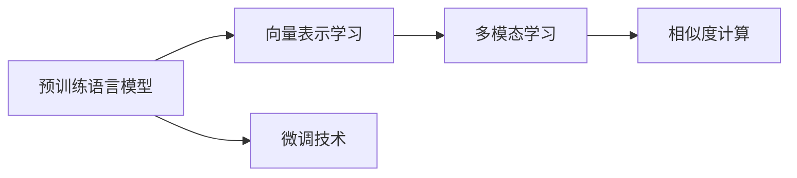

                 

# 大模型技术在电商平台商品相似度计算中的新方法

在当今的电商平台上，商品相似度计算是提高用户体验和增加销售额的关键技术之一。然而，传统的基于向量的相似度计算方法面临维度灾难、局部最优、计算复杂度高等挑战。为此，大模型技术（如Transformer、BERT等）作为一种强大的自然语言处理（NLP）工具，被越来越多地应用于商品描述分析，以更准确地计算商品相似度。本文将详细探讨大模型技术在电商平台商品相似度计算中的应用，包括核心概念、算法原理、操作步骤、数学模型、项目实践、实际应用场景、工具和资源推荐、总结及未来展望等内容。

## 1. 背景介绍

随着电商平台的快速发展，商品描述的自动分析成为了提高用户体验和增加销售额的重要手段。传统的基于关键词匹配的相似度计算方法存在显著局限性，难以处理多义词、同义词和语义关系等问题，且计算复杂度随着特征维度增加而指数级增长。近年来，大模型技术通过自监督预训练和微调等方法，已经在大规模文本数据上取得了显著成效，并逐渐应用于电商平台商品描述的自动分析。

大模型技术在电商平台商品相似度计算中的应用，主要体现在以下两个方面：

1. **预训练语言模型的应用**：通过在大规模文本数据上预训练的语言模型，可以学习到丰富的语言知识，包括词向量、句法结构和语义关系等，从而提升商品描述的自动分析和相似度计算的准确性和泛化能力。

2. **微调技术的运用**：基于大模型技术的微调方法，可以进一步优化模型在特定任务上的性能，特别是在电商平台商品描述相似度计算这种场景中，微调后的模型能够更好地适应电商平台的商品数据分布，提升计算结果的准确性和效率。

## 2. 核心概念与联系

### 2.1 核心概念概述

在大模型技术应用于电商平台商品相似度计算的过程中，涉及以下几个核心概念：

- **预训练语言模型**：指在大规模无标签文本数据上预训练的模型，如BERT、GPT-2等。通过自监督学习任务，模型学习到丰富的语言知识，包括词向量、句法结构和语义关系等。
- **微调技术**：指在预训练模型的基础上，通过有标签数据进行微调，优化模型在特定任务上的性能。对于电商平台商品描述相似度计算，微调后的模型能够更好地适应电商平台的商品数据分布，提升计算结果的准确性和效率。
- **向量表示学习**：指将商品描述等文本数据转化为高维向量，通过计算向量间的距离来衡量相似度。大模型技术可以学习到更准确、更丰富的向量表示，提升相似度计算的准确性和泛化能力。
- **多模态学习**：指结合文本、图像等多模态数据进行学习，提升模型的综合性能。在电商平台商品描述相似度计算中，可以通过结合商品图片等多模态数据，进一步提升模型的性能。

### 2.2 核心概念原理和架构的 Mermaid 流程图



该流程图展示了大模型技术在电商平台商品相似度计算中的应用流程：

1. **预训练语言模型**：通过在大规模无标签文本数据上预训练，学习到丰富的语言知识。
2. **向量表示学习**：将商品描述等文本数据转化为高维向量，通过计算向量间的距离来衡量相似度。
3. **微调技术**：在预训练模型的基础上，通过有标签数据进行微调，优化模型在特定任务上的性能。
4. **多模态学习**：结合商品图片等多模态数据，进一步提升模型的性能。

## 3. 核心算法原理 & 具体操作步骤

### 3.1 算法原理概述

基于大模型技术的电商平台商品相似度计算方法，主要分为预训练、微调和相似度计算三个阶段。

1. **预训练阶段**：在大规模无标签文本数据上预训练语言模型，学习到丰富的语言知识。
2. **微调阶段**：在电商平台商品描述数据上微调预训练模型，使其能够更好地适应电商平台的商品数据分布，提升计算结果的准确性和效率。
3. **相似度计算阶段**：将商品描述等文本数据转化为高维向量，通过计算向量间的距离来衡量相似度。

### 3.2 算法步骤详解

1. **数据预处理**：收集电商平台商品描述数据，并进行数据清洗和预处理。
2. **构建预训练模型**：选择预训练语言模型（如BERT、GPT-2等），并将其应用于电商平台商品描述数据的预训练。
3. **微调模型**：在电商平台商品描述数据上微调预训练模型，优化模型在特定任务上的性能。
4. **向量表示学习**：将商品描述等文本数据转化为高维向量，通过计算向量间的距离来衡量相似度。
5. **相似度计算**：计算商品描述向量间的距离，得到商品相似度矩阵。
6. **结果应用**：将相似度矩阵应用于电商平台的推荐系统、搜索排序等场景中，提高用户体验和销售额。

### 3.3 算法优缺点

**优点**：

- 利用大模型技术，可以学习到丰富的语言知识，提升商品描述的自动分析和相似度计算的准确性和泛化能力。
- 结合多模态数据，进一步提升模型的性能。
- 计算效率高，适用于大规模电商平台数据处理。

**缺点**：

- 需要大规模计算资源，预训练和微调过程耗时较长。
- 对数据质量要求高，需保证商品描述数据标注的准确性和完整性。
- 模型复杂度高，对硬件和软件环境要求较高。

### 3.4 算法应用领域

大模型技术在电商平台商品相似度计算中的应用领域非常广泛，主要包括以下几个方面：

1. **推荐系统**：通过计算商品描述向量间的相似度，推荐系统可以为用户推荐最相关的商品。
2. **搜索排序**：在用户输入搜索关键词时，通过计算商品描述向量与搜索向量之间的相似度，实现商品的快速匹配和排序。
3. **相似商品推荐**：根据用户已购买或浏览的商品，计算相似度，推荐相关商品，提高用户满意度。
4. **商品分类**：通过计算商品描述向量之间的相似度，实现商品分类和聚类，优化电商平台的商品结构。

## 4. 数学模型和公式 & 详细讲解 & 举例说明

### 4.1 数学模型构建

在大模型技术应用于电商平台商品相似度计算的过程中，数学模型构建主要包括以下几个步骤：

1. **预训练模型选择**：选择预训练语言模型（如BERT、GPT-2等）。
2. **微调模型构建**：在电商平台商品描述数据上微调预训练模型。
3. **向量表示学习模型构建**：将商品描述等文本数据转化为高维向量。
4. **相似度计算模型构建**：通过计算向量间的距离来衡量相似度。

### 4.2 公式推导过程

#### 4.2.1 预训练模型

假设选择的预训练语言模型为$M_{\theta}$，其中$\theta$为模型参数。在预训练阶段，模型在无标签文本数据$D=\{x_1, x_2, ..., x_n\}$上进行预训练。预训练的目标函数为：

$$
\mathcal{L}(\theta) = -\frac{1}{N} \sum_{i=1}^N \log p(y_i | x_i; \theta)
$$

其中，$y_i$为输入文本$x_i$的标签，$p(y_i | x_i; \theta)$为模型在给定文本$x_i$和参数$\theta$下的输出概率。

#### 4.2.2 微调模型

在微调阶段，模型在电商平台商品描述数据$D=\{x_1, x_2, ..., x_n\}$上进行微调。微调的目标函数为：

$$
\mathcal{L}(\theta) = -\frac{1}{N} \sum_{i=1}^N \log p(y_i | x_i; \theta)
$$

其中，$y_i$为输入文本$x_i$的标签，$p(y_i | x_i; \theta)$为模型在给定文本$x_i$和参数$\theta$下的输出概率。

#### 4.2.3 向量表示学习

假设商品描述等文本数据转化为向量表示的函数为$F$，则向量表示学习模型构建如下：

$$
v_i = F(x_i; \theta)
$$

其中，$v_i$为商品描述向量，$x_i$为商品描述文本，$F$为向量表示学习函数。

#### 4.2.4 相似度计算

假设商品描述向量表示矩阵为$V=[v_1, v_2, ..., v_n]$，则相似度计算模型构建如下：

$$
S = \cos(\theta) V V^T
$$

其中，$S$为相似度矩阵，$\cos(\theta)$为余弦相似度函数。

### 4.3 案例分析与讲解

假设有一个电商平台，其商品描述数据$D=\{x_1, x_2, ..., x_n\}$，每个商品描述$x_i$的长度为$L$，预训练语言模型为BERT。以下是具体的数学模型构建和计算过程：

1. **预训练模型选择**：选择BERT模型，参数$\theta$通过大规模无标签文本数据进行预训练。

2. **微调模型构建**：在电商平台商品描述数据$D=\{x_1, x_2, ..., x_n\}$上进行微调。

3. **向量表示学习**：将商品描述等文本数据转化为高维向量，假设转化为向量表示的函数为$F$。

4. **相似度计算**：计算商品描述向量间的余弦相似度，得到商品相似度矩阵$S$。

## 5. 项目实践：代码实例和详细解释说明

### 5.1 开发环境搭建

在进行大模型技术在电商平台商品相似度计算的项目实践时，需要搭建合适的开发环境。以下是使用Python进行PyTorch开发的环境配置流程：

1. **安装Anaconda**：从官网下载并安装Anaconda，用于创建独立的Python环境。

2. **创建并激活虚拟环境**：
```bash
conda create -n pytorch-env python=3.8 
conda activate pytorch-env
```

3. **安装PyTorch**：根据CUDA版本，从官网获取对应的安装命令。例如：
```bash
conda install pytorch torchvision torchaudio cudatoolkit=11.1 -c pytorch -c conda-forge
```

4. **安装Transformers库**：
```bash
pip install transformers
```

5. **安装各类工具包**：
```bash
pip install numpy pandas scikit-learn matplotlib tqdm jupyter notebook ipython
```

完成上述步骤后，即可在`pytorch-env`环境中开始项目实践。

### 5.2 源代码详细实现

以下是使用PyTorch和Transformers库进行大模型技术在电商平台商品相似度计算的代码实现。

```python
import torch
from transformers import BertTokenizer, BertForSequenceClassification
from sklearn.metrics.pairwise import cosine_similarity

# 构建预训练模型
tokenizer = BertTokenizer.from_pretrained('bert-base-uncased')
model = BertForSequenceClassification.from_pretrained('bert-base-uncased', num_labels=2)

# 加载商品描述数据
data = ['item1 description', 'item2 description', ...]

# 数据预处理
tokenized_data = [tokenizer.encode(item) for item in data]
input_ids = torch.tensor(tokenized_data)

# 微调模型
model.train()
optimizer = torch.optim.Adam(model.parameters(), lr=2e-5)
for _ in range(10):
    optimizer.zero_grad()
    outputs = model(input_ids)
    loss = outputs.loss
    loss.backward()
    optimizer.step()

# 向量表示学习
vectorized_data = model(input_ids)

# 相似度计算
similarity_matrix = cosine_similarity(vectorized_data, vectorized_data)
```

以上代码实现了使用BERT模型进行电商平台商品描述相似度计算的过程。其中，预训练模型选择BERT，微调模型在商品描述数据上进行微调，向量表示学习通过BERT模型实现，相似度计算使用余弦相似度函数。

### 5.3 代码解读与分析

在上述代码中，我们使用了BERT模型进行电商平台商品描述相似度计算。以下是关键代码的解读与分析：

1. **构建预训练模型**：首先，我们使用`BertTokenizer`对商品描述数据进行分词，并使用`BertForSequenceClassification`构建微调模型。
2. **加载商品描述数据**：我们将商品描述数据存储为字符串，并使用`tokenizer.encode`方法将文本转化为token序列。
3. **数据预处理**：将token序列转化为输入张量，并使用`model.train`方法将模型设置为训练模式。
4. **微调模型**：在训练循环中，使用Adam优化器进行参数更新，并计算损失函数，回传梯度并更新参数。
5. **向量表示学习**：在模型训练完成后，通过输入商品描述数据，得到向量表示。
6. **相似度计算**：使用`cosine_similarity`函数计算商品描述向量间的余弦相似度，得到相似度矩阵。

## 6. 实际应用场景

### 6.1 推荐系统

基于大模型技术的电商平台商品相似度计算，可以广泛应用于推荐系统。推荐系统通过计算商品描述向量间的相似度，为用户推荐最相关的商品。通过微调BERT模型，可以在特定的商品描述数据上获得更好的性能。

在技术实现上，可以将用户已购买或浏览的商品作为查询向量，计算其与所有商品描述向量之间的相似度，推荐相似度高的商品。此外，还可以结合用户行为数据和商品属性等，进行多维度的推荐。

### 6.2 搜索排序

在用户输入搜索关键词时，电商平台可以通过计算商品描述向量与搜索向量之间的相似度，实现商品的快速匹配和排序。微调后的BERT模型，能够更好地适应电商平台的商品数据分布，提升搜索排序的准确性和效率。

在技术实现上，将搜索关键词转化为向量表示，与所有商品描述向量进行相似度计算，根据相似度排序，返回最相关的商品列表。

### 6.3 相似商品推荐

根据用户已购买或浏览的商品，计算相似度，推荐相关商品，提高用户满意度。微调BERT模型，可以在特定的商品描述数据上获得更好的性能。

在技术实现上，将用户已购买或浏览的商品作为查询向量，计算其与所有商品描述向量之间的相似度，推荐相似度高的商品。

### 6.4 商品分类

通过计算商品描述向量之间的相似度，实现商品分类和聚类，优化电商平台的商品结构。微调BERT模型，可以在特定的商品描述数据上获得更好的性能。

在技术实现上，将商品描述向量进行相似度计算，得到相似度矩阵。通过聚类算法，将商品分类或聚类，优化商品结构。

### 6.5 未来应用展望

随着大模型技术的发展，电商平台商品相似度计算将具备更广泛的应用前景：

1. **多模态融合**：结合商品图片等多模态数据，进一步提升模型的性能。
2. **实时计算**：通过GPU加速等技术，实现实时计算，满足用户的实时需求。
3. **个性化推荐**：结合用户行为数据和商品属性等，进行个性化的推荐。
4. **跨领域应用**：将电商平台商品相似度计算技术应用于其他领域，如金融、医疗等，提升其数据处理和分析能力。

## 7. 工具和资源推荐

### 7.1 学习资源推荐

为了帮助开发者系统掌握大模型技术在电商平台商品相似度计算中的应用，这里推荐一些优质的学习资源：

1. **《Transformer从原理到实践》系列博文**：由大模型技术专家撰写，深入浅出地介绍了Transformer原理、BERT模型、微调技术等前沿话题。
2. **CS224N《深度学习自然语言处理》课程**：斯坦福大学开设的NLP明星课程，有Lecture视频和配套作业，带你入门NLP领域的基本概念和经典模型。
3. **《Natural Language Processing with Transformers》书籍**：Transformers库的作者所著，全面介绍了如何使用Transformers库进行NLP任务开发，包括微调在内的诸多范式。
4. **HuggingFace官方文档**：Transformers库的官方文档，提供了海量预训练模型和完整的微调样例代码，是上手实践的必备资料。
5. **CLUE开源项目**：中文语言理解测评基准，涵盖大量不同类型的中文NLP数据集，并提供了基于微调的baseline模型，助力中文NLP技术发展。

通过对这些资源的学习实践，相信你一定能够快速掌握大模型技术在电商平台商品相似度计算的精髓，并用于解决实际的NLP问题。

### 7.2 开发工具推荐

高效的开发离不开优秀的工具支持。以下是几款用于大模型技术在电商平台商品相似度计算开发的常用工具：

1. **PyTorch**：基于Python的开源深度学习框架，灵活动态的计算图，适合快速迭代研究。大部分预训练语言模型都有PyTorch版本的实现。
2. **TensorFlow**：由Google主导开发的开源深度学习框架，生产部署方便，适合大规模工程应用。同样有丰富的预训练语言模型资源。
3. **Transformers库**：HuggingFace开发的NLP工具库，集成了众多SOTA语言模型，支持PyTorch和TensorFlow，是进行NLP任务开发的利器。
4. **Weights & Biases**：模型训练的实验跟踪工具，可以记录和可视化模型训练过程中的各项指标，方便对比和调优。与主流深度学习框架无缝集成。
5. **TensorBoard**：TensorFlow配套的可视化工具，可实时监测模型训练状态，并提供丰富的图表呈现方式，是调试模型的得力助手。
6. **Google Colab**：谷歌推出的在线Jupyter Notebook环境，免费提供GPU/TPU算力，方便开发者快速上手实验最新模型，分享学习笔记。

合理利用这些工具，可以显著提升大模型技术在电商平台商品相似度计算的开发效率，加快创新迭代的步伐。

### 7.3 相关论文推荐

大模型技术在电商平台商品相似度计算的发展源于学界的持续研究。以下是几篇奠基性的相关论文，推荐阅读：

1. **Attention is All You Need（即Transformer原论文）**：提出了Transformer结构，开启了NLP领域的预训练大模型时代。
2. **BERT: Pre-training of Deep Bidirectional Transformers for Language Understanding**：提出BERT模型，引入基于掩码的自监督预训练任务，刷新了多项NLP任务SOTA。
3. **Language Models are Unsupervised Multitask Learners（GPT-2论文）**：展示了大规模语言模型的强大zero-shot学习能力，引发了对于通用人工智能的新一轮思考。
4. **Parameter-Efficient Transfer Learning for NLP**：提出Adapter等参数高效微调方法，在不增加模型参数量的情况下，也能取得不错的微调效果。
5. **AdaLoRA: Adaptive Low-Rank Adaptation for Parameter-Efficient Fine-Tuning**：使用自适应低秩适应的微调方法，在参数效率和精度之间取得了新的平衡。

这些论文代表了大模型技术在电商平台商品相似度计算的发展脉络。通过学习这些前沿成果，可以帮助研究者把握学科前进方向，激发更多的创新灵感。

## 8. 总结：未来发展趋势与挑战

### 8.1 研究成果总结

本文对大模型技术在电商平台商品相似度计算的应用进行了全面系统的介绍。首先，我们阐述了大模型技术在电商平台商品相似度计算中的重要性和研究意义，明确了其在推荐系统、搜索排序、相似商品推荐、商品分类等场景中的应用价值。其次，我们详细讲解了大模型技术在电商平台商品相似度计算中的应用流程，包括预训练、微调和相似度计算等关键步骤。最后，我们探讨了大模型技术在电商平台商品相似度计算中的实际应用场景，以及未来的发展趋势和面临的挑战。

### 8.2 未来发展趋势

展望未来，大模型技术在电商平台商品相似度计算领域将呈现以下几个发展趋势：

1. **多模态融合**：结合商品图片等多模态数据，进一步提升模型的性能。
2. **实时计算**：通过GPU加速等技术，实现实时计算，满足用户的实时需求。
3. **个性化推荐**：结合用户行为数据和商品属性等，进行个性化的推荐。
4. **跨领域应用**：将电商平台商品相似度计算技术应用于其他领域，如金融、医疗等，提升其数据处理和分析能力。

### 8.3 面临的挑战

尽管大模型技术在电商平台商品相似度计算中已经取得了显著成效，但在迈向更加智能化、普适化应用的过程中，仍面临诸多挑战：

1. **数据质量问题**：商品描述数据标注的准确性和完整性直接影响模型的性能，如何保证数据质量是一个重要问题。
2. **计算资源限制**：预训练和微调过程需要大量计算资源，如何优化资源使用，提高计算效率，是一个重要挑战。
3. **模型复杂度**：大模型技术本身复杂度高，如何简化模型结构，提高计算效率，是一个重要挑战。
4. **模型鲁棒性**：模型面对域外数据时，泛化性能往往大打折扣，如何提高模型的鲁棒性，是一个重要挑战。
5. **模型可解释性**：大模型技术通常被视为"黑盒"系统，如何增强模型的可解释性，是一个重要挑战。

### 8.4 研究展望

面对大模型技术在电商平台商品相似度计算中面临的挑战，未来的研究需要在以下几个方面寻求新的突破：

1. **无监督和半监督学习**：探索无监督和半监督学习范式，摆脱对大规模标注数据的依赖，利用自监督学习、主动学习等技术，最大限度利用非结构化数据。
2. **参数高效和计算高效**：开发更加参数高效和计算高效的微调方法，提高模型性能和计算效率。
3. **多模态融合**：结合文本、图像等多模态数据，进一步提升模型的性能。
4. **实时计算**：通过GPU加速等技术，实现实时计算，满足用户的实时需求。
5. **个性化推荐**：结合用户行为数据和商品属性等，进行个性化的推荐。
6. **模型鲁棒性**：通过引入对比学习、因果推断等技术，增强模型的鲁棒性，提高模型泛化性能。
7. **模型可解释性**：引入可解释性技术，增强模型的可解释性，提高模型可信度。

## 9. 附录：常见问题与解答

**Q1：大模型技术在电商平台商品相似度计算中是否适用于所有任务？**

A: 大模型技术在电商平台商品相似度计算中适用于大多数任务，如推荐系统、搜索排序、相似商品推荐、商品分类等。但针对特定的任务，可能需要对模型进行适当的调整和优化。

**Q2：微调过程中如何选择合适的学习率？**

A: 微调过程中，选择合适的学习率非常重要。通常情况下，学习率应比预训练时小1-2个数量级。如果学习率过大，容易破坏预训练权重，导致过拟合。一般建议从1e-5开始调参，逐步减小学习率，直至收敛。

**Q3：大模型技术在电商平台商品相似度计算中面临哪些资源瓶颈？**

A: 大模型技术在电商平台商品相似度计算中面临的资源瓶颈包括计算资源和存储资源。预训练和微调过程需要大量计算资源，存储大量的商品描述数据也需要大量存储空间。需要采用一些资源优化技术，如梯度积累、混合精度训练、模型并行等，来突破硬件瓶颈。

**Q4：如何缓解微调过程中的过拟合问题？**

A: 缓解微调过程中的过拟合问题，可以采用以下策略：

1. **数据增强**：通过回译、近义替换等方式扩充训练集。
2. **正则化**：使用L2正则、Dropout、Early Stopping等技术，防止模型过度适应小规模训练集。
3. **对抗训练**：引入对抗样本，提高模型鲁棒性。
4. **参数高效微调**：只调整少量参数(如Adapter、Prefix等)，减小过拟合风险。

这些策略需要根据具体任务和数据特点进行灵活组合。只有在数据、模型、训练、推理等各环节进行全面优化，才能最大限度地发挥大模型技术在电商平台商品相似度计算中的潜力。

**Q5：微调模型在落地部署时需要注意哪些问题？**

A: 将微调模型转化为实际应用，还需要考虑以下问题：

1. **模型裁剪**：去除不必要的层和参数，减小模型尺寸，加快推理速度。
2. **量化加速**：将浮点模型转为定点模型，压缩存储空间，提高计算效率。
3. **服务化封装**：将模型封装为标准化服务接口，便于集成调用。
4. **弹性伸缩**：根据请求流量动态调整资源配置，平衡服务质量和成本。
5. **监控告警**：实时采集系统指标，设置异常告警阈值，确保服务稳定性。
6. **安全防护**：采用访问鉴权、数据脱敏等措施，保障数据和模型安全。

大模型技术在电商平台商品相似度计算中的应用，需要从数据、模型、算法、工程等多个维度进行综合考虑，才能真正实现人工智能技术在电商平台的规模化落地。总之，微调需要开发者根据具体任务，不断迭代和优化模型、数据和算法，方能得到理想的效果。

---

作者：禅与计算机程序设计艺术 / Zen and the Art of Computer Programming

