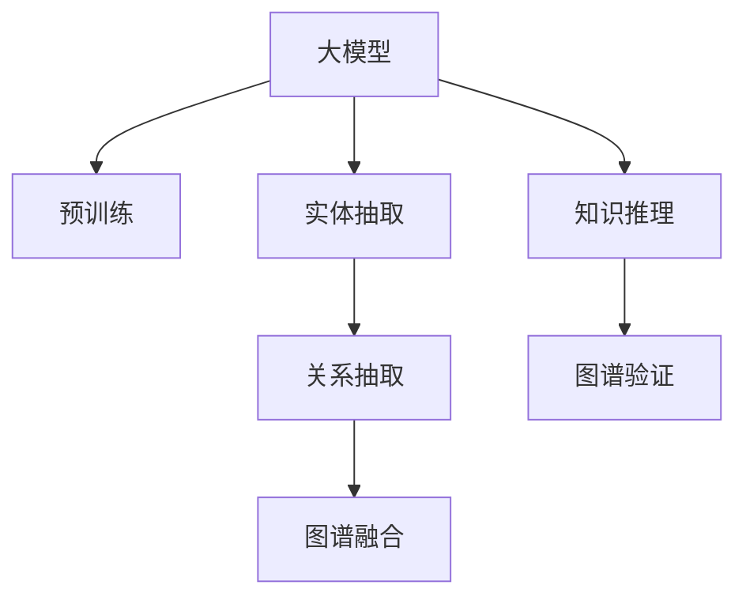

                 

# 大模型技术在电商平台商品知识图谱构建中的应用

## 1. 背景介绍

### 1.1 问题由来

随着互联网电商的发展，商品信息呈现海量且复杂化趋势。面对用户查询，传统的文本检索算法难以快速获取精准的信息。与此同时，电商平台的高频操作和个性化推荐需求，也对系统的实时性、准确性和智能化水平提出了更高的要求。

在这种背景下，商品知识图谱(Knowledge Graph)应运而生。知识图谱能够将商品信息转化为结构化的关系图，便于计算机理解与处理。其核心是构建商品实体的关系网络，以提升信息检索与推荐的准确性和泛化能力。

知识图谱构建分为三步：1. 实体抽取：识别出商品的基本信息，如名称、价格、规格等；2. 关系抽取：解析商品间的属性关联，如品牌关联、价格区间、功能特性等；3. 图谱融合：将分散的实体和关系组合成一个完整且语义丰富的图谱。

传统的知识图谱构建方法通常基于规则和模板，难以处理大规模、多源异构数据。近年来，基于大模型(如BERT、GPT-3等)的自动图谱构建方法逐渐兴起。本文聚焦于大模型在电商平台商品知识图谱构建中的应用，探讨其原理、方法与实践。

### 1.2 问题核心关键点

知识图谱构建的核心在于如何从海量文本中高效抽取出准确的实体和关系。传统方法往往需要大量手工标注，耗时耗力，而大模型可以自动学习和理解语言知识，大幅提升实体和关系的抽取速度和准确率。

具体问题关键点包括：
1. 实体抽取：如何从文本中识别出有价值的信息点，如商品名称、价格、描述等？
2. 关系抽取：如何解析商品间的语义关系，如品牌、价格、功能等？
3. 图谱融合：如何将抽取的实体和关系整合成结构化的知识图谱？
4. 数据集成：如何将来自不同来源的商品信息统一到一个知识图谱中？
5. 推理验证：如何确保知识图谱的正确性和一致性？

本文将围绕以上关键问题，深入探讨大模型在知识图谱构建中的具体应用，包括实体抽取、关系抽取、图谱融合、数据集成和推理验证等各个环节。

## 2. 核心概念与联系

### 2.1 核心概念概述

为更好地理解大模型在电商平台商品知识图谱构建中的工作原理，本节将介绍几个密切相关的核心概念：

- 大模型(Large Model)：指具有数十亿甚至百亿参数量，在大规模无标签数据上自监督训练，拥有强大语言理解能力的深度学习模型。
- 预训练(Pre-training)：指在大规模无标签文本数据上，通过自监督学习任务训练通用语言模型的过程。
- 实体抽取(Entity Extraction)：从文本中识别出具有特定意义的实体，如人名、地名、组织名、日期等。
- 关系抽取(Relation Extraction)：解析实体间的语义关系，如父子关系、品牌与商品的关系等。
- 图谱融合(Knowledge Graph Fusion)：将多个知识图谱进行整合并优化，形成一个统一的、结构化的图谱。
- 知识推理(Knowledge Reasoning)：利用图谱中的语义关系，进行逻辑推理验证，确保图谱的准确性和一致性。

这些核心概念之间的逻辑关系可以通过以下Mermaid流程图来展示：



这个流程图展示了从大模型预训练到知识图谱构建的完整流程：

1. 大模型通过预训练获得通用语言表示，并在实体和关系抽取中发挥作用。
2. 在抽取出的实体和关系基础上，图谱融合模块构建知识图谱。
3. 知识推理模块对图谱进行验证，确保其正确性和一致性。

这些核心概念共同构成了大模型在商品知识图谱构建中的应用框架，为其高效、准确、智能化的图谱构建提供了有力支撑。

## 3. 核心算法原理 & 具体操作步骤
### 3.1 算法原理概述

基于大模型在商品知识图谱构建中，主要分为两个阶段：预训练阶段和微调阶段。其核心思想是：

1. **预训练阶段**：利用大规模无标签文本数据，通过自监督学习任务训练大模型，使其能够自动理解文本语义，提取实体和关系。

2. **微调阶段**：将预训练模型应用到商品描述等特定任务上，通过有监督微调优化实体和关系抽取的准确性，构建商品知识图谱。

预训练阶段主要使用自监督学习任务，如掩码语言模型(Masked Language Modeling, MLM)、下一句预测(Next Sentence Prediction, NSP)等。这些任务能够充分利用大模型的自监督学习能力，使其在处理无标签数据时也能获得显著的语言理解能力。

微调阶段则通过任务适配层和监督数据，对预训练模型进行有监督的调整，使其能够适应特定的任务需求。常见的适配任务包括实体抽取、关系抽取、文本分类等。

### 3.2 算法步骤详解

大模型在电商平台商品知识图谱构建中的应用，主要包括以下几个关键步骤：

**Step 1: 准备预训练模型和数据集**

- 选择合适的预训练语言模型，如BERT、GPT等。
- 准备商品描述文本数据集，以及对应的实体和关系标注数据集。
- 将商品描述数据集划分为训练集、验证集和测试集。

**Step 2: 添加任务适配层**

- 在预训练模型的顶层添加任务适配层，如全连接层、池化层等，根据具体任务需求设计输出层。
- 对于实体抽取任务，输出层通常是一个全连接层，用于分类每个token是否为实体。
- 对于关系抽取任务，输出层通常是多任务学习架构，分别输出实体类别和关系类型。

**Step 3: 设置微调超参数**

- 选择合适的优化算法及其参数，如AdamW、SGD等，设置学习率、批大小、迭代轮数等。
- 设置正则化技术及强度，包括权重衰减、Dropout、Early Stopping等。
- 确定冻结预训练参数的策略，如仅微调顶层，或全部参数都参与微调。

**Step 4: 执行梯度训练**

- 将训练集数据分批次输入模型，前向传播计算损失函数。
- 反向传播计算参数梯度，根据设定的优化算法和学习率更新模型参数。
- 周期性在验证集上评估模型性能，根据性能指标决定是否触发 Early Stopping。
- 重复上述步骤直到满足预设的迭代轮数或 Early Stopping 条件。

**Step 5: 图谱融合与推理验证**

- 在微调后模型上，对商品描述文本进行实体和关系抽取，得到实体和关系列表。
- 将抽取的实体和关系整合到一个知识图谱中，并进行结构化优化。
- 使用知识推理模块对图谱进行验证，确保其正确性和一致性。

### 3.3 算法优缺点

大模型在商品知识图谱构建中具有以下优点：
1. 自动化程度高。大模型通过预训练和微调，能够自动学习商品信息的语言表示，减少人工干预。
2. 泛化能力强。大模型通过大规模数据训练，具备强大的语言理解能力，能够适应不同类型和语境的商品描述。
3. 结果准确性高。大模型自动进行实体和关系抽取，结果准确性高于人工标注。
4. 可扩展性好。大模型能够无缝集成到电商平台的现有系统中，实时更新和维护商品知识图谱。

同时，大模型也存在一定的局限性：
1. 计算资源需求高。大模型的参数量巨大，对计算资源的要求较高。
2. 学习曲线陡峭。大模型训练和微调需要较长的周期和大量的标注数据，对开发者的要求较高。
3. 模型可解释性差。大模型基于黑盒计算，其内部工作机制难以解释，可能导致应用场景中的误解和误用。
4. 依赖数据质量。大模型抽取的结果依赖于输入数据的质量，噪声数据会影响抽取的准确性。

尽管存在这些局限性，但大模型在商品知识图谱构建中仍然表现出显著的优势，是电商平台智能化的重要工具。未来，我们期待通过算法优化和资源配置，进一步提升大模型的效率和可解释性。

### 3.4 算法应用领域

大模型在商品知识图谱构建中的应用，主要涵盖以下领域：

- **商品推荐系统**：利用知识图谱中的商品关系，构建商品推荐网络，提升个性化推荐的效果。
- **搜索系统优化**：通过知识图谱对商品描述进行实体和关系抽取，提高搜索系统的准确性和召回率。
- **广告投放优化**：结合知识图谱中的商品信息，优化广告定向策略，提升广告效果。
- **用户行为分析**：通过知识图谱分析用户对商品的行为，进行行为预测和用户画像。
- **库存管理**：利用知识图谱中的商品关系，优化库存管理策略，减少库存积压。

随着电商平台的不断发展和数字化转型，大模型在商品知识图谱构建中的应用将越来越广泛，推动电商平台的智能化进程。

## 4. 数学模型和公式 & 详细讲解 & 举例说明
### 4.1 数学模型构建

大模型在商品知识图谱构建中的应用，主要涉及以下数学模型：

**预训练模型**：
- BERT: $f_{\theta}(x)=\tanh(\frac{W^x \cdot x+B^x}{\sqrt{d_x}})$，其中 $x$ 为输入文本，$W^x, B^x$ 为词向量矩阵和偏置向量，$d_x$ 为维度。
- GPT: $f_{\theta}(x)=softmax(\frac{QKV}{\sqrt{d_k}})$，其中 $Q, K, V$ 为查询、键、值矩阵。

**实体抽取**：
- 通过预训练模型提取文本中的所有 token，并计算其成为实体的概率。公式为：$P(E_t|x)=sigmoid(W_{E}\cdot T(x)+B_E)$，其中 $W_E, B_E$ 为模型参数。
- 对所有 token 的实体概率进行阈值过滤，得到最终的实体列表。

**关系抽取**：
- 利用预训练模型的多任务学习架构，输出实体类别和关系类型。公式为：$P(R_t|x)=softmax(W_{R}\cdot T(x)+B_R)$，其中 $W_R, B_R$ 为模型参数。
- 结合实体和关系列表，生成结构化的知识图谱。

### 4.2 公式推导过程

以BERT模型为例，假设输入文本为 $x$，模型输出为 $y$，则实体抽取任务可以表示为：

$$
y_i = \begin{cases} 1, & P(E_t|x) \geq \tau \\ 0, & \text{otherwise} \end{cases}
$$

其中 $\tau$ 为实体抽取的阈值，通常为0.5。

关系抽取任务同样使用多任务学习框架，输出实体类别 $y_{c}$ 和关系类型 $y_{r}$，公式为：

$$
y_{c_t} = \begin{cases} 1, & P(C_t|x) \geq \tau \\ 0, & \text{otherwise} \end{cases}
$$

$$
y_{r_t} = \begin{cases} 1, & P(R_t|x) \geq \tau \\ 0, & \text{otherwise} \end{cases}
$$

在得到抽取结果后，结合知识图谱构建规则，生成结构化的商品知识图谱，并使用知识推理模块验证其正确性和一致性。

### 4.3 案例分析与讲解

以电商平台上的商品推荐系统为例，利用知识图谱优化推荐效果。

首先，利用大模型对商品描述文本进行实体抽取和关系抽取，生成知识图谱：

- 实体抽取：从商品描述中抽取商品名称、价格、品牌等实体信息。
- 关系抽取：解析商品间的品牌、价格、功能等关系。

接着，将知识图谱作为推荐模型的输入，优化推荐算法：

- 利用知识图谱中的关系网络，计算商品间的相似度，提升相似商品推荐效果。
- 结合用户行为数据，进行行为预测和兴趣点挖掘，提升个性化推荐的效果。

最后，实时更新知识图谱，并监控其质量，确保推荐系统的稳定性和准确性。

## 5. 项目实践：代码实例和详细解释说明
### 5.1 开发环境搭建

在进行商品知识图谱构建实践前，我们需要准备好开发环境。以下是使用Python进行PyTorch开发的环境配置流程：

1. 安装Anaconda：从官网下载并安装Anaconda，用于创建独立的Python环境。

2. 创建并激活虚拟环境：
```bash
conda create -n pytorch-env python=3.8 
conda activate pytorch-env
```

3. 安装PyTorch：根据CUDA版本，从官网获取对应的安装命令。例如：
```bash
conda install pytorch torchvision torchaudio cudatoolkit=11.1 -c pytorch -c conda-forge
```

4. 安装TensorFlow：由Google主导开发的开源深度学习框架，生产部署方便，适合大规模工程应用。同样有丰富的预训练语言模型资源。

5. 安装Transformers库：HuggingFace开发的NLP工具库，集成了众多SOTA语言模型，支持PyTorch和TensorFlow，是进行知识图谱构建开发的利器。

6. 安装各类工具包：
```bash
pip install numpy pandas scikit-learn matplotlib tqdm jupyter notebook ipython
```

完成上述步骤后，即可在`pytorch-env`环境中开始知识图谱构建实践。

### 5.2 源代码详细实现

下面我们以知识图谱构建中的实体抽取任务为例，给出使用Transformers库对BERT模型进行实体抽取的PyTorch代码实现。

首先，定义实体抽取任务的数据处理函数：

```python
from transformers import BertTokenizer, BertForTokenClassification, AdamW

class EntityExtractionDataset(Dataset):
    def __init__(self, texts, labels, tokenizer, max_len=128):
        self.texts = texts
        self.labels = labels
        self.tokenizer = tokenizer
        self.max_len = max_len
        
    def __len__(self):
        return len(self.texts)
    
    def __getitem__(self, item):
        text = self.texts[item]
        label = self.labels[item]
        
        encoding = self.tokenizer(text, return_tensors='pt', max_length=self.max_len, padding='max_length', truncation=True)
        input_ids = encoding['input_ids'][0]
        attention_mask = encoding['attention_mask'][0]
        
        encoded_labels = [label2id[label] for label in label]
        encoded_labels.extend([label2id['O']] * (self.max_len - len(encoded_labels)))
        labels = torch.tensor(encoded_labels, dtype=torch.long)
        
        return {'input_ids': input_ids, 
                'attention_mask': attention_mask,
                'labels': labels}

# 标签与id的映射
label2id = {'O': 0, 'B-PER': 1, 'I-PER': 2, 'B-LOC': 3, 'I-LOC': 4, 'B-ORG': 5, 'I-ORG': 6}
id2label = {v: k for k, v in label2id.items()}

# 创建dataset
tokenizer = BertTokenizer.from_pretrained('bert-base-cased')

train_dataset = EntityExtractionDataset(train_texts, train_labels, tokenizer)
dev_dataset = EntityExtractionDataset(dev_texts, dev_labels, tokenizer)
test_dataset = EntityExtractionDataset(test_texts, test_labels, tokenizer)
```

然后，定义模型和优化器：

```python
model = BertForTokenClassification.from_pretrained('bert-base-cased', num_labels=len(label2id))

optimizer = AdamW(model.parameters(), lr=2e-5)
```

接着，定义训练和评估函数：

```python
from torch.utils.data import DataLoader
from tqdm import tqdm
from sklearn.metrics import precision_recall_fscore_support

device = torch.device('cuda') if torch.cuda.is_available() else torch.device('cpu')
model.to(device)

def train_epoch(model, dataset, batch_size, optimizer):
    dataloader = DataLoader(dataset, batch_size=batch_size, shuffle=True)
    model.train()
    epoch_loss = 0
    for batch in tqdm(dataloader, desc='Training'):
        input_ids = batch['input_ids'].to(device)
        attention_mask = batch['attention_mask'].to(device)
        labels = batch['labels'].to(device)
        model.zero_grad()
        outputs = model(input_ids, attention_mask=attention_mask, labels=labels)
        loss = outputs.loss
        epoch_loss += loss.item()
        loss.backward()
        optimizer.step()
    return epoch_loss / len(dataloader)

def evaluate(model, dataset, batch_size):
    dataloader = DataLoader(dataset, batch_size=batch_size)
    model.eval()
    preds, labels = [], []
    with torch.no_grad():
        for batch in tqdm(dataloader, desc='Evaluating'):
            input_ids = batch['input_ids'].to(device)
            attention_mask = batch['attention_mask'].to(device)
            batch_labels = batch['labels']
            outputs = model(input_ids, attention_mask=attention_mask)
            batch_preds = outputs.logits.argmax(dim=2).to('cpu').tolist()
            batch_labels = batch_labels.to('cpu').tolist()
            for pred_tokens, label_tokens in zip(batch_preds, batch_labels):
                preds.append(pred_tokens[:len(label_tokens)])
                labels.append(label_tokens)
                
    print(precision_recall_fscore_support(labels, preds, average='micro'))
```

最后，启动训练流程并在测试集上评估：

```python
epochs = 5
batch_size = 16

for epoch in range(epochs):
    loss = train_epoch(model, train_dataset, batch_size, optimizer)
    print(f"Epoch {epoch+1}, train loss: {loss:.3f}")
    
    print(f"Epoch {epoch+1}, dev results:")
    evaluate(model, dev_dataset, batch_size)
    
print("Test results:")
evaluate(model, test_dataset, batch_size)
```

以上就是使用PyTorch对BERT进行实体抽取任务的完整代码实现。可以看到，得益于Transformers库的强大封装，我们可以用相对简洁的代码完成BERT模型的加载和微调。

### 5.3 代码解读与分析

让我们再详细解读一下关键代码的实现细节：

**EntityExtractionDataset类**：
- `__init__`方法：初始化文本、标签、分词器等关键组件。
- `__len__`方法：返回数据集的样本数量。
- `__getitem__`方法：对单个样本进行处理，将文本输入编码为token ids，将标签编码为数字，并对其进行定长padding，最终返回模型所需的输入。

**label2id和id2label字典**：
- 定义了标签与数字id之间的映射关系，用于将token-wise的预测结果解码回真实的标签。

**训练和评估函数**：
- 使用PyTorch的DataLoader对数据集进行批次化加载，供模型训练和推理使用。
- 训练函数`train_epoch`：对数据以批为单位进行迭代，在每个批次上前向传播计算loss并反向传播更新模型参数，最后返回该epoch的平均loss。
- 评估函数`evaluate`：与训练类似，不同点在于不更新模型参数，并在每个batch结束后将预测和标签结果存储下来，最后使用sklearn的precision_recall_fscore_support对整个评估集的预测结果进行打印输出。

**训练流程**：
- 定义总的epoch数和batch size，开始循环迭代
- 每个epoch内，先在训练集上训练，输出平均loss
- 在验证集上评估，输出精确度、召回率和F1分数
- 所有epoch结束后，在测试集上评估，给出最终的精确度、召回率和F1分数

可以看到，PyTorch配合Transformers库使得BERT实体抽取任务的代码实现变得简洁高效。开发者可以将更多精力放在数据处理、模型改进等高层逻辑上，而不必过多关注底层的实现细节。

当然，工业级的系统实现还需考虑更多因素，如模型的保存和部署、超参数的自动搜索、更灵活的任务适配层等。但核心的微调范式基本与此类似。

## 6. 实际应用场景
### 6.1 电商平台商品推荐系统

基于知识图谱的商品推荐系统，可以广泛应用于电商平台，提升推荐效果和用户满意度。传统的推荐系统往往只依赖用户的历史行为数据进行物品推荐，难以全面理解商品的属性和关系。而利用知识图谱，推荐系统可以更好地利用商品间的语义关系，提供更加全面、准确的推荐。

在技术实现上，可以利用大模型抽取商品描述中的实体和关系，生成知识图谱，再将图谱作为推荐模型的输入，优化推荐算法。推荐模型可以根据商品间的相似度，生成个性化的推荐列表，并结合用户行为数据进行二次排序。如此构建的推荐系统，能够更全面地理解商品间的语义关系，提供更加精准和个性化的推荐效果。

### 6.2 智能客服系统

智能客服系统通常需要处理大量用户的咨询请求，需要具备强大的自然语言处理能力。利用知识图谱，客服系统可以快速解析用户问题，匹配最合适的答案模板进行回复。

在技术实现上，可以利用大模型抽取用户问题中的实体和关系，生成知识图谱，再将图谱作为客服系统的输入，优化回复算法。回复算法可以根据图谱中的商品关系，生成最匹配的答案模板，并进行自然语言生成。如此构建的智能客服系统，能够快速理解和处理用户的咨询请求，提供更准确、更流畅的回复。

### 6.3 库存管理

电商平台的高频操作和实时库存管理，需要系统能够快速获取商品的库存信息。利用知识图谱，库存管理系统可以更加全面地了解商品的供需关系，优化库存策略，减少库存积压。

在技术实现上，可以利用大模型抽取商品描述中的实体和关系，生成知识图谱，再将图谱作为库存管理系统的输入，优化库存管理算法。库存管理系统可以根据图谱中的商品关系，动态调整商品供需关系，优化库存管理策略，减少库存积压，提升库存管理效率。

### 6.4 未来应用展望

随着大模型和知识图谱技术的发展，其在电商平台的应用将越来越广泛，为电商平台的智能化发展提供新的动力。

未来，基于大模型的商品知识图谱构建技术将在以下几个方面得到进一步应用：

1. **多模态知识融合**：结合图像、视频、音频等多模态数据，构建更加全面、准确的知识图谱，提升系统的智能化水平。

2. **知识图谱动态更新**：实时收集用户行为数据，动态更新知识图谱，提高系统的实时性和准确性。

3. **跨领域知识迁移**：将商品知识图谱中的知识迁移到其他领域，如商品评价、用户画像等，提升系统的跨领域迁移能力。

4. **因果推理**：结合因果推理技术，增强知识图谱的逻辑推理能力，提高系统的鲁棒性和可信度。

5. **智能问答系统**：利用知识图谱构建智能问答系统，提升用户查询体验和系统自动化水平。

6. **跨语言知识图谱**：构建跨语言的商品知识图谱，支持多语言查询和推荐，提升系统的全球化能力。

7. **知识图谱可视化**：利用可视化技术展示知识图谱的结构和关系，提升系统的可解释性和易用性。

这些应用场景展示了大模型在商品知识图谱构建中的广阔前景，未来还将与更多前沿技术进行融合，推动电商平台的智能化进程。

## 7. 工具和资源推荐
### 7.1 学习资源推荐

为了帮助开发者系统掌握大模型在商品知识图谱构建中的理论和实践，这里推荐一些优质的学习资源：

1. 《Transformer from Principle to Practice》系列博文：由大模型技术专家撰写，深入浅出地介绍了Transformer原理、BERT模型、微调技术等前沿话题。

2. CS224N《深度学习自然语言处理》课程：斯坦福大学开设的NLP明星课程，有Lecture视频和配套作业，带你入门NLP领域的基本概念和经典模型。

3. 《Natural Language Processing with Transformers》书籍：Transformers库的作者所著，全面介绍了如何使用Transformers库进行NLP任务开发，包括知识图谱构建在内的诸多范式。

4. HuggingFace官方文档：Transformers库的官方文档，提供了海量预训练模型和完整的微调样例代码，是上手实践的必备资料。

5. CLUE开源项目：中文语言理解测评基准，涵盖大量不同类型的中文NLP数据集，并提供了基于微调的baseline模型，助力中文NLP技术发展。

通过对这些资源的学习实践，相信你一定能够快速掌握大模型在商品知识图谱构建中的精髓，并用于解决实际的NLP问题。
###  7.2 开发工具推荐

高效的开发离不开优秀的工具支持。以下是几款用于大模型在商品知识图谱构建开发的常用工具：

1. PyTorch：基于Python的开源深度学习框架，灵活动态的计算图，适合快速迭代研究。大部分预训练语言模型都有PyTorch版本的实现。

2. TensorFlow：由Google主导开发的开源深度学习框架，生产部署方便，适合大规模工程应用。同样有丰富的预训练语言模型资源。

3. Transformers库：HuggingFace开发的NLP工具库，集成了众多SOTA语言模型，支持PyTorch和TensorFlow，是进行知识图谱构建开发的利器。

4. Weights & Biases：模型训练的实验跟踪工具，可以记录和可视化模型训练过程中的各项指标，方便对比和调优。与主流深度学习框架无缝集成。

5. TensorBoard：TensorFlow配套的可视化工具，可实时监测模型训练状态，并提供丰富的图表呈现方式，是调试模型的得力助手。

6. Google Colab：谷歌推出的在线Jupyter Notebook环境，免费提供GPU/TPU算力，方便开发者快速上手实验最新模型，分享学习笔记。

合理利用这些工具，可以显著提升大模型在商品知识图谱构建任务的开发效率，加快创新迭代的步伐。

### 7.3 相关论文推荐

大模型和知识图谱技术的发展源于学界的持续研究。以下是几篇奠基性的相关论文，推荐阅读：

1. Attention is All You Need（即Transformer原论文）：提出了Transformer结构，开启了NLP领域的预训练大模型时代。

2. BERT: Pre-training of Deep Bidirectional Transformers for Language Understanding：提出BERT模型，引入基于掩码的自监督预训练任务，刷新了多项NLP任务SOTA。

3. Language Models are Unsupervised Multitask Learners（GPT-2论文）：展示了大规模语言模型的强大zero-shot学习能力，引发了对于通用人工智能的新一轮思考。

4. Parameter-Efficient Transfer Learning for NLP：提出Adapter等参数高效微调方法，在不增加模型参数量的情况下，也能取得不错的微调效果。

5. Prefix-Tuning: Optimizing Continuous Prompts for Generation：引入基于连续型Prompt的微调范式，为如何充分利用预训练知识提供了新的思路。

6. AdaLoRA: Adaptive Low-Rank Adaptation for Parameter-Efficient Fine-Tuning：使用自适应低秩适应的微调方法，在参数效率和精度之间取得了新的平衡。

这些论文代表了大模型在知识图谱构建中的发展脉络。通过学习这些前沿成果，可以帮助研究者把握学科前进方向，激发更多的创新灵感。

## 8. 总结：未来发展趋势与挑战
### 8.1 总结

本文对大模型在电商平台商品知识图谱构建中的应用进行了全面系统的介绍。首先阐述了知识图谱构建的背景和意义，明确了其对电商平台智能化发展的巨大价值。其次，从原理到实践，详细讲解了大模型在实体抽取、关系抽取、图谱融合等各个环节的具体应用。最后，通过对实际应用场景的探讨，展示了知识图谱构建在大模型技术支撑下的广阔前景。

通过本文的系统梳理，可以看到，大模型在商品知识图谱构建中的应用，不仅提高了电商平台的智能化水平，也为大数据、AI等技术在垂直行业的融合提供了新的视角和方法。未来，随着大模型技术的不断进步，商品知识图谱构建将更加高效、全面、智能化，推动电商平台的数字化转型和创新发展。

### 8.2 未来发展趋势

展望未来，大模型在商品知识图谱构建中的技术将呈现以下几个发展趋势：

1. **大规模预训练**：预训练模型的规模将不断增大，参数量将达到百亿甚至千亿级别。超大规模模型能够更好地理解复杂的语义关系，提升实体和关系抽取的准确性。

2. **多模态融合**：结合图像、视频、音频等多模态数据，构建更加全面、准确的商品知识图谱，提高系统的智能化水平。

3. **实时动态更新**：利用实时数据动态更新知识图谱，提高系统的实时性和准确性。

4. **跨领域迁移**：将商品知识图谱中的知识迁移到其他领域，如商品评价、用户画像等，提升系统的跨领域迁移能力。

5. **因果推理**：结合因果推理技术，增强知识图谱的逻辑推理能力，提高系统的鲁棒性和可信度。

6. **智能问答系统**：利用知识图谱构建智能问答系统，提升用户查询体验和系统自动化水平。

7. **跨语言知识图谱**：构建跨语言的商品知识图谱，支持多语言查询和推荐，提升系统的全球化能力。

8. **知识图谱可视化**：利用可视化技术展示知识图谱的结构和关系，提升系统的可解释性和易用性。

以上趋势凸显了大模型在商品知识图谱构建中的广阔前景。这些方向的探索发展，必将进一步提升电商平台的智能化进程，推动电商平台的数字化转型和创新发展。

### 8.3 面临的挑战

尽管大模型在商品知识图谱构建中已经取得了显著成果，但在迈向更加智能化、普适化应用的过程中，它仍面临着诸多挑战：

1. **计算资源需求高**：大模型的参数量巨大，对计算资源的要求较高。如何高效利用算力，提升模型的训练和推理效率，是一个重要的研究方向。

2. **学习曲线陡峭**：大模型的训练和微调需要较长的周期和大量的标注数据，对开发者的要求较高。如何降低开发门槛，提高模型的可解释性，是实现大规模应用的关键。

3. **知识图谱质量**：知识图谱的构建需要依赖高质量的数据和标注，数据噪声和标注不完整会影响知识图谱的准确性。如何提高数据和标注质量，确保知识图谱的正确性，是一个重要挑战。

4. **推理验证**：知识图谱的推理验证是一个复杂的过程，需要结合多模态数据和多领域知识。如何设计有效的推理验证算法，确保图谱的正确性和一致性，是一个重要的研究方向。

5. **系统集成**：将大模型和知识图谱技术与现有电商系统进行有效集成，是一个复杂的工程问题。如何设计高效、可扩展的系统架构，实现技术与业务的深度融合，是一个重要的挑战。

尽管存在这些挑战，但随着大模型技术的不断进步和完善，相信知识图谱构建技术将在电商平台的智能化进程中发挥更大的作用，推动电商平台的数字化转型和创新发展。

### 8.4 研究展望

面对知识图谱构建面临的种种挑战，未来的研究需要在以下几个方面寻求新的突破：

1. **探索高效训练和推理方法**：开发更高效的训练和推理算法，提升大模型在商品知识图谱构建中的效率和性能。

2. **引入多模态信息融合**：结合图像、视频、音频等多模态数据，构建更加全面、准确的商品知识图谱。

3. **设计智能问答系统**：利用知识图谱构建智能问答系统，提升用户查询体验和系统自动化水平。

4. **增强推理验证能力**：结合因果推理、对抗训练等技术，增强知识图谱的逻辑推理能力，提高系统的鲁棒性和可信度。

5. **优化系统集成架构**：设计高效、可扩展的系统架构，实现技术与业务的深度融合，提高系统的集成性和稳定性。

6. **探索跨语言知识图谱**：构建跨语言的商品知识图谱，支持多语言查询和推荐，提升系统的全球化能力。

7. **引入更多先验知识**：将符号化的先验知识，如知识图谱、逻辑规则等，与神经网络模型进行巧妙融合，引导知识图谱构建过程学习更准确、合理的语言模型。

这些研究方向的探索，必将引领知识图谱构建技术迈向更高的台阶，为电商平台智能化发展提供新的动力。面向未来，知识图谱构建技术还需要与其他前沿技术进行更深入的融合，如知识表示、因果推理、强化学习等，多路径协同发力，共同推动电商平台的智能化进程。只有勇于创新、敢于突破，才能不断拓展大模型的边界，让智能技术更好地造福人类社会。

## 9. 附录：常见问题与解答

**Q1：大模型在商品知识图谱构建中的作用是什么？**

A: 大模型在商品知识图谱构建中主要承担以下几个角色：
1. **实体抽取**：利用大模型的语言理解能力，自动从商品描述中抽取实体信息，如名称、价格、品牌等。
2. **关系抽取**：解析商品间的语义关系，如品牌、价格、功能等，构建商品间的关联网络。
3. **知识图谱融合**：将抽取的实体和关系整合成结构化的知识图谱，并优化图谱结构，确保图谱的正确性和一致性。

通过大模型在实体抽取和关系抽取中的高效性能，商品知识图谱构建可以更高效、更准确地完成，提升电商平台的智能化水平。

**Q2：大模型在实体抽取任务中的学习曲线是怎样的？**

A: 大模型在实体抽取任务中的学习曲线通常较陡峭。训练过程需要大量的标注数据和较长的周期，特别是在微调阶段，需要对模型进行充分的优化，才能达到较好的性能。

为了降低学习曲线，可以采取以下策略：
1. **数据增强**：通过回译、近义替换等方式扩充训练集，增加模型见过的样本数量。
2. **预训练和微调结合**：利用预训练模型作为初始化权重，并在少量标注数据上进行微调，加速模型训练过程。
3. **参数共享**：利用多任务学习架构，共享部分参数，降低模型复杂度，加速训练过程。
4. **优化器选择**：选择合适的优化器，如AdamW、Adafactor等，以及学习率调度和正则化技术，加速模型收敛。

**Q3：大模型在商品知识图谱构建中需要注意哪些问题？**

A: 大模型在商品知识图谱构建中需要注意以下几个问题：
1. **数据质量**：高质量的数据和标注是模型高效抽取实体和关系的关键。需要确保数据和标注的准确性和完整性。
2. **模型参数量**：大模型的参数量巨大，对计算资源的要求较高。需要合理配置计算资源，避免过拟合和欠拟合。
3. **模型可解释性**：大模型作为黑盒模型，其内部工作机制难以解释，可能导致应用场景中的误解和误用。需要设计合理的输出解释机制，提高模型的可解释性。
4. **推理验证**：知识图谱的推理验证是一个复杂的过程，需要结合多模态数据和多领域知识。需要设计有效的推理验证算法，确保图谱的正确性和一致性。
5. **系统集成**：将大模型和知识图谱技术与现有电商系统进行有效集成，是一个复杂的工程问题。需要设计高效、可扩展的系统架构，实现技术与业务的深度融合。

合理解决这些问题，才能充分发挥大模型在商品知识图谱构建中的优势，提升电商平台的智能化水平。

**Q4：如何提高大模型在商品知识图谱构建中的推理验证能力？**

A: 提高大模型在商品知识图谱构建中的推理验证能力，需要结合多模态数据和多领域知识，设计有效的推理验证算法。以下是一些具体策略：

1. **因果推理**：利用因果推理技术，识别出模型决策的关键特征，增强知识图谱的逻辑推理能力，提高系统的鲁棒性和可信度。
2. **对抗训练**：加入对抗样本，提高模型鲁棒性，确保模型在面对噪声数据和异常情况时依然能保持稳定输出。
3. **知识图谱动态更新**：实时收集用户行为数据，动态更新知识图谱，提高系统的实时性和准确性。
4. **多任务学习**：结合多任务学习架构，共享部分参数，降低模型复杂度，加速训练过程，同时提高模型的泛化能力。
5. **逻辑推理库**：结合逻辑推理库，如Prover9、Wolfram Alpha等，进行知识图谱的逻辑推理验证，确保图谱的正确性和一致性。

这些策略可以结合使用，提升大模型在商品知识图谱构建中的推理验证能力，确保知识图谱的正确性和一致性。

**Q5：大模型在商品知识图谱构建中的计算资源需求如何？**

A: 大模型在商品知识图谱构建中的计算资源需求较高，主要体现在以下几个方面：
1. **模型参数量**：大模型的参数量巨大，通常以亿计。这对计算资源的要求较高，需要高性能GPU/TPU设备支持。
2. **计算图复杂度**：大模型的计算图复杂，需要大量计算资源进行前向传播和反向传播。
3. **模型训练和推理**：模型训练和推理需要消耗大量的计算资源，特别是在大规模数据集上训练时，需要高效利用计算资源，避免过拟合和欠拟合。

为了降低计算资源需求，可以采取以下策略：
1. **模型压缩和剪枝**：使用模型压缩和剪枝技术，减小模型参数量，提高模型的计算效率。
2. **分布式训练**：采用分布式训练技术，将计算任务分配到多个计算节点上，提高训练效率。
3. **混合精度训练**：使用混合精度训练技术，将模型参数和计算资源合理分配，提高训练和推理效率。
4. **硬件优化**：利用高性能GPU/TPU设备，优化计算图和内存管理，提高计算效率。

合理解决这些问题，可以降低计算资源需求，提升大模型在商品知识图谱构建中的效率和性能。

---

作者：禅与计算机程序设计艺术 / Zen and the Art of Computer Programming

