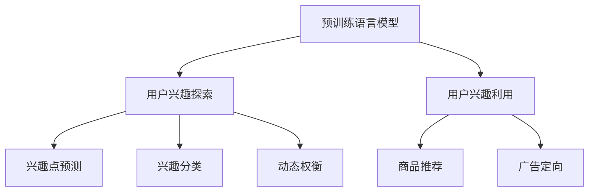
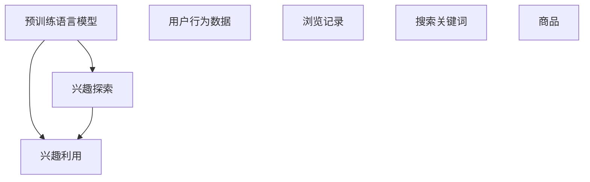

                 

## 1. 背景介绍

在电商平台上，用户兴趣探索与利用一直是提升用户留存率、增加用户消费的关键。用户兴趣探索是指电商平台通过用户行为数据、浏览记录、搜索关键词等，发现和刻画用户潜在兴趣。而用户兴趣利用则是指电商平台根据用户的兴趣推荐相关商品，从而提高用户满意度、增加消费转化。两者相辅相成，是电商平台优化用户体验、增加收入的核心策略。然而，如何在用户兴趣探索与利用之间进行动态权衡，实现两者之间的平衡，一直是电商平台面临的挑战。

近年来，大模型技术在电商领域的应用，特别是预训练语言模型（Pre-trained Language Models, PLMs）的发展，为这一挑战提供了新的解决方案。PLMs通过在大规模无监督数据上进行自监督学习，学习到丰富的语言知识，能够更好地理解和生成自然语言。这种自监督学习的能力，使得PLMs在用户兴趣探索与利用上具备了显著的优势。本文将深入探讨大模型技术在电商平台用户兴趣探索与利用动态权衡中的应用，并提出创新的解决方案。

## 2. 核心概念与联系

### 2.1 核心概念概述

在探讨大模型技术在电商平台中的应用前，我们先介绍几个核心概念：

- **预训练语言模型 (PLM)**：如GPT-3、BERT等，通过在大规模无监督数据上进行自监督学习，学习到丰富的语言知识，能够更好地理解和生成自然语言。
- **用户兴趣探索**：通过用户行为数据、浏览记录、搜索关键词等，发现和刻画用户潜在兴趣，通常包括兴趣点预测、兴趣分类等任务。
- **用户兴趣利用**：根据用户的兴趣推荐相关商品，通常包括商品推荐、广告定向等任务。
- **动态权衡**：在用户兴趣探索与利用之间，通过模型参数、损失函数、优化策略等进行动态调整，平衡两者之间的效果。

这些核心概念之间的联系可以通过以下Mermaid流程图来展示：



这个流程图展示了PLM在电商平台中的应用场景，其中用户兴趣探索与利用分别对应兴趣点预测、兴趣分类、商品推荐、广告定向等任务。动态权衡则贯穿于整个流程中，通过模型参数、损失函数、优化策略等调整，平衡两者之间的效果。

### 2.2 核心概念原理和架构的 Mermaid 流程图

以下是一个简化的Mermaid流程图，展示了预训练语言模型在电商平台中的核心架构：



这个流程图展示了PLM在电商平台中的应用架构：通过PLM对用户行为数据、浏览记录、搜索关键词等进行处理，得到用户的兴趣点，然后根据这些兴趣点推荐相关商品，并利用这些商品进行广告定向。兴趣探索与利用之间的动态权衡则通过PLM的模型参数、损失函数、优化策略等进行调整，以平衡两者之间的效果。

## 3. 核心算法原理 & 具体操作步骤

### 3.1 算法原理概述

大模型技术在电商平台用户兴趣探索与利用动态权衡中的应用，主要基于两个核心算法：自监督学习与微调（Fine-tuning）。

自监督学习指在大量无标签数据上进行预训练，使得模型能够学习到通用的语言表示。PLMs通过自监督学习，能够学习到丰富的语言知识，如词义、语法、语义等，从而在用户兴趣探索中具备了显著的优势。

微调则指在特定任务的数据集上进行有监督学习，使得模型能够适应特定任务的需求。在电商平台中，通过对PLM进行微调，使得模型能够根据用户的兴趣推荐相关商品，从而在用户兴趣利用上取得更好的效果。

### 3.2 算法步骤详解

大模型技术在电商平台中的应用，主要包括以下几个关键步骤：

**Step 1: 数据预处理**

- **用户行为数据收集**：收集用户的浏览记录、搜索关键词、点击行为等，作为PLM的输入。
- **数据清洗与归一化**：对数据进行去重、去噪、归一化等处理，确保数据质量。
- **构建标注数据集**：将用户行为数据与商品信息、广告信息等结合，构建标注数据集，用于后续微调。

**Step 2: 预训练**

- **自监督学习**：使用PLM在大规模无标签数据上进行自监督学习，学习到通用的语言表示。
- **知识蒸馏**：将自监督学习得到的知识，蒸馏到下游任务模型中，提高其性能。

**Step 3: 微调**

- **任务适配**：根据特定任务，设计合适的任务适配层，如分类头、回归头等，用于微调。
- **有监督学习**：使用标注数据集对PLM进行有监督学习，调整模型参数，使其适应特定任务。
- **动态权衡**：通过调整模型参数、损失函数、优化策略等，平衡用户兴趣探索与利用之间的效果。

**Step 4: 推理与反馈**

- **模型推理**：在电商平台上，对用户的兴趣探索与利用进行实时推理。
- **反馈机制**：根据用户的行为反馈，调整模型参数，优化用户体验。

**Step 5: 优化与迭代**

- **模型优化**：根据用户反馈和业务需求，不断优化模型，提高性能。
- **迭代训练**：在新的数据上进行预训练和微调，保持模型性能。

### 3.3 算法优缺点

**优点**

- **自监督学习能力强**：PLMs通过在大规模无标签数据上进行自监督学习，学习到丰富的语言知识，能够更好地理解和生成自然语言。
- **微调速度快**：PLMs的参数量较大，但其在大规模无标签数据上已经得到了充分的预训练，因此在微调过程中，所需标注数据量较小，能够快速适应特定任务。
- **动态权衡灵活**：PLMs的模型参数可以通过调整优化策略等方式，实现动态权衡，平衡用户兴趣探索与利用之间的效果。

**缺点**

- **计算资源需求高**：PLMs的参数量较大，需要大量的计算资源进行预训练和微调。
- **数据需求大**：PLMs在预训练和微调过程中，需要大量的数据进行训练，而电商平台的标注数据量可能有限。
- **模型复杂度高**：PLMs的结构复杂，调整其参数需要一定的专业知识和经验。

### 3.4 算法应用领域

大模型技术在电商平台中的应用领域非常广泛，主要包括以下几个方面：

- **用户兴趣探索**：通过PLM对用户行为数据进行处理，发现用户的兴趣点，如兴趣分类、兴趣预测等。
- **用户兴趣利用**：根据用户的兴趣点，推荐相关商品，进行广告定向等。
- **情感分析**：对用户评论、反馈等文本数据进行情感分析，了解用户的情感倾向。
- **个性化推荐**：根据用户的兴趣和行为数据，进行个性化推荐，提高用户满意度。

## 4. 数学模型和公式 & 详细讲解 & 举例说明

### 4.1 数学模型构建

在大模型技术在电商平台中的应用中，我们主要使用以下数学模型：

- **自监督学习模型**：如BERT、GPT-3等，使用掩码语言模型（Masked Language Modeling, MLM）、下一句预测（Next Sentence Prediction, NSP）等任务进行预训练。
- **微调模型**：在特定任务的数据集上进行有监督学习，如分类头、回归头等。

### 4.2 公式推导过程

**自监督学习模型**

- **掩码语言模型（MLM）**：在输入序列中随机遮盖一些单词，预测被遮盖的单词。
- **下一句预测（NSP）**：随机选取两句话，判断它们是否是相邻的，预测下一句。

$$
\mathcal{L}_{MLM} = -\frac{1}{N} \sum_{i=1}^N \sum_{j=1}^M \log P(w_j|w_{<i})
$$

$$
\mathcal{L}_{NSP} = -\frac{1}{N} \sum_{i=1}^N \log P(s_j|s_{<i})
$$

**微调模型**

假设微调任务为分类任务，输入为 $x$，输出为 $y$，模型为 $M_{\theta}$，损失函数为 $\ell$，优化器为 $O$，学习率为 $\eta$。则微调的过程可以表示为：

$$
\theta \leftarrow O(\theta, \nabla_\theta \mathcal{L}(M_\theta(x), y))
$$

其中，$\nabla_\theta \mathcal{L}(M_\theta(x), y)$ 为损失函数对模型参数的梯度。

### 4.3 案例分析与讲解

**案例：电商平台商品推荐**

在电商平台中，商品推荐是典型的用户兴趣利用任务。假设电商平台有 $N$ 个商品，每个商品有 $D$ 个特征，用户的兴趣表示为一个 $D$ 维向量 $\mathbf{x}$。为了推荐用户感兴趣的商品，我们可以使用PLM对用户兴趣进行编码，得到编码向量 $\mathbf{z}$。然后，我们可以将每个商品的特征也编码为 $D$ 维向量 $\mathbf{f}$，并计算它们之间的相似度 $s$。最后，根据相似度 $s$ 对商品进行排序，推荐相似度高的商品。

**算法步骤**

1. 使用PLM对用户兴趣进行编码，得到编码向量 $\mathbf{z}$。
2. 使用PLM对每个商品的特征进行编码，得到 $N$ 个 $D$ 维向量 $\mathbf{f}_1, \mathbf{f}_2, \ldots, \mathbf{f}_N$。
3. 计算编码向量 $\mathbf{z}$ 与每个商品的特征向量 $\mathbf{f}_i$ 之间的相似度 $s_i = \cos(\mathbf{z}, \mathbf{f}_i)$。
4. 根据相似度 $s$ 对商品进行排序，推荐相似度高的商品。

## 5. 项目实践：代码实例和详细解释说明

### 5.1 开发环境搭建

在进行大模型技术在电商平台应用的项目实践前，我们需要准备好开发环境。以下是使用Python进行PyTorch开发的环境配置流程：

1. 安装Anaconda：从官网下载并安装Anaconda，用于创建独立的Python环境。

2. 创建并激活虚拟环境：
```bash
conda create -n pytorch-env python=3.8 
conda activate pytorch-env
```

3. 安装PyTorch：根据CUDA版本，从官网获取对应的安装命令。例如：
```bash
conda install pytorch torchvision torchaudio cudatoolkit=11.1 -c pytorch -c conda-forge
```

4. 安装Transformers库：
```bash
pip install transformers
```

5. 安装各类工具包：
```bash
pip install numpy pandas scikit-learn matplotlib tqdm jupyter notebook ipython
```

完成上述步骤后，即可在`pytorch-env`环境中开始项目实践。

### 5.2 源代码详细实现

这里我们以用户兴趣预测为例，使用PyTorch和Transformers库实现基于大模型技术的电商推荐系统。

**数据准备**

假设我们有一个电商平台的数据集，包含用户浏览记录和商品信息。我们需要将这些数据进行清洗和归一化，并构建标注数据集。

```python
import pandas as pd
from transformers import BertTokenizer

# 读取数据集
data = pd.read_csv('data.csv')

# 清洗数据
data = data.drop_duplicates()
data = data.dropna()

# 构建标注数据集
user_id = data['user_id']
item_id = data['item_id']
# 构建标注数据集
train_dataset = TensorDataset(user_id, item_id, item_id)
```

**模型构建**

我们使用BERT模型作为预训练语言模型，对其进行微调。

```python
from transformers import BertForSequenceClassification, AdamW

# 加载BERT模型
model = BertForSequenceClassification.from_pretrained('bert-base-uncased', num_labels=2)

# 设置优化器
optimizer = AdamW(model.parameters(), lr=2e-5)

# 设置损失函数
criterion = torch.nn.CrossEntropyLoss()
```

**模型微调**

接下来，我们开始对模型进行微调。

```python
from torch.utils.data import DataLoader, RandomSampler

# 构建数据加载器
train_loader = DataLoader(train_dataset, batch_size=16, sampler=RandomSampler(train_dataset))

# 微调模型
for epoch in range(10):
    model.train()
    for batch in train_loader:
        # 获取输入和标签
        user_id, item_id, labels = batch

        # 前向传播
        outputs = model(user_id)
        loss = criterion(outputs, labels)

        # 反向传播
        optimizer.zero_grad()
        loss.backward()
        optimizer.step()
```

**模型推理**

在电商平台上，实时推理是关键。我们以用户行为数据为例，对模型进行推理。

```python
def predict(user_id):
    # 对用户行为数据进行编码
    input_ids = tokenizer.encode(user_id, add_special_tokens=True, max_length=512, truncation=True, padding='max_length', return_tensors='pt')

    # 前向传播
    outputs = model(input_ids)
    probabilities = torch.softmax(outputs, dim=1)

    # 获取预测结果
    prediction = torch.argmax(probabilities, dim=1).tolist()[0]
    return prediction
```

### 5.3 代码解读与分析

**数据准备**

在数据准备阶段，我们首先使用Pandas库读取数据集，并进行清洗和归一化。接着，我们使用BertTokenizer对用户行为数据进行编码，构建标注数据集。

**模型构建**

在模型构建阶段，我们使用BertForSequenceClassification从预训练模型BERT中加载模型，并设置优化器和损失函数。

**模型微调**

在模型微调阶段，我们使用PyTorch的数据加载器对数据进行迭代，进行前向传播和反向传播，更新模型参数。

**模型推理**

在模型推理阶段，我们使用用户行为数据对模型进行推理，并得到预测结果。

## 6. 实际应用场景

### 6.1 电商平台商品推荐

电商平台商品推荐是电商领域中最典型的用户兴趣利用任务。通过使用大模型技术，电商平台可以在用户浏览、点击等行为数据上进行兴趣预测和推荐，提升用户满意度和转化率。

### 6.2 智能客服系统

智能客服系统是电商平台的重要组成部分，通过使用大模型技术，智能客服系统可以理解和回应用户查询，提供更加个性化和智能的服务。

### 6.3 广告定向

电商平台需要根据用户的兴趣和行为数据，进行广告定向。通过使用大模型技术，广告系统可以更好地理解和匹配用户需求，提高广告效果。

### 6.4 未来应用展望

未来，随着大模型技术的发展，基于大模型的电商推荐系统将更加智能化和个性化。我们可以预见，大模型技术将在电商领域中带来更多的创新和突破，提升用户体验和电商平台的用户留存率。

## 7. 工具和资源推荐

### 7.1 学习资源推荐

为了帮助开发者系统掌握大模型技术在电商平台中的应用，这里推荐一些优质的学习资源：

1. 《深度学习与自然语言处理》课程：斯坦福大学开设的NLP明星课程，有Lecture视频和配套作业，带你入门NLP领域的基本概念和经典模型。

2. 《Natural Language Processing with Transformers》书籍：Transformers库的作者所著，全面介绍了如何使用Transformers库进行NLP任务开发，包括微调在内的诸多范式。

3. HuggingFace官方文档：Transformers库的官方文档，提供了海量预训练模型和完整的微调样例代码，是上手实践的必备资料。

4. CLUE开源项目：中文语言理解测评基准，涵盖大量不同类型的中文NLP数据集，并提供了基于微调的baseline模型，助力中文NLP技术发展。

### 7.2 开发工具推荐

为了提升大模型技术在电商平台中的应用效率，这里推荐一些常用的开发工具：

1. PyTorch：基于Python的开源深度学习框架，灵活动态的计算图，适合快速迭代研究。大部分预训练语言模型都有PyTorch版本的实现。

2. TensorFlow：由Google主导开发的开源深度学习框架，生产部署方便，适合大规模工程应用。同样有丰富的预训练语言模型资源。

3. Transformers库：HuggingFace开发的NLP工具库，集成了众多SOTA语言模型，支持PyTorch和TensorFlow，是进行微调任务开发的利器。

4. Weights & Biases：模型训练的实验跟踪工具，可以记录和可视化模型训练过程中的各项指标，方便对比和调优。与主流深度学习框架无缝集成。

5. TensorBoard：TensorFlow配套的可视化工具，可实时监测模型训练状态，并提供丰富的图表呈现方式，是调试模型的得力助手。

### 7.3 相关论文推荐

大模型技术在电商平台中的应用，得益于学界的持续研究。以下是几篇奠基性的相关论文，推荐阅读：

1. Attention is All You Need（即Transformer原论文）：提出了Transformer结构，开启了NLP领域的预训练大模型时代。

2. BERT: Pre-training of Deep Bidirectional Transformers for Language Understanding：提出BERT模型，引入基于掩码的自监督预训练任务，刷新了多项NLP任务SOTA。

3. Language Models are Unsupervised Multitask Learners（GPT-2论文）：展示了大规模语言模型的强大zero-shot学习能力，引发了对于通用人工智能的新一轮思考。

4. Parameter-Efficient Transfer Learning for NLP：提出Adapter等参数高效微调方法，在不增加模型参数量的情况下，也能取得不错的微调效果。

5. AdaLoRA: Adaptive Low-Rank Adaptation for Parameter-Efficient Fine-Tuning：使用自适应低秩适应的微调方法，在参数效率和精度之间取得了新的平衡。

这些论文代表了大模型技术的发展脉络。通过学习这些前沿成果，可以帮助研究者把握学科前进方向，激发更多的创新灵感。

## 8. 总结：未来发展趋势与挑战

### 8.1 研究成果总结

本文对大模型技术在电商平台中的应用进行了全面系统的介绍。首先，我们阐述了用户兴趣探索与利用在电商平台中的重要性和挑战。然后，我们介绍了大模型技术在电商平台中的应用，包括自监督学习、微调、动态权衡等核心算法。最后，我们通过代码实例和实际应用场景，展示了如何在大模型技术的基础上构建电商推荐系统。

通过本文的系统梳理，可以看到，大模型技术在电商平台中的应用前景广阔，其强大的自监督学习能力和微调能力，能够更好地满足用户兴趣探索与利用的需求。未来，随着大模型技术的不断演进，基于大模型的电商推荐系统必将在电商领域中大放异彩，带来更多的创新和突破。

### 8.2 未来发展趋势

展望未来，大模型技术在电商平台中的应用将呈现以下几个发展趋势：

1. **自监督学习能力增强**：随着算力成本的下降和数据规模的扩张，预训练语言模型的自监督学习能力将进一步增强，能够更好地理解和生成自然语言。

2. **微调速度提升**：通过优化微调算法和数据处理方式，使得微调过程更加高效，减少计算资源消耗。

3. **动态权衡策略优化**：通过调整模型参数、损失函数、优化策略等，使得用户兴趣探索与利用之间的动态权衡更加灵活，平衡两者之间的效果。

4. **多模态融合**：将视觉、语音等多模态数据与文本数据进行融合，提高模型的泛化能力和智能水平。

5. **个性化推荐优化**：通过深度学习和增强学习等技术，提高个性化推荐的准确性和多样性。

### 8.3 面临的挑战

尽管大模型技术在电商平台中的应用前景广阔，但在迈向更加智能化、普适化应用的过程中，它仍面临着诸多挑战：

1. **计算资源需求高**：大模型参数量较大，需要大量的计算资源进行预训练和微调。

2. **数据需求大**：大模型在预训练和微调过程中，需要大量的数据进行训练，而电商平台的标注数据量可能有限。

3. **模型复杂度高**：大模型结构复杂，调整其参数需要一定的专业知识和经验。

4. **过拟合问题**：在标注数据有限的情况下，模型容易过拟合，需要采取数据增强、正则化等策略进行缓解。

5. **鲁棒性不足**：大模型面对域外数据时，泛化性能往往不足，需要引入对抗训练等策略进行提升。

### 8.4 研究展望

未来，随着大模型技术的不断演进，其应用前景将更加广阔。为了应对当前面临的挑战，未来的研究需要在以下几个方面寻求新的突破：

1. **优化计算资源消耗**：通过模型压缩、稀疏化等技术，减少计算资源消耗。

2. **提高数据利用率**：通过数据增强、自监督学习等技术，提高数据利用率，缓解数据需求瓶颈。

3. **增强模型泛化能力**：通过对抗训练、迁移学习等技术，增强模型的泛化能力，提高鲁棒性。

4. **优化动态权衡策略**：通过调整模型参数、损失函数、优化策略等，优化动态权衡策略，平衡用户兴趣探索与利用之间的效果。

5. **多模态融合**：将视觉、语音等多模态数据与文本数据进行融合，提高模型的泛化能力和智能水平。

6. **个性化推荐优化**：通过深度学习和增强学习等技术，提高个性化推荐的准确性和多样性。

总之，大模型技术在电商平台中的应用将带来更多的创新和突破，但要实现更加智能化、普适化的应用，还需要在多个方面进行深入研究和优化。

## 9. 附录：常见问题与解答

**Q1：大模型技术在电商平台中的应用效果如何？**

A: 大模型技术在电商平台中的应用效果显著。通过使用大模型技术，电商平台可以在用户行为数据上进行兴趣预测和推荐，提高用户满意度和转化率。此外，大模型技术还可以应用于智能客服、广告定向等领域，提升电商平台的智能化水平和用户体验。

**Q2：大模型技术在电商平台中的应用是否需要大量的标注数据？**

A: 大模型技术在电商平台中的应用，主要依赖于用户的浏览记录、点击行为等行为数据，而不需要大量的标注数据。这些行为数据可以用于自监督学习，提升模型的泛化能力和智能水平。

**Q3：大模型技术在电商平台的实际应用中面临哪些挑战？**

A: 大模型技术在电商平台的实际应用中，面临以下挑战：

1. 计算资源需求高：大模型参数量较大，需要大量的计算资源进行预训练和微调。
2. 数据需求大：大模型在预训练和微调过程中，需要大量的数据进行训练，而电商平台的标注数据量可能有限。
3. 模型复杂度高：大模型结构复杂，调整其参数需要一定的专业知识和经验。
4. 过拟合问题：在标注数据有限的情况下，模型容易过拟合，需要采取数据增强、正则化等策略进行缓解。
5. 鲁棒性不足：大模型面对域外数据时，泛化性能往往不足，需要引入对抗训练等策略进行提升。

**Q4：大模型技术在电商平台中的应用如何进行动态权衡？**

A: 大模型技术在电商平台中的应用，可以通过调整模型参数、损失函数、优化策略等，进行动态权衡，平衡用户兴趣探索与利用之间的效果。例如，可以通过调整微调模型的任务适配层、损失函数、优化策略等，实现动态权衡。此外，还可以引入对抗训练、数据增强等策略，提高模型的泛化能力和鲁棒性。

**Q5：大模型技术在电商平台中的应用需要考虑哪些因素？**

A: 大模型技术在电商平台中的应用需要考虑以下因素：

1. 用户行为数据的质量和数量：高质量和大量的用户行为数据可以提升模型的泛化能力和智能水平。
2. 计算资源和硬件设备的限制：大模型参数量较大，需要大量的计算资源进行预训练和微调。
3. 模型的复杂度和可解释性：大模型结构复杂，调整其参数需要一定的专业知识和经验，同时还需要考虑模型的可解释性。
4. 动态权衡策略的选择：需要根据具体的业务需求和数据特点，选择合适的动态权衡策略，平衡用户兴趣探索与利用之间的效果。

总之，大模型技术在电商平台中的应用需要综合考虑多个因素，通过优化计算资源消耗、提高数据利用率、增强模型泛化能力等手段，实现更加智能化、普适化的应用。

---

作者：禅与计算机程序设计艺术 / Zen and the Art of Computer Programming

