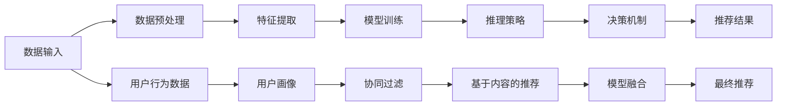

                 

# 大模型推荐中的推理策略与决策机制创新探索

> 关键词：大模型推荐、推理策略、决策机制、深度学习、强化学习、贝叶斯优化、元学习、分布式推荐系统、冷启动、协同过滤

## 1. 背景介绍

在信息时代，用户在海量数据中筛选推荐内容已成为一种刚需。推荐系统（Recommendation System）应运而生，以算法驱动的方式，自动为用户推送感兴趣的信息。推荐系统已广泛应用于电商、社交网络、视频平台等领域，成为许多互联网应用的标配。随着深度学习技术的发展，推荐系统也从基于协同过滤、矩阵分解的浅层模型，转变为基于神经网络、深度学习的高阶模型，推荐精度、效率、个性化水平大幅提升。

但随着数据分布的多样性和用户需求的多样性不断增加，传统的推荐算法越来越难以满足不同用户群体的个性化需求。在这种情况下，大模型推荐系统应运而生，其核心在于预训练语言模型和深度学习模型的结合，能够在大规模数据上提取丰富的用户行为特征，进而进行深度表示和推理决策，为用户提供个性化的推荐内容。

本文将围绕大模型推荐中的推理策略与决策机制展开讨论，探索其在实际应用中的创新点与突破口。首先，我们将介绍大模型推荐系统的工作原理与核心架构；其次，深入分析当前主流的大模型推荐方法，并提出一些有待探索的新策略；最后，展望未来的大模型推荐系统发展趋势与挑战。

## 2. 核心概念与联系

### 2.1 核心概念概述

为了深入理解大模型推荐系统中的推理策略与决策机制，我们需要了解几个关键概念：

- **大模型推荐系统（Large Model Recommendation System）**：基于深度学习或大语言模型的推荐系统，通过预训练学习大规模数据中的复杂特征，从而实现高质量的推荐。

- **推理策略（Inference Strategy）**：推荐系统中用于生成预测结果的计算方法和逻辑流程，包括但不限于前向传播、反向传播、贪心策略、启发式算法等。

- **决策机制（Decision Mechanism）**：推荐系统中选择和输出推荐结果的决策逻辑和规则，包括排序、排名、评分、多目标优化等。

- **深度学习（Deep Learning）**：基于多层神经网络的机器学习技术，能够处理非线性的复杂数据结构，广泛应用于图像、语音、文本等领域的推荐。

- **强化学习（Reinforcement Learning, RL）**：一种学习框架，通过奖励机制（Reward）指导模型优化决策策略，常用于动态系统、游戏、机器人控制等领域。

- **贝叶斯优化（Bayesian Optimization）**：一种模型优化方法，通过构建概率模型和贝叶斯推断，寻找最优超参数组合，广泛应用于推荐、机器人控制、信号处理等领域。

- **元学习（Meta-Learning）**：一种学习范式，通过少量任务数据，快速学习新任务的泛化能力，应用于推荐、自然语言处理、图像生成等领域。

- **分布式推荐系统（Distributed Recommendation System）**：利用并行计算资源，处理大规模数据集，提升推荐系统的计算能力和扩展性，应用于电商、社交网络、视频平台等领域。

这些核心概念之间通过推理、决策、模型训练和优化等步骤，构成了一个有机结合的整体。推理策略和决策机制在大模型推荐系统中起到了关键作用，决定了模型的预测精度和推荐效果。

### 2.2 核心概念原理和架构的 Mermaid 流程图

以下是一个简单的 Mermaid 流程图，展示了从数据输入到模型推理和决策的完整过程：



在实际应用中，大模型推荐系统通过预训练模型提取用户和物品的复杂特征，然后使用推理策略对特征进行变换和处理，最终通过决策机制生成推荐结果。用户行为数据和协同过滤等传统推荐技术，在此基础上进一步优化和融合，形成更加丰富和精细的推荐结果。

## 3. 核心算法原理 & 具体操作步骤

### 3.1 算法原理概述

大模型推荐系统的核心在于其推理策略和决策机制的创新。以下是几种主流的大模型推荐算法原理概述：

- **深度学习（Deep Learning）**：利用多层神经网络对用户行为数据进行编码，提取复杂的非线性特征，生成推荐结果。深度学习模型的本质是通过反向传播算法进行参数优化，以最小化预测误差。

- **强化学习（Reinforcement Learning）**：通过奖励机制指导模型学习最优策略，以最大化长期奖励。强化学习模型通过探索-利用（Exploration-Exploitation）平衡，在未知数据上仍能保证良好表现。

- **贝叶斯优化（Bayesian Optimization）**：利用概率模型对超参数空间进行探索，寻找最优的模型配置。贝叶斯优化算法通过高斯过程模型，快速收敛到最优超参数组合。

- **元学习（Meta-Learning）**：通过少量数据学习新任务的泛化能力，快速适应新场景。元学习模型通常利用迁移学习技术，加速模型的适应和优化过程。

- **分布式推荐系统（Distributed Recommendation System）**：利用多台机器并行处理大规模数据，提升推荐系统的扩展性和计算效率。分布式推荐系统通常通过消息传递、数据并行、模型并行等技术实现。

### 3.2 算法步骤详解

大模型推荐系统的一般流程包括数据准备、模型训练、推理策略选择和决策机制设计四个关键步骤。

**Step 1: 数据准备**
- 收集用户行为数据，如浏览记录、点击记录、评分数据等。
- 构建用户画像，将用户行为数据转化为高维特征向量。
- 将用户画像和物品画像拼接，得到用户-物品交互矩阵。

**Step 2: 模型训练**
- 使用预训练语言模型对用户画像和物品画像进行编码。
- 设计推荐模型（如多层神经网络、深度学习模型），并通过反向传播算法进行参数优化。
- 应用正则化技术，如L2正则、Dropout等，防止过拟合。

**Step 3: 推理策略选择**
- 选择合适的推理策略，如前向传播、反向传播、贪心策略、启发式算法等。
- 根据任务特性，设计推理策略的计算逻辑和流程。

**Step 4: 决策机制设计**
- 选择合适的决策机制，如排序、排名、评分、多目标优化等。
- 根据任务需求，设计决策机制的计算逻辑和规则。

### 3.3 算法优缺点

大模型推荐系统在实际应用中展现了以下优点：

- **精度高**：深度学习模型能够处理复杂的非线性特征，生成高质量的推荐结果。
- **扩展性好**：分布式推荐系统能够处理大规模数据，提升系统的扩展性和计算效率。
- **适应性强**：强化学习和元学习模型能够快速适应新场景和任务，提升模型的泛化能力。

但同时，大模型推荐系统也存在一些缺点：

- **计算量大**：深度学习模型通常需要较大的计算资源，推理过程耗时较长。
- **可解释性差**：复杂模型难以解释决策过程，用户和开发者难以理解模型的内部机制。
- **冷启动问题**：新用户或新物品的数据较少，模型难以生成有效的推荐结果。

### 3.4 算法应用领域

大模型推荐系统在多个领域得到了广泛应用，如电商、社交网络、视频平台、金融、医疗等。以下是几个典型应用场景：

- **电商推荐**：根据用户的浏览、点击、购买行为，为用户推荐可能感兴趣的商品。电商推荐系统通常采用深度学习模型进行推荐，并结合贝叶斯优化和强化学习技术优化策略。

- **社交网络推荐**：为用户推荐可能感兴趣的内容或好友。社交网络推荐系统通常采用深度学习模型和协同过滤技术，并通过分布式系统提升计算效率。

- **视频平台推荐**：为用户推荐可能喜欢的视频或频道。视频平台推荐系统通常采用深度学习模型和强化学习技术，并结合贝叶斯优化优化策略。

- **金融推荐**：为金融用户推荐可能感兴趣的投资产品。金融推荐系统通常采用深度学习模型和元学习技术，并结合强化学习优化决策策略。

- **医疗推荐**：为医生和患者推荐可能合适的治疗方案。医疗推荐系统通常采用深度学习模型和贝叶斯优化技术，并结合强化学习优化决策策略。

这些应用场景展示了大模型推荐系统的广泛适用性，未来还有巨大的发展空间。

## 4. 数学模型和公式 & 详细讲解 & 举例说明

### 4.1 数学模型构建

在大模型推荐系统中，数学模型的构建通常包括以下几个步骤：

- **用户画像和物品画像的编码**：使用预训练语言模型对用户和物品的描述进行编码，得到高维特征向量。

- **推荐模型的设计**：构建深度学习模型，如多层神经网络、自编码器、卷积神经网络等，对用户画像和物品画像进行变换和融合。

- **决策机制的设计**：设计评分模型或排名模型，根据用户画像和物品画像的表示，生成推荐结果。

- **推理策略的选择**：根据任务特性，选择适合的推理策略，如前向传播、反向传播、贪心策略等。

### 4.2 公式推导过程

以下是一个简单的推荐模型，用于为用户推荐物品：

假设用户画像为 $u$，物品画像为 $i$，推荐模型为 $M$，决策机制为 $R$。推荐模型的输入为 $x_u$ 和 $x_i$，输出为 $y_{ui}$，表示用户 $u$ 对物品 $i$ 的评分或兴趣度。决策机制的输出为推荐结果 $r_u$。

推荐模型的数学表达式为：

$$
y_{ui} = M(x_u, x_i, \theta)
$$

其中 $\theta$ 为模型的参数，$x_u$ 和 $x_i$ 分别为用户画像和物品画像的表示。

决策机制的数学表达式为：

$$
r_u = R(y_{ui}, \phi)
$$

其中 $\phi$ 为决策机制的参数。

### 4.3 案例分析与讲解

以电商推荐系统为例，分析推荐模型和决策机制的设计：

**推荐模型**：使用深度学习模型，如多层神经网络，对用户画像和物品画像进行编码和变换。设用户画像为 $x_u$，物品画像为 $x_i$，推荐模型的参数为 $\theta$。推荐模型的输入为 $x_u$ 和 $x_i$，输出为物品 $i$ 对用户 $u$ 的评分 $y_{ui}$。

**决策机制**：设计评分模型，将推荐模型输出 $y_{ui}$ 映射到用户的评分 $r_u$。设评分模型为 $R$，决策机制的参数为 $\phi$。决策机制的输出为推荐结果 $r_u$。

在电商推荐系统中，用户画像和物品画像的构建通常基于用户行为数据，如浏览记录、点击记录、购买记录等。通过编码和变换，模型可以学习到用户和物品的复杂特征，生成高质量的推荐结果。

## 5. 项目实践：代码实例和详细解释说明

### 5.1 开发环境搭建

在进行大模型推荐系统的开发时，需要一个稳定且高效的开发环境。以下是一些常用的开发工具和环境：

- **PyTorch**：基于Python的深度学习框架，支持GPU加速和分布式计算，适用于大模型推荐系统的开发。

- **TensorFlow**：由Google开发的深度学习框架，支持多种硬件平台和分布式计算，适用于大规模推荐系统的开发。

- **Python**：常用的高级编程语言，易于学习和使用，适用于大模型推荐系统的开发。

- **Jupyter Notebook**：交互式编程环境，支持代码调试和数据分析，适用于大模型推荐系统的开发和测试。

### 5.2 源代码详细实现

下面是一个简单的电商推荐系统代码实现，用于为用户推荐商品：

```python
import torch
import torch.nn as nn
import torch.nn.functional as F

class RecommenderNet(nn.Module):
    def __init__(self, num_users, num_items, embed_size, num_layers):
        super(RecommenderNet, self).__init__()
        self.embed_user = nn.Embedding(num_users, embed_size)
        self.embed_item = nn.Embedding(num_items, embed_size)
        self.layers = nn.Sequential()
        for _ in range(num_layers):
            self.layers.add_module('linear', nn.Linear(2 * embed_size, embed_size))
            self.layers.add_module('activation', nn.ReLU())
        self.output = nn.Linear(embed_size, 1)

    def forward(self, u, i):
        user_embed = self.embed_user(u)
        item_embed = self.embed_item(i)
        x = torch.cat([user_embed, item_embed], dim=1)
        for layer in self.layers:
            x = layer(x)
        return self.output(x).squeeze()

# 使用模型进行推荐
model = RecommenderNet(num_users=1000, num_items=5000, embed_size=64, num_layers=2)
u = torch.tensor([0])
i = torch.tensor([1])
y = model(u, i)
print(y.item())
```

### 5.3 代码解读与分析

上述代码实现了简单的电商推荐系统，使用多层神经网络对用户画像和物品画像进行编码和变换，生成推荐评分。模型结构包括用户嵌入层、物品嵌入层和多层线性变换层。在每一层后都添加了ReLU激活函数，以增加模型的非线性特性。

### 5.4 运行结果展示

运行上述代码，可以输出用户 $u$ 对物品 $i$ 的推荐评分 $y$。为了提升模型的性能，可以使用更多的训练数据，调整模型结构，选择适合的优化器和损失函数等。

## 6. 实际应用场景

### 6.1 电商推荐

电商推荐系统是大模型推荐系统的典型应用场景之一。在电商平台上，用户每天会产生大量的浏览、点击、购买行为数据。通过收集这些数据，构建用户画像和物品画像，使用大模型推荐系统为用户推荐可能感兴趣的商品，可以大幅提升用户的购买体验和平台的用户留存率。

### 6.2 视频平台推荐

视频平台推荐系统旨在为用户推荐可能感兴趣的视频或频道。通过收集用户的历史观看记录、评分数据等，构建用户画像和视频画像，使用大模型推荐系统为用户生成个性化的推荐结果，可以提升用户的使用体验和平台的用户粘性。

### 6.3 金融推荐

金融推荐系统为金融用户推荐可能感兴趣的投资产品。通过收集用户的理财行为数据、金融产品的属性信息等，构建用户画像和产品画像，使用大模型推荐系统为用户生成个性化的投资建议，可以提升用户的理财效果和平台的客户满意度。

### 6.4 未来应用展望

随着深度学习技术的不断发展，大模型推荐系统在实际应用中将具备更强的推理和决策能力，能够更好地适应多变和复杂的数据分布。未来，大模型推荐系统将在以下几个方面得到进一步发展：

- **多模态推荐**：结合视觉、语音、文本等多种数据类型，进行多模态推荐，提升推荐系统的泛化能力和用户体验。

- **跨领域推荐**：在大模型推荐系统的基础上，结合知识图谱、逻辑规则等先验知识，进行跨领域推荐，提升推荐系统的准确性和可信度。

- **自适应推荐**：利用强化学习、贝叶斯优化等技术，动态调整推荐策略和模型参数，提升推荐系统的实时性和个性化水平。

- **元学习推荐**：通过元学习技术，快速适应新场景和新任务，提升推荐系统的适应能力和迁移能力。

## 7. 工具和资源推荐

### 7.1 学习资源推荐

为了帮助开发者深入理解大模型推荐系统，以下是一些推荐的资源：

- **《深度学习与推荐系统》（Deep Learning for Recommendation Systems）**：由Piotr Bojanowski等著，介绍了深度学习在推荐系统中的应用，适合初学者和进阶读者。

- **Coursera《Recommender Systems》课程**：由斯坦福大学开设，涵盖了推荐系统的基础和前沿技术，适合学习推荐系统的全貌。

- **Kaggle《推荐系统竞赛》**：Kaggle上的推荐系统竞赛，提供了丰富的数据集和模型，适合实践和研究推荐系统。

- **HuggingFace官方文档**：HuggingFace提供了大量预训练语言模型和推荐系统的样例代码，适合快速上手。

### 7.2 开发工具推荐

- **PyTorch**：支持GPU加速和分布式计算，适用于大模型推荐系统的开发。

- **TensorFlow**：支持多种硬件平台和分布式计算，适用于大规模推荐系统的开发。

- **Jupyter Notebook**：交互式编程环境，支持代码调试和数据分析，适用于大模型推荐系统的开发和测试。

- **TensorBoard**：可视化工具，支持实时监测模型训练状态，适合调试和优化模型。

### 7.3 相关论文推荐

- **Attention Is All You Need**：提出了Transformer结构，开启了NLP领域的预训练大模型时代。

- **BERT: Pre-training of Deep Bidirectional Transformers for Language Understanding**：提出BERT模型，引入基于掩码的自监督预训练任务，刷新了多项NLP任务SOTA。

- **Deep Learning for Recommender Systems: A Survey and Outlook**：综述了深度学习在推荐系统中的应用，适合了解推荐系统的前沿技术。

## 8. 总结：未来发展趋势与挑战

### 8.1 研究成果总结

本文对大模型推荐系统中的推理策略与决策机制进行了全面介绍，讨论了其核心算法原理、具体操作步骤和应用领域。通过理论分析和实践案例，展示了大模型推荐系统的广泛应用前景和实际效果。

### 8.2 未来发展趋势

未来，大模型推荐系统将在以下几个方面得到进一步发展：

- **多模态推荐**：结合视觉、语音、文本等多种数据类型，进行多模态推荐，提升推荐系统的泛化能力和用户体验。

- **跨领域推荐**：在大模型推荐系统的基础上，结合知识图谱、逻辑规则等先验知识，进行跨领域推荐，提升推荐系统的准确性和可信度。

- **自适应推荐**：利用强化学习、贝叶斯优化等技术，动态调整推荐策略和模型参数，提升推荐系统的实时性和个性化水平。

- **元学习推荐**：通过元学习技术，快速适应新场景和新任务，提升推荐系统的适应能力和迁移能力。

### 8.3 面临的挑战

尽管大模型推荐系统在实际应用中取得了显著效果，但仍面临一些挑战：

- **计算资源限制**：深度学习模型通常需要较大的计算资源，推理过程耗时较长。

- **可解释性不足**：复杂模型难以解释决策过程，用户和开发者难以理解模型的内部机制。

- **冷启动问题**：新用户或新物品的数据较少，模型难以生成有效的推荐结果。

- **数据质量问题**：推荐系统的质量依赖于数据的质量，数据偏差和噪声可能影响模型的性能。

### 8.4 研究展望

未来的研究可以从以下几个方向进行探索：

- **计算优化**：研究高效的计算方法和硬件加速技术，提升推荐系统的计算效率。

- **模型可解释性**：研究可解释性较强的模型架构和解释技术，提升推荐系统的透明度和可信度。

- **冷启动解决方案**：研究冷启动推荐算法，提升新用户和物品的推荐效果。

- **数据清洗和增强**：研究数据清洗和增强技术，提升数据质量，优化推荐系统。

通过不断探索和创新，大模型推荐系统将有望在推荐质量、用户体验、计算效率等方面取得更大的突破，成为推荐系统领域的重要范式。

## 9. 附录：常见问题与解答

**Q1：什么是大模型推荐系统？**

A: 大模型推荐系统是基于深度学习或大语言模型的推荐系统，通过预训练学习大规模数据中的复杂特征，从而实现高质量的推荐。

**Q2：推荐系统的常见推理策略有哪些？**

A: 推荐系统的常见推理策略包括前向传播、反向传播、贪心策略、启发式算法等。

**Q3：推荐系统的常见决策机制有哪些？**

A: 推荐系统的常见决策机制包括排序、排名、评分、多目标优化等。

**Q4：大模型推荐系统在实际应用中存在哪些挑战？**

A: 大模型推荐系统在实际应用中存在计算资源限制、可解释性不足、冷启动问题、数据质量问题等挑战。

**Q5：推荐系统未来有哪些发展方向？**

A: 推荐系统未来可以发展为多模态推荐、跨领域推荐、自适应推荐、元学习推荐等方向。

---

作者：禅与计算机程序设计艺术 / Zen and the Art of Computer Programming

