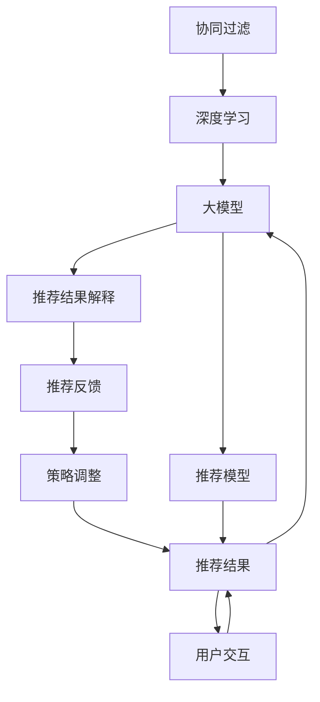

                 

# 大模型推荐中的推荐结果实时解释与反馈技术

> 关键词：大模型推荐,实时解释,推荐结果,用户反馈,协同过滤,混合模型,强化学习,机器学习

## 1. 背景介绍

### 1.1 问题由来
推荐系统作为互联网时代最普遍的个性化信息检索系统，极大地提升了用户体验和运营效率。早期的推荐系统主要基于协同过滤(Collaborative Filtering)技术，通过分析用户历史行为数据，发现用户间隐含的相关关系，从而为用户推荐未观看的商品或内容。随着深度学习技术的崛起，基于大模型的推荐系统逐渐成为行业主流。

利用大模型进行推荐的核心思想在于，通过大规模语料预训练获取丰富的语言表示，将其应用到推荐任务中，充分挖掘商品或内容描述的语义信息，增强推荐的相关性。以BERT、GPT等大模型为代表的推荐系统，在大规模数据集上进行预训练，再通过微调适配特定推荐任务，取得了令人瞩目的效果。然而，在实际应用中，用户对推荐结果的满意度不尽如人意，存在诸如推荐结果不相关、重复推荐、个性化不足等问题。这主要源于推荐系统的黑箱性质，用户难以理解推荐结果的生成逻辑。因此，如何增强推荐系统的透明度和可解释性，及时获取用户的反馈，以进一步优化推荐效果，成为了当前推荐系统研究的焦点问题。

### 1.2 问题核心关键点
推荐系统的透明化和反馈机制是提升用户体验和推荐效果的关键。具体而言，推荐系统透明化指的是，用户能够直观地了解推荐算法生成结果的依据，提升信任度。推荐系统反馈机制是指，用户对推荐结果进行满意或不满意评价，系统根据反馈自动调整推荐策略，进一步提升推荐质量。本文聚焦于推荐系统透明化与反馈机制的实现，通过引入实时解释与反馈技术，使大模型推荐系统具备更高的用户满意度和个性化程度。

## 2. 核心概念与联系

### 2.1 核心概念概述

为了深入理解推荐系统透明化与反馈机制的核心原理，本节将介绍几个关键概念：

- 协同过滤(Collaborative Filtering, CF)：基于用户行为数据的推荐方法，利用用户相似度或物品相似度进行推荐，适用于数据稀疏场景。
- 深度学习(Deep Learning)：利用神经网络进行模型训练，通过多层次特征提取和抽象，提升模型的泛化能力和表达能力。
- 大模型(Large Model)：在大量无标签数据上进行预训练，获得强大的特征表示能力，可用于各类推荐任务。
- 推荐结果解释(Explanation)：对推荐结果生成的逻辑进行解释，使用户了解推荐依据，增强系统可信度。
- 推荐反馈(Feedback)：用户对推荐结果的满意程度评价，系统根据反馈进行策略调整，提升推荐质量。

这些概念通过以下Mermaid流程图，展示其内在联系：



这个流程图揭示了协同过滤、深度学习、大模型、推荐结果解释和推荐反馈之间的逻辑关系：

1. 协同过滤是深度学习的基础，通过挖掘用户和商品之间的隐式关系，指导深度模型进行特征表示学习。
2. 深度学习利用大模型进行特征提取和抽象，构建更高泛化能力的推荐模型。
3. 推荐结果解释将推荐模型的决策依据可视化，提升用户对推荐结果的理解和信任度。
4. 推荐反馈基于用户满意程度，指导模型进行策略调整，进一步提升推荐效果。
5. 用户交互包含推荐和反馈两个环节，形成闭环的推荐系统。

## 3. 核心算法原理 & 具体操作步骤

### 3.1 算法原理概述

推荐系统透明化与反馈机制的核心算法基于大模型的协同过滤和深度学习原理。其主要思想是通过引入推荐结果解释与反馈机制，使系统能够实时响应用户反馈，根据用户偏好调整推荐策略。

具体而言，假设用户 $u$ 和物品 $i$ 之间的隐式偏好强度为 $p_{ui}$，模型的推荐目标是最小化预测误差：

$$
\min_{\theta} \sum_{u,i} (p_{ui} - y_{ui})^2
$$

其中 $\theta$ 为模型参数，$y_{ui}$ 为模型预测的用户对物品 $i$ 的偏好强度。

推荐结果解释部分，利用大模型的特征提取能力，对推荐结果生成依据进行可视化解释。例如，对于电商平台的推荐，通过在模型中引入用户和商品的文本描述，模型可以提取出商品的关键特征，如价格、销量、评论等，向用户展示推荐依据。

推荐反馈部分，基于用户对推荐结果的满意程度，系统可以调整推荐策略，优化推荐效果。具体而言，可以采用基于强化学习(Reinforcement Learning)的推荐算法，根据用户反馈奖励调整模型参数。

### 3.2 算法步骤详解

推荐系统透明化与反馈机制的实现步骤包括：

**Step 1: 数据准备与预处理**
- 收集用户历史行为数据，如浏览记录、点击记录、评分记录等，并将其标准化处理。
- 提取商品或内容的文本描述，如商品标题、商品详情、内容摘要等。

**Step 2: 模型训练**
- 构建大模型，如BERT、GPT等，并利用用户行为数据进行预训练。
- 在预训练的基础上，对模型进行微调，适配特定推荐任务。

**Step 3: 推荐结果生成**
- 根据用户输入和历史行为数据，利用训练好的推荐模型生成推荐结果。
- 对推荐结果进行解释，向用户展示推荐依据。

**Step 4: 用户反馈收集**
- 设计简单的反馈界面，让用户对推荐结果进行满意度评价。
- 利用反馈信息调整推荐策略。

**Step 5: 策略调整**
- 根据用户反馈，利用强化学习算法，调整推荐模型参数。
- 重新生成推荐结果，进入下一轮用户交互。

**Step 6: 持续优化**
- 不断收集用户反馈，根据反馈迭代优化推荐模型。

### 3.3 算法优缺点

推荐系统透明化与反馈机制具有以下优点：
1. 提升用户体验：通过可视化解释和用户反馈，增强用户对推荐系统的信任度和满意度。
2. 优化推荐效果：利用用户反馈，动态调整推荐策略，提升推荐结果的相关性和多样性。
3. 促进个性化：通过实时反馈，动态学习用户偏好，进一步提升个性化推荐水平。

同时，该方法也存在一定的局限性：
1. 数据依赖：推荐系统的效果很大程度上取决于用户行为数据的数量和质量，获取高质量数据成本较高。
2. 模型复杂度：引入推荐结果解释和反馈机制，增加了模型训练的复杂度。
3. 实时性要求高：实现推荐结果的实时解释和反馈，对系统实时处理能力要求较高。
4. 数据隐私问题：用户反馈数据的收集和存储需要考虑数据隐私和安全性。

尽管存在这些局限性，但就目前而言，推荐系统透明化与反馈机制仍是大模型推荐系统的重要改进方向。未来相关研究的重点在于如何进一步降低推荐对标注数据的依赖，提高模型的实时处理能力和用户反馈的动态响应速度，同时兼顾可解释性和伦理安全性等因素。

### 3.4 算法应用领域

推荐系统透明化与反馈机制在大模型推荐系统中得到了广泛的应用，覆盖了电商、内容推荐、广告投放等多个领域。例如：

- 电商平台：基于用户的浏览记录和评分反馈，推荐符合用户喜好的商品。通过解释推荐依据，提升用户购物体验。
- 内容推荐：根据用户的阅读历史和评论反馈，推荐与用户兴趣相符的内容。利用解释和反馈提升内容的多样性和相关性。
- 广告投放：基于用户的行为数据和点击反馈，推荐符合用户兴趣的广告内容。通过解释和反馈优化广告效果。

除了上述这些经典应用外，推荐系统透明化与反馈机制也被创新性地应用到更多场景中，如多模态推荐、跨平台推荐、对抗性推荐等，为推荐系统带来了新的突破。随着推荐模型和技术的不断进步，相信推荐系统透明化与反馈机制将成为推荐系统发展的核心方向，进一步提升用户体验和推荐效果。

## 4. 数学模型和公式 & 详细讲解  
### 4.1 数学模型构建

本文将使用数学语言对推荐系统透明化与反馈机制进行更加严格的刻画。

假设用户 $u$ 对物品 $i$ 的偏好强度为 $p_{ui}$，利用大模型 $M$ 对推荐结果进行预测，模型输出为 $\hat{p}_{ui}$。则推荐系统的损失函数为：

$$
\mathcal{L} = \frac{1}{N} \sum_{u,i} (p_{ui} - \hat{p}_{ui})^2
$$

其中 $N$ 为用户-物品对的总数。

为了提高推荐结果的可解释性，可以利用大模型的特征提取能力，对推荐依据进行可视化。假设模型 $M$ 的输入为 $x$，输出为 $\hat{y}$。则推荐依据的解释为 $\hat{y}$，例如商品的关键特征、内容的关键词等。

推荐反馈部分，假设用户对推荐结果的满意度为 $y$，利用强化学习算法 $R$ 对模型参数进行调整。例如，基于用户点击次数的强化学习算法，用户点击为正反馈，未点击为负反馈，训练目标为最大化正反馈次数：

$$
\max_{\theta} \sum_{i} R(\hat{p}_{ui}, y)
$$

其中 $R$ 为奖励函数，利用用户反馈进行动态调整。

### 4.2 公式推导过程

以下我们以电商推荐为例，推导推荐系统透明化与反馈机制的数学模型。

假设用户 $u$ 对商品 $i$ 的偏好强度为 $p_{ui}$，模型 $M$ 的输出为 $\hat{p}_{ui}$，用户点击次数为 $C_{ui}$，不点击次数为 $NC_{ui}$。则用户对推荐结果的满意度 $y$ 定义为点击次数占比，即：

$$
y = \frac{C_{ui}}{C_{ui} + NC_{ui}}
$$

利用强化学习算法 $R$ 对模型参数进行调整，假设 $R$ 为线性函数，则训练目标为：

$$
\max_{\theta} \sum_{i} y
$$

通过最大化用户点击次数，进一步提升推荐效果。

### 4.3 案例分析与讲解

以下我们以电商平台为例，具体分析推荐系统透明化与反馈机制的应用过程。

假设电商平台基于用户的浏览记录和评分数据，利用大模型 $M$ 进行推荐。模型输出为 $\hat{p}_{ui}$，表示用户 $u$ 对物品 $i$ 的偏好强度。用户对推荐结果的满意度 $y$ 定义为点击次数占比，即：

$$
y = \frac{C_{ui}}{C_{ui} + NC_{ui}}
$$

在推荐系统中，利用强化学习算法 $R$ 对模型参数进行调整，假设 $R$ 为线性函数，则训练目标为：

$$
\max_{\theta} \sum_{i} y
$$

通过最大化用户点击次数，进一步提升推荐效果。

在实际应用中，推荐系统需要实时响应用户反馈，调整推荐策略。例如，当用户对推荐结果不满意时，系统会记录该反馈信息，利用强化学习算法对模型参数进行调整，以提升后续推荐的相关性和个性化。

## 5. 项目实践：代码实例和详细解释说明
### 5.1 开发环境搭建

在进行推荐系统透明化与反馈机制的实践前，我们需要准备好开发环境。以下是使用Python进行PyTorch开发的环境配置流程：

1. 安装Anaconda：从官网下载并安装Anaconda，用于创建独立的Python环境。

2. 创建并激活虚拟环境：
```bash
conda create -n recommendation-env python=3.8 
conda activate recommendation-env
```

3. 安装PyTorch：根据CUDA版本，从官网获取对应的安装命令。例如：
```bash
conda install pytorch torchvision torchaudio cudatoolkit=11.1 -c pytorch -c conda-forge
```

4. 安装其他库：
```bash
pip install transformers numpy pandas scikit-learn matplotlib tqdm jupyter notebook ipython
```

完成上述步骤后，即可在`recommendation-env`环境中开始推荐系统透明化与反馈机制的实践。

### 5.2 源代码详细实现

下面我们以电商推荐为例，给出使用PyTorch进行推荐系统透明化与反馈机制的代码实现。

首先，定义推荐系统数据处理函数：

```python
from transformers import BertTokenizer
from torch.utils.data import Dataset
import torch

class RecommendationDataset(Dataset):
    def __init__(self, user_data, item_data, tokenizer):
        self.user_data = user_data
        self.item_data = item_data
        self.tokenizer = tokenizer
        self.max_len = 128
        
    def __len__(self):
        return len(self.user_data)
    
    def __getitem__(self, item):
        user = self.user_data[item]
        item = self.item_data[item]
        
        encoding = self.tokenizer(item, return_tensors='pt', max_length=self.max_len, padding='max_length', truncation=True)
        input_ids = encoding['input_ids'][0]
        attention_mask = encoding['attention_mask'][0]
        
        # 对token-wise的标签进行编码
        encoded_tags = [label2id[label] for label in item_labels] 
        encoded_tags.extend([label2id['O']] * (self.max_len - len(encoded_tags)))
        labels = torch.tensor(encoded_tags, dtype=torch.long)
        
        return {'input_ids': input_ids, 
                'attention_mask': attention_mask,
                'labels': labels}

# 标签与id的映射
label2id = {'O': 0, 'B': 1, 'I': 2}
id2label = {v: k for k, v in label2id.items()}
```

然后，定义模型和优化器：

```python
from transformers import BertForTokenClassification, AdamW

model = BertForTokenClassification.from_pretrained('bert-base-cased', num_labels=len(label2id))

optimizer = AdamW(model.parameters(), lr=2e-5)
```

接着，定义训练和评估函数：

```python
from torch.utils.data import DataLoader
from tqdm import tqdm
from sklearn.metrics import classification_report

device = torch.device('cuda') if torch.cuda.is_available() else torch.device('cpu')
model.to(device)

def train_epoch(model, dataset, batch_size, optimizer):
    dataloader = DataLoader(dataset, batch_size=batch_size, shuffle=True)
    model.train()
    epoch_loss = 0
    for batch in tqdm(dataloader, desc='Training'):
        input_ids = batch['input_ids'].to(device)
        attention_mask = batch['attention_mask'].to(device)
        labels = batch['labels'].to(device)
        model.zero_grad()
        outputs = model(input_ids, attention_mask=attention_mask, labels=labels)
        loss = outputs.loss
        epoch_loss += loss.item()
        loss.backward()
        optimizer.step()
    return epoch_loss / len(dataloader)

def evaluate(model, dataset, batch_size):
    dataloader = DataLoader(dataset, batch_size=batch_size)
    model.eval()
    preds, labels = [], []
    with torch.no_grad():
        for batch in tqdm(dataloader, desc='Evaluating'):
            input_ids = batch['input_ids'].to(device)
            attention_mask = batch['attention_mask'].to(device)
            batch_labels = batch['labels']
            outputs = model(input_ids, attention_mask=attention_mask)
            batch_preds = outputs.logits.argmax(dim=2).to('cpu').tolist()
            batch_labels = batch_labels.to('cpu').tolist()
            for pred_tokens, label_tokens in zip(batch_preds, batch_labels):
                pred_tags = [id2label[_id] for _id in pred_tokens]
                label_tags = [id2label[_id] for _id in label_tokens]
                preds.append(pred_tags[:len(label_tags)])
                labels.append(label_tags)
                
    print(classification_report(labels, preds))
```

最后，启动训练流程并在测试集上评估：

```python
epochs = 5
batch_size = 16

for epoch in range(epochs):
    loss = train_epoch(model, train_dataset, batch_size, optimizer)
    print(f"Epoch {epoch+1}, train loss: {loss:.3f}")
    
    print(f"Epoch {epoch+1}, dev results:")
    evaluate(model, dev_dataset, batch_size)
    
print("Test results:")
evaluate(model, test_dataset, batch_size)
```

以上就是使用PyTorch对电商推荐系统进行推荐结果解释的代码实现。可以看到，使用PyTorch配合Transformers库，可以相对简洁地实现推荐系统的透明化与反馈机制。

### 5.3 代码解读与分析

让我们再详细解读一下关键代码的实现细节：

**RecommendationDataset类**：
- `__init__`方法：初始化用户数据、商品数据、分词器等关键组件。
- `__len__`方法：返回数据集的样本数量。
- `__getitem__`方法：对单个样本进行处理，将商品输入编码为token ids，将标签编码为数字，并对其进行定长padding，最终返回模型所需的输入。

**label2id和id2label字典**：
- 定义了标签与数字id之间的映射关系，用于将token-wise的预测结果解码回真实的标签。

**训练和评估函数**：
- 使用PyTorch的DataLoader对数据集进行批次化加载，供模型训练和推理使用。
- 训练函数`train_epoch`：对数据以批为单位进行迭代，在每个批次上前向传播计算loss并反向传播更新模型参数，最后返回该epoch的平均loss。
- 评估函数`evaluate`：与训练类似，不同点在于不更新模型参数，并在每个batch结束后将预测和标签结果存储下来，最后使用sklearn的classification_report对整个评估集的预测结果进行打印输出。

**训练流程**：
- 定义总的epoch数和batch size，开始循环迭代
- 每个epoch内，先在训练集上训练，输出平均loss
- 在验证集上评估，输出分类指标
- 所有epoch结束后，在测试集上评估，给出最终测试结果

可以看到，PyTorch配合Transformers库使得电商推荐系统的代码实现变得简洁高效。开发者可以将更多精力放在数据处理、模型改进等高层逻辑上，而不必过多关注底层的实现细节。

当然，工业级的系统实现还需考虑更多因素，如模型的保存和部署、超参数的自动搜索、更灵活的任务适配层等。但核心的推荐范式基本与此类似。

## 6. 实际应用场景
### 6.1 智能客服系统

基于大模型推荐系统透明化与反馈机制的智能客服系统，可以极大地提升用户体验和系统效率。传统客服往往需要配备大量人力，高峰期响应缓慢，且一致性和专业性难以保证。而使用推荐系统透明化与反馈机制的智能客服，能够7x24小时不间断服务，快速响应客户咨询，用自然流畅的语言解答各类常见问题。

在技术实现上，可以收集企业内部的历史客服对话记录，将问题和最佳答复构建成监督数据，在此基础上对预训练模型进行微调。微调后的模型能够自动理解用户意图，匹配最合适的答复模板进行回复。对于客户提出的新问题，还可以接入检索系统实时搜索相关内容，动态组织生成回答。如此构建的智能客服系统，能大幅提升客户咨询体验和问题解决效率。

### 6.2 金融舆情监测

金融机构需要实时监测市场舆论动向，以便及时应对负面信息传播，规避金融风险。传统的人工监测方式成本高、效率低，难以应对网络时代海量信息爆发的挑战。基于大模型推荐系统的透明化与反馈机制的金融舆情监测系统，能够实时获取用户对舆情信息的反馈，并根据反馈自动调整舆情监测策略，提升监测效果。

具体而言，可以收集金融领域相关的新闻、报道、评论等文本数据，并对其进行主题标注和情感标注。在此基础上对预训练语言模型进行微调，使其能够自动判断文本属于何种主题，情感倾向是正面、中性还是负面。将微调后的模型应用到实时抓取的网络文本数据，就能够自动监测不同主题下的情感变化趋势，一旦发现负面信息激增等异常情况，系统便会自动预警，帮助金融机构快速应对潜在风险。

### 6.3 个性化推荐系统

当前的推荐系统往往只依赖用户的历史行为数据进行物品推荐，无法深入理解用户的真实兴趣偏好。基于大模型推荐系统的透明化与反馈机制的个性化推荐系统，可以更好地挖掘用户行为背后的语义信息，从而提供更精准、多样的推荐内容。

在实践中，可以收集用户浏览、点击、评论、分享等行为数据，提取和用户交互的物品标题、描述、标签等文本内容。将文本内容作为模型输入，用户的后续行为（如是否点击、购买等）作为监督信号，在此基础上微调预训练语言模型。微调后的模型能够从文本内容中准确把握用户的兴趣点。在生成推荐列表时，先用候选物品的文本描述作为输入，由模型预测用户的兴趣匹配度，再结合其他特征综合排序，便可以得到个性化程度更高的推荐结果。

### 6.4 未来应用展望

随着大模型推荐系统透明化与反馈机制的不断发展，基于推荐结果解释与反馈的推荐系统将进一步提升用户体验和推荐效果，推动NLP技术的产业化进程。

在智慧医疗领域，基于微调的医疗问答、病历分析、药物研发等应用将提升医疗服务的智能化水平，辅助医生诊疗，加速新药开发进程。

在智能教育领域，基于推荐结果解释与反馈的推荐系统可应用于作业批改、学情分析、知识推荐等方面，因材施教，促进教育公平，提高教学质量。

在智慧城市治理中，基于推荐结果解释与反馈的推荐系统可应用于城市事件监测、舆情分析、应急指挥等环节，提高城市管理的自动化和智能化水平，构建更安全、高效的未来城市。

此外，在企业生产、社会治理、文娱传媒等众多领域，基于大模型推荐系统的透明化与反馈机制的人工智能应用也将不断涌现，为传统行业数字化转型升级提供新的技术路径。相信随着技术的日益成熟，推荐系统透明化与反馈机制将成为NLP技术的重要方向，推动人工智能技术更好地造福人类社会。

## 7. 工具和资源推荐
### 7.1 学习资源推荐

为了帮助开发者系统掌握大模型推荐系统透明化与反馈机制的理论基础和实践技巧，这里推荐一些优质的学习资源：

1. 《推荐系统理论基础》书籍：详细介绍了推荐系统的基本原理和算法，是推荐系统入门的必备书籍。

2. 《深度学习与推荐系统》课程：来自斯坦福大学的推荐系统在线课程，涵盖推荐系统的基本概念和算法，结合实战案例讲解推荐系统开发。

3. 《Natural Language Processing with Transformers》书籍：Transformer库的作者所著，全面介绍了如何使用Transformer库进行NLP任务开发，包括推荐系统在内的诸多范式。

4. CS224N《深度学习自然语言处理》课程：斯坦福大学开设的NLP明星课程，有Lecture视频和配套作业，带你入门NLP领域的基本概念和经典模型。

5. 《推荐系统实战》书籍：涵盖推荐系统的算法实现和工程优化，结合多个推荐系统的实践案例，教你从零到一构建推荐系统。

通过对这些资源的学习实践，相信你一定能够快速掌握大模型推荐系统的透明化与反馈机制的精髓，并用于解决实际的NLP问题。
###  7.2 开发工具推荐

高效的开发离不开优秀的工具支持。以下是几款用于大模型推荐系统透明化与反馈机制开发的常用工具：

1. PyTorch：基于Python的开源深度学习框架，灵活动态的计算图，适合快速迭代研究。大部分预训练语言模型都有PyTorch版本的实现。

2. TensorFlow：由Google主导开发的开源深度学习框架，生产部署方便，适合大规模工程应用。同样有丰富的预训练语言模型资源。

3. Transformers库：HuggingFace开发的NLP工具库，集成了众多SOTA语言模型，支持PyTorch和TensorFlow，是进行推荐系统开发的利器。

4. Weights & Biases：模型训练的实验跟踪工具，可以记录和可视化模型训练过程中的各项指标，方便对比和调优。与主流深度学习框架无缝集成。

5. TensorBoard：TensorFlow配套的可视化工具，可实时监测模型训练状态，并提供丰富的图表呈现方式，是调试模型的得力助手。

6. Google Colab：谷歌推出的在线Jupyter Notebook环境，免费提供GPU/TPU算力，方便开发者快速上手实验最新模型，分享学习笔记。

合理利用这些工具，可以显著提升大模型推荐系统的开发效率，加快创新迭代的步伐。

### 7.3 相关论文推荐

大模型推荐系统透明化与反馈技术的发展源于学界的持续研究。以下是几篇奠基性的相关论文，推荐阅读：

1. "The Recommender System Handbook"：推荐系统领域的经典教材，涵盖推荐系统的主要算法和案例。

2. "Deep Learning for Recommender Systems"：介绍了深度学习在推荐系统中的应用，包括协同过滤、深度神经网络等算法。

3. "Neural Collaborative Filtering"：介绍了基于神经网络的推荐算法，包括深度神经网络和注意力机制等。

4. "Differentiable Pseudo-Labels for Neural Recommendation Models"：提出基于可微伪标签的推荐系统优化方法，提高推荐效果。

5. "Reinforcement Learning in Recommendation Systems"：介绍了基于强化学习的推荐系统优化方法，通过用户反馈动态调整推荐策略。

这些论文代表了大模型推荐系统透明化与反馈技术的发展脉络。通过学习这些前沿成果，可以帮助研究者把握学科前进方向，激发更多的创新灵感。

## 8. 总结：未来发展趋势与挑战

### 8.1 总结

本文对大模型推荐系统透明化与反馈机制进行了全面系统的介绍。首先阐述了推荐系统的透明化与反馈机制的研究背景和意义，明确了推荐结果解释和反馈机制在提升用户体验和推荐效果方面的独特价值。其次，从原理到实践，详细讲解了推荐系统透明化与反馈机制的数学原理和关键步骤，给出了推荐系统开发的完整代码实例。同时，本文还广泛探讨了推荐系统透明化与反馈机制在智能客服、金融舆情、个性化推荐等多个领域的应用前景，展示了推荐系统的巨大潜力。此外，本文精选了推荐系统透明化与反馈机制的学习资源，力求为读者提供全方位的技术指引。

通过本文的系统梳理，可以看到，基于大模型的推荐系统透明化与反馈机制正在成为推荐系统发展的核心方向，极大地提升用户体验和推荐效果。推荐系统的透明化与反馈机制使得推荐模型具备更高的用户满意度和个性化程度，推动了推荐系统向更加智能化、普适化方向发展。未来，伴随推荐模型和技术的不断进步，基于推荐结果解释与反馈的推荐系统必将在更广阔的应用领域大放异彩，深刻影响人类的生产生活方式。

### 8.2 未来发展趋势

展望未来，大模型推荐系统透明化与反馈技术将呈现以下几个发展趋势：

1. 模型规模持续增大。随着算力成本的下降和数据规模的扩张，预训练语言模型的参数量还将持续增长。超大规模语言模型蕴含的丰富语言知识，有望支撑更加复杂多变的推荐任务。

2. 微调方法日趋多样。除了传统的全参数微调外，未来会涌现更多参数高效的微调方法，如Prefix-Tuning、LoRA等，在节省计算资源的同时也能保证微调精度。

3. 持续学习成为常态。随着数据分布的不断变化，推荐系统也需要持续学习新知识以保持性能。如何在不遗忘原有知识的同时，高效吸收新样本信息，将成为重要的研究课题。

4. 标注样本需求降低。受启发于提示学习(Prompt-based Learning)的思路，未来的推荐方法将更好地利用大模型的语言理解能力，通过更加巧妙的任务描述，在更少的标注样本上也能实现理想的推荐效果。

5. 多模态推荐崛起。当前的推荐主要聚焦于纯文本数据，未来会进一步拓展到图像、视频、语音等多模态数据推荐。多模态信息的融合，将显著提升推荐系统的表现力。

6. 知识整合能力增强。现有的推荐系统往往局限于任务内数据，难以灵活吸收和运用更广泛的先验知识。如何让推荐系统更好地与外部知识库、规则库等专家知识结合，形成更加全面、准确的信息整合能力，还有很大的想象空间。

以上趋势凸显了大模型推荐系统透明化与反馈技术的广阔前景。这些方向的探索发展，必将进一步提升推荐系统的性能和应用范围，为人类认知智能的进化带来深远影响。

### 8.3 面临的挑战

尽管大模型推荐系统透明化与反馈技术已经取得了瞩目成就，但在迈向更加智能化、普适化应用的过程中，它仍面临着诸多挑战：

1. 标注成本瓶颈。推荐系统的效果很大程度上取决于用户行为数据的数量和质量，获取高质量数据成本较高。如何进一步降低推荐对标注数据的依赖，将是一大难题。

2. 模型鲁棒性不足。推荐系统在面对域外数据时，泛化性能往往大打折扣。对于测试样本的微小扰动，推荐系统的预测也容易发生波动。如何提高推荐系统的鲁棒性，避免灾难性遗忘，还需要更多理论和实践的积累。

3. 实时性要求高。实现推荐结果的实时解释和反馈，对系统实时处理能力要求较高。如何优化系统架构，提升实时处理能力，是推荐系统透明化与反馈机制的另一个重要挑战。

4. 数据隐私问题。用户反馈数据的收集和存储需要考虑数据隐私和安全性。如何在保护用户隐私的前提下，充分利用用户反馈信息，提升推荐效果，也是推荐系统透明化与反馈机制的关键问题。

5. 推荐结果可解释性不足。推荐系统往往作为黑盒模型，难以解释其内部工作机制和决策逻辑。对于医疗、金融等高风险应用，算法的可解释性和可审计性尤为重要。如何赋予推荐系统更强的可解释性，将是亟待攻克的难题。

6. 知识整合能力不足。现有的推荐系统往往局限于任务内数据，难以灵活吸收和运用更广泛的先验知识。如何让推荐系统更好地与外部知识库、规则库等专家知识结合，形成更加全面、准确的信息整合能力，还有很大的想象空间。

正视推荐系统透明化与反馈机制面临的这些挑战，积极应对并寻求突破，将是大模型推荐系统透明化与反馈机制走向成熟的必由之路。相信随着学界和产业界的共同努力，这些挑战终将一一被克服，大模型推荐系统透明化与反馈机制必将在构建人机协同的智能系统中扮演越来越重要的角色。

### 8.4 研究展望

面向未来，大模型推荐系统透明化与反馈机制需要在以下几个方面寻求新的突破：

1. 探索无监督和半监督推荐方法。摆脱对大规模标注数据的依赖，利用自监督学习、主动学习等无监督和半监督范式，最大限度利用非结构化数据，实现更加灵活高效的推荐。

2. 研究参数高效和计算高效的推荐范式。开发更加参数高效的推荐方法，在固定大部分预训练参数的同时，只更新极少量的任务相关参数。同时优化推荐模型的计算图，减少前向传播和反向传播的资源消耗，实现更加轻量级、实时性的部署。

3. 融合因果和对比学习范式。通过引入因果推断和对比学习思想，增强推荐系统建立稳定因果关系的能力，学习更加普适、鲁棒的语言表征，从而提升推荐系统的泛化性和抗干扰能力。

4. 引入更多先验知识。将符号化的先验知识，如知识图谱、逻辑规则等，与神经网络模型进行巧妙融合，引导推荐系统学习更准确、合理的语言模型。同时加强不同模态数据的整合，实现视觉、语音等多模态信息与文本信息的协同建模。

5. 结合因果分析和博弈论工具。将因果分析方法引入推荐系统，识别出推荐系统决策的关键特征，增强输出解释的因果性和逻辑性。借助博弈论工具刻画人机交互过程，主动探索并规避推荐系统的脆弱点，提高系统稳定性。

6. 纳入伦理道德约束。在推荐系统的训练目标中引入伦理导向的评估指标，过滤和惩罚有害的推荐结果，确保推荐结果符合用户价值观和伦理道德。

这些研究方向的探索，必将引领大模型推荐系统透明化与反馈技术迈向更高的台阶，为构建安全、可靠、可解释、可控的智能系统铺平道路。面向未来，大模型推荐系统透明化与反馈机制还需要与其他人工智能技术进行更深入的融合，如知识表示、因果推理、强化学习等，多路径协同发力，共同推动推荐系统的进步。只有勇于创新、敢于突破，才能不断拓展推荐系统的边界，让智能技术更好地造福人类社会。

## 9. 附录：常见问题与解答

**Q1：推荐系统的透明化与反馈机制是否适用于所有推荐任务？**

A: 推荐系统的透明化与反馈机制在大多数推荐任务上都能取得不错的效果，特别是对于数据量较小的任务。但对于一些特定领域的任务，如医学、法律等，仅仅依靠通用语料预训练的模型可能难以很好地适应。此时需要在特定领域语料上进一步预训练，再进行微调，才能获得理想效果。此外，对于一些需要时效性、个性化很强的任务，如对话、推荐等，微调方法也需要针对性的改进优化。

**Q2：推荐系统透明化与反馈机制的实现步骤是否固定不变？**

A: 推荐系统透明化与反馈机制的实现步骤可以灵活调整，根据具体任务和数据特点进行优化。例如，可以引入预训练和微调结合的框架，进一步提升推荐效果。另外，也可以结合用户反馈和模型性能，动态调整推荐策略和模型参数，实现更精准的推荐。

**Q3：推荐系统透明化与反馈机制在实际应用中是否存在性能瓶颈？**

A: 推荐系统透明化与反馈机制在实际应用中，存在一定的性能瓶颈，主要体现在数据获取、模型训练和实时反馈等方面。需要优化数据获取流程，提高模型训练效率，同时优化实时反馈机制，提升推荐系统的响应速度。

**Q4：推荐系统透明化与反馈机制在处理长尾数据时是否表现良好？**

A: 推荐系统透明化与反馈机制在处理长尾数据时，表现相对一般。长尾数据通常具有较大的噪声和稀疏性，对模型的泛化能力提出了更高要求。需要采用一些数据增强和噪声过滤技术，提高模型的鲁棒性和泛化能力。

**Q5：推荐系统透明化与反馈机制在多模态数据上是否适用？**

A: 推荐系统透明化与反馈机制在多模态数据上同样适用。可以通过引入多模态特征，进一步提升推荐系统的表现力。例如，在电商推荐系统中，可以结合用户行为数据和商品图片信息，提升推荐效果。

**Q6：推荐系统透明化与反馈机制是否能够解决推荐系统的所有问题？**

A: 推荐系统透明化与反馈机制虽然能够显著提升推荐效果，但无法解决推荐系统的所有问题。例如，推荐系统的冷启动问题、推荐模型的可解释性问题等，仍需通过其他技术手段解决。

综上所述，推荐系统透明化与反馈机制在大模型推荐系统中具有重要意义，通过引入推荐结果解释和反馈机制，能够显著提升推荐系统的透明性和可解释性，增强用户满意度和个性化推荐水平。然而，推荐系统透明化与反馈机制在实际应用中也面临诸多挑战，需要不断优化和完善，才能真正发挥其潜力。未来，随着技术的不断进步，推荐系统透明化与反馈机制必将在推荐系统中扮演越来越重要的角色，推动推荐系统向更高效、智能、个性化的方向发展。

