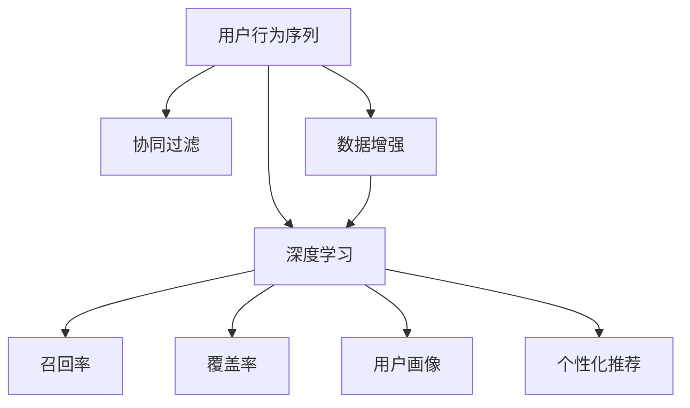

                 

# 大模型推荐中的用户行为序列表示学习新方法与应用

> 关键词：大模型推荐、用户行为序列、表示学习、协同过滤、深度学习、召回率、覆盖率、用户画像、个性化推荐

## 1. 背景介绍

### 1.1 问题由来
随着互联网和移动互联网的迅猛发展，用户行为数据越来越多地被用来指导个性化推荐系统的设计。如何高效地处理海量用户行为数据，提取有用的特征，并利用这些特征为用户生成精准推荐，是推荐系统面临的重大挑战。近年来，深度学习在推荐系统中的应用逐步增加，大模型成为新的热点，推荐系统的个性化能力得到显著提升。

推荐系统主要包括两部分，即召回和排序。召回是将候选集中的商品推荐给用户，覆盖率是衡量召回效果的重要指标。排序则是将候选人按相关性排序，召回率是衡量排序效果的重要指标。在大模型推荐中，由于可以同时处理大量的用户行为序列，因此覆盖率会显著提升。同时，大模型可以利用语义和上下文信息，提升排序效果。

### 1.2 问题核心关键点
1. 如何高效地利用用户行为序列数据进行深度学习建模，提升推荐系统的覆盖率和准确率。
2. 如何构建更加精细化的用户画像，刻画用户长期行为偏好，提升个性化推荐的效果。
3. 如何在大模型推荐中避免数据稀疏性带来的负面影响，提升推荐系统的效果。
4. 如何在保证推荐系统高效性的同时，提升模型的泛化能力和稳定性。

### 1.3 问题研究意义
研究高效的用户行为序列表示学习新方法，对于提升推荐系统的效果和覆盖率，具有重要意义：

1. 提升推荐系统的精度。深度学习模型可以自动提取用户行为序列中的高层次特征，提升推荐系统的准确率。
2. 提升推荐系统的覆盖率。大模型能够处理大量的用户行为序列数据，显著提升推荐的覆盖率。
3. 个性化推荐。通过构建精细化的用户画像，为每个用户提供个性化推荐，提升用户满意度。
4. 泛化能力提升。大模型利用数据分布的统计信息，可以显著提升模型的泛化能力，避免模型对新数据的适应能力不足。

## 2. 核心概念与联系

### 2.1 核心概念概述

为了更好地理解用户行为序列表示学习的原理和方法，本节将介绍几个相关核心概念：

1. 用户行为序列(User Behavior Sequence)：用户在不同时间点上的行为记录，如浏览、点击、购买等。用户行为序列是深度学习模型建模的基础数据。
2. 协同过滤(Collaborative Filtering)：通过用户之间的相似度或物品之间的相似度，为用户生成推荐，是推荐系统中的基本方法之一。
3. 深度学习(Deep Learning)：基于多层神经网络的机器学习方法，可以处理大量的非结构化数据，提取高层次的特征。
4. 召回率(Recall Rate)：推荐系统中，推荐的商品是否出现在了用户真实观看的商品集合中。召回率是衡量推荐系统效果的指标之一。
5. 覆盖率(Coverage Rate)：推荐系统中，推荐的商品是否覆盖了用户所有可能感兴趣的类别。覆盖率也是衡量推荐系统效果的指标之一。
6. 用户画像(User Profile)：通过对用户行为序列的深度学习，刻画用户长期行为偏好，为个性化推荐提供依据。
7. 个性化推荐(Personalized Recommendation)：根据用户画像，为用户生成个性化推荐，提升用户满意度。

这些核心概念之间的逻辑关系可以通过以下Mermaid流程图来展示：



这个流程图展示了大模型推荐的核心概念及其之间的关系：

1. 用户行为序列是深度学习模型的基础数据。
2. 协同过滤是推荐系统中的基本方法。
3. 深度学习模型可以提升推荐系统的精度和覆盖率。
4. 用户画像刻画用户长期行为偏好，用于个性化推荐。
5. 数据增强可以提升深度学习模型的效果。

这些概念共同构成了大模型推荐系统的学习和应用框架，使得推荐系统能够在处理海量用户行为数据时，提供更加精准、高效的个性化推荐。

## 3. 核心算法原理 & 具体操作步骤
### 3.1 算法原理概述

用户行为序列表示学习是深度学习在大模型推荐中的核心任务。其核心思想是：将用户行为序列转换为向量表示，利用向量表示指导推荐系统为用户生成推荐。

形式化地，假设用户行为序列为 $x_1, x_2, \cdots, x_T$，其中 $x_t$ 表示用户在第 $t$ 次行为，$T$ 为序列长度。假设深度学习模型为 $M$，则用户行为序列的表示学习问题可以表示为：

$$
\min_{\theta} \|M(x_1, x_2, \cdots, x_T) - y\|^2
$$

其中 $y$ 表示用户行为序列的表示，$\theta$ 为模型参数。最小化上述损失函数，可以得到用户行为序列的表示向量。

### 3.2 算法步骤详解

用户行为序列表示学习通常包括以下几个关键步骤：

**Step 1: 数据预处理**
- 对用户行为序列进行清洗和预处理，去除无效行为记录，标准化行为记录的格式。
- 对用户行为序列进行分词和编码，生成模型输入。

**Step 2: 模型设计**
- 选择合适的深度学习模型，如LSTM、GRU、Transformer等。
- 设计输入层、隐藏层和输出层，确定模型的超参数。

**Step 3: 模型训练**
- 使用用户行为序列数据进行模型训练，最小化损失函数。
- 使用数据增强技术，扩充训练数据，避免模型过拟合。
- 使用正则化技术，如Dropout、L2正则等，防止模型过拟合。

**Step 4: 模型评估**
- 在测试集上评估模型的性能，计算召回率和覆盖率等指标。
- 根据评估结果，调整模型参数，进一步优化模型。

**Step 5: 推荐生成**
- 将用户行为序列表示与物品特征向量进行拼接。
- 将拼接后的向量输入推荐模型，生成推荐结果。
- 根据推荐结果和用户历史行为，对候选商品进行排序，生成个性化推荐。

以上是用户行为序列表示学习的通用流程。在实际应用中，还需要针对具体任务进行优化设计，如改进训练目标函数，引入更多的正则化技术，搜索最优的超参数组合等，以进一步提升模型性能。

### 3.3 算法优缺点

用户行为序列表示学习具有以下优点：

1. 提升推荐系统的精度和覆盖率。深度学习模型可以自动提取用户行为序列中的高层次特征，提升推荐系统的准确率和覆盖率。
2. 提升个性化推荐的效果。通过构建精细化的用户画像，为每个用户提供个性化推荐，提升用户满意度。
3. 提升模型的泛化能力。深度学习模型利用数据分布的统计信息，可以显著提升模型的泛化能力，避免模型对新数据的适应能力不足。

同时，该方法也存在一定的局限性：

1. 数据稀疏性问题。用户行为序列数据往往比较稀疏，导致深度学习模型难以捕捉到用户的行为模式。
2. 计算成本较高。深度学习模型需要大量的计算资源进行训练和推理，对硬件和软件环境的要求较高。
3. 模型复杂性。深度学习模型相对复杂，容易发生过拟合，需要仔细调参。

尽管存在这些局限性，但用户行为序列表示学习仍然是大模型推荐系统的核心方法之一。未来相关研究的重点在于如何进一步降低计算成本，提升模型的泛化能力，解决数据稀疏性问题，同时兼顾模型的可解释性和伦理安全性等因素。

### 3.4 算法应用领域

用户行为序列表示学习在大模型推荐中的应用领域广泛，主要包括：

1. 电商推荐：对用户的浏览、点击、购买等行为进行深度学习建模，为用户生成个性化推荐。
2. 内容推荐：对用户的观看、点赞、分享等行为进行深度学习建模，为用户生成个性化视频、文章推荐。
3. 社交推荐：对用户的点赞、评论、关注等行为进行深度学习建模，为用户生成个性化好友、话题推荐。
4. 金融推荐：对用户的交易、投资等行为进行深度学习建模，为用户生成个性化金融产品推荐。
5. 旅游推荐：对用户的预订、评价等行为进行深度学习建模，为用户生成个性化旅游线路推荐。

除了这些应用场景，用户行为序列表示学习还被创新性地应用到更多场景中，如音乐推荐、游戏推荐等，为推荐系统带来了全新的突破。

## 4. 数学模型和公式 & 详细讲解
### 4.1 数学模型构建

本节将使用数学语言对用户行为序列表示学习的原理进行更加严格的刻画。

假设用户行为序列为 $x_1, x_2, \cdots, x_T$，其中 $x_t$ 表示用户在第 $t$ 次行为，$T$ 为序列长度。设深度学习模型为 $M_{\theta}$，其中 $\theta$ 为模型参数。设用户行为序列表示为 $y$，则用户行为序列表示学习问题可以表示为：

$$
\min_{\theta} \|M_{\theta}(x_1, x_2, \cdots, x_T) - y\|^2
$$

在实践中，我们通常使用基于梯度的优化算法（如SGD、Adam等）来近似求解上述最优化问题。设 $\eta$ 为学习率，则参数的更新公式为：

$$
\theta \leftarrow \theta - \eta \nabla_{\theta}\|M_{\theta}(x_1, x_2, \cdots, x_T) - y\|^2
$$

其中 $\nabla_{\theta}\|M_{\theta}(x_1, x_2, \cdots, x_T) - y\|^2$ 为损失函数对参数 $\theta$ 的梯度，可通过反向传播算法高效计算。

### 4.2 公式推导过程

以下我们以用户行为序列分类任务为例，推导交叉熵损失函数及其梯度的计算公式。

假设模型 $M_{\theta}$ 在输入 $(x,y)$ 上的输出为 $\hat{y}=M_{\theta}(x) \in [0,1]$，表示用户行为序列属于 $y$ 的概率。真实标签 $y \in \{0,1\}$。则二分类交叉熵损失函数定义为：

$$
\ell(M_{\theta}(x),y) = -[y\log \hat{y} + (1-y)\log (1-\hat{y})]
$$

将其代入损失函数公式，得：

$$
\mathcal{L}(\theta) = -\frac{1}{N}\sum_{i=1}^N \ell(M_{\theta}(x_i),y_i)
$$

根据链式法则，损失函数对参数 $\theta_k$ 的梯度为：

$$
\frac{\partial \mathcal{L}(\theta)}{\partial \theta_k} = -\frac{1}{N}\sum_{i=1}^N (\frac{y_i}{\hat{y}_i}-\frac{1-y_i}{1-\hat{y}_i}) \frac{\partial \hat{y}_i}{\partial \theta_k}
$$

其中 $\frac{\partial \hat{y}_i}{\partial \theta_k}$ 可进一步递归展开，利用自动微分技术完成计算。

在得到损失函数的梯度后，即可带入参数更新公式，完成模型的迭代优化。重复上述过程直至收敛，最终得到用户行为序列的表示向量 $\hat{y}$。

## 5. 项目实践：代码实例和详细解释说明
### 5.1 开发环境搭建

在进行用户行为序列表示学习实践前，我们需要准备好开发环境。以下是使用Python进行PyTorch开发的环境配置流程：

1. 安装Anaconda：从官网下载并安装Anaconda，用于创建独立的Python环境。

2. 创建并激活虚拟环境：
```bash
conda create -n pytorch-env python=3.8 
conda activate pytorch-env
```

3. 安装PyTorch：根据CUDA版本，从官网获取对应的安装命令。例如：
```bash
conda install pytorch torchvision torchaudio cudatoolkit=11.1 -c pytorch -c conda-forge
```

4. 安装Transformer库：
```bash
pip install transformers
```

5. 安装各类工具包：
```bash
pip install numpy pandas scikit-learn matplotlib tqdm jupyter notebook ipython
```

完成上述步骤后，即可在`pytorch-env`环境中开始用户行为序列表示学习的实践。

### 5.2 源代码详细实现

下面我们以用户行为序列分类任务为例，给出使用Transformers库进行用户行为序列表示学习的PyTorch代码实现。

首先，定义用户行为序列数据处理函数：

```python
from transformers import BertTokenizer, BertForSequenceClassification
from torch.utils.data import Dataset
import torch

class BehaviorSequenceDataset(Dataset):
    def __init__(self, texts, labels, tokenizer, max_len=128):
        self.texts = texts
        self.labels = labels
        self.tokenizer = tokenizer
        self.max_len = max_len
        
    def __len__(self):
        return len(self.texts)
    
    def __getitem__(self, item):
        text = self.texts[item]
        label = self.labels[item]
        
        encoding = self.tokenizer(text, return_tensors='pt', max_length=self.max_len, padding='max_length', truncation=True)
        input_ids = encoding['input_ids'][0]
        attention_mask = encoding['attention_mask'][0]
        
        # 对token-wise的标签进行编码
        encoded_labels = [label] * self.max_len
        labels = torch.tensor(encoded_labels, dtype=torch.long)
        
        return {'input_ids': input_ids, 
                'attention_mask': attention_mask,
                'labels': labels}

# 标签与id的映射
label2id = {'negative': 0, 'positive': 1}
id2label = {v: k for k, v in label2id.items()}

# 创建dataset
tokenizer = BertTokenizer.from_pretrained('bert-base-cased')

train_dataset = BehaviorSequenceDataset(train_texts, train_labels, tokenizer)
dev_dataset = BehaviorSequenceDataset(dev_texts, dev_labels, tokenizer)
test_dataset = BehaviorSequenceDataset(test_texts, test_labels, tokenizer)
```

然后，定义模型和优化器：

```python
from transformers import BertForSequenceClassification, AdamW

model = BertForSequenceClassification.from_pretrained('bert-base-cased', num_labels=len(label2id))

optimizer = AdamW(model.parameters(), lr=2e-5)
```

接着，定义训练和评估函数：

```python
from torch.utils.data import DataLoader
from tqdm import tqdm
from sklearn.metrics import classification_report

device = torch.device('cuda') if torch.cuda.is_available() else torch.device('cpu')
model.to(device)

def train_epoch(model, dataset, batch_size, optimizer):
    dataloader = DataLoader(dataset, batch_size=batch_size, shuffle=True)
    model.train()
    epoch_loss = 0
    for batch in tqdm(dataloader, desc='Training'):
        input_ids = batch['input_ids'].to(device)
        attention_mask = batch['attention_mask'].to(device)
        labels = batch['labels'].to(device)
        model.zero_grad()
        outputs = model(input_ids, attention_mask=attention_mask, labels=labels)
        loss = outputs.loss
        epoch_loss += loss.item()
        loss.backward()
        optimizer.step()
    return epoch_loss / len(dataloader)

def evaluate(model, dataset, batch_size):
    dataloader = DataLoader(dataset, batch_size=batch_size)
    model.eval()
    preds, labels = [], []
    with torch.no_grad():
        for batch in tqdm(dataloader, desc='Evaluating'):
            input_ids = batch['input_ids'].to(device)
            attention_mask = batch['attention_mask'].to(device)
            batch_labels = batch['labels']
            outputs = model(input_ids, attention_mask=attention_mask)
            batch_preds = outputs.logits.argmax(dim=2).to('cpu').tolist()
            batch_labels = batch_labels.to('cpu').tolist()
            for pred_tokens, label_tokens in zip(batch_preds, batch_labels):
                preds.append(pred_tokens[:len(label_tokens)])
                labels.append(label_tokens)
                
    print(classification_report(labels, preds))
```

最后，启动训练流程并在测试集上评估：

```python
epochs = 5
batch_size = 16

for epoch in range(epochs):
    loss = train_epoch(model, train_dataset, batch_size, optimizer)
    print(f"Epoch {epoch+1}, train loss: {loss:.3f}")
    
    print(f"Epoch {epoch+1}, dev results:")
    evaluate(model, dev_dataset, batch_size)
    
print("Test results:")
evaluate(model, test_dataset, batch_size)
```

以上就是使用PyTorch对用户行为序列进行分类任务建模的完整代码实现。可以看到，得益于Transformer库的强大封装，我们可以用相对简洁的代码完成用户行为序列的深度学习建模。

### 5.3 代码解读与分析

让我们再详细解读一下关键代码的实现细节：

**BehaviorSequenceDataset类**：
- `__init__`方法：初始化文本、标签、分词器等关键组件。
- `__len__`方法：返回数据集的样本数量。
- `__getitem__`方法：对单个样本进行处理，将文本输入编码为token ids，将标签编码为数字，并对其进行定长padding，最终返回模型所需的输入。

**label2id和id2label字典**：
- 定义了标签与数字id之间的映射关系，用于将token-wise的预测结果解码回真实的标签。

**训练和评估函数**：
- 使用PyTorch的DataLoader对数据集进行批次化加载，供模型训练和推理使用。
- 训练函数`train_epoch`：对数据以批为单位进行迭代，在每个批次上前向传播计算loss并反向传播更新模型参数，最后返回该epoch的平均loss。
- 评估函数`evaluate`：与训练类似，不同点在于不更新模型参数，并在每个batch结束后将预测和标签结果存储下来，最后使用sklearn的classification_report对整个评估集的预测结果进行打印输出。

**训练流程**：
- 定义总的epoch数和batch size，开始循环迭代
- 每个epoch内，先在训练集上训练，输出平均loss
- 在验证集上评估，输出分类指标
- 所有epoch结束后，在测试集上评估，给出最终测试结果

可以看到，PyTorch配合Transformer库使得用户行为序列的深度学习建模变得简洁高效。开发者可以将更多精力放在数据处理、模型改进等高层逻辑上，而不必过多关注底层的实现细节。

当然，工业级的系统实现还需考虑更多因素，如模型的保存和部署、超参数的自动搜索、更灵活的任务适配层等。但核心的用户行为序列表示学习范式基本与此类似。

## 6. 实际应用场景
### 6.1 电商推荐

基于用户行为序列表示学习的电商推荐系统可以显著提升推荐效果。用户在不同时间点的浏览、点击、购买等行为序列蕴含了大量信息，可以用于刻画用户的长期行为偏好，从而生成个性化推荐。

在技术实现上，可以收集用户的浏览历史、点击历史和购买历史，作为用户行为序列数据。在行为序列数据上训练用户行为序列表示模型，将用户行为序列转换为向量表示。同时，在物品特征向量库上训练推荐模型，将用户行为序列向量与物品特征向量进行拼接，生成推荐结果。对于新用户，可以使用无监督学习方法生成初始用户画像，提升推荐系统的冷启动效果。

### 6.2 内容推荐

内容推荐系统需要对用户的观看历史、点赞历史、分享历史等行为序列进行深度学习建模，为用户生成个性化视频、文章推荐。用户行为序列表示模型可以在视频、文章等不同内容类型上训练，将用户行为序列转换为向量表示，与内容向量进行拼接，生成推荐结果。

在推荐模型中，可以使用深度学习模型如LSTM、GRU、Transformer等，设计合适的输入层和输出层，训练模型最小化损失函数。同时，可以使用数据增强技术扩充训练集，提升模型的泛化能力。

### 6.3 社交推荐

社交推荐系统需要对用户的点赞历史、评论历史、关注历史等行为序列进行深度学习建模，为用户生成个性化好友、话题推荐。用户行为序列表示模型可以在好友、话题等不同社交类型上训练，将用户行为序列转换为向量表示，与好友、话题向量进行拼接，生成推荐结果。

在推荐模型中，可以使用深度学习模型如LSTM、GRU、Transformer等，设计合适的输入层和输出层，训练模型最小化损失函数。同时，可以使用数据增强技术扩充训练集，提升模型的泛化能力。

### 6.4 未来应用展望

随着用户行为序列表示学习的不断进步，基于深度学习模型的推荐系统将在更多领域得到应用，为各行各业带来变革性影响。

在智慧医疗领域，推荐系统可以对医生的诊疗记录、药品使用历史等行为序列进行深度学习建模，为医生推荐个性化诊疗方案，提升诊疗效果。

在智能教育领域，推荐系统可以对学生的学习行为、作业完成情况等行为序列进行深度学习建模，为学生推荐个性化学习资源，提升学习效果。

在智慧城市治理中，推荐系统可以对市民的出行记录、环保行为等行为序列进行深度学习建模，为市民推荐个性化出行方案，提升城市治理的智能化水平。

此外，在企业生产、社会治理、文娱传媒等众多领域，基于用户行为序列表示学习的推荐系统也将不断涌现，为经济社会发展注入新的动力。相信随着技术的日益成熟，用户行为序列表示学习必将在推荐系统中发挥越来越重要的作用。

## 7. 工具和资源推荐
### 7.1 学习资源推荐

为了帮助开发者系统掌握用户行为序列表示学习的原理和方法，这里推荐一些优质的学习资源：

1. 《深度学习与推荐系统》系列博文：由深度学习领域专家撰写，深入浅出地介绍了深度学习在推荐系统中的应用，包括用户行为序列表示学习等前沿话题。

2. CS229《机器学习》课程：斯坦福大学开设的机器学习明星课程，有Lecture视频和配套作业，带你深入理解机器学习的基本概念和经典算法。

3. 《Deep Learning for Recommender Systems》书籍：系统介绍了深度学习在推荐系统中的应用，包括用户行为序列表示学习等前沿技术。

4. Kaggle推荐系统竞赛：Kaggle平台上的推荐系统竞赛，提供了大量真实数据和算法实现，适合实践用户行为序列表示学习算法。

5. YouTube推荐系统开源项目：YouTube平台的开源推荐系统，提供了丰富的算法实现和模型库，适合学习用户行为序列表示学习的最佳实践。

通过对这些资源的学习实践，相信你一定能够快速掌握用户行为序列表示学习的精髓，并用于解决实际的推荐系统问题。
###  7.2 开发工具推荐

高效的开发离不开优秀的工具支持。以下是几款用于用户行为序列表示学习开发的常用工具：

1. PyTorch：基于Python的开源深度学习框架，灵活动态的计算图，适合快速迭代研究。大部分深度学习模型都有PyTorch版本的实现。

2. TensorFlow：由Google主导开发的开源深度学习框架，生产部署方便，适合大规模工程应用。同样有丰富的深度学习模型资源。

3. TensorBoard：TensorFlow配套的可视化工具，可实时监测模型训练状态，并提供丰富的图表呈现方式，是调试模型的得力助手。

4. Weights & Biases：模型训练的实验跟踪工具，可以记录和可视化模型训练过程中的各项指标，方便对比和调优。与主流深度学习框架无缝集成。

5. Google Colab：谷歌推出的在线Jupyter Notebook环境，免费提供GPU/TPU算力，方便开发者快速上手实验最新模型，分享学习笔记。

合理利用这些工具，可以显著提升用户行为序列表示学习的开发效率，加快创新迭代的步伐。

### 7.3 相关论文推荐

用户行为序列表示学习在大模型推荐中的应用，源于学界的持续研究。以下是几篇奠基性的相关论文，推荐阅读：

1. Recurrent Neural Network-Based Recommender System: Architecture, Training, and Testing: A Case Study with Large-Scale Software Store Datasets：提出了基于RNN的推荐系统，展示了深度学习在推荐系统中的基础应用。

2. A deep learning framework for scalable music recommendation：提出了一种基于深度学习框架的音乐推荐系统，利用用户行为序列进行建模，取得了不错的推荐效果。

3. Sequence-aware representation learning for personalized recommendations：提出了一种基于序列感知表示学习的推荐系统，利用用户行为序列进行建模，取得了不错的推荐效果。

4. Dynamic Deep Interest Networks for Recommendations: Learning to Recommend with Multi-Interest Representations：提出了一种基于动态深度兴趣网络的推荐系统，利用用户行为序列进行建模，取得了不错的推荐效果。

5. Streaming Recommendation Systems: A Survey: Gaps and Challenges：总结了流式推荐系统的现状、挑战和未来研究方向，对用户行为序列表示学习提供了一定的指导。

这些论文代表了大模型推荐系统的研究进展。通过学习这些前沿成果，可以帮助研究者把握学科前进方向，激发更多的创新灵感。

## 8. 总结：未来发展趋势与挑战
### 8.1 总结

本文对用户行为序列表示学习的原理和方法进行了全面系统的介绍。首先阐述了用户行为序列表示学习在大模型推荐系统中的应用背景和意义，明确了其在大模型推荐系统中的核心作用。其次，从原理到实践，详细讲解了用户行为序列表示学习的数学原理和关键步骤，给出了用户行为序列表示学习的完整代码实现。同时，本文还广泛探讨了用户行为序列表示学习在电商推荐、内容推荐、社交推荐等多个领域的应用前景，展示了其巨大的应用潜力。

通过本文的系统梳理，可以看到，用户行为序列表示学习在大模型推荐系统中发挥着越来越重要的作用。深度学习模型可以高效地利用用户行为序列数据，提取高层次的特征，从而提升推荐系统的精度和覆盖率，实现个性化推荐。未来，用户行为序列表示学习将成为推荐系统的核心技术之一，为更多领域的推荐系统带来变革性影响。

### 8.2 未来发展趋势

展望未来，用户行为序列表示学习的发展趋势如下：

1. 模型规模持续增大。随着算力成本的下降和数据规模的扩张，深度学习模型的参数量还将持续增长。超大规模用户行为序列数据蕴含的丰富信息，有望进一步提升推荐系统的精度和覆盖率。

2. 模型结构更加复杂。深度学习模型的结构会更加复杂，引入更多的注意力机制、卷积神经网络等，提升推荐系统的效果。

3. 多模态信息融合。除了用户行为序列数据，深度学习模型还可以利用视觉、音频等多模态数据，提升推荐系统的效果。

4. 推荐系统实时化。用户行为序列表示学习模型将实时处理用户行为数据，动态生成个性化推荐，提升推荐系统的响应速度。

5. 推荐系统个性化。深度学习模型将更加精细化地刻画用户长期行为偏好，提升个性化推荐的效果。

6. 推荐系统实时化。用户行为序列表示学习模型将实时处理用户行为数据，动态生成个性化推荐，提升推荐系统的响应速度。

以上趋势凸显了用户行为序列表示学习的广阔前景。这些方向的探索发展，必将进一步提升推荐系统的效果和效率，为更多领域的推荐系统带来变革性影响。

### 8.3 面临的挑战

尽管用户行为序列表示学习已经取得了显著进展，但在迈向更加智能化、普适化应用的过程中，仍面临以下挑战：

1. 数据隐私和安全问题。用户行为序列数据往往包含大量隐私信息，如何在保护隐私的前提下，进行深度学习建模，是一个重要问题。

2. 数据稀疏性问题。用户行为序列数据往往比较稀疏，导致深度学习模型难以捕捉到用户的行为模式。

3. 计算成本问题。深度学习模型需要大量的计算资源进行训练和推理，对硬件和软件环境的要求较高。

4. 模型复杂性问题。深度学习模型相对复杂，容易发生过拟合，需要仔细调参。

5. 模型的可解释性问题。深度学习模型往往像"黑盒"一样，难以解释其内部工作机制和决策逻辑。

6. 模型的公平性和公正性问题。深度学习模型可能学习到用户行为序列中的偏见和歧视，影响推荐系统的公平性和公正性。

7. 模型的实时性问题。实时处理用户行为序列数据，需要高效的算法和硬件支持。

8. 模型的鲁棒性问题。深度学习模型可能对噪声数据和异常数据比较敏感，影响推荐系统的鲁棒性。

以上挑战需要深度学习社区和推荐系统社区共同应对，不断优化算法和技术，才能进一步提升用户行为序列表示学习的效果和应用范围。

### 8.4 研究展望

面对用户行为序列表示学习所面临的诸多挑战，未来的研究需要在以下几个方面寻求新的突破：

1. 探索无监督和半监督学习算法。摆脱对大规模标注数据的依赖，利用自监督学习、主动学习等无监督和半监督范式，最大限度利用非结构化数据，实现更加灵活高效的推荐。

2. 研究参数高效和计算高效的推荐算法。开发更加参数高效的推荐方法，在固定大部分预训练参数的情况下，只更新极少量的任务相关参数。同时优化推荐模型的计算图，减少前向传播和反向传播的资源消耗，实现更加轻量级、实时性的部署。

3. 融合因果和对比学习范式。通过引入因果推断和对比学习思想，增强推荐模型建立稳定因果关系的能力，学习更加普适、鲁棒的语言表征，从而提升推荐系统的效果。

4. 引入更多先验知识。将符号化的先验知识，如知识图谱、逻辑规则等，与神经网络模型进行巧妙融合，引导推荐过程学习更准确、合理的语言模型。同时加强不同模态数据的整合，实现视觉、语音等多模态信息与文本信息的协同建模。

5. 结合因果分析和博弈论工具。将因果分析方法引入推荐模型，识别出推荐模型决策的关键特征，增强输出解释的因果性和逻辑性。借助博弈论工具刻画人机交互过程，主动探索并规避推荐模型的脆弱点，提高系统稳定性。

6. 纳入伦理道德约束。在推荐模型训练目标中引入伦理导向的评估指标，过滤和惩罚有偏见、有害的输出倾向。同时加强人工干预和审核，建立推荐模型的监管机制，确保输出符合人类价值观和伦理道德。

这些研究方向的探索，必将引领用户行为序列表示学习技术迈向更高的台阶，为构建安全、可靠、可解释、可控的智能推荐系统铺平道路。面向未来，用户行为序列表示学习技术还需要与其他人工智能技术进行更深入的融合，如知识表示、因果推理、强化学习等，多路径协同发力，共同推动推荐系统技术的发展。只有勇于创新、敢于突破，才能不断拓展用户行为序列表示学习的边界，让智能推荐系统更好地造福人类社会。

## 9. 附录：常见问题与解答

**Q1：用户行为序列表示学习是否适用于所有推荐系统任务？**

A: 用户行为序列表示学习在大多数推荐系统任务上都能取得不错的效果，特别是对于数据量较大的任务。但对于一些特定领域的任务，如医疗、法律等，仅仅依靠用户行为序列数据可能难以很好地适应。此时需要在特定领域语料上进一步预训练，再进行微调，才能获得理想效果。此外，对于一些需要时效性、个性化很强的任务，如对话、推荐等，微调方法也需要针对性的改进优化。

**Q2：数据隐私和安全问题如何解决？**

A: 解决数据隐私和安全问题需要从多个方面入手，包括：
1. 数据脱敏技术。对用户行为序列数据进行数据脱敏处理，去除个人隐私信息，保护用户隐私。
2. 差分隐私技术。通过在数据中加入噪声，使得任何单个样本的信息难以被泄露，保护用户隐私。
3. 联邦学习技术。将深度学习模型训练任务分布式到多个设备上进行，只在本地设备上训练模型，不泄露本地数据，保护数据隐私。

**Q3：数据稀疏性问题如何解决？**

A: 解决数据稀疏性问题需要从多个方面入手，包括：
1. 数据增强技术。通过回译、近义替换等方式扩充训练集，提升模型的泛化能力。
2. 嵌入式特征工程技术。将用户行为序列数据与其他特征（如时间、地理位置等）进行拼接，提升模型的预测能力。
3. 冷启动模型。对于新用户，可以使用无监督学习方法生成初始用户画像，提升推荐系统的冷启动效果。

**Q4：计算成本问题如何解决？**

A: 解决计算成本问题需要从多个方面入手，包括：
1. 模型裁剪技术。去除不必要的层和参数，减小模型尺寸，加快推理速度。
2. 量化加速技术。将浮点模型转为定点模型，压缩存储空间，提高计算效率。
3. 混合精度训练技术。使用混合精度训练技术，减少计算精度，提高计算效率。

**Q5：模型的可解释性问题如何解决？**

A: 解决模型的可解释性问题需要从多个方面入手，包括：
1. 特征重要性分析。利用特征重要性分析技术，识别出模型决策的关键特征，增强输出解释的因果性和逻辑性。
2. 可解释性模型。选择具有可解释性的深度学习模型，如决策树、线性回归等，提升模型的可解释性。
3. 模型可视化。使用可视化工具，展示模型的决策过程，增强模型的可解释性。

**Q6：模型的公平性和公正性问题如何解决？**

A: 解决模型的公平性和公正性问题需要从多个方面入手，包括：
1. 公平性约束。在推荐模型训练目标中引入公平性约束，避免模型对特定群体的偏见。
2. 公平性检测。在推荐模型测试集上检测模型的公平性，及时调整模型参数，避免模型对特定群体的偏见。
3. 人工干预。加强人工干预和审核，建立推荐模型的监管机制，确保输出符合人类价值观和伦理道德。

这些措施需要深度学习社区和推荐系统社区共同努力，才能在用户行为序列表示学习中实现公平、公正、透明的推荐系统。

