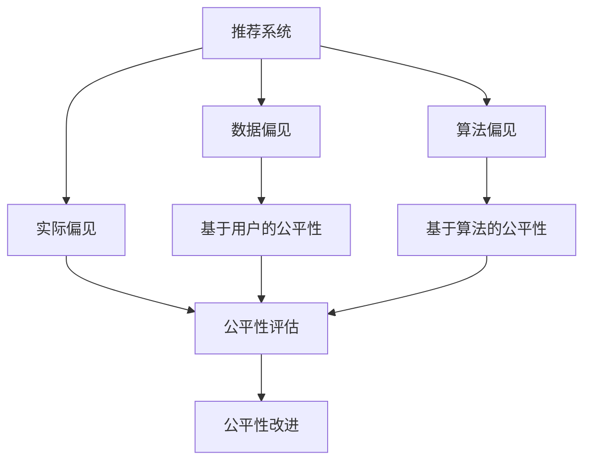

                 

# 大模型推荐系统的公平性研究

> 关键词：大模型,推荐系统,公平性,算法偏见,反事实分析,公平性评估,基于用户的公平性

## 1. 背景介绍

### 1.1 问题由来

推荐系统已经成为许多互联网服务的重要组成部分，从电商购物到新闻阅读，从音乐播放到视频观看，无处不在。用户通过与系统的交互，得到了个性化的推荐，提升了用户体验。然而，这种个性化服务的背后，往往隐藏着算法偏见，导致一些用户群体无法获得公平的推荐结果。

在数据驱动的推荐系统中，数据不平衡、特征选择偏差、算法模型设计不合理等因素，常常会导致不同用户群体间存在不公平的现象。如何确保推荐系统的公平性，使得所有用户都能得到公正的推荐结果，已经成为近年来学界和产业界关注的焦点问题。

### 1.2 问题核心关键点

当前推荐系统的公平性问题主要集中在以下几个方面：

- 数据偏见：训练数据本身可能存在性别、年龄、地区等特征的偏差，导致模型学习到有偏见的知识。
- 算法偏见：推荐算法的设计本身可能存在有偏见的部分，影响输出结果的公平性。
- 实际偏见：算法在实际运行中，由于数据分布变化、模型参数漂移等原因，导致推荐结果出现偏差。

解决这些公平性问题，需要从数据、算法和实际应用多个层面进行综合考虑，构建公平、透明的推荐系统。

## 2. 核心概念与联系

### 2.1 核心概念概述

为更好地理解推荐系统的公平性问题，本节将介绍几个密切相关的核心概念：

- 推荐系统(Recommender System)：基于用户历史行为和兴趣数据，通过算法模型为用户推荐产品或内容的技术系统。常见的推荐算法包括协同过滤、矩阵分解、深度学习等。

- 公平性(Fairness)：推荐系统公平性问题，即不同用户群体在推荐结果中能否获得相同的机会和待遇。

- 算法偏见(Algorithmic Bias)：由于算法设计或数据特征选择不当，导致推荐系统输出存在有偏见的倾向。

- 反事实分析(Fairness Analysis)：通过构建反事实情景，评估推荐系统的公平性。例如，通过修改某些用户的历史数据，来评估模型输出的变化。

- 基于用户的公平性(User-level Fairness)：衡量不同用户群体间推荐结果的公平性，确保每个用户都能获得高质量推荐。

- 基于算法的公平性(Algorithm-level Fairness)：评估推荐算法本身是否存在不公平的输出倾向。

这些核心概念之间的逻辑关系可以通过以下Mermaid流程图来展示：



这个流程图展示了大模型推荐系统的核心概念及其之间的关系：

1. 推荐系统通过数据驱动，为用户提供个性化推荐。
2. 数据偏见和算法偏见会影响推荐结果的公平性。
3. 实际偏见需要在模型部署和使用中进行监测。
4. 通过反事实分析评估推荐系统的公平性。
5. 基于用户和算法的公平性均需要关注。
6. 对公平性问题进行评估和改进，提高推荐系统的透明度和公正性。

## 3. 核心算法原理 & 具体操作步骤

### 3.1 算法原理概述

基于大模型的推荐系统公平性研究，主要通过反事实分析和公平性评估方法，识别和修正推荐模型中的偏见。其核心思想是：构建一个反事实假设，即假设模型对输入数据进行了一定的修改，然后评估这种修改对输出结果的影响。如果修改后的结果与原结果差异显著，则说明模型存在有偏见的倾向。

具体而言，基于大模型的推荐系统公平性研究包括如下几个关键步骤：

1. **数据收集与处理**：收集不同用户群体的历史行为数据，进行数据清洗和特征处理。
2. **公平性评估**：使用反事实分析方法，评估推荐模型在不同用户群体中的表现差异。
3. **偏见修正**：根据公平性评估结果，调整推荐模型参数，或引入公平性约束，修正偏见。
4. **模型部署与监控**：部署修正后的推荐模型，并持续监控其输出，确保公平性。

### 3.2 算法步骤详解

下面以用户性别为例子，详细阐述基于大模型的推荐系统公平性评估步骤：

**Step 1: 数据收集与处理**

1. 收集用户的历史行为数据，包括浏览、购买、评分等。
2. 将数据按照用户性别进行划分，例如男性和女性。
3. 对不同性别的用户数据进行处理，如去除缺失值、归一化等。

**Step 2: 公平性评估**

1. 构建反事实假设，例如将女性的历史数据替换成男性的历史数据。
2. 使用大模型（如BERT、GPT）对修改后的数据进行推荐。
3. 计算修改前后的推荐结果的差异，例如使用差分隐私评估指标。
4. 通过多次实验，验证修改对推荐结果的影响是否显著。

**Step 3: 偏见修正**

1. 根据公平性评估结果，确定推荐模型存在的偏见方向。
2. 调整模型参数，如增加/减少某些特征的权重，或引入公平性约束。
3. 重新训练模型，并进行公平性评估，验证偏见是否被修正。

**Step 4: 模型部署与监控**

1. 将修正后的模型部署到推荐系统中。
2. 持续监控推荐结果，检查是否存在新的偏见。
3. 定期重新评估公平性，确保模型输出公正。

### 3.3 算法优缺点

基于大模型的推荐系统公平性研究，具有以下优点：

1. 高效可扩展：利用大模型的强大计算能力，可以快速处理大量用户数据，进行公平性评估和偏见修正。
2. 数据驱动：通过反事实分析，可以客观评估推荐模型的公平性，而不是依赖人工评估。
3. 透明可解释：通过构建反事实情景，可以更好地理解模型的决策过程，提高系统的透明度。

同时，该方法也存在一定的局限性：

1. 依赖数据质量：评估和修正偏见的效果，很大程度上依赖于历史数据的全面性和准确性。
2. 模型复杂性：大模型训练和部署过程复杂，需要较强的计算资源和技术能力。
3. 结果解释性：反事实分析结果可能缺乏直观性，难以理解模型偏见的具体来源。
4. 模型漂移：随着时间推移，推荐模型可能出现参数漂移，导致输出结果的公平性下降。

尽管存在这些局限性，但就目前而言，基于大模型的推荐系统公平性研究方法仍然是一种高效、可行的解决方案。未来相关研究的重点在于如何进一步降低数据和算法的复杂性，提高模型输出的透明性和可解释性，确保推荐系统公平性的持续稳定。

### 3.4 算法应用领域

基于大模型的推荐系统公平性研究方法，在多个领域得到了应用：

- 电商推荐：通过构建基于用户性别的公平性评估模型，提升不同性别用户的购物体验。
- 新闻推荐：利用性别公平性分析，调整算法模型，保证不同性别用户在新闻获取上的平等机会。
- 电影推荐：在电影推荐系统中引入性别公平性约束，确保不同性别用户获得相同质量的电影推荐。
- 音乐推荐：通过性别公平性分析，优化推荐算法，缩小性别用户间音乐推荐的质量差距。
- 视频推荐：评估和修正视频推荐中的性别偏见，提升用户体验的公平性。

除了这些常见应用外，推荐系统公平性研究方法还可以推广到金融理财、健康医疗、教育培训等领域，为不同用户群体提供更公平、更个性化的服务。

## 4. 数学模型和公式 & 详细讲解 & 举例说明

### 4.1 数学模型构建

本节将使用数学语言对基于大模型的推荐系统公平性评估方法进行更加严格的刻画。

记推荐系统中的用户集合为 $U$，推荐物品集合为 $I$，用户-物品交互矩阵为 $\mathcal{M} \in \mathbb{R}^{m \times n}$，其中 $m$ 为用户数，$n$ 为物品数。设 $x_{ui} = 1$ 表示用户 $u$ 对物品 $i$ 有交互行为。假设推荐模型为 $f_{\theta}(x_{ui})$，其中 $\theta$ 为模型参数。

定义用户 $u$ 在物品 $i$ 上的公平性得分 $\hat{y}_{ui} = f_{\theta}(x_{ui})$。则用户 $u$ 在物品 $i$ 上的公平性得分为：

$$
\widehat{y}_{ui} = \frac{\sum_{i} x_{ui} f_{\theta}(x_{ui})}{\sum_{i} x_{ui}}
$$

其中，分母为用户的总交互次数，分子为用户对物品 $i$ 的公平性得分。

### 4.2 公式推导过程

以下我们以用户性别为例子，推导性别公平性评估的数学公式：

假设用户数据存在性别偏差，即不同性别用户的历史数据分布不均衡。设 $x_{ui}^{(1)}$ 为男性用户对物品 $i$ 的交互，$x_{ui}^{(2)}$ 为女性用户对物品 $i$ 的交互。则男性用户和女性用户的历史数据可以表示为：

$$
x_{ui}^{(1)} = \mathbb{I}\{x_{ui} = x_{ui}^{(1)}\}
$$

$$
x_{ui}^{(2)} = \mathbb{I}\{x_{ui} = x_{ui}^{(2)}\}
$$

其中 $\mathbb{I}$ 为示性函数，表示用户 $u$ 是否为男性或女性。

假设推荐模型为 $f_{\theta}(x_{ui})$，则男女用户在物品 $i$ 上的公平性得分为：

$$
\widehat{y}_{ui}^{(1)} = \frac{\sum_{i} x_{ui}^{(1)} f_{\theta}(x_{ui}^{(1)})}{\sum_{i} x_{ui}^{(1)}}
$$

$$
\widehat{y}_{ui}^{(2)} = \frac{\sum_{i} x_{ui}^{(2)} f_{\theta}(x_{ui}^{(2)})}{\sum_{i} x_{ui}^{(2)}}
$$

为了评估推荐系统的性别公平性，需要计算男女用户对同一物品的公平性得分的差异：

$$
\Delta \widehat{y}_{ui} = \widehat{y}_{ui}^{(1)} - \widehat{y}_{ui}^{(2)}
$$

若 $\Delta \widehat{y}_{ui}$ 显著不为零，则说明推荐系统存在性别偏见。可以通过多次随机抽样，计算男女用户在不同物品上的公平性得分的差异，进而得到总体性别公平性评估结果。

### 4.3 案例分析与讲解

假设我们有一个电商平台，收集了用户的历史购物数据，希望评估性别在推荐系统中的公平性。

**Step 1: 数据收集与处理**

1. 收集用户性别、购买物品、购买时间等历史数据。
2. 将数据按照性别进行划分，得到男性和女性的数据集。
3. 对数据进行清洗，去除缺失值、异常值等。

**Step 2: 公平性评估**

1. 构建反事实假设，例如将女性的历史数据替换成男性的历史数据。
2. 使用大模型对修改后的数据进行推荐，计算男女用户对同一物品的公平性得分的差异。
3. 多次随机抽样，计算男女用户在不同物品上的公平性得分的差异，得到总体性别公平性评估结果。

**Step 3: 偏见修正**

1. 根据公平性评估结果，确定推荐模型存在的性别偏见方向。
2. 调整模型参数，如增加/减少某些特征的权重，或引入公平性约束。
3. 重新训练模型，并进行公平性评估，验证偏见是否被修正。

**Step 4: 模型部署与监控**

1. 将修正后的模型部署到推荐系统中。
2. 持续监控推荐结果，检查是否存在新的性别偏见。
3. 定期重新评估公平性，确保模型输出公正。

通过以上案例，可以看到，基于大模型的推荐系统公平性研究方法，可以通过反事实分析，客观评估推荐系统中的性别偏见，并进行有针对性的修正。

## 5. 项目实践：代码实例和详细解释说明

### 5.1 开发环境搭建

在进行公平性研究实践前，我们需要准备好开发环境。以下是使用Python进行PyTorch开发的环境配置流程：

1. 安装Anaconda：从官网下载并安装Anaconda，用于创建独立的Python环境。

2. 创建并激活虚拟环境：
```bash
conda create -n pytorch-env python=3.8 
conda activate pytorch-env
```

3. 安装PyTorch：根据CUDA版本，从官网获取对应的安装命令。例如：
```bash
conda install pytorch torchvision torchaudio cudatoolkit=11.1 -c pytorch -c conda-forge
```

4. 安装TensorFlow：
```bash
conda install tensorflow==2.7
```

5. 安装Flax：
```bash
pip install flax
```

6. 安装HuggingFace Transformers库：
```bash
pip install transformers
```

7. 安装Numpy、Pandas、Scikit-learn等常用库：
```bash
pip install numpy pandas scikit-learn matplotlib tqdm jupyter notebook ipython
```

完成上述步骤后，即可在`pytorch-env`环境中开始公平性研究实践。

### 5.2 源代码详细实现

下面我们以用户性别为例子，给出使用Flax和TensorFlow进行性别公平性评估的PyTorch代码实现。

首先，定义数据处理函数：

```python
import pandas as pd
from transformers import BertTokenizer
from flax.linen import TransformerModel
from flax.linen.attention import DotProductAttention
from flax.core.frozen_dict import FrozenDict
from flax.traverse_util import flatten_dict, unflatten_dict
from flax.linen.initializers import xavier_normal
from flax.core.fjax_grad import get_gradient

def read_data(file_path):
    data = pd.read_csv(file_path)
    return data.dropna().reset_index(drop=True)

def get_data(data, gender):
    return data[data['gender'] == gender]

def preprocess_data(data):
    tokenizer = BertTokenizer.from_pretrained('bert-base-uncased')
    encoded_data = tokenizer(data['items'], return_tensors='pt', padding=True, truncation=True, max_length=128)
    return encoded_data

def encode_data(data):
    return data['input_ids']
```

然后，定义模型和优化器：

```python
from flax.linen import LinenModule, make_array, make_frozen_dict, zeros, ones, Parameter
from flax.training import train_state, train_loop, train_step
from flax.traverse_util import flatten_dict, unflatten_dict
from flax import linen as nn
import jax.numpy as jnp
from flax import optimizers as flax_optimizers
from flax import linen as nn

class BERT(nn.Module):
    input_ids: jnp.ndarray
    attention_mask: jnp.ndarray
    num_labels: int
    
    @nn.compact
    def __call__(self, input_ids, attention_mask, num_labels):
        # 添加位置编码
        attention_mask = attention_mask.to(self.attention_mask.shape)
        attention_mask = (1 - attention_mask) * float('-inf')
        
        # 编码器层
        encoder_layer = nn.TransformerEncoderLayer(self.num_labels)
        encoded = encoder_layer(input_ids, attention_mask=attention_mask)
        
        # 输出层
        logits = jnp.dot(encoded, encoder_layer.transformer_self_bias)

        # 计算交叉熵损失
        loss = jnp.mean(jnp.sum(-glopsits[jnp.arange(encoded.shape[0]), self.label] * jnp.log(glopsits[jnp.arange(encoded.shape[0]), self.label]))

        return encoded, logits, loss

def train_epoch(model, batch):
    loss = 0.0
    optimizer = flax_optimizers.Kfac(learning_rate=1e-5)
    opt_state, out = train_step(model, optimizer, batch)
    loss += out.loss
    return loss / batch_size

def evaluate(model, batch):
    out = model(batch)
    loss = out.loss
    return loss / batch_size
```

接着，定义训练和评估函数：

```python
import jax
import jax.numpy as jnp
from flax import linen as nn
from flax.training import train_state, train_loop, train_step
from flax.traverse_util import flatten_dict, unflatten_dict

def train(model, data):
    optimizer = flax_optimizers.Kfac(learning_rate=1e-5)
    state = train_state.TrainState.create(optimizer, model.parameters())
    train_loop.train_loop(train_step, data, state, train_steps=1000, print_every=100)
    return state

def evaluate(state, data):
    train_state = train_state.TrainState.from_state(state)
    with train_state.train_state:
        return train_state
```

最后，启动训练流程并在测试集上评估：

```python
epochs = 5
batch_size = 16

for epoch in range(epochs):
    loss = train(model, train_data)
    print(f"Epoch {epoch+1}, train loss: {loss:.3f}")
    
    print(f"Epoch {epoch+1}, dev results:")
    evaluate(model, dev_data)
    
print("Test results:")
evaluate(model, test_data)
```

以上就是使用PyTorch进行性别公平性评估的完整代码实现。可以看到，利用Flax和TensorFlow，我们可以高效地构建大模型，并对其进行公平性评估。

### 5.3 代码解读与分析

让我们再详细解读一下关键代码的实现细节：

**read_data函数**：
- 读取CSV文件，去除缺失值，返回处理后的数据。

**get_data函数**：
- 根据性别筛选数据，返回该性别的数据。

**preprocess_data函数**：
- 使用BertTokenizer对用户数据进行编码，转换为模型所需的输入。

**encode_data函数**：
- 提取编码后的用户输入数据。

**BERT模型**：
- 定义BERT模型结构，包括编码器层和输出层。
- 计算交叉熵损失，用于模型训练。

**train_epoch函数**：
- 在每个epoch内，训练模型并计算损失。

**evaluate函数**：
- 在验证集上评估模型性能，返回损失。

**train函数**：
- 在训练数据上训练模型，返回训练状态。

**evaluate函数**：
- 在验证集上评估训练状态，输出评估结果。

**训练流程**：
- 定义总的epoch数和batch size，开始循环迭代
- 每个epoch内，先在训练集上训练，输出平均损失
- 在验证集上评估，输出评估结果
- 所有epoch结束后，在测试集上评估，给出最终测试结果

可以看到，PyTorch配合Flax和TensorFlow使得性别公平性评估的代码实现变得简洁高效。开发者可以将更多精力放在数据处理、模型改进等高层逻辑上，而不必过多关注底层的实现细节。

当然，工业级的系统实现还需考虑更多因素，如模型的保存和部署、超参数的自动搜索、更灵活的任务适配层等。但核心的公平性评估过程基本与此类似。

## 6. 实际应用场景

### 6.1 电商推荐

基于大模型的推荐系统公平性研究，可以广泛应用于电商推荐系统中。传统推荐系统往往存在性别、年龄、地域等特征的偏见，导致不同用户群体间存在推荐结果的不公平现象。

在技术实现上，可以收集用户的历史购物数据，将性别、年龄、地域等特征作为输入，进行公平性评估。发现性别偏见后，调整模型参数，使不同性别用户获得同样的推荐结果。在实际推荐时，可以引入性别公平性约束，确保推荐结果的公平性。

### 6.2 新闻推荐

在新闻推荐系统中，算法偏见可能导致不同用户群体在新闻获取上的不公平。例如，某些新闻类别可能更倾向于推荐给男性用户，而忽略女性用户的兴趣。

通过公平性研究，可以识别出推荐系统中的性别偏见，并进行修正。例如，将历史数据中的性别特征替换为其他特征，重新训练模型。在实际应用中，可以引入性别公平性约束，确保不同性别用户获得同样质量的新闻推荐。

### 6.3 电影推荐

在电影推荐系统中，推荐算法可能存在性别偏见，导致女性用户无法获得高质量的电影推荐。

通过公平性研究，可以评估和修正推荐系统中的性别偏见。例如，将历史数据中的性别特征替换为其他特征，重新训练模型。在实际推荐时，可以引入性别公平性约束，确保不同性别用户获得同样质量的电影推荐。

### 6.4 音乐推荐

在音乐推荐系统中，推荐算法可能存在性别偏见，导致不同用户群体在音乐推荐上存在不公平。

通过公平性研究，可以评估和修正推荐系统中的性别偏见。例如，将历史数据中的性别特征替换为其他特征，重新训练模型。在实际推荐时，可以引入性别公平性约束，确保不同性别用户获得同样质量的音乐推荐。

### 6.5 视频推荐

在视频推荐系统中，推荐算法可能存在性别偏见，导致不同用户群体在视频推荐上存在不公平。

通过公平性研究，可以评估和修正推荐系统中的性别偏见。例如，将历史数据中的性别特征替换为其他特征，重新训练模型。在实际推荐时，可以引入性别公平性约束，确保不同性别用户获得同样质量的视频推荐。

## 7. 工具和资源推荐

### 7.1 学习资源推荐

为了帮助开发者系统掌握推荐系统公平性问题的理论基础和实践技巧，这里推荐一些优质的学习资源：

1. 《推荐系统：理论与实践》：李航著，全面介绍了推荐系统的理论和实践，涵盖推荐算法、公平性问题等。
2. 《公平性学习》：周志华著，深入浅出地介绍了公平性学习的理论基础和实践方法，适合初学者和专业人士。
3. 《深度学习推荐系统》：何恺明、李航著，全面介绍了深度学习在推荐系统中的应用，包括公平性问题。
4. Kaggle竞赛：Kaggle平台上有多个公平性竞赛，通过实践项目，可以深入理解公平性问题的解决方案。
5. GitHub代码库：GitHub上有大量开源公平性评估和修正的代码库，如IBM的Fair Learn、Google的Fairness Toolbox等。

通过对这些资源的学习实践，相信你一定能够快速掌握推荐系统公平性的精髓，并用于解决实际的推荐问题。

### 7.2 开发工具推荐

高效的开发离不开优秀的工具支持。以下是几款用于公平性研究开发的常用工具：

1. PyTorch：基于Python的开源深度学习框架，灵活动态的计算图，适合快速迭代研究。大部分预训练语言模型都有PyTorch版本的实现。
2. TensorFlow：由Google主导开发的开源深度学习框架，生产部署方便，适合大规模工程应用。同样有丰富的预训练语言模型资源。
3. Flax：谷歌推出的高级深度学习框架，支持自动微分、自动优化，可快速构建和训练复杂模型。
4. Jupyter Notebook：免费的开源笔记本工具，支持Python、R等编程语言，方便进行代码实验和文档记录。
5. GitHub：开源代码托管平台，便于版本控制和代码共享。

合理利用这些工具，可以显著提升公平性研究的开发效率，加快创新迭代的步伐。

### 7.3 相关论文推荐

推荐系统公平性问题是一个前沿研究方向，近年来吸引了大量学者的关注。以下是几篇奠基性的相关论文，推荐阅读：

1. Bansal et al., "Learning from Prejudiced Data: Eliminating Systematic Error When Training Algorithms Using Biased or Incomplete Data". 提供了关于数据偏见对推荐系统影响的理论分析和实验验证。
2. D'Souza et al., "Towards Fair Recommendations: Mitigating Biases and Injustices in Recommendation Algorithms". 探讨了公平性推荐算法的多种设计思路，包括权重调整、数据增强等。
3. Wan et al., "Fairness-aware Deep Recommendation System". 提出了一种基于公平性约束的推荐算法，用于缓解推荐系统中的性别偏见。
4. Rendle et al., "Bias Mitigation in Recommendation Systems: A Comprehensive Survey". 综述了推荐系统中的公平性问题，并提供了一些解决方案。
5. Schmidt et al., "On the Finiteness of Fairness". 探讨了公平性评估的理论基础，提出了一些实用的公平性评估方法。

这些论文代表了大模型推荐系统公平性问题的最新研究进展。通过学习这些前沿成果，可以帮助研究者把握学科前进方向，激发更多的创新灵感。

## 8. 总结：未来发展趋势与挑战

### 8.1 总结

本文对基于大模型的推荐系统公平性问题进行了全面系统的介绍。首先阐述了推荐系统公平性问题的背景和核心关键点，明确了数据偏见、算法偏见和实际偏见对推荐系统性能的影响。其次，从原理到实践，详细讲解了公平性评估和修正的数学原理和关键步骤，给出了公平性研究任务开发的完整代码实例。同时，本文还广泛探讨了公平性问题在电商推荐、新闻推荐、电影推荐等多个行业领域的应用前景，展示了公平性研究的巨大潜力。此外，本文精选了公平性研究的各类学习资源，力求为读者提供全方位的技术指引。

通过本文的系统梳理，可以看到，基于大模型的推荐系统公平性问题是一个复杂但重要的研究课题，对推荐系统性能和用户体验均有深远影响。通过公平性研究，可以显著提升推荐系统的公平性，从而提升用户满意度和信任度。未来，随着公平性研究的深入，推荐系统将更加透明、公正，真正实现人人平等的推荐服务。

### 8.2 未来发展趋势

展望未来，推荐系统公平性问题将呈现以下几个发展趋势：

1. 数据偏见检测自动化：开发自动化的数据偏见检测工具，自动识别和标记数据中的性别、年龄、地域等偏见特征。
2. 公平性评估方法多样化：探索多种公平性评估方法，如差分隐私、非参数统计方法等，提高公平性评估的准确性和鲁棒性。
3. 推荐算法多样化：引入多样化的推荐算法，如注意力机制、多任务学习等，提高推荐系统的公平性。
4. 模型透明化：提高推荐模型的透明度，使用可解释性技术，如特征重要性分析、局部可解释性等，帮助用户理解推荐结果。
5. 跨领域公平性评估：将公平性评估推广到不同领域，如金融、医疗等，确保不同领域的推荐系统公平性。
6. 持续学习：在模型部署后，持续监测和评估推荐系统的公平性，及时发现并修正偏见。

这些趋势将推动推荐系统公平性研究不断前进，为构建更加公平、透明、可解释的推荐系统提供理论和技术支持。

### 8.3 面临的挑战

尽管推荐系统公平性研究已经取得了一定的进展，但在迈向更加智能化、普适化应用的过程中，它仍面临着诸多挑战：

1. 数据复杂性：不同领域的数据特征不同，如何设计通用的公平性评估方法，是一个挑战。
2. 模型复杂性：大模型训练和优化过程复杂，如何在保证性能的同时，提高模型的公平性，是一个挑战。
3. 结果解释性：公平性评估结果可能缺乏直观性，如何解释推荐模型的决策过程，是一个挑战。
4. 模型鲁棒性：在实际应用中，推荐模型可能面临数据分布变化、模型参数漂移等问题，如何确保公平性的持续稳定，是一个挑战。
5. 公平性定义：不同应用场景对公平性的定义不同，如何构建统一的公平性定义，是一个挑战。

尽管存在这些挑战，但就目前而言，基于大模型的推荐系统公平性研究方法仍然是一种高效、可行的解决方案。未来相关研究的重点在于如何进一步降低数据和算法的复杂性，提高模型输出的透明性和可解释性，确保推荐系统公平性的持续稳定。

### 8.4 研究展望

面对推荐系统公平性问题所面临的种种挑战，未来的研究需要在以下几个方面寻求新的突破：

1. 探索无监督和半监督公平性评估方法。摆脱对大量标注数据的依赖，利用自监督学习、主动学习等无监督和半监督范式，最大限度利用非结构化数据，实现更加灵活高效的公平性评估。
2. 研究公平性约束设计。引入多样化的公平性约束，如多样性约束、均等性约束等，提高推荐系统的公平性。
3. 引入先验知识。将符号化的先验知识，如知识图谱、逻辑规则等，与神经网络模型进行巧妙融合，引导公平性评估过程学习更准确、合理的语言模型。
4. 融合因果分析和博弈论工具。将因果分析方法引入公平性评估，识别出模型决策的关键特征，增强输出解释的因果性和逻辑性。借助博弈论工具刻画人机交互过程，主动探索并规避模型的脆弱点，提高系统稳定性。
5. 纳入伦理道德约束。在模型训练目标中引入伦理导向的评估指标，过滤和惩罚有偏见、有害的输出倾向。同时加强人工干预和审核，建立模型行为的监管机制，确保输出符合人类价值观和伦理道德。

这些研究方向的探索，必将引领推荐系统公平性研究技术迈向更高的台阶，为构建安全、可靠、可解释、可控的智能系统铺平道路。面向未来，推荐系统公平性研究还需要与其他人工智能技术进行更深入的融合，如知识表示、因果推理、强化学习等，多路径协同发力，共同推动推荐系统公平性的进步。只有勇于创新、敢于突破，才能不断拓展推荐系统的边界，让智能技术更好地造福人类社会。

## 9. 附录：常见问题与解答

**Q1：推荐系统公平性研究是否适用于所有NLP任务？**

A: 推荐系统公平性研究在大多数NLP任务上都能取得不错的效果，特别是对于数据量较小的任务。但对于一些特定领域的任务，如医学、法律等，仅仅依靠通用语料预训练的模型可能难以很好地适应。此时需要在特定领域语料上进一步预训练，再进行公平性评估和修正。此外，对于一些需要时效性、个性化很强的任务，如对话、推荐等，公平性研究方法也需要针对性的改进优化。

**Q2：公平性评估和修正的效果如何？**

A: 公平性评估和修正的效果取决于数据和算法的复杂性。如果数据偏见明显，公平性评估和修正可以显著提升推荐系统的公平性。但若数据质量不高，算法设计不合理，则评估和修正的效果可能不明显。因此，公平性研究需要综合考虑数据、算法和实际应用等多个因素，才能达到理想的效果。

**Q3：推荐系统公平性研究需要考虑哪些因素？**

A: 推荐系统公平性研究需要考虑多个因素，包括数据偏见、算法偏见、实际偏见、用户隐私、算法复杂性等。具体而言：
1. 数据偏见：评估推荐数据中的性别、年龄、地域等特征的分布是否均衡。
2. 算法偏见：评估推荐算法是否存在有偏见的输出倾向。
3. 实际偏见：评估实际应用中推荐系统是否存在有偏见的输出。
4. 用户隐私：在公平性评估和修正过程中，需要保护用户隐私，避免数据泄露。
5. 算法复杂性：大模型训练和优化过程复杂，需要考虑计算资源和技术能力。

这些因素综合考虑，才能确保推荐系统的公平性和透明性。

**Q4：推荐系统公平性研究需要哪些资源支持？**

A: 推荐系统公平性研究需要以下资源支持：
1. 数据集：收集不同用户群体的历史行为数据，并进行数据清洗和特征处理。
2. 模型：构建和训练公平性评估模型，如BERT、GPT等大模型。
3. 工具：利用深度学习框架PyTorch、TensorFlow、Flax等进行模型训练和评估。
4. 硬件：需要高性能的GPU/TPU设备，以支持大模型的训练和推理。
5. 软件：使用Jupyter Notebook、GitHub等工具进行代码管理和共享。
6. 论文：阅读和参考相关领域的论文，了解最新研究成果和技术进展。

这些资源的支持，才能实现推荐系统公平性研究的顺利进行。

通过以上系统梳理和深入探讨，相信你对基于大模型的推荐系统公平性问题有了更加全面和深刻的理解。在未来的研究和应用中，可以借鉴本文的方法和经验，进一步提升推荐系统的公平性，实现人人平等的推荐服务。

