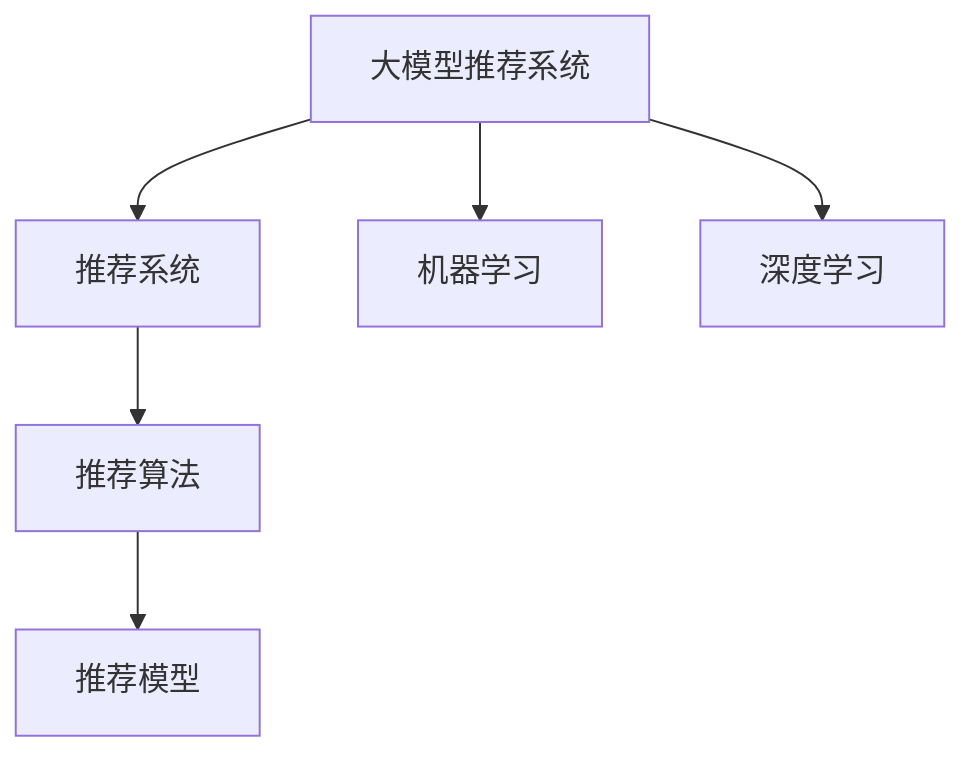

                 

# 大模型推荐落地实践中的经验教训总结

> 关键词：大模型推荐、推荐系统、推荐算法、推荐模型、机器学习、深度学习、推荐系统优化

## 1. 背景介绍

在当今数字化时代，推荐系统已经成为互联网企业竞争的核心利器。通过深度学习和推荐算法，企业能够为用户提供个性化的商品、内容推荐，极大地提升了用户体验和运营效率。然而，推荐系统的复杂性和动态性，使其落地实施时面临诸多挑战。本文将深入探讨大模型推荐系统在落地实践中的经验教训，提供一套行之有效的技术方案。

## 2. 核心概念与联系

### 2.1 核心概念概述

为了更好地理解大模型推荐系统的技术细节和优化方法，本节将介绍几个关键概念及其相互关系：

- **大模型推荐系统(Large Model Recommendation System)**：基于深度学习大模型构建的推荐系统。通常使用大规模预训练语言模型（如BERT、GPT等）进行推荐特征提取，通过微调优化模型在不同推荐任务上的性能。

- **推荐系统(Recommendation System)**：根据用户历史行为和兴趣偏好，推荐相关商品、内容、服务等，以提升用户满意度和平台价值。

- **推荐算法(Recommendation Algorithms)**：包括协同过滤、基于内容的推荐、矩阵分解、深度学习推荐等方法，用于构建推荐模型。

- **推荐模型(Recommendation Models)**：用于拟合用户行为数据，预测用户偏好，生成推荐结果的模型。

- **机器学习(Machine Learning)**：基于数据驱动的方法，构建和优化推荐模型。

- **深度学习(Deep Learning)**：使用多层神经网络，对推荐特征进行高效抽象和表示，提升推荐性能。

这些概念之间存在密切的联系和相互依赖，共同构成了推荐系统的基础架构。通过理解这些核心概念，我们可以更清晰地把握推荐系统的工作原理和优化方向。

### 2.2 核心概念原理和架构的 Mermaid 流程图



这个流程图展示了大模型推荐系统的主要组成和关键步骤：

1. 大模型推荐系统基于深度学习大模型，进行特征提取。
2. 推荐系统通过推荐算法将模型生成的特征映射到推荐结果。
3. 推荐算法调用推荐模型，生成最终的推荐列表。
4. 机器学习用于构建和优化推荐模型。
5. 深度学习用于提高推荐特征的抽象和表示能力。

这些步骤共同构成了推荐系统从特征提取到结果生成的全流程。理解这些步骤，可以帮助我们更好地掌握推荐系统的技术细节。

## 3. 核心算法原理 & 具体操作步骤

### 3.1 算法原理概述

大模型推荐系统主要通过深度学习模型，对用户行为数据进行特征提取和表示，并结合推荐算法生成推荐结果。其核心原理包括以下几个方面：

- **特征抽取**：使用预训练大模型对用户行为数据进行特征提取，生成高维稀疏特征向量。
- **相似度计算**：计算用户间的相似度，找到与其兴趣相近的其他用户。
- **推荐生成**：根据用户和物品的相似度，生成推荐列表。
- **模型优化**：通过在线学习或离线微调，不断优化推荐模型，提升推荐性能。

### 3.2 算法步骤详解

大模型推荐系统的实现流程一般包括以下几个步骤：

1. **数据收集与处理**：收集用户行为数据，如点击、浏览、评分等，并进行预处理，去除噪声和异常值。
2. **特征提取**：使用大模型对用户行为数据进行特征提取，生成高维稀疏特征向量。
3. **相似度计算**：计算用户间的相似度，通常使用余弦相似度或欧氏距离等方法。
4. **推荐生成**：根据用户和物品的相似度，生成推荐列表。
5. **模型评估与优化**：通过离线微调或在线学习，优化推荐模型，提升推荐性能。
6. **业务部署**：将优化后的模型部署到生产环境，提供实时推荐服务。

### 3.3 算法优缺点

大模型推荐系统具有以下优点：

- **高泛化能力**：大模型基于大规模预训练数据，具有较强的泛化能力，能够适应各种类型的推荐任务。
- **高效特征提取**：大模型能够自动学习特征表示，避免手工工程特征带来的繁琐和复杂。
- **灵活推荐策略**：可以根据不同任务需求，灵活设计推荐算法，如协同过滤、基于内容的推荐等。

同时，也存在一些缺点：

- **高计算成本**：大模型需要大量的计算资源进行训练和推理，初期开发成本较高。
- **模型解释性不足**：大模型推荐系统通常是一个"黑盒"系统，难以解释其内部决策逻辑，对业务方缺乏透明性。
- **动态性挑战**：用户行为和市场环境的变化较快，大模型推荐系统需要频繁更新模型，保持性能稳定。

### 3.4 算法应用领域

大模型推荐系统已经在多个领域得到广泛应用，例如：

- **电子商务**：电商平台通过推荐系统向用户推荐商品，提升转化率和复购率。
- **内容分发**：视频、音乐、新闻等平台根据用户兴趣推荐相关内容，提高用户粘性。
- **金融服务**：金融产品推荐系统为用户推荐理财产品，增加用户参与度。
- **广告推荐**：广告平台根据用户行为推荐相关广告，提高广告投放效果。

此外，大模型推荐系统还被创新性地应用到更多场景中，如社交网络、旅游出行、健康医疗等，为各行各业带来了新的机遇和挑战。

## 4. 数学模型和公式 & 详细讲解

### 4.1 数学模型构建

大模型推荐系统通常使用深度神经网络模型进行特征提取和表示，如Transformer、GRU等。模型的输入为用户的特征向量 $x$，输出为推荐物品的评分向量 $y$。模型的目标是最小化预测评分与真实评分之间的误差，即：

$$
\min_{\theta} \frac{1}{N} \sum_{i=1}^N \ell(M_{\theta}(x_i), y_i)
$$

其中，$\ell$ 为损失函数，如均方误差（MSE）或交叉熵损失（CE）。

### 4.2 公式推导过程

以下以均方误差损失函数为例，推导推荐模型的预测评分公式。

假设推荐模型的预测评分为 $y_{\hat{i}} = M_{\theta}(x_i)$，真实评分为 $y_i$，则均方误差损失函数为：

$$
\ell = \frac{1}{N} \sum_{i=1}^N (y_i - y_{\hat{i}})^2
$$

通过反向传播算法，计算损失函数对模型参数 $\theta$ 的梯度，并根据梯度更新模型参数：

$$
\theta \leftarrow \theta - \eta \nabla_{\theta}\mathcal{L}(\theta)
$$

其中，$\eta$ 为学习率，$\nabla_{\theta}\mathcal{L}(\theta)$ 为损失函数对参数 $\theta$ 的梯度。

### 4.3 案例分析与讲解

以一个简单的协同过滤推荐模型为例，分析其计算过程。

协同过滤推荐模型主要基于用户历史行为数据，计算用户和物品之间的相似度。模型的输入为 $x_i$ 和 $x_j$ 两个用户的历史行为数据，输出为推荐物品的评分向量 $y_{\hat{i}}$。

模型使用相似度函数 $s(x_i, x_j)$ 计算用户间的相似度，通常使用余弦相似度或欧氏距离等方法。然后，根据用户和物品的相似度，生成推荐列表：

$$
y_{\hat{i}} = \sum_{j=1}^M s(x_i, x_j) y_j
$$

其中，$M$ 为所有物品的数量，$y_j$ 为物品 $j$ 的真实评分。

通过均方误差损失函数，最小化预测评分与真实评分之间的误差，更新模型参数：

$$
\theta \leftarrow \theta - \eta \frac{1}{N} \sum_{i=1}^N \sum_{j=1}^M (y_i - s(x_i, x_j) y_j)^2
$$

以上就是协同过滤推荐模型的计算过程。通过最小化预测评分与真实评分之间的误差，协同过滤模型不断优化模型参数，提升推荐性能。

## 5. 项目实践：代码实例和详细解释说明

### 5.1 开发环境搭建

在进行推荐系统开发前，我们需要准备好开发环境。以下是使用Python进行PyTorch开发的环境配置流程：

1. 安装Anaconda：从官网下载并安装Anaconda，用于创建独立的Python环境。

2. 创建并激活虚拟环境：
```bash
conda create -n recsys-env python=3.8 
conda activate recsys-env
```

3. 安装PyTorch：根据CUDA版本，从官网获取对应的安装命令。例如：
```bash
conda install pytorch torchvision torchaudio cudatoolkit=11.1 -c pytorch -c conda-forge
```

4. 安装TensorFlow：如果需要使用TensorFlow，从官网获取对应的安装命令。例如：
```bash
pip install tensorflow
```

5. 安装相关库：
```bash
pip install numpy pandas scikit-learn torchmetrics
```

完成上述步骤后，即可在`recsys-env`环境中开始推荐系统开发。

### 5.2 源代码详细实现

以下是一个简单的协同过滤推荐系统实现，使用PyTorch和TensorFlow进行深度学习。

```python
import torch
import torch.nn as nn
import torch.nn.functional as F
import tensorflow as tf

# 定义协同过滤推荐模型
class CollaborativeFiltering(nn.Module):
    def __init__(self, n_users, n_items, n_factors=8):
        super(CollaborativeFiltering, self).__init__()
        self.user_factors = nn.Embedding(n_users, n_factors)
        self.item_factors = nn.Embedding(n_items, n_factors)
        self.user_item = nn.Linear(n_factors*2, 1)
    
    def forward(self, x):
        user_embed = self.user_factors(x[:, 0])
        item_embed = self.item_factors(x[:, 1])
        concat = torch.cat([user_embed, item_embed], dim=1)
        pred = self.user_item(concat)
        return pred

# 定义模型训练函数
def train_model(model, data, optimizer, device):
    model.train()
    for i, (user, item, rating) in enumerate(data):
        user = user.to(device)
        item = item.to(device)
        rating = rating.to(device)
        pred = model(user, item)
        loss = F.mse_loss(pred, rating)
        optimizer.zero_grad()
        loss.backward()
        optimizer.step()
        if i % 100 == 0:
            print(f'Epoch {epoch+1}, Step {i}, Loss: {loss.item()}')

# 训练推荐模型
n_users = 1000
n_items = 1000
n_epochs = 10
batch_size = 64

# 创建模型
model = CollaborativeFiltering(n_users, n_items)

# 定义优化器
optimizer = torch.optim.Adam(model.parameters(), lr=0.001)

# 加载数据
train_data = # 加载训练数据

# 训练模型
device = torch.device('cuda' if torch.cuda.is_available() else 'cpu')
train_model(model, train_data, optimizer, device)
```

### 5.3 代码解读与分析

让我们再详细解读一下关键代码的实现细节：

**CollaborativeFiltering类**：
- `__init__`方法：初始化用户和物品的因子向量，以及用户和物品的评分预测函数。
- `forward`方法：前向传播计算推荐预测评分。

**train_model函数**：
- 在每个epoch中，对训练数据进行迭代，计算模型预测评分与真实评分之间的均方误差，并反向传播更新模型参数。
- 在每100个Step后打印当前损失值。

**训练流程**：
- 定义用户和物品数量，训练轮数，batch size等超参数。
- 创建推荐模型和优化器。
- 加载训练数据。
- 在GPU上训练模型，每个epoch结束后打印损失值。

可以看到，通过PyTorch的强大封装，我们可以用相对简洁的代码完成推荐系统的开发和训练。开发者可以将更多精力放在数据处理、模型改进等高层逻辑上，而不必过多关注底层的实现细节。

当然，工业级的系统实现还需考虑更多因素，如模型的保存和部署、超参数的自动搜索、更灵活的任务适配层等。但核心的推荐算法基本与此类似。

## 6. 实际应用场景

### 6.1 智能推荐系统

智能推荐系统已经成为电商、内容分发、金融等行业的重要工具。通过深度学习和推荐算法，企业能够为用户推荐个性化的商品、内容、金融产品等，提升用户体验和运营效率。

在技术实现上，可以通过收集用户历史行为数据，构建协同过滤模型或基于内容的推荐模型。模型在训练集上进行微调，生成推荐列表。对于新用户的推荐，可以基于用户画像或行为特征进行预测，并实时调整模型参数。

### 6.2 广告推荐系统

广告推荐系统通过深度学习模型，为用户推荐相关广告，提高广告投放效果。在实现上，可以使用CTR预估模型或点击率预估模型，根据用户行为数据和广告特征，预测用户点击广告的概率，并生成推荐列表。

通过A/B测试等方法，不断优化推荐模型，提升广告投放效果。同时，使用多臂老虎机算法等方法，优化广告投放策略，最大化广告ROI。

### 6.3 个性化推荐系统

个性化推荐系统根据用户历史行为和兴趣偏好，推荐相关商品、内容、服务。在实现上，可以使用协同过滤、基于内容的推荐、矩阵分解等方法，构建推荐模型。

通过离线微调和在线学习，不断优化推荐模型，提升推荐性能。同时，使用召回策略、排序策略等方法，优化推荐结果，提高用户体验。

## 7. 工具和资源推荐

### 7.1 学习资源推荐

为了帮助开发者系统掌握推荐系统的理论基础和实践技巧，这里推荐一些优质的学习资源：

1. 《推荐系统实战》：详细介绍了推荐系统的工作原理和常见算法，提供大量代码实例和实践经验。
2. 《深度学习理论与实践》：涵盖深度学习、推荐系统、NLP等方向的理论和实践，是深入学习推荐系统的必备书籍。
3. 《Recommender Systems: The Textbook》：推荐系统领域的权威教材，涵盖推荐算法、评估指标、实现技术等详细内容。
4. 《Recommender Systems with Python》：基于Python实现推荐系统的实战教程，包含案例分析、代码实践等内容。
5. 《Handbook of Recommendation Systems》：推荐系统领域的综述性论文集，涵盖各种推荐算法和应用场景。

通过对这些资源的学习实践，相信你一定能够快速掌握推荐系统的精髓，并用于解决实际的推荐问题。

### 7.2 开发工具推荐

高效的开发离不开优秀的工具支持。以下是几款用于推荐系统开发的常用工具：

1. PyTorch：基于Python的开源深度学习框架，灵活动态的计算图，适合快速迭代研究。

2. TensorFlow：由Google主导开发的开源深度学习框架，生产部署方便，适合大规模工程应用。

3. TensorFlow Recommenders：TensorFlow的推荐系统库，提供了丰富的推荐算法和模型实现。

4. Microsoft Azure ML：微软的云端机器学习平台，支持模型训练、部署、监控等全流程管理。

5. Google Cloud AI Platform：谷歌的云端机器学习平台，提供高效的模型训练和推理服务。

6. H2O.ai：支持机器学习、深度学习、推荐系统等多种算法的开源平台，提供了丰富的算法库和工具。

合理利用这些工具，可以显著提升推荐系统开发的效率，加快创新迭代的步伐。

### 7.3 相关论文推荐

推荐系统的研究和应用已经积累了大量研究成果。以下是几篇奠基性的相关论文，推荐阅读：

1. "The Bellkamp-Leake Algorithm for Recommender Systems"：提出Bellkamp-Leake算法，基于用户-物品评分矩阵进行推荐。
2. "An Introduction to Recommendation Systems"：推荐系统领域的经典教材，涵盖推荐算法、评估指标、实现技术等详细内容。
3. "Adaptive Nonlinear Matrix Factorization for Recommender Systems"：提出自适应非线性矩阵分解算法，提升推荐模型性能。
4. "Neural Collaborative Filtering"：提出神经网络协同过滤算法，结合深度学习提升推荐效果。
5. "Deep Architectures for Recommender Systems"：综述性论文，涵盖深度学习在推荐系统中的应用。

这些论文代表了大模型推荐系统的研究脉络。通过学习这些前沿成果，可以帮助研究者把握学科前进方向，激发更多的创新灵感。

## 8. 总结：未来发展趋势与挑战

### 8.1 总结

本文对大模型推荐系统的理论基础和实践细节进行了全面系统的介绍。首先阐述了大模型推荐系统的工作原理和优缺点，明确了推荐系统在推荐任务优化中的重要作用。其次，从原理到实践，详细讲解了推荐模型的数学原理和计算过程，给出了推荐系统开发的完整代码实例。同时，本文还广泛探讨了大模型推荐系统在电商、广告、金融等多个行业领域的应用前景，展示了推荐系统的广阔前景。此外，本文精选了推荐系统的各类学习资源，力求为读者提供全方位的技术指引。

通过本文的系统梳理，可以看到，大模型推荐系统已经在推荐领域取得了显著的进展，为推荐任务的优化和提升提供了新的思路和方法。未来，伴随预训练语言模型和推荐算法的发展，推荐系统必将在推荐场景中发挥更加重要的作用。

### 8.2 未来发展趋势

展望未来，大模型推荐系统将呈现以下几个发展趋势：

1. **多模态融合**：推荐系统不再局限于文本数据，将融合视觉、听觉等多种模态数据，提升推荐模型的多感官融合能力。
2. **个性化推荐**：通过深度学习模型，实时动态地生成个性化推荐，满足不同用户的需求。
3. **跨领域推荐**：推荐系统将在更多领域得到应用，如社交网络、旅游出行、健康医疗等，为各行各业带来新的机遇和挑战。
4. **实时推荐**：实时数据流量的处理和推荐模型的在线学习，使得推荐系统能够快速响应用户需求，提高推荐时效性。
5. **推荐系统评估**：通过更科学的评估指标和实验方法，量化推荐系统的性能和效果，指导推荐模型优化。

这些趋势凸显了大模型推荐系统的广阔前景，将进一步提升推荐系统的用户体验和运营效率，推动推荐系统向更高层次发展。

### 8.3 面临的挑战

尽管大模型推荐系统已经取得了显著的进展，但在迈向更加智能化、普适化应用的过程中，仍面临诸多挑战：

1. **计算资源需求高**：大规模推荐模型的训练和推理需要大量的计算资源，初期开发成本较高。
2. **模型复杂度大**：推荐模型通常具有复杂的结构，难以解释和调试。
3. **数据隐私保护**：用户行为数据的隐私保护是一个重要的问题，需要设计合理的数据处理和隐私保护机制。
4. **推荐效果波动**：推荐系统在不同用户、不同场景下，推荐效果可能波动较大，需要进行频繁调参和优化。
5. **推荐算法多样性**：推荐算法的选择和设计需要结合具体应用场景和数据特点，缺乏统一的评价标准。

面对这些挑战，未来需要在数据、算法、工程、业务等多个维度协同发力，不断优化推荐模型，提升推荐系统的性能和稳定性。

### 8.4 研究展望

为了解决推荐系统面临的挑战，未来的研究需要在以下几个方向寻求新的突破：

1. **多任务学习**：将多个推荐任务结合，共享模型参数，提高推荐模型在多个任务上的性能。
2. **自监督学习**：使用无监督学习范式，从非标注数据中提取用户行为特征，提升推荐模型泛化能力。
3. **对抗样本生成**：使用对抗样本生成技术，增强推荐模型的鲁棒性和抗干扰能力。
4. **元学习**：通过元学习，快速适应新任务和数据分布变化，提升推荐模型迁移能力。
5. **多目标优化**：结合用户满意度和商家利润等多目标函数，优化推荐模型，平衡推荐效果和业务收益。

这些研究方向将进一步推动推荐系统的智能化和高效化，为推荐系统带来新的突破。

## 9. 附录：常见问题与解答

**Q1：推荐系统如何衡量推荐效果？**

A: 推荐系统的评估指标主要包括召回率、准确率、覆盖率、F1分数等。召回率表示推荐系统推荐的物品中，有多少是用户感兴趣的。准确率表示推荐系统推荐的物品中，有多少是用户真正点击的。覆盖率表示推荐系统覆盖了多少不同物品。F1分数是召回率和准确率的综合指标，用于评估推荐系统的整体性能。

**Q2：推荐系统中如何处理冷启动问题？**

A: 冷启动问题指用户或物品在新加入推荐系统时，缺乏足够的历史数据进行推荐。解决冷启动问题的方法包括：
1. 基于用户画像的推荐：根据用户的基本信息、兴趣标签等特征，生成推荐列表。
2. 基于物品描述的推荐：根据物品的描述信息，生成推荐列表。
3. 基于相似用户的推荐：根据与新用户相似的其他用户的推荐列表，生成推荐列表。
4. 基于内容的推荐：根据用户和物品的特征，生成推荐列表。

**Q3：推荐系统如何处理数据偏差问题？**

A: 推荐系统中的数据偏差指用户行为数据的不均衡分布，可能导致推荐模型学习到不公正的推荐结果。处理数据偏差的方法包括：
1. 重采样：通过数据重采样，平衡不同类别的样本数量，减少数据偏差的影响。
2. 类别加权：对不同类别的样本赋予不同的权重，使得模型更加关注少数类别的用户或物品。
3. 基于公平性的优化：在推荐模型训练过程中，加入公平性约束，优化模型参数，减少数据偏差的影响。

这些方法可以帮助推荐系统更好地处理数据偏差问题，提升推荐模型的公平性和鲁棒性。

**Q4：推荐系统如何处理数据稀疏性问题？**

A: 推荐系统中的数据稀疏性指用户行为数据的不完整性和多样性，可能导致推荐模型难以学习到有效的推荐特征。处理数据稀疏性问题的方法包括：
1. 数据增强：通过数据增强技术，扩充训练数据，减少数据稀疏性的影响。
2. 矩阵分解：使用矩阵分解技术，将用户和物品的评分矩阵分解成低维向量，减少数据稀疏性的影响。
3. 神经网络协同过滤：使用神经网络模型，学习用户和物品的隐式特征，减少数据稀疏性的影响。

这些方法可以帮助推荐系统更好地处理数据稀疏性问题，提升推荐模型的泛化能力和推荐性能。

**Q5：推荐系统如何提高推荐效率？**

A: 推荐系统中的推荐效率问题指推荐模型的计算复杂度和响应时间。提高推荐效率的方法包括：
1. 模型裁剪：去除不必要的层和参数，减小模型尺寸，加快推理速度。
2. 量化加速：将浮点模型转为定点模型，压缩存储空间，提高计算效率。
3. 模型并行：使用模型并行技术，分布式计算推荐模型，提高推荐效率。
4. 预取数据：在用户访问推荐页面前，预取相关数据，减少加载时间。
5. 缓存策略：使用缓存技术，缓存高频访问的数据，减少重复计算。

这些方法可以帮助推荐系统提高推荐效率，提升用户体验和系统性能。

---

作者：禅与计算机程序设计艺术 / Zen and the Art of Computer Programming

