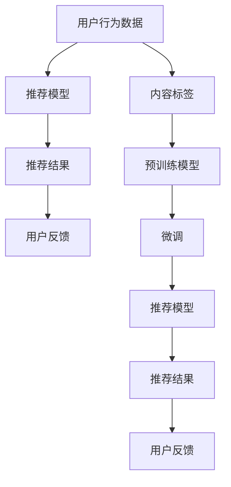

                 

# 大模型视角下推荐系统的评测指标体系构建与优化

> 关键词：推荐系统, 评测指标, 大模型, 优化算法, 用户满意度, 系统效率, 可解释性

## 1. 背景介绍

### 1.1 问题由来
在信息爆炸的今天，人们被海量的内容信息所淹没，推荐系统已成为互联网时代的重要组成部分。推荐系统通过分析用户的兴趣和行为，向用户推荐感兴趣的内容，极大地提升了用户的体验和满意度。但与此同时，推荐系统的评价标准和优化方法也在不断发展，如何构建科学的评测指标体系，指导推荐系统的优化成为亟待解决的问题。

随着大模型的兴起，基于深度学习的推荐系统在精度和性能上有了大幅提升。但随之而来的，是如何衡量和优化大模型在推荐系统中的应用效果。基于此，本文旨在构建一套科学的评测指标体系，并通过优化算法和模型构建，提升推荐系统的整体表现。

### 1.2 问题核心关键点
评测指标体系是衡量推荐系统性能的重要工具，其构建应全面覆盖用户满意度、系统效率、模型可解释性等多个维度。在大模型视角下，推荐系统性能的优化不仅包括提升精度，还应注重模型的鲁棒性、可解释性以及系统的实时响应能力。

本文将从推荐系统的工作原理、评测指标体系构建、优化算法选择以及实际应用场景等多个方面，系统性地探讨大模型在推荐系统中的应用和优化。通过科学的评测指标体系，能够指导推荐系统的发展方向，提升模型的性能，从而更好地服务于用户。

### 1.3 问题研究意义
构建科学的评测指标体系，对于推荐系统的发展具有重要意义：

1. **指导模型优化**：通过系统化的评测指标，可以明确推荐系统的优化方向，指导模型设计。
2. **评估系统效果**：评测指标能够客观衡量推荐系统的性能，帮助开发者了解系统存在的问题。
3. **提升用户满意度**：通过优化评测指标，可以更好地满足用户需求，提升用户体验。
4. **增强可解释性**：可解释性强的评测指标能够帮助用户理解推荐系统的工作原理，增强用户信任。
5. **适应实时需求**：实时性强的评测指标能够实时监控推荐系统性能，及时进行优化调整。

## 2. 核心概念与联系

### 2.1 核心概念概述

推荐系统是通过算法将用户和内容进行匹配，推荐用户可能感兴趣的内容。大模型在推荐系统中的应用，通常通过用户行为数据和内容标签进行预训练，然后在推荐任务上进行微调，以提升推荐准确性和多样性。

- **用户行为数据**：包括用户点击、浏览、评分等行为数据，用于捕捉用户的兴趣偏好。
- **内容标签**：包括文本标签、类别标签、关系标签等，用于刻画内容的属性特征。
- **推荐模型**：包括协同过滤、基于内容的推荐、混合推荐等模型，用于根据用户和内容信息生成推荐列表。
- **评测指标**：包括准确率、召回率、F1值、点击率、转化率等，用于衡量推荐系统的性能。

### 2.2 核心概念原理和架构的 Mermaid 流程图



这个流程图展示了推荐系统的工作流程：

1. 收集用户行为数据和内容标签。
2. 使用预训练模型对用户和内容进行编码，得到用户表示和内容表示。
3. 将用户和内容表示输入推荐模型，生成推荐结果。
4. 用户反馈推荐结果，用于模型优化。

## 3. 核心算法原理 & 具体操作步骤

### 3.1 算法原理概述

大模型在推荐系统中的应用，主要通过以下两个步骤：

1. **预训练**：在大规模用户行为和内容标签数据上进行自监督学习，学习用户的兴趣特征和内容的属性特征。
2. **微调**：在推荐任务上对预训练模型进行微调，优化模型的推荐效果。

微调的过程通常包括设置合适的损失函数、优化器和学习率等参数，通过反向传播算法更新模型参数，最小化损失函数，以提高推荐精度和多样性。

### 3.2 算法步骤详解

1. **数据准备**：收集用户行为数据和内容标签数据，构建训练集、验证集和测试集。
2. **模型初始化**：选择合适的预训练模型和微调模型，设置模型的输入输出格式。
3. **损失函数选择**：根据推荐任务的特点，选择合适的损失函数，如交叉熵损失、均方误差损失等。
4. **超参数设置**：设置优化器的参数、学习率、批大小、迭代轮数等，确定正则化策略。
5. **微调训练**：对模型进行迭代训练，在训练集上前向传播计算损失，反向传播更新参数。
6. **验证和测试**：在验证集和测试集上评估模型性能，根据性能指标调整模型参数。
7. **模型部署**：将训练好的模型部署到生产环境，进行实时推荐。

### 3.3 算法优缺点

大模型在推荐系统中的应用具有以下优点：

1. **精度高**：大模型能够学习到丰富的语义和模式，提升推荐系统的准确性。
2. **可解释性强**：大模型可以提供推荐结果的解释，增强用户的理解和信任。
3. **泛化能力强**：大模型在处理不同数据分布时有更好的泛化能力。
4. **适应性强**：大模型可以适应多样化的推荐场景，如商品推荐、音乐推荐、新闻推荐等。

同时，也存在一些缺点：

1. **计算资源消耗大**：大模型的训练和推理需要大量计算资源，可能导致部署成本高。
2. **数据隐私风险**：用户行为数据可能包含敏感信息，需要保护用户隐私。
3. **复杂度高**：大模型的设计和调参复杂度较高，需要较强的专业知识和经验。

### 3.4 算法应用领域

大模型在推荐系统的应用，已广泛应用于以下领域：

1. **电商推荐**：如淘宝、京东等电商平台，通过推荐系统提升用户购物体验。
2. **视频推荐**：如Netflix、YouTube等视频平台，推荐用户感兴趣的视频内容。
3. **音乐推荐**：如Spotify、网易云音乐等音乐平台，推荐用户喜欢的音乐作品。
4. **新闻推荐**：如今日头条、腾讯新闻等新闻平台，推荐用户感兴趣的新闻内容。
5. **社交推荐**：如微信、微博等社交平台，推荐用户感兴趣的内容和用户。

## 4. 数学模型和公式 & 详细讲解

### 4.1 数学模型构建

大模型在推荐系统中的应用，主要通过用户行为数据和内容标签进行预训练，然后在推荐任务上进行微调。

假设用户行为数据为 $X$，内容标签为 $Y$，推荐模型为 $F$。预训练模型为 $M$，微调后的推荐模型为 $F$。则推荐过程可以表示为：

$$
F = M(X, Y)
$$

其中 $F$ 为推荐结果，$M$ 为预训练模型，$X$ 为用户行为数据，$Y$ 为内容标签。

### 4.2 公式推导过程

在推荐系统中，常用的损失函数包括交叉熵损失和均方误差损失。以交叉熵损失为例，假设推荐结果为 $y_1, y_2, \dots, y_n$，真实标签为 $y^*$，则交叉熵损失函数为：

$$
L(y_1, y_2, \dots, y_n; y^*) = -\frac{1}{N}\sum_{i=1}^N y^*_i \log y_i
$$

其中 $y^*_i \in \{0, 1\}$ 表示样本 $i$ 是否被推荐，$y_i \in [0, 1]$ 表示模型预测该样本被推荐的概率。

### 4.3 案例分析与讲解

以电商推荐为例，假设用户点击了三个商品，分别为A、B、C。商品A和商品B属于同一类别，商品C属于另一类别。假设模型预测用户点击商品A的概率为0.8，商品B的概率为0.6，商品C的概率为0.4。如果真实标签为商品A和B被点击，则交叉熵损失为：

$$
L = -\frac{1}{2} \left(0 \log 0.8 + 1 \log 0.6\right) = 0.0985
$$

这里只考虑了前两个商品的标签，因为通常点击行为只和前两个商品相关。

## 5. 项目实践：代码实例和详细解释说明

### 5.1 开发环境搭建

在进行推荐系统开发前，需要先搭建好开发环境。以下是在PyTorch上进行推荐系统开发的详细步骤：

1. 安装PyTorch和相关依赖库：
```bash
pip install torch torchvision torchaudio
```

2. 设置开发环境：
```bash
conda create -n recommendation python=3.7
conda activate recommendation
```

3. 下载预训练模型和数据集：
```bash
git clone https://github.com/huggingface/transformers.git
cd transformers
pip install .
```

4. 安装推荐系统库：
```bash
pip install recsys
```

5. 准备数据集：
```bash
mkdir datasets
cd datasets
mkdir train test validation
```

### 5.2 源代码详细实现

以下是在PyTorch上进行电商推荐系统微调的例子：

```python
from recsys.models import DeepFactorizationModel
from recsys.data import SparseUserItemMatrix
from recsys.evaluation import precision_at_k, recall_at_k, hit_at_k

# 定义用户行为数据和内容标签数据
train_data = SparseUserItemMatrix.load(path_to_train_data)
test_data = SparseUserItemMatrix.load(path_to_test_data)

# 定义预训练模型
model = DeepFactorizationModel()
model.load_pretrained_model(path_to_pretrained_model)

# 设置损失函数和优化器
loss_fn = nn.CrossEntropyLoss()
optimizer = torch.optim.Adam(model.parameters(), lr=1e-4)

# 微调模型
for epoch in range(10):
    for user, items in train_data:
        optimizer.zero_grad()
        predictions = model(user, items)
        loss = loss_fn(predictions, user_labels)
        loss.backward()
        optimizer.step()

# 评估模型
predictions = model(test_data)
precision = precision_at_k(predictions, test_data.labels, k=10)
recall = recall_at_k(predictions, test_data.labels, k=10)
hit = hit_at_k(predictions, test_data.labels, k=10)
print(f"Precision@10: {precision:.3f}, Recall@10: {recall:.3f}, Hit@10: {hit:.3f}")
```

### 5.3 代码解读与分析

1. **用户行为数据和内容标签数据**：
```python
train_data = SparseUserItemMatrix.load(path_to_train_data)
test_data = SparseUserItemMatrix.load(path_to_test_data)
```
通过 `SparseUserItemMatrix` 类加载用户行为数据和内容标签数据。

2. **预训练模型**：
```python
model = DeepFactorizationModel()
model.load_pretrained_model(path_to_pretrained_model)
```
使用预训练模型进行微调，加载预训练模型权重。

3. **损失函数和优化器**：
```python
loss_fn = nn.CrossEntropyLoss()
optimizer = torch.optim.Adam(model.parameters(), lr=1e-4)
```
定义交叉熵损失函数和Adam优化器。

4. **微调模型**：
```python
for epoch in range(10):
    for user, items in train_data:
        optimizer.zero_grad()
        predictions = model(user, items)
        loss = loss_fn(predictions, user_labels)
        loss.backward()
        optimizer.step()
```
对模型进行迭代训练，前向传播计算损失，反向传播更新参数。

5. **评估模型**：
```python
predictions = model(test_data)
precision = precision_at_k(predictions, test_data.labels, k=10)
recall = recall_at_k(predictions, test_data.labels, k=10)
hit = hit_at_k(predictions, test_data.labels, k=10)
print(f"Precision@10: {precision:.3f}, Recall@10: {recall:.3f}, Hit@10: {hit:.3f}")
```
在测试集上评估模型性能，使用准确率、召回率和点击率等指标进行衡量。

## 6. 实际应用场景

### 6.1 电商推荐

在电商推荐系统中，用户点击行为是主要的训练信号。通过预训练模型对用户行为数据进行编码，然后在电商推荐任务上进行微调，可以提升推荐系统的精度和多样性。

以淘宝为例，用户在浏览商品时，系统会实时记录点击、停留、购买等行为数据，并根据用户的浏览历史和点击行为进行推荐。通过在大模型上微调，系统可以更好地捕捉用户的兴趣变化，提升推荐效果。

### 6.2 视频推荐

在视频推荐系统中，用户观看历史和点击行为是主要的训练信号。通过预训练模型对用户行为数据进行编码，然后在视频推荐任务上进行微调，可以提升推荐系统的精度和多样性。

以Netflix为例，用户在观看视频时，系统会实时记录观看历史和点击行为，并根据用户的观看历史和点击行为进行推荐。通过在大模型上微调，系统可以更好地捕捉用户的兴趣变化，提升推荐效果。

### 6.3 音乐推荐

在音乐推荐系统中，用户听歌历史和点击行为是主要的训练信号。通过预训练模型对用户行为数据进行编码，然后在音乐推荐任务上进行微调，可以提升推荐系统的精度和多样性。

以Spotify为例，用户在听歌时，系统会实时记录听歌历史和点击行为，并根据用户的听歌历史和点击行为进行推荐。通过在大模型上微调，系统可以更好地捕捉用户的兴趣变化，提升推荐效果。

## 7. 工具和资源推荐

### 7.1 学习资源推荐

为了帮助开发者系统掌握大模型在推荐系统中的应用，这里推荐一些优质的学习资源：

1. 《推荐系统实践》系列博文：由大模型技术专家撰写，深入浅出地介绍了推荐系统的原理和实现，涵盖了大模型在推荐系统中的应用。

2. 《推荐系统》课程：由斯坦福大学开设的推荐系统课程，有Lecture视频和配套作业，带你入门推荐系统领域的基本概念和经典模型。

3. 《Deep Learning for Recommendations》书籍：推荐系统领域的重要著作，全面介绍了推荐系统的深度学习算法，包括大模型在推荐系统中的应用。

4. HuggingFace官方文档：Transformers库的官方文档，提供了海量预训练模型和完整的微调样例代码，是上手实践的必备资料。

5. Kaggle推荐系统竞赛：Kaggle提供的推荐系统竞赛平台，可以实践推荐系统的实际问题，积累经验。

通过对这些资源的学习实践，相信你一定能够快速掌握大模型在推荐系统中的应用和优化方法，并用于解决实际的推荐问题。

### 7.2 开发工具推荐

推荐的开发工具主要涉及深度学习框架和推荐系统库：

1. PyTorch：基于Python的开源深度学习框架，灵活动态的计算图，适合快速迭代研究。

2. TensorFlow：由Google主导开发的开源深度学习框架，生产部署方便，适合大规模工程应用。

3. RecSys：推荐系统库，提供了多种推荐算法和评估指标，支持PyTorch和TensorFlow。

4. Weights & Biases：模型训练的实验跟踪工具，可以记录和可视化模型训练过程中的各项指标，方便对比和调优。

5. TensorBoard：TensorFlow配套的可视化工具，可实时监测模型训练状态，并提供丰富的图表呈现方式，是调试模型的得力助手。

合理利用这些工具，可以显著提升推荐系统的开发效率，加快创新迭代的步伐。

### 7.3 相关论文推荐

大模型在推荐系统中的应用源于学界的持续研究。以下是几篇奠基性的相关论文，推荐阅读：

1. "Collaborative Filtering for Implicit Feedback Datasets"（即ALS算法）：经典的协同过滤推荐算法，通过矩阵分解来推荐相似用户对相似物品的评分。

2. "Deep Collaborative Filtering"：提出使用深度神经网络进行协同过滤，提升推荐系统的精度和多样性。

3. "Wide & Deep Learning for Recommender Systems"：提出宽深学习架构，将宽模型和深模型相结合，提升推荐系统的性能。

4. "Factorization Machines with Side Information"：提出利用侧信息进行矩阵分解，提升推荐系统的效果。

5. "Reinforcement Learning for Recommendation"：提出使用强化学习优化推荐系统，提升推荐系统的用户满意度。

这些论文代表了大模型在推荐系统中的研究进展，通过学习这些前沿成果，可以帮助研究者把握学科前进方向，激发更多的创新灵感。

## 8. 总结：未来发展趋势与挑战

### 8.1 总结

本文对大模型在推荐系统中的应用和优化进行了全面系统的介绍。首先阐述了大模型和微调技术的研究背景和意义，明确了大模型在推荐系统中的应用方向。其次，从原理到实践，详细讲解了大模型在推荐系统中的具体实现方法。同时，本文还广泛探讨了大模型在推荐系统中的应用场景，展示了大模型在推荐系统中的巨大潜力。最后，本文精选了推荐系统的各类学习资源，力求为读者提供全方位的技术指引。

通过本文的系统梳理，可以看到，大模型在推荐系统中的应用已经取得了显著成效，极大地提升了推荐系统的精度和用户满意度。未来，伴随大模型的进一步发展，推荐系统将能够提供更加个性化、多样化的推荐服务，进一步推动人工智能技术的应用和发展。

### 8.2 未来发展趋势

展望未来，大模型在推荐系统中的应用将呈现以下几个发展趋势：

1. **实时性提升**：随着模型计算能力的提升，推荐系统的实时性将进一步提升，能够实时响应用户需求。

2. **用户满意度优化**：通过更好的用户建模和个性化推荐，提升推荐系统的用户满意度。

3. **跨模态融合**：将文本、图像、视频等多种模态信息融合到推荐系统中，提升推荐系统的表现力。

4. **多任务优化**：将推荐系统与其他任务（如搜索、广告等）进行联合优化，提升整体效果。

5. **推荐系统生态**：构建完整的推荐系统生态，包括推荐算法、数据管理、用户反馈等多个方面，提升系统的整体效能。

6. **隐私保护**：在推荐系统中加强隐私保护，确保用户数据的安全。

以上趋势将进一步推动大模型在推荐系统中的应用，提升推荐系统的性能和用户满意度。

### 8.3 面临的挑战

尽管大模型在推荐系统中的应用已经取得了瞩目成就，但在迈向更加智能化、普适化应用的过程中，它仍面临诸多挑战：

1. **计算资源瓶颈**：大模型的训练和推理需要大量计算资源，可能导致部署成本高。

2. **数据隐私风险**：用户行为数据可能包含敏感信息，需要保护用户隐私。

3. **模型复杂度**：大模型的设计和调参复杂度较高，需要较强的专业知识和经验。

4. **推荐系统公平性**：推荐系统可能存在不公平的问题，需要进一步优化。

5. **跨模态融合**：不同模态信息融合难度较大，需要更多研究。

6. **推荐系统动态性**：推荐系统需要能够动态适应用户行为变化，提出优化策略。

以上挑战将对大模型在推荐系统中的应用产生影响，需要通过技术创新和政策法规的完善，解决这些难题。

### 8.4 研究展望

未来，大模型在推荐系统中的应用需要从以下几个方面进行深入研究：

1. **跨模态推荐**：将文本、图像、视频等多种模态信息融合到推荐系统中，提升推荐系统的表现力。

2. **推荐系统优化**：通过更高效的模型结构和算法，提升推荐系统的实时性和精度。

3. **用户行为建模**：通过更深入的用户建模，提升推荐系统的个性化和多样性。

4. **推荐系统公平性**：通过公平性优化，确保推荐系统的公平性。

5. **推荐系统隐私保护**：通过隐私保护技术，确保用户数据的安全。

6. **推荐系统生态构建**：构建完整的推荐系统生态，包括推荐算法、数据管理、用户反馈等多个方面。

这些研究方向将进一步推动大模型在推荐系统中的应用，提升推荐系统的性能和用户满意度。

## 9. 附录：常见问题与解答

**Q1：大模型在推荐系统中如何处理冷启动问题？**

A: 冷启动问题是指新用户或新物品没有足够的数据进行推荐。可以通过以下方法解决：

1. 使用基于内容的推荐算法，利用物品的特征进行推荐。
2. 使用协同过滤算法，通过相似用户或物品的评分进行推荐。
3. 使用深度学习模型，通过用户的行为序列进行预测。
4. 引入预训练模型，通过用户行为数据进行预训练，提升推荐效果。

**Q2：大模型在推荐系统中如何处理数据稀疏性问题？**

A: 数据稀疏性问题是指用户对物品的评分数据较少。可以通过以下方法解决：

1. 使用矩阵补全技术，通过已知评分进行缺失评分的预测。
2. 使用深度学习模型，通过用户的行为序列进行预测。
3. 引入侧信息，如物品属性、用户属性等，提升推荐效果。
4. 引入协同过滤算法，通过相似用户或物品的评分进行推荐。

**Q3：大模型在推荐系统中如何处理长尾问题？**

A: 长尾问题是指用户对长尾物品的评分较少。可以通过以下方法解决：

1. 引入冷启动技术，通过用户的行为序列进行预测。
2. 使用深度学习模型，通过物品的特征进行推荐。
3. 引入协同过滤算法，通过相似用户或物品的评分进行推荐。
4. 引入预训练模型，通过用户行为数据进行预训练，提升推荐效果。

**Q4：大模型在推荐系统中如何进行异常检测？**

A: 异常检测是指识别推荐系统中的异常行为。可以通过以下方法解决：

1. 使用基于统计的方法，如标准差、方差等进行异常检测。
2. 使用基于模型的方法，如隐马尔可夫模型、神经网络等进行异常检测。
3. 引入用户反馈机制，通过用户对推荐结果的反馈进行异常检测。
4. 引入预训练模型，通过用户行为数据进行预训练，提升异常检测的准确性。

**Q5：大模型在推荐系统中如何进行多任务优化？**

A: 多任务优化是指将推荐系统与其他任务进行联合优化，提升整体效果。可以通过以下方法解决：

1. 使用联合训练技术，将推荐系统和其他任务进行联合训练。
2. 引入共享表示技术，将不同任务共享相同的表示。
3. 引入多任务学习技术，通过不同的任务进行联合优化。
4. 引入迁移学习技术，通过预训练模型进行多任务优化。

这些方法可以提升大模型在推荐系统中的效果，进一步推动人工智能技术的发展。

---

作者：禅与计算机程序设计艺术 / Zen and the Art of Computer Programming

