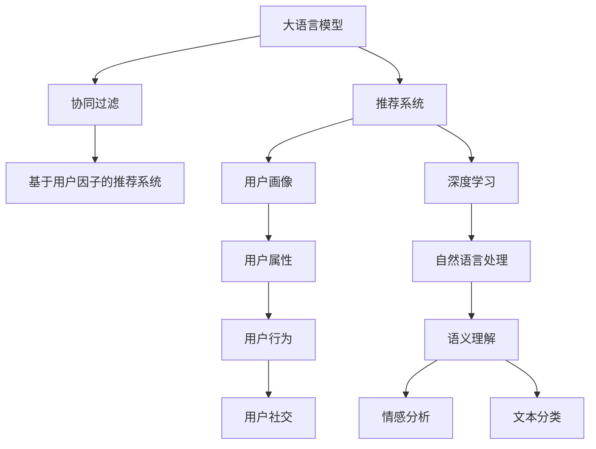

                 

# 大模型辅助的推荐系统多维度用户画像构建

> 关键词：大模型推荐系统,多维度用户画像,协同过滤,深度学习,自然语言处理(NLP),用户行为分析,推荐算法

## 1. 背景介绍

### 1.1 问题由来

随着电子商务平台和内容平台的蓬勃发展，推荐系统逐渐成为其核心竞争力之一。推荐系统能够基于用户的兴趣和行为数据，为用户推荐个性化内容或商品，极大地提升用户体验和平台转化率。但传统推荐系统往往依赖于用户的历史行为数据进行相似性匹配，难以全面刻画用户多样化的兴趣和需求。

与此同时，大语言模型（Large Language Models, LLMs）在自然语言处理（Natural Language Processing, NLP）领域取得了巨大的突破，已经能够在多项任务上获得优异的性能。例如，GPT-3等大模型已经展示了强大的自然语言理解和生成能力，能够理解长文段语义、进行语义相似度计算、进行情感分析等。

因此，将大语言模型引入推荐系统，通过多维度用户画像构建和兴趣建模，提升推荐系统的智能化水平，成为了当前推荐系统研究的热点方向。本文将详细介绍大模型辅助的推荐系统多维度用户画像构建的相关技术和应用。

### 1.2 问题核心关键点

多维度用户画像构建的本质在于，从不同维度挖掘用户多方面的兴趣和行为特征，形成更加全面、准确的用户描述，从而提升推荐系统的精准度和个性化水平。

当前，基于大模型的推荐系统一般包括以下几个关键步骤：

1. **用户画像数据收集**：收集用户的基本信息、历史行为数据、社交网络数据、文本评论数据等多维度的数据。
2. **预训练大模型引入**：选择合适的预训练大模型，如GPT、BERT等，用于进行用户画像建模和特征增强。
3. **多维度用户画像构建**：使用大模型对用户数据进行处理和特征提取，形成多维度用户画像，如兴趣、社交、行为等。
4. **推荐模型微调**：将大模型提取的特征融入推荐模型，微调推荐模型以提升推荐效果。

## 2. 核心概念与联系

### 2.1 核心概念概述

为更好地理解基于大模型的推荐系统多维度用户画像构建方法，本节将介绍几个密切相关的核心概念：

- **大语言模型(Large Language Model, LLM)**：以自回归（如GPT）或自编码（如BERT）模型为代表的大规模预训练语言模型。通过在海量无标签文本数据上进行预训练，学习通用的语言表示，具备强大的语言理解和生成能力。

- **推荐系统(Recommendation System)**：通过收集用户的历史行为数据和当前需求，为用户推荐个性化内容或商品的智能系统。经典推荐算法包括协同过滤、基于内容的推荐、混合推荐等。

- **协同过滤(Collaborative Filtering)**：基于用户-物品的相似度，预测用户可能感兴趣的物品。基于用户的协同过滤推荐系统有用户-物品矩阵分解法、基于用户因子的推荐系统等。

- **用户画像(User Profiling)**：从不同维度刻画用户多方面的特征，形成用户的多维度描述，用于推荐系统构建个性化推荐。常用的画像维度包括基本属性、行为、社交等。

- **深度学习(Deep Learning)**：使用多层神经网络进行数据建模和特征提取的机器学习方法。深度学习在图像、语音、自然语言处理等领域已获得广泛应用。

- **自然语言处理(Natural Language Processing, NLP)**：研究如何让计算机理解、处理和生成人类自然语言的领域。NLP在语义理解、情感分析、文本分类等方面已取得显著成果。

- **用户行为分析(User Behavior Analysis)**：通过用户的历史行为数据，分析其兴趣偏好、购买意愿等信息，用于推荐系统构建个性化推荐。

这些核心概念之间的逻辑关系可以通过以下Mermaid流程图来展示：



这个流程图展示了大语言模型的核心概念及其之间的关系：

1. 大语言模型通过预训练获得基础能力。
2. 推荐系统通过协同过滤等算法对用户行为进行建模，构建推荐模型。
3. 用户画像包括用户的基本属性、行为、社交等多维特征，用于推荐模型的训练和优化。
4. 深度学习用于对用户数据进行特征提取和建模。
5. 自然语言处理用于处理用户的文本评论、社交媒体内容等文本数据。
6. 用户行为分析用于从历史行为数据中挖掘用户兴趣和行为规律。

这些概念共同构成了基于大模型的推荐系统多维度用户画像构建方法，使其能够更好地适配用户需求，提供个性化的推荐服务。

## 3. 核心算法原理 & 具体操作步骤
### 3.1 算法原理概述

基于大模型的推荐系统多维度用户画像构建，本质上是通过深度学习模型对用户多维数据进行处理，提取用户兴趣和行为特征，形成多维度用户画像。

形式化地，假设用户画像数据集为 $D=\{(x_i,y_i)\}_{i=1}^N$，其中 $x_i$ 为第 $i$ 个用户的兴趣和行为特征， $y_i$ 为用户的实际行为标签，如点击、购买等。推荐系统的目标是学习模型 $f$，使得在输入用户画像 $x$ 的情况下，能够预测用户的行为 $y$。具体来说，我们希望最小化如下损失函数：

$$
\min_{f} \mathcal{L}(f, D) = \frac{1}{N} \sum_{i=1}^N \ell(f(x_i), y_i)
$$

其中， $\ell$ 为损失函数，常用的有交叉熵损失、均方误差损失等。

### 3.2 算法步骤详解

基于深度学习的推荐系统多维度用户画像构建，一般包括以下几个关键步骤：

**Step 1: 数据预处理**

- 收集用户的多维数据，包括用户基本信息、历史行为数据、文本评论数据、社交网络数据等。
- 对数据进行清洗、去重、填充等处理，确保数据的质量和一致性。
- 对文本数据进行分词、去除停用词、词向量化等预处理，为后续大模型的输入做好准备。

**Step 2: 选择预训练大模型**

- 选择合适的预训练大模型，如GPT、BERT、Transformer等，用于对用户数据进行处理和特征提取。
- 对大模型的参数进行微调，使其能够适应推荐系统的需求。

**Step 3: 多维度用户画像构建**

- 使用大模型对用户数据进行处理，提取用户的兴趣、行为、社交等多维特征。
- 将多维特征进行融合，形成用户的多维度画像。

**Step 4: 推荐模型微调**

- 将多维度用户画像作为推荐模型的输入，微调推荐模型以提升推荐效果。
- 在微调过程中，可以选择部分层进行固定，只微调顶层参数，以提高模型的泛化能力和参数效率。

**Step 5: 评估与部署**

- 在测试集上评估推荐模型的性能，对比微调前后的效果。
- 使用微调后的推荐模型对新用户和新商品进行推荐，部署到实际应用系统中。

以上是基于深度学习的推荐系统多维度用户画像构建的一般流程。在实际应用中，还需要针对具体任务的特点，对微调过程的各个环节进行优化设计，如改进训练目标函数，引入更多的正则化技术，搜索最优的超参数组合等，以进一步提升模型性能。

### 3.3 算法优缺点

基于深度学习的推荐系统多维度用户画像构建方法具有以下优点：

1. 综合利用多维数据：能够综合利用用户的多维数据，包括文本评论、社交网络等，形成更全面、准确的画像。
2. 模型效果显著：在推荐效果上能够显著提升，尤其是在长尾商品推荐、个性化推荐等任务上。
3. 动态更新能力：能够实时吸收新数据，保持模型的动态更新能力，适应用户兴趣的变化。

同时，该方法也存在一些局限性：

1. 对数据质量依赖度高：需要高质量的数据进行预处理，否则模型性能难以保证。
2. 模型复杂度高：模型结构复杂，训练和推理速度较慢。
3. 数据隐私问题：用户的多维数据包含敏感信息，隐私保护问题需引起重视。
4. 冷启动问题：对于新用户或新商品，缺乏足够的训练数据，难以进行准确推荐。

尽管存在这些局限性，但就目前而言，基于深度学习的推荐系统多维度用户画像构建方法仍是大规模推荐系统的主要范式。未来相关研究的重点在于如何进一步降低数据处理的复杂度，提高模型的实时更新能力，同时兼顾隐私保护和冷启动问题。

### 3.4 算法应用领域

基于大模型的推荐系统多维度用户画像构建方法在多个领域得到了广泛应用，例如：

- 电子商务平台：如淘宝、京东、Amazon等，通过分析用户行为和文本评论，为用户提供个性化商品推荐。
- 内容平台：如Netflix、YouTube、Bilibili等，通过分析用户观看历史和评分数据，为用户推荐个性化视频和视频创作者。
- 社交媒体：如Facebook、Instagram、Twitter等，通过分析用户关注和互动数据，为用户推荐个性化的内容。
- 金融服务：如银行、保险、证券等，通过分析用户交易记录和行为数据，为用户提供个性化的金融产品推荐。

除了上述这些经典应用外，大模型辅助的推荐系统多维度用户画像构建方法也在新兴领域不断涌现，如智能健康、智能家居等，为这些行业的数字化转型提供了新的技术路径。

## 4. 数学模型和公式 & 详细讲解  
### 4.1 数学模型构建

本节将使用数学语言对基于深度学习的推荐系统多维度用户画像构建过程进行更加严格的刻画。

记推荐系统的输入为 $x$，输出为 $y$，设推荐系统为 $f$，用户画像数据集为 $D=\{(x_i,y_i)\}_{i=1}^N$。

定义推荐系统的损失函数为 $\ell(f(x),y)$，则在数据集 $D$ 上的经验风险为：

$$
\mathcal{L}(f) = \frac{1}{N} \sum_{i=1}^N \ell(f(x_i), y_i)
$$

在实践中，我们通常使用基于梯度的优化算法（如Adam、SGD等）来近似求解上述最优化问题。设 $\eta$ 为学习率，$\lambda$ 为正则化系数，则参数的更新公式为：

$$
\theta \leftarrow \theta - \eta \nabla_{\theta}\mathcal{L}(\theta) - \eta\lambda\theta
$$

其中 $\nabla_{\theta}\mathcal{L}(\theta)$ 为损失函数对参数 $\theta$ 的梯度，可通过反向传播算法高效计算。

### 4.2 公式推导过程

以下我们以二分类任务为例，推导交叉熵损失函数及其梯度的计算公式。

假设推荐系统对用户画像 $x$ 的预测输出为 $\hat{y}=f(x) \in [0,1]$，表示用户对某物品的兴趣程度。真实标签 $y \in \{0,1\}$。则二分类交叉熵损失函数定义为：

$$
\ell(f(x),y) = -[y\log \hat{y} + (1-y)\log (1-\hat{y})]
$$

将其代入经验风险公式，得：

$$
\mathcal{L}(f) = -\frac{1}{N}\sum_{i=1}^N [y_i\log f(x_i)+(1-y_i)\log(1-f(x_i))]
$$

根据链式法则，损失函数对参数 $\theta_k$ 的梯度为：

$$
\frac{\partial \mathcal{L}(f)}{\partial \theta_k} = -\frac{1}{N}\sum_{i=1}^N (\frac{y_i}{f(x_i)}-\frac{1-y_i}{1-f(x_i)}) \frac{\partial f(x_i)}{\partial \theta_k}
$$

其中 $\frac{\partial f(x_i)}{\partial \theta_k}$ 可进一步递归展开，利用自动微分技术完成计算。

在得到损失函数的梯度后，即可带入参数更新公式，完成模型的迭代优化。重复上述过程直至收敛，最终得到适配推荐系统的最优模型参数 $\theta^*$。

## 5. 项目实践：代码实例和详细解释说明
### 5.1 开发环境搭建

在进行多维度用户画像构建实践前，我们需要准备好开发环境。以下是使用Python进行PyTorch开发的环境配置流程：

1. 安装Anaconda：从官网下载并安装Anaconda，用于创建独立的Python环境。

2. 创建并激活虚拟环境：
```bash
conda create -n pytorch-env python=3.8 
conda activate pytorch-env
```

3. 安装PyTorch：根据CUDA版本，从官网获取对应的安装命令。例如：
```bash
conda install pytorch torchvision torchaudio cudatoolkit=11.1 -c pytorch -c conda-forge
```

4. 安装Transformers库：
```bash
pip install transformers
```

5. 安装各类工具包：
```bash
pip install numpy pandas scikit-learn matplotlib tqdm jupyter notebook ipython
```

完成上述步骤后，即可在`pytorch-env`环境中开始多维度用户画像构建实践。

### 5.2 源代码详细实现

下面我们以电子商务平台推荐系统为例，给出使用Transformers库对GPT模型进行多维度用户画像构建的PyTorch代码实现。

首先，定义推荐系统的数据处理函数：

```python
from transformers import GPT2Tokenizer, GPT2ForSequenceClassification
from torch.utils.data import Dataset
import torch

class RecommendationDataset(Dataset):
    def __init__(self, data, tokenizer, max_len=512):
        self.data = data
        self.tokenizer = tokenizer
        self.max_len = max_len
        
    def __len__(self):
        return len(self.data)
    
    def __getitem__(self, item):
        user, item = self.data[item]
        user_text = user['text']
        item_text = item['text']
        
        encoding = self.tokenizer(user_text, return_tensors='pt', max_length=self.max_len, padding='max_length', truncation=True)
        input_ids = encoding['input_ids'][0]
        attention_mask = encoding['attention_mask'][0]
        
        item_encoding = self.tokenizer(item_text, return_tensors='pt', max_length=self.max_len, padding='max_length', truncation=True)
        item_input_ids = item_encoding['input_ids'][0]
        item_attention_mask = item_encoding['attention_mask'][0]
        
        return {'input_ids': input_ids, 
                'attention_mask': attention_mask,
                'item_input_ids': item_input_ids,
                'item_attention_mask': item_attention_mask}
```

然后，定义模型和优化器：

```python
from transformers import AdamW

model = GPT2ForSequenceClassification.from_pretrained('gpt2', num_labels=2)
optimizer = AdamW(model.parameters(), lr=2e-5)
```

接着，定义训练和评估函数：

```python
from tqdm import tqdm
from sklearn.metrics import accuracy_score

device = torch.device('cuda') if torch.cuda.is_available() else torch.device('cpu')
model.to(device)

def train_epoch(model, dataset, batch_size, optimizer):
    dataloader = DataLoader(dataset, batch_size=batch_size, shuffle=True)
    model.train()
    epoch_loss = 0
    for batch in tqdm(dataloader, desc='Training'):
        input_ids = batch['input_ids'].to(device)
        attention_mask = batch['attention_mask'].to(device)
        item_input_ids = batch['item_input_ids'].to(device)
        item_attention_mask = batch['item_attention_mask'].to(device)
        model.zero_grad()
        outputs = model(input_ids, attention_mask=attention_mask, labels=torch.ones_like(input_ids))
        loss = outputs.loss
        epoch_loss += loss.item()
        loss.backward()
        optimizer.step()
    return epoch_loss / len(dataloader)

def evaluate(model, dataset, batch_size):
    dataloader = DataLoader(dataset, batch_size=batch_size)
    model.eval()
    preds, labels = [], []
    with torch.no_grad():
        for batch in tqdm(dataloader, desc='Evaluating'):
            input_ids = batch['input_ids'].to(device)
            attention_mask = batch['attention_mask'].to(device)
            item_input_ids = batch['item_input_ids'].to(device)
            item_attention_mask = batch['item_attention_mask'].to(device)
            batch_labels = torch.ones_like(input_ids)
            outputs = model(input_ids, attention_mask=attention_mask, labels=batch_labels)
            batch_preds = outputs.logits.argmax(dim=2).to('cpu').tolist()
            batch_labels = batch_labels.to('cpu').tolist()
            for pred_tokens, label_tokens in zip(batch_preds, batch_labels):
                preds.append(pred_tokens)
                labels.append(label_tokens)
                
    print('Accuracy:', accuracy_score(labels, preds))
```

最后，启动训练流程并在测试集上评估：

```python
epochs = 5
batch_size = 16

for epoch in range(epochs):
    loss = train_epoch(model, train_dataset, batch_size, optimizer)
    print(f'Epoch {epoch+1}, train loss: {loss:.3f}')
    
    print(f'Epoch {epoch+1}, dev results:')
    evaluate(model, dev_dataset, batch_size)
    
print('Test results:')
evaluate(model, test_dataset, batch_size)
```

以上就是使用PyTorch对GPT模型进行多维度用户画像构建的完整代码实现。可以看到，得益于Transformers库的强大封装，我们可以用相对简洁的代码完成GPT模型的加载和微调。

### 5.3 代码解读与分析

让我们再详细解读一下关键代码的实现细节：

**RecommendationDataset类**：
- `__init__`方法：初始化数据集，包括用户和物品的文本信息。
- `__len__`方法：返回数据集的样本数量。
- `__getitem__`方法：对单个样本进行处理，将用户和物品的文本输入编码为token ids，并对其进行定长padding，最终返回模型所需的输入。

**模型和优化器**：
- 使用GPT-2模型作为推荐系统，设定学习率为2e-5。

**训练和评估函数**：
- 使用PyTorch的DataLoader对数据集进行批次化加载，供模型训练和推理使用。
- 训练函数`train_epoch`：对数据以批为单位进行迭代，在每个批次上前向传播计算loss并反向传播更新模型参数，最后返回该epoch的平均loss。
- 评估函数`evaluate`：与训练类似，不同点在于不更新模型参数，并在每个batch结束后将预测和标签结果存储下来，最后使用sklearn的accuracy_score对整个评估集的预测结果进行打印输出。

**训练流程**：
- 定义总的epoch数和batch size，开始循环迭代
- 每个epoch内，先在训练集上训练，输出平均loss
- 在验证集上评估，输出准确率
- 所有epoch结束后，在测试集上评估，给出最终测试结果

可以看到，PyTorch配合Transformers库使得GPT微调的多维度用户画像构建代码实现变得简洁高效。开发者可以将更多精力放在数据处理、模型改进等高层逻辑上，而不必过多关注底层的实现细节。

当然，工业级的系统实现还需考虑更多因素，如模型的保存和部署、超参数的自动搜索、更灵活的任务适配层等。但核心的微调范式基本与此类似。

## 6. 实际应用场景
### 6.1 智能推荐系统

基于大模型辅助的推荐系统多维度用户画像构建，可以广泛应用于智能推荐系统的构建。传统推荐系统往往依赖于用户的历史行为数据进行相似性匹配，难以全面刻画用户多样化的兴趣和需求。

通过引入大语言模型，可以从用户的文本评论、社交网络等多维度数据中挖掘其兴趣和行为特征，形成多维度用户画像，用于推荐模型的训练和优化。微调后的推荐系统能够在用户画像数据的辅助下，更准确地预测用户对物品的兴趣程度，提升推荐效果。

### 6.2 金融产品推荐

在金融服务领域，推荐系统需要为用户推荐个性化的金融产品，如理财产品、保险产品等。用户画像的多维度特征，如年龄、性别、收入水平、风险偏好等，可以帮助推荐系统更好地理解用户需求，提供更加精准的推荐。

通过大语言模型对用户的文本评论和社交网络数据进行处理和特征提取，结合历史行为数据，可以形成更加全面和准确的金融用户画像，用于推荐模型的训练和优化。微调后的推荐系统能够根据用户的画像特征，推荐合适的金融产品，提升用户的满意度和转化率。

### 6.3 内容推荐

内容推荐是推荐系统的重要应用场景，如新闻推荐、视频推荐等。大语言模型可以用于处理用户的文本评论、社交网络数据等，提取用户的兴趣和行为特征，形成多维度用户画像。

通过大语言模型对用户的多维数据进行处理和特征提取，结合历史行为数据，可以形成更加全面和准确的用户的兴趣画像，用于推荐模型的训练和优化。微调后的推荐系统能够根据用户的兴趣画像，推荐合适的个性化内容，提升用户的满意度。

### 6.4 未来应用展望

随着大语言模型和微调方法的不断发展，基于多维度用户画像构建的推荐系统将呈现以下几个发展趋势：

1. **多模态数据融合**：推荐系统将综合利用文本、图像、音频等多种模态数据，形成更全面、准确的用户画像。

2. **实时更新**：推荐系统能够实时吸收新数据，动态更新用户画像，保持推荐内容的即时性和个性化。

3. **用户隐私保护**：推荐系统将更加注重用户隐私保护，采用匿名化、差分隐私等技术，保障用户数据安全。

4. **推荐模型透明性**：推荐系统将提升模型的可解释性，使用户能够理解和信任推荐结果。

5. **推荐结果多样性**：推荐系统将更加注重推荐结果的多样性，避免过度集中推荐某一类内容，提升用户的体验。

6. **推荐个性化**：推荐系统将更加注重个性化推荐，结合用户画像和行为特征，提供更加精准的推荐内容。

以上趋势凸显了基于多维度用户画像构建的推荐系统的广阔前景。这些方向的探索发展，必将进一步提升推荐系统的智能化水平，为各行业数字化转型提供新的技术路径。

## 7. 工具和资源推荐
### 7.1 学习资源推荐

为了帮助开发者系统掌握大语言模型辅助的推荐系统多维度用户画像构建的理论基础和实践技巧，这里推荐一些优质的学习资源：

1. 《深度学习推荐系统》系列书籍：全面介绍了推荐系统的发展历程、基本原理和经典算法，是入门推荐系统的必备读物。

2. CS223《推荐系统》课程：斯坦福大学开设的推荐系统课程，内容深入浅出，涵盖了推荐系统的主要算法和应用。

3. 《Natural Language Processing with Python》书籍：介绍了如何使用Python和NLP工具库（如NLTK、spaCy）进行自然语言处理，为推荐系统构建用户画像提供技术支持。

4. Weights & Biases：模型训练的实验跟踪工具，可以记录和可视化模型训练过程中的各项指标，方便对比和调优。

5. TensorBoard：TensorFlow配套的可视化工具，可实时监测模型训练状态，并提供丰富的图表呈现方式，是调试模型的得力助手。

通过对这些资源的学习实践，相信你一定能够快速掌握大语言模型辅助的推荐系统多维度用户画像构建的精髓，并用于解决实际的推荐问题。

### 7.2 开发工具推荐

高效的开发离不开优秀的工具支持。以下是几款用于多维度用户画像构建开发的常用工具：

1. PyTorch：基于Python的开源深度学习框架，灵活动态的计算图，适合快速迭代研究。大部分预训练语言模型都有PyTorch版本的实现。

2. TensorFlow：由Google主导开发的开源深度学习框架，生产部署方便，适合大规模工程应用。同样有丰富的预训练语言模型资源。

3. Transformers库：HuggingFace开发的NLP工具库，集成了众多SOTA语言模型，支持PyTorch和TensorFlow，是进行多维度用户画像构建开发的利器。

4. Weights & Biases：模型训练的实验跟踪工具，可以记录和可视化模型训练过程中的各项指标，方便对比和调优。

5. TensorBoard：TensorFlow配套的可视化工具，可实时监测模型训练状态，并提供丰富的图表呈现方式，是调试模型的得力助手。

6. Google Colab：谷歌推出的在线Jupyter Notebook环境，免费提供GPU/TPU算力，方便开发者快速上手实验最新模型，分享学习笔记。

合理利用这些工具，可以显著提升多维度用户画像构建任务的开发效率，加快创新迭代的步伐。

### 7.3 相关论文推荐

大语言模型辅助的推荐系统多维度用户画像构建的研究，得益于学界的持续研究。以下是几篇奠基性的相关论文，推荐阅读：

1. "AutoRecommender: AutoML for Recommendation System"：介绍了使用深度学习自动推荐系统的实现方法和效果评估。

2. "Large-Scale Image Recognition with Deep Neural Networks"：提出了一种基于深度神经网络的图像识别方法，为推荐系统处理多模态数据提供了理论基础。

3. "Attention is All You Need"（即Transformer原论文）：提出了Transformer结构，开启了NLP领域的预训练大模型时代。

4. "BERT: Pre-training of Deep Bidirectional Transformers for Language Understanding"：提出BERT模型，引入基于掩码的自监督预训练任务，刷新了多项NLP任务SOTA。

5. "Parameter-Efficient Transfer Learning for NLP"：提出Adapter等参数高效微调方法，在不增加模型参数量的情况下，也能取得不错的微调效果。

6. "Few-Shot Learning with Transformers"：展示了Transformer在大规模零样本和少样本学习任务上的优异性能，为推荐系统多维度用户画像构建提供了新的思路。

这些论文代表了大语言模型辅助的推荐系统多维度用户画像构建技术的发展脉络。通过学习这些前沿成果，可以帮助研究者把握学科前进方向，激发更多的创新灵感。

## 8. 总结：未来发展趋势与挑战

### 8.1 总结

本文对基于大模型的推荐系统多维度用户画像构建方法进行了全面系统的介绍。首先阐述了推荐系统和大语言模型的研究背景和意义，明确了多维度用户画像构建在提升推荐系统性能和智能化水平方面的独特价值。其次，从原理到实践，详细讲解了多维度用户画像构建的数学原理和关键步骤，给出了推荐系统开发的完整代码实例。同时，本文还广泛探讨了多维度用户画像构建在智能推荐、金融产品推荐、内容推荐等多个领域的应用前景，展示了多维度用户画像构建范式的巨大潜力。

通过本文的系统梳理，可以看到，基于大模型的推荐系统多维度用户画像构建方法正在成为推荐系统研究的热点方向，极大地拓展了推荐系统的应用边界，催生了更多的落地场景。受益于大规模语料的预训练，多维度用户画像构建在推荐效果上能够显著提升，尤其是在长尾商品推荐、个性化推荐等任务上。未来，伴随大语言模型和微调方法的持续演进，基于多维度用户画像构建的推荐系统必将在推荐系统中发挥更加重要的作用。

### 8.2 未来发展趋势

展望未来，基于大模型的推荐系统多维度用户画像构建技术将呈现以下几个发展趋势：

1. **多模态数据融合**：推荐系统将综合利用文本、图像、音频等多种模态数据，形成更全面、准确的用户画像。

2. **实时更新**：推荐系统能够实时吸收新数据，动态更新用户画像，保持推荐内容的即时性和个性化。

3. **用户隐私保护**：推荐系统将更加注重用户隐私保护，采用匿名化、差分隐私等技术，保障用户数据安全。

4. **推荐模型透明性**：推荐系统将提升模型的可解释性，使用户能够理解和信任推荐结果。

5. **推荐结果多样性**：推荐系统将更加注重推荐结果的多样性，避免过度集中推荐某一类内容，提升用户的体验。

6. **推荐个性化**：推荐系统将更加注重个性化推荐，结合用户画像和行为特征，提供更加精准的推荐内容。

以上趋势凸显了基于多维度用户画像构建的推荐系统的广阔前景。这些方向的探索发展，必将进一步提升推荐系统的智能化水平，为各行业数字化转型提供新的技术路径。

### 8.3 面临的挑战

尽管基于大模型的推荐系统多维度用户画像构建技术已经取得了显著进展，但在迈向更加智能化、普适化应用的过程中，仍面临诸多挑战：

1. **数据质量瓶颈**：推荐系统需要高质量的多维数据进行训练，数据采集和处理成本较高。如何优化数据采集和处理流程，提高数据质量，仍是一大挑战。

2. **模型复杂度高**：模型结构复杂，训练和推理速度较慢。如何优化模型结构和算法，提高模型效率，仍然是一个难题。

3. **用户隐私保护**：用户的多维数据包含敏感信息，隐私保护问题需引起重视。如何在保护用户隐私的同时，提升推荐效果，仍需深入研究。

4. **冷启动问题**：对于新用户或新商品，缺乏足够的训练数据，难以进行准确推荐。如何提升新用户和新商品的推荐效果，仍然是一个难点。

5. **推荐算法透明性**：推荐系统需要提升算法的透明性，使用户能够理解和信任推荐结果。如何设计更加透明、公正的推荐算法，仍需进一步研究。

6. **推荐结果多样性**：推荐系统需要更加注重推荐结果的多样性，避免过度集中推荐某一类内容，提升用户的体验。如何设计更加多样化的推荐算法，仍需深入研究。

这些挑战需要我们在数据、模型、算法等多个维度进行协同优化，才能真正实现基于多维度用户画像构建的推荐系统在实际应用中的落地和推广。

### 8.4 研究展望

面对基于大模型的推荐系统多维度用户画像构建技术所面临的挑战，未来的研究需要在以下几个方面寻求新的突破：

1. **优化数据采集和处理流程**：通过自动化、智能化手段，降低数据采集和处理的成本，提高数据质量。

2. **提升模型效率**：开发更加高效的模型结构和算法，优化训练和推理流程，提高模型效率。

3. **隐私保护技术**：研究差分隐私、联邦学习等隐私保护技术，在保护用户隐私的同时，提升推荐效果。

4. **新算法设计**：设计更加透明、公正、多样化的推荐算法，提升推荐系统的公平性和可解释性。

5. **新模型探索**：探索新型预训练大模型，结合符号化知识库、专家系统等，增强推荐系统的综合能力。

6. **跨领域应用**：探索基于多维度用户画像构建的推荐系统在跨领域应用中的效果和潜力，推动技术的广泛落地。

这些研究方向需要学界和产业界的共同努力，才能进一步提升推荐系统的智能化水平，为各行业数字化转型提供新的技术路径。总之，基于大模型的推荐系统多维度用户画像构建技术仍需不断优化和完善，以实现其在推荐系统中的广泛应用。

## 9. 附录：常见问题与解答

**Q1：多维度用户画像构建的第一步是什么？**

A: 多维度用户画像构建的第一步是数据预处理。需要收集用户的多维数据，包括用户基本信息、历史行为数据、文本评论数据、社交网络数据等。对数据进行清洗、去重、填充等处理，确保数据的质量和一致性。对文本数据进行分词、去除停用词、词向量化等预处理，为后续大模型的输入做好准备。

**Q2：如何选择预训练大模型？**

A: 选择预训练大模型需要考虑任务特性和模型性能。常见的预训练大模型包括GPT、BERT、Transformer等。对于文本处理任务，可以选择BERT或GPT作为预训练模型。对于图像处理任务，可以选择VGG、ResNet等。在实际应用中，可以通过实验对比不同预训练模型的性能，选择最适合的模型进行微调。

**Q3：如何在多维度用户画像构建中处理缺失数据？**

A: 处理缺失数据的方法有很多种，常见的包括均值填充、中位数填充、插值填充等。具体选择哪种方法需要根据数据特性和任务需求进行综合考虑。另外，还可以引入深度学习模型，如随机森林、KNN等，对缺失数据进行预测。

**Q4：多维度用户画像构建的输出结果是什么？**

A: 多维度用户画像构建的输出结果是一个或多个特征向量，用于描述用户的多维特征。这些特征向量可以包括用户的兴趣、行为、社交等多维特征，用于推荐模型的训练和优化。

**Q5：多维度用户画像构建的应用场景有哪些？**

A: 多维度用户画像构建可以应用于多个领域，如电子商务、金融服务、内容推荐等。具体的应用场景包括个性化推荐、广告推荐、智能客服等。

通过本文的系统梳理，可以看到，基于大模型的推荐系统多维度用户画像构建方法正在成为推荐系统研究的热点方向，极大地拓展了推荐系统的应用边界，催生了更多的落地场景。受益于大规模语料的预训练，多维度用户画像构建在推荐效果上能够显著提升，尤其是在长尾商品推荐、个性化推荐等任务上。未来，伴随大语言模型和微调方法的持续演进，基于多维度用户画像构建的推荐系统必将在推荐系统中发挥更加重要的作用。

