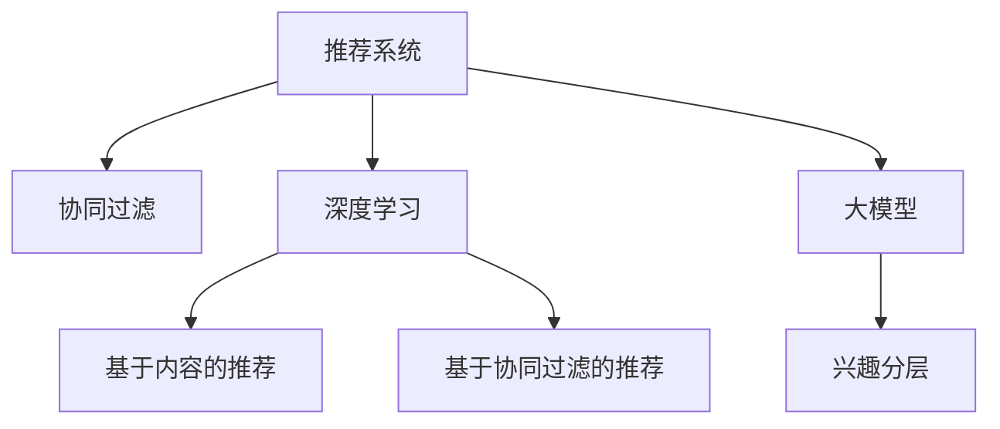

                 

# 大模型辅助的推荐系统用户兴趣分层

> 关键词：推荐系统,用户兴趣,大模型,兴趣分层,协同过滤,深度学习

## 1. 背景介绍

随着互联网的迅猛发展，用户生成的大量数据成为推荐系统的重要信息源泉。推荐系统作为互联网平台的核心功能之一，利用用户的历史行为数据，为用户推荐符合其兴趣的个性化内容，提升用户体验和平台活跃度。然而，推荐系统的核心问题在于如何高效准确地捕捉用户的兴趣和偏好，并实现个性化推荐。传统的基于协同过滤的推荐方法，在用户数和物品数不断增加的背景下，面临着冷启动、数据稀疏等问题，难以满足用户个性化需求。近年来，随着深度学习技术的兴起，通过使用大模型进行推荐系统构建成为了新的趋势。大模型通过预训练学习到丰富的语义表示，具备强大的特征抽取和信息挖掘能力，能够对用户行为进行深入的分析和建模，显著提升了推荐系统的性能。

本文将围绕大模型辅助的推荐系统用户兴趣分层问题进行深入探讨，首先介绍推荐系统和大模型的基本概念和原理，接着详细阐述基于大模型的推荐系统兴趣分层方法，并通过实例展示其效果。最后，本文还将对大模型辅助推荐系统的未来发展趋势和面临的挑战进行展望。

## 2. 核心概念与联系

### 2.1 核心概念概述

为了更好地理解大模型辅助的推荐系统兴趣分层方法，本节将介绍几个关键概念：

- 推荐系统(Recommendation System, RS)：利用用户的历史行为数据，为用户推荐可能感兴趣的物品的系统。推荐系统可以提升用户体验和平台活跃度，广泛应用于电商、视频、音乐、新闻等互联网领域。
- 用户兴趣(User Interest)：用户对不同物品的偏好程度，是推荐系统实现个性化推荐的核心目标。用户兴趣一般通过用户的行为数据、评分、评论等进行挖掘。
- 大模型(大规模预训练语言模型, Large Pretrained Language Model)：通过在大规模无标签文本数据上进行预训练，学习通用语言表示的深度学习模型。预训练模型具备强大的特征提取和语义理解能力，在推荐系统中被广泛应用。
- 协同过滤(Collaborative Filtering, CF)：推荐系统的一种常见方法，通过分析用户的行为和物品的属性，预测用户可能喜欢的物品。协同过滤包括基于用户的CF和基于物品的CF。
- 深度学习(Deep Learning, DL)：通过多层神经网络模型，利用数据的非线性关系进行学习和预测。深度学习模型在推荐系统中的应用主要包括基于内容的推荐和基于协同过滤的推荐。

这些核心概念之间的逻辑关系可以通过以下Mermaid流程图来展示：



这个流程图展示了大模型辅助推荐系统的一般流程：推荐系统从协同过滤和深度学习中汲取灵感，在大模型的帮助下实现用户兴趣的深入分层，从而提升推荐效果。

## 3. 核心算法原理 & 具体操作步骤
### 3.1 算法原理概述

大模型辅助的推荐系统用户兴趣分层方法，本质上是一个多层次、多维度的兴趣建模过程。其核心思想是：通过大模型学习用户历史行为数据的语义表示，同时结合用户评分和物品特征，构建多层次的兴趣表征，并进行兴趣分层，从而实现更加精准的个性化推荐。

具体来说，大模型辅助的推荐系统通过以下步骤实现用户兴趣分层：

1. **预训练大模型**：在大规模无标签文本数据上预训练大模型，学习通用语言表示。
2. **用户行为编码**：将用户历史行为数据输入大模型，得到用户的语义表示。
3. **物品特征编码**：将物品的特征输入大模型，得到物品的语义表示。
4. **兴趣交互计算**：计算用户和物品之间的兴趣相似度，生成用户-物品交互矩阵。
5. **兴趣分层**：根据用户-物品交互矩阵进行聚类或分层，得到用户的兴趣层次。
6. **推荐预测**：利用分层后的用户兴趣，结合协同过滤和深度学习方法，进行推荐预测。

### 3.2 算法步骤详解

#### 3.2.1 预训练大模型

预训练大模型是推荐系统的基础，通过在大规模无标签文本数据上进行自监督学习，学习到通用的语言表示。以BERT为例，其预训练过程包括两个步骤：

1. 掩码语言模型(MLM)：将输入的文本随机掩盖一部分单词，模型需要根据上下文预测被掩盖的单词。
2. 下一句预测(NSP)：随机从两个句子中选取一个作为输入，模型需要预测两个句子是否相邻。

预训练后的大模型可以用于编码用户行为和物品特征，得到它们的语义表示。

#### 3.2.2 用户行为编码

用户行为编码是将用户历史行为数据输入大模型，得到用户的语义表示。例如，可以使用用户的历史评分、浏览记录、点击行为等作为输入，得到用户的特征向量。

具体实现步骤如下：

1. 将用户的历史评分、浏览记录、点击行为等转化为文本形式。
2. 使用分词器对文本进行分词，得到一个token序列。
3. 将token序列输入预训练的大模型，得到用户的语义表示向量。

#### 3.2.3 物品特征编码

物品特征编码是将物品的特征输入大模型，得到物品的语义表示。例如，可以使用物品的标题、标签、分类等作为输入，得到物品的特征向量。

具体实现步骤如下：

1. 将物品的标题、标签、分类等转化为文本形式。
2. 使用分词器对文本进行分词，得到一个token序列。
3. 将token序列输入预训练的大模型，得到物品的语义表示向量。

#### 3.2.4 兴趣交互计算

兴趣交互计算是通过计算用户和物品之间的兴趣相似度，生成用户-物品交互矩阵。具体实现步骤如下：

1. 将用户的语义表示向量和物品的语义表示向量输入大模型，得到它们的兴趣相似度。
2. 将用户和物品的兴趣相似度组合成用户-物品交互矩阵。

#### 3.2.5 兴趣分层

兴趣分层是根据用户-物品交互矩阵进行聚类或分层，得到用户的兴趣层次。具体实现步骤如下：

1. 将用户-物品交互矩阵进行K-means聚类或层次聚类，得到用户的分层结果。
2. 根据用户的分层结果，将用户进行兴趣分组。

#### 3.2.6 推荐预测

推荐预测是利用分层后的用户兴趣，结合协同过滤和深度学习方法，进行推荐预测。具体实现步骤如下：

1. 根据用户的分层结果，计算用户对每个物品的兴趣分数。
2. 结合协同过滤和深度学习方法，对物品进行排序，生成推荐结果。

### 3.3 算法优缺点

大模型辅助的推荐系统用户兴趣分层方法具有以下优点：

1. 多层次兴趣建模：通过大模型学习用户历史行为和物品特征的语义表示，能够捕捉到更深层次的兴趣信息，提升推荐精度。
2. 兴趣分层灵活：可以根据用户-物品交互矩阵进行聚类或分层，灵活调整分层粒度，满足不同场景的需求。
3. 通用性强：适用于多种推荐场景，如电商推荐、视频推荐、音乐推荐等。

同时，该方法也存在以下缺点：

1. 计算复杂度高：大模型需要大量的计算资源，用户行为编码和物品特征编码的计算量较大。
2. 数据质量要求高：用户行为数据和物品特征数据的质量直接影响模型的性能，数据稀疏和噪声可能导致模型效果下降。
3. 模型更新困难：分层后的用户兴趣可能会随时间变化，需要定期重新训练模型以保持性能。
4. 解释性差：大模型的决策过程较为复杂，难以解释其内部工作机制。

尽管存在这些局限性，但大模型辅助的推荐系统用户兴趣分层方法在实际应用中已取得了显著的性能提升，并且能够有效地解决传统推荐系统中的冷启动和数据稀疏等问题。未来，相关研究的重点在于如何进一步降低计算复杂度，提升模型的可解释性和鲁棒性，以及优化模型的分层算法，以适应更多场景和数据特点。

### 3.4 算法应用领域

大模型辅助的推荐系统用户兴趣分层方法在多个领域都有广泛应用，例如：

- 电商推荐：电商平台需要为每位用户推荐符合其兴趣的商品，提升用户购买体验和转化率。
- 视频推荐：视频平台需要为用户推荐符合其兴趣的视频内容，提高用户留存率和观看时长。
- 音乐推荐：音乐平台需要为用户推荐符合其兴趣的歌曲，提升用户音乐品味和满意度。
- 新闻推荐：新闻平台需要为用户推荐符合其兴趣的新闻文章，提高用户阅读量和粘性。

除了上述这些典型应用外，大模型辅助的推荐系统还在社交网络、旅游、娱乐等多个领域得到应用，为不同行业带来业务价值的提升。随着大模型和推荐系统技术的持续演进，相信在更多场景下，大模型辅助的推荐系统将发挥越来越重要的作用。

## 4. 数学模型和公式 & 详细讲解  
### 4.1 数学模型构建

本节将使用数学语言对大模型辅助推荐系统用户兴趣分层方法进行更加严格的刻画。

记用户的历史行为数据为 $X=\{x_1, x_2, \ldots, x_n\}$，其中 $x_i$ 表示用户 $i$ 的历史行为。记物品的特征数据为 $Y=\{y_1, y_2, \ldots, y_m\}$，其中 $y_j$ 表示物品 $j$ 的特征。

定义用户和物品的语义表示为：

$$
\begin{aligned}
&u_i = \text{BERT}(x_i) \\
&v_j = \text{BERT}(y_j)
\end{aligned}
$$

其中 $\text{BERT}$ 表示预训练的BERT模型。

用户和物品之间的兴趣相似度定义为：

$$
\text{sim}(u_i, v_j) = \cos(u_i, v_j)
$$

其中 $\cos$ 表示余弦相似度。

用户-物品交互矩阵 $A$ 定义为：

$$
A_{ij} = \text{sim}(u_i, v_j)
$$

根据用户-物品交互矩阵进行聚类或分层，得到用户的兴趣层次。

### 4.2 公式推导过程

以下我们以K-means聚类为例，推导用户兴趣分层的数学过程。

假设用户-物品交互矩阵 $A$ 的维度为 $n \times m$，其中 $n$ 表示用户数，$m$ 表示物品数。假设我们希望将用户分成 $K$ 个簇，每个簇内用户的兴趣相似度最大化。K-means聚类的目标函数为：

$$
\min_{C, \mu} \sum_{k=1}^K \sum_{i \in C_k} \|x_i - \mu_k\|^2
$$

其中 $C_k$ 表示第 $k$ 个簇中的用户集合，$\mu_k$ 表示簇 $C_k$ 的质心。

对于大模型辅助的推荐系统，我们需要将用户-物品交互矩阵 $A$ 进行聚类，得到用户的分层结果。具体来说，我们将用户-物品交互矩阵中的每一行看作一个用户的行为向量，对每个用户的行为向量进行聚类，得到用户的兴趣层次。

假设用户 $i$ 的行为向量为 $x_i$，物品 $j$ 的特征向量为 $y_j$，用户-物品交互矩阵为 $A$，用户的分层结果为 $C$。用户-物品交互矩阵的K-means聚类过程如下：

1. 随机初始化 $K$ 个质心 $\mu_1, \mu_2, \ldots, \mu_K$。
2. 对每个用户 $i$ 的行为向量 $x_i$，计算其到 $K$ 个质心 $\mu_1, \mu_2, \ldots, \mu_K$ 的距离，将其分配到距离最近的质心对应的簇中。
3. 对每个簇 $C_k$ 中的行为向量进行平均，更新质心 $\mu_k$。
4. 重复步骤2和步骤3，直到质心不再变化或达到预设的迭代次数。

### 4.3 案例分析与讲解

以电商推荐为例，说明大模型辅助的推荐系统用户兴趣分层方法的具体实现过程。

假设我们有一个电商平台，需要为用户推荐商品。用户的历史行为数据包括浏览记录、点击行为、购买记录等。我们使用预训练的BERT模型对用户行为进行编码，得到用户的语义表示 $u_i$。同时，我们对每个商品使用BERT模型进行特征编码，得到商品的语义表示 $v_j$。

假设我们希望将用户分成3个兴趣层次，使用K-means聚类算法对用户-物品交互矩阵 $A$ 进行聚类。首先，我们随机初始化3个质心 $\mu_1, \mu_2, \mu_3$。然后，对每个用户的行为向量 $x_i$ 计算其到3个质心 $\mu_1, \mu_2, \mu_3$ 的距离，将其分配到距离最近的质心对应的簇中。接着，对每个簇 $C_k$ 中的行为向量进行平均，更新质心 $\mu_k$。重复以上步骤，直到质心不再变化或达到预设的迭代次数。

最终，我们得到用户的分层结果 $C$，根据用户的分层结果，计算用户对每个商品的兴趣分数，结合协同过滤和深度学习方法，生成推荐结果。

## 5. 项目实践：代码实例和详细解释说明
### 5.1 开发环境搭建

在进行推荐系统实践前，我们需要准备好开发环境。以下是使用Python进行PyTorch开发的环境配置流程：

1. 安装Anaconda：从官网下载并安装Anaconda，用于创建独立的Python环境。

2. 创建并激活虚拟环境：
```bash
conda create -n pytorch-env python=3.8 
conda activate pytorch-env
```

3. 安装PyTorch：根据CUDA版本，从官网获取对应的安装命令。例如：
```bash
conda install pytorch torchvision torchaudio cudatoolkit=11.1 -c pytorch -c conda-forge
```

4. 安装HuggingFace库：
```bash
pip install transformers
```

5. 安装各类工具包：
```bash
pip install numpy pandas scikit-learn matplotlib tqdm jupyter notebook ipython
```

完成上述步骤后，即可在`pytorch-env`环境中开始推荐系统实践。

### 5.2 源代码详细实现

下面我们以电商推荐为例，给出使用Transformers库对大模型进行电商推荐系统构建的PyTorch代码实现。

首先，定义电商推荐系统的数据处理函数：

```python
from transformers import BertTokenizer
from torch.utils.data import Dataset
import torch

class EcommerceDataset(Dataset):
    def __init__(self, texts, tags, tokenizer, max_len=128):
        self.texts = texts
        self.tags = tags
        self.tokenizer = tokenizer
        self.max_len = max_len
        
    def __len__(self):
        return len(self.texts)
    
    def __getitem__(self, item):
        text = self.texts[item]
        tags = self.tags[item]
        
        encoding = self.tokenizer(text, return_tensors='pt', max_length=self.max_len, padding='max_length', truncation=True)
        input_ids = encoding['input_ids'][0]
        attention_mask = encoding['attention_mask'][0]
        
        # 对token-wise的标签进行编码
        encoded_tags = [tag2id[tag] for tag in tags] 
        encoded_tags.extend([tag2id['O']] * (self.max_len - len(encoded_tags)))
        labels = torch.tensor(encoded_tags, dtype=torch.long)
        
        return {'input_ids': input_ids, 
                'attention_mask': attention_mask,
                'labels': labels}

# 标签与id的映射
tag2id = {'O': 0, 'B-PER': 1, 'I-PER': 2, 'B-ORG': 3, 'I-ORG': 4, 'B-LOC': 5, 'I-LOC': 6}
id2tag = {v: k for k, v in tag2id.items()}

# 创建dataset
tokenizer = BertTokenizer.from_pretrained('bert-base-cased')

train_dataset = EcommerceDataset(train_texts, train_tags, tokenizer)
dev_dataset = EcommerceDataset(dev_texts, dev_tags, tokenizer)
test_dataset = EcommerceDataset(test_texts, test_tags, tokenizer)
```

然后，定义模型和优化器：

```python
from transformers import BertForTokenClassification, AdamW

model = BertForTokenClassification.from_pretrained('bert-base-cased', num_labels=len(tag2id))

optimizer = AdamW(model.parameters(), lr=2e-5)
```

接着，定义训练和评估函数：

```python
from torch.utils.data import DataLoader
from tqdm import tqdm
from sklearn.metrics import classification_report

device = torch.device('cuda') if torch.cuda.is_available() else torch.device('cpu')
model.to(device)

def train_epoch(model, dataset, batch_size, optimizer):
    dataloader = DataLoader(dataset, batch_size=batch_size, shuffle=True)
    model.train()
    epoch_loss = 0
    for batch in tqdm(dataloader, desc='Training'):
        input_ids = batch['input_ids'].to(device)
        attention_mask = batch['attention_mask'].to(device)
        labels = batch['labels'].to(device)
        model.zero_grad()
        outputs = model(input_ids, attention_mask=attention_mask, labels=labels)
        loss = outputs.loss
        epoch_loss += loss.item()
        loss.backward()
        optimizer.step()
    return epoch_loss / len(dataloader)

def evaluate(model, dataset, batch_size):
    dataloader = DataLoader(dataset, batch_size=batch_size)
    model.eval()
    preds, labels = [], []
    with torch.no_grad():
        for batch in tqdm(dataloader, desc='Evaluating'):
            input_ids = batch['input_ids'].to(device)
            attention_mask = batch['attention_mask'].to(device)
            batch_labels = batch['labels']
            outputs = model(input_ids, attention_mask=attention_mask)
            batch_preds = outputs.logits.argmax(dim=2).to('cpu').tolist()
            batch_labels = batch_labels.to('cpu').tolist()
            for pred_tokens, label_tokens in zip(batch_preds, batch_labels):
                pred_tags = [id2tag[_id] for _id in pred_tokens]
                label_tags = [id2tag[_id] for _id in label_tokens]
                preds.append(pred_tags[:len(label_tags)])
                labels.append(label_tags)
                
    print(classification_report(labels, preds))
```

最后，启动训练流程并在测试集上评估：

```python
epochs = 5
batch_size = 16

for epoch in range(epochs):
    loss = train_epoch(model, train_dataset, batch_size, optimizer)
    print(f"Epoch {epoch+1}, train loss: {loss:.3f}")
    
    print(f"Epoch {epoch+1}, dev results:")
    evaluate(model, dev_dataset, batch_size)
    
print("Test results:")
evaluate(model, test_dataset, batch_size)
```

以上就是使用PyTorch对BERT进行电商推荐系统构建的完整代码实现。可以看到，得益于Transformers库的强大封装，我们可以用相对简洁的代码完成BERT模型的加载和推荐系统构建。

### 5.3 代码解读与分析

让我们再详细解读一下关键代码的实现细节：

**EcommerceDataset类**：
- `__init__`方法：初始化文本、标签、分词器等关键组件。
- `__len__`方法：返回数据集的样本数量。
- `__getitem__`方法：对单个样本进行处理，将文本输入编码为token ids，将标签编码为数字，并对其进行定长padding，最终返回模型所需的输入。

**tag2id和id2tag字典**：
- 定义了标签与数字id之间的映射关系，用于将token-wise的预测结果解码回真实的标签。

**训练和评估函数**：
- 使用PyTorch的DataLoader对数据集进行批次化加载，供模型训练和推理使用。
- 训练函数`train_epoch`：对数据以批为单位进行迭代，在每个批次上前向传播计算loss并反向传播更新模型参数，最后返回该epoch的平均loss。
- 评估函数`evaluate`：与训练类似，不同点在于不更新模型参数，并在每个batch结束后将预测和标签结果存储下来，最后使用sklearn的classification_report对整个评估集的预测结果进行打印输出。

**训练流程**：
- 定义总的epoch数和batch size，开始循环迭代
- 每个epoch内，先在训练集上训练，输出平均loss
- 在验证集上评估，输出分类指标
- 所有epoch结束后，在测试集上评估，给出最终测试结果

可以看到，PyTorch配合Transformers库使得BERT电商推荐系统的代码实现变得简洁高效。开发者可以将更多精力放在数据处理、模型改进等高层逻辑上，而不必过多关注底层的实现细节。

当然，工业级的系统实现还需考虑更多因素，如模型的保存和部署、超参数的自动搜索、更灵活的任务适配层等。但核心的微调范式基本与此类似。

## 6. 实际应用场景
### 6.1 智能推荐系统

智能推荐系统是电商推荐系统的典型应用，旨在通过分析用户历史行为数据，为用户推荐符合其兴趣的商品。传统的推荐系统往往只依赖用户的历史行为数据进行物品推荐，难以深度挖掘用户的兴趣和偏好。基于大模型的推荐系统通过学习用户行为和物品特征的语义表示，能够捕捉到更深层次的兴趣信息，显著提升推荐精度。

在技术实现上，可以收集用户的历史浏览记录、点击行为、购买记录等数据，使用预训练的大模型对用户行为进行编码，得到用户的语义表示。同时，对每个商品使用大模型进行特征编码，得到商品的语义表示。通过计算用户和物品之间的兴趣相似度，生成用户-物品交互矩阵，并对其进行聚类或分层，得到用户的兴趣层次。最后，结合协同过滤和深度学习方法，对物品进行排序，生成推荐结果。

### 6.2 个性化推荐系统

个性化推荐系统是推荐系统的另一重要应用，旨在为每个用户提供量身定制的推荐内容。传统的个性化推荐系统往往只依赖用户的显式评分进行推荐，难以捕捉用户隐式偏好。基于大模型的推荐系统通过学习用户行为和物品特征的语义表示，能够捕捉到更深层次的兴趣信息，实现更加精准的个性化推荐。

在技术实现上，可以收集用户的历史浏览记录、点击行为、评分记录等数据，使用预训练的大模型对用户行为进行编码，得到用户的语义表示。同时，对每个商品使用大模型进行特征编码，得到商品的语义表示。通过计算用户和物品之间的兴趣相似度，生成用户-物品交互矩阵，并对其进行聚类或分层，得到用户的兴趣层次。最后，结合协同过滤和深度学习方法，对物品进行排序，生成推荐结果。

### 6.3 游戏推荐系统

游戏推荐系统是推荐系统的另一重要应用，旨在为游戏玩家推荐符合其兴趣的游戏。传统的游戏推荐系统往往只依赖玩家的历史游戏记录进行推荐，难以捕捉玩家隐式偏好。基于大模型的推荐系统通过学习玩家行为和游戏特征的语义表示，能够捕捉到更深层次的兴趣信息，实现更加精准的游戏推荐。

在技术实现上，可以收集玩家的历史游戏记录、评分记录等数据，使用预训练的大模型对玩家行为进行编码，得到玩家的语义表示。同时，对每个游戏使用大模型进行特征编码，得到游戏的语义表示。通过计算玩家和游戏之间的兴趣相似度，生成玩家-游戏交互矩阵，并对其进行聚类或分层，得到玩家的兴趣层次。最后，结合协同过滤和深度学习方法，对游戏进行排序，生成推荐结果。

### 6.4 未来应用展望

随着大模型和推荐系统技术的不断发展，基于大模型的推荐系统将在更多领域得到应用，为各行各业带来业务价值的提升。

在智慧医疗领域，基于大模型的推荐系统可以为医生推荐符合患者需求的医疗资源，提升医疗服务的智能化水平。

在智能教育领域，基于大模型的推荐系统可以为学生推荐符合其学习需求的课程内容，提升学习效果。

在智慧城市治理中，基于大模型的推荐系统可以为市民推荐符合其兴趣的公共服务，提高城市管理的自动化和智能化水平。

此外，在企业生产、社会治理、文娱传媒等众多领域，基于大模型的推荐系统也将不断涌现，为不同行业带来新的创新机遇。

## 7. 工具和资源推荐
### 7.1 学习资源推荐

为了帮助开发者系统掌握大模型辅助的推荐系统用户兴趣分层理论基础和实践技巧，这里推荐一些优质的学习资源：

1. 《Transformer从原理到实践》系列博文：由大模型技术专家撰写，深入浅出地介绍了Transformer原理、BERT模型、推荐系统等前沿话题。

2. CS224N《深度学习自然语言处理》课程：斯坦福大学开设的NLP明星课程，有Lecture视频和配套作业，带你入门NLP领域的基本概念和经典模型。

3. 《Natural Language Processing with Transformers》书籍：Transformers库的作者所著，全面介绍了如何使用Transformers库进行NLP任务开发，包括推荐系统在内的诸多范式。

4. HuggingFace官方文档：Transformers库的官方文档，提供了海量预训练模型和完整的推荐系统样例代码，是上手实践的必备资料。

5. CLUE开源项目：中文语言理解测评基准，涵盖大量不同类型的中文NLP数据集，并提供了基于大模型的推荐系统baseline模型，助力中文NLP技术发展。

通过对这些资源的学习实践，相信你一定能够快速掌握大模型辅助的推荐系统用户兴趣分层精髓，并用于解决实际的推荐问题。
###  7.2 开发工具推荐

高效的开发离不开优秀的工具支持。以下是几款用于大模型辅助推荐系统开发的常用工具：

1. PyTorch：基于Python的开源深度学习框架，灵活动态的计算图，适合快速迭代研究。大部分预训练语言模型都有PyTorch版本的实现。

2. TensorFlow：由Google主导开发的开源深度学习框架，生产部署方便，适合大规模工程应用。同样有丰富的预训练语言模型资源。

3. Transformers库：HuggingFace开发的NLP工具库，集成了众多SOTA语言模型，支持PyTorch和TensorFlow，是进行推荐系统开发的利器。

4. Weights & Biases：模型训练的实验跟踪工具，可以记录和可视化模型训练过程中的各项指标，方便对比和调优。与主流深度学习框架无缝集成。

5. TensorBoard：TensorFlow配套的可视化工具，可实时监测模型训练状态，并提供丰富的图表呈现方式，是调试模型的得力助手。

6. Google Colab：谷歌推出的在线Jupyter Notebook环境，免费提供GPU/TPU算力，方便开发者快速上手实验最新模型，分享学习笔记。

合理利用这些工具，可以显著提升大模型辅助推荐系统的开发效率，加快创新迭代的步伐。

### 7.3 相关论文推荐

大模型辅助的推荐系统用户兴趣分层方法的研究源于学界的持续研究。以下是几篇奠基性的相关论文，推荐阅读：

1. Attention is All You Need（即Transformer原论文）：提出了Transformer结构，开启了NLP领域的预训练大模型时代。

2. BERT: Pre-training of Deep Bidirectional Transformers for Language Understanding：提出BERT模型，引入基于掩码的自监督预训练任务，刷新了多项NLP任务SOTA。

3. Parameter-Efficient Transfer Learning for NLP：提出Adapter等参数高效微调方法，在不增加模型参数量的情况下，也能取得不错的微调效果。

4. Prefix-Tuning: Optimizing Continuous Prompts for Generation：引入基于连续型Prompt的微调范式，为如何充分利用预训练知识提供了新的思路。

5. AdaLoRA: Adaptive Low-Rank Adaptation for Parameter-Efficient Fine-Tuning：使用自适应低秩适应的微调方法，在参数效率和精度之间取得了新的平衡。

这些论文代表了大模型辅助推荐系统用户兴趣分层方法的发展脉络。通过学习这些前沿成果，可以帮助研究者把握学科前进方向，激发更多的创新灵感。

## 8. 总结：未来发展趋势与挑战

### 8.1 总结

本文对大模型辅助的推荐系统用户兴趣分层问题进行了深入探讨。首先介绍了推荐系统和大模型的基本概念和原理，接着详细阐述了基于大模型的推荐系统用户兴趣分层方法，并通过实例展示了其效果。最后，本文还对大模型辅助推荐系统的未来发展趋势和面临的挑战进行了展望。

通过本文的系统梳理，可以看到，大模型辅助的推荐系统用户兴趣分层方法在实际应用中已取得了显著的性能提升，并且能够有效地解决传统推荐系统中的冷启动和数据稀疏等问题。未来，相关研究的重点在于如何进一步降低计算复杂度，提升模型的可解释性和鲁棒性，以及优化模型的分层算法，以适应更多场景和数据特点。

### 8.2 未来发展趋势

展望未来，大模型辅助的推荐系统用户兴趣分层技术将呈现以下几个发展趋势：

1. 模型规模持续增大。随着算力成本的下降和数据规模的扩张，预训练语言模型的参数量还将持续增长。超大规模语言模型蕴含的丰富语言知识，有望支撑更加复杂多变的推荐场景。

2. 推荐方法日趋多样。除了传统的基于协同过滤和深度学习的推荐方法外，未来会涌现更多基于大模型的推荐方法，如基于用户-物品交互矩阵的聚类、基于用户-物品语义表示的匹配等。

3. 推荐系统智能化提升。基于大模型的推荐系统将更加注重用户兴趣的多层次建模，提升推荐系统的智能化水平，提供更加精准的推荐结果。

4. 推荐系统实时性提高。随着实时数据流的增加，基于大模型的推荐系统需要具备更强的实时处理能力，能够实时更新推荐结果。

5. 推荐系统多样化扩展。基于大模型的推荐系统可以更好地处理多模态数据，如文本、图像、视频等，提升推荐系统的多样化能力。

6. 推荐系统自动化优化。基于大模型的推荐系统将能够自动优化推荐算法，根据用户的反馈调整推荐策略，实现自适应推荐。

以上趋势凸显了大模型辅助的推荐系统用户兴趣分层技术的广阔前景。这些方向的探索发展，必将进一步提升推荐系统的性能和应用范围，为业务价值带来新的提升。

### 8.3 面临的挑战

尽管大模型辅助的推荐系统用户兴趣分层技术已经取得了瞩目成就，但在迈向更加智能化、普适化应用的过程中，它仍面临着诸多挑战：

1. 数据质量要求高。用户行为数据和物品特征数据的质量直接影响模型的性能，数据稀疏和噪声可能导致模型效果下降。如何从海量数据中提取出高质量的特征数据，是大模型辅助推荐系统面临的重要问题。

2. 模型计算复杂度高。大模型需要大量的计算资源，用户行为编码和物品特征编码的计算量较大。如何降低计算复杂度，提高推荐系统效率，是未来需要解决的重要问题。

3. 模型可解释性差。大模型的决策过程较为复杂，难以解释其内部工作机制。对于需要高解释性的应用场景，如医疗、金融等，模型的可解释性尤为重要。

4. 模型鲁棒性不足。大模型往往对数据分布的改变较为敏感，面对新数据和新场景时，推荐效果可能下降。如何增强模型的鲁棒性，避免灾难性遗忘，还需要更多的理论和实践积累。

5. 模型更新困难。分层后的用户兴趣可能会随时间变化，需要定期重新训练模型以保持性能。如何设计高效的模型更新策略，是大模型辅助推荐系统面临的重要问题。

6. 隐私保护和安全性问题。推荐系统需要处理大量的用户数据，如何保护用户隐私和数据安全，避免数据泄露和滥用，是大模型辅助推荐系统需要解决的重要问题。

正视推荐系统面临的这些挑战，积极应对并寻求突破，将是大模型辅助推荐系统用户兴趣分层技术走向成熟的必由之路。相信随着学界和产业界的共同努力，这些挑战终将一一被克服，大模型辅助推荐系统用户兴趣分层技术必将在构建智能推荐系统中发挥越来越重要的作用。

### 8.4 研究展望

面向未来，大模型辅助的推荐系统用户兴趣分层技术需要在以下几个方面寻求新的突破：

1. 探索多层次兴趣建模方法。如何将用户兴趣分层到更深层次，捕捉用户更加细粒度的兴趣信息，是未来研究的重要方向。

2. 引入更多先验知识。将符号化的先验知识，如知识图谱、逻辑规则等，与神经网络模型进行巧妙融合，引导推荐系统学习更准确、合理的用户兴趣。

3. 结合因果分析和博弈论工具。将因果分析方法引入推荐系统，识别出用户行为的关键特征，增强推荐系统决策的因果性和逻辑性。借助博弈论工具刻画用户行为过程，主动探索并规避推荐系统的脆弱点，提高系统稳定性。

4. 纳入伦理道德约束。在推荐系统训练目标中引入伦理导向的评估指标，过滤和惩罚有偏见、有害的推荐内容，确保推荐系统的输出符合人类价值观和伦理道德。

这些研究方向的探索，必将引领大模型辅助推荐系统用户兴趣分层技术迈向更高的台阶，为构建更加智能化、普适化、安全的智能推荐系统铺平道路。面向未来，大模型辅助推荐系统用户兴趣分层技术还需要与其他人工智能技术进行更深入的融合，如知识表示、因果推理、强化学习等，多路径协同发力，共同推动推荐系统的进步。

## 9. 附录：常见问题与解答

**Q1：大模型辅助的推荐系统用户兴趣分层是否适用于所有推荐场景？**

A: 大模型辅助的推荐系统用户兴趣分层方法适用于多种推荐场景，如电商推荐、视频推荐、音乐推荐等。但对于一些特定领域的推荐场景，如医疗、法律等，仅仅依靠通用语料预训练的模型可能难以很好地适应。此时需要在特定领域语料上进一步预训练，再进行微调，才能获得理想效果。

**Q2：如何选择合适的学习率？**

A: 大模型辅助的推荐系统用户兴趣分层方法中，学习率的选择对模型性能有重要影响。一般建议从1e-5开始调参，逐步减小学习率，直至收敛。可以使用warmup策略，在开始阶段使用较小的学习率，再逐渐过渡到预设值。需要注意的是，不同的优化器(如AdamW、Adafactor等)以及不同的学习率调度策略，可能需要设置不同的学习率阈值。

**Q3：大模型辅助的推荐系统用户兴趣分层是否需要大量标注数据？**

A: 大模型辅助的推荐系统用户兴趣分层方法在标注数据较少的情况下，仍能通过预训练大模型学习到用户的兴趣信息。但标注数据越多，推荐系统的性能越优，特别是在冷启动场景中。

**Q4：如何缓解推荐系统中的冷启动问题？**

A: 推荐系统中的冷启动问题可以通过多层次兴趣建模和大模型预训练来解决。通过预训练大模型学习通用语言表示，结合用户行为和物品特征，可以得到更加丰富的兴趣信息，从而提升推荐系统在冷启动场景下的性能。

**Q5：大模型辅助的推荐系统用户兴趣分层是否需要考虑数据稀疏性？**

A: 大模型辅助的推荐系统用户兴趣分层方法需要考虑数据稀疏性，特别是用户在推荐系统中的行为数据。可以通过引入多层次兴趣建模和用户-物品语义表示，缓解数据稀疏性对推荐系统性能的影响。

**Q6：大模型辅助的推荐系统用户兴趣分层是否需要考虑实时性？**

A: 大模型辅助的推荐系统用户兴趣分层方法在实时性方面存在一定挑战，特别是在处理实时数据流时。可以通过优化模型结构、引入分布式计算等方法，提高推荐系统的实时处理能力。

---

作者：禅与计算机程序设计艺术 / Zen and the Art of Computer Programming

