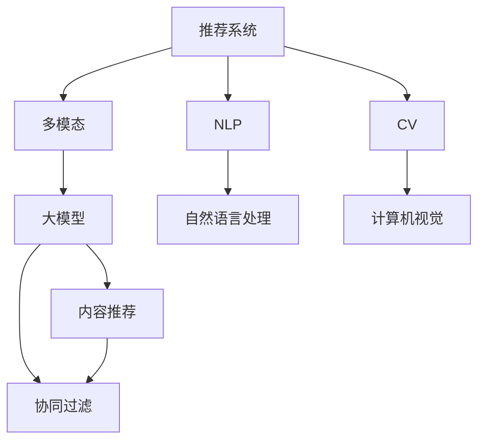

                 

# 大模型驱动的推荐系统多模态内容推荐

> 关键词：推荐系统,多模态,大模型,内容推荐,深度学习,自然语言处理,NLP,计算机视觉,CV

## 1. 背景介绍

推荐系统在互联网时代扮演着越来越重要的角色，从电商平台到社交网络，从视频网站到新闻媒体，推荐系统的广泛应用极大地提升了用户体验和运营效率。传统的推荐系统主要依赖用户历史行为数据，采用基于协同过滤、基于内容的推荐方式，难以突破数据稀疏性和信息过载的挑战。近年来，随着深度学习技术的发展，推荐系统逐渐引入大模型进行推荐，提升了推荐效果。

然而，现有的推荐系统仍然面临一些问题。首先，传统的推荐系统往往只利用单一模态数据，如文本、图片、视频等，难以充分利用其他模态的信息，导致推荐结果的不完整和偏颇。其次，大模型在推荐过程中的泛化能力不足，难以在不同领域和场景中保持稳定性和一致性。如何构建跨模态、泛化能力强、具有良好可解释性的推荐系统，成为当前研究的热点问题。

多模态推荐系统应运而生，通过融合多源异构数据，利用深度学习模型进行特征学习和内容表示，能够提供更加全面、准确和个性化的推荐结果。结合大模型驱动的推荐系统，可以在一定程度上解决以上问题，为推荐系统带来新的突破。

本文将介绍基于大模型的多模态推荐系统，重点讨论大模型在推荐系统中的驱动作用，以及多模态数据的融合和处理。

## 2. 核心概念与联系

### 2.1 核心概念概述

为更好地理解大模型驱动的多模态推荐系统，本节将介绍几个密切相关的核心概念：

- **推荐系统(Recommendation System)**：利用用户历史行为数据或用户画像，为用户推荐感兴趣或可能感兴趣的商品、内容等。推荐系统分为基于协同过滤和基于内容的两种主流方式。
- **多模态(Multi-modal)**：指结合文本、图像、音频、视频等多种数据形式进行内容建模和推荐。
- **大模型(Large Model)**：如BERT、GPT等，通过海量数据进行预训练，具备强大的语言理解能力和特征表示能力。
- **内容推荐(Content-Based Recommendation)**：利用用户兴趣标签、产品属性、文本描述等非用户行为特征进行推荐。
- **协同过滤(Collaborative Filtering)**：通过分析用户间、物品间的相似性，预测用户对未交互物品的评分，推荐相似物品。
- **自然语言处理(NLP)**：利用语言模型处理文本数据，进行文本表示、文本分类、情感分析、实体识别等。
- **计算机视觉(CV)**：利用视觉模型处理图像数据，进行图像分类、目标检测、图像生成等。

这些核心概念之间的逻辑关系可以通过以下Mermaid流程图来展示：



这个流程图展示了大模型驱动的多模态推荐系统的核心概念及其之间的关系：

1. 推荐系统通过融合多模态数据，利用大模型进行内容推荐。
2. 内容推荐利用用户画像和物品描述，通过大模型的文本表示能力进行特征学习。
3. 协同过滤利用用户间的交互数据，通过大模型的相似性计算能力进行物品推荐。
4. NLP和CV通过大模型的预训练能力，提取文本和图像的特征。
5. 最终，推荐系统将融合后的多模态特征进行综合，生成推荐结果。

## 3. 核心算法原理 & 具体操作步骤

### 3.1 算法原理概述

大模型驱动的多模态推荐系统主要基于以下算法原理：

1. **多模态特征融合**：通过融合文本、图像、音频等多源异构数据，利用深度学习模型进行特征表示，生成多模态特征向量。

2. **多模态表示学习**：利用大模型进行多模态数据的高效表示，包括词嵌入、图像特征提取、文本分类等。

3. **内容推荐与协同过滤**：在大模型提取的多模态特征基础上，利用内容推荐和协同过滤技术进行推荐。

4. **模型融合与集成**：结合多种模型和算法，进行模型融合和集成，生成最终推荐结果。

### 3.2 算法步骤详解

基于大模型的多模态推荐系统一般包括以下几个关键步骤：

**Step 1: 数据准备与预处理**
- 收集推荐系统所需的多源异构数据，如商品图片、用户评论、评分等。
- 对数据进行清洗、标注和归一化处理，以便于后续模型训练。
- 使用领域内的大型语料库，如维基百科、新闻网站等，对大模型进行预训练。

**Step 2: 多模态特征提取**
- 利用预训练大模型，提取文本、图像、音频等多模态数据的特征向量。
- 融合多模态特征向量，生成多模态特征表示。
- 通过自监督任务训练，提升多模态特征的质量和泛化能力。

**Step 3: 模型训练与优化**
- 利用融合后的多模态特征，在大模型上进行推荐模型训练。
- 使用深度学习框架（如PyTorch、TensorFlow等）搭建推荐模型。
- 通过交叉验证等技术，评估模型性能并进行调优。

**Step 4: 推荐生成与评估**
- 将训练好的推荐模型应用于实际推荐场景，生成推荐结果。
- 对推荐结果进行评估，如精确率、召回率、F1值等。
- 根据反馈数据不断优化推荐模型，提升推荐效果。

### 3.3 算法优缺点

基于大模型的多模态推荐系统具有以下优点：

1. **高泛化能力**：大模型经过预训练，能够学习到通用的语言和视觉表示，应用于不同领域和场景时，泛化能力较强。

2. **融合多源数据**：通过融合文本、图像、音频等多源异构数据，利用深度学习模型进行特征学习，能够生成更加全面、准确的推荐结果。

3. **可解释性强**：大模型能够提取特征并生成推荐结果，易于解释和调试。

4. **高效推理**：大模型的推理速度较快，能够实时生成推荐结果。

同时，该方法也存在以下缺点：

1. **依赖标注数据**：大模型需要大量预训练数据，对标注数据的需求较大，数据获取成本较高。

2. **计算资源需求高**：大模型需要占用大量的计算资源，对硬件设施要求较高。

3. **可解释性不足**：大模型内部的表示学习过程复杂，难以解释其内部机制和决策逻辑。

4. **数据隐私风险**：在处理用户数据时，需要考虑数据隐私和安全性问题。

5. **模型复杂度高**：大模型的复杂度较高，训练和推理过程较慢，对模型的优化和调试要求较高。

### 3.4 算法应用领域

基于大模型的多模态推荐系统在多个领域得到了广泛应用，例如：

- 电商平台：如京东、亚马逊等，利用用户行为数据和商品属性数据，生成个性化推荐结果。
- 视频平台：如Netflix、YouTube等，利用用户历史观看数据和视频元数据，推荐感兴趣的视频内容。
- 新闻媒体：如人民日报、澎湃新闻等，利用用户阅读记录和新闻内容，推荐相关新闻。
- 社交网络：如微博、微信等，利用用户互动数据和社交属性，推荐兴趣话题和好友。
- 音乐平台：如Spotify、网易云音乐等，利用用户听歌历史和歌曲元数据，推荐相关音乐。

此外，多模态推荐系统还在智能家居、智能客服、智能广告等领域得到了应用，为各行各业带来了新的业务模式和创新机会。

## 4. 数学模型和公式 & 详细讲解 & 举例说明

### 4.1 数学模型构建

本节将使用数学语言对基于大模型的多模态推荐系统进行更加严格的刻画。

记推荐系统的输入为 $X=\{x_i\}_{i=1}^N$，其中 $x_i$ 为第 $i$ 个用户的多源异构数据，包括文本、图片、音频等。设 $Y=\{y_i\}_{i=1}^N$ 为对应的推荐结果，包括商品ID、视频ID、新闻ID等。

定义多模态特征提取函数为 $f(X)=\{f_1(x_i),f_2(x_i),\cdots,f_m(x_i)\}$，其中 $f_k(x_i)$ 为第 $k$ 种模态的特征提取函数。则推荐模型的目标是最小化预测误差，即：

$$
\min_{\theta} \sum_{i=1}^N \ell(f(X_i),y_i)
$$

其中 $\ell$ 为预测误差函数，如均方误差、交叉熵等。

### 4.2 公式推导过程

以基于文本和图像的推荐模型为例，推导推荐模型的预测误差函数。

假设模型输入包含文本 $x_t$ 和图像 $x_i$，则多模态特征表示为：

$$
f(X) = \begin{bmatrix} f_1(x_t) \\ f_2(x_i) \end{bmatrix}
$$

其中 $f_1(x_t)$ 为文本特征表示，$f_2(x_i)$ 为图像特征表示。设文本特征向量的维度为 $d_t$，图像特征向量的维度为 $d_i$，则多模态特征向量的维度为 $d=d_t+d_i$。

在融合后的多模态特征 $f(X)$ 的基础上，利用大模型进行推荐预测。设推荐模型的参数为 $\theta$，则推荐模型为：

$$
M_{\theta}(X) = \text{softmax}(Wf(X) + b)
$$

其中 $W$ 为权重矩阵，$b$ 为偏置向量。设推荐结果 $y_i$ 为 $K$ 分类问题，则推荐模型的预测误差函数为：

$$
\ell(f(X_i),y_i) = -\sum_{k=1}^K y_{ik}\log M_{\theta}(x_i,k)
$$

利用梯度下降等优化算法，最小化预测误差函数，更新模型参数 $\theta$，完成推荐模型的训练。

### 4.3 案例分析与讲解

考虑一个电商平台的多模态推荐系统，利用用户浏览记录和商品描述，生成个性化推荐结果。

**数据准备与预处理**：
- 收集用户浏览记录 $x_t$ 和商品描述 $x_i$，进行清洗和标注。
- 使用领域内的大型语料库，如维基百科、新闻网站等，对大模型进行预训练。

**多模态特征提取**：
- 利用BERT模型对文本进行预训练，提取文本特征 $f_1(x_t)$。
- 利用卷积神经网络(CNN)或全连接神经网络(MLP)对图像进行特征提取，生成图像特征 $f_2(x_i)$。
- 融合文本和图像特征，生成多模态特征表示 $f(X)$。

**模型训练与优化**：
- 利用融合后的多模态特征 $f(X)$，搭建推荐模型 $M_{\theta}$。
- 使用交叉验证等技术，评估模型性能并进行调优。
- 在实际推荐场景中，利用训练好的推荐模型生成推荐结果 $M_{\theta}(X)$。

**推荐生成与评估**：
- 对推荐结果进行评估，如精确率、召回率、F1值等。
- 根据反馈数据不断优化推荐模型，提升推荐效果。

## 5. 项目实践：代码实例和详细解释说明

### 5.1 开发环境搭建

在进行多模态推荐系统开发前，我们需要准备好开发环境。以下是使用Python进行PyTorch开发的环境配置流程：

1. 安装Anaconda：从官网下载并安装Anaconda，用于创建独立的Python环境。

2. 创建并激活虚拟环境：
```bash
conda create -n pytorch-env python=3.8 
conda activate pytorch-env
```

3. 安装PyTorch：根据CUDA版本，从官网获取对应的安装命令。例如：
```bash
conda install pytorch torchvision torchaudio cudatoolkit=11.1 -c pytorch -c conda-forge
```

4. 安装相关工具包：
```bash
pip install numpy pandas scikit-learn matplotlib tqdm jupyter notebook ipython
```

完成上述步骤后，即可在`pytorch-env`环境中开始多模态推荐系统的开发。

### 5.2 源代码详细实现

这里我们以一个基于文本和图像的推荐系统为例，给出使用PyTorch进行多模态推荐系统开发的PyTorch代码实现。

首先，定义推荐系统的输入和输出：

```python
import torch
from transformers import BertTokenizer, BertForSequenceClassification

class RecommendationSystem:
    def __init__(self, text_model, image_model, num_labels):
        self.text_model = text_model
        self.image_model = image_model
        self.num_labels = num_labels
        
    def encode(self, text, image):
        text = self.text_model(text)
        image = self.image_model(image)
        return text, image
    
    def forward(self, text, image, labels):
        text, image = self.encode(text, image)
        features = torch.cat([text, image], dim=-1)
        logits = self.model(features)
        loss = torch.nn.CrossEntropyLoss()(logits, labels)
        return loss
```

然后，定义预训练模型和优化器：

```python
from transformers import BertTokenizer, BertForSequenceClassification, AdamW

text_model = BertForSequenceClassification.from_pretrained('bert-base-cased', num_labels=3)
image_model = BertForSequenceClassification.from_pretrained('bert-base-cased', num_labels=3)
tokenizer = BertTokenizer.from_pretrained('bert-base-cased')

optimizer = AdamW(text_model.parameters() + image_model.parameters(), lr=2e-5)
```

接着，定义训练和评估函数：

```python
from torch.utils.data import Dataset, DataLoader
from tqdm import tqdm
from sklearn.metrics import classification_report

class RecommendationDataset(Dataset):
    def __init__(self, texts, images, labels):
        self.texts = texts
        self.images = images
        self.labels = labels
        
    def __len__(self):
        return len(self.texts)
    
    def __getitem__(self, item):
        text = self.texts[item]
        image = self.images[item]
        label = self.labels[item]
        
        text = tokenizer(text, return_tensors='pt', padding=True, truncation=True)
        image = image.to(device)
        label = torch.tensor(label, dtype=torch.long)
        
        return {'input_ids': text['input_ids'], 
                'attention_mask': text['attention_mask'],
                'labels': label}
    
def train_epoch(model, dataset, batch_size, optimizer):
    dataloader = DataLoader(dataset, batch_size=batch_size, shuffle=True)
    model.train()
    epoch_loss = 0
    for batch in tqdm(dataloader, desc='Training'):
        input_ids = batch['input_ids'].to(device)
        attention_mask = batch['attention_mask'].to(device)
        labels = batch['labels'].to(device)
        model.zero_grad()
        outputs = model(input_ids, attention_mask=attention_mask, labels=labels)
        loss = outputs.loss
        epoch_loss += loss.item()
        loss.backward()
        optimizer.step()
    return epoch_loss / len(dataloader)

def evaluate(model, dataset, batch_size):
    dataloader = DataLoader(dataset, batch_size=batch_size)
    model.eval()
    preds, labels = [], []
    with torch.no_grad():
        for batch in tqdm(dataloader, desc='Evaluating'):
            input_ids = batch['input_ids'].to(device)
            attention_mask = batch['attention_mask'].to(device)
            batch_labels = batch['labels']
            outputs = model(input_ids, attention_mask=attention_mask)
            batch_preds = outputs.logits.argmax(dim=1).to('cpu').tolist()
            batch_labels = batch_labels.to('cpu').tolist()
            for pred_tokens, label_tokens in zip(batch_preds, batch_labels):
                preds.append(pred_tokens)
                labels.append(label_tokens)
                
    print(classification_report(labels, preds))
```

最后，启动训练流程并在测试集上评估：

```python
epochs = 5
batch_size = 16

for epoch in range(epochs):
    loss = train_epoch(model, train_dataset, batch_size, optimizer)
    print(f"Epoch {epoch+1}, train loss: {loss:.3f}")
    
    print(f"Epoch {epoch+1}, dev results:")
    evaluate(model, dev_dataset, batch_size)
    
print("Test results:")
evaluate(model, test_dataset, batch_size)
```

以上就是使用PyTorch对文本和图像进行多模态推荐系统开发的完整代码实现。可以看到，通过Transformer库，我们能够轻松地实现文本和图像的预训练和特征提取，利用深度学习模型进行推荐预测。

### 5.3 代码解读与分析

让我们再详细解读一下关键代码的实现细节：

**RecommendationSystem类**：
- `__init__`方法：初始化文本模型、图像模型和标签数量。
- `encode`方法：将文本和图像编码为模型所需的输入。
- `forward`方法：输入文本和图像，计算损失函数，返回损失值。

**文本和图像模型**：
- 使用BertForSequenceClassification加载预训练模型，并进行微调。
- 使用BertTokenizer对文本进行编码，生成token ids。

**训练和评估函数**：
- 使用DataLoader对数据集进行批次化加载，供模型训练和推理使用。
- 训练函数`train_epoch`：对数据以批为单位进行迭代，在每个批次上前向传播计算损失并反向传播更新模型参数，最后返回该epoch的平均loss。
- 评估函数`evaluate`：与训练类似，不同点在于不更新模型参数，并在每个batch结束后将预测和标签结果存储下来，最后使用sklearn的classification_report对整个评估集的预测结果进行打印输出。

**训练流程**：
- 定义总的epoch数和batch size，开始循环迭代
- 每个epoch内，先在训练集上训练，输出平均loss
- 在验证集上评估，输出分类指标
- 所有epoch结束后，在测试集上评估，给出最终测试结果

可以看到，PyTorch配合Transformer库使得多模态推荐系统的代码实现变得简洁高效。开发者可以将更多精力放在数据处理、模型改进等高层逻辑上，而不必过多关注底层的实现细节。

当然，工业级的系统实现还需考虑更多因素，如模型的保存和部署、超参数的自动搜索、更灵活的任务适配层等。但核心的推荐范式基本与此类似。

## 6. 实际应用场景

### 6.1 电商推荐

电商推荐系统是推荐系统的典型应用场景，利用用户历史浏览记录和商品属性信息，生成个性化推荐结果。结合大模型进行多模态特征提取和融合，可以有效提升推荐系统的性能。

以京东为例，利用用户浏览记录和商品描述，构建推荐模型。首先，收集用户浏览记录和商品描述数据，进行清洗和标注。然后，利用BERT模型对文本进行预训练，提取文本特征。同时，利用卷积神经网络对商品图片进行特征提取，生成图像特征。将文本和图像特征融合，生成多模态特征表示。最后，在大模型上进行推荐模型训练，生成个性化推荐结果。

### 6.2 视频推荐

视频推荐系统广泛应用于视频平台，如Netflix、YouTube等，利用用户历史观看数据和视频元数据，推荐感兴趣的视频内容。结合大模型进行多模态特征提取和融合，可以有效提升推荐系统的性能。

以Netflix为例，利用用户历史观看记录和视频元数据，构建推荐模型。首先，收集用户观看记录和视频元数据，进行清洗和标注。然后，利用BERT模型对视频标题进行预训练，提取文本特征。同时，利用卷积神经网络对视频图片进行特征提取，生成图像特征。将文本和图像特征融合，生成多模态特征表示。最后，在大模型上进行推荐模型训练，生成个性化推荐结果。

### 6.3 新闻推荐

新闻推荐系统广泛应用于新闻媒体，如人民日报、澎湃新闻等，利用用户阅读记录和新闻内容，推荐相关新闻。结合大模型进行多模态特征提取和融合，可以有效提升推荐系统的性能。

以澎湃新闻为例，利用用户阅读记录和新闻内容，构建推荐模型。首先，收集用户阅读记录和新闻内容，进行清洗和标注。然后，利用BERT模型对新闻标题进行预训练，提取文本特征。同时，利用卷积神经网络对新闻图片进行特征提取，生成图像特征。将文本和图像特征融合，生成多模态特征表示。最后，在大模型上进行推荐模型训练，生成个性化推荐结果。

### 6.4 音乐推荐

音乐推荐系统广泛应用于音乐平台，如Spotify、网易云音乐等，利用用户听歌历史和歌曲元数据，推荐相关音乐。结合大模型进行多模态特征提取和融合，可以有效提升推荐系统的性能。

以Spotify为例，利用用户听歌历史和歌曲元数据，构建推荐模型。首先，收集用户听歌记录和歌曲元数据，进行清洗和标注。然后，利用BERT模型对歌曲歌词进行预训练，提取文本特征。同时，利用卷积神经网络对歌曲封面进行特征提取，生成图像特征。将文本和图像特征融合，生成多模态特征表示。最后，在大模型上进行推荐模型训练，生成个性化推荐结果。

## 7. 工具和资源推荐

### 7.1 学习资源推荐

为了帮助开发者系统掌握大模型驱动的多模态推荐系统，这里推荐一些优质的学习资源：

1. 《深度学习入门》系列博文：由大模型技术专家撰写，深入浅出地介绍了深度学习基础和经典模型。

2. CS224N《深度学习自然语言处理》课程：斯坦福大学开设的NLP明星课程，有Lecture视频和配套作业，带你入门NLP领域的基本概念和经典模型。

3. 《深度学习》书籍：深度学习领域的经典教材，涵盖深度学习基础和前沿技术，适合深度学习入门和进阶。

4. 《多模态深度学习》书籍：介绍多模态深度学习的基本原理和实践方法，包括图像、文本、音频等多种模态数据的融合和处理。

5. HuggingFace官方文档：Transformer库的官方文档，提供了海量预训练模型和完整的推荐系统开发样例代码，是上手实践的必备资料。

通过对这些资源的学习实践，相信你一定能够快速掌握大模型驱动的多模态推荐系统的精髓，并用于解决实际的推荐问题。

### 7.2 开发工具推荐

高效的开发离不开优秀的工具支持。以下是几款用于多模态推荐系统开发的常用工具：

1. PyTorch：基于Python的开源深度学习框架，灵活动态的计算图，适合快速迭代研究。大部分预训练语言模型都有PyTorch版本的实现。

2. TensorFlow：由Google主导开发的开源深度学习框架，生产部署方便，适合大规模工程应用。同样有丰富的预训练语言模型资源。

3. Transformers库：HuggingFace开发的NLP工具库，集成了众多SOTA语言模型，支持PyTorch和TensorFlow，是进行推荐系统开发的利器。

4. Weights & Biases：模型训练的实验跟踪工具，可以记录和可视化模型训练过程中的各项指标，方便对比和调优。与主流深度学习框架无缝集成。

5. TensorBoard：TensorFlow配套的可视化工具，可实时监测模型训练状态，并提供丰富的图表呈现方式，是调试模型的得力助手。

6. Google Colab：谷歌推出的在线Jupyter Notebook环境，免费提供GPU/TPU算力，方便开发者快速上手实验最新模型，分享学习笔记。

合理利用这些工具，可以显著提升多模态推荐系统的开发效率，加快创新迭代的步伐。

### 7.3 相关论文推荐

多模态推荐系统的发展源于学界的持续研究。以下是几篇奠基性的相关论文，推荐阅读：

1. Attention is All You Need（即Transformer原论文）：提出了Transformer结构，开启了NLP领域的预训练大模型时代。

2. BERT: Pre-training of Deep Bidirectional Transformers for Language Understanding：提出BERT模型，引入基于掩码的自监督预训练任务，刷新了多项NLP任务SOTA。

3. Large Scale Text Matching with Pre-trained Language Models：提出CLIP模型，在大规模无标签图像和文本对上进行预训练，实现了跨模态匹配任务。

4. Learning Multimodal Image Captioning with Deep Matching Networks：提出Deep Matching Networks，通过多模态信息融合生成图像字幕，展示了多模态学习的潜力。

5. Multi-modal Attention for Visual Dialog Generation：提出多模态注意力机制，通过融合文本和图像信息生成对话回复，提升了生成模型的效果。

6. Multi-modal Learning for Dialogue Systems：提出多模态学习框架，结合文本、语音、图像等多源信息，构建对话生成系统。

这些论文代表了大模型驱动的多模态推荐系统的发展脉络。通过学习这些前沿成果，可以帮助研究者把握学科前进方向，激发更多的创新灵感。

## 8. 总结：未来发展趋势与挑战

### 8.1 总结

本文对基于大模型的多模态推荐系统进行了全面系统的介绍。首先阐述了大模型和多模态推荐系统的研究背景和意义，明确了多模态推荐在提升推荐效果方面的独特价值。其次，从原理到实践，详细讲解了多模态特征提取、融合和推荐模型训练的数学原理和关键步骤，给出了多模态推荐系统开发的完整代码实例。同时，本文还广泛探讨了多模态推荐系统在电商、视频、新闻、音乐等多个行业领域的应用前景，展示了多模态推荐系统的巨大潜力。最后，本文精选了多模态推荐技术的各类学习资源，力求为开发者提供全方位的技术指引。

通过本文的系统梳理，可以看到，基于大模型的多模态推荐系统正在成为推荐系统的重要范式，极大地提升了推荐效果，为推荐系统带来了新的突破。未来，伴随大模型和推荐技术的不断演进，多模态推荐系统必将在更广阔的应用领域大放异彩，为各行各业带来新的业务模式和创新机会。

### 8.2 未来发展趋势

展望未来，多模态推荐系统将呈现以下几个发展趋势：

1. **模型规模持续增大**：随着算力成本的下降和数据规模的扩张，预训练大模型的参数量还将持续增长。超大规模语言模型蕴含的丰富语言和视觉知识，有望支撑更加复杂多变的推荐任务。

2. **模型融合更加紧密**：多模态推荐系统将融合更多的模态数据，如音频、视频、时序数据等，利用深度学习模型进行特征学习，生成更加全面、准确的推荐结果。

3. **多模态表示学习**：利用大模型进行多模态数据的表示学习，提升模型的泛化能力和跨模态匹配能力，实现更高效的多模态融合。

4. **少样本学习和迁移学习**：结合少样本学习和迁移学习技术，在大模型预训练和微调的过程中，引入更少标注样本和跨领域数据，提升模型性能。

5. **自监督学习**：利用自监督学习任务，如掩码语言模型、自编码器等，进一步提升大模型的预训练效果和特征表示能力。

6. **持续学习**：在大模型预训练和微调的过程中，不断引入新的数据和任务，进行模型的更新和优化，保持模型的时效性和适应性。

7. **对抗训练**：在多模态推荐系统中，利用对抗样本，提升模型的鲁棒性和泛化能力，防止模型过拟合和泛化性能下降。

8. **推荐个性化**：结合用户画像和个性化需求，利用大模型进行精准推荐，提升用户体验和运营效果。

以上趋势凸显了多模态推荐系统的广阔前景。这些方向的探索发展，必将进一步提升多模态推荐系统的性能和应用范围，为推荐系统带来新的突破。

### 8.3 面临的挑战

尽管多模态推荐系统已经取得了显著进展，但在迈向更加智能化、普适化应用的过程中，它仍面临诸多挑战：

1. **数据获取成本高**：多模态推荐系统需要收集和标注多种模态的数据，成本较高，数据获取难度大。

2. **模型复杂度高**：多模态推荐模型通常具有较高的复杂度，训练和推理过程较慢，对模型的优化和调试要求较高。

3. **可解释性不足**：多模态推荐系统的内部机制复杂，难以解释其内部机制和决策逻辑。

4. **数据隐私风险**：在处理用户数据时，需要考虑数据隐私和安全性问题。

5. **计算资源需求高**：多模态推荐系统需要占用大量的计算资源，对硬件设施要求较高。

6. **跨模态融合困难**：不同模态的数据特征差异较大，难以进行有效融合，导致推荐效果不理想。

7. **多源数据不一致**：不同模态的数据来源和格式不同，难以统一处理，导致模型训练和推理过程中存在不一致性。

8. **模型鲁棒性不足**：多模态推荐模型在对抗样本和噪声数据的干扰下，鲁棒性较弱，容易发生性能下降。

9. **模型泛化能力差**：多模态推荐模型在不同领域和场景中的泛化能力较差，难以适应多变的环境。

10. **数据稀疏性问题**：多模态推荐系统面临数据稀疏性问题，难以充分利用所有模态数据进行推荐。

这些挑战需要学界和产业界共同努力，通过理论研究和实践应用，不断优化多模态推荐系统，提升其性能和鲁棒性。相信随着技术的发展，这些挑战终将一一被克服，多模态推荐系统必将在推荐系统中发挥更大的作用。

### 8.4 研究展望

面对多模态推荐系统所面临的种种挑战，未来的研究需要在以下几个方面寻求新的突破：

1. **自监督学习**：利用自监督学习任务，如掩码语言模型、自编码器等，进一步提升大模型的预训练效果和特征表示能力。

2. **少样本学习和迁移学习**：结合少样本学习和迁移学习技术，在大模型预训练和微调的过程中，引入更少标注样本和跨领域数据，提升模型性能。

3. **多模态特征融合**：研究更加高效的多模态特征融合方法，如多模态注意力机制、多模态编码器等，提升模型的泛化能力和推荐效果。

4. **跨模态表示学习**：利用大模型进行跨模态表示学习，提升模型的泛化能力和跨模态匹配能力，实现更高效的多模态融合。

5. **推荐个性化**：结合用户画像和个性化需求，利用大模型进行精准推荐，提升用户体验和运营效果。

6. **推荐系统可解释性**：开发更加可解释的多模态推荐模型，提升模型的透明度和可信度。

7. **推荐系统安全性**：研究推荐系统的安全性和隐私保护机制，确保用户数据的安全和推荐结果的公正性。

8. **推荐系统实时性**：研究推荐系统的实时性问题，通过优化模型结构、提升硬件设施等手段，实现实时推荐。

这些研究方向凸显了多模态推荐系统的未来发展方向。相信随着技术的不断进步，多模态推荐系统必将在推荐系统中扮演越来越重要的角色，为各行各业带来新的业务模式和创新机会。

## 9. 附录：常见问题与解答

**Q1：多模态推荐系统是否适用于所有推荐任务？**

A: 多模态推荐系统适用于大部分推荐任务，特别是在数据量较大且模态多样的场景中，能够充分利用不同模态的信息，提升推荐效果。但对于一些特定的推荐任务，如个性化推荐、协同过滤等，可能需要结合其他推荐技术进行联合优化。

**Q2：多模态推荐系统如何融合不同模态的数据？**

A: 多模态推荐系统通过深度学习模型进行特征融合，常用的方法包括：

1. 多模态注意力机制：将不同模态的特征进行加权融合，引入注意力机制，提升特征融合的效果。

2. 多模态编码器：利用深度神经网络进行特征编码，将不同模态的特征映射到统一的高维空间，进行融合。

3. 多模态融合网络：利用多个神经网络对不同模态进行编码，将编码结果进行拼接或融合，生成多模态特征表示。

**Q3：多模态推荐系统的计算资源需求高，如何优化？**

A: 优化多模态推荐系统的计算资源需求可以从以下几个方面入手：

1. 硬件优化：采用GPU、TPU等高性能设备进行训练和推理，提升计算效率。

2. 模型压缩：采用模型剪枝、量化等技术，减少模型参数量，降低计算资源消耗。

3. 分布式训练：利用分布式计算框架，如Horovod、Ray等，加速模型的训练和优化。

4. 梯度累积：采用梯度累积技术，提升模型在GPU上的并行度，减少显存消耗。

5. 混合精度训练：采用混合精度训练，提高计算效率，减少硬件资源占用。

**Q4：多模态推荐系统的可解释性不足，如何解决？**

A: 多模态推荐系统的可解释性不足可以通过以下几个方面进行提升：

1. 特征可视化：利用特征可视化技术，如t-SNE、LIME等，对多模态特征进行可视化展示，帮助理解特征的分布和关系。

2. 部分可解释模型：开发部分可解释的多模态推荐模型，如基于规则的推荐系统、线性模型等，提升模型的透明度和可信度。

3. 解释性算法：研究解释性算法，如模型蒸馏、特征重要性评估等，对多模态推荐模型的内部机制进行解释。

4. 用户反馈机制：结合用户反馈和行为数据，对推荐结果进行解释，提升用户的信任感和满意度。

通过这些方法，可以逐步提升多模态推荐系统的可解释性，增强用户的理解和信任。

**Q5：多模态推荐系统的推荐效果如何评估？**

A: 多模态推荐系统的推荐效果可以从以下几个方面进行评估：

1. 精确率和召回率：通过精确率和召回率等指标，评估推荐系统的准确性和全面性。

2. 用户满意度：通过用户满意度调查和行为数据，评估推荐系统的用户体验和效果。

3. 覆盖率和新颖性：通过覆盖率和新颖性等指标，评估推荐系统的多样性和新颖性。

4. 模型复杂度：通过模型复杂度等指标，评估推荐系统的计算效率和可扩展性。

5. 用户个性化：通过用户个性化推荐效果，评估推荐系统的精准度和个性化程度。

6. A/B测试：通过A/B测试等方法，评估推荐系统的实际效果和用户反馈。

以上方法可以帮助全面评估多模态推荐系统的推荐效果，优化推荐系统性能。

---

作者：禅与计算机程序设计艺术 / Zen and the Art of Computer Programming

