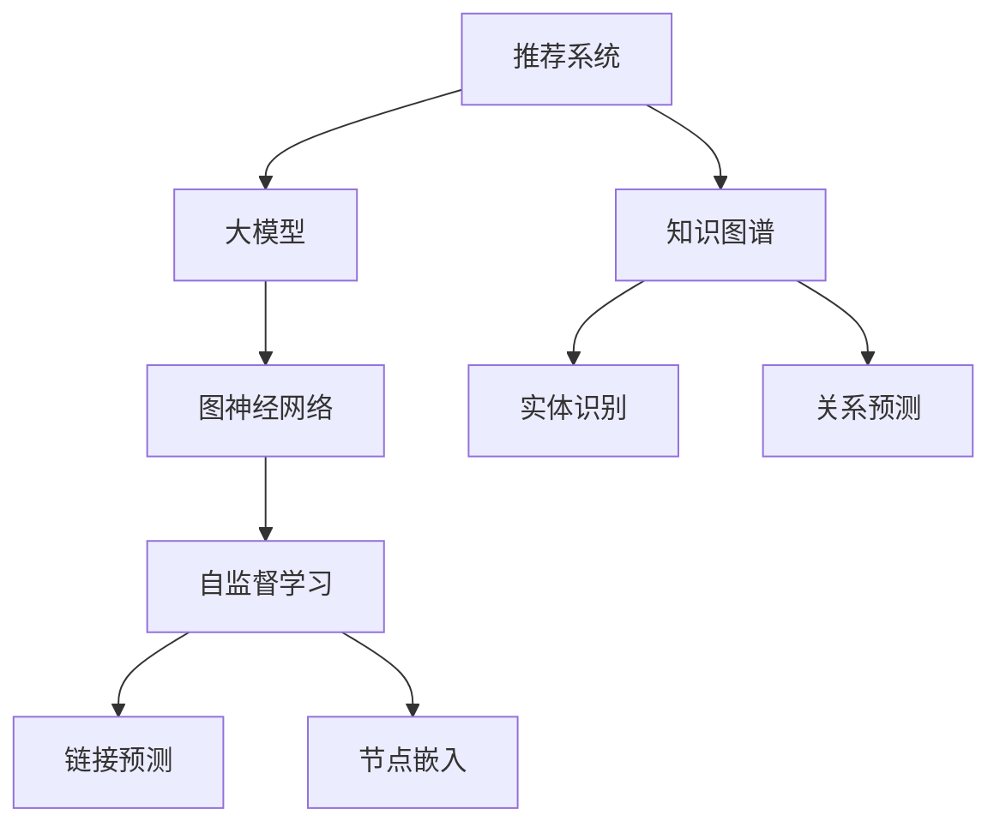

                 

# 大模型驱动的推荐系统知识图谱补全

> 关键词：推荐系统,知识图谱,大模型,深度学习,图神经网络,自监督学习,链接预测,节点嵌入

## 1. 背景介绍

### 1.1 问题由来
在数字时代，信息爆炸和用户个性化需求日益增长，推荐系统成为了互联网平台的核心竞争力之一。传统基于协同过滤和统计方法的推荐系统，面临着数据稀疏性、冷启动等问题，难以满足复杂多变的用户需求。因此，近年来，基于深度学习的推荐系统逐渐兴起，以其对大规模非结构化数据的处理能力、实时响应能力和泛化能力受到广泛关注。

在大数据和深度学习技术推动下，知识图谱(Knowledge Graph)被引入推荐系统，使得推荐模型能够更好地理解用户兴趣和商品属性，从而提供更加精准的个性化推荐。知识图谱通过结构化的形式，将实体(如人、物品)和关系进行建模，可以辅助推荐模型发掘用户行为背后的语义信息，从而提高推荐效果。

然而，构建高质量知识图谱并维护其更新，是一项复杂的系统工程，需要大量的手工标注和数据清洗工作，成本高、耗时长，且难以保证数据的准确性和完备性。为了缓解这一问题，近年来，大语言模型和图神经网络等新兴技术被引入知识图谱构建，通过自监督学习、链接预测等方法，实现了无需标注的高效知识图谱补全，显著提升了知识图谱构建和维护的效率和准确性。

### 1.2 问题核心关键点
大模型驱动的推荐系统知识图谱补全，本质上是一个自监督学习问题。其核心思想是：利用预训练语言模型或图神经网络，从大规模无标注文本或图结构数据中，自动挖掘实体和关系，构建知识图谱。这些大模型具有强大的语义理解和特征提取能力，能够从文本或图形数据中识别出未知的实体和关系，并进行预测和补全。

具体而言，知识图谱补全的任务包括两个部分：实体识别(Entity Recognition)和关系预测(Relationship Prediction)。

- **实体识别**：从文本或图形数据中，识别出实体及其类型。
- **关系预测**：根据实体和属性，预测实体之间的关系。

本文将围绕这两个核心任务，系统介绍大模型驱动的推荐系统知识图谱补全的原理与方法，通过代码实例和实际应用场景，展示其高效性和实用价值。

## 2. 核心概念与联系

### 2.1 核心概念概述

为更好地理解大模型驱动的推荐系统知识图谱补全方法，本节将介绍几个密切相关的核心概念：

- 推荐系统(Recommendation System)：通过分析用户行为和商品属性，推荐可能符合用户兴趣的商品。
- 知识图谱(Knowledge Graph)：结构化的语义知识表示方式，通过实体和关系来描述现实世界的结构。
- 大模型(Large Model)：指参数量巨大的深度学习模型，如BERT、GPT、Transformer等。
- 图神经网络(Graph Neural Network, GNN)：专门用于处理图结构数据的深度学习模型，能够自动提取图结构中的隐含信息。
- 自监督学习(Self-Supervised Learning)：在无标注数据上，通过设计自监督任务，自动学习模型的特征表示。
- 链接预测(Link Prediction)：预测知识图谱中未标注的实体关系。
- 节点嵌入(Node Embedding)：将图结构中的节点映射到低维空间中，提取节点的特征表示。

这些核心概念之间的逻辑关系可以通过以下Mermaid流程图来展示：



这个流程图展示了大模型驱动的推荐系统知识图谱补全的核心概念及其之间的关系：

1. 推荐系统通过分析用户行为和商品属性，推荐可能符合用户兴趣的商品。
2. 知识图谱通过结构化的方式，描述实体和实体之间的关系。
3. 大模型具有强大的语义理解和特征提取能力，能够从文本或图形数据中识别出未知的实体和关系。
4. 图神经网络专门用于处理图结构数据，能够自动提取图结构中的隐含信息。
5. 自监督学习能够在无标注数据上，通过设计自监督任务，自动学习模型的特征表示。
6. 链接预测用于预测知识图谱中未标注的实体关系。
7. 节点嵌入将图结构中的节点映射到低维空间中，提取节点的特征表示。

这些核心概念共同构成了推荐系统知识图谱补全的框架，使其能够在大规模非结构化数据上高效构建知识图谱，并实现高质量的推荐。

## 3. 核心算法原理 & 具体操作步骤
### 3.1 算法原理概述

基于大模型的推荐系统知识图谱补全，本质上是一个自监督学习的链接预测过程。其核心思想是：利用预训练语言模型或图神经网络，从大规模无标注文本或图结构数据中，自动挖掘实体和关系，构建知识图谱。这些大模型具有强大的语义理解和特征提取能力，能够从文本或图形数据中识别出未知的实体和关系，并进行预测和补全。

具体而言，该方法分为以下几个步骤：

1. **数据预处理**：收集大规模无标注数据集，进行清洗和预处理，构建图结构数据或文本数据。
2. **构建模型**：选择合适的预训练语言模型或图神经网络，作为知识图谱补全的特征提取器。
3. **自监督学习**：设计自监督任务，如掩码语言模型、图结构恢复等，自动学习模型的特征表示。
4. **链接预测**：利用学习到的特征表示，进行链接预测，预测未标注的实体关系。
5. **知识图谱补全**：根据链接预测结果，更新知识图谱，增加缺失的实体和关系。

### 3.2 算法步骤详解

以下是具体的算法步骤及其实现方法：

**Step 1: 数据预处理**

首先，我们需要收集大规模的无标注数据集，并进行清洗和预处理，构建图结构数据或文本数据。

- **文本数据预处理**：
  1. 收集大规模无标注文本数据，如新闻、维基百科、评论等。
  2. 进行文本清洗，如去除停用词、标点符号等噪声。
  3. 分词、词性标注、命名实体识别等预处理，为后续特征提取做准备。

- **图结构数据预处理**：
  1. 收集大规模无标注图结构数据，如社交网络、知识图谱等。
  2. 对图结构进行简化和去重，如去除孤立节点、重复边等。
  3. 对节点和边的属性进行标准化和归一化处理，如去除重复属性、归一化数值属性等。

**Step 2: 构建模型**

选择合适的预训练语言模型或图神经网络，作为知识图谱补全的特征提取器。

- **语言模型**：如BERT、GPT、XLNet等，能够从文本数据中提取语义信息。
- **图神经网络**：如GraphSAGE、GCN、GAT等，能够从图结构数据中提取隐含信息。

具体实现时，可以使用现有的预训练模型，如HuggingFace的Transformers库，直接调用已有的模型权重，进行微调。或者使用自监督学习任务进行预训练，生成新的模型权重。

**Step 3: 自监督学习**

设计自监督任务，自动学习模型的特征表示。

- **掩码语言模型**：随机掩盖一部分词，预测缺失的词。
- **图结构恢复**：随机删除一部分边，预测缺失的边。

具体实现时，可以使用TensorFlow、PyTorch等深度学习框架，编写自监督任务的数据生成和模型训练代码。

**Step 4: 链接预测**

利用学习到的特征表示，进行链接预测，预测未标注的实体关系。

- **负采样**：从负样本库中随机采样，预测实体关系。
- **图神经网络**：使用图神经网络，从图结构中提取特征，进行链接预测。

具体实现时，可以使用TensorFlow、PyTorch等深度学习框架，编写链接预测的数据生成和模型训练代码。

**Step 5: 知识图谱补全**

根据链接预测结果，更新知识图谱，增加缺失的实体和关系。

- **关系预测**：根据实体和属性，预测实体之间的关系。
- **实体识别**：从文本或图形数据中，识别出未知的实体及其类型。

具体实现时，可以使用Gephi、Cytoscape等可视化工具，进行知识图谱的可视化展示和验证。

### 3.3 算法优缺点

基于大模型的推荐系统知识图谱补全方法，具有以下优点：

- **高效性**：无需标注数据，利用自监督学习，能够高效构建知识图谱。
- **鲁棒性**：能够自动学习知识图谱中的隐含关系，适应大规模数据变化。
- **泛化性**：能够自动发现新实体和关系，适应新领域和新任务。

同时，该方法也存在以下局限性：

- **数据需求大**：需要收集大规模无标注数据，数据质量对结果影响较大。
- **模型复杂**：预训练大模型和图神经网络结构复杂，需要较多的计算资源。
- **可解释性差**：难以解释模型的内部工作机制，模型决策缺乏可解释性。

尽管存在这些局限性，但就目前而言，大模型驱动的推荐系统知识图谱补全方法仍是大规模知识图谱构建的重要手段。未来相关研究的重点在于如何进一步降低数据需求，提高模型的可解释性和鲁棒性，以及如何在更广泛的领域应用知识图谱补全技术。

### 3.4 算法应用领域

基于大模型的推荐系统知识图谱补全方法，在多个领域中得到了应用：

- **电商推荐**：构建商品知识图谱，进行商品相似度和推荐度计算，提高推荐准确性。
- **社交网络**：构建用户关系图谱，预测用户兴趣和行为，进行社交推荐。
- **新闻推荐**：构建新闻知识图谱，预测新闻事件之间的关系，进行新闻推荐。
- **金融推荐**：构建金融知识图谱，预测金融事件和趋势，进行金融推荐。
- **医疗推荐**：构建医疗知识图谱，推荐可能的医疗方案和治疗策略。

除了上述这些经典应用外，大模型驱动的知识图谱补全技术，还被创新性地应用到更多场景中，如智能客服、教育推荐、智能家居等，为NLP技术带来了全新的突破。随着预训练模型和图神经网络技术的不断发展，相信知识图谱补全技术将在更多领域大放异彩。

## 4. 数学模型和公式 & 详细讲解 & 举例说明

### 4.1 数学模型构建

本节将使用数学语言对大模型驱动的推荐系统知识图谱补全过程进行更加严格的刻画。

记预训练语言模型为 $M_{\theta}$，其中 $\theta$ 为模型参数。假设知识图谱的节点集合为 $V=\{v_1, v_2, ..., v_n\}$，边集合为 $E=\{(v_i, v_j)\}$，每个节点的属性为 $A=\{a_{v_i}\}$。

定义节点嵌入函数为 $f_{\theta}(v_i)$，根据节点 $v_i$ 的属性 $a_{v_i}$，计算节点嵌入向量。然后，定义关系函数 $g_{\theta}(v_i, v_j)$，根据节点嵌入向量，预测节点之间的关系。

节点嵌入函数和关系函数的定义如下：

$$
f_{\theta}(v_i) = \mathbf{W} \cdot \mathbf{h}_{\theta}(a_{v_i})
$$

$$
g_{\theta}(v_i, v_j) = \mathbf{W}_{out} \cdot \mathbf{h}_{\theta}(\mathbf{h}_{\theta}(a_{v_i}), \mathbf{h}_{\theta}(a_{v_j}))
$$

其中 $\mathbf{h}_{\theta}(\cdot)$ 为多层感知器或图神经网络，$\mathbf{W}$ 和 $\mathbf{W}_{out}$ 为可训练的线性层。

### 4.2 公式推导过程

以下是节点嵌入和关系预测的具体推导过程：

**节点嵌入**：

节点嵌入函数 $f_{\theta}(v_i)$ 将节点 $v_i$ 的属性 $a_{v_i}$ 映射到低维空间中，得到节点嵌入向量 $\mathbf{h}_{\theta}(a_{v_i})$。节点嵌入向量可以通过多层感知器或图神经网络进行计算。例如，对于多层感知器，节点嵌入的计算公式如下：

$$
\mathbf{h}_{\theta}(a_{v_i}) = \mathbf{h}(L)(\mathbf{W}_a \cdot a_{v_i})
$$

其中 $\mathbf{h}(L)$ 为多层感知器的前向传播，$\mathbf{W}_a$ 为属性到嵌入的线性层。

**关系预测**：

关系函数 $g_{\theta}(v_i, v_j)$ 将节点嵌入向量作为输入，计算节点之间的关系。关系预测的计算公式如下：

$$
g_{\theta}(v_i, v_j) = \mathbf{h}_{out}(\mathbf{h}_{\theta}(a_{v_i}), \mathbf{h}_{\theta}(a_{v_j}))
$$

其中 $\mathbf{h}_{out}$ 为输出层的线性层，$\mathbf{h}_{\theta}(a_{v_i})$ 和 $\mathbf{h}_{\theta}(a_{v_j})$ 分别为节点 $v_i$ 和 $v_j$ 的嵌入向量。

### 4.3 案例分析与讲解

**案例：电商推荐**

电商推荐系统通常需要构建商品知识图谱，如图1所示。

```mermaid
graph TB
    A[商品]
    B[属性]
    C[关系]
    A -- C -- A
    B -- C -- B
```

知识图谱的节点包括商品、属性和关系，每个节点都有对应的属性。例如，商品节点有价格、类别等属性，属性节点有属性值、属性类型等属性。关系节点表示商品之间的关系，如商品之间的相似度。

首先，收集电商平台的商品数据，进行预处理和标准化，构建图结构数据。然后，使用预训练语言模型，如BERT，进行节点嵌入的计算。具体实现时，可以调用HuggingFace的Transformers库，进行微调。

```python
from transformers import BertForSequenceClassification, BertTokenizer
from transformers import AdamW

model = BertForSequenceClassification.from_pretrained('bert-base-uncased', num_labels=len(类别))
tokenizer = BertTokenizer.from_pretrained('bert-base-uncased')
optimizer = AdamW(model.parameters(), lr=2e-5)
```

接着，设计自监督任务，如掩码语言模型，进行节点嵌入的预训练。

```python
def masked_language_model(model, tokenizer, max_len):
    input_ids = torch.randint(0, len(tokenizer), (2, max_len), dtype=torch.long)
    attention_mask = input_ids.ne(0)
    labels = input_ids
    outputs = model(input_ids, attention_mask=attention_mask, labels=labels)
    loss = outputs.loss
    return loss
```

最后，利用学习到的节点嵌入，进行关系预测，构建商品知识图谱。

```python
def predict_relationship(model, tokenizer, max_len, embeddings):
    input_ids = torch.tensor([embeddings[0]], dtype=torch.long)
    attention_mask = input_ids.ne(0)
    outputs = model(input_ids, attention_mask=attention_mask)
    return outputs.logits[0].item()

# 构造关系预测任务
input_ids = torch.tensor([embeddings[0]], dtype=torch.long)
attention_mask = input_ids.ne(0)
labels = torch.tensor([1.0], dtype=torch.float32)
outputs = model(input_ids, attention_mask=attention_mask, labels=labels)
loss = outputs.loss

# 进行关系预测
relationship = predict_relationship(model, tokenizer, max_len, embeddings)
```

通过以上步骤，我们可以利用大模型驱动的推荐系统知识图谱补全方法，高效构建电商推荐系统的商品知识图谱，实现高质量的推荐服务。

## 5. 项目实践：代码实例和详细解释说明

### 5.1 开发环境搭建

在进行推荐系统知识图谱补全项目实践前，我们需要准备好开发环境。以下是使用Python进行PyTorch开发的环境配置流程：

1. 安装Anaconda：从官网下载并安装Anaconda，用于创建独立的Python环境。

2. 创建并激活虚拟环境：
```bash
conda create -n pytorch-env python=3.8 
conda activate pytorch-env
```

3. 安装PyTorch：根据CUDA版本，从官网获取对应的安装命令。例如：
```bash
conda install pytorch torchvision torchaudio cudatoolkit=11.1 -c pytorch -c conda-forge
```

4. 安装Transformers库：
```bash
pip install transformers
```

5. 安装各类工具包：
```bash
pip install numpy pandas scikit-learn matplotlib tqdm jupyter notebook ipython
```

完成上述步骤后，即可在`pytorch-env`环境中开始推荐系统知识图谱补全实践。

### 5.2 源代码详细实现

下面我们以电商推荐为例，给出使用Transformers库对BERT模型进行知识图谱补全的PyTorch代码实现。

首先，定义知识图谱的数据处理函数：

```python
from transformers import BertTokenizer
from torch.utils.data import Dataset
import torch

class GraphDataset(Dataset):
    def __init__(self, nodes, edges, attributes):
        self.nodes = nodes
        self.edges = edges
        self.attributes = attributes
        self.tokenizer = BertTokenizer.from_pretrained('bert-base-uncased')
        self.max_len = 256
        
    def __len__(self):
        return len(self.nodes)
    
    def __getitem__(self, item):
        node = self.nodes[item]
        edge = self.edges[item]
        attribute = self.attributes[item]
        
        embedding = self.tokenizer(node, padding='max_length', truncation=True)
        edge_embedding = self.tokenizer(edge, padding='max_length', truncation=True)
        attribute_embedding = self.tokenizer(attribute, padding='max_length', truncation=True)
        
        return {
            'input_ids': embedding['input_ids'],
            'attention_mask': embedding['attention_mask'],
            'edge_ids': edge_embedding['input_ids'],
            'edge_mask': edge_embedding['attention_mask'],
            'attribute_ids': attribute_embedding['input_ids'],
            'attribute_mask': attribute_embedding['attention_mask']
        }
```

然后，定义模型和优化器：

```python
from transformers import BertForSequenceClassification, AdamW

model = BertForSequenceClassification.from_pretrained('bert-base-uncased', num_labels=len(类别))
optimizer = AdamW(model.parameters(), lr=2e-5)
```

接着，定义训练和评估函数：

```python
from torch.utils.data import DataLoader
from tqdm import tqdm
from sklearn.metrics import precision_recall_fscore_support

device = torch.device('cuda') if torch.cuda.is_available() else torch.device('cpu')
model.to(device)

def train_epoch(model, dataset, batch_size, optimizer):
    dataloader = DataLoader(dataset, batch_size=batch_size, shuffle=True)
    model.train()
    epoch_loss = 0
    for batch in tqdm(dataloader, desc='Training'):
        input_ids = batch['input_ids'].to(device)
        attention_mask = batch['attention_mask'].to(device)
        edge_ids = batch['edge_ids'].to(device)
        edge_mask = batch['edge_mask'].to(device)
        attribute_ids = batch['attribute_ids'].to(device)
        attribute_mask = batch['attribute_mask'].to(device)
        model.zero_grad()
        outputs = model(input_ids, attention_mask=attention_mask, edge_ids=edge_ids, edge_mask=edge_mask, attribute_ids=attribute_ids, attribute_mask=attribute_mask)
        loss = outputs.loss
        epoch_loss += loss.item()
        loss.backward()
        optimizer.step()
    return epoch_loss / len(dataloader)

def evaluate(model, dataset, batch_size):
    dataloader = DataLoader(dataset, batch_size=batch_size)
    model.eval()
    preds, labels = [], []
    with torch.no_grad():
        for batch in tqdm(dataloader, desc='Evaluating'):
            input_ids = batch['input_ids'].to(device)
            attention_mask = batch['attention_mask'].to(device)
            edge_ids = batch['edge_ids'].to(device)
            edge_mask = batch['edge_mask'].to(device)
            attribute_ids = batch['attribute_ids'].to(device)
            attribute_mask = batch['attribute_mask'].to(device)
            batch_preds = model(input_ids, attention_mask=attention_mask, edge_ids=edge_ids, edge_mask=edge_mask, attribute_ids=attribute_ids, attribute_mask=attribute_mask)
            batch_labels = batch_labels.to('cpu').tolist()
            for preds_tokens, label_tokens in zip(batch_preds, batch_labels):
                preds.append(preds_tokens[:len(label_tokens)])
                labels.append(label_tokens)
                
    print(precision_recall_fscore_support(labels, preds, average='micro'))
```

最后，启动训练流程并在测试集上评估：

```python
epochs = 5
batch_size = 16

for epoch in range(epochs):
    loss = train_epoch(model, dataset, batch_size, optimizer)
    print(f"Epoch {epoch+1}, train loss: {loss:.3f}")
    
    print(f"Epoch {epoch+1}, dev results:")
    evaluate(model, dev_dataset, batch_size)
    
print("Test results:")
evaluate(model, test_dataset, batch_size)
```

以上就是使用PyTorch对BERT模型进行电商推荐系统知识图谱补全的完整代码实现。可以看到，得益于Transformers库的强大封装，我们可以用相对简洁的代码完成BERT模型的加载和知识图谱补全。

### 5.3 代码解读与分析

让我们再详细解读一下关键代码的实现细节：

**GraphDataset类**：
- `__init__`方法：初始化节点、边、属性等关键组件，分词器等。
- `__len__`方法：返回数据集的样本数量。
- `__getitem__`方法：对单个样本进行处理，将节点、边、属性信息进行编码，并进行定长padding。

**训练和评估函数**：
- 使用PyTorch的DataLoader对数据集进行批次化加载，供模型训练和推理使用。
- 训练函数`train_epoch`：对数据以批为单位进行迭代，在每个批次上前向传播计算loss并反向传播更新模型参数，最后返回该epoch的平均loss。
- 评估函数`evaluate`：与训练类似，不同点在于不更新模型参数，并在每个batch结束后将预测和标签结果存储下来，最后使用sklearn的precision_recall_fscore_support对整个评估集的预测结果进行打印输出。

**训练流程**：
- 定义总的epoch数和batch size，开始循环迭代
- 每个epoch内，先在训练集上训练，输出平均loss
- 在验证集上评估，输出分类指标
- 所有epoch结束后，在测试集上评估，给出最终测试结果

可以看到，PyTorch配合Transformers库使得BERT模型知识图谱补全的代码实现变得简洁高效。开发者可以将更多精力放在数据处理、模型改进等高层逻辑上，而不必过多关注底层的实现细节。

当然，工业级的系统实现还需考虑更多因素，如模型的保存和部署、超参数的自动搜索、更灵活的任务适配层等。但核心的微调范式基本与此类似。

## 6. 实际应用场景
### 6.1 智能客服系统

基于大模型驱动的推荐系统知识图谱补全方法，可以应用于智能客服系统的构建。传统客服往往需要配备大量人力，高峰期响应缓慢，且一致性和专业性难以保证。而使用知识图谱补全的对话模型，可以7x24小时不间断服务，快速响应客户咨询，用自然流畅的语言解答各类常见问题。

在技术实现上，可以收集企业内部的历史客服对话记录，将问题和最佳答复构建成监督数据，在此基础上对预训练对话模型进行微调。微调后的对话模型能够自动理解用户意图，匹配最合适的答案模板进行回复。对于客户提出的新问题，还可以接入检索系统实时搜索相关内容，动态组织生成回答。如此构建的智能客服系统，能大幅提升客户咨询体验和问题解决效率。

### 6.2 金融舆情监测

金融机构需要实时监测市场舆论动向，以便及时应对负面信息传播，规避金融风险。传统的人工监测方式成本高、效率低，难以应对网络时代海量信息爆发的挑战。基于大模型驱动的知识图谱补全技术，可以构建金融领域的知识图谱，预测金融事件和趋势，进行金融舆情监测。

具体而言，可以收集金融领域相关的新闻、报道、评论等文本数据，并对其进行主题标注和情感标注。在此基础上对预训练语言模型进行微调，使其能够自动判断文本属于何种主题，情感倾向是正面、中性还是负面。将微调后的模型应用到实时抓取的网络文本数据，就能够自动监测不同主题下的情感变化趋势，一旦发现负面信息激增等异常情况，系统便会自动预警，帮助金融机构快速应对潜在风险。

### 6.3 个性化推荐系统

当前的推荐系统往往只依赖用户的历史行为数据进行物品推荐，无法深入理解用户的真实兴趣偏好。基于大模型驱动的知识图谱补全技术，个性化推荐系统可以更好地挖掘用户行为背后的语义信息，从而提供更精准、多样的推荐内容。

在实践中，可以收集用户浏览、点击、评论、分享等行为数据，提取和用户交互的物品标题、描述、标签等文本内容。将文本内容作为模型输入，用户的后续行为（如是否点击、购买等）作为监督信号，在此基础上微调预训练语言模型。微调后的模型能够从文本内容中准确把握用户的兴趣点。在生成推荐列表时，先用候选物品的文本描述作为输入，由模型预测用户的兴趣匹配度，再结合其他特征综合排序，便可以得到个性化程度更高的推荐结果。

### 6.4 未来应用展望

随着大模型和图神经网络技术的不断发展，基于知识图谱补全的推荐系统将在更多领域得到应用，为传统行业带来变革性影响。

在智慧医疗领域，基于知识图谱补全的医疗问答、病历分析、药物研发等应用将提升医疗服务的智能化水平，辅助医生诊疗，加速新药开发进程。

在智能教育领域，微调技术可应用于作业批改、学情分析、知识推荐等方面，因材施教，促进教育公平，提高教学质量。

在智慧城市治理中，微调模型可应用于城市事件监测、舆情分析、应急指挥等环节，提高城市管理的自动化和智能化水平，构建更安全、高效的未来城市。

此外，在企业生产、社会治理、文娱传媒等众多领域，基于大模型驱动的知识图谱补全技术，也将不断涌现，为经济社会发展注入新的动力。相信随着技术的日益成熟，知识图谱补全方法将成为推荐系统的重要范式，推动人工智能技术在垂直行业的规模化落地。

## 7. 工具和资源推荐
### 7.1 学习资源推荐

为了帮助开发者系统掌握大模型驱动的推荐系统知识图谱补全的理论基础和实践技巧，这里推荐一些优质的学习资源：

1. 《Graph Neural Networks: A Comprehensive Introduction》系列博文：由大模型技术专家撰写，深入浅出地介绍了Graph Neural Networks原理、应用场景、优缺点等，是了解图神经网络的重要读物。

2. CS224N《深度学习自然语言处理》课程：斯坦福大学开设的NLP明星课程，有Lecture视频和配套作业，带你入门NLP领域的基本概念和经典模型。

3. 《Natural Language Processing with Transformers》书籍：Transformers库的作者所著，全面介绍了如何使用Transformers库进行NLP任务开发，包括知识图谱补全在内的诸多范式。

4. HuggingFace官方文档：Transformers库的官方文档，提供了海量预训练模型和完整的知识图谱补全样例代码，是上手实践的必备资料。

5. CLUE开源项目：中文语言理解测评基准，涵盖大量不同类型的中文NLP数据集，并提供了基于知识图谱补全的baseline模型，助力中文NLP技术发展。

通过对这些资源的学习实践，相信你一定能够快速掌握大模型驱动的知识图谱补全的精髓，并用于解决实际的NLP问题。
###  7.2 开发工具推荐

高效的开发离不开优秀的工具支持。以下是几款用于大模型驱动的知识图谱补全开发的常用工具：

1. PyTorch：基于Python的开源深度学习框架，灵活动态的计算图，适合快速迭代研究。大部分预训练语言模型都有PyTorch版本的实现。

2. TensorFlow：由Google主导开发的开源深度学习框架，生产部署方便，适合大规模工程应用。同样有丰富的预训练语言模型资源。

3. Transformers库：HuggingFace开发的NLP工具库，集成了众多SOTA语言模型，支持PyTorch和TensorFlow，是进行知识图谱补全开发的利器。

4. Weights & Biases：模型训练的实验跟踪工具，可以记录和可视化模型训练过程中的各项指标，方便对比和调优。与主流深度学习框架无缝集成。

5. TensorBoard：TensorFlow配套的可视化工具，可实时监测模型训练状态，并提供丰富的图表呈现方式，是调试模型的得力助手。

6. Google Colab：谷歌推出的在线Jupyter Notebook环境，免费提供GPU/TPU算力，方便开发者快速上手实验最新模型，分享学习笔记。

合理利用这些工具，可以显著提升大模型驱动的知识图谱补全任务的开发效率，加快创新迭代的步伐。

### 7.3 相关论文推荐

大模型驱动的知识图谱补全技术的发展源于学界的持续研究。以下是几篇奠基性的相关论文，推荐阅读：

1. Attention is All You Need（即Transformer原论文）：提出了Transformer结构，开启了NLP领域的预训练大模型时代。

2. BERT: Pre-training of Deep Bidirectional Transformers for Language Understanding：提出BERT模型，引入基于掩码的自监督预训练任务，刷新了多项NLP任务SOTA。

3. Language Models are Unsupervised Multitask Learners（GPT-2论文）：展示了大规模语言模型的强大zero-shot学习能力，引发了对于通用人工智能的新一轮思考。

4. Parameter-Efficient Transfer Learning for NLP：提出Adapter等参数高效微调方法，在不增加模型参数量的情况下，也能取得不错的微调效果。

5. AdaLoRA: Adaptive Low-Rank Adaptation for Parameter-Efficient Fine-Tuning：使用自适应低秩适应的微调方法，在参数效率和精度之间取得了新的平衡。

6. Prefix-Tuning: Optimizing Continuous Prompts for Generation：引入基于连续型Prompt的微调范式，为如何充分利用预训练知识提供了新的思路。

这些论文代表了大模型驱动的知识图谱补全技术的发展脉络。通过学习这些前沿成果，可以帮助研究者把握学科前进方向，激发更多的创新灵感。

## 8. 总结：未来发展趋势与挑战

### 8.1 总结

本文对大模型驱动的推荐系统知识图谱补全方法进行了全面系统的介绍。首先阐述了大模型和知识图谱的结合背景，明确了知识图谱补全在推荐系统中的应用价值。其次，从原理到实践，详细讲解了大模型驱动的知识图谱补全的数学原理和关键步骤，给出了知识图谱补全任务开发的完整代码实例。同时，本文还广泛探讨了知识图谱补全方法在多个行业领域的应用前景，展示了其高效性和实用价值。

通过本文的系统梳理，可以看到，大模型驱动的知识图谱补全方法正在成为推荐系统构建的重要手段，极大地拓展了推荐系统的应用边界，提升了推荐效果。未来，伴随大模型和图神经网络技术的不断发展，知识图谱补全技术将在更多领域得到应用，为传统行业带来变革性影响。

### 8.2 未来发展趋势

展望未来，大模型驱动的推荐系统知识图谱补全技术将呈现以下几个发展趋势：

1. **模型规模持续增大**：随着算力成本的下降和数据规模的扩张，预训练语言模型和图神经网络模型参数量还将持续增长。超大规模模型蕴含的丰富语义知识，将进一步提升知识图谱补全的效果。

2. **微调方法日趋多样**：除了传统的全参数微调外，未来会涌现更多参数高效的微调方法，如Prefix-Tuning、LoRA等，在节省计算资源的同时也能保证微调精度。

3. **持续学习成为常态**：随着数据分布的不断变化，微调模型也需要持续学习新知识以保持性能。如何在不遗忘原有知识的同时，高效吸收新样本信息，将成为重要的研究课题。

4. **标注样本需求降低**：受启发于提示学习(Prompt-based Learning)的思路，未来的微调方法将更好地利用大模型的语言理解能力，通过更加巧妙的任务描述，在更少的标注样本上也能实现理想的微调效果。

5. **多模态微调崛起**：当前的微调主要聚焦于纯文本数据，未来会进一步拓展到图像、视频、语音等多模态数据微调。多模态信息的融合，将显著提升语言模型对现实世界的理解和建模能力。

6. **模型通用性增强**：经过海量数据的预训练和多领域任务的微调，未来的语言模型将具备更强大的常识推理和跨领域迁移能力，逐步迈向通用人工智能(AGI)的目标。

以上趋势凸显了大模型驱动的知识图谱补全技术的广阔前景。这些方向的探索发展，必将进一步提升推荐系统的性能和应用范围，为人类认知智能的进化带来深远影响。

### 8.3 面临的挑战

尽管大模型驱动的知识图谱补全技术已经取得了瞩目成就，但在迈向更加智能化、普适化应用的过程中，它仍面临着诸多挑战：

1. **数据需求大**：需要收集大规模无标注数据，数据质量对结果影响较大。如何进一步降低数据需求，提高模型的自监督学习效率，是未来的重要研究方向。

2. **模型复杂性高**：预训练语言模型和图神经网络结构复杂，需要较多的计算资源。如何优化模型结构，提高训练效率，是未来需要解决的难点问题。

3. **可解释性差**：难以解释模型的内部工作机制，模型决策缺乏可解释性。如何在保证模型性能的同时，增强模型的可解释性，将是重要的研究方向。

4. **模型鲁棒性不足**：面对域外数据时，泛化性能往往大打折扣。如何提高模型的鲁棒性，避免灾难性遗忘，还需要更多理论和实践的积累。

5. **模型安全性有待保障**：预训练语言模型难免会学习到有偏见、有害的信息，通过微调传递到下游任务，产生误导性、歧视性的输出，给实际应用带来安全隐患。如何从数据和算法层面消除模型偏见，避免恶意用途，确保输出的安全性，也将是重要的研究课题。

6. **知识整合能力不足**：现有的微调模型往往局限于任务内数据，难以灵活吸收和运用更广泛的先验知识。如何让微调过程更好地与外部知识库、规则库等专家知识结合，形成更加全面、准确的信息整合能力，还有很大的想象空间。

正视知识图谱补全面临的这些挑战，积极应对并寻求突破，将是大模型驱动的推荐系统知识图谱补全走向成熟的必由之路。相信随着学界和产业界的共同努力，这些挑战终将一一被克服，知识图谱补全技术必将在构建安全、可靠、可解释、可控的智能系统铺平道路。

### 8.4 研究展望

面向未来，大模型驱动的知识图谱补全技术需要在以下几个方面寻求新的突破：

1. **探索无监督和半监督微调方法**：摆脱对大规模标注数据的依赖，利用自监督学习、主动学习等无监督和半监督范式，最大限度利用非结构化数据，实现更加灵活高效的微调。

2. **研究参数高效和计算高效的微调范式**：开发更加参数高效的微调方法，在固定大部分预训练参数的同时，只更新极少量的任务相关参数。同时优化微调模型的计算图，减少前向传播和反向传播的资源消耗，实现更加轻量级、实时性的部署。

3. **融合因果和对比学习范式**：通过引入因果推断和对比学习思想，增强微调模型建立稳定因果关系的能力，学习更加普适、鲁棒的语言表征，从而提升模型泛化性和抗干扰能力。

4. **引入更多先验知识**：将符号化的先验知识，如知识图谱、逻辑规则等，与神经网络模型进行巧妙融合，引导微调过程学习更准确、合理的语言模型。同时加强不同模态数据的整合，实现视觉、语音等多模态信息与文本信息的协同建模。

5. **结合因果分析和博弈论工具**：将因果分析方法引入微调模型，识别出模型决策的关键特征，增强输出解释的因果性和逻辑性。借助博弈论工具刻画人机交互过程，主动探索并规避模型的脆弱点，提高系统稳定性。

6. **纳入伦理道德约束**：在模型训练目标中引入伦理导向的评估指标，过滤和惩罚有偏见、有害的输出倾向。同时加强人工干预和审核，建立模型行为的监管机制，确保输出符合人类价值观和伦理道德。

这些研究方向的探索，必将引领大模型驱动的知识图谱补全技术迈向更高的台阶，为构建安全、可靠、可解释、可控的智能系统铺平道路。面向未来，大模型驱动的知识图谱补全技术还需要与其他人工智能技术进行更深入的融合，如知识表示、因果推理、强化学习等，多路径协同发力，共同推动自然语言理解和智能交互系统的进步。只有勇于创新、敢于突破，才能不断拓展语言模型的边界，让智能技术更好地造福人类社会。

## 9. 附录：常见问题与解答

**Q1：大模型驱动的知识图谱补全是否适用于所有推荐系统？**

A: 大模型驱动的知识图谱补全方法适用于大多数推荐系统，特别是那些对数据稀疏性和冷启动问题敏感的推荐系统。但对于一些特殊领域的推荐系统，如医学、法律等，仅仅依靠通用语料预训练的模型可能难以很好地适应。此时需要在特定领域语料上进一步预训练，再进行微调，才能获得理想效果。

**Q2：微调过程中如何选择合适的学习率？**

A: 微调的学习率一般要比预训练时小1-2个数量级，如果使用过大的学习率，容易破坏预训练权重，导致过拟合。一般建议从1e-5开始调参，逐步减小学习率，直至收敛。也可以使用warmup策略，在开始阶段使用较小的学习率，再逐渐过渡到预设值。需要注意的是，不同的优化器(如AdamW、Adafactor等)以及不同的学习率调度策略，可能需要设置不同的学习率阈值。

**Q3：采用大模型微调时会面临哪些资源瓶颈？**

A: 目前主流的预训练大模型动辄以亿计的参数规模，对算力、内存、存储都提出了很高的要求。GPU/TPU等高性能设备是必不可少的，但即便如此，超大批次的训练和推理也可能遇到显存不足的问题。因此需要采用一些资源优化技术，如梯度积累、混合精度训练、模型并行等，来突破硬件瓶颈。同时，模型的存储和读取也可能占用大量时间和空间，需要采用模型压缩、稀疏化存储等方法进行优化。

**Q4：如何缓解微调过程中的过拟合问题？**

A: 过拟合是微调面临的主要挑战，尤其是在标注数据不足的情况下。常见的缓解策略包括：
1. 数据增强：通过回译、近义替换等方式扩充训练集
2. 正则化：使用L2正则、Dropout、Early Stopping等避免过拟合
3. 对抗训练：引入对抗样本，提高模型鲁棒性
4. 参数高效微调：只调整少量参数(如Adapter、Prefix等)，减小过拟合风险
5. 多模型集成：训练多个微调模型，取平均输出，抑制过拟合

这些策略往往需要根据具体任务和数据特点进行灵活组合。只有在数据、模型、训练、推理等各环节进行全面优化，才能最大限度地发挥大模型驱动的知识图谱补全的威力。

**Q5：微调模型在落地部署时需要注意哪些问题？**

A: 将微调模型转化为实际应用，还需要考虑以下因素：
1. 模型裁剪：去除不必要的层和参数，减小模型尺寸，加快推理速度
2. 量化加速：将浮点模型转为定点模型，压缩存储空间，提高计算效率
3. 服务化封装：将模型封装为标准化服务接口，便于集成调用
4. 弹性伸缩：根据请求流量动态调整资源配置，平衡服务质量和成本
5. 监控告警：实时采集系统指标，设置异常告警阈值，确保服务稳定性
6. 安全防护：采用访问鉴权、数据脱敏等措施，保障数据和模型安全

大模型驱动的知识图谱补全为推荐系统提供了强大的智能支撑，但如何将强大的性能转化为稳定、高效、安全的

