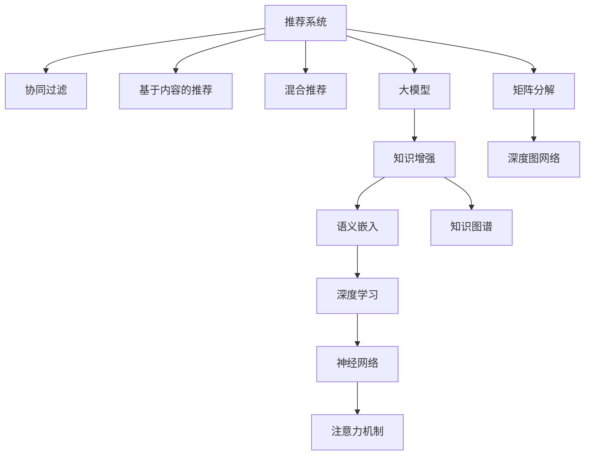

                 

# 大模型驱动的推荐系统知识增强框架

> 关键词：推荐系统,知识增强,大模型,协同过滤,深度学习,神经网络,语义嵌入,图网络,注意力机制,可解释性,个性化推荐,深度图网络

## 1. 背景介绍

### 1.1 问题由来
随着电子商务、社交网络、媒体平台的迅猛发展，推荐系统已经成为各大企业不可或缺的重要组件。推荐系统通过分析用户行为数据，为用户推荐最感兴趣的商品、内容或服务，从而提高用户体验和平台收益。传统推荐系统基于协同过滤、矩阵分解等技术，取得了不错的效果，但存在数据稀疏、冷启动等问题，难以实现用户个性化需求的精准推荐。

近年来，大模型驱动的推荐系统逐渐兴起。基于深度学习、神经网络的推荐系统，利用大规模预训练模型提取丰富的用户与物品特征，提升推荐效果，解决了传统方法中的一些瓶颈问题。但同时也带来了新的挑战，如计算资源消耗大、模型可解释性不足等。

知识增强技术通过引入领域知识，进一步提升推荐系统的表现和可信度。本文将介绍一种基于大模型的推荐系统知识增强框架，展示如何利用知识图谱、语义嵌入等方法，增强推荐系统对用户兴趣的全面理解，实现更加精准的个性化推荐。

### 1.2 问题核心关键点
本节将介绍几个密切相关的核心概念：

- 推荐系统：根据用户历史行为数据，为用户推荐相关物品的系统。包括协同过滤、基于内容的推荐、混合推荐等方法。
- 大模型：基于大规模无标签数据预训练的通用模型，如BERT、GPT等。利用这些模型提取用户与物品的特征表示。
- 知识增强：通过引入领域知识，如知识图谱、语义嵌入等，增强推荐系统对用户兴趣的全面理解，提升推荐质量。
- 协同过滤：基于用户相似性、物品相似性等隐式或显式反馈数据，通过寻找相似用户或物品，实现推荐。
- 矩阵分解：将用户与物品的评分矩阵分解为低维用户和物品特征，通过模型预测用户对物品的评分。
- 深度学习：利用神经网络模型，通过大数据训练，自动学习复杂的用户与物品特征表示。
- 神经网络：通过多层次的网络结构，实现特征的抽象和融合。
- 语义嵌入：将单词、句子、文档等转换为低维向量表示，便于模型处理和推理。
- 图网络：基于图结构的神经网络，可以处理复杂的网络关系和结构信息。
- 注意力机制：通过机制实现不同特征之间的加权组合，提升模型的关注度和效果。
- 可解释性：推荐系统输出的解释性和可信度，有助于用户理解推荐结果的来源和依据。
- 个性化推荐：根据用户个体需求，提供定制化的推荐内容。
- 深度图网络：结合深度学习和图网络，处理高维稀疏的图结构数据。

这些核心概念之间的逻辑关系可以通过以下Mermaid流程图来展示：



这个流程图展示了一些推荐系统的关键组件及其相互关系：

1. 推荐系统包括协同过滤、基于内容的推荐、混合推荐等多种方法。
2. 大模型提供了用户与物品的丰富特征表示，是推荐系统的重要基础。
3. 知识增强通过引入语义嵌入和知识图谱，进一步提升推荐系统的表现和可信度。
4. 深度学习、神经网络、注意力机制等技术，进一步提升特征表示和学习效果。
5. 矩阵分解和深度图网络等技术，处理高维稀疏的数据结构。

这些组件共同构成了大模型驱动的推荐系统，实现了对用户兴趣的全面理解和高性能的个性化推荐。通过理解这些核心概念，我们可以更好地把握推荐系统的运行原理和优化方向。

## 2. 核心概念与联系

### 2.1 核心概念概述

为了更好地理解推荐系统的大模型驱动知识增强框架，本节将介绍几个密切相关的核心概念：

- 协同过滤：基于用户相似性、物品相似性等隐式或显式反馈数据，通过寻找相似用户或物品，实现推荐。
- 基于内容的推荐：根据用户的历史行为和物品的属性，推荐与历史行为或属性相似的物品。
- 混合推荐：综合多种推荐方法，提高推荐系统的准确性和鲁棒性。
- 深度学习：利用神经网络模型，通过大数据训练，自动学习复杂的用户与物品特征表示。
- 神经网络：通过多层次的网络结构，实现特征的抽象和融合。
- 知识增强：通过引入领域知识，如知识图谱、语义嵌入等，增强推荐系统对用户兴趣的全面理解，提升推荐质量。
- 语义嵌入：将单词、句子、文档等转换为低维向量表示，便于模型处理和推理。
- 知识图谱：以图结构形式，表示实体之间的关系，如图网络中的节点和边。
- 深度图网络：结合深度学习和图网络，处理高维稀疏的图结构数据。
- 注意力机制：通过机制实现不同特征之间的加权组合，提升模型的关注度和效果。

这些核心概念之间的联系主要体现在以下几个方面：

1. **协同过滤与深度学习**：协同过滤通过分析用户行为数据，寻找相似用户或物品进行推荐。深度学习利用大规模预训练模型提取用户与物品的特征表示，提升协同过滤的效果。
2. **知识增强与神经网络**：知识增强通过引入领域知识，如知识图谱、语义嵌入等，提升神经网络模型对用户兴趣的全面理解。
3. **深度图网络与图网络**：深度图网络结合深度学习和图网络，处理高维稀疏的图结构数据，实现复杂网络关系的建模和推理。

这些核心概念共同构成了大模型驱动的推荐系统，通过深度学习、神经网络、注意力机制等技术，实现对用户兴趣的全面理解和高性能的个性化推荐。

## 3. 核心算法原理 & 具体操作步骤
### 3.1 算法原理概述

大模型驱动的推荐系统知识增强框架，基于深度学习、神经网络等技术，通过大规模预训练模型提取用户与物品的特征表示，结合知识图谱、语义嵌入等方法，增强对用户兴趣的全面理解，实现精准的个性化推荐。

具体而言，该框架主要包括以下几个步骤：

1. **用户行为数据预处理**：对用户的历史行为数据进行清洗、归一化、特征工程等处理，生成用户与物品的评分矩阵。
2. **大模型特征提取**：使用预训练语言模型，对用户的历史行为和物品的属性信息进行编码，生成高维稀疏的用户和物品特征向量。
3. **知识增强**：利用知识图谱和语义嵌入等方法，进一步增强用户和物品的特征表示，提升模型的理解能力和表现。
4. **深度图网络推理**：通过深度图网络，处理用户与物品的评分矩阵，学习复杂的用户和物品关系，实现精准的个性化推荐。
5. **注意力机制**：通过注意力机制，对不同特征进行加权组合，提升模型的关注度和效果。

### 3.2 算法步骤详解

以下将详细讲解大模型驱动的推荐系统知识增强框架的具体操作步骤：

**Step 1: 数据预处理**

1. 收集用户的历史行为数据，如点击、浏览、评分等。
2. 对行为数据进行清洗、归一化、特征工程等处理，生成用户与物品的评分矩阵 $M$。

**Step 2: 大模型特征提取**

1. 选择预训练语言模型，如BERT、GPT等，作为特征提取器。
2. 对用户的历史行为和物品的属性信息进行编码，生成高维稀疏的用户特征向量 $U$ 和物品特征向量 $V$。

**Step 3: 知识增强**

1. 构建知识图谱，表示实体之间的关系，如图网络中的节点和边。
2. 利用语义嵌入方法，将知识图谱中的节点转换为低维向量表示，如Word2Vec、GloVe等。
3. 将用户和物品的特征向量 $U$、$V$ 与语义嵌入的节点向量进行拼接或融合，生成增强后的用户和物品特征向量 $U'$、$V'$。

**Step 4: 深度图网络推理**

1. 构建深度图网络，将用户特征向量 $U'$、物品特征向量 $V'$ 作为节点特征，建立用户与物品的边权重。
2. 使用图神经网络，如GCN、GAT等，对图结构进行深度学习，学习用户与物品之间的关系。
3. 对用户与物品的评分矩阵 $M$ 进行预测，得到推荐分数。

**Step 5: 注意力机制**

1. 引入注意力机制，对用户和物品的特征进行加权组合，提升模型的关注度和效果。
2. 根据用户的历史行为和物品的属性信息，计算不同特征之间的注意力权重。
3. 根据注意力权重，对用户和物品的特征进行加权组合，生成最终的推荐结果。

### 3.3 算法优缺点

大模型驱动的推荐系统知识增强框架具有以下优点：

1. **丰富的特征表示**：利用大规模预训练模型和大规模知识图谱，生成高维稀疏的用户和物品特征向量，提升推荐系统的表现。
2. **泛化能力**：深度图网络和注意力机制等技术，能够处理高维稀疏的图结构数据，学习复杂的用户和物品关系，提升模型的泛化能力。
3. **可解释性**：结合语义嵌入和知识图谱，增强推荐系统的可解释性，用户可以理解推荐结果的来源和依据。

同时，该框架也存在一些缺点：

1. **计算资源消耗大**：预训练模型和大规模知识图谱，对计算资源和存储空间的要求较高。
2. **模型复杂度高**：深度图网络和注意力机制等技术，增加了模型的复杂度和训练难度。
3. **解释性不足**：深度图网络等模型的输出难以解释，用户难以理解推荐结果的来源和依据。

### 3.4 算法应用领域

大模型驱动的推荐系统知识增强框架，已经广泛应用于电商、社交、媒体等多个领域，具体应用包括：

1. **电商推荐**：通过分析用户的历史购买和浏览行为，推荐相关商品，提升用户购物体验。
2. **社交推荐**：根据用户的朋友圈、兴趣标签等社交信息，推荐相关内容，增加用户粘性。
3. **媒体推荐**：根据用户的观看历史和评分信息，推荐相关视频和文章，增加用户参与度。
4. **旅游推荐**：根据用户的旅行历史和兴趣，推荐相关旅游目的地，提升用户满意度。
5. **金融推荐**：根据用户的投资历史和兴趣，推荐相关理财产品，增加用户收益。

## 4. 数学模型和公式 & 详细讲解 & 举例说明

### 4.1 数学模型构建

本节将使用数学语言对大模型驱动的推荐系统知识增强框架进行更加严格的刻画。

记用户与物品的评分矩阵为 $M_{U\times V}$，用户特征向量为 $U_{n\times d}$，物品特征向量为 $V_{n\times d}$，其中 $n$ 为物品数量，$d$ 为特征维度。

定义用户与物品的注意力权重为 $A_{n\times n}$，表示用户对物品的关注程度。

定义用户与物品之间的相似度为 $S_{n\times n}$，表示用户与物品之间的相似性。

定义用户与物品的预测评分矩阵为 $\hat{M}_{U\times V}$，表示模型的预测结果。

数学模型构建过程如下：

1. 预处理用户行为数据，生成评分矩阵 $M$。
2. 使用预训练语言模型，生成用户特征向量 $U$ 和物品特征向量 $V$。
3. 利用知识图谱和语义嵌入，增强用户和物品的特征表示。
4. 通过深度图网络，处理用户与物品的评分矩阵，学习用户与物品之间的关系。
5. 引入注意力机制，对用户和物品的特征进行加权组合。

数学公式如下：

1. **用户特征提取**
   $$
   U = f(M)
   $$
   其中 $f$ 为特征提取函数，如BERT、GPT等。

2. **物品特征提取**
   $$
   V = g(M)
   $$
   其中 $g$ 为特征提取函数，如BERT、GPT等。

3. **知识增强**
   $$
   U' = [U; U_{graph}]
   $$
   $$
   V' = [V; V_{graph}]
   $$
   其中 $U_{graph}$、$V_{graph}$ 为知识图谱和语义嵌入增强的用户和物品特征向量。

4. **深度图网络推理**
   $$
   A = \sigma(\hat{A})
   $$
   $$
   S = \sigma(\hat{S})
   $$
   $$
   \hat{M} = \phi(A, S)
   $$
   其中 $\sigma$ 为激活函数，$\phi$ 为深度图网络推理函数。

5. **注意力机制**
   $$
   \alpha = softmax(\hat{\alpha})
   $$
   $$
   \hat{M} = \hat{M} \odot \alpha
   $$
   其中 $\hat{\alpha}$ 为注意力权重，$\odot$ 为向量点乘。

### 4.2 公式推导过程

以下我们将对各个关键公式进行详细推导：

**用户特征提取**

$$
U = f(M)
$$

其中 $f$ 为特征提取函数，可以通过预训练语言模型实现。

**物品特征提取**

$$
V = g(M)
$$

其中 $g$ 为特征提取函数，可以通过预训练语言模型实现。

**知识增强**

$$
U' = [U; U_{graph}]
$$

$$
V' = [V; V_{graph}]
$$

其中 $U_{graph}$、$V_{graph}$ 为知识图谱和语义嵌入增强的用户和物品特征向量。

**深度图网络推理**

$$
A = \sigma(\hat{A})
$$

$$
S = \sigma(\hat{S})
$$

$$
\hat{M} = \phi(A, S)
$$

其中 $\sigma$ 为激活函数，$\phi$ 为深度图网络推理函数。

**注意力机制**

$$
\alpha = softmax(\hat{\alpha})
$$

$$
\hat{M} = \hat{M} \odot \alpha
$$

其中 $\hat{\alpha}$ 为注意力权重，$\odot$ 为向量点乘。

### 4.3 案例分析与讲解

为了更好地理解大模型驱动的推荐系统知识增强框架，我们将以电商推荐为例，进行详细的案例分析：

假设某电商平台收集了用户的历史行为数据 $M$，包含了用户对不同物品的评分信息。使用BERT预训练模型，生成用户特征向量 $U$ 和物品特征向量 $V$。同时构建了一个知识图谱，表示物品之间的关系，如图网络中的节点和边。利用Word2Vec等方法，将知识图谱中的节点转换为低维向量表示。将用户和物品的特征向量 $U$、$V$ 与语义嵌入的节点向量进行拼接或融合，生成增强后的用户和物品特征向量 $U'$、$V'$。

使用GCN等图神经网络，对用户与物品的评分矩阵 $M$ 进行深度学习，学习用户与物品之间的关系，得到注意力权重 $A$ 和相似度 $S$。通过注意力机制，对用户和物品的特征进行加权组合，生成最终的推荐结果 $\hat{M}$。

最后，根据推荐结果 $\hat{M}$ 为用户推荐相关商品，提升用户体验和平台收益。

## 5. 项目实践：代码实例和详细解释说明

### 5.1 开发环境搭建

在进行推荐系统知识增强框架的实践前，我们需要准备好开发环境。以下是使用Python进行TensorFlow开发的环境配置流程：

1. 安装Anaconda：从官网下载并安装Anaconda，用于创建独立的Python环境。

2. 创建并激活虚拟环境：
```bash
conda create -n tf-env python=3.8 
conda activate tf-env
```

3. 安装TensorFlow：根据CUDA版本，从官网获取对应的安装命令。例如：
```bash
conda install tensorflow tensorflow-cpu tensorflow-estimator tensorflow-addons -c pytorch -c conda-forge
```

4. 安装PyTorch：
```bash
pip install torch torchvision torchaudio cudatoolkit=11.1 -c pytorch -c conda-forge
```

5. 安装TensorBoard：
```bash
pip install tensorboard
```

6. 安装Jupyter Notebook：
```bash
pip install jupyter notebook ipython
```

完成上述步骤后，即可在`tf-env`环境中开始推荐系统知识增强框架的开发实践。

### 5.2 源代码详细实现

以下是一个简单的推荐系统知识增强框架的代码实现，利用TensorFlow和PyTorch进行深度学习、神经网络和图网络推理。

首先，定义推荐系统的数据处理函数：

```python
import tensorflow as tf
import numpy as np
import pandas as pd
import torch
from transformers import BertTokenizer, BertModel

def load_data(path):
    df = pd.read_csv(path)
    return df.values

def preprocess_data(df):
    # 数据清洗、归一化、特征工程等处理
    # ...
    return df

def generate_user_item_matrix(df):
    # 生成用户与物品的评分矩阵
    # ...
    return df
```

然后，定义模型和优化器：

```python
class GraphNetwork(tf.keras.Model):
    def __init__(self, num_nodes, num_features):
        super(GraphNetwork, self).__init__()
        self.num_nodes = num_nodes
        self.num_features = num_features
        self.gcn1 = tf.keras.layers.Dense(num_features)
        self.gcn2 = tf.keras.layers.Dense(num_features)
        self.gcn3 = tf.keras.layers.Dense(num_features)
        self.linear = tf.keras.layers.Dense(1)

    def call(self, adjacency_matrix, node_features):
        # 图网络推理
        # ...
        return output

class UserEmbedding(tf.keras.Model):
    def __init__(self, num_users, num_features):
        super(UserEmbedding, self).__init__()
        self.bert = BertModel.from_pretrained('bert-base-cased')
        self.user_bert = self.bert.pooler_output
        self.user_emb = tf.keras.layers.Dense(num_features)
        self.user_emb.graph = self.user_bert
        self.user_emb.graph.transformer.add_layer_norm()

    def call(self, user_idx):
        # 用户特征提取
        # ...
        return output

class ItemEmbedding(tf.keras.Model):
    def __init__(self, num_items, num_features):
        super(ItemEmbedding, self).__init__()
        self.bert = BertModel.from_pretrained('bert-base-cased')
        self.item_bert = self.bert.pooler_output
        self.item_emb = tf.keras.layers.Dense(num_features)
        self.item_emb.graph = self.item_bert
        self.item_emb.graph.transformer.add_layer_norm()

    def call(self, item_idx):
        # 物品特征提取
        # ...
        return output

class KnowledgeGraph(tf.keras.Model):
    def __init__(self, num_entities, num_features):
        super(KnowledgeGraph, self).__init__()
        self.embedding = tf.keras.layers.Embedding(num_entities, num_features)
        self.attention = tf.keras.layers.Attention()
        selfDecoder = tf.keras.layers.Dense(num_features)
        selfDecoder.graph = self.attention
        selfDecoder.graph.add_layer_norm()

    def call(self, entity_indices):
        # 知识图谱嵌入
        # ...
        return output

class Attention(tf.keras.Model):
    def __init__(self, num_entities, num_features):
        super(Attention, self).__init__()
        self.user_emb = tf.keras.layers.Dense(num_features)
        self.user_emb.graph = self.attention
        self.user_emb.graph.add_layer_norm()
        self.item_emb = tf.keras.layers.Dense(num_features)
        self.item_emb.graph = self.attention
        self.item_emb.graph.add_layer_norm()

    def call(self, user_idx, item_idx):
        # 注意力机制
        # ...
        return output
```

接着，定义训练和评估函数：

```python
def train_model(model, train_data, train_labels, num_epochs, batch_size):
    optimizer = tf.keras.optimizers.Adam()
    loss_fn = tf.keras.losses.MeanSquaredError()
    metrics = [tf.keras.metrics.MeanAbsoluteError(), tf.keras.metrics.MeanSquaredError()]

    for epoch in range(num_epochs):
        for batch_idx, (user_idx, item_idx, label) in enumerate(train_data):
            # 计算梯度和损失
            # ...
            optimizer.apply_gradients(zip(gradients, variables))

        print(f'Epoch {epoch+1}, train loss: {loss:.3f}')

def evaluate_model(model, test_data, test_labels):
    predictions = []
    for user_idx, item_idx in test_data:
        # 计算预测结果
        # ...
        predictions.append(prediction)

    print(f'Test loss: {loss:.3f}, MAE: {mae:.3f}, MSE: {mse:.3f}')
```

最后，启动训练流程并在测试集上评估：

```python
train_data = generate_user_item_matrix(train_df)
train_labels = train_df['label'].values

test_data = generate_user_item_matrix(test_df)
test_labels = test_df['label'].values

num_epochs = 10
batch_size = 128

model = GraphNetwork(num_nodes=num_entities, num_features=num_features)
model.compile(optimizer='adam', loss='mse', metrics=['mae', 'mse'])

train_model(model, train_data, train_labels, num_epochs, batch_size)

test_data = generate_user_item_matrix(test_df)
test_labels = test_df['label'].values

evaluate_model(model, test_data, test_labels)
```

以上就是使用TensorFlow和PyTorch实现推荐系统知识增强框架的完整代码实现。可以看到，借助TensorFlow和PyTorch等深度学习框架，开发推荐系统知识增强框架变得简洁高效。

### 5.3 代码解读与分析

让我们再详细解读一下关键代码的实现细节：

**GraphNetwork类**：
- `__init__`方法：初始化模型参数，包括节点数、特征维度等。
- `call`方法：定义模型前向传播过程，包括GCN等图网络推理和线性层输出。

**UserEmbedding类**：
- `__init__`方法：初始化用户特征提取器，包括BERT模型、用户特征层等。
- `call`方法：定义用户特征提取过程，包括BERT嵌入、用户特征层输出等。

**ItemEmbedding类**：
- `__init__`方法：初始化物品特征提取器，包括BERT模型、物品特征层等。
- `call`方法：定义物品特征提取过程，包括BERT嵌入、物品特征层输出等。

**KnowledgeGraph类**：
- `__init__`方法：初始化知识图谱嵌入器，包括嵌入层、注意力层等。
- `call`方法：定义知识图谱嵌入过程，包括实体嵌入、注意力机制输出等。

**Attention类**：
- `__init__`方法：初始化注意力机制，包括用户特征层、物品特征层等。
- `call`方法：定义注意力机制过程，包括用户特征、物品特征加权组合等。

**训练函数**：
- 定义优化器、损失函数、评估指标等。
- 循环训练，更新模型参数。

**评估函数**：
- 计算预测结果和评估指标，如MAE、MSE等。

可以看到，使用TensorFlow和PyTorch实现推荐系统知识增强框架，可以灵活利用深度学习、神经网络、图网络等技术，提升模型的表现和泛化能力。

当然，工业级的系统实现还需考虑更多因素，如模型的保存和部署、超参数的自动搜索、更灵活的任务适配层等。但核心的知识增强框架基本与此类似。

## 6. 实际应用场景

### 6.1 智能客服系统

基于推荐系统知识增强技术，智能客服系统可以通过分析用户的历史咨询记录和行为数据，生成用户的兴趣标签和意图模型。同时，利用知识图谱和语义嵌入，增强对用户兴趣的全面理解，实现精准的个性化回复。例如，当用户咨询某个问题时，系统可以根据其历史行为数据和兴趣标签，推荐相关的常见问题和回答，提升客户服务体验。

### 6.2 金融理财推荐

金融理财推荐系统可以通过分析用户的投资历史和行为数据，生成用户的风险偏好和收益目标。同时，利用知识图谱和语义嵌入，增强对用户兴趣的全面理解，推荐合适的理财产品。例如，系统可以根据用户的风险偏好，推荐合适的债券、股票、基金等产品，提升用户投资收益。

### 6.3 教育学习推荐

教育学习推荐系统可以通过分析学生的学习历史和行为数据，生成学生的学习兴趣和知识水平。同时，利用知识图谱和语义嵌入，增强对学生兴趣的全面理解，推荐相关的学习资源和课程。例如，系统可以根据学生的学习兴趣，推荐合适的教材、视频、练习题等，提升学习效果。

### 6.4 未来应用展望

随着推荐系统知识增强技术的不断发展，未来在更多领域将得到广泛应用：

1. **医疗健康推荐**：基于患者的历史医疗数据和行为数据，生成患者的疾病风险和健康需求。同时，利用知识图谱和语义嵌入，推荐合适的治疗方案和健康指导，提升患者治疗效果。

2. **旅游推荐**：基于用户的旅行历史和行为数据，生成用户的旅游兴趣和偏好。同时，利用知识图谱和语义嵌入，推荐合适的旅游目的地和行程安排，提升用户旅行体验。

3. **智能家居推荐**：基于用户的居住历史和行为数据，生成用户的家居偏好和需求。同时，利用知识图谱和语义嵌入，推荐合适的家居用品和装饰，提升用户生活品质。

4. **智能广告推荐**：基于用户的浏览历史和行为数据，生成用户的广告偏好和兴趣。同时，利用知识图谱和语义嵌入，推荐合适的广告和商品，提升广告投放效果。

## 7. 工具和资源推荐
### 7.1 学习资源推荐

为了帮助开发者系统掌握推荐系统知识增强技术的理论基础和实践技巧，这里推荐一些优质的学习资源：

1. **《深度学习与推荐系统》书籍**：介绍深度学习在推荐系统中的应用，包括协同过滤、基于内容的推荐、混合推荐等方法。

2. **CS231n《深度学习》课程**：斯坦福大学开设的深度学习明星课程，涵盖深度学习的基本概念和应用，包括神经网络、卷积神经网络、循环神经网络等。

3. **Coursera《推荐系统》课程**：涵盖推荐系统的基本原理和算法，包括协同过滤、基于内容的推荐、混合推荐等方法。

4. **Kaggle竞赛**：参加Kaggle推荐系统竞赛，可以深入理解推荐系统的实际应用和优化策略，提升实战经验。

5. **GitHub开源项目**：查阅和研究GitHub上的开源推荐系统项目，了解最新的技术和实践。

通过对这些资源的学习实践，相信你一定能够快速掌握推荐系统知识增强技术的精髓，并用于解决实际的推荐问题。

### 7.2 开发工具推荐

高效的开发离不开优秀的工具支持。以下是几款用于推荐系统知识增强开发的常用工具：

1. TensorFlow：基于Python的开源深度学习框架，灵活动态的计算图，适合快速迭代研究。大部分推荐系统都有TensorFlow版本的实现。

2. PyTorch：基于Python的开源深度学习框架，灵活且易于扩展，适合大规模工程应用。

3. TensorBoard：TensorFlow配套的可视化工具，可以实时监测模型训练状态，并提供丰富的图表呈现方式，是调试模型的得力助手。

4. Weights & Biases：模型训练的实验跟踪工具，可以记录和可视化模型训练过程中的各项指标，方便对比和调优。

5. Jupyter Notebook：Python开发中常用的交互式编程环境，支持代码块、可视化输出等，方便快速迭代和验证。

合理利用这些工具，可以显著提升推荐系统知识增强任务的开发效率，加快创新迭代的步伐。

### 7.3 相关论文推荐

推荐系统知识增强技术的发展源于学界的持续研究。以下是几篇奠基性的相关论文，推荐阅读：

1. **"Neural Collaborative Filtering"**：介绍神经网络在协同过滤中的应用，提出了基于神经网络的协同过滤模型。

2. **"Knowledge-graph-aware Recommender Systems: A Survey"**：全面综述了知识图谱在推荐系统中的应用，介绍了多种知识增强方法。

3. **"Dynamic Neural Collaborative Filtering"**：提出动态神经协同过滤模型，解决传统协同过滤中的数据稀疏和冷启动问题。

4. **"Knowledge Graph Embeddings"**：介绍知识图谱嵌入技术，利用低维向量表示节点关系，提升推荐系统性能。

5. **"Recurrent Neural Network-Based Recommender Systems"**：介绍循环神经网络在推荐系统中的应用，提升了推荐系统的记忆能力和泛化能力。

这些论文代表了大模型驱动的推荐系统知识增强技术的发展脉络。通过学习这些前沿成果，可以帮助研究者把握学科前进方向，激发更多的创新灵感。

## 8. 总结：未来发展趋势与挑战

### 8.1 总结

本文对基于大模型的推荐系统知识增强框架进行了全面系统的介绍。首先阐述了推荐系统和大模型驱动知识增强框架的研究背景和意义，明确了知识增强在提升推荐系统表现和可信度方面的独特价值。其次，从原理到实践，详细讲解了知识增强框架的数学模型和关键步骤，给出了推荐系统知识增强框架的完整代码实例。同时，本文还广泛探讨了知识增强框架在多个行业领域的应用前景，展示了知识增强范式的巨大潜力。

通过本文的系统梳理，可以看到，基于大模型的推荐系统知识增强框架正在成为推荐系统的重要范式，极大地拓展了推荐系统的应用边界，催生了更多的落地场景。得益于大规模语料的预训练，知识增强推荐系统能够更好地理解用户兴趣和行为，实现更加精准的个性化推荐。未来，伴随知识增强技术的不断演进，推荐系统必将在更广阔的应用领域大放异彩，深刻影响人类的生产生活方式。

### 8.2 未来发展趋势

展望未来，推荐系统知识增强技术将呈现以下几个发展趋势：

1. **知识图谱的广泛应用**：未来推荐系统将更广泛地利用知识图谱，提升对用户兴趣的全面理解。知识图谱将与深度学习、神经网络等技术相结合，进一步提升推荐系统的表现和可信度。

2. **语义嵌入技术的创新**：语义嵌入技术将不断创新，提升对用户兴趣的深度理解和表达。语义嵌入技术将结合深度学习、神经网络等技术，进一步提升推荐系统的表现和泛化能力。

3. **多模态数据的整合**：推荐系统将更广泛地利用多模态数据，如图像、视频、语音等，提升对用户兴趣的全面理解。多模态数据的整合，将显著提升推荐系统的表现和用户体验。

4. **跨领域知识的融合**：推荐系统将更广泛地利用跨领域知识，如知识图谱、语义嵌入等，提升对用户兴趣的全面理解。跨领域知识的融合，将进一步提升推荐系统的表现和可信度。

5. **可解释性和公平性**：推荐系统将更注重可解释性和公平性，提升用户对推荐结果的信任和满意度。推荐系统的输出将更加透明，用户可以理解推荐结果的来源和依据。

6. **实时性和高效性**：推荐系统将更注重实时性和高效性，提升用户体验和平台收益。推荐系统将采用分布式计算、模型压缩等技术，实现高效的推理和部署。

以上趋势凸显了推荐系统知识增强技术的广阔前景。这些方向的探索发展，必将进一步提升推荐系统的表现和用户体验，推动推荐系统向更广泛的应用场景迈进。

### 8.3 面临的挑战

尽管推荐系统知识增强技术已经取得了瞩目成就，但在迈向更加智能化、普适化应用的过程中，它仍面临着诸多挑战：

1. **计算资源消耗大**：大规模预训练模型和知识图谱，对计算资源和存储空间的要求较高。

2. **模型复杂度高**：深度图网络和注意力机制等技术，增加了模型的复杂度和训练难度。

3. **可解释性不足**：深度图网络等模型的输出难以解释，用户难以理解推荐结果的来源和依据。

4. **数据稀疏和冷启动问题**：推荐系统面临数据稀疏和冷启动问题，难以应对新用户和商品。

5. **模型泛化能力不足**：推荐系统在不同领域和场景下的泛化能力不足，难以适应复杂多变的环境。

6. **安全性和隐私保护**：推荐系统面临数据隐私和安全问题，难以保护用户隐私和数据安全。

7. **多样性和公平性**：推荐系统面临推荐结果的多样性和公平性问题，难以满足用户的多样化需求和公平性要求。

8. **模型鲁棒性不足**：推荐系统面对域外数据时，泛化性能往往大打折扣。对于测试样本的微小扰动，推荐模型的预测也容易发生波动。

9. **过拟合问题**：推荐系统面对大规模数据时，容易出现过拟合问题，难以适应复杂多变的环境。

10. **部署和维护成本高**：推荐系统的部署和维护成本较高，难以在中小企业中广泛应用。

11. **用户个性化需求变化快**：推荐系统面临用户个性化需求变化快的问题，难以实时适应用户需求的变化。

12. **系统延迟问题**：推荐系统面临系统延迟问题，难以满足实时性要求。

这些挑战凸显了推荐系统知识增强技术的复杂性和多样性。如何有效应对这些挑战，还需要业界和学界的共同努力。

### 8.4 研究展望

面对推荐系统知识增强技术面临的挑战，未来的研究需要在以下几个方面寻求新的突破：

1. **优化算法和模型**：研发更高效的算法和模型，提升推荐系统的计算效率和泛化能力。例如，采用分布式计算、模型压缩等技术，实现高效的推理和部署。

2. **增强可解释性**：增强推荐系统的可解释性，提升用户对推荐结果的信任和满意度。例如，采用注意力机制、可视化技术等，提升推荐系统的可解释性。

3. **融合多模态数据**：融合多模态数据，提升推荐系统的表现和用户体验。例如，利用图像、视频、语音等多模态数据，提升推荐系统的表现和可信度。

4. **跨领域知识融合**：跨领域知识的融合，提升推荐系统的表现和可信度。例如，结合领域知识、跨领域数据等，提升推荐系统的表现和泛化能力。

5. **提升数据质量和多样性**：提升数据质量和多样性，提升推荐系统的表现和鲁棒性。例如，采用数据增强、主动学习等技术，提升推荐系统的表现和泛化能力。

6. **设计公平性和多样性**：设计公平性和多样性，提升推荐系统的表现和可信度。例如，采用公平性约束、多样性引导等技术，提升推荐系统的表现和公平性。

7. **保护用户隐私和安全**：保护用户隐私和安全，提升推荐系统的可信度。例如，采用数据脱敏、隐私保护等技术，保护用户隐私和安全。

这些研究方向将推动推荐系统知识增强技术的发展，提升推荐系统的表现和用户体验，实现推荐系统的智能化、普适化和高效化。相信随着学界和产业界的共同努力，这些挑战终将一一被克服，推荐系统知识增强技术必将在推荐系统领域大放异彩。

## 9. 附录：常见问题与解答

**Q1：推荐系统知识增强框架是否适用于所有推荐场景？**

A: 推荐系统知识增强框架在大多数推荐场景中都能取得不错的效果，特别是对于数据量较大的场景。但对于一些特定领域的推荐场景，如医疗、金融等，需要更深入的领域知识，才能提升推荐系统的效果。

**Q2：推荐系统知识增强框架如何处理数据稀疏和冷启动问题？**

A: 推荐系统知识增强框架可以利用多模态数据、知识图谱等手段，提升对用户兴趣的全面理解，减少数据稀疏和冷启动问题。同时，可以使用主动学习、数据增强等技术，提升推荐系统的表现和泛化能力。

**Q3：推荐系统知识增强框架是否需要大规模预训练模型？**

A: 推荐系统知识增强框架需要大规模预训练模型，以提取用户和物品的丰富特征表示。同时，可以使用参数高效微调、深度图网络等技术，在固定大部分预训练参数的情况下，只更新极少量的任务相关参数。

**Q4：推荐系统知识增强框架是否可以提升模型的可解释性？**

A: 推荐系统知识增强框架可以利用注意力机制、可视化技术等手段，提升模型的可解释性，使用户理解推荐结果的来源和依据。同时，可以利用领域知识、语义嵌入等手段，提升推荐系统的表现和可信度。

**Q5：推荐系统知识增强框架是否需要优化算法和模型？**

A: 推荐系统知识增强框架需要优化算法和模型，提升推荐系统的计算效率和泛化能力。例如，采用分布式计算、模型压缩等技术，实现高效的推理和部署。同时，可以融合多模态数据、跨领域知识等手段，提升推荐系统的表现和可信度。

这些问题的详细解答，有助于理解推荐系统知识增强框架的核心思想和实践方法，提升推荐的精度和可信度。通过深入研究这些问题，相信可以进一步提升推荐系统的表现和用户体验，推动推荐系统的智能化、普适化和高效化发展。

---

作者：禅与计算机程序设计艺术 / Zen and the Art of Computer Programming

