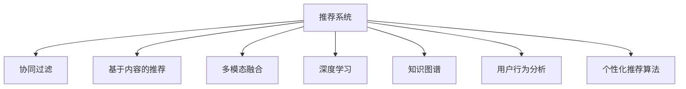

                 

## 1. 背景介绍

### 1.1 问题由来
在当今信息爆炸的时代，知识的获取途径愈加多元，从在线课程到电子书籍，从公开课到付费专栏，知识的获取不再受限于传统的教育机构和出版物。随着互联网的普及和智能手机的广泛应用，用户已经习惯于随时随地进行知识的获取和更新。

然而，尽管知识获取变得更为便捷，但人们对于知识的筛选、评估和吸收过程却依然繁琐耗时。在线课程、付费专栏、博客文章，这些知识源需要用户在碎片化的生活间隙中精心筛选和研读，效率低下，且难以实现系统的知识结构化。

面对这一问题，知识付费平台应运而生，通过聚合优质内容、提供个性化推荐和订阅服务，极大地提升了用户获取知识的速度和效率。然而，随着知识付费内容的迅速增长，如何高效分发和管理这些内容，提升用户粘性和满意度，成为知识付费平台亟需解决的问题。

### 1.2 问题核心关键点
知识付费效率提升的关键在于高效的内容分发和用户个性化体验的提升。具体而言，包括以下几个方面：

- 内容筛选：从海量内容中快速识别并推荐与用户需求相关的内容。
- 内容个性化：根据用户偏好和行为，推荐更符合用户需求的内容。
- 用户互动：通过用户反馈和互动行为，不断优化推荐模型，提升用户满意度。
- 多模态融合：整合音频、视频、文本等多模态数据，提升用户体验和粘性。

因此，本文聚焦于如何利用AI技术，特别是基于推荐系统的个性化推荐算法，提升知识付费平台的运营效率和用户体验，具体包括内容推荐、用户行为分析、推荐系统优化等方面的深度思考。

### 1.3 问题研究意义
在知识付费领域，利用AI技术进行内容推荐和用户互动，能够极大地提升平台的运营效率和用户满意度，促进知识付费行业的健康发展。

1. **提升内容分发效率**：基于AI的推荐算法可以快速识别用户需求，精准推送相关内容，减少用户筛选信息的时间成本。
2. **个性化推荐优化**：通过用户行为数据分析，个性化推荐算法能够动态调整推荐策略，满足用户不断变化的需求，提高用户粘性。
3. **用户互动增强**：通过交互行为分析，了解用户对内容的真实反馈，不断优化推荐算法，提升用户满意度和平台口碑。
4. **多模态数据融合**：通过整合文本、音频、视频等多模态数据，提升内容的展示和理解效果，提高用户的使用体验。

本文系统介绍了如何利用AI技术提升知识付费平台的运营效率，希望为相关从业者提供有价值的参考和指导。

## 2. 核心概念与联系

### 2.1 核心概念概述

为更好地理解AI技术在知识付费中的应用，本节将介绍几个核心概念：

- **推荐系统(Recommendation System)**：利用用户的历史行为、兴趣偏好等信息，推荐符合用户需求的内容。推荐系统可以基于协同过滤、基于内容的推荐、混合推荐等多种算法实现。
- **协同过滤(Collaborative Filtering)**：通过分析用户之间的相似性和行为模式，推荐其他用户喜欢的内容。
- **基于内容的推荐(Content-Based Recommendation)**：通过分析内容本身的属性，如关键词、分类、标签等，推荐与用户兴趣相关的内容。
- **多模态融合(Multimodal Fusion)**：将文本、音频、视频等不同形式的数据融合在一起，提升推荐效果和用户体验。
- **深度学习(Deep Learning)**：利用神经网络等深度学习模型，进行特征提取和模型训练，提升推荐算法的精度和泛化能力。
- **知识图谱(Knowledge Graph)**：利用图结构化表示实体和关系，为推荐系统提供更丰富的知识背景。
- **用户行为分析(Usage Analysis)**：通过分析用户的行为数据，如浏览、点击、评论等，优化推荐算法和用户体验。
- **个性化推荐算法(Personalized Recommendation Algorithm)**：基于用户特征和行为数据，生成个性化的推荐结果。

这些核心概念之间的逻辑关系可以通过以下Mermaid流程图来展示：



这个流程图展示了这个体系中的核心概念及其相互关系：

1. 推荐系统是整个体系的顶层，利用协同过滤、基于内容的推荐、深度学习等多种算法实现。
2. 协同过滤、基于内容的推荐、多模态融合、深度学习等算法作为推荐系统的一部分，提供多样化的推荐方式。
3. 知识图谱为推荐系统提供更丰富的知识背景，提升推荐精度。
4. 用户行为分析有助于了解用户真实需求，优化推荐算法和用户体验。
5. 最终，个性化推荐算法根据用户特征和行为数据，生成个性化的推荐结果，提升用户满意度。

## 3. 核心算法原理 & 具体操作步骤
### 3.1 算法原理概述

基于AI技术的个性化推荐系统，通过用户的历史行为、兴趣偏好等信息，推荐符合用户需求的内容。其核心思想是利用机器学习算法，构建推荐模型，并根据用户的行为数据进行动态调整，提升推荐效果。

具体而言，假设推荐系统中有N个用户，M个内容，记用户对内容的兴趣度为向量$U\in R^M$，内容向量为$I\in R^N$，推荐目标为最大化用户对内容的兴趣度总和。因此，推荐问题可以表示为：

$$
\max_{I,U} \sum_{i=1}^N \sum_{j=1}^M I_{ij}U_j \text{ subject to } I_{ij} \in [0,1], U_j \in [0,1]
$$

上述优化问题可以通过优化算法（如梯度下降、最大化平均用户满意度等）进行求解。推荐系统通过不断调整用户兴趣向量$U$和内容向量$I$，使得推荐结果与用户兴趣更加一致。

### 3.2 算法步骤详解

基于AI技术的个性化推荐系统主要包括以下几个关键步骤：

**Step 1: 数据准备和预处理**
- 收集用户的历史行为数据，如浏览记录、购买记录、评分等。
- 对数据进行预处理，包括数据清洗、缺失值处理、特征工程等，确保数据的完整性和准确性。
- 将用户行为数据编码成向量形式，便于后续算法处理。

**Step 2: 模型训练和优化**
- 选择合适的推荐算法，如协同过滤、基于内容的推荐、深度学习等。
- 将用户行为数据和内容特征数据输入模型，训练推荐模型。
- 使用交叉验证、A/B测试等方法，评估推荐模型的性能。
- 根据评估结果，调整模型参数，进行模型优化。

**Step 3: 实时推荐和反馈**
- 根据实时用户行为数据，更新用户兴趣向量$U$。
- 实时计算内容向量$I$，生成推荐结果。
- 将推荐结果展示给用户，获取用户的反馈（如点击、购买等）。
- 根据用户反馈，调整推荐策略，优化推荐效果。

**Step 4: 系统部署和监控**
- 将训练好的推荐模型部署到生产环境。
- 实时监控推荐系统的运行状态和性能指标。
- 根据监控结果，进行系统调优和升级。

以上是基于AI技术的个性化推荐系统的一般流程。在实际应用中，还需要针对具体任务的特点，对推荐过程的各个环节进行优化设计，如改进推荐算法，引入更多的正则化技术，搜索最优的超参数组合等，以进一步提升推荐精度和用户体验。

### 3.3 算法优缺点

基于AI技术的个性化推荐系统具有以下优点：
1. 高效推荐：利用机器学习算法，能够快速生成个性化推荐，减少用户寻找内容的时间成本。
2. 个性化优化：通过用户行为数据分析，动态调整推荐策略，满足用户不断变化的需求。
3. 交互反馈：通过用户反馈，不断优化推荐算法，提高用户满意度和平台粘性。
4. 多模态融合：整合文本、音频、视频等多模态数据，提升推荐效果和用户体验。
5. 模型可扩展：支持大规模数据和高维度特征，适用于各种推荐场景。

同时，该方法也存在一定的局限性：
1. 数据依赖：推荐系统高度依赖数据的质量和数量，数据不足会影响推荐效果。
2. 冷启动问题：新用户或新内容的推荐难度较大，需要额外设计推荐策略。
3. 模型复杂：模型训练复杂度高，对计算资源和算法优化要求较高。
4. 算法公平性：推荐算法可能存在偏见，需要特别关注算法的公平性和公正性。

尽管存在这些局限性，但基于AI技术的推荐系统在实际应用中已经取得了显著的效果，成为提升知识付费平台效率的重要手段。未来相关研究的重点在于如何进一步降低推荐系统对数据的依赖，提高模型的少样本学习和跨领域迁移能力，同时兼顾可解释性和伦理安全性等因素。

### 3.4 算法应用领域

基于AI技术的个性化推荐系统，在知识付费平台的应用场景中已经被广泛使用，涵盖了许多NLP相关的任务，例如：

- **内容推荐**：根据用户历史行为和兴趣，推荐相关的文章、课程、视频等内容。
- **用户画像构建**：通过用户行为数据，构建用户画像，提供个性化的服务。
- **个性化学习路径设计**：根据用户的学习进度和兴趣，推荐相关的学习资源和路径。
- **广告精准投放**：基于用户行为数据分析，推荐合适的广告，提升平台收益。
- **社区互动增强**：通过用户行为数据分析，识别活跃用户，推荐更多的互动活动和内容。

除了上述这些经典应用外，推荐系统还被创新性地应用于个性化搜索、内容创造、市场分析等诸多领域，为知识付费平台带来了全新的用户体验和价值提升。

## 4. 数学模型和公式 & 详细讲解  
### 4.1 数学模型构建

本节将使用数学语言对基于AI技术的个性化推荐系统进行更加严格的刻画。

假设推荐系统中有N个用户，M个内容，记用户对内容的兴趣度为向量$U\in R^M$，内容向量为$I\in R^N$。用户对内容的评分向量为$R\in R^{M\times N}$，其中$R_{ij}$表示用户$i$对内容$j$的评分。

定义推荐模型为$F:U,I\rightarrow [0,1]$，表示对用户兴趣度向量和内容向量进行映射，得到用户对内容的推荐评分。推荐模型的目标函数为最大化平均推荐评分：

$$
\max_{I,U} \frac{1}{N}\sum_{i=1}^N \sum_{j=1}^M I_{ij}F_{ij} = \frac{1}{N}\sum_{i=1}^N \sum_{j=1}^M U_jF_{ij}
$$

其中$F_{ij}=F(U_j,I_j)$，$U_j$表示用户$j$的兴趣度，$I_j$表示内容$j$的向量表示。

推荐系统的优化目标是最小化用户未评分内容的预测误差：

$$
\min_{I,U} \frac{1}{N}\sum_{i=1}^N \sum_{j=1}^M (R_{ij} - I_{ij}F_{ij})^2
$$

通过梯度下降等优化算法，可以求解上述最优化问题，得到最优的推荐模型参数。

### 4.2 公式推导过程

以下我们以协同过滤算法为例，推导推荐系统的数学模型。

协同过滤算法基于用户和内容的相似性，构建用户兴趣和内容相似度矩阵$K$，并利用矩阵乘法计算推荐结果。具体而言，设用户$i$对内容$j$的评分向量为$R_i\in R^M$，内容$j$的评分向量为$R_j\in R^N$，用户$i$和用户$k$的相似度为$K_{ik}$，内容$j$和内容$l$的相似度为$K_{jl}$，则协同过滤算法的推荐结果可以表示为：

$$
I_{ij} = \sum_{k=1}^N K_{ik}\hat{I}_{kj}
$$

其中$\hat{I}_{kj}$表示内容$j$对用户$k$的推荐评分，$K_{ik}$表示用户$i$和用户$k$的相似度。

协同过滤算法的优化目标为最小化用户未评分内容的预测误差：

$$
\min_{K} \frac{1}{N}\sum_{i=1}^N \sum_{j=1}^M (R_{ij} - I_{ij})^2
$$

通过梯度下降等优化算法，求解上述最优化问题，得到最优的相似度矩阵$K$。

在得到相似度矩阵后，可以将其用于协同过滤算法的推荐计算，得到最终的推荐结果。

## 5. 项目实践：代码实例和详细解释说明
### 5.1 开发环境搭建

在进行推荐系统实践前，我们需要准备好开发环境。以下是使用Python进行PyTorch开发的环境配置流程：

1. 安装Anaconda：从官网下载并安装Anaconda，用于创建独立的Python环境。

2. 创建并激活虚拟环境：
```bash
conda create -n recommendation-env python=3.8 
conda activate recommendation-env
```

3. 安装PyTorch：根据CUDA版本，从官网获取对应的安装命令。例如：
```bash
conda install pytorch torchvision torchaudio cudatoolkit=11.1 -c pytorch -c conda-forge
```

4. 安装各类工具包：
```bash
pip install numpy pandas scikit-learn matplotlib tqdm jupyter notebook ipython
```

完成上述步骤后，即可在`recommendation-env`环境中开始推荐系统实践。

### 5.2 源代码详细实现

这里我们以基于协同过滤的推荐系统为例，给出使用PyTorch进行推荐系统开发的PyTorch代码实现。

首先，定义协同过滤算法的核心函数：

```python
import torch
from torch import nn
from torch.nn import Linear, Embedding, BCELoss

class CollaborativeFiltering(nn.Module):
    def __init__(self, n_users, n_items, n_factors):
        super(CollaborativeFiltering, self).__init__()
        self.u_embed = nn.Embedding(n_users, n_factors)
        self.i_embed = nn.Embedding(n_items, n_factors)
        self.u_pred = nn.Linear(n_factors, 1)
        self.i_pred = nn.Linear(n_factors, 1)
        
    def forward(self, u_idx, i_idx):
        u_embed = self.u_embed(u_idx)
        i_embed = self.i_embed(i_idx)
        u_pred = torch.sigmoid(self.u_pred(u_embed))
        i_pred = torch.sigmoid(self.i_pred(i_embed))
        return u_pred, i_pred
```

然后，定义模型训练函数：

```python
from torch.utils.data import DataLoader
from sklearn.metrics import mean_squared_error
from tqdm import tqdm

def train_epoch(model, data_loader, optimizer):
    model.train()
    epoch_loss = 0
    for batch in tqdm(data_loader, desc='Training'):
        u_idx, i_idx, rating = batch
        u_pred, i_pred = model(u_idx, i_idx)
        loss = BCELoss()(u_pred, i_pred)
        optimizer.zero_grad()
        loss.backward()
        optimizer.step()
        epoch_loss += loss.item()
    return epoch_loss / len(data_loader)

def evaluate(model, data_loader):
    model.eval()
    mse = 0
    for batch in tqdm(data_loader, desc='Evaluating'):
        u_idx, i_idx, rating = batch
        u_pred, i_pred = model(u_idx, i_idx)
        mse += mean_squared_error(rating, (u_pred * i_pred).detach().cpu().numpy()).item()
    return mse / len(data_loader)
```

接着，定义数据加载函数：

```python
class RecommendationDataset(Dataset):
    def __init__(self, data, n_users, n_items):
        self.data = data
        self.n_users = n_users
        self.n_items = n_items
        
    def __len__(self):
        return len(self.data)
    
    def __getitem__(self, idx):
        user, item, rating = self.data[idx]
        u_idx = user - 1
        i_idx = item - 1
        return u_idx, i_idx, rating
```

最后，启动训练流程：

```python
epochs = 10
batch_size = 32
learning_rate = 0.01

train_dataset = RecommendationDataset(train_data, n_users, n_items)
val_dataset = RecommendationDataset(val_data, n_users, n_items)
test_dataset = RecommendationDataset(test_data, n_users, n_items)

model = CollaborativeFiltering(n_users, n_items, 32)
optimizer = torch.optim.Adam(model.parameters(), lr=learning_rate)

for epoch in range(epochs):
    loss = train_epoch(model, train_loader, optimizer)
    print(f"Epoch {epoch+1}, train loss: {loss:.3f}")
    
    print(f"Epoch {epoch+1}, val mse: {evaluate(model, val_loader):.3f}")
    
print(f"Test mse: {evaluate(model, test_loader):.3f}")
```

以上就是使用PyTorch对协同过滤算法进行推荐系统开发的完整代码实现。可以看到，得益于PyTorch的强大封装，我们能用相对简洁的代码完成推荐系统的搭建和训练。

### 5.3 代码解读与分析

让我们再详细解读一下关键代码的实现细节：

**CollaborativeFiltering类**：
- `__init__`方法：初始化嵌入层和预测层等关键组件。
- `forward`方法：对输入的user和item索引进行嵌入，计算预测评分。

**train_epoch和evaluate函数**：
- 使用PyTorch的DataLoader对数据集进行批次化加载，供模型训练和评估使用。
- 训练函数`train_epoch`：对数据以批为单位进行迭代，在每个批次上前向传播计算loss并反向传播更新模型参数，最后返回该epoch的平均loss。
- 评估函数`evaluate`：与训练类似，不同点在于不更新模型参数，并在每个batch结束后将预测结果存储下来，最后使用均方误差计算评估集上的预测效果。

**RecommendationDataset类**：
- `__init__`方法：初始化数据集和用户、物品数量等关键信息。
- `__len__`方法：返回数据集的样本数量。
- `__getitem__`方法：对单个样本进行处理，将用户和物品索引和评分作为输入，返回模型的预测评分。

**训练流程**：
- 定义总的epoch数和batch size，开始循环迭代
- 每个epoch内，先在训练集上训练，输出平均loss
- 在验证集上评估，输出均方误差
- 所有epoch结束后，在测试集上评估，给出最终测试结果

可以看到，PyTorch配合TensorFlow库使得推荐系统的代码实现变得简洁高效。开发者可以将更多精力放在数据处理、模型改进等高层逻辑上，而不必过多关注底层的实现细节。

当然，工业级的系统实现还需考虑更多因素，如模型的保存和部署、超参数的自动搜索、更灵活的任务适配层等。但核心的推荐范式基本与此类似。

## 6. 实际应用场景
### 6.1 智慧学习平台

基于AI技术的个性化推荐系统，可以广泛应用于智慧学习平台，提高学习资源的分发效率和用户的学习体验。智慧学习平台通过聚合在线课程、电子书籍、视频教程等丰富的学习资源，利用推荐系统对用户进行个性化推荐，提升用户的学习效率和满意度。

在技术实现上，可以收集用户的学习行为数据，如浏览时长、点击次数、测试成绩等，将数据输入推荐系统，训练模型推荐符合用户需求的学习资源。推荐系统还可以根据用户的学习进度和兴趣，动态调整推荐策略，提供个性化的学习路径和资源推荐。如此构建的智慧学习平台，能大幅提升用户的在线学习体验，促进知识的快速传播和吸收。

### 6.2 社交网络

基于AI技术的个性化推荐系统，可以广泛应用于社交网络平台，提高用户的内容消费和互动体验。社交网络平台通过收集用户的兴趣偏好、互动行为等数据，利用推荐系统对用户进行个性化推荐，提升用户的内容消费量和互动频率。

在技术实现上，可以收集用户在社交网络上的浏览记录、点赞、评论等行为数据，将其输入推荐系统，训练模型推荐符合用户兴趣的内容。推荐系统还可以根据用户的互动行为，动态调整推荐策略，推荐与用户兴趣相关的内容和互动活动。如此构建的社交网络平台，能提升用户的内容消费体验和粘性，促进平台的用户增长和活跃度。

### 6.3 电商平台

基于AI技术的个性化推荐系统，可以广泛应用于电商平台，提高商品的推荐效率和用户的购买转化率。电商平台通过聚合商品信息、用户行为数据等，利用推荐系统对用户进行个性化推荐，提升用户的购物体验和满意度。

在技术实现上，可以收集用户的浏览记录、购买记录、评价记录等数据，将其输入推荐系统，训练模型推荐符合用户需求的商品。推荐系统还可以根据用户的购买行为，动态调整推荐策略，提供个性化的商品推荐和促销活动。如此构建的电商平台，能提升用户的购物体验和转化率，增加平台的销售收入。

### 6.4 未来应用展望

随着AI技术的不断进步，基于AI技术的个性化推荐系统将在更多领域得到应用，为各行各业带来变革性影响。

在智慧医疗领域，基于推荐系统的个性化诊疗推荐，能够提升医生的诊疗效率和患者的就医体验，为医疗行业带来创新性的变革。

在智能家居领域，基于推荐系统的个性化设备推荐，能够提升用户的家居体验和生活质量，为智能家居行业带来新的发展机遇。

在智慧城市治理中，基于推荐系统的个性化公共服务推荐，能够提升城市的治理效率和服务质量，为智慧城市建设提供新的技术路径。

此外，在教育、金融、娱乐等众多领域，基于推荐系统的个性化推荐系统也将不断涌现，为各行各业带来新的发展机遇。相信随着技术的日益成熟，推荐系统必将在更广阔的领域大放异彩，深刻影响人类的生产生活方式。

## 7. 工具和资源推荐
### 7.1 学习资源推荐

为了帮助开发者系统掌握AI技术在推荐系统中的应用，这里推荐一些优质的学习资源：

1. 《推荐系统》系列博文：由大模型技术专家撰写，深入浅出地介绍了推荐系统原理、协同过滤算法、基于内容的推荐算法等核心概念。

2. Coursera《Recommender Systems》课程：斯坦福大学开设的推荐系统课程，有Lecture视频和配套作业，带你入门推荐系统领域的基本概念和经典算法。

3. 《推荐系统实战》书籍：通过大量实际案例，介绍了推荐系统的开发流程和技术细节，适合实战练习。

4. Kaggle推荐系统竞赛：通过实际竞赛，了解推荐系统的应用场景和优化策略，积累实战经验。

5. GitHub推荐系统代码库：收集了大量推荐系统算法和实现的代码库，适合学习和参考。

通过对这些资源的学习实践，相信你一定能够快速掌握推荐系统的基础知识，并用于解决实际的推荐问题。
### 7.2 开发工具推荐

高效的开发离不开优秀的工具支持。以下是几款用于推荐系统开发的常用工具：

1. PyTorch：基于Python的开源深度学习框架，灵活动态的计算图，适合快速迭代研究。大部分推荐系统算法都有PyTorch版本的实现。

2. TensorFlow：由Google主导开发的开源深度学习框架，生产部署方便，适合大规模工程应用。同样有丰富的推荐系统算法资源。

3. LightFM：Facebook开源的推荐系统库，支持多模态数据融合、特征交叉等高级技术，适合大规模推荐系统开发。

4. Surprise：Scikit-learn的推荐系统模块，提供了多种协同过滤和基于内容的推荐算法，易于使用。

5. Weights & Biases：模型训练的实验跟踪工具，可以记录和可视化模型训练过程中的各项指标，方便对比和调优。与主流深度学习框架无缝集成。

6. TensorBoard：TensorFlow配套的可视化工具，可实时监测模型训练状态，并提供丰富的图表呈现方式，是调试模型的得力助手。

合理利用这些工具，可以显著提升推荐系统的开发效率，加快创新迭代的步伐。

### 7.3 相关论文推荐

推荐系统的发展源于学界的持续研究。以下是几篇奠基性的相关论文，推荐阅读：

1. Factorization Machines: Scalable Learning for Matrix Factorization Models：提出FM算法，将稀疏矩阵乘法嵌入到神经网络中，提升了推荐模型的精度和泛化能力。

2. Scalable Matrix Factorization Techniques for Recommender Systems：介绍了一种高效低成本的矩阵分解算法，适用于大规模推荐系统。

3. Deep Matrix Factorization：利用深度神经网络进行矩阵分解，提升了推荐模型的表示能力和泛化能力。

4. Matrix Factorization Techniques for Recommender Systems：详细介绍了矩阵分解算法，包括奇异值分解、交替最小二乘等经典方法。

5. Neural Collaborative Filtering：利用神经网络进行协同过滤，提升了推荐模型的精度和鲁棒性。

这些论文代表了大模型推荐系统的发展脉络。通过学习这些前沿成果，可以帮助研究者把握学科前进方向，激发更多的创新灵感。

## 8. 总结：未来发展趋势与挑战

### 8.1 总结

本文对基于AI技术的个性化推荐系统进行了全面系统的介绍。首先阐述了推荐系统的研究背景和意义，明确了AI技术在推荐系统中的应用价值。其次，从原理到实践，详细讲解了推荐系统的数学原理和关键步骤，给出了推荐系统任务开发的完整代码实例。同时，本文还广泛探讨了推荐系统在智慧学习平台、社交网络、电商平台等众多领域的应用前景，展示了推荐系统技术的应用潜力。

通过本文的系统梳理，可以看到，基于AI技术的推荐系统正在成为知识付费平台的重要技术手段，极大地提升了平台的运营效率和用户体验，促进了知识付费行业的健康发展。未来，伴随AI技术的不断进步，推荐系统将更加智能、高效，为用户带来更好的使用体验。

### 8.2 未来发展趋势

展望未来，基于AI技术的推荐系统将呈现以下几个发展趋势：

1. 模型规模持续增大。随着算力成本的下降和数据规模的扩张，推荐模型的参数量还将持续增长。超大规模推荐模型蕴含的丰富特征，有望支撑更加复杂多变的推荐场景。

2. 推荐算法多样化。除了协同过滤、基于内容的推荐外，未来会涌现更多高效推荐算法，如基于深度学习的推荐、混合推荐等，在不同类型的推荐场景中提升推荐效果。

3. 实时性增强。推荐系统将更多地结合时序数据和实时数据，实现动态调整和实时推荐，提高用户体验和系统响应速度。

4. 多模态数据融合。推荐系统将整合文本、音频、视频等多模态数据，提升推荐效果和用户体验。

5. 深度强化学习的应用。推荐系统将结合强化学习技术，学习最优的推荐策略，实现动态调整和优化。

6. 用户隐私保护。推荐系统将更多地关注用户隐私保护，采用差分隐私、联邦学习等技术，保护用户数据安全。

以上趋势凸显了推荐系统技术的广阔前景。这些方向的探索发展，必将进一步提升推荐系统的精度和用户体验，为知识付费平台带来新的技术突破。

### 8.3 面临的挑战

尽管基于AI技术的推荐系统已经取得了显著的效果，但在迈向更加智能化、普适化应用的过程中，它仍面临着诸多挑战：

1. 数据依赖。推荐系统高度依赖数据的质量和数量，数据不足会影响推荐效果。如何降低推荐系统对标注数据的依赖，利用无监督学习和半监督学习，是未来的研究重点。

2. 冷启动问题。新用户或新内容的推荐难度较大，需要额外设计推荐策略。如何利用用户行为数据进行冷启动，提升新用户的推荐效果，是未来的研究方向。

3. 模型复杂。推荐系统训练复杂度高，对计算资源和算法优化要求较高。如何简化推荐模型，提升训练效率，是未来的优化方向。

4. 算法公平性。推荐算法可能存在偏见，需要特别关注算法的公平性和公正性。如何设计公平的推荐算法，避免推荐偏见，是未来的研究重点。

5. 用户隐私保护。推荐系统需要处理大量用户数据，如何保护用户隐私，防止数据泄露和滥用，是未来的研究重点。

6. 计算资源瓶颈。推荐系统需要处理大量数据和计算复杂度高的模型，如何高效利用计算资源，提升系统性能，是未来的研究方向。

正视推荐系统面临的这些挑战，积极应对并寻求突破，将使推荐系统走向更加成熟和广泛应用。相信随着学界和产业界的共同努力，这些挑战终将一一被克服，推荐系统必将在构建更加智能、高效、公平的推荐系统方面发挥重要作用。

### 8.4 研究展望

面向未来，推荐系统需要从数据、算法、工程、业务等多个维度协同发力，才能更好地应对未来的挑战，实现更加智能、高效、公平的推荐系统。

1. 数据质量提升。通过数据清洗、特征工程、数据增强等技术，提升数据质量，减少数据依赖。

2. 算法优化。结合多模态数据、深度学习、强化学习等技术，提升推荐算法的效果和泛化能力。

3. 系统工程优化。通过模型裁剪、量化加速、弹性伸缩等技术，提升推荐系统的效率和稳定性。

4. 用户隐私保护。通过差分隐私、联邦学习等技术，保护用户隐私，提升用户信任度。

5. 业务场景适配。根据不同业务场景的特点，设计合适的推荐策略，提升用户体验和粘性。

这些研究方向将引领推荐系统技术迈向更高的台阶，为各行各业带来更大的创新和价值。总之，基于AI技术的推荐系统技术将继续发展，不断提升用户的体验和满意度，为社会带来更多的变革和进步。

## 9. 附录：常见问题与解答

**Q1：推荐系统如何处理新用户和新内容的推荐问题？**

A: 新用户和新内容的推荐问题通常是推荐系统中最具挑战性的部分，因为缺乏历史行为数据。常见的处理方法包括：

1. 基于内容的推荐：利用新用户或新内容的属性信息，如关键词、标签等，推荐与新内容相关的内容。
2. 协同过滤算法：通过相似用户或相似内容的历史行为，推荐新用户或新内容。
3. 混合推荐：结合基于内容和协同过滤的推荐方法，提升推荐效果。

此外，还可以使用深度学习模型，如神经协同过滤（Neural Collaborative Filtering, NCF），通过模型预测新用户或新内容的评分，进行推荐。

**Q2：推荐系统如何降低对标注数据的依赖？**

A: 推荐系统对标注数据的依赖较大，但随着无监督学习和半监督学习技术的发展，推荐系统也可以更好地利用非结构化数据。

1. 无监督学习：利用用户的历史行为数据，无需标注数据即可训练推荐模型。例如，协同过滤算法可以通过矩阵分解等技术，进行无监督训练。
2. 半监督学习：利用少量标注数据，结合无监督学习算法，进行推荐模型训练。例如，使用标签增强（Label Augmentation）技术，将少样本标注数据和非标注数据结合进行训练。
3. 多模态融合：利用用户的多模态数据，如文本、音频、视频等，提升推荐模型的泛化能力。例如，将文本数据和视觉数据结合，进行跨模态推荐。

这些方法可以进一步降低推荐系统对标注数据的依赖，提升推荐效果。

**Q3：推荐系统如何处理数据不均衡问题？**

A: 推荐系统经常面临数据不均衡问题，即某些类别的数据量较少。常见的处理方法包括：

1. 重采样：通过过采样或欠采样，平衡数据集中的类别分布。例如，过采样少数类别样本，或欠采样多数类别样本。
2. 分类权重调整：通过调整分类器的权重，平衡不同类别的重要性。例如，使用Class Weight参数，调整不同类别的权重。
3. 集成学习：通过集成多个分类器的结果，提升分类效果。例如，使用Bagging、Boosting等集成学习方法。

这些方法可以进一步提升推荐系统的性能，处理数据不均衡问题。

**Q4：推荐系统如何处理动态变化的用户需求？**

A: 推荐系统需要动态调整，以应对用户需求的变化。常见的处理方法包括：

1. 在线学习：利用在线学习算法，实时更新模型参数。例如，使用在线梯度下降（Online Gradient Descent）算法，实时更新模型。
2. 模型重训练：定期重训练模型，重新学习用户需求。例如，定期更新推荐模型，重新学习用户历史行为数据。
3. 增量学习：利用增量学习算法，更新模型参数。例如，使用增量SVD（Incremental Singular Value Decomposition）算法，实时更新推荐模型。

这些方法可以进一步提升推荐系统的实时性，应对动态变化的用户需求。

**Q5：推荐系统如何处理数据稀疏性问题？**

A: 推荐系统经常面临数据稀疏性问题，即用户和内容的评分数据较少。常见的处理方法包括：

1. 矩阵分解：通过矩阵分解等技术，利用用户的历史行为数据，进行推荐模型训练。例如，使用SVD分解，对用户行为矩阵进行分解。
2. 稀疏矩阵乘法：利用稀疏矩阵乘法技术，提升推荐模型的效率。例如，使用基于稀疏矩阵的协同过滤算法。
3. 模型融合：通过融合多个推荐模型的结果，提升推荐效果。例如，使用Bagging、Boosting等集成学习方法，融合多个推荐模型的结果。

这些方法可以进一步提升推荐系统的性能，处理数据稀疏性问题。

通过本文的系统梳理，可以看到，基于AI技术的推荐系统正在成为知识付费平台的重要技术手段，极大地提升了平台的运营效率和用户体验，促进了知识付费行业的健康发展。未来，伴随AI技术的不断进步，推荐系统将更加智能、高效，为用户带来更好的使用体验。

