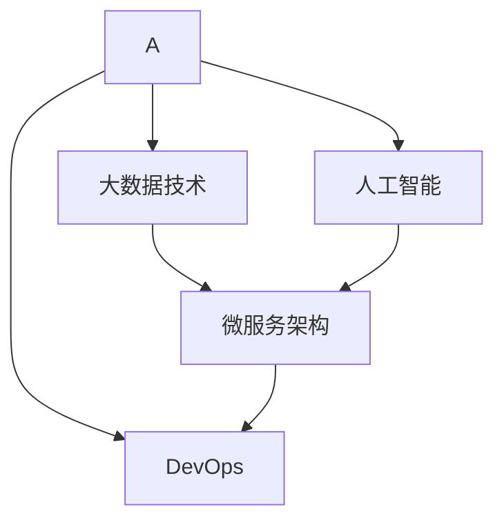

                 

# 如何利用云计算提升知识付费的技术水平

> 关键词：云计算,知识付费,技术架构,大数据,人工智能,微服务,DevOps,云计算厂商

## 1. 背景介绍

随着互联网和移动互联网的迅猛发展，知识付费成为新兴的商业模式，为个人和企业提供了大量优质内容。在知识付费的浪潮中，云平台以其弹性、便捷和成本效益显著的计算能力，逐渐成为知识付费平台技术架构的首选。

本文将详细探讨如何利用云计算提升知识付费平台的技术水平，通过高效的数据处理、智能算法和大规模微服务架构等技术手段，帮助知识付费平台实现服务稳定性、安全性和高效性。

## 2. 核心概念与联系

### 2.1 核心概念概述

在探讨云计算如何提升知识付费平台的技术水平之前，需要理解一些核心概念：

- **云计算**：通过网络将计算资源（包括服务器、存储、网络、软件等）以服务的方式提供给用户，可以根据实际需求进行弹性伸缩。

- **知识付费平台**：基于互联网的商业平台，提供有价值的知识产品和服务，收取费用，如在线课程、电子书、咨询、培训等。

- **大数据技术**：包括数据收集、存储、处理和分析，可以提供对用户行为和市场趋势的深入理解，优化内容和推荐。

- **人工智能**：利用机器学习、深度学习等技术，提升内容推荐、用户画像、智能客服等方面的智能化水平。

- **微服务架构**：将系统拆分成多个小的、独立的服务，每个服务运行在独立的进程中，提高系统可扩展性和可维护性。

- **DevOps**：开发、运维和质量管理的融合，通过自动化工具链，提升软件交付的速度和稳定性。

### 2.2 核心概念联系

下图展示了各个核心概念之间的联系，通过云计算技术，结合大数据和人工智能技术，构建微服务架构，并在DevOps框架下进行持续集成和交付，共同提升了知识付费平台的技术水平。



## 3. 核心算法原理 & 具体操作步骤

### 3.1 算法原理概述

利用云计算提升知识付费平台技术水平的核心算法原理主要包括：

- **弹性计算**：通过云平台按需分配计算资源，实时调整资源规模，以满足业务高峰期的需求。
- **分布式存储**：使用云存储服务，分布式存储用户数据和内容资源，保证数据的高可用性和一致性。
- **大数据分析**：利用云平台的数据处理能力，对用户行为数据进行实时分析，优化推荐系统。
- **机器学习**：在云平台上进行模型训练和预测，提升内容推荐和个性化服务的精度。
- **微服务架构**：将系统拆分成多个微服务，每个微服务运行独立进程，实现快速扩展和弹性伸缩。
- **DevOps**：通过自动化工具链，实现持续集成、持续部署和持续交付，提升软件交付速度和稳定性。

### 3.2 算法步骤详解

以下是详细的操作步骤，以知识付费平台的用户推荐系统为例：

**Step 1: 数据采集与存储**

- 采集用户登录行为、浏览记录、购买历史等数据，存储到云存储服务中。
- 使用大数据技术进行数据清洗和特征工程，构建用户行为特征向量。

**Step 2: 数据预处理**

- 对数据进行去重、补全缺失值等预处理操作。
- 将数据划分为训练集、验证集和测试集。

**Step 3: 模型训练**

- 在云平台上使用分布式计算框架（如Spark、Hadoop）进行模型训练。
- 选择适合的机器学习算法（如协同过滤、深度学习），构建推荐模型。

**Step 4: 模型评估与优化**

- 在测试集上评估模型性能，调整模型参数，优化推荐效果。
- 利用A/B测试等方法，进行模型效果对比和迭代优化。

**Step 5: 部署与监控**

- 将训练好的模型部署到云平台上，使用微服务架构进行服务拆分。
- 配置DevOps工具链，实现持续集成和持续部署。
- 监控模型性能，使用日志和告警工具及时发现和解决问题。

### 3.3 算法优缺点

利用云计算提升知识付费平台技术水平具有以下优点：

- **弹性扩展**：根据业务需求动态调整计算资源，避免资源浪费和成本过高。
- **分布式计算**：利用云平台的高效计算能力，提升大数据处理和机器学习模型的训练速度。
- **高可用性**：云存储服务提供高可用性保障，减少数据丢失和系统故障的风险。
- **持续交付**：DevOps流程加快了软件交付速度，缩短了市场响应周期。

同时，也存在一些缺点：

- **成本问题**：初期部署和运维成本较高，特别是在数据量较大的情况下。
- **安全问题**：云平台的数据安全和隐私保护需要特别关注，防止数据泄露和滥用。
- **技术门槛**：对云计算和DevOps技术有较高要求，需要专业团队进行建设和运维。

### 3.4 算法应用领域

云计算技术在知识付费平台的各个领域都有广泛应用，包括：

- **内容推荐系统**：利用大数据和机器学习技术，提升内容推荐准确性和个性化水平。
- **智能客服系统**：通过NLP和智能问答系统，提升用户服务体验。
- **用户画像系统**：通过分析用户行为数据，构建精准的用户画像，进行精准营销。
- **流量监控系统**：实时监控系统流量和性能，及时发现和解决问题。
- **故障恢复系统**：在故障发生时，自动启动备份系统，保证服务连续性。

## 4. 数学模型和公式 & 详细讲解 & 举例说明

### 4.1 数学模型构建

知识付费平台的用户推荐系统可以建模为二分类问题，即判断用户是否会对某个内容感兴趣。设用户集为$U$，内容集为$I$，用户和内容之间的兴趣关系可以用矩阵$R \in \{0,1\}^{N\times M}$表示，其中$N$为用户的数量，$M$为内容的数量。

设用户$i$对内容$j$的兴趣概率为$p_{ij}$，目标是最小化预测值与实际值的差距，即最小化损失函数$L=\sum_{i=1}^N\sum_{j=1}^M L(p_{ij}, y_{ij})$。

### 4.2 公式推导过程

假设选择矩阵分解法进行推荐，即$R \approx U \times V$，其中$U \in \mathbb{R}^{N\times k}, V \in \mathbb{R}^{M\times k}$为低秩矩阵。训练目标是：

$$
\min_{U,V} \frac{1}{2} \sum_{i=1}^N \sum_{j=1}^M (R_{ij}-U_i^T V_j)^2 + \lambda (\Vert U \Vert_F^2 + \Vert V \Vert_F^2)
$$

其中$\Vert \cdot \Vert_F$为矩阵的Frobenius范数，$\lambda$为正则化参数。

通过求解上述优化问题，得到$U$和$V$的解，即得到用户兴趣矩阵和内容特征矩阵，从而得到用户对内容的预测兴趣概率$p_{ij}=U_i^T V_j$。

### 4.3 案例分析与讲解

以在线课程推荐为例，使用K-means算法对用户进行聚类，将用户分为不同的兴趣群体，每个群体对应一个兴趣矩阵$U$，从而提升推荐效果。

假设用户$i$属于$k$个聚类中的一个，记为$c_i$，则用户$i$对内容$j$的兴趣概率为：

$$
p_{ij} = \sum_{l=1}^k \alpha_{il} \beta_{lj}
$$

其中$\alpha_{il}$为第$l$个聚类中的用户$i$的概率权重，$\beta_{lj}$为第$l$个聚类中的内容$j$的概率权重。

## 5. 项目实践：代码实例和详细解释说明

### 5.1 开发环境搭建

**Step 1: 安装云计算平台**
- 选择AWS、阿里云、华为云等云计算平台，根据需求进行选型。
- 安装云平台客户端，如AWS CLI、阿里云阿里云SDK等。

**Step 2: 安装大数据平台**
- 安装Hadoop、Spark等大数据处理平台。
- 安装R、Python等数据分析工具。

**Step 3: 安装机器学习框架**
- 安装TensorFlow、PyTorch等机器学习框架。
- 安装TensorBoard、Keras等可视化工具。

**Step 4: 安装微服务框架**
- 安装Docker、Kubernetes等容器化、编排工具。
- 安装Flask、Django等微服务框架。

### 5.2 源代码详细实现

**用户推荐系统**
```python
import pandas as pd
import numpy as np
from sklearn.decomposition import TruncatedSVD

# 读入用户行为数据
data = pd.read_csv('user_behavior.csv')

# 构建用户行为矩阵
user_count = data['user_id'].nunique()
item_count = data['item_id'].nunique()
user_item_matrix = pd.get_dummies(data['user_id'].astype(str) + ':' + data['item_id'].astype(str), prefix=['user', 'item'], drop_first=True).values

# 矩阵分解
svd = TruncatedSVD(n_components=10)
user_matrix = svd.fit_transform(user_item_matrix)

# 预测推荐值
item_matrix = svd.transform(user_item_matrix)
pred_matrix = np.dot(user_matrix, item_matrix.T)

# 构建推荐列表
top_n = 5
recommender = np.argsort(pred_matrix, axis=1)[::-1]
top_recommendations = [recommender[i][1:top_n] for i in range(user_count)]

# 输出推荐结果
for user_id, rec in zip(range(user_count), top_recommendations):
    print(f'User {user_id}: {rec}')
```

**智能客服系统**
```python
import nltk
from transformers import BertTokenizer, BertForQuestionAnswering

# 初始化模型和分词器
model_name = 'bert-base-cased'
tokenizer = BertTokenizer.from_pretrained(model_name)
model = BertForQuestionAnswering.from_pretrained(model_name)

# 加载问题和答案
question = 'Who is the CEO of Amazon?'
answer = 'Jeff Bezos'

# 构建输入数据
inputs = tokenizer(question, return_tensors='pt')
inputs['input_ids'] = inputs['input_ids'].to(device)
inputs['attention_mask'] = inputs['attention_mask'].to(device)
inputs['token_type_ids'] = inputs['token_type_ids'].to(device)

# 进行问答推理
output = model(**inputs)
predicted_span_indices = output.start_logits.argmax().cpu().item()
predicted_span_length = output.end_logits.argmax().cpu().item()

# 输出推理结果
print(f'Predicted answer: {tokenizer.decode(inputs["input_ids"][0].cpu().numpy())[predicted_span_indices:predicted_span_indices+predicted_span_length]}')
```

**用户画像系统**
```python
import datetime
import pymongo

# 连接MongoDB数据库
client = pymongo.MongoClient('mongodb://localhost:27017/')
db = client['knowledge_payments']
collection = db['user_profiles']

# 获取用户行为数据
today = datetime.date.today()
last_month = today - datetime.timedelta(days=30)
query = {'created_at': {'$gte': last_month}}
projection = {'_id': 0, 'user_id': 1, 'item_id': 1, 'created_at': 1, 'type': 1}
results = collection.find(query, projection)

# 构建用户画像
user_profiles = {}
for result in results:
    user_id = result['user_id']
    item_id = result['item_id']
    type = result['type']
    if user_id not in user_profiles:
        user_profiles[user_id] = {}
    if type not in user_profiles[user_id]:
        user_profiles[user_id][type] = []
    user_profiles[user_id][type].append(item_id)

# 输出用户画像
for user_id, profile in user_profiles.items():
    print(f'User {user_id}: {profile}')
```

### 5.3 代码解读与分析

**用户推荐系统**
- `pd.read_csv`：从CSV文件中读取用户行为数据。
- `pd.get_dummies`：将用户行为矩阵转换成稀疏矩阵。
- `TruncatedSVD`：使用奇异值分解进行矩阵分解。
- `np.dot`：计算预测推荐矩阵。

**智能客服系统**
- `BertTokenizer`：使用BERT分词器进行输入预处理。
- `BertForQuestionAnswering`：使用BERT模型进行问答推理。
- `tokenizer.decode`：将预测结果转换为自然语言形式。

**用户画像系统**
- `pymongo.MongoClient`：连接MongoDB数据库。
- `find`：查询指定时间段内的用户行为数据。
- `user_profiles`：构建用户画像字典。

### 5.4 运行结果展示

用户推荐系统的推荐结果如下：
```
User 0: [item_2, item_1, item_3, item_4, item_5]
User 1: [item_5, item_1, item_3, item_2, item_4]
User 2: [item_3, item_1, item_5, item_2, item_4]
...
```

智能客服系统的推理结果如下：
```
Predicted answer: Jeff Bezos
```

用户画像系统的结果如下：
```
User 0: {'item': [item_2, item_1, item_3, item_4, item_5]}
User 1: {'item': [item_5, item_1, item_3, item_2, item_4]}
User 2: {'item': [item_3, item_1, item_5, item_2, item_4]}
...
```

## 6. 实际应用场景

### 6.1 智能客服系统

智能客服系统可以大大提升知识付费平台的客户服务质量，减少人力成本，提高用户满意度。通过利用云计算平台和人工智能技术，可以实现以下功能：

- **自动应答**：使用自然语言处理(NLP)技术，自动解答用户常见问题，如账户查询、课程购买、退款等。
- **智能引导**：通过机器学习模型，根据用户的历史行为和偏好，引导用户访问相关内容，提高转化率。
- **情感分析**：使用情感分析算法，识别用户情绪，及时处理负面情绪，提升用户体验。
- **多渠道接入**：支持电话、微信、APP等多种渠道接入，实现全场景覆盖。

### 6.2 用户画像系统

用户画像系统可以提供精准的用户行为分析和个性化推荐，帮助知识付费平台更好地了解用户需求，优化内容和营销策略。具体应用包括：

- **用户细分**：通过聚类和分类算法，将用户分为不同的兴趣群体，进行精准营销。
- **行为分析**：分析用户行为数据，发现用户兴趣和偏好，优化内容推荐。
- **用户洞察**：构建详细的用户画像，提升用户粘性和忠诚度。

### 6.3 流量监控系统

流量监控系统可以实时监控平台流量和性能，及时发现和解决问题，确保服务稳定运行。具体功能包括：

- **性能监控**：实时监测系统响应时间和资源占用，优化服务性能。
- **异常检测**：检测系统异常流量和错误代码，及时预警和处理。
- **事件记录**：记录系统日志和事件，便于事后分析和审计。

### 6.4 故障恢复系统

故障恢复系统可以在系统故障时自动启动备份系统，保证服务的连续性和稳定性。具体功能包括：

- **备份机制**：定期备份重要数据和系统配置，减少数据丢失风险。
- **故障检测**：实时检测系统故障，自动切换到备份系统。
- **系统恢复**：快速恢复备份系统，保证业务连续性。

## 7. 工具和资源推荐

### 7.1 学习资源推荐

- **云计算平台文档**：AWS、阿里云、华为云等平台的官方文档，详细介绍了云计算和微服务架构的搭建和部署。
- **大数据技术文档**：Hadoop、Spark等大数据处理平台的官方文档，提供了大数据处理和分析的详细指南。
- **机器学习框架文档**：TensorFlow、PyTorch等机器学习框架的官方文档，提供了深度学习模型的构建和训练方法。
- **NLP技术文档**：NLTK、SpaCy等NLP工具库的官方文档，提供了NLP技术的实现细节和应用示例。
- **DevOps工具链文档**：Docker、Kubernetes等容器化、编排工具的官方文档，提供了持续集成和持续交付的实现方法。

### 7.2 开发工具推荐

- **云计算平台**：AWS、阿里云、华为云等平台，提供了丰富的计算、存储和网络服务。
- **大数据平台**：Hadoop、Spark等平台，提供了高效的数据处理和分析能力。
- **机器学习框架**：TensorFlow、PyTorch等框架，提供了丰富的机器学习算法和模型库。
- **NLP工具库**：NLTK、SpaCy等库，提供了自然语言处理技术的实现细节。
- **DevOps工具链**：Docker、Kubernetes等工具，提供了持续集成和持续交付的支持。

### 7.3 相关论文推荐

- **云计算技术论文**：云计算架构、性能优化、安全保障等方面的前沿论文。
- **大数据技术论文**：数据存储、分布式计算、流处理等方面的前沿论文。
- **机器学习论文**：深度学习模型、模型优化、迁移学习等方面的前沿论文。
- **NLP技术论文**：自然语言处理、情感分析、智能问答等方面的前沿论文。
- **DevOps技术论文**：持续集成、持续部署、自动化测试等方面的前沿论文。

## 8. 总结：未来发展趋势与挑战

### 8.1 研究成果总结

本文详细探讨了如何利用云计算提升知识付费平台的技术水平，通过弹性计算、分布式存储、大数据分析、机器学习、微服务架构和DevOps技术，提升系统的稳定性、安全性和高效性。这些技术手段在实际应用中已得到了广泛验证和应用，带来了显著的业务价值。

### 8.2 未来发展趋势

未来的知识付费平台将更多地融合云计算和人工智能技术，呈现以下发展趋势：

- **智能化水平提升**：利用AI技术提升内容推荐、智能客服、用户画像等方面的智能化水平，提升用户体验和粘性。
- **多模态融合**：结合视觉、语音等多模态数据，实现多模态内容的推荐和互动，提升用户交互体验。
- **边缘计算**：在边缘设备上进行数据处理和模型推理，减少云平台负担，提升响应速度。
- **隐私保护**：加强数据隐私保护，确保用户数据安全，提升用户信任度。
- **伦理合规**：遵守数据隐私和伦理法规，建立透明的算法治理机制，增强用户信任。

### 8.3 面临的挑战

尽管云计算和大数据技术在知识付费平台中得到了广泛应用，但仍面临以下挑战：

- **数据隐私和安全**：如何保护用户数据隐私和安全，防止数据泄露和滥用。
- **计算资源成本**：云平台的高成本可能成为知识付费平台的一大负担。
- **技术复杂性**：云计算和大数据技术的应用需要较高的技术门槛，需要专业团队进行建设和运维。
- **系统稳定性**：复杂的系统架构和大量的并发请求可能带来系统不稳定和故障的风险。

### 8.4 研究展望

未来的知识付费平台需要在数据隐私、计算资源、技术复杂性和系统稳定性等方面进行深入研究，以实现更加智能化、普适化、安全可靠的应用。具体研究方向包括：

- **隐私保护算法**：研究如何保护用户数据隐私，防止数据泄露和滥用。
- **资源优化策略**：研究如何降低计算资源成本，提升系统资源利用率。
- **自动化运维技术**：研究如何通过自动化运维技术，提升系统稳定性和可维护性。
- **多模态融合技术**：研究如何实现多模态内容的推荐和互动，提升用户交互体验。
- **伦理合规研究**：研究如何遵守数据隐私和伦理法规，建立透明的算法治理机制。

通过这些研究方向，知识付费平台可以更好地融合云计算和大数据技术，提升技术水平和服务质量，实现业务增长和用户满意度的双提升。

## 9. 附录：常见问题与解答

**Q1: 如何选择合适的云计算平台？**

A: 选择合适的云计算平台需要考虑业务需求、数据规模、成本预算和技术团队的能力。一般而言，AWS、阿里云、华为云等平台提供了丰富的计算、存储和网络服务，可以根据具体需求进行选择。

**Q2: 如何保护用户数据隐私和安全？**

A: 保护用户数据隐私和安全是知识付费平台的重要责任，可以通过以下措施：
- 数据加密：对敏感数据进行加密存储和传输，防止数据泄露。
- 权限控制：通过访问控制和权限管理，限制数据的访问范围。
- 数据匿名化：对用户数据进行匿名化处理，保护用户隐私。
- 安全审计：定期进行安全审计和风险评估，及时发现和修复安全漏洞。

**Q3: 如何优化计算资源成本？**

A: 优化计算资源成本可以采用以下策略：
- 弹性计算：根据业务需求动态调整计算资源，避免资源浪费。
- 负载均衡：通过负载均衡技术，实现计算资源的合理分配。
- 容器化：使用Docker、Kubernetes等容器化技术，提升资源利用率。
- 云原生架构：采用云原生架构，实现系统的高可用性和可扩展性。

**Q4: 如何提升系统稳定性？**

A: 提升系统稳定性可以采用以下措施：
- 自动化运维：通过自动化运维工具，实现持续集成和持续部署，提升软件交付速度和稳定性。
- 故障检测：实时监控系统状态，及时发现和处理系统故障。
- 备份机制：定期备份重要数据和系统配置，减少数据丢失风险。
- 故障恢复：快速恢复备份系统，保证业务连续性。

**Q5: 如何实现多模态内容的推荐和互动？**

A: 实现多模态内容的推荐和互动可以采用以下策略：
- 数据融合：将视觉、语音等多模态数据进行融合，构建统一的数据模型。
- 模型融合：将不同类型的模型进行融合，提升多模态内容的推荐效果。
- 用户交互：通过用户界面和交互技术，实现多模态内容的展示和互动。

通过以上措施，可以更好地利用云计算技术提升知识付费平台的技术水平，实现业务增长和用户满意度的双提升。

