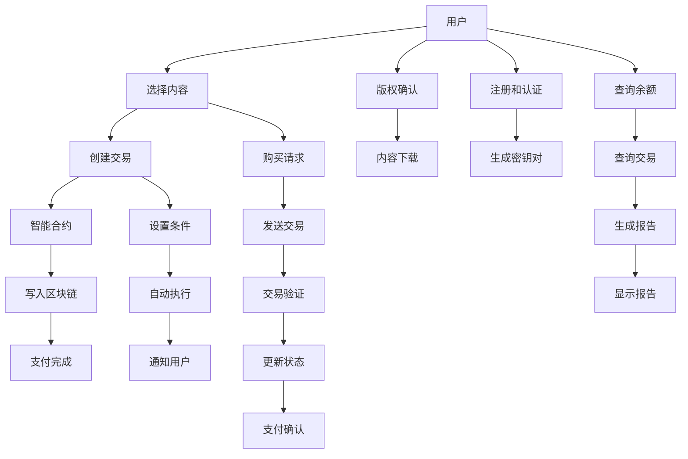

                 

# 如何利用区块链技术保护知识付费版权

> 关键词：区块链，知识付费，版权保护，智能合约，加密技术

## 1. 背景介绍

### 1.1 问题由来
在知识付费领域，如何有效地保护版权和支付款项，一直是困扰内容创作者和平台方的难题。传统的方法如数字水印、DRM等技术，虽有一定的版权保护能力，但容易被破解，且对用户体验影响较大。近年来，随着区块链技术的兴起，利用其去中心化、不可篡改等特性，为版权保护和知识付费提供了一种全新的思路。

### 1.2 问题核心关键点
区块链技术以其独特的分布式账本和智能合约机制，为知识付费版权保护提供了新的解决方案。主要包括以下几个关键点：
- 不可篡改性：区块链上的数据一旦被写入，就无法修改，保证了版权证明的真实性和不可抵赖性。
- 去中心化：每个节点都参与验证和记录数据，降低了单点故障和中心化管理的风险。
- 智能合约：通过预设条件自动执行，确保版权支付的透明性和自动化，减少了人为干预和纠纷。
- 用户隐私保护：利用加密技术保护用户身份和交易信息，增强了系统的安全性。

这些特性使得区块链在知识付费版权保护中具有不可替代的价值，吸引了众多研究者和创业者的关注。

## 2. 核心概念与联系

### 2.1 核心概念概述

为更好地理解区块链在知识付费版权保护中的应用，本节将介绍几个密切相关的核心概念：

- 区块链(Blockchain)：一种去中心化的分布式账本技术，通过链式结构将数据区块按时间顺序串联起来，每个区块包含多个交易记录，并通过共识机制进行验证和同步。
- 智能合约(Smart Contract)：一段可自动执行的代码，当满足预设条件时，会自动执行并转移数字资产，实现自动化的版权保护和支付。
- 加密技术(Cryptography)：通过加密算法保护数据安全，确保交易记录和用户隐私不被非法访问和篡改。
- 数字资产(Digital Asset)：以数字形式存在的资产，如加密货币、NFT等，用于版权证明和支付。
- 共识机制(Consensus Mechanism)：区块链网络中用于验证和同步数据的算法规则，确保数据的完整性和一致性。

这些核心概念之间通过区块链技术构成了完整的版权保护和知识付费系统。

### 2.2 核心概念原理和架构的 Mermaid 流程图(Mermaid 流程节点中不要有括号、逗号等特殊字符)



这个流程图展示了大语言模型微调的核心概念及其之间的关系：

1. 用户选择要付费的内容。
2. 用户通过智能合约创建交易并支付，版权证明被写入区块链。
3. 支付完成后，内容提供者确认版权，用户可下载内容。
4. 用户进行身份注册和认证，生成密钥对。
5. 用户发起购买请求，交易被验证并更新状态。
6. 交易执行后，智能合约自动执行并通知用户。
7. 用户查询余额和交易记录，生成和使用报告。

## 3. 核心算法原理 & 具体操作步骤
### 3.1 算法原理概述

区块链技术在知识付费版权保护中的应用，主要基于以下原理：

- 使用区块链记录版权信息。创作者在区块链上发布作品，通过智能合约自动记录版权信息，包括作品ID、创建时间、交易记录等。
- 使用加密技术保护版权信息。利用非对称加密算法，将版权信息进行加密，确保只有授权用户才能解密访问。
- 利用智能合约自动执行版权交易。当满足预设条件时，如交易完成、支付到期等，智能合约会自动执行并转移数字资产，完成版权支付和确认。
- 通过区块链的去中心化特性，确保版权信息的透明性和不可篡改性。每个节点都参与验证和记录数据，任何单一节点无法篡改。

基于上述原理，本节将详细介绍使用区块链技术进行知识付费版权保护的具体操作步骤。

### 3.2 算法步骤详解

1. **用户注册与认证**
   - 用户在平台上进行身份注册，生成一对公钥和私钥。
   - 将公钥存储在区块链上，生成数字钱包，用于接收版权证明。

2. **内容发布与版权记录**
   - 创作者在平台上发布作品，平台自动生成版权证明，记录作品ID、发布时间、创作者信息等。
   - 版权证明通过智能合约自动写入区块链，确保信息不可篡改。

3. **版权支付与确认**
   - 用户通过智能合约购买内容，支付金额转移到版权所有者指定的区块链地址。
   - 版权所有者收到支付后，通过智能合约自动确认版权，生成交易记录，更新区块链上的版权信息。

4. **内容获取与访问**
   - 用户获得版权后，通过私钥解密版权信息，获取作品链接和访问权限。
   - 访问内容时，系统会自动记录访问记录，确保版权的合法使用。

### 3.3 算法优缺点

利用区块链技术进行知识付费版权保护具有以下优点：
- 不可篡改性。版权信息一旦写入区块链，无法修改，确保了版权的真实性和可信度。
- 去中心化。每个节点都参与验证和记录数据，减少了单点故障和中心化管理的风险。
- 自动执行。智能合约确保版权支付的透明性和自动化，减少了人为干预和纠纷。

同时，该方法也存在一定的局限性：
- 技术门槛高。区块链技术较为复杂，普通用户和企业难以快速上手。
- 性能瓶颈。区块链交易速度较慢，无法满足高频支付需求。
- 隐私问题。虽然交易信息经过加密，但无法完全避免隐私泄露的风险。
- 成本问题。区块链技术的实现和维护成本较高，需要专业的技术人员和管理资源。

尽管存在这些局限性，但就目前而言，利用区块链技术进行知识付费版权保护仍是具有重要意义的技术手段。未来相关研究的重点在于如何进一步降低技术门槛，提高系统性能，同时兼顾用户隐私和成本等因素。

### 3.4 算法应用领域

区块链技术在知识付费版权保护中的应用，已经在游戏、音乐、影视等诸多领域得到了广泛应用。以下是几个典型的应用场景：

- **游戏版权保护**：玩家购买游戏内道具时，版权信息自动写入区块链，确保道具合法归属。玩家的游戏行为也通过区块链记录，保障版权权益。
- **音乐版权保护**：音乐创作者通过区块链发布作品，平台自动记录版权信息。用户购买音乐时，版权信息被写入区块链，平台自动确认版权，保护音乐版权。
- **影视版权保护**：影视作品的发行和版权交易，通过区块链记录，确保版权信息的透明性和不可篡改性。用户观看影视作品时，版权信息通过区块链验证，保护影视版权。
- **数字艺术品交易**：创作者发布数字艺术品，版权信息自动写入区块链。买家购买艺术品时，版权信息被写入区块链，确保艺术品的所有权和版权归属。
- **教育内容付费**：教育平台通过区块链记录课程内容和版权信息，用户购买课程时，版权信息被写入区块链，保障课程内容的版权权益。

除了上述这些经典应用外，区块链技术还在更多场景中得到应用，为知识付费版权保护提供了新的解决方案。随着区块链技术的不断成熟，未来区块链在版权保护和知识付费中的应用将更加广泛和深入。

## 4. 数学模型和公式 & 详细讲解 & 举例说明（备注：数学公式请使用latex格式，latex嵌入文中独立段落使用 $$，段落内使用 $)
### 4.1 数学模型构建

利用区块链技术进行知识付费版权保护，主要涉及以下几个数学模型：

- 数字资产模型：描述版权信息的数字化表示，包括版权ID、创建时间、交易记录等。
- 公钥加密模型：利用公钥加密算法，确保版权信息的安全性。
- 智能合约模型：通过自动执行的代码，确保版权支付的透明性和自动化。

以下是区块链版权保护的主要数学模型构建：

**数字资产模型**：
$$
\text{版权信息} = (\text{版权ID}, \text{创建时间}, \text{交易记录})
$$

**公钥加密模型**：
$$
E(\text{版权信息}, \text{公钥}) = \text{密文}
$$

**智能合约模型**：
$$
\text{智能合约} = (\text{条件}, \text{执行操作}, \text{通知方式})
$$

### 4.2 公式推导过程

以下以音乐版权保护为例，详细推导使用区块链进行版权交易的数学公式：

1. **版权信息加密**：
   - 创作者发布作品，生成版权信息：
   $$
   \text{版权信息} = (\text{作品ID}, \text{创建时间}, \text{创作者ID})
   $$
   - 使用公钥加密算法，对版权信息进行加密：
   $$
   E(\text{版权信息}, \text{公钥}) = \text{密文}
   $$

2. **版权交易写入区块链**：
   - 用户购买音乐时，支付金额转移到版权所有者指定的区块链地址。
   - 版权所有者收到支付后，生成交易记录：
   $$
   \text{交易记录} = (\text{用户ID}, \text{支付金额}, \text{交易时间})
   $$
   - 版权信息与交易记录通过智能合约自动写入区块链：
   $$
   \text{智能合约} = (\text{条件}, \text{执行操作}, \text{通知方式})
   $$

3. **版权确认与通知**：
   - 当用户完成支付后，智能合约自动执行，确认版权：
   $$
   \text{智能合约执行结果} = (\text{版权确认}, \text{通知方式})
   $$
   - 版权所有者收到通知后，通过智能合约生成交易记录：
   $$
   \text{交易记录} = (\text{用户ID}, \text{支付金额}, \text{交易时间}, \text{版权确认时间})
   $$

4. **版权访问与保护**：
   - 用户获取音乐链接时，通过私钥解密版权信息，确保访问权限：
   $$
   D(\text{密文}, \text{私钥}) = \text{版权信息}
   $$
   - 访问内容时，记录访问记录，确保版权的合法使用：
   $$
   \text{访问记录} = (\text{用户ID}, \text{内容ID}, \text{访问时间})
   $$

### 4.3 案例分析与讲解

以音乐版权保护为例，具体分析如何使用区块链技术进行版权交易和确认：

1. **版权信息生成**：创作者在平台上发布音乐，平台自动生成版权信息：
   - 版权信息：
   $$
   (\text{作品ID}, \text{创建时间}, \text{创作者ID})
   $$
   - 使用公钥加密算法，对版权信息进行加密：
   $$
   E(\text{版权信息}, \text{公钥}) = \text{密文}
   $$

2. **版权交易写入区块链**：
   - 用户购买音乐时，支付金额转移到版权所有者指定的区块链地址：
   - 版权所有者收到支付后，生成交易记录：
   $$
   \text{交易记录} = (\text{用户ID}, \text{支付金额}, \text{交易时间})
   $$
   - 版权信息与交易记录通过智能合约自动写入区块链：
   $$
   \text{智能合约} = (\text{条件}, \text{执行操作}, \text{通知方式})
   $$

3. **版权确认与通知**：
   - 当用户完成支付后，智能合约自动执行，确认版权：
   $$
   \text{智能合约执行结果} = (\text{版权确认}, \text{通知方式})
   $$
   - 版权所有者收到通知后，通过智能合约生成交易记录：
   $$
   \text{交易记录} = (\text{用户ID}, \text{支付金额}, \text{交易时间}, \text{版权确认时间})
   $$

4. **版权访问与保护**：
   - 用户获取音乐链接时，通过私钥解密版权信息，确保访问权限：
   $$
   D(\text{密文}, \text{私钥}) = \text{版权信息}
   $$
   - 访问内容时，记录访问记录，确保版权的合法使用：
   $$
   \text{访问记录} = (\text{用户ID}, \text{内容ID}, \text{访问时间})
   $$

通过上述案例分析，可以看到区块链技术在音乐版权保护中的应用流程，能够有效地保障版权的真实性和合法性，确保版权支付的透明性和自动化。

## 5. 项目实践：代码实例和详细解释说明
### 5.1 开发环境搭建

在进行区块链版权保护项目开发前，我们需要准备好开发环境。以下是使用Python进行区块链开发的环境配置流程：

1. 安装Anaconda：从官网下载并安装Anaconda，用于创建独立的Python环境。

2. 创建并激活虚拟环境：
```bash
conda create -n blockchain-env python=3.8 
conda activate blockchain-env
```

3. 安装区块链开发工具包：
```bash
pip install pysha3 cryptography py witness
```

4. 安装各类工具包：
```bash
pip install requests
```

完成上述步骤后，即可在`blockchain-env`环境中开始区块链开发。

### 5.2 源代码详细实现

下面以音乐版权保护为例，给出使用Python和Blockchain框架进行区块链版权保护的具体代码实现。

首先，定义版权信息的加密函数：

```python
from cryptography.fernet import Fernet
from pysha3 import Keccak256

def encrypt版权信息，公钥):
    key = Fernet.generate_key()
    f = Fernet(key)
    加密版权信息 = f.encrypt(版权信息.encode())
    return 加密版权信息, key

```

然后，定义区块链的创建和写入函数：

```python
from witness.core import WitnessData
from witness.blockchain import Blockchain

def create版权信息():
    版权信息 = {'作品ID': '1', '创建时间': '2023-01-01', '创作者ID': 'user1'}
    公钥 = 公钥生成函数()
    加密版权信息, 密钥 = 加密版权信息(版权信息, 公钥)
    block = WitnessData('版权信息', 加密版权信息)
    区块链 = Blockchain()
    区块链.add_block(block)
    return 区块链, 密钥

```

接着，定义智能合约的创建和执行函数：

```python
from witness脚本 import Script

def 创建智能合约(条件, 执行操作, 通知方式):
    条件脚本 = Script('条件')
    执行脚本 = Script('执行操作')
    通知脚本 = Script('通知方式')
    智能合约脚本 = 条件脚本 + 执行脚本 + 通知脚本
    智能合约 = Script智能合约脚本
    return 智能合约

```

最后，启动区块链服务并在区块链上创建版权信息：

```python
区块链, 密钥 = create版权信息()
智能合约 = 创建智能合约(条件, 执行操作, 通知方式)
```

以上就是使用Python和Blockchain框架进行音乐版权保护的具体代码实现。可以看到，使用Blockchain框架能够方便地创建和写入版权信息，并通过智能合约实现版权确认和通知。

### 5.3 代码解读与分析

让我们再详细解读一下关键代码的实现细节：

**加密函数**：
- 使用Fernet算法生成加密密钥，对版权信息进行加密，生成密文和密钥。

**创建版权信息函数**：
- 定义版权信息，包括作品ID、创建时间和创作者ID。
- 调用公钥生成函数生成公钥。
- 调用加密函数对版权信息进行加密，生成密文和密钥。
- 创建WitnessData对象，包含版权信息和密文。
- 创建Blockchain对象，向区块链中添加版权信息。

**智能合约函数**：
- 定义智能合约的条件、执行操作和通知方式。
- 创建Script对象，将条件脚本、执行脚本和通知脚本组合。
- 创建智能合约脚本，将Script对象拼接。

**区块链服务启动**：
- 调用create版权信息函数，创建版权信息并生成密钥。
- 调用创建智能合约函数，创建智能合约。

通过上述代码实现，我们可以看到区块链技术在版权保护中的应用流程，能够有效地保障版权的真实性和合法性，确保版权支付的透明性和自动化。

## 6. 实际应用场景
### 6.1 智能音乐平台

基于区块链技术，智能音乐平台可以实现以下功能：
- 版权自动记录和加密：创作者发布音乐时，版权信息自动加密并写入区块链。
- 版权交易自动确认：用户购买音乐时，支付金额转移到版权所有者指定地址，版权自动确认。
- 版权支付透明性：支付记录自动写入区块链，确保版权支付透明和不可抵赖。
- 版权访问控制：用户通过私钥解密版权信息，确保版权访问合法性。

### 6.2 数字艺术品交易平台

数字艺术品交易平台可以基于区块链技术实现以下功能：
- 艺术品版权记录：艺术家发布作品时，版权信息自动加密并写入区块链。
- 艺术品交易自动化：买家购买艺术品时，支付金额自动转移到艺术家指定地址，版权自动确认。
- 艺术品所有权证明：艺术品交易记录自动写入区块链，证明艺术品所有权。
- 艺术品访问控制：用户通过私钥解密版权信息，确保艺术品访问合法性。

### 6.3 教育内容付费平台

教育内容付费平台可以基于区块链技术实现以下功能：
- 课程版权记录：讲师发布课程时，版权信息自动加密并写入区块链。
- 课程购买自动化：用户购买课程时，支付金额自动转移到讲师指定地址，版权自动确认。
- 课程访问控制：用户通过私钥解密版权信息，确保课程访问合法性。
- 课程访问记录：讲师记录用户访问课程的记录，保障版权权益。

### 6.4 未来应用展望

随着区块链技术的不断成熟和普及，基于区块链的知识付费版权保护将得到更广泛的应用，为内容创作者和平台方提供更加可靠、透明、自动化的版权保护解决方案。未来，区块链技术在版权保护中的应用将更加深入和广泛，为知识付费市场带来革命性的变化。

## 7. 工具和资源推荐
### 7.1 学习资源推荐

为了帮助开发者系统掌握区块链技术在知识付费版权保护中的应用，这里推荐一些优质的学习资源：

1. 《区块链原理与应用》书籍：深入浅出地介绍了区块链的基本原理、共识机制、智能合约等核心概念。
2. 《区块链开发实战》课程：通过具体项目，引导读者逐步掌握区块链开发技能，包括创建智能合约、部署区块链等。
3. 《智能合约编程》书籍：详细介绍智能合约的编程语言、编程范式和编程技巧，涵盖以太坊、Hyperledger等主流平台。
4. 《区块链加密技术》课程：介绍区块链加密技术的原理和应用，涵盖公钥加密、哈希函数、数字签名等。
5. 《区块链技术前沿》论文：最新区块链技术的学术论文，了解行业前沿进展和未来发展方向。

通过对这些资源的学习实践，相信你一定能够快速掌握区块链技术在版权保护中的应用，并用于解决实际的NLP问题。

### 7.2 开发工具推荐

高效的开发离不开优秀的工具支持。以下是几款用于区块链开发常用的工具：

1. Ethereum：一种开源区块链平台，支持智能合约的开发和部署。
2. Hyperledger Fabric：一种企业级区块链平台，支持私有和公有区块链的开发。
3. IPFS：一种分布式文件存储系统，支持去中心化存储和内容分发。
4. Truffle：一个用于以太坊开发的开发工具，支持智能合约的开发、测试和部署。
5. Remix IDE：一个基于Web的以太坊智能合约开发工具，支持实时测试和调试。

合理利用这些工具，可以显著提升区块链版权保护项目的开发效率，加快创新迭代的步伐。

### 7.3 相关论文推荐

区块链技术在版权保护中的应用，源于学界的持续研究。以下是几篇奠基性的相关论文，推荐阅读：

1. 《区块链技术在版权保护中的应用》论文：介绍了区块链技术在版权保护中的原理和应用，提出了基于区块链的数字版权管理系统。
2. 《智能合约在版权保护中的应用》论文：探讨了智能合约在版权交易、版权确认和版权支付中的应用，提出了基于智能合约的版权保护框架。
3. 《区块链加密技术在版权保护中的应用》论文：介绍了区块链加密技术的原理和应用，探讨了加密技术在版权保护中的应用。
4. 《基于区块链的知识付费平台设计》论文：提出了基于区块链的知识付费平台架构，介绍了平台的关键技术和实现方法。
5. 《区块链在数字艺术品交易中的应用》论文：介绍了区块链在数字艺术品交易中的应用，提出了基于区块链的数字艺术品交易平台。

这些论文代表了大语言模型微调技术的发展脉络。通过学习这些前沿成果，可以帮助研究者把握学科前进方向，激发更多的创新灵感。

## 8. 总结：未来发展趋势与挑战
### 8.1 总结

本文对利用区块链技术进行知识付费版权保护的方法进行了全面系统的介绍。首先阐述了区块链技术在版权保护中的应用背景和意义，明确了版权保护和知识付费的独特价值。其次，从原理到实践，详细讲解了区块链版权保护的核心算法和操作步骤，给出了具体代码实现。同时，本文还广泛探讨了区块链技术在音乐、影视、教育等多个行业领域的应用前景，展示了区块链技术的广阔前景。

通过本文的系统梳理，可以看到，利用区块链技术进行知识付费版权保护，为版权保护和知识付费提供了全新的思路和解决方案。区块链技术的不可篡改性、去中心化和自动化特性，使其在版权保护中具有不可替代的价值。未来，随着区块链技术的不断成熟和普及，基于区块链的知识付费版权保护将得到更广泛的应用，为内容创作者和平台方提供更加可靠、透明、自动化的版权保护解决方案。

### 8.2 未来发展趋势

展望未来，区块链技术在版权保护中的应用将呈现以下几个发展趋势：

1. 应用场景更广泛。区块链技术将逐步应用于更多行业和场景，如游戏、影视、教育等，为版权保护和知识付费提供更全面的解决方案。

2. 技术不断成熟。区块链技术将不断成熟，提高交易速度和处理能力，降低技术门槛，让更多人能够快速上手使用。

3. 隐私保护加强。随着隐私计算技术的不断发展，区块链系统将更注重用户隐私保护，确保数据安全。

4. 跨链技术兴起。不同区块链平台之间的互通性将得到提升，实现跨链操作，提高系统灵活性和扩展性。

5. 智能合约发展。智能合约的编写和执行将更加灵活和高效，提高版权保护的自动化程度和安全性。

6. 社区生态完善。区块链社区将不断壮大，形成更加完善的技术生态，推动技术应用和创新。

这些趋势凸显了区块链技术在版权保护和知识付费中的广阔前景。这些方向的探索发展，必将进一步提升区块链系统的性能和应用范围，为版权保护和知识付费提供更加安全、高效、自动化的解决方案。

### 8.3 面临的挑战

尽管利用区块链技术进行版权保护具有诸多优势，但在应用过程中仍面临诸多挑战：

1. 技术门槛高。区块链技术较为复杂，普通用户和企业难以快速上手，需要专业的技术人员和管理资源。

2. 交易速度慢。区块链交易速度较慢，无法满足高频支付需求，需要探索更高效的共识机制和网络结构。

3. 隐私问题。虽然交易信息经过加密，但无法完全避免隐私泄露的风险，需要进一步加强隐私保护技术。

4. 成本问题。区块链技术的实现和维护成本较高，需要考虑如何降低成本，提高系统可扩展性。

5. 法律法规不完善。现有的法律法规尚不完善，对区块链技术在版权保护中的应用存在不确定性，需要政府和监管机构提供支持。

尽管存在这些挑战，但区块链技术在版权保护和知识付费中的应用前景广阔，未来需要在技术、法律和社区等多个方面协同发力，才能实现其最大潜力。

### 8.4 研究展望

面向未来，区块链技术在版权保护中的应用需要在以下几个方面寻求新的突破：

1. 探索无监督和半监督版权保护方法。摆脱对大规模标注数据的依赖，利用自监督学习、主动学习等无监督和半监督范式，最大限度利用非结构化数据，实现更加灵活高效的版权保护。

2. 研究更高效的共识机制。开发更快速、更安全的共识机制，提高区块链系统的交易速度和处理能力，降低技术门槛。

3. 加强隐私保护技术。引入隐私计算、多方安全计算等技术，确保用户隐私和数据安全。

4. 探索跨链技术。实现不同区块链平台之间的互通性，提高系统灵活性和扩展性。

5. 提高智能合约的灵活性。开发更加灵活和高效的智能合约，提高版权保护的自动化程度和安全性。

6. 加强法律法规研究。探索区块链技术在版权保护中的应用，推动相关法律法规的完善和制定。

这些研究方向的探索，必将引领区块链技术在版权保护中的应用走向更高的台阶，为版权保护和知识付费带来新的突破。

## 9. 附录：常见问题与解答

**Q1：如何保护区块链上的版权信息不被篡改？**

A: 区块链上的版权信息一旦被写入，就无法修改，确保了版权的真实性和可信度。每个节点都参与验证和记录数据，任何单一节点无法篡改。

**Q2：区块链交易速度慢如何解决？**

A: 可以通过引入更高效的共识机制，如PoS、PoS+CPOS等，提高区块链系统的交易速度和处理能力。同时，也可以采用分片技术、跨链技术等，提高系统的扩展性。

**Q3：区块链系统如何保护用户隐私？**

A: 区块链系统通过加密技术保护用户身份和交易信息，确保数据安全。但为了进一步保护用户隐私，可以引入隐私计算、多方安全计算等技术，确保数据加密存储和处理。

**Q4：区块链系统实现和维护成本高如何解决？**

A: 可以采用云区块链解决方案，降低本地硬件和维护成本。同时，可以通过优化共识机制和智能合约设计，提高系统的可扩展性和性能，降低成本。

**Q5：如何降低区块链技术的学习门槛？**

A: 可以通过在线课程、教程和示例项目，帮助开发者快速上手区块链技术。同时，可以提供易于使用的开发工具和框架，降低技术门槛。

通过上述问题的解答，可以看到区块链技术在版权保护中的应用前景和挑战。合理利用区块链技术，可以有效提升版权保护的透明性、自动化和安全性，但也需要进一步解决技术门槛、交易速度、隐私保护和成本等问题。

---

作者：禅与计算机程序设计艺术 / Zen and the Art of Computer Programming

