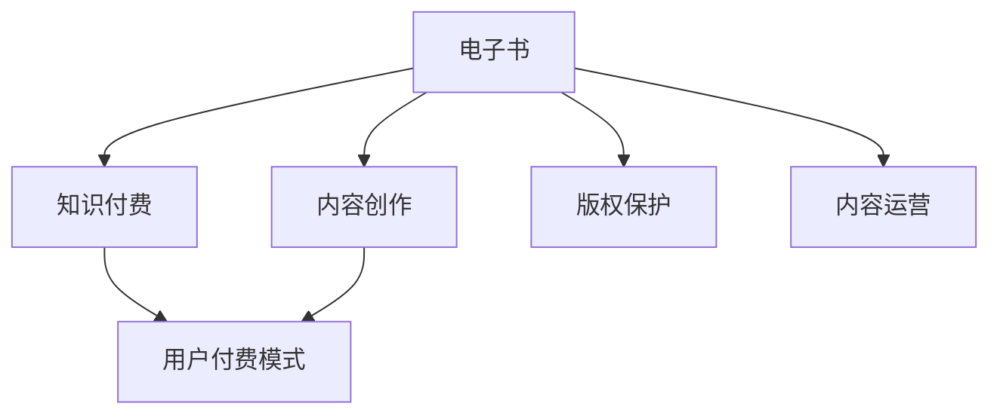

                 

# 如何利用电子书形式进行知识付费

> 关键词：电子书,知识付费,内容创作,用户付费,版权保护,内容运营,数字出版

## 1. 背景介绍

### 1.1 问题由来
随着互联网的普及和数字化进程的加速，人们获取信息的途径越来越多样化。电子书因其便捷、高效、低成本的特点，逐渐成为知识传播和获取的重要形式。但如何实现从内容创作者到用户的价值转化，成为电子书领域的一大挑战。随着知识付费理念的兴起，电子书领域也在积极探索知识付费的商业模式，以保障内容创作人的权益，提升内容价值，促进健康良性的知识生态。

### 1.2 问题核心关键点
电子书知识付费的关键在于构建一个有效的付费机制，使内容创作者能够获得应得的回报，同时用户能够获取高质量的电子书内容。核心的商业运作包括：
- 用户付费模式的选择：包括单次购买、包月订阅、按内容付费等多种方式。
- 付费模式对内容创作的激励作用：如何设计合理的定价策略，使创作者有动力持续创作优质内容。
- 版权保护与内容运营：如何在电子书内容传播过程中，确保内容版权不被侵犯，同时提供便捷的内容获取途径。
- 技术支持与用户体验：如何利用技术手段优化用户阅读体验，增强平台的易用性。

### 1.3 问题研究意义
研究电子书知识付费的商业模式，对于促进电子书行业健康发展，保护内容创作者权益，提升电子书内容质量，具有重要意义：

1. 保障内容创作者权益：通过合理的付费机制，确保创作者能够获得应有的收益，激发创作热情。
2. 提升内容质量：良好的盈利模式能够吸引更多优秀作者，带来更多高质量内容。
3. 用户精准获知：订阅模式能够提供稳定和高质量的内容供应，满足用户个性化阅读需求。
4. 推动技术创新：知识付费模式的探索和优化，能够促进电子书行业的技术进步。
5. 构建健康生态：付费模式能够鼓励良性竞争，提升行业整体水平。

## 2. 核心概念与联系

### 2.1 核心概念概述

为更好地理解电子书知识付费的商业模型，本节将介绍几个核心概念及其联系：

- **电子书(E-Book)**：数字化出版的书籍，通常以PDF、ePub等格式存在，易于搜索、存储和分享。
- **知识付费(Knowledge Pricing)**：用户为获取特定信息或知识而支付费用的行为。电子书知识付费通过为优质内容定价，促进优质内容的创作和传播。
- **内容创作(Content Creation)**：包括电子书内容的创作、编辑、设计等。
- **用户付费模式(User Pricing Model)**：如单次购买、包月订阅、按内容付费等，不同模式对内容创作的激励效果不同。
- **版权保护(Copyright Protection)**：指在电子书内容传播过程中，保护内容创作者版权不被侵犯的机制。
- **内容运营(Content Operation)**：包括内容策划、内容分发、用户互动等，是电子书平台的重要环节。

这些核心概念之间的逻辑关系可以通过以下Mermaid流程图来展示：



这个流程图展示了几大核心概念之间的联系：

1. 电子书作为知识付费和内容创作的基础媒介。
2. 内容创作是电子书知识付费的核心。
3. 用户付费模式是知识付费的实施方式。
4. 版权保护是知识付费实施的基础保障。
5. 内容运营是知识付费和内容创作的辅助手段。

## 3. 核心算法原理 & 具体操作步骤
### 3.1 算法原理概述

电子书知识付费的核心算法原理在于如何设计合理的用户付费模式，以激励内容创作者持续提供优质内容，同时保障内容创作者的权益。典型的付费模式包括：

1. **单次购买模式(Single Purchase)**：用户每次阅读完一本书或一段内容后，需要支付一定的费用。适合获取一次性信息或知识的情况。
2. **包月订阅模式(Monthly Subscription)**：用户每月支付一定费用，获取平台内所有电子书或特定类别的电子书。适合需要稳定、高质量内容的用户。
3. **按内容付费模式(Per-Content Pricing)**：用户每次阅读某本书或某段内容时，根据其付费意愿和内容价值支付相应费用。适合优质内容较多，用户有明确付费意愿的情况。

这些模式的核心在于，如何设计合理的定价策略，使得内容创作者能够获得稳定的收益，同时用户能够支付合理的价格获取高质量内容。

### 3.2 算法步骤详解

电子书知识付费的实现步骤主要包括：

1. **内容创作**：包括但不限于编写、校对、排版、设计等，确保内容质量。
2. **定价策略**：根据内容价值、市场接受度等因素，设定合理的定价策略。
3. **平台搭建**：搭建电子书阅读平台，提供用户注册、付费、阅读等服务。
4. **用户运营**：通过营销活动、推荐算法等手段，吸引更多用户。
5. **支付与结算**：实现用户付费、平台收益的结算系统。
6. **版权保护**：通过数字水印、DRM技术等手段，保护电子书版权。
7. **数据分析**：收集用户阅读行为数据，优化内容推荐、定价策略等。

### 3.3 算法优缺点

电子书知识付费模式具有以下优点：

- **激励创作者**：通过合理的定价策略，能够保障创作者收益，激发其创作动力。
- **质量保障**：付费模式能够吸引优质内容创作者，带来更多高质量内容。
- **用户满意度提升**：用户能够获得稳定、高质量的阅读内容，提升满意度。

但其也存在一些缺点：

- **成本较高**：初期内容创作和平台搭建成本较高。
- **市场接受度**：用户对知识付费的接受度存在地域、年龄、教育背景差异。
- **盗版问题**：电子书版权保护较为复杂，用户容易获取盗版内容。
- **技术要求高**：需要较高的技术支持，如数字水印、DRM等。

### 3.4 算法应用领域

电子书知识付费模式广泛应用于各类电子书平台，如Kindle、Apple Books、微信读书等。用户可以根据自己的需求选择适合的付费模式，获取所需内容。除了传统的图书、学术论文外，电子书领域也在不断拓展，如在线课程、视频教程等。随着技术的进步，电子书知识付费的应用领域将不断扩大。

## 4. 数学模型和公式 & 详细讲解 & 举例说明

### 4.1 数学模型构建

假设电子书平台上有 $N$ 本电子书，每本书的阅读次数为 $R_i$，单价为 $P_i$，总定价为 $C$。用户支付的平均费用为 $\bar{C}$。根据经济学中的边际成本定价原理，每本书的定价应等于其边际成本，即：

$$ P_i = \frac{R_i}{C} $$

平台收益为所有书的总收入，即：

$$ C_{total} = \sum_{i=1}^{N} P_iR_i $$

用户平均支付的费用为总收入除以总阅读次数，即：

$$ \bar{C} = \frac{C_{total}}{\sum_{i=1}^{N} R_i} $$

根据以上模型，平台可以根据每本书的阅读次数，动态调整定价策略，确保收益最大化。

### 4.2 公式推导过程

为了使模型更加简洁，假设所有书的定价相同，即 $P_i = P$，则总收入为：

$$ C_{total} = P \sum_{i=1}^{N} R_i $$

用户平均支付的费用为：

$$ \bar{C} = \frac{P \sum_{i=1}^{N} R_i}{\sum_{i=1}^{N} R_i} = P $$

因此，当所有书的定价相同时，平均支付费用等于每本书的定价。这表明，固定价格策略是一种简单而有效的定价方式。

### 4.3 案例分析与讲解

**案例1: 单次购买模式**

用户一次性购买某本书，平台收入为书籍价格 $P$。如果用户阅读次数较少，阅读体验不佳，可能会选择放弃购买。反之，如果用户阅读次数较多，则有助于平台获得更多收益。因此，单次购买模式适合于短期、低频次阅读的书籍。

**案例2: 包月订阅模式**

用户每月支付一定费用，可以获取平台内所有电子书或特定类别的电子书。平台收入为订阅费用 $S$。用户阅读次数越多，平台收益越高。这种模式适合于需要长期、高频次阅读的书籍。

**案例3: 按内容付费模式**

用户每次阅读某本书或某段内容时，根据其付费意愿和内容价值支付相应费用。平台收入为每次阅读的平均费用 $\bar{C}$。这种模式适合于优质内容较多，用户有明确付费意愿的情况。

以上案例展示了不同的付费模式如何通过定价策略来激励内容创作者和用户。在实际应用中，平台可以根据用户需求和内容特点，灵活选择和组合不同的付费模式。

## 5. 项目实践：代码实例和详细解释说明
### 5.1 开发环境搭建

在进行电子书知识付费的开发实践前，我们需要准备好开发环境。以下是使用Python进行Flask开发的环境配置流程：

1. 安装Anaconda：从官网下载并安装Anaconda，用于创建独立的Python环境。

2. 创建并激活虚拟环境：
```bash
conda create -n book-payment python=3.8 
conda activate book-payment
```

3. 安装Flask：
```bash
pip install flask
```

4. 安装其他相关工具包：
```bash
pip install Jinja2 Flask-SQLAlchemy marshmallow PyJWT Flask-RESTful
```

完成上述步骤后，即可在`book-payment`环境中开始电子书知识付费的开发。

### 5.2 源代码详细实现

下面以电子书订阅服务为例，给出使用Flask框架对电子书订阅功能进行开发的PyTorch代码实现。

首先，定义电子书模型和订阅服务模型：

```python
from flask_sqlalchemy import SQLAlchemy
from flask_marshmallow import Marshmallow

db = SQLAlchemy()
ma = Marshmallow()

class Book(db.Model):
    id = db.Column(db.Integer, primary_key=True)
    title = db.Column(db.String(255), nullable=False)
    author = db.Column(db.String(255), nullable=False)
    price = db.Column(db.Float, nullable=False)
    sales = db.Column(db.Integer, nullable=False)

class BookSchema(ma.SQLAlchemySchema):
    class Meta:
        model = Book

book_schema = BookSchema()
books_schema = BookSchema(many=True)
```

然后，定义订阅服务模型和订阅服务架构：

```python
class Subscription(db.Model):
    id = db.Column(db.Integer, primary_key=True)
    user_id = db.Column(db.Integer, db.ForeignKey('user.id', ondelete='CASCADE'))
    book_id = db.Column(db.Integer, db.ForeignKey('book.id', ondelete='CASCADE'))
    start_date = db.Column(db.DateTime, nullable=False)
    end_date = db.Column(db.DateTime, nullable=False)

class SubscriptionSchema(ma.SQLAlchemySchema):
    class Meta:
        model = Subscription

subscription_schema = SubscriptionSchema()
subscriptions_schema = SubscriptionSchema(many=True)
```

接下来，定义API接口：

```python
from flask import Flask, request, jsonify
from flask_restful import Resource

app = Flask(__name__)

app.config['SQLALCHEMY_DATABASE_URI'] = 'sqlite:///bookstore.db'
app.config['SQLALCHEMY_TRACK_MODIFICATIONS'] = False
db.init_app(app)

books = Book.query.all()
subscriptions = Subscription.query.all()

@app.route('/books', methods=['GET'])
def get_books():
    return jsonify(books_schema.dump(books))

@app.route('/books/<id>', methods=['GET'])
def get_book(id):
    book = Book.query.get_or_404(id)
    return jsonify(book_schema.jsonify(book))

@app.route('/subscriptions', methods=['GET'])
def get_subscriptions():
    return jsonify(subscriptions_schema.dump(subscriptions))

@app.route('/subscriptions/<id>', methods=['GET'])
def get_subscription(id):
    subscription = Subscription.query.get_or_404(id)
    return jsonify(subscription_schema.jsonify(subscription))
```

最后，运行代码并测试API接口：

```python
if __name__ == '__main__':
    app.run(debug=True)
```

### 5.3 代码解读与分析

让我们再详细解读一下关键代码的实现细节：

**Book类和BookSchema**：
- `Book`类定义了电子书的属性和关系，包括id、标题、作者、价格和销售量。
- `BookSchema`类定义了电子书的序列化和反序列化，支持查询、修改电子书的基本操作。

**Subscription类和SubscriptionSchema**：
- `Subscription`类定义了订阅服务的属性和关系，包括用户id、电子书id、订阅开始时间和结束时间。
- `SubscriptionSchema`类定义了订阅服务的序列化和反序列化，支持查询、修改订阅服务的基本操作。

**API接口**：
- 通过Flask和Flask-RESTful，定义了获取电子书和订阅服务的API接口，用户可以通过HTTP请求访问这些接口，获取和修改电子书和订阅服务的数据。

通过Flask框架，我们可以快速搭建电子书订阅服务的API接口，并进行基本的CRUD操作。在实际应用中，还需要加入用户认证、支付功能、搜索推荐等高级功能，才能实现完整的电子书知识付费平台。

## 6. 实际应用场景
### 6.1 在线教育

在线教育平台通过电子书知识付费模式，将优质课程和资源转化为付费内容，保障内容创作者收益，提升课程质量。用户可以根据自己的学习需求，选择订阅特定的课程或包月服务，获得定制化的学习资源。这种模式不仅能够满足用户多样化的学习需求，也能够激励教育机构持续提供高质量的教育内容。

### 6.2 金融投资

金融投资领域涉及大量复杂的金融工具和市场分析。电子书知识付费模式可以提供专业的金融分析报告、市场预测等内容，帮助投资者做出更科学的投资决策。用户可以订阅特定领域的专家报告，获取最新的市场信息。这种模式能够降低投资者获取信息的成本，提升市场决策的准确性和效率。

### 6.3 健康医疗

健康医疗领域涉及大量专业的医学知识和实践经验。电子书知识付费模式可以为医生、护士等提供专业的医学书籍和报告，帮助他们提升医疗水平。用户可以订阅特定领域的医学书籍或报告，获取最新的医疗知识和实践经验。这种模式能够促进医疗知识的传播，提升医疗服务的质量。

### 6.4 未来应用展望

随着电子书知识付费模式的不断发展，其应用领域将不断扩大，涵盖更多行业和领域。未来，电子书知识付费模式将在以下几个方面取得新的突破：

1. **个性化订阅**：根据用户阅读历史和兴趣偏好，推荐个性化的电子书或订阅计划，提升用户体验。
2. **按需定价**：根据内容价值和市场需求，动态调整电子书定价策略，最大化收益。
3. **多平台集成**：实现电子书内容的多平台分发和统一管理，提升内容的传播效率。
4. **智能推荐**：通过算法推荐，帮助用户发现和获取感兴趣的内容，提高用户满意度。
5. **增强互动**：利用社交网络、社区等手段，增强用户之间的互动和分享，提升平台活跃度。

电子书知识付费模式将在未来成为知识传播和获取的重要形式，为各行各业带来新的机遇和挑战。

## 7. 工具和资源推荐
### 7.1 学习资源推荐

为了帮助开发者系统掌握电子书知识付费的理论基础和实践技巧，这里推荐一些优质的学习资源：

1. **《电子书知识付费: 原理与实践》系列博文**：由电子书行业专家撰写，深入浅出地介绍了电子书知识付费的原理、实现和优化技巧。

2. **《电子书营销与付费模式设计》课程**：斯坦福大学开设的电子书营销与付费模式设计课程，涵盖电子书出版的经济学、营销学、运营学等多个方面，是电子书知识付费的综合性学习资源。

3. **《电子书知识付费: 案例分析》书籍**：汇集了电子书知识付费领域的多个成功案例，分析了不同商业模式的优缺点，为读者提供实践参考。

4. **HuggingFace官方文档**：Flask框架的官方文档，提供了丰富的API开发资源和示例代码，是电子书平台开发的必备资料。

5. **CLUE开源项目**：电子书内容推荐基准，涵盖大量不同类型的电子书数据集，并提供了基于电子书知识付费的baseline模型，助力电子书内容推荐。

通过对这些资源的学习实践，相信你一定能够快速掌握电子书知识付费的精髓，并用于解决实际的电子书付费问题。

### 7.2 开发工具推荐

高效的开发离不开优秀的工具支持。以下是几款用于电子书知识付费开发的常用工具：

1. **Flask**：基于Python的开源Web框架，支持RESTful API开发，适合快速搭建电子书知识付费平台。

2. **SQLAlchemy**：Python的ORM框架，提供数据库操作支持，适合电子书内容管理和用户订阅服务的数据存储。

3. **Jinja2**：Python的模板引擎，提供动态网页渲染功能，适合电子书内容的展示和搜索。

4. **PyJWT**：Python的JSON Web Token库，提供用户认证和授权支持，适合电子书平台的用户管理。

5. **Flask-RESTful**：Flask的RESTful扩展，提供API开发支持，适合电子书平台的用户接口开发。

6. **TensorBoard**：TensorFlow配套的可视化工具，可实时监测电子书平台的用户行为，提供丰富的图表呈现方式，是调试和优化平台的得力助手。

合理利用这些工具，可以显著提升电子书知识付费平台的开发效率，加快创新迭代的步伐。

### 7.3 相关论文推荐

电子书知识付费领域的研究仍在不断演进中，以下是几篇奠基性的相关论文，推荐阅读：

1. **《电子书知识付费模式研究》**：对电子书知识付费模式的理论基础、实现方法、用户行为进行了全面分析。

2. **《电子书订阅服务的经济学分析》**：从经济学的角度，分析了电子书订阅服务的定价策略、收益分配等问题。

3. **《电子书知识付费的运营策略》**：提出了电子书知识付费平台的用户运营策略，包括内容推荐、用户互动、社区建设等。

4. **《电子书内容推荐算法研究》**：研究了基于推荐算法的内容推荐技术，提升了电子书平台的个性化服务水平。

5. **《电子书版权保护技术》**：介绍了电子书版权保护的技术手段，如数字水印、DRM技术等，为电子书知识付费提供了技术保障。

这些论文代表了大电子书知识付费领域的研究进展，通过学习这些前沿成果，可以帮助研究者把握学科前进方向，激发更多的创新灵感。

## 8. 总结：未来发展趋势与挑战
### 8.1 总结

本文对电子书知识付费的商业模式进行了全面系统的介绍。首先阐述了电子书知识付费的背景和意义，明确了知识付费在电子书领域的重要作用。其次，从原理到实践，详细讲解了电子书知识付费的数学模型、算法步骤和关键参数，给出了电子书知识付费开发的具体代码实现。同时，本文还广泛探讨了电子书知识付费在在线教育、金融投资、健康医疗等众多领域的应用前景，展示了电子书知识付费的广阔前景。最后，本文精选了电子书知识付费的学习资源、开发工具和相关论文，力求为读者提供全方位的技术指引。

通过本文的系统梳理，可以看到，电子书知识付费模式正在成为电子书行业的重要范式，极大地拓展了电子书的内容价值和传播渠道，提升了内容创作者和用户的满意度。未来，伴随电子书行业的发展和技术进步，电子书知识付费模式还将不断优化和升级，为各行各业的知识传播和获取提供新的途径。

### 8.2 未来发展趋势

展望未来，电子书知识付费模式将呈现以下几个发展趋势：

1. **技术创新**：随着人工智能、大数据等技术的进步，电子书知识付费模式将更加智能化、个性化，提供更加精准的内容推荐和优质阅读体验。

2. **跨平台整合**：实现电子书内容的多平台分发和统一管理，提升内容的传播效率和用户覆盖面。

3. **内容多样性**：随着电子书内容的多样化，电子书知识付费模式将涵盖更多领域，如在线课程、视频教程、专业报告等。

4. **全球化推广**：电子书知识付费模式将面向全球市场推广，吸引更多用户，提升平台国际影响力。

5. **社会责任**：电子书知识付费平台将承担更多社会责任，提供优质的公共学习资源，助力教育公平和知识普及。

### 8.3 面临的挑战

尽管电子书知识付费模式已经取得了一定的进展，但在迈向更加智能化、普适化应用的过程中，它仍面临着诸多挑战：

1. **盗版问题**：电子书版权保护较为复杂，用户容易获取盗版内容，平台需要投入大量资源进行版权监控。

2. **用户接受度**：用户对知识付费的接受度存在地域、年龄、教育背景差异，推广难度较大。

3. **内容质量**：如何保障内容质量，避免劣质内容泛滥，提升用户满意度，是电子书知识付费平台的重要任务。

4. **技术壁垒**：需要较高的技术支持，如数字水印、DRM技术等，增加了平台的开发和维护成本。

5. **市场竞争**：电子书市场竞争激烈，如何保持平台的用户粘性和市场竞争力，是电子书知识付费平台需要持续关注的问题。

### 8.4 研究展望

面对电子书知识付费模式所面临的挑战，未来的研究需要在以下几个方面寻求新的突破：

1. **技术创新**：探索更高效、便捷的电子书版权保护技术，提升内容安全性。

2. **用户体验优化**：通过算法优化，提升电子书平台的个性化服务水平，增强用户体验。

3. **内容质量保障**：建立内容质量评估机制，引入专家评审和用户评价，提升内容质量。

4. **用户教育**：通过各种宣传活动，提升用户对知识付费的认识和接受度。

5. **市场拓展**：开拓更多市场，吸引更多用户，提升平台国际影响力。

6. **合作共赢**：与内容创作者、教育机构等建立合作关系，共同提升平台内容和服务的质量。

这些研究方向的探索，必将引领电子书知识付费模式迈向更高的台阶，为电子书行业的发展注入新的动力。面向未来，电子书知识付费模式还需要与其他人工智能技术进行更深入的融合，如内容推荐、智能搜索、语音识别等，多路径协同发力，共同推动电子书知识付费技术的进步。只有勇于创新、敢于突破，才能不断拓展电子书知识付费的边界，让电子书知识付费模式更好地造福人类社会。

## 9. 附录：常见问题与解答

**Q1：电子书知识付费是否适用于所有电子书内容？**

A: 电子书知识付费模式适用于大多数优质内容，但不适合公共领域、通用常识、简单科普等无版权或版权授权内容的电子书。这些内容的传播应当遵守相关的版权法规和公共许可协议。

**Q2：电子书知识付费对内容创作者有哪些激励作用？**

A: 电子书知识付费模式能够保障内容创作者获得稳定的收益，激发其创作热情。具体激励作用包括：
1. **收入保障**：创作者通过合理定价，获得可观的收入，保障生活开销和创作成本。
2. **作品曝光**：优质内容能够获得更多曝光机会，提升创作者的知名度和影响力。
3. **平台支持**：平台提供技术支持、市场推广、用户反馈等，帮助创作者提升内容质量。

**Q3：电子书知识付费是否适合所有的用户？**

A: 电子书知识付费模式适合于对优质内容有明确需求的用户。这些用户通常具有较高的教育背景和经济能力，愿意为有价值的信息付费。对于大多数用户，电子书免费模式更为友好，能够提供更广泛的阅读选择。

**Q4：电子书知识付费对用户有哪些好处？**

A: 电子书知识付费模式能够提供高质量、稳定和个性化的电子书内容，提升用户的阅读体验。具体好处包括：
1. **内容质量保障**：付费模式能够吸引优质内容创作者，带来更多高质量的电子书。
2. **阅读体验优化**：平台提供定制化的阅读服务和丰富的功能支持，提升阅读体验。
3. **社群互动**：平台提供用户交流平台，便于用户分享和讨论电子书内容，提升社交价值。

**Q5：电子书知识付费在实际应用中需要注意哪些问题？**

A: 电子书知识付费在实际应用中需要注意以下问题：
1. **盗版问题**：采取有效的版权保护技术，防止电子书被盗版。
2. **用户体验**：优化电子书平台的用户界面和阅读体验，提升用户满意度。
3. **内容质量**：建立内容质量评估机制，保障内容价值和质量。
4. **市场推广**：制定有效的市场推广策略，吸引更多用户。
5. **合作共赢**：与内容创作者、出版商等建立合作关系，共同提升平台内容和服务的质量。

通过注意以上问题，可以有效提升电子书知识付费模式的运营效果，吸引更多用户和创作者，实现健康良性的发展。

---

作者：禅与计算机程序设计艺术 / Zen and the Art of Computer Programming

