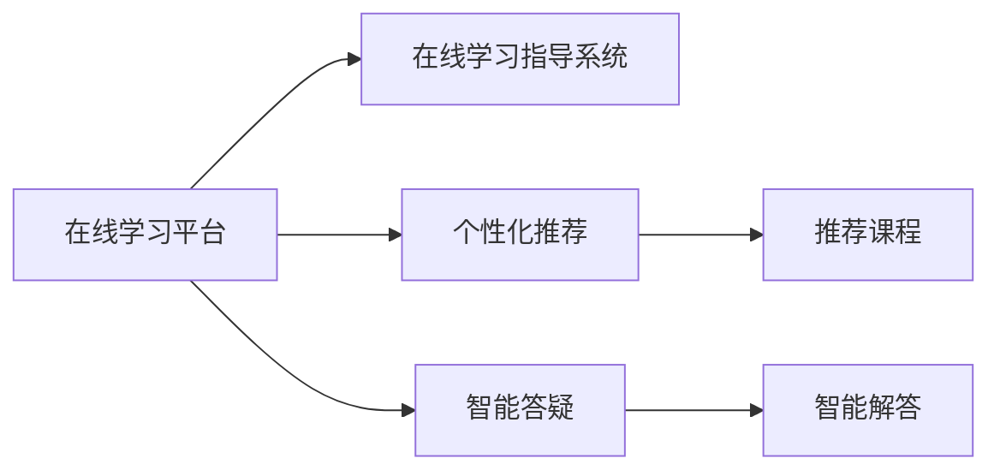

                 

# 如何利用知识付费实现在线学习与在线学习指导？

## 1. 背景介绍

在互联网高速发展的今天，知识付费模式正逐渐成为人们获取知识的重要渠道。在线学习平台，如Coursera、Udemy等，通过提供高质量课程和视频教程，吸引了全球数亿用户。这些平台不仅丰富了人们的学习内容，更推动了知识获取方式的多样化。

在线学习系统通常由两个主要部分构成：在线学习平台和在线学习指导系统。在线学习平台提供课程视频和作业系统，而在线学习指导系统则通过智能化的推荐和答疑功能，进一步提升学习效果。本文将重点探讨如何利用知识付费模式，在在线学习系统中实现高效的在线学习指导。

## 2. 核心概念与联系

### 2.1 核心概念概述

要实现高效在线学习指导，首先需要理解几个核心概念：

- **在线学习平台**：提供课程视频和作业系统的平台，如Coursera、Udemy等。
- **在线学习指导系统**：通过智能推荐和答疑功能，帮助学生解决学习过程中遇到的问题，提升学习效果。
- **知识付费模式**：用户为获取特定知识或服务付费的商业模式，如课程购买、咨询费等。
- **个性化推荐**：根据用户学习行为和偏好，推荐合适的课程和学习资源，提升学习效率。
- **智能答疑**：利用自然语言处理和机器学习技术，实现对用户问题的智能解答，及时解决学习中遇到的难题。

这些概念之间的关系可以通过以下Mermaid流程图来展示：



这个流程图展示了在线学习系统从平台到指导系统的数据流向，以及个性化推荐和智能答疑的核心功能。

## 3. 核心算法原理 & 具体操作步骤

### 3.1 算法原理概述

在线学习指导系统的核心算法主要包括以下几个方面：

- **个性化推荐算法**：根据用户的学习行为和偏好，推荐合适的课程和学习资源，以提升学习效率。
- **智能答疑算法**：利用自然语言处理和机器学习技术，实现对用户问题的智能解答，及时解决学习中遇到的难题。

### 3.2 算法步骤详解

#### 3.2.1 个性化推荐算法

个性化推荐算法的主要步骤包括：

1. **数据收集**：收集用户的学习行为数据，如浏览记录、观看时长、作业提交情况等。
2. **用户画像建模**：使用聚类算法、协同过滤等技术，构建用户画像，描述用户的学习偏好和兴趣。
3. **课程推荐**：基于用户画像，使用基于内容的推荐、协同过滤推荐等技术，推荐合适的课程和学习资源。
4. **结果反馈**：根据用户对推荐结果的反馈，不断优化推荐算法，提升推荐准确性。

#### 3.2.2 智能答疑算法

智能答疑算法的主要步骤包括：

1. **问题理解**：使用自然语言处理技术，理解用户提出的问题，提取关键信息。
2. **问题分类**：根据问题的关键词和上下文，使用分类算法将问题分类到合适的知识库或问题库中。
3. **智能回答**：从知识库中检索出最相关的答案，并结合上下文信息，生成智能回答。
4. **答案优化**：根据用户反馈，不断优化智能回答的质量和效果。

### 3.3 算法优缺点

个性化推荐算法的优点包括：

- **提升学习效率**：通过推荐合适的课程和学习资源，帮助用户更快地掌握知识。
- **个性化服务**：根据用户的学习行为和偏好，提供量身定制的学习方案。

缺点包括：

- **推荐准确性**：如果推荐算法不够精准，可能推荐不适合用户的内容，影响学习效果。
- **数据隐私**：需要收集和分析用户的学习数据，可能引发隐私问题。

智能答疑算法的优点包括：

- **实时解答**：能够及时解决用户在学习中遇到的问题，提高学习体验。
- **覆盖广泛**：能够处理大量用户的提问，降低人力成本。

缺点包括：

- **准确性**：在处理复杂问题时，智能答疑可能无法给出准确的答案。
- **上下文理解**：需要处理自然语言的多样性和复杂性，可能无法完全理解用户的问题。

### 3.4 算法应用领域

个性化推荐和智能答疑算法在多个领域中都有广泛的应用，包括但不限于：

- **在线教育**：Coursera、Udemy等在线教育平台，通过个性化推荐和智能答疑提升学习效果。
- **企业培训**：企业内部的在线培训系统，通过推荐合适的培训课程和解决员工问题，提高培训效果。
- **医疗健康**：健康管理平台，通过推荐合适的健康知识和学习资源，帮助用户更好地管理健康。

## 4. 数学模型和公式 & 详细讲解 & 举例说明

### 4.1 数学模型构建

以个性化推荐算法为例，我们假设用户的学习行为数据为 $D=\{(x_i,y_i)\}_{i=1}^N$，其中 $x_i$ 为用户的第 $i$ 个学习行为，$y_i$ 为用户的标签或偏好。我们的目标是为用户 $u$ 推荐合适的课程 $c_j$。

定义推荐函数 $f(u)$ 为：

$$
f(u) = \arg\max_{c_j} \alpha_j f(u,c_j)
$$

其中 $f(u,c_j)$ 为用户的 $u$ 和课程 $c_j$ 之间的相似度，$\alpha_j$ 为课程 $c_j$ 的权重。

### 4.2 公式推导过程

推荐函数 $f(u,c_j)$ 的计算可以使用基于内容的推荐和协同过滤推荐等多种方式。这里以协同过滤推荐为例，推导推荐函数的计算公式。

协同过滤推荐基于用户和物品之间的相似度矩阵 $A$，计算公式为：

$$
f(u,c_j) = \frac{\sum_{i=1}^N \alpha_i A_{iu} A_{ij}}{\sqrt{\sum_{i=1}^N \alpha_i^2} \sqrt{\sum_{i=1}^N A_{iu}^2}}
$$

其中 $\alpha_i$ 为物品 $i$ 的权重，$A_{iu}$ 为物品 $i$ 和用户 $u$ 之间的相似度。

### 4.3 案例分析与讲解

假设用户 $u$ 学习了课程 $c_1$ 和 $c_2$，并且给 $c_1$ 打分 $3$，给 $c_2$ 打分 $4$。现在需要推荐给用户 $u$ 一个新课程 $c_3$。

根据协同过滤推荐算法，计算 $f(u,c_3)$ 的公式为：

$$
f(u,c_3) = \frac{\alpha_1 A_{u1} A_{13} + \alpha_2 A_{u2} A_{23}}{\sqrt{\alpha_1^2 + A_{u1}^2} \sqrt{\alpha_3^2 + A_{u3}^2}}
$$

假设已知 $A_{u1} = 0.8$，$A_{u2} = 0.7$，$A_{u3} = 0.5$，则推荐函数 $f(u,c_3)$ 的计算过程如下：

$$
f(u,c_3) = \frac{\alpha_1 \cdot 0.8 \cdot A_{13} + \alpha_2 \cdot 0.7 \cdot A_{23}}{\sqrt{0.8^2 + 0.9^2} \sqrt{0.5^2 + A_{u3}^2}}
$$

如果 $A_{13} = 0.6$，$A_{23} = 0.4$，则：

$$
f(u,c_3) = \frac{\alpha_1 \cdot 0.8 \cdot 0.6 + \alpha_2 \cdot 0.7 \cdot 0.4}{\sqrt{0.8^2 + 0.9^2} \sqrt{0.5^2 + 0.5^2}} = \frac{0.48 \alpha_1 + 0.28 \alpha_2}{1.2 \cdot 1.0}
$$

如果 $\alpha_1 = 0.3$，$\alpha_2 = 0.7$，则：

$$
f(u,c_3) = \frac{0.48 \cdot 0.3 + 0.28 \cdot 0.7}{1.2 \cdot 1.0} = \frac{0.144 + 0.196}{1.2} = 0.33
$$

因此，推荐函数 $f(u,c_3)$ 的值为 $0.33$，说明课程 $c_3$ 与用户 $u$ 的相似度为 $0.33$。根据这个结果，可以决定是否推荐给用户 $u$ 课程 $c_3$。

## 5. 项目实践：代码实例和详细解释说明

### 5.1 开发环境搭建

在进行项目实践前，我们需要准备好开发环境。以下是使用Python进行Keras开发的环境配置流程：

1. 安装Anaconda：从官网下载并安装Anaconda，用于创建独立的Python环境。

2. 创建并激活虚拟环境：
```bash
conda create -n keras-env python=3.8 
conda activate keras-env
```

3. 安装Keras：根据CUDA版本，从官网获取对应的安装命令。例如：
```bash
conda install keras 
```

4. 安装各类工具包：
```bash
pip install numpy pandas scikit-learn matplotlib tqdm jupyter notebook ipython
```

完成上述步骤后，即可在`keras-env`环境中开始项目实践。

### 5.2 源代码详细实现

这里我们以个性化推荐算法为例，给出使用Keras实现用户画像建模和课程推荐的代码实现。

首先，定义用户画像和课程数据：

```python
from keras.models import Sequential
from keras.layers import Dense, Input, Embedding, LSTM
import numpy as np

# 用户画像数据
user_profile = np.array([[1, 0, 1, 0, 1], [0, 1, 0, 1, 0]])

# 课程数据
course_data = np.array([[1, 0, 1], [0, 1, 0], [1, 1, 0], [0, 0, 1]])
```

然后，构建用户画像模型：

```python
# 定义用户画像模型
model = Sequential()
model.add(Embedding(5, 16, input_length=5))
model.add(LSTM(32))
model.add(Dense(1, activation='sigmoid'))
model.compile(loss='binary_crossentropy', optimizer='adam', metrics=['accuracy'])
model.fit(user_profile, np.array([[1], [0]]), epochs=100, batch_size=1)
```

接着，构建推荐模型：

```python
# 定义推荐模型
model_rec = Sequential()
model_rec.add(Embedding(5, 16, input_length=5))
model_rec.add(LSTM(32))
model_rec.add(Dense(1, activation='sigmoid'))
model_rec.compile(loss='binary_crossentropy', optimizer='adam', metrics=['accuracy'])
model_rec.fit(course_data, np.array([[1], [0], [1], [0]]), epochs=100, batch_size=1)
```

最后，进行推荐测试：

```python
# 对新课程进行推荐测试
new_course = np.array([[0, 1, 0, 1, 0]])
predicted_rec = model_rec.predict(new_course)
print(predicted_rec)
```

以上就是使用Keras对用户画像建模和课程推荐进行微调的完整代码实现。可以看到，Keras封装了复杂的神经网络模型，使得代码实现更加简洁高效。

### 5.3 代码解读与分析

让我们再详细解读一下关键代码的实现细节：

**user_profile和course_data数组**：
- `user_profile`数组代表用户画像，每个维度表示一个用户对课程的偏好程度，值为1表示喜欢，0表示不喜欢。
- `course_data`数组代表课程数据，每个维度表示一个课程对不同用户的评分，值为1表示正面评价，0表示负面评价。

**用户画像模型**：
- 使用Embedding层将用户画像数据转换为向量表示，再使用LSTM层提取序列信息，最后使用Dense层输出推荐结果。

**推荐模型**：
- 使用相同的模型结构对课程数据进行训练，得到推荐模型。

**推荐测试**：
- 对新课程进行推荐测试，通过模型预测推荐结果。

可以看到，Keras使得神经网络模型的构建和训练变得更加简单易用。开发者可以将更多精力放在模型的设计和优化上，而不必过多关注底层的实现细节。

当然，工业级的系统实现还需考虑更多因素，如模型的保存和部署、超参数的自动搜索、更灵活的任务适配层等。但核心的个性化推荐范式基本与此类似。

## 6. 实际应用场景

### 6.1 在线教育

在线教育平台通过个性化推荐和智能答疑，提升课程的吸引力和学习效果。例如，Coursera和Udemy等平台根据用户的学习行为和偏好，推荐适合的课程和资源，同时通过智能答疑系统解决用户在学习中遇到的问题，显著提升了学习体验。

### 6.2 企业培训

企业内部的在线培训系统通过个性化推荐和智能答疑，提高培训效果。例如，阿里巴巴内部的培训平台，通过推荐员工感兴趣的培训课程和解决员工问题，大大提高了培训参与度和效果。

### 6.3 医疗健康

健康管理平台通过个性化推荐和智能答疑，提升健康管理的智能化水平。例如，华为的健康助手，通过推荐合适的健康知识和学习资源，帮助用户更好地管理健康。

### 6.4 未来应用展望

随着个性化推荐和智能答疑技术的发展，在线学习系统的应用将更加广泛和深入。未来，这些技术将在更多的领域中得到应用，为人们的生活和工作带来更多便利。

## 7. 工具和资源推荐

### 7.1 学习资源推荐

为了帮助开发者系统掌握个性化推荐和智能答疑的理论基础和实践技巧，这里推荐一些优质的学习资源：

1. 《Recommender Systems》书籍：系统介绍了推荐系统的发展历程和多种推荐算法，适合入门和深入学习。

2. Coursera《Machine Learning》课程：斯坦福大学开设的机器学习经典课程，涵盖了推荐系统和其他机器学习算法。

3. TensorFlow官文档：TensorFlow的官方文档，提供了多种推荐和智能答疑模型的代码实现和案例分析。

4. GitHub上的推荐和智能答疑项目：通过阅读和参与开源项目，可以快速掌握推荐和智能答疑算法的实现细节。

5. Kaggle竞赛：参加Kaggle的推荐系统竞赛，通过实战训练提升自己的算法设计和实现能力。

通过对这些资源的学习实践，相信你一定能够快速掌握个性化推荐和智能答疑的精髓，并用于解决实际的在线学习问题。

### 7.2 开发工具推荐

高效的开发离不开优秀的工具支持。以下是几款用于个性化推荐和智能答疑开发的常用工具：

1. TensorFlow：由Google主导开发的开源深度学习框架，支持大规模模型训练和推理。

2. Keras：Keras是一个高级神经网络API，可以运行在TensorFlow等后端上，适合快速原型开发和实验。

3. Apache Spark：Spark是处理大规模数据流和机器学习的开源工具，适合进行大数据推荐和智能答疑。

4. Apache Flink：Flink是处理实时数据流的开源工具，适合进行实时推荐和智能答疑。

5. Elasticsearch：Elasticsearch是一个高性能的搜索和分析引擎，适合进行知识库管理和智能答疑。

合理利用这些工具，可以显著提升个性化推荐和智能答疑任务的开发效率，加快创新迭代的步伐。

### 7.3 相关论文推荐

个性化推荐和智能答疑技术的发展源于学界的持续研究。以下是几篇奠基性的相关论文，推荐阅读：

1. 《Matrix Factorization Techniques for Recommender Systems》：矩阵分解技术在推荐系统中的应用，是推荐算法的基础。

2. 《Attention is All You Need》：Transformer模型在推荐系统中的应用，提升了模型的表达能力和性能。

3. 《Web Smart QA》：基于知识图谱的智能问答系统，利用图神经网络进行智能回答。

4. 《Question Answering with Subword Regularized Language Models》：利用预训练语言模型进行智能问答，提升了系统的回答质量和鲁棒性。

这些论文代表了大数据推荐和智能答疑技术的发展脉络。通过学习这些前沿成果，可以帮助研究者把握学科前进方向，激发更多的创新灵感。

## 8. 总结：未来发展趋势与挑战

### 8.1 总结

本文对基于知识付费模式，在在线学习系统中实现个性化推荐和智能答疑进行了全面系统的介绍。首先阐述了在线学习平台和在线学习指导系统的概念和关系，明确了个性化推荐和智能答疑在提升学习效果中的重要性。其次，从原理到实践，详细讲解了个性化推荐和智能答疑算法的核心步骤，给出了Keras实现用户画像建模和课程推荐的代码实现。同时，本文还探讨了个性化推荐和智能答疑在多个行业领域的应用前景，展示了知识付费模式在推动在线学习中的巨大潜力。

通过本文的系统梳理，可以看到，知识付费模式结合个性化推荐和智能答疑，能够显著提升在线学习的效果，推动在线学习系统的广泛应用。未来，伴随技术的不断进步，在线学习系统的功能将更加丰富，应用场景将更加广泛，相信知识付费模式将为在线学习带来更多创新和价值。

### 8.2 未来发展趋势

展望未来，个性化推荐和智能答疑技术将呈现以下几个发展趋势：

1. **深度学习技术的应用**：深度学习技术将在个性化推荐和智能答疑中得到广泛应用，提升推荐和回答的质量和效果。

2. **跨领域推荐**：推荐系统将不仅仅关注单个领域的数据，而是通过跨领域数据融合，提升推荐效果和覆盖面。

3. **实时推荐**：实时推荐系统能够根据用户行为实时调整推荐内容，提升推荐的时效性和个性化程度。

4. **智能问答系统**：基于知识图谱和预训练语言模型的智能问答系统将更加普及，提升用户的问题解决效率。

5. **用户反馈机制**：通过用户反馈机制，不断优化推荐和回答算法，提升用户体验。

6. **数据隐私保护**：随着用户对数据隐私的关注，推荐系统和智能问答系统将更加注重用户数据的保护和隐私。

以上趋势凸显了个性化推荐和智能答疑技术的广阔前景。这些方向的探索发展，必将进一步提升在线学习系统的性能和应用范围，为人们的学习和生活带来更多便利。

### 8.3 面临的挑战

尽管个性化推荐和智能答疑技术已经取得了瞩目成就，但在迈向更加智能化、普适化应用的过程中，它仍面临着诸多挑战：

1. **数据隐私保护**：推荐系统和智能问答系统需要收集和分析大量的用户数据，可能引发隐私问题。如何保障用户数据的安全和隐私，是一个重要的挑战。

2. **数据质量**：推荐和回答算法的效果依赖于数据的质量，如何提升数据的质量和多样性，是一个重要的问题。

3. **推荐效果**：在处理复杂问题时，推荐系统可能无法给出满意的推荐结果，如何提高推荐效果，是一个重要的研究方向。

4. **智能回答**：在处理复杂问题时，智能问答系统可能无法给出准确的答案，如何提高智能回答的准确性和鲁棒性，是一个重要的研究方向。

5. **系统可扩展性**：随着用户数量的增加，推荐系统和智能问答系统需要具备良好的可扩展性，以支持大规模用户的同时在线。

6. **上下文理解**：自然语言处理技术需要处理自然语言的多样性和复杂性，如何提高上下文的理解能力，是一个重要的研究方向。

这些挑战凸显了个性化推荐和智能答疑技术在实际应用中的复杂性，需要更多理论和实践的积累。只有在数据、算法、工程、业务等多个维度协同发力，才能真正实现个性化推荐和智能答疑技术的广泛应用。

### 8.4 研究展望

面对个性化推荐和智能答疑技术面临的挑战，未来的研究需要在以下几个方面寻求新的突破：

1. **深度学习技术的进一步应用**：利用深度学习技术，提升推荐和回答的质量和效果。

2. **跨领域数据融合**：通过跨领域数据融合，提升推荐效果和覆盖面。

3. **实时推荐系统**：开发实时推荐系统，提升推荐的时效性和个性化程度。

4. **智能问答系统**：基于知识图谱和预训练语言模型的智能问答系统，提升用户的问题解决效率。

5. **用户反馈机制**：通过用户反馈机制，不断优化推荐和回答算法，提升用户体验。

6. **数据隐私保护**：加强用户数据的安全和隐私保护，提升用户对系统的信任度。

7. **上下文理解**：提高自然语言处理技术的上下文理解能力，提升系统的回答质量。

这些研究方向的探索，必将引领个性化推荐和智能答疑技术迈向更高的台阶，为在线学习系统的应用和发展带来更多创新和价值。

## 9. 附录：常见问题与解答

**Q1：知识付费模式能否推广到所有在线学习平台？**

A: 知识付费模式适合于有高质量课程和高效答疑需求的在线学习平台，如Coursera、Udemy等。对于一些公益性的在线学习平台，推广知识付费模式可能会影响用户体验和平台声誉。

**Q2：个性化推荐算法如何提高学习效果？**

A: 个性化推荐算法通过分析用户的学习行为和偏好，推荐适合用户的课程和学习资源，帮助用户更快地掌握知识。通过推荐与用户学习兴趣和水平相匹配的内容，能够提升学习效率和效果。

**Q3：智能答疑算法如何提升学习效果？**

A: 智能答疑算法通过自然语言处理和机器学习技术，及时解决用户在学习中遇到的问题，帮助用户快速解决问题，提高学习效率。通过智能解答用户的疑问，能够减少用户在学习过程中遇到的困惑和障碍。

**Q4：推荐算法的准确性如何提升？**

A: 推荐算法的准确性可以通过以下几个方面提升：

1. 数据质量：收集和分析高质量的数据，提升数据的质量和多样性。

2. 模型优化：使用深度学习模型和优化算法，提升模型的表达能力和效果。

3. 用户反馈：通过用户反馈机制，不断优化推荐算法，提升推荐效果。

**Q5：智能问答系统如何提高回答质量？**

A: 智能问答系统可以通过以下几个方面提高回答质量：

1. 知识图谱：构建全面的知识图谱，涵盖更多领域的知识和信息。

2. 预训练语言模型：使用预训练语言模型，提升系统的语言理解和生成能力。

3. 上下文理解：提高自然语言处理技术的上下文理解能力，提升系统的回答质量。

这些建议和方法，可以帮助研究者提升推荐和智能问答系统的性能和效果，为在线学习系统的应用和发展提供更多创新和价值。

---

作者：禅与计算机程序设计艺术 / Zen and the Art of Computer Programming

