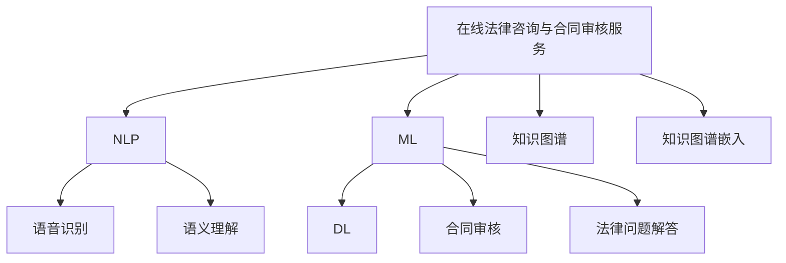

                 

## 1. 背景介绍

### 1.1 问题由来

在数字化时代，知识付费领域迎来了迅猛发展。用户对信息需求的多样化和即时化，促进了知识付费产品的丰富化和智能化。在线法律咨询与合同审核服务作为知识付费的重要组成部分，具有高度的专业性和严肃性，是律师和法律爱好者共同关心的焦点。

传统法律咨询与合同审核服务存在着效率低下、成本高昂、服务标准化程度低等问题，亟需借助信息技术提升服务质量和效率。而随着人工智能技术的发展，通过知识付费的形式提供高质量、低成本、高效率的法律咨询服务，成为现实可行的解决方案。

### 1.2 问题核心关键点

在线法律咨询与合同审核服务的关键点包括：
- **服务标准化**：确保服务的质量、效率和可重复性。
- **信息安全**：保护用户隐私和数据安全。
- **成本效益**：降低用户的付费成本，提升服务性价比。
- **法律合规**：确保服务符合相关法律法规。
- **用户体验**：提升用户使用便捷性，增强用户满意度。

这些关键点共同构成了在线法律咨询与合同审核服务的目标和挑战。

### 1.3 问题研究意义

在线法律咨询与合同审核服务的知识付费模式，不仅有助于提升法律服务的标准化、智能化和个性化，还可以降低用户获取法律服务的门槛，促进法律知识的普及和应用。通过这种模式，律师可以更高效地接触到大量潜在客户，提升其业务收入。

同时，这种服务模式可以带动法律技术的发展，加速法律智能化的进程，有助于构建更完善、更高效、更灵活的法律服务体系，为经济社会发展提供有力支撑。

## 2. 核心概念与联系

### 2.1 核心概念概述

为更好地理解在线法律咨询与合同审核服务的技术实现，本节将介绍几个密切相关的核心概念：

- **在线法律咨询与合同审核服务**：基于人工智能技术，通过知识付费的形式，为用户提供标准化的法律咨询与合同审核服务，旨在解决法律问题、规避合同风险。
- **自然语言处理(NLP)**：通过计算机处理和理解人类语言，实现语音识别、语义理解、文本分析等能力，是构建智能法律咨询服务的基础。
- **机器学习(ML)**：使计算机系统能够从数据中学习，提升其预测和决策能力，用于合同审核、法律问题解答等任务。
- **深度学习(DL)**：一种机器学习的分支，通过构建复杂神经网络模型，提升对非结构化数据的学习和处理能力。
- **知识图谱(KG)**：以图的形式，将知识元素和关系结构化组织起来，便于机器理解和推理，用于法律知识的管理和检索。
- **知识图谱嵌入(KGE)**：将自然语言中的知识映射到低维向量空间，便于模型处理和推理，用于法律知识的表示和检索。

这些核心概念之间的逻辑关系可以通过以下Mermaid流程图来展示：



这个流程图展示了大语言模型的核心概念及其之间的关系：

1. 在线法律咨询与合同审核服务以NLP、ML、DL等技术为基础，提供智能化的法律咨询服务。
2. 语音识别和语义理解技术使得用户可以以自然语言形式进行咨询。
3. 合同审核和法律问题解答依赖于DL和ML技术，构建高效准确的模型。
4. 知识图谱和知识图谱嵌入技术用于法律知识的管理和检索，提升服务的智能化和标准化水平。

这些概念共同构成了在线法律咨询与合同审核服务的技术框架，使其能够高效、准确地提供法律服务。

## 3. 核心算法原理 & 具体操作步骤
### 3.1 算法原理概述

在线法律咨询与合同审核服务的核心算法主要围绕NLP、ML、DL和知识图谱嵌入技术展开。其核心思想是通过这些技术，构建智能化的法律咨询与合同审核模型，为用户提供高效、精准的服务。

以合同审核为例，假设有大量的历史合同文本数据 $D=\{(x_i,y_i)\}_{i=1}^N$，其中 $x_i$ 为合同文本，$y_i$ 为审核结果标签。合同审核模型的目标是最小化经验风险，即：

$$
\theta^* = \mathop{\arg\min}_{\theta} \mathcal{L}(\theta, D)
$$

其中 $\mathcal{L}$ 为损失函数，通常为交叉熵损失或均方误差损失。通过梯度下降等优化算法，最小化损失函数，训练出最佳的模型参数 $\theta^*$。

### 3.2 算法步骤详解

在线法律咨询与合同审核服务的具体操作步骤如下：

**Step 1: 准备数据集**
- 收集大量的历史合同文本和审核结果，构建训练集 $D$。
- 将合同文本和审核结果进行标注，构建标注数据集。

**Step 2: 构建模型**
- 选择合适的预训练模型作为初始化参数，如BERT、GPT等。
- 在预训练模型的基础上，设计适合的输出层和损失函数。
- 选择优化算法和超参数，如学习率、批大小等。

**Step 3: 训练模型**
- 将标注数据集划分为训练集、验证集和测试集。
- 使用训练集对模型进行有监督的梯度下降训练。
- 在验证集上评估模型性能，调整模型参数。
- 在测试集上最终评估模型性能。

**Step 4: 部署模型**
- 将训练好的模型部署到服务端，提供接口供用户调用。
- 集成用户交互界面，使用户能够便捷地提交咨询问题或合同文本。
- 通过API接口调用模型，返回预测结果或建议。

**Step 5: 用户反馈**
- 收集用户对服务质量的反馈，用于后续模型的改进。
- 根据用户反馈，进行模型的再训练和优化。

### 3.3 算法优缺点

在线法律咨询与合同审核服务的算法具有以下优点：
- **高效性**：利用预训练模型和微调技术，可以快速构建高效准确的法律咨询与合同审核模型。
- **精准性**：结合ML、DL等技术，能够准确地预测合同风险、解答法律问题。
- **低成本**：通过知识付费模式，降低了法律服务的获取成本。
- **可扩展性**：可以方便地扩展到其他法律咨询任务，如仲裁、调解等。

同时，该算法也存在一些局限性：
- **依赖数据质量**：数据标注的质量和数量直接影响模型性能。
- **模型偏见**：模型可能学习到数据中的偏见，产生不公平的输出。
- **隐私风险**：用户提交的敏感信息可能存在隐私泄露的风险。
- **法律合规**：模型输出的法律建议需要符合相关法律法规，存在合规性风险。

尽管存在这些局限性，但在线法律咨询与合同审核服务的算法在实践中已经取得了良好的效果，有望进一步优化和完善，成为未来法律服务的重要方向。

### 3.4 算法应用领域

在线法律咨询与合同审核服务的算法已经在诸多领域得到了应用，例如：

- **企业法律咨询**：为企业提供合同审核、法律风险评估等服务。
- **个人法律咨询**：为个人提供法律问题解答、合同审核等服务。
- **在线仲裁**：利用合同审核和法律问题解答技术，实现在线仲裁。
- **智能合约**：结合合同审核技术，实现智能合约的自动化执行。

除了这些常见领域外，该技术还被创新性地应用到更多场景中，如法律知识库的构建、法律文献的自动分类、法律教育的智能辅助等，为法律服务带来了全新的突破。

## 4. 数学模型和公式 & 详细讲解 & 举例说明
### 4.1 数学模型构建

在线法律咨询与合同审核服务的数学模型构建主要围绕交叉熵损失函数和梯度下降算法展开。假设有训练集 $D=\{(x_i,y_i)\}_{i=1}^N$，其中 $x_i$ 为合同文本，$y_i$ 为审核结果标签，$M_{\theta}$ 为预训练的合同审核模型。

定义损失函数为交叉熵损失函数：

$$
\ell(M_{\theta}(x),y) = -y\log(M_{\theta}(x))-(1-y)\log(1-M_{\theta}(x))
$$

在训练过程中，通过梯度下降算法更新模型参数 $\theta$：

$$
\theta \leftarrow \theta - \eta\nabla_{\theta}\mathcal{L}(\theta)
$$

其中 $\eta$ 为学习率，$\nabla_{\theta}\mathcal{L}(\theta)$ 为损失函数对模型参数的梯度，可通过反向传播算法计算。

### 4.2 公式推导过程

以二分类合同审核任务为例，推导交叉熵损失函数的详细计算过程。

假设模型 $M_{\theta}$ 在输入 $x$ 上的输出为 $\hat{y}=M_{\theta}(x)$，表示合同文本是否存在风险的概率。真实标签 $y \in \{0,1\}$。则二分类交叉熵损失函数定义为：

$$
\ell(M_{\theta}(x),y) = -y\log(M_{\theta}(x))-(1-y)\log(1-M_{\theta}(x))
$$

将其代入经验风险公式，得：

$$
\mathcal{L}(\theta) = -\frac{1}{N}\sum_{i=1}^N [y_i\log M_{\theta}(x_i)+(1-y_i)\log(1-M_{\theta}(x_i))]
$$

根据链式法则，损失函数对模型参数 $\theta_k$ 的梯度为：

$$
\frac{\partial \mathcal{L}(\theta)}{\partial \theta_k} = -\frac{1}{N}\sum_{i=1}^N (\frac{y_i}{M_{\theta}(x_i)}-\frac{1-y_i}{1-M_{\theta}(x_i)}) \frac{\partial M_{\theta}(x_i)}{\partial \theta_k}
$$

其中 $\frac{\partial M_{\theta}(x_i)}{\partial \theta_k}$ 可进一步递归展开，利用自动微分技术完成计算。

### 4.3 案例分析与讲解

以合同审核任务为例，利用Python实现交叉熵损失函数的计算和梯度更新：

```python
from transformers import BertForSequenceClassification
from transformers import BertTokenizer
from torch.nn import CrossEntropyLoss
from torch.optim import AdamW

# 准备数据集
tokenizer = BertTokenizer.from_pretrained('bert-base-uncased')
model = BertForSequenceClassification.from_pretrained('bert-base-uncased', num_labels=2)
train_data = ...

# 定义损失函数和优化器
loss_func = CrossEntropyLoss()
optimizer = AdamW(model.parameters(), lr=2e-5)

# 训练过程
for epoch in range(num_epochs):
    model.train()
    for batch in train_data:
        input_ids = tokenizer(batch[0], padding='max_length', truncation=True).input_ids.to(device)
        attention_mask = tokenizer(batch[0], padding='max_length', truncation=True).attention_mask.to(device)
        labels = batch[1].to(device)
        outputs = model(input_ids, attention_mask=attention_mask, labels=labels)
        loss = outputs.loss
        loss.backward()
        optimizer.step()
```

在上述代码中，首先准备数据集和模型，然后定义损失函数和优化器，最后通过循环迭代的方式进行模型训练。在每次迭代中，将输入数据输入模型，计算损失函数，反向传播更新模型参数，最终完成模型的训练。

## 5. 项目实践：代码实例和详细解释说明
### 5.1 开发环境搭建

在进行合同审核服务的开发前，需要准备好开发环境。以下是使用Python进行PyTorch开发的环境配置流程：

1. 安装Anaconda：从官网下载并安装Anaconda，用于创建独立的Python环境。

2. 创建并激活虚拟环境：
```bash
conda create -n pytorch-env python=3.8 
conda activate pytorch-env
```

3. 安装PyTorch：根据CUDA版本，从官网获取对应的安装命令。例如：
```bash
conda install pytorch torchvision torchaudio cudatoolkit=11.1 -c pytorch -c conda-forge
```

4. 安装Transformers库：
```bash
pip install transformers
```

5. 安装各类工具包：
```bash
pip install numpy pandas scikit-learn matplotlib tqdm jupyter notebook ipython
```

完成上述步骤后，即可在`pytorch-env`环境中开始合同审核服务的开发。

### 5.2 源代码详细实现

这里我们以合同审核任务为例，给出使用Transformers库对BERT模型进行合同审核的PyTorch代码实现。

首先，定义合同审核任务的数据处理函数：

```python
from transformers import BertTokenizer
from torch.utils.data import Dataset
import torch

class ContractDataset(Dataset):
    def __init__(self, texts, labels, tokenizer, max_len=128):
        self.texts = texts
        self.labels = labels
        self.tokenizer = tokenizer
        self.max_len = max_len
        
    def __len__(self):
        return len(self.texts)
    
    def __getitem__(self, item):
        text = self.texts[item]
        label = self.labels[item]
        
        encoding = self.tokenizer(text, return_tensors='pt', max_length=self.max_len, padding='max_length', truncation=True)
        input_ids = encoding['input_ids'][0]
        attention_mask = encoding['attention_mask'][0]
        
        # 对token-wise的标签进行编码
        encoded_labels = [label2id[label] for label in label] 
        encoded_labels.extend([label2id['O']] * (self.max_len - len(encoded_labels)))
        labels = torch.tensor(encoded_labels, dtype=torch.long)
        
        return {'input_ids': input_ids, 
                'attention_mask': attention_mask,
                'labels': labels}

# 标签与id的映射
label2id = {'O': 0, 'Risk': 1}
id2label = {v: k for k, v in label2id.items()}

# 创建dataset
tokenizer = BertTokenizer.from_pretrained('bert-base-uncased')

train_dataset = ContractDataset(train_texts, train_labels, tokenizer)
dev_dataset = ContractDataset(dev_texts, dev_labels, tokenizer)
test_dataset = ContractDataset(test_texts, test_labels, tokenizer)
```

然后，定义模型和优化器：

```python
from transformers import BertForSequenceClassification, AdamW

model = BertForSequenceClassification.from_pretrained('bert-base-uncased', num_labels=len(label2id))

optimizer = AdamW(model.parameters(), lr=2e-5)
```

接着，定义训练和评估函数：

```python
from torch.utils.data import DataLoader
from tqdm import tqdm
from sklearn.metrics import classification_report

device = torch.device('cuda') if torch.cuda.is_available() else torch.device('cpu')
model.to(device)

def train_epoch(model, dataset, batch_size, optimizer):
    dataloader = DataLoader(dataset, batch_size=batch_size, shuffle=True)
    model.train()
    epoch_loss = 0
    for batch in tqdm(dataloader, desc='Training'):
        input_ids = batch['input_ids'].to(device)
        attention_mask = batch['attention_mask'].to(device)
        labels = batch['labels'].to(device)
        model.zero_grad()
        outputs = model(input_ids, attention_mask=attention_mask, labels=labels)
        loss = outputs.loss
        epoch_loss += loss.item()
        loss.backward()
        optimizer.step()
    return epoch_loss / len(dataloader)

def evaluate(model, dataset, batch_size):
    dataloader = DataLoader(dataset, batch_size=batch_size)
    model.eval()
    preds, labels = [], []
    with torch.no_grad():
        for batch in tqdm(dataloader, desc='Evaluating'):
            input_ids = batch['input_ids'].to(device)
            attention_mask = batch['attention_mask'].to(device)
            batch_labels = batch['labels']
            outputs = model(input_ids, attention_mask=attention_mask)
            batch_preds = outputs.logits.argmax(dim=2).to('cpu').tolist()
            batch_labels = batch_labels.to('cpu').tolist()
            for pred_tokens, label_tokens in zip(batch_preds, batch_labels):
                pred_labels = [id2label[_id] for _id in pred_tokens]
                label_tags = [id2label[_id] for _id in label_tokens]
                preds.append(pred_labels[:len(label_tokens)])
                labels.append(label_tags)
                
    print(classification_report(labels, preds))
```

最后，启动训练流程并在测试集上评估：

```python
epochs = 5
batch_size = 16

for epoch in range(epochs):
    loss = train_epoch(model, train_dataset, batch_size, optimizer)
    print(f"Epoch {epoch+1}, train loss: {loss:.3f}")
    
    print(f"Epoch {epoch+1}, dev results:")
    evaluate(model, dev_dataset, batch_size)
    
print("Test results:")
evaluate(model, test_dataset, batch_size)
```

以上就是使用PyTorch对BERT进行合同审核任务的完整代码实现。可以看到，得益于Transformers库的强大封装，我们可以用相对简洁的代码完成BERT模型的加载和微调。

### 5.3 代码解读与分析

让我们再详细解读一下关键代码的实现细节：

**ContractDataset类**：
- `__init__`方法：初始化文本、标签、分词器等关键组件。
- `__len__`方法：返回数据集的样本数量。
- `__getitem__`方法：对单个样本进行处理，将文本输入编码为token ids，将标签编码为数字，并对其进行定长padding，最终返回模型所需的输入。

**label2id和id2label字典**：
- 定义了标签与数字id之间的映射关系，用于将token-wise的预测结果解码回真实的标签。

**训练和评估函数**：
- 使用PyTorch的DataLoader对数据集进行批次化加载，供模型训练和推理使用。
- 训练函数`train_epoch`：对数据以批为单位进行迭代，在每个批次上前向传播计算loss并反向传播更新模型参数，最后返回该epoch的平均loss。
- 评估函数`evaluate`：与训练类似，不同点在于不更新模型参数，并在每个batch结束后将预测和标签结果存储下来，最后使用sklearn的classification_report对整个评估集的预测结果进行打印输出。

**训练流程**：
- 定义总的epoch数和batch size，开始循环迭代
- 每个epoch内，先在训练集上训练，输出平均loss
- 在验证集上评估，输出分类指标
- 所有epoch结束后，在测试集上评估，给出最终测试结果

可以看到，PyTorch配合Transformers库使得BERT微调的代码实现变得简洁高效。开发者可以将更多精力放在数据处理、模型改进等高层逻辑上，而不必过多关注底层的实现细节。

当然，工业级的系统实现还需考虑更多因素，如模型的保存和部署、超参数的自动搜索、更灵活的任务适配层等。但核心的微调范式基本与此类似。

## 6. 实际应用场景
### 6.1 智能合约

智能合约是当前金融领域的一大热点。通过在线法律咨询与合同审核服务，可以有效提升智能合约的智能性和可信度。智能合约的逻辑和条款由代码实现，一旦编写完毕，无法随意修改。因此，在智能合约的编写和审核过程中，需要借助法律咨询与合同审核服务，确保合约的合法性和完备性。

在技术实现上，可以收集大量的智能合约样本数据，将合同文本和审核结果作为监督数据，在此基础上对预训练模型进行微调。微调后的模型能够自动判断合同条款的合法性、合规性，并给出风险评估报告。对于复杂的合约逻辑，模型还可以进行自动验证，确保合同的执行合规。

### 6.2 企业法律咨询

企业法律咨询是大规模法律咨询服务的典型应用场景。传统法律咨询往往需要律师团队耗费大量时间和精力，且成本较高。在线法律咨询与合同审核服务能够快速响应企业的法律咨询需求，提升法律服务的效率和质量。

在具体实践中，企业可以将常见的法律问题（如合同纠纷、知识产权、劳动法等）整理成标准化的咨询问题和答案，供在线服务使用。用户提交咨询问题后，系统自动调用模型进行分析和解答，生成详细的法律意见书。企业可以根据这些法律意见书，快速做出决策，降低法律风险。

### 6.3 在线仲裁

在线仲裁是近年来兴起的一种新型争议解决方式。在线法律咨询与合同审核服务可以提供全方位的仲裁支持，包括案件分类、证据分析、法律适用等。模型可以自动分析双方提交的证据，生成仲裁报告，并提供法律建议。仲裁人员可以参考这些报告，快速做出裁决，提高仲裁效率。

### 6.4 未来应用展望

在线法律咨询与合同审核服务的应用前景非常广阔，未来有望在更多领域得到推广。

在智慧城市治理中，法律咨询与合同审核服务可以为城市管理提供法律支持，确保城市决策的合法性和公正性。在企业服务中，可以提供全方位的法律支持，帮助企业规避法律风险，提升企业竞争力。在个人生活中，可以提供日常法律咨询，帮助用户解决各种法律问题。

随着技术的进步和数据的丰富，在线法律咨询与合同审核服务将变得更加智能和高效，为人们提供更优质的法律服务。

## 7. 工具和资源推荐
### 7.1 学习资源推荐

为了帮助开发者系统掌握在线法律咨询与合同审核服务的理论基础和实践技巧，这里推荐一些优质的学习资源：

1. 《深度学习基础》系列博文：由大模型技术专家撰写，深入浅出地介绍了深度学习的基本概念和算法。

2. 《自然语言处理概论》课程：斯坦福大学开设的NLP入门课程，涵盖了NLP的基本技术和经典模型。

3. 《合同审核与法律问题解答》书籍：针对合同审核和法律问题解答的专项研究，提供了丰富的实际案例和理论分析。

4. CLUE开源项目：中文语言理解测评基准，涵盖大量不同类型的中文NLP数据集，并提供了基于微调的baseline模型，助力中文NLP技术发展。

通过对这些资源的学习实践，相信你一定能够快速掌握在线法律咨询与合同审核服务的精髓，并用于解决实际的NLP问题。
###  7.2 开发工具推荐

高效的开发离不开优秀的工具支持。以下是几款用于在线法律咨询与合同审核服务开发的常用工具：

1. PyTorch：基于Python的开源深度学习框架，灵活动态的计算图，适合快速迭代研究。大部分预训练语言模型都有PyTorch版本的实现。

2. TensorFlow：由Google主导开发的开源深度学习框架，生产部署方便，适合大规模工程应用。同样有丰富的预训练语言模型资源。

3. Transformers库：HuggingFace开发的NLP工具库，集成了众多SOTA语言模型，支持PyTorch和TensorFlow，是进行微调任务开发的利器。

4. Weights & Biases：模型训练的实验跟踪工具，可以记录和可视化模型训练过程中的各项指标，方便对比和调优。与主流深度学习框架无缝集成。

5. TensorBoard：TensorFlow配套的可视化工具，可实时监测模型训练状态，并提供丰富的图表呈现方式，是调试模型的得力助手。

6. Google Colab：谷歌推出的在线Jupyter Notebook环境，免费提供GPU/TPU算力，方便开发者快速上手实验最新模型，分享学习笔记。

合理利用这些工具，可以显著提升在线法律咨询与合同审核任务的开发效率，加快创新迭代的步伐。

### 7.3 相关论文推荐

在线法律咨询与合同审核服务的研究源于学界的持续研究。以下是几篇奠基性的相关论文，推荐阅读：

1. Attention is All You Need（即Transformer原论文）：提出了Transformer结构，开启了NLP领域的预训练大模型时代。

2. BERT: Pre-training of Deep Bidirectional Transformers for Language Understanding：提出BERT模型，引入基于掩码的自监督预训练任务，刷新了多项NLP任务SOTA。

3. Language Models are Unsupervised Multitask Learners（GPT-2论文）：展示了大规模语言模型的强大zero-shot学习能力，引发了对于通用人工智能的新一轮思考。

4. Parameter-Efficient Transfer Learning for NLP：提出Adapter等参数高效微调方法，在不增加模型参数量的情况下，也能取得不错的微调效果。

5. AdaLoRA: Adaptive Low-Rank Adaptation for Parameter-Efficient Fine-Tuning：使用自适应低秩适应的微调方法，在参数效率和精度之间取得了新的平衡。

这些论文代表了大语言模型微调技术的发展脉络。通过学习这些前沿成果，可以帮助研究者把握学科前进方向，激发更多的创新灵感。

## 8. 总结：未来发展趋势与挑战

### 8.1 总结

本文对在线法律咨询与合同审核服务进行了全面系统的介绍。首先阐述了在线法律咨询与合同审核服务的技术背景和应用价值，明确了微调在提升法律服务智能化水平方面的独特价值。其次，从原理到实践，详细讲解了微调的数学模型和算法实现，提供了完整的代码实现和详细解读。同时，本文还广泛探讨了微调方法在智能合约、企业法律咨询、在线仲裁等多个领域的应用前景，展示了微调范式的巨大潜力。

通过本文的系统梳理，可以看到，基于大语言模型的微调方法正在成为法律服务的重要范式，极大地提升了法律服务的标准化、智能化和个性化水平，为法律服务的普及和应用提供了新的技术路径。

### 8.2 未来发展趋势

展望未来，在线法律咨询与合同审核服务的发展趋势如下：

1. **服务智能化**：通过知识图谱、因果推理等技术，提升法律咨询与合同审核的智能化水平，增强模型的解释性和可解释性。

2. **服务泛化性**：构建跨领域、跨语言的通用法律模型，支持多种法律体系和语言的咨询与审核，提升模型的普适性和灵活性。

3. **服务个性化**：通过用户行为数据和个性化知识库，为不同用户提供定制化的法律咨询与合同审核服务，提升用户体验。

4. **服务安全性**：强化模型训练和推理的安全性，确保数据隐私和用户信息安全，符合法律合规要求。

5. **服务融合性**：结合区块链、人工智能等技术，构建更加智能、可信的法律服务体系，提升法律服务的可靠性和透明度。

这些趋势凸显了在线法律咨询与合同审核服务的广阔前景，未来有望成为法律服务领域的重要方向。

### 8.3 面临的挑战

尽管在线法律咨询与合同审核服务已经取得了一定的进展，但在推广应用过程中仍面临诸多挑战：

1. **数据质量**：高质量标注数据是微调的基础，但收集和标注大量高精度数据成本高昂，数据质量参差不齐。

2. **模型可解释性**：模型输出的法律建议缺乏可解释性，用户难以理解模型的工作原理和决策依据。

3. **法律合规性**：模型输出的法律建议需要符合相关法律法规，存在合规性风险。

4. **隐私风险**：用户提交的敏感信息可能存在隐私泄露的风险。

5. **用户接受度**：用户对在线法律咨询与合同审核服务的接受度较低，担心服务质量和安全问题。

尽管存在这些挑战，但在线法律咨询与合同审核服务的技术成熟度在不断提高，未来有望通过技术创新和行业合作，克服现有难题，实现更广泛的应用。

### 8.4 研究展望

面向未来，在线法律咨询与合同审核服务的研究可以从以下几个方向进行探索：

1. **多模态法律咨询**：结合图像、音频等多模态数据，提升法律咨询与合同审核的服务能力。

2. **跨语言法律咨询**：构建多语言的法律知识库，支持多种语言环境下的法律咨询与审核。

3. **自适应法律咨询**：通过因果推理和对抗训练，增强模型的鲁棒性和可适应性。

4. **隐私保护技术**：引入隐私保护技术，如差分隐私、联邦学习等，保护用户隐私。

5. **跨领域法律咨询**：结合不同领域法律知识库，构建跨领域的法律咨询与审核模型。

6. **法律咨询平台建设**：构建法律咨询平台，集成多种法律服务和资源，提供一站式法律服务。

这些研究方向将进一步推动在线法律咨询与合同审核服务的发展，为法律服务的智能化和普及化提供新的动力。

## 9. 附录：常见问题与解答

**Q1：大语言模型微调是否适用于在线法律咨询与合同审核服务？**

A: 大语言模型微调在在线法律咨询与合同审核服务中具有广阔的应用前景。通过微调，可以构建高效的合同审核模型，实现法律问题的自动解答。

**Q2：微调过程中如何选择合适的学习率？**

A: 微调的学习率一般要比预训练时小1-2个数量级，如果使用过大的学习率，容易破坏预训练权重，导致过拟合。一般建议从1e-5开始调参，逐步减小学习率，直至收敛。也可以使用warmup策略，在开始阶段使用较小的学习率，再逐渐过渡到预设值。

**Q3：采用大模型微调时会面临哪些资源瓶颈？**

A: 大模型微调需要大量的计算资源和存储空间。GPU/TPU等高性能设备是必不可少的，但即便如此，超大批次的训练和推理也可能遇到显存不足的问题。因此需要采用一些资源优化技术，如梯度积累、混合精度训练、模型并行等，来突破硬件瓶颈。

**Q4：如何缓解微调过程中的过拟合问题？**

A: 过拟合是微调面临的主要挑战。常见的缓解策略包括：
1. 数据增强：通过回译、近义替换等方式扩充训练集。
2. 正则化：使用L2正则、Dropout、Early Stopping等避免过拟合。
3. 对抗训练：引入对抗样本，提高模型鲁棒性。
4. 参数高效微调：只调整少量参数(如Adapter、Prefix等)，减小过拟合风险。

这些策略往往需要根据具体任务和数据特点进行灵活组合。只有在数据、模型、训练、推理等各环节进行全面优化，才能最大限度地发挥大模型微调的威力。

**Q5：微调模型在落地部署时需要注意哪些问题？**

A: 将微调模型转化为实际应用，还需要考虑以下因素：
1. 模型裁剪：去除不必要的层和参数，减小模型尺寸，加快推理速度。
2. 量化加速：将浮点模型转为定点模型，压缩存储空间，提高计算效率。
3. 服务化封装：将模型封装为标准化服务接口，便于集成调用。
4. 弹性伸缩：根据请求流量动态调整资源配置，平衡服务质量和成本。
5. 监控告警：实时采集系统指标，设置异常告警阈值，确保服务稳定性。
6. 安全防护：采用访问鉴权、数据脱敏等措施，保障数据和模型安全。

大语言模型微调为法律咨询与合同审核服务提供了新的技术路径，但如何将强大的性能转化为稳定、高效、安全的业务价值，还需要工程实践的不断打磨。

通过不断优化和完善，相信在线法律咨询与合同审核服务将不断拓展其应用范围，为法律服务的智能化和普及化提供新的动力。

