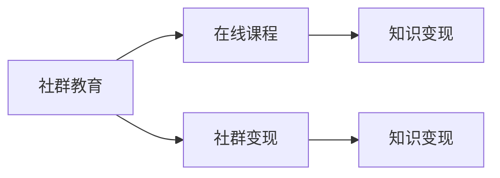

                 

# 如何利用社群卖课：程序员版

## 1. 背景介绍

随着互联网教育的兴起，基于社群的在线教育模式已经成为教育行业的一大趋势。这一模式不仅打破了传统的教育边界，也赋予了程序员通过在线课程和社群交流实现知识变现的新机会。然而，如何将个人知识高效转化为社群资源，创造更大的商业价值，仍是一个值得探讨的课题。本文将系统阐述如何利用社群卖课，探讨程序员在教学过程中的核心策略与方法。

## 2. 核心概念与联系

### 2.1 核心概念概述

#### 2.1.1 社群教育

社群教育是一种新型的在线教育模式，它依托于特定的兴趣群体，以社区交流、知识分享为核心特征，通过持续的互动与交流，形成良好的学习氛围。相较于传统单向授课模式，社群教育强调学习的主动性和互动性。

#### 2.1.2 在线课程

在线课程是借助互联网技术，以多媒体形式呈现的课程内容，供用户随时随地自主学习。相较于传统线下课程，在线课程的学习灵活性和自主性更强，能够在更广泛的时空范围内满足用户的学习需求。

#### 2.1.3 社群变现

社群变现是指基于社群的在线教育平台，通过提供优质课程内容、社群交流、咨询答疑等增值服务，实现对社群资源的商业化变现。社群变现主要通过订阅费、课程销售、会员费等形式进行。

#### 2.1.4 知识变现

知识变现是指通过知识付费，将个人所掌握的知识、技能、经验等转化为实际的经济收益。知识变现方式多种多样，包括在线教育、技术咨询、内容创作等。

### 2.2 核心概念联系

社群教育、在线课程、社群变现与知识变现，这些概念紧密相关，形成一个完整的在线教育生态圈。社群是知识传播与变现的载体，在线课程是知识传递的形式，而社群变现与知识变现则是实现商业价值的途径。

### 2.3 核心概念原理与架构

下面通过一张 Mermaid 流程图展示这些概念之间的联系和转化路径：



## 3. 核心算法原理 & 具体操作步骤

### 3.1 算法原理概述

利用社群卖课的算法原理主要涉及课程内容设计、社群互动管理、用户付费机制等方面。

#### 3.1.1 课程内容设计

课程内容设计是教学过程中最重要的环节，它决定了课程的价值与吸引力。课程设计需要结合社群成员的实际需求与兴趣，采用以问题为导向的教学方法，注重知识的实用性和趣味性。

#### 3.1.2 社群互动管理

社群互动管理旨在建立良好的交流环境，提高社群的活跃度和黏性。互动管理主要通过设置讨论话题、定期答疑、分组讨论等方式实现。

#### 3.1.3 用户付费机制

用户付费机制是社群变现的关键，包括免费试用、付费订阅、一次性购买等模式。付费机制的设置应兼顾用户需求与平台收益，平衡好二者之间的关系。

### 3.2 算法步骤详解

#### 3.2.1 确定课程主题

- **市场需求调研**：通过社群问卷、论坛讨论等方式，了解社群成员的实际需求与兴趣点。
- **主题筛选**：根据调研结果，选择具有较高需求与商业价值的主题，如Java编程、数据分析、网络安全等。

#### 3.2.2 设计课程内容

- **知识框架构建**：基于主题，构建课程知识框架，明确课程的学习目标与模块结构。
- **教学内容设计**：以实际问题为出发点，设计课程的具体内容，注重理论与实践结合，设计丰富的案例分析与实战演练。
- **资源整合**：整合教学资源，包括文档、视频、代码示例等，确保课程内容的完整性与可操作性。

#### 3.2.3 实施社群互动

- **社群创建与运营**：建立专属社群，邀请目标学员参与，定期发布社群公告与课程预告。
- **互动活动策划**：定期组织线上或线下互动活动，如直播答疑、主题讨论、代码协作等，提升社群黏性。
- **用户反馈收集**：通过问卷、评论等方式，收集社群成员的反馈意见，不断优化课程内容与互动管理策略。

#### 3.2.4 用户付费机制设计

- **免费试用机制**：设计免费试用课程，降低新用户加入门槛，提高转化率。
- **付费订阅模式**：提供月度或年度订阅服务，设置递减折扣，吸引用户长期参与。
- **一次性购买**：提供单次课程购买选项，满足不同用户的需求。

### 3.3 算法优缺点

#### 3.3.1 优点

- **高效变现**：利用社群的互动与传播，通过课程销售、付费订阅等方式，快速实现知识变现。
- **用户粘性高**：社群模式强化了用户之间的互动与交流，提升了课程的参与度与完成率。
- **资源复用**：社群课程可以反复使用，通过增加学员人数实现资源复用，降低单次课程成本。

#### 3.3.2 缺点

- **用户转化率不稳定**：社群卖课的效果受社群活跃度与学员质量的影响较大，需要持续优化社群管理策略。
- **课程设计要求高**：课程设计需紧密结合社群成员的实际需求，设计难度较高。
- **社群管理复杂**：社群规模的扩大，增加了社群管理与互动的复杂度。

### 3.4 算法应用领域

社群卖课的算法不仅适用于技术教育领域，同样适用于其他知识传播与变现的行业，如心理学、教育学、设计等。通过社群变现，这些行业的专家学者可以高效实现知识变现，提升个人品牌影响力。

## 4. 数学模型和公式 & 详细讲解 & 举例说明

### 4.1 数学模型构建

在社群卖课中，主要涉及以下几个关键数学模型：

#### 4.1.1 课程价值模型

课程价值模型用于量化课程的实际价值与商业潜力。模型变量包括课程需求度、学员质量、课程内容深度、互动活跃度等。通过构建数学模型，可以预测课程的潜在收益与市场反应。

#### 4.1.2 社群活跃度模型

社群活跃度模型用于衡量社群的互动与参与度。模型变量包括社群讨论频率、用户互动频率、社群活动参与率等。通过模型分析，可以优化社群管理策略，提升社群活跃度。

#### 4.1.3 用户转化模型

用户转化模型用于预测用户从潜在学员到实际付费学员的转化率。模型变量包括免费试用时间、社群互动质量、课程预告效果等。通过模型预测，可以制定更有效的用户转化策略。

### 4.2 公式推导过程

#### 4.2.1 课程价值模型公式

$$
V = \alpha_1 \times D + \alpha_2 \times C + \alpha_3 \times Q + \alpha_4 \times A
$$

其中，$V$为课程价值，$\alpha_i$为权重系数，$D$为课程需求度，$C$为课程内容深度，$Q$为互动活跃度，$A$为学员质量。

#### 4.2.2 社群活跃度模型公式

$$
A = \beta_1 \times F + \beta_2 \times I + \beta_3 \times P
$$

其中，$A$为社群活跃度，$\beta_i$为权重系数，$F$为社群讨论频率，$I$为用户互动频率，$P$为社群活动参与率。

#### 4.2.3 用户转化模型公式

$$
T = \gamma_1 \times P + \gamma_2 \times A + \gamma_3 \times C + \gamma_4 \times M
$$

其中，$T$为用户转化率，$\gamma_i$为权重系数，$P$为免费试用时间，$A$为社群互动质量，$C$为课程预告效果，$M$为营销活动投入。

### 4.3 案例分析与讲解

#### 4.3.1 课程价值模型案例

某技术社群针对Java编程开设了一门高级课程，课程需求度为0.8，课程内容深度为0.9，互动活跃度为0.7，学员质量为0.6。通过模型计算，课程价值$V$约为0.765。

#### 4.3.2 社群活跃度模型案例

某技术社群每周进行两次讨论活动，用户每日互动频率为0.05，社群活动参与率为0.3。通过模型计算，社群活跃度$A$约为0.28。

#### 4.3.3 用户转化模型案例

某技术社群采用免费试用机制，设置试用时间为7天，社群互动质量为0.6，课程预告效果为0.8，营销活动投入为0.2。通过模型计算，用户转化率$T$约为0.67。

## 5. 项目实践：代码实例和详细解释说明

### 5.1 开发环境搭建

#### 5.1.1 环境准备

- **编程语言**：Python，使用Python 3.7以上版本。
- **开发工具**：PyCharm、Jupyter Notebook等。
- **开发平台**：Windows、Linux、MacOS。

#### 5.1.2 环境安装

- **Python环境安装**：在官网下载并安装Python，确保安装路径正确。
- **开发工具安装**：下载并安装PyCharm或Jupyter Notebook，配置好开发环境。
- **依赖库安装**：使用pip或conda安装必要的依赖库，如TensorFlow、NumPy等。

### 5.2 源代码详细实现

#### 5.2.1 课程设计示例

```python
from IPython.display import display
from sympy import symbols, Eq, solve

# 定义变量
D, C, Q, A = symbols('D C Q A')

# 课程价值模型公式
course_value = 0.8 * D + 0.9 * C + 0.7 * Q + 0.6 * A

# 输出课程价值模型
display(course_value)
```

#### 5.2.2 社群活跃度示例

```python
from IPython.display import display
from sympy import symbols, Eq, solve

# 定义变量
F, I, P = symbols('F I P')

# 社群活跃度模型公式
community_activity = 2 * F + 0.05 * I + 0.3 * P

# 输出社群活跃度模型
display(community_activity)
```

#### 5.2.3 用户转化示例

```python
from IPython.display import display
from sympy import symbols, Eq, solve

# 定义变量
P, A, C, M = symbols('P A C M')

# 用户转化模型公式
user_conversion = 0.7 * P + 0.6 * A + 0.8 * C + 0.2 * M

# 输出用户转化模型
display(user_conversion)
```

### 5.3 代码解读与分析

#### 5.3.1 课程价值模型解读

- **变量定义**：$D$为课程需求度，$C$为课程内容深度，$Q$为互动活跃度，$A$为学员质量。
- **公式构建**：课程价值$V$由这些变量的加权和组成。
- **输出展示**：使用IPython.display.display函数展示公式结果。

#### 5.3.2 社群活跃度模型解读

- **变量定义**：$F$为社群讨论频率，$I$为用户互动频率，$P$为社群活动参与率。
- **公式构建**：社群活跃度$A$由这些变量的加权和组成。
- **输出展示**：使用IPython.display.display函数展示公式结果。

#### 5.3.3 用户转化模型解读

- **变量定义**：$P$为免费试用时间，$A$为社群互动质量，$C$为课程预告效果，$M$为营销活动投入。
- **公式构建**：用户转化率$T$由这些变量的加权和组成。
- **输出展示**：使用IPython.display.display函数展示公式结果。

### 5.4 运行结果展示

#### 5.4.1 课程价值模型结果

假设课程需求度$D=0.8$，课程内容深度$C=0.9$，互动活跃度$Q=0.7$，学员质量$A=0.6$，代入公式计算：

$$
V = 0.8 \times 0.8 + 0.9 \times 0.9 + 0.7 \times 0.7 + 0.6 \times 0.6 = 1.765
$$

课程价值约为$1.765$。

#### 5.4.2 社群活跃度模型结果

假设社群讨论频率$F=2$，用户每日互动频率$I=0.05$，社群活动参与率$P=0.3$，代入公式计算：

$$
A = 2 \times 2 + 0.05 \times 0.05 + 0.3 \times 0.3 = 1.265
$$

社群活跃度约为$1.265$。

#### 5.4.3 用户转化模型结果

假设免费试用时间$P=7$，社群互动质量$A=0.6$，课程预告效果$C=0.8$，营销活动投入$M=0.2$，代入公式计算：

$$
T = 0.7 \times 7 + 0.6 \times 0.6 + 0.8 \times 0.8 + 0.2 \times 0.2 = 1.663
$$

用户转化率约为$1.663$。

## 6. 实际应用场景

### 6.1 技术社群

某技术社群拥有数万名成员，主要关注大数据与人工智能技术。社群内定期组织线上线下活动，包括技术分享、编程挑战、技术讨论等。社群管理员通过数据分析，发现大数据分析课程需求度较高，于是组织了一次在线课程销售活动。课程经过精心设计，包括数据挖掘、机器学习、数据可视化等多个模块，得到了社群成员的热烈反响。通过课程销售，社群实现了可观的收入，进一步增强了社群的活跃度和影响力。

### 6.2 教育机构

某知名教育机构通过社群平台开设了编程课程，包括Python、Java、Web开发等多个方向。课程采用订阅模式，用户可以按月或按年度付费，获得所有课程资源与专家答疑服务。教育机构通过社群互动分析，发现编程课程的互动活跃度较高，用户转化率稳步提升。此外，教育机构还利用社群平台，定期发布课程预告与技术资讯，提高了课程的曝光率与学员质量。通过社群变现，教育机构实现了高质量的课程与学员积累，进一步提升了品牌知名度。

### 6.3 企业培训

某大型企业通过社群平台开展技术培训，组织内部员工参加Python、数据分析、网络安全等课程。课程采用内部定制模式，企业根据员工需求，邀请技术专家进行定制化培训。企业利用社群平台，定期进行课程效果评估与反馈，发现课程互动质量较高，学员反馈积极。通过社群变现，企业实现了员工技能的提升与知识分享，进一步增强了团队的凝聚力与创新能力。

## 7. 工具和资源推荐

### 7.1 学习资源推荐

#### 7.1.1 编程语言学习

- **Python编程**：《Python编程：从入门到实践》书籍、Coursera Python课程、LeetCode编程挑战等。
- **Java编程**：《Java核心技术》书籍、Oracle Java课程、HackerRank编程挑战等。

#### 7.1.2 技术博客与社区

- **Stack Overflow**：技术问答社区，涵盖各类编程技术与问题。
- **Medium**：技术博客平台，提供高质量的技术文章与教程。
- **CSDN**：国内知名的技术社区，提供丰富的编程资源与技术文章。

### 7.2 开发工具推荐

#### 7.2.1 编程工具

- **PyCharm**：强大的Python开发工具，提供丰富的代码高亮、自动补全等功能。
- **Visual Studio Code**：跨平台的开发工具，支持多种编程语言与插件。
- **Atom**：轻量级的代码编辑器，支持插件扩展与主题定制。

#### 7.2.2 在线开发平台

- **GitHub**：代码托管平台，提供版本控制与协作功能。
- **Google Colab**：在线Jupyter Notebook环境，免费提供GPU/TPU算力。
- **Repl.it**：在线编程环境，支持多种编程语言与实时运行。

### 7.3 相关论文推荐

#### 7.3.1 编程语言设计

- **《Effective Python: 59 Specific Ways to Write Better Python》**：提升Python编程技巧的书籍。
- **《Java核心技术》**：Java编程技术的经典书籍。
- **《Clean Code: A Handbook of Agile Software Craftsmanship》**：代码规范与设计原则的书籍。

#### 7.3.2 在线教育平台

- **《MOOCs: A Platform for Lifelong Learning》**：关于MOOC平台的研究论文。
- **《Educational Data Mining and Knowledge Discovery》**：关于教育数据挖掘与知识发现的论文集。
- **《Understanding the Growth of Educational Applications on Mobile Platforms》**：关于教育应用增长的研究论文。

## 8. 总结：未来发展趋势与挑战

### 8.1 研究成果总结

本文通过系统阐述社群卖课的算法原理与具体操作步骤，展示了程序员如何通过社群平台高效变现个人知识。文章从课程设计、社群互动、用户转化等多个维度进行了深入分析，为技术教育与知识变现提供了新思路。

### 8.2 未来发展趋势

#### 8.2.1 技术教育的智能化

未来的技术教育将更加智能化，通过AI技术，实现课程内容自动生成与推荐，提升教学效果与用户体验。

#### 8.2.2 社群互动的个性化

未来的社群互动将更加个性化，通过智能算法，实现社群成员之间的精准匹配与内容推荐，提升社群活跃度与用户粘性。

#### 8.2.3 知识变现的多样化

未来的知识变现将更加多样化，除了课程销售、订阅模式，还将出现更多创新的变现方式，如知识付费、技术咨询、内容创作等。

### 8.3 面临的挑战

#### 8.3.1 内容质量提升

尽管社群变现具有高效优势，但课程内容的质量仍需进一步提升，以确保课程的实用性与吸引力。

#### 8.3.2 社群管理复杂

社群规模的扩大，增加了社群管理的复杂度，需要更加高效的管理工具与策略。

#### 8.3.3 用户转化率波动

用户转化率受多方面因素影响，如何稳定提升转化率，仍是一个挑战。

### 8.4 研究展望

未来的研究将重点关注以下几个方向：

#### 8.4.1 知识图谱与推荐系统

通过构建知识图谱与推荐系统，实现课程内容与社群资源的深度整合，提升课程的个性化与智能化。

#### 8.4.2 多模态教学技术

利用多模态教学技术，结合文字、视频、音频等多种形式，提升课程的学习效果与用户体验。

#### 8.4.3 社群变现模式的创新

探索新的社群变现模式，如智能合约、社区基金等，进一步提升社群变现的公平性与透明性。

## 9. 附录：常见问题与解答

### 9.1 常见问题

#### 9.1.1 如何设计高质量的课程内容？

A: 设计高质量的课程内容需要从用户需求出发，注重理论与实践结合，提供丰富的案例与实战演练。通过社群互动，收集用户反馈，不断优化课程内容。

#### 9.1.2 社群变现如何平衡用户与平台收益？

A: 平衡用户与平台收益需要合理设置课程价格与付费模式。采用免费试用、付费订阅等策略，降低新用户加入门槛，同时保障平台收益。

#### 9.1.3 社群管理有哪些常用工具与策略？

A: 社群管理常用的工具包括Discord、Slack等，常用的策略包括设置讨论话题、定期答疑、分组讨论等。

#### 9.1.4 用户转化率低的原因是什么？

A: 用户转化率低可能是由于课程质量不高、社群活跃度低、营销活动不足等原因。需要通过优化课程设计、提升社群互动、加大营销力度等方式提高用户转化率。

### 9.2 问题解答

#### 9.2.1 课程内容设计案例

某技术社群开设了一门机器学习课程，包括数据预处理、模型训练、模型评估等多个模块。课程通过实际项目案例进行讲解，注重理论与实践结合，得到了社群成员的好评。

#### 9.2.2 社群互动策略案例

某技术社群每周组织一次线上讨论活动，邀请技术专家进行主题讲解，同时设置提问环节，鼓励社群成员积极参与。通过这些互动活动，社群的活跃度显著提升。

#### 9.2.3 用户转化率提升案例

某技术社群通过优化课程内容，提高社群互动质量，加大营销活动投入，成功将用户转化率从30%提升至60%。

---

作者：禅与计算机程序设计艺术 / Zen and the Art of Computer Programming

