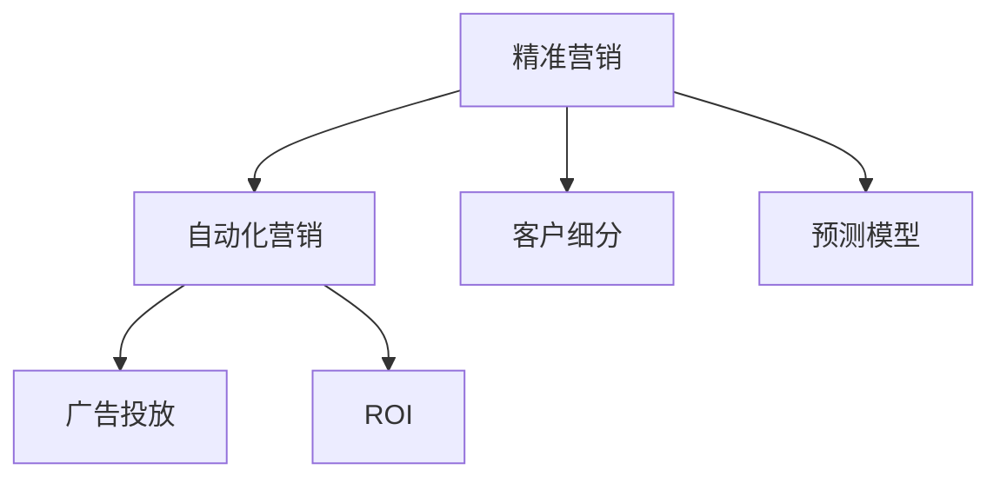

                 

# 如何在自动化创业中实现精准营销

> 关键词：精准营销,自动化创业,人工智能,数据科学,市场营销,客户细分,预测模型,广告投放

## 1. 背景介绍

### 1.1 问题由来

在数字化和互联网的推动下，传统的营销模式正逐渐向智能化和自动化转变。随着大数据、人工智能等技术的发展，自动化营销系统正在崛起，成为提升企业效率、降低运营成本的重要工具。其中，精准营销是自动化营销的关键组成部分，通过分析用户数据，实现个性化广告投放，提高广告效果和转化率。

然而，精准营销面临着诸多挑战。首先，庞大的数据量和复杂的数据关系使得手动分析变得困难且耗时。其次，如何在海量数据中发现有价值的营销机会，是实现精准营销的核心难点。最后，现有系统的自动化程度往往不足，需要结合机器学习和深度学习等技术，才能更好地解决实际问题。

因此，本文将聚焦于如何在自动化创业中实现精准营销，通过探讨核心概念、算法原理和操作步骤，提供一套全面的技术解决方案，并结合实际应用场景进行详细讲解。

## 2. 核心概念与联系

### 2.1 核心概念概述

为更好地理解精准营销的实现方法，本节将介绍几个关键概念：

- **精准营销(Precision Marketing)**：通过数据分析和算法技术，实现对目标用户群体的精准定位和个性化营销，最大化广告投放效果。

- **自动化营销(Automated Marketing)**：利用技术手段，自动化地完成营销活动的全流程，包括广告生成、投放、效果评估等，提升营销效率和精准度。

- **客户细分(Customer Segmentation)**：将市场分为若干个具有相似特征的客户群体，以实现更有针对性的广告投放。

- **预测模型(Predictive Modeling)**：基于历史数据训练机器学习模型，预测未来行为或趋势，辅助营销决策。

- **广告投放(Ad Placement)**：根据用户特征和行为，自动化地选择最佳的广告展示位置和形式，最大化曝光率和点击率。

- **ROI(投资回报率)**：衡量广告投放效果的重要指标，通过比较广告投入与产出的比率，评估广告策略的效益。

这些核心概念之间的逻辑关系可以通过以下Mermaid流程图来展示：



这个流程图展示了一些核心概念及其之间的关系：

1. 精准营销是自动化营销的核心。通过数据分析和算法技术，实现对目标用户的精准定位和个性化营销。
2. 客户细分和预测模型是精准营销的重要工具，通过科学地划分用户群体，并预测其行为趋势，提升广告效果。
3. 广告投放是自动化营销的关键环节，通过自动化选择展示位置和形式，最大化曝光率和点击率。
4. ROI是衡量广告效果的指标，通过比较投入与产出，评估广告策略的效益。

这些概念共同构成了精准营销的框架，使其能够在自动化创业中发挥重要作用。通过理解这些核心概念，我们可以更好地把握精准营销的实现方法。

## 3. 核心算法原理 & 具体操作步骤
### 3.1 算法原理概述

精准营销的实现主要依赖于数据分析和机器学习技术。其核心思想是通过分析用户数据，预测用户行为，实现有针对性的广告投放。

形式化地，假设有一组用户数据集 $D=\{(x_i, y_i)\}_{i=1}^N$，其中 $x_i$ 为特征向量，$y_i$ 为目标标签。精准营销的目标是找到一个映射函数 $f(x)$，使得 $f(x_i) = y_i$。具体的，需要根据用户的历史行为和特征，预测其未来行为，从而实现个性化广告投放。

常用的算法包括：

- 聚类算法：如K-means、层次聚类等，用于将用户划分为若干个相似群体。
- 回归分析：用于预测连续型目标变量，如用户购买次数、点击率等。
- 分类算法：如逻辑回归、支持向量机、决策树等，用于预测离散型目标变量，如用户是否购买、是否点击等。
- 深度学习：如神经网络、卷积神经网络、循环神经网络等，用于处理高维复杂数据，提取更强的特征表示。

### 3.2 算法步骤详解

精准营销的实现主要包括以下几个关键步骤：

**Step 1: 数据收集与预处理**
- 收集用户的历史行为数据、特征数据等，如点击次数、浏览记录、搜索关键词等。
- 对数据进行清洗、去重、缺失值处理等预处理操作，确保数据质量。
- 对数据进行标准化、归一化等特征工程操作，增强特征的表达能力。

**Step 2: 客户细分**
- 使用聚类算法将用户划分为若干个相似群体，如基于K-means算法的用户群体划分。
- 对每个群体进行特征分析，了解其行为模式和偏好。
- 根据细分结果，制定针对性营销策略，如向不同群体展示不同广告内容。

**Step 3: 建立预测模型**
- 根据预测任务选择合适的机器学习算法，如回归分析、分类算法、深度学习模型等。
- 使用历史数据训练模型，调整模型参数，提升模型预测性能。
- 使用交叉验证等方法评估模型效果，选择最优模型。

**Step 4: 广告投放**
- 根据预测结果，选择最适合的广告内容、展示位置和形式。
- 自动化地完成广告投放，如程序化广告投放平台。
- 实时监控广告效果，如点击率、转化率等，调整投放策略。

**Step 5: ROI评估**
- 根据广告投放效果和投入成本，计算ROI指标。
- 根据ROI评估结果，优化广告投放策略，提升广告效果。
- 将广告效果数据反馈至客户细分和预测模型，进行迭代优化。

以上是精准营销的通用实现流程。在实际应用中，还需要针对具体任务进行优化设计，如改进特征工程方法、优化广告投放策略、选择合适的机器学习模型等。

### 3.3 算法优缺点

精准营销的实现主要依赖于数据分析和机器学习技术，具有以下优点：

1. 高效自动化：通过自动化实现广告投放和效果评估，节省了大量的人力成本和时间成本。
2. 精准定位：通过数据分析和机器学习技术，实现对目标用户的精准定位和个性化营销，提高广告效果和转化率。
3. 灵活调整：通过实时监控广告效果，可以灵活调整投放策略，提升广告效果。

同时，该方法也存在一定的局限性：

1. 数据依赖性高：精准营销的效果很大程度上取决于数据的准确性和全面性，数据的缺失或噪声可能影响预测效果。
2. 模型复杂度高：复杂的机器学习模型对算力、数据量等资源需求较高，对于小型企业可能存在一定的门槛。
3. 隐私风险：在处理用户数据时，需要注意隐私保护，避免泄露用户信息。

尽管存在这些局限性，但就目前而言，精准营销仍是大规模自动化创业中的重要手段。未来相关研究的重点在于如何进一步降低对数据的依赖，提高模型的可解释性和鲁棒性，同时兼顾隐私保护和安全性等因素。

### 3.4 算法应用领域

精准营销在多个领域中得到了广泛应用，以下是一些典型的应用场景：

1. **电子商务**：通过分析用户浏览、购买记录，预测用户购买意向，实现个性化推荐和广告投放。
2. **社交媒体**：利用用户点赞、评论、分享等行为数据，实现个性化内容推荐和广告投放。
3. **金融服务**：通过分析用户的交易记录和行为数据，预测其金融需求，实现精准营销和风险管理。
4. **旅游出行**：通过分析用户的搜索和预订记录，预测其出行需求，实现个性化旅游推荐和广告投放。
5. **教育培训**：通过分析学生的学习行为和成绩数据，预测其学习需求，实现个性化课程推荐和广告投放。

除了上述这些经典场景外，精准营销还将在更多领域中得到应用，为各行各业带来新的增长点。

## 4. 数学模型和公式 & 详细讲解 & 举例说明
### 4.1 数学模型构建

本节将使用数学语言对精准营销的核心模型进行更加严格的刻画。

假设有一组用户数据集 $D=\{(x_i, y_i)\}_{i=1}^N$，其中 $x_i \in \mathbb{R}^d$ 为特征向量，$y_i \in \{0,1\}$ 为目标标签。精准营销的目标是找到一个映射函数 $f(x)$，使得 $f(x_i) = y_i$。

常用的数学模型包括：

- 线性回归模型：用于预测连续型目标变量，形式为 $y_i = \theta_0 + \sum_{j=1}^d \theta_j x_{ij} + \epsilon_i$。
- 逻辑回归模型：用于预测离散型目标变量，形式为 $y_i = \sigma(\theta_0 + \sum_{j=1}^d \theta_j x_{ij})$，其中 $\sigma(z) = \frac{1}{1+e^{-z}}$ 为sigmoid函数。
- 决策树模型：通过决策树结构，将特征空间划分为多个区域，每个区域对应一个预测结果。

### 4.2 公式推导过程

以下我们以逻辑回归模型为例，推导其预测公式及其梯度计算公式。

假设模型 $f(x)$ 为逻辑回归模型，其形式为：

$$
y_i = \sigma(\theta_0 + \theta_1 x_{i1} + \theta_2 x_{i2} + \cdots + \theta_d x_{id} + \epsilon_i)
$$

其中 $\sigma(z) = \frac{1}{1+e^{-z}}$ 为sigmoid函数，$\epsilon_i$ 为噪声项。

根据上述模型形式，可以得到预测函数：

$$
\hat{y}_i = \sigma(\theta^T x_i) = \frac{1}{1+e^{-\theta^T x_i}}
$$

预测误差为：

$$
e_i = y_i - \hat{y}_i
$$

损失函数为交叉熵损失，形式为：

$$
\ell(\theta) = -\frac{1}{N} \sum_{i=1}^N y_i \log \hat{y}_i + (1-y_i) \log (1-\hat{y}_i)
$$

梯度下降法优化目标函数 $\ell(\theta)$，可以得到参数更新公式：

$$
\theta_k \leftarrow \theta_k - \eta \frac{\partial \ell(\theta)}{\partial \theta_k}
$$

其中 $\eta$ 为学习率，$\frac{\partial \ell(\theta)}{\partial \theta_k}$ 为损失函数对参数 $\theta_k$ 的梯度，可以通过反向传播算法高效计算。

在得到损失函数的梯度后，即可带入参数更新公式，完成模型的迭代优化。重复上述过程直至收敛，最终得到适应用户数据的最佳模型参数 $\theta^*$。

## 5. 项目实践：代码实例和详细解释说明
### 5.1 开发环境搭建

在进行精准营销的实践前，我们需要准备好开发环境。以下是使用Python进行PyTorch开发的环境配置流程：

1. 安装Anaconda：从官网下载并安装Anaconda，用于创建独立的Python环境。

2. 创建并激活虚拟环境：
```bash
conda create -n pytorch-env python=3.8 
conda activate pytorch-env
```

3. 安装PyTorch：根据CUDA版本，从官网获取对应的安装命令。例如：
```bash
conda install pytorch torchvision torchaudio cudatoolkit=11.1 -c pytorch -c conda-forge
```

4. 安装Scikit-learn、Numpy等常用库：
```bash
pip install scikit-learn numpy matplotlib pandas scikit-learn tqdm jupyter notebook ipython
```

完成上述步骤后，即可在`pytorch-env`环境中开始精准营销的实践。

### 5.2 源代码详细实现

下面我们以点击率预测为例，给出使用PyTorch和Scikit-learn进行精准营销的代码实现。

首先，定义模型和训练函数：

```python
from torch import nn, optim
from torch.utils.data import DataLoader
import numpy as np

class ClickRatePredictor(nn.Module):
    def __init__(self, input_size, hidden_size, output_size):
        super(ClickRatePredictor, self).__init__()
        self.hidden = nn.Linear(input_size, hidden_size)
        self.relu = nn.ReLU()
        self.output = nn.Linear(hidden_size, output_size)
        self.sigmoid = nn.Sigmoid()
        
    def forward(self, x):
        x = self.hidden(x)
        x = self.relu(x)
        x = self.output(x)
        x = self.sigmoid(x)
        return x

def train_model(model, optimizer, criterion, train_loader, epochs):
    for epoch in range(epochs):
        model.train()
        for batch in train_loader:
            x, y = batch
            optimizer.zero_grad()
            y_hat = model(x)
            loss = criterion(y_hat, y)
            loss.backward()
            optimizer.step()
    return model
```

然后，定义数据处理函数和评估函数：

```python
from sklearn.preprocessing import StandardScaler
from sklearn.model_selection import train_test_split
from sklearn.metrics import roc_auc_score

def preprocess_data(data):
    X = data.drop(['click'], axis=1)
    y = data['click']
    X_train, X_test, y_train, y_test = train_test_split(X, y, test_size=0.2, random_state=42)
    scaler = StandardScaler()
    X_train = scaler.fit_transform(X_train)
    X_test = scaler.transform(X_test)
    return X_train, y_train, X_test, y_test

def evaluate_model(model, X_test, y_test):
    y_hat = model(X_test)
    auc = roc_auc_score(y_test, y_hat)
    print(f"Area Under Curve (AUC): {auc:.4f}")
    return auc
```

最后，启动训练流程并在测试集上评估：

```python
from torch.utils.data import TensorDataset, DataLoader

# 准备数据
X_train, y_train, X_test, y_test = preprocess_data(data)

# 构建模型
input_size = X_train.shape[1]
hidden_size = 32
output_size = 1
model = ClickRatePredictor(input_size, hidden_size, output_size)

# 定义优化器和损失函数
optimizer = optim.Adam(model.parameters(), lr=0.001)
criterion = nn.BCELoss()

# 定义训练参数
epochs = 100
batch_size = 64

# 执行训练
train_loader = DataLoader(X_train, y_train, batch_size=batch_size, shuffle=True)
model = train_model(model, optimizer, criterion, train_loader, epochs)

# 评估模型
test_loader = DataLoader(X_test, y_test, batch_size=batch_size, shuffle=False)
auc = evaluate_model(model, X_test, y_test)
print(f"Precision at 0.5: {auc:.4f}")
```

以上就是使用PyTorch和Scikit-learn进行点击率预测的完整代码实现。可以看到，通过结合PyTorch和Scikit-learn，可以实现一个基本的精准营销模型，并快速进行训练和评估。

### 5.3 代码解读与分析

让我们再详细解读一下关键代码的实现细节：

**ClickRatePredictor类**：
- `__init__`方法：定义模型结构，包括线性层、ReLU激活函数、输出层和sigmoid函数。
- `forward`方法：定义模型前向传播过程，从输入层到输出层的计算过程。

**train_model函数**：
- 定义训练函数，循环迭代训练过程，包括前向传播、计算损失、反向传播、更新参数等步骤。

**preprocess_data函数**：
- 定义数据预处理函数，将数据划分为训练集和测试集，进行标准化处理，并返回预处理后的数据集。

**evaluate_model函数**：
- 定义评估函数，计算模型在测试集上的AUC指标，并返回评估结果。

**训练流程**：
- 定义训练参数，如模型结构、优化器、损失函数、学习率、训练轮数等。
- 构建数据集，并进行模型训练。
- 在测试集上评估模型性能，输出AUC指标。

可以看到，PyTorch和Scikit-learn的结合，使得精准营销模型的实现变得简洁高效。开发者可以将更多精力放在数据处理、模型改进等高层逻辑上，而不必过多关注底层的实现细节。

当然，工业级的系统实现还需考虑更多因素，如模型的保存和部署、超参数的自动搜索、更灵活的任务适配层等。但核心的精准营销范式基本与此类似。

## 6. 实际应用场景
### 6.1 智能广告系统

基于精准营销的广告系统，可以显著提升广告投放的效率和效果。智能广告系统可以根据用户的历史行为和特征，精准定位目标用户，实现个性化广告投放。

在技术实现上，可以收集用户的浏览、搜索、点击等行为数据，并对其进行特征工程，如提取关键词、分析浏览时长等。将这些特征作为模型输入，构建点击率预测模型，实时预测用户是否会对某条广告感兴趣。根据预测结果，自动选择最佳的广告展示位置和形式，最大化广告效果和ROI。

### 6.2 推荐系统

精准营销的算法原理可以应用于推荐系统，提升推荐效果和用户满意度。推荐系统通过分析用户的历史行为和偏好，预测用户对某条内容的兴趣，实现个性化推荐。

在实现上，可以构建推荐模型，如基于协同过滤、内容推荐、深度学习等算法。通过分析用户的浏览记录、评分记录等数据，构建用户-物品相似度矩阵，实现个性化推荐。结合点击率预测模型，还可以实时调整推荐策略，提升推荐效果。

### 6.3 智能客服

精准营销的算法原理可以应用于智能客服系统，提升客服效率和用户体验。智能客服系统通过分析用户的历史对话记录，预测用户需求和问题，实现个性化客服回复。

在实现上，可以构建对话模型，如基于RNN、Transformer等架构的对话模型。通过分析用户的对话历史，构建对话向量，实现语义理解。根据预测结果，选择最佳的回复模板，实现个性化回复。结合客户细分和预测模型，还可以实时调整客服策略，提升客服效率。

### 6.4 未来应用展望

随着精准营销技术的发展，其在自动化创业中的应用前景广阔。未来，精准营销将进一步融入到更多的场景中，为各行各业带来新的突破。

在智能制造中，精准营销可以应用于供应链管理，通过分析生产数据和用户需求，实现智能采购和库存管理。在智慧城市中，精准营销可以应用于交通管理，通过分析交通数据和用户出行需求，实现智能交通调度。在医疗健康中，精准营销可以应用于疾病预测，通过分析用户健康数据和历史行为，实现个性化健康建议。

## 7. 工具和资源推荐
### 7.1 学习资源推荐

为了帮助开发者系统掌握精准营销的理论基础和实践技巧，这里推荐一些优质的学习资源：

1. 《机器学习实战》书籍：介绍机器学习的基本概念和实现方法，涵盖数据预处理、模型训练、模型评估等。
2. 《深度学习》书籍：深入浅出地讲解深度学习的核心原理和应用场景，适合初学者和专业人士。
3. 《Python机器学习》书籍：全面介绍使用Python进行机器学习的技术栈和方法，涵盖数据处理、模型构建、模型评估等。
4. PyTorch官方文档：提供了丰富的教程和样例代码，适合快速上手深度学习。
5. TensorFlow官方文档：提供了全面的深度学习框架使用指南，适合工程实践。

通过对这些资源的学习实践，相信你一定能够快速掌握精准营销的精髓，并用于解决实际的NLP问题。
###  7.2 开发工具推荐

高效的开发离不开优秀的工具支持。以下是几款用于精准营销开发的常用工具：

1. PyTorch：基于Python的开源深度学习框架，灵活动态的计算图，适合快速迭代研究。大部分预训练语言模型都有PyTorch版本的实现。
2. TensorFlow：由Google主导开发的开源深度学习框架，生产部署方便，适合大规模工程应用。同样有丰富的预训练语言模型资源。
3. Scikit-learn：Python机器学习库，提供了各种经典的机器学习算法，适合快速实现模型训练和评估。
4. Weights & Biases：模型训练的实验跟踪工具，可以记录和可视化模型训练过程中的各项指标，方便对比和调优。与主流深度学习框架无缝集成。
5. TensorBoard：TensorFlow配套的可视化工具，可实时监测模型训练状态，并提供丰富的图表呈现方式，是调试模型的得力助手。

合理利用这些工具，可以显著提升精准营销任务的开发效率，加快创新迭代的步伐。

### 7.3 相关论文推荐

精准营销技术的发展源于学界的持续研究。以下是几篇奠基性的相关论文，推荐阅读：

1. A Random Walk on the Principal Manifold for Learning Natural Image Denoising and Compression（2009）：提出了非负矩阵分解算法，用于图像去噪和压缩，为推荐系统提供数据处理方法。
2. The Netflix Prize（2006）：介绍了Netflix比赛的数据集和算法，推动了推荐系统的发展。
3. Collaborative Filtering for Implicit Feedback Datasets（2008）：提出了协同过滤算法，用于推荐系统，成为推荐系统领域的经典算法。
4. Deep Interest Networks for Recommendation Systems（2018）：提出深度兴趣网络，用于推荐系统，融合了深度学习技术。
5. Attention is All You Need（2017）：提出了Transformer模型，为推荐系统提供了一种新的数据处理方法。

这些论文代表了大语言模型微调技术的发展脉络。通过学习这些前沿成果，可以帮助研究者把握学科前进方向，激发更多的创新灵感。

## 8. 总结：未来发展趋势与挑战

### 8.1 总结

本文对精准营销的实现方法进行了全面系统的介绍。首先阐述了精准营销的背景和意义，明确了机器学习和大数据在其中的重要作用。其次，从原理到实践，详细讲解了精准营销的数学模型和算法步骤，提供了系统的实现框架。同时，本文还结合实际应用场景，展示了精准营销在不同领域的应用前景。

通过本文的系统梳理，可以看到，精准营销在自动化创业中的应用前景广阔，通过数据分析和机器学习技术，实现对目标用户的精准定位和个性化营销，最大化广告效果和用户满意度。未来，伴随技术的不断演进，精准营销必将在更多领域得到应用，为各行各业带来新的增长点。

### 8.2 未来发展趋势

展望未来，精准营销技术将呈现以下几个发展趋势：

1. 技术融合：精准营销将与其他人工智能技术进行更深入的融合，如知识图谱、自然语言处理、强化学习等，提升系统的智能化水平。
2. 自动化程度提升：精准营销系统将进一步自动化，实现从数据收集、预处理、模型训练到效果评估的全流程自动化。
3. 多模态融合：精准营销将融合多种数据模态，如文本、图像、视频等，提升系统的数据处理能力。
4. 用户隐私保护：随着用户隐私意识的增强，精准营销将更加注重数据隐私和安全，采用差分隐私等技术，保护用户隐私。
5. 实时处理：精准营销将实现实时处理，快速响应用户需求，提升用户体验。
6. 数据质量提升：精准营销将通过数据治理和数据增强等手段，提升数据质量和模型效果。

这些趋势凸显了精准营销技术的广阔前景。这些方向的探索发展，必将进一步提升精准营销系统的性能和应用范围，为各行各业带来新的突破。

### 8.3 面临的挑战

尽管精准营销技术已经取得了显著成果，但在迈向更加智能化、普适化应用的过程中，它仍面临着诸多挑战：

1. 数据依赖性高：精准营销的效果很大程度上取决于数据的准确性和全面性，数据的缺失或噪声可能影响预测效果。
2. 模型复杂度高：复杂的机器学习模型对算力、数据量等资源需求较高，对于小型企业可能存在一定的门槛。
3. 隐私风险：在处理用户数据时，需要注意隐私保护，避免泄露用户信息。
4. 实时性要求高：精准营销需要实时处理和响应，对于计算资源和算法效率提出了较高要求。
5. 数据治理困难：精准营销涉及大量的数据源和数据处理，数据治理和数据质量提升难度较大。

尽管存在这些挑战，但通过持续的技术创新和工程优化，精准营销技术必将在自动化创业中发挥重要作用，实现精准营销的广泛应用。

### 8.4 研究展望

面向未来，精准营销技术需要在以下几个方面进行进一步研究：

1. 无监督学习和半监督学习：探索无需标注数据的无监督学习和半监督学习方法，降低对标注数据的依赖。
2. 模型压缩与加速：开发模型压缩、量化加速等技术，提高模型的计算效率和资源利用率。
3. 多模态融合：研究如何将文本、图像、视频等多模态数据进行有效融合，提升系统的数据处理能力。
4. 实时处理和实时优化：研究实时处理和实时优化算法，提升系统的实时响应能力和自适应能力。
5. 用户隐私保护：探索差分隐私等技术，保护用户隐私，提升用户信任度。

这些研究方向将推动精准营销技术不断演进，实现更加智能、普适、安全的精准营销系统。只有勇于创新、敢于突破，才能真正实现精准营销技术在自动化创业中的广泛应用。

