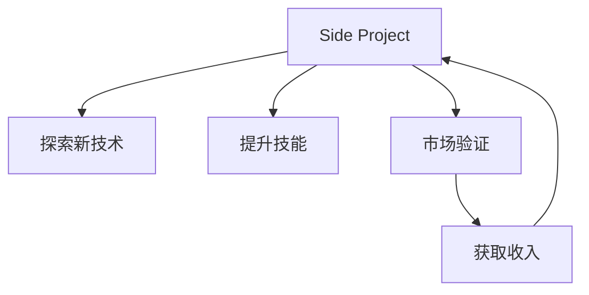

                 

# 如何将Side Project转化为主业

## 1. 背景介绍

在现代软件开发中，Side Project（副业项目）越来越受到开发者的欢迎。它们可以让人尝试新的技术，获取更多的实践经验，甚至在技术上实现突破。然而，很多开发者希望将Side Project转化为自己的主业，这意味着需要付出更多的时间和精力，并且可能要放弃现有的稳定收入。本文将探讨如何将Side Project顺利转化为主业，提供一些实用的建议和策略。

## 2. 核心概念与联系

### 2.1 核心概念概述

- **Side Project**：指开发者在主业之外，利用业余时间开发的软件项目。这些项目通常用于探索新领域、实验新技术或者满足个人兴趣。

- **主业转型**：指开发者决定将Side Project变成自己的全职工作，全身心投入其中。

### 2.2 核心概念原理和架构的 Mermaid 流程图

这个流程图展示了Side Project转化为主业的大致流程：开发者首先探索新技术（B），通过Side Project提升技能（C），然后通过市场验证（D）获得收入，最后可能将Side Project转化为全职工作（E）。

## 3. 核心算法原理 & 具体操作步骤

### 3.1 算法原理概述

将Side Project转化为主业的过程类似于一个迭代优化问题，需要不断调整和改进。其核心算法原理包括以下几个方面：

- **需求分析**：明确Side Project的目标和市场需求。
- **技术评估**：评估现有技术的可行性和适用性。
- **市场调研**：了解目标市场和用户需求。
- **收入模型**：设计可持续的商业模式，如订阅、广告、销售等。
- **用户反馈**：通过用户反馈不断优化产品和服务。

### 3.2 算法步骤详解

以下是将Side Project转化为主业的详细步骤：

#### 3.2.1 明确目标和需求

1. **市场需求分析**：研究目标市场的用户需求和痛点，确保Side Project能够解决实际问题。
2. **目标设定**：明确Side Project的短期和长期目标，包括功能、性能和用户体验等方面。

#### 3.2.2 技术评估

1. **技术栈选择**：评估适合当前Side Project的技术栈，包括前端、后端、数据库等。
2. **技术风险评估**：识别潜在的技术风险和挑战，并制定应对策略。

#### 3.2.3 市场调研

1. **竞争分析**：研究市场上现有的同类产品，分析其优缺点。
2. **用户调研**：通过问卷、访谈等方式获取用户反馈，了解用户需求和期望。

#### 3.2.4 设计收入模型

1. **免费与付费模式**：考虑采用免费提供基础功能，通过高级功能或增值服务收费的方式。
2. **订阅与广告模式**：设计订阅服务或广告收入模式，确保收入的持续性和稳定性。

#### 3.2.5 用户反馈与优化

1. **反馈收集**：通过在线调查、客服反馈等方式收集用户意见和建议。
2. **产品迭代**：根据用户反馈不断改进和优化产品，提升用户体验和满意度。

### 3.3 算法优缺点

#### 3.3.1 优点

- **技术突破**：Side Project通常可以让人尝试新技术和框架，推动技术进步。
- **实践经验**：通过Side Project积累实战经验，为转型主业打下坚实基础。
- **市场验证**：Side Project提供了一个低成本的市场测试平台，验证商业模式和用户需求。

#### 3.3.2 缺点

- **资源消耗**：Side Project的开发和维护需要大量时间和精力，可能影响主业的工作效率。
- **风险较高**：Side Project的市场前景和收入模型存在不确定性，失败风险较大。
- **技术债务**：Side Project中可能存在技术债务和代码质量问题，需要时间和精力解决。

### 3.4 算法应用领域

将Side Project转化为主业的方法不仅适用于软件开发领域，还适用于其他技术密集型行业，如数据科学、人工智能、生物技术等。在所有这些领域，开发者都可以通过探索新技术、积累实践经验、验证市场需求来推动个人职业发展。

## 4. 数学模型和公式 & 详细讲解 & 举例说明

### 4.1 数学模型构建

假设Side Project的目标是提高软件产品的用户满意度，数学模型可以表示为：

$$
\text{用户满意度} = f(\text{功能完备度}, \text{性能稳定性}, \text{用户体验})
$$

其中，$f$ 表示一个非线性函数，代表满意度与功能、性能和体验的复杂关系。

### 4.2 公式推导过程

1. **功能完备度**：通过用户调研，确定用户对功能的需求和期望，构建特征向量 $X$。
2. **性能稳定性**：通过性能测试，量化软件的响应时间、吞吐量等指标，构建向量 $Y$。
3. **用户体验**：通过用户体验调查，收集用户的满意度、使用频率等数据，构建向量 $Z$。

将这些向量作为输入，通过机器学习算法（如决策树、神经网络等）训练模型，预测用户满意度：

$$
\hat{U} = f(X, Y, Z)
$$

其中 $\hat{U}$ 表示预测的用户满意度。

### 4.3 案例分析与讲解

以一个Side Project为例，该Side Project是一个针对中小企业开发的项目管理系统。项目团队通过用户调研，确定了以下需求：

- **功能完备度**：任务分配、进度跟踪、协作工具等。
- **性能稳定性**：快速响应、高可用性、数据一致性。
- **用户体验**：直观界面、易用性、用户反馈机制。

通过构建这些特征向量，并使用机器学习算法（如决策树）训练模型，预测用户满意度。然后，根据预测结果不断调整产品功能和用户体验，以提高用户满意度。

## 5. 项目实践：代码实例和详细解释说明

### 5.1 开发环境搭建

1. **选择编程语言**：根据Side Project的技术栈选择适合的编程语言，如Python、Java、JavaScript等。
2. **安装开发工具**：安装相应的IDE、版本控制、测试框架等工具。

### 5.2 源代码详细实现

#### 5.2.1 用户调研模块

1. **调研问卷设计**：使用在线问卷工具（如Google Forms）设计调研问卷。
2. **数据收集与分析**：通过问卷收集用户反馈，使用数据处理工具（如Pandas）分析用户需求和期望。

#### 5.2.2 功能实现模块

1. **功能模块设计**：根据用户调研结果，设计项目管理的核心功能模块，如任务分配、进度跟踪等。
2. **功能实现**：使用编程语言和框架（如React、Django等）实现功能模块，并进行单元测试和集成测试。

#### 5.2.3 性能优化模块

1. **性能评估**：使用性能测试工具（如Apache JMeter）评估系统响应时间和吞吐量。
2. **性能优化**：根据测试结果优化代码和数据库，提升系统性能。

### 5.3 代码解读与分析

以项目管理的任务分配功能为例，代码实现包括以下步骤：

1. **任务创建**：用户通过Web界面创建任务，包括任务名称、描述、截止日期等。
2. **任务分配**：系统根据用户角色和权限，分配任务给相应的负责人。
3. **任务跟踪**：用户可以查看任务进度和负责人状态，进行任务更新和提醒。

### 5.4 运行结果展示

通过运行测试用例，可以验证任务的正确性和性能，并进行调试和优化。例如，可以使用Python的unittest框架编写测试用例，验证任务创建和分配功能的正确性。

## 6. 实际应用场景

### 6.1 企业级项目管理

Side Project可以为企业级项目管理提供创新的解决方案，帮助中小企业提高项目管理效率和协作能力。通过收集用户反馈和市场数据，不断优化产品，从而获得更高的市场认可度和用户满意度。

### 6.2 数据科学分析

Side Project还可以应用于数据科学分析领域，帮助企业提取和分析数据，发现市场趋势和用户行为模式。通过持续优化算法和模型，可以为企业决策提供可靠的依据。

### 6.3 人工智能应用

在人工智能领域，Side Project可以探索新的人工智能模型和算法，推动技术进步。例如，可以通过Side Project进行图像识别、自然语言处理等应用的实验和验证，从而推动主业的深入发展。

### 6.4 未来应用展望

随着技术的发展和市场需求的演变，Side Project的应用场景将更加多样化。例如，随着物联网的普及，Side Project可以探索基于物联网的数据分析和智能控制，推动工业4.0的进程。

## 7. 工具和资源推荐

### 7.1 学习资源推荐

1. **在线课程**：如Coursera、Udemy等平台提供的软件开发、数据科学、人工智能等课程。
2. **开源社区**：如GitHub、Stack Overflow等社区，可以获取最新的技术资讯和开发者经验。

### 7.2 开发工具推荐

1. **编程语言**：如Python、Java、JavaScript等主流编程语言。
2. **IDE**：如Visual Studio Code、PyCharm等集成开发环境。
3. **版本控制**：如Git、SVN等版本控制系统。
4. **测试框架**：如JUnit、unittest、Selenium等测试框架。

### 7.3 相关论文推荐

1. **软件开发方法论**：如敏捷开发、DevOps等方法论。
2. **数据科学基础**：如机器学习、数据挖掘等基础理论。
3. **人工智能前沿**：如深度学习、强化学习等前沿技术。

## 8. 总结：未来发展趋势与挑战

### 8.1 研究成果总结

本文从背景介绍、核心概念、算法原理、具体操作步骤等方面，详细探讨了如何将Side Project转化为主业。通过技术评估、市场调研、用户反馈等步骤，不断优化产品，从而提高市场竞争力。

### 8.2 未来发展趋势

1. **自动化**：自动化工具和流程将大大提升开发效率，缩短产品迭代周期。
2. **人工智能**：AI技术的应用将推动自动化测试、数据分析、产品推荐等领域的进步。
3. **用户体验**：用户界面设计和交互体验将越来越受到重视，提升用户体验将成为产品竞争的关键。

### 8.3 面临的挑战

1. **技术栈选择**：选择适合的技术栈需要考虑现有技能和市场需求。
2. **市场验证**：如何低成本验证市场前景和用户需求，是Side Project转型的重要挑战。
3. **用户反馈**：如何有效地收集和分析用户反馈，持续改进产品和服务。

### 8.4 研究展望

1. **跨领域融合**：将技术与其他领域（如医疗、金融、教育等）相结合，开拓新的应用场景。
2. **开放生态**：构建开放的技术生态，吸引更多的开发者和用户参与，共同推动技术进步。
3. **可持续发展**：探索可持续的商业模式和收入模型，确保Side Project转型的长期稳定发展。

## 9. 附录：常见问题与解答

### Q1: Side Project如何转为主业？

A: 通过市场需求分析、技术评估、市场调研和收入模型设计等步骤，明确Side Project的目标和市场需求，不断优化产品和服务，从而推动Side Project转为主业。

### Q2: 如何平衡Side Project和主业？

A: 使用时间管理工具（如Trello、Todoist等），合理分配时间和精力，确保Side Project和主业都能得到充分的关注和投入。

### Q3: 如何进行市场验证？

A: 通过小规模的MVP（最小可行性产品）验证市场需求，收集用户反馈，不断迭代优化产品，确保市场前景。

### Q4: 如何获取收入？

A: 设计合理的商业模式，如订阅服务、广告收入、增值服务等，确保Side Project转为主业的财务可持续性。

---

作者：禅与计算机程序设计艺术 / Zen and the Art of Computer Programming

