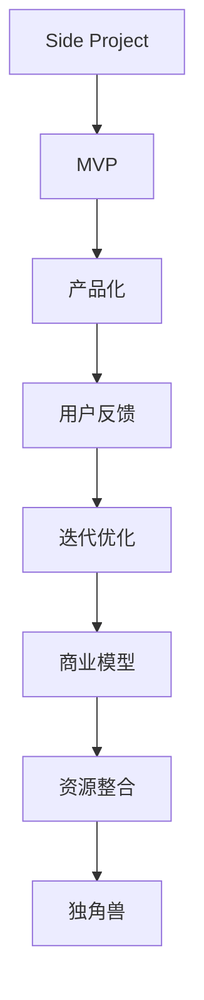

                 

# 如何将Side Project转化为独角兽

> 关键词：Side Project, 独角兽, 技术栈, 产品化, MVP, 商业模型, 用户反馈, 迭代优化, 资源整合

## 1. 背景介绍

### 1.1 问题由来

在当今的互联网行业，技术栈日益丰富，创业项目如雨后春笋般涌现。然而，由于资源限制和市场竞争激烈，许多初创公司面临着能否生存、如何壮大的艰难挑战。特别是那些源于个人兴趣或业余时间的Side Project，往往在初期就遭遇困境，难以迈向成功的商业化之路。

### 1.2 问题核心关键点

Side Project难以转化为独角兽的原因主要包括以下几点：

1. **缺乏市场洞察**：创始团队可能对市场需求和用户痛点理解不深，导致产品方向和功能设计偏离用户真正需求。
2. **资源分散**：Side Project往往仅由创始人或少数人推动，缺乏系统化的资源整合和团队协作，影响产品质量和进度。
3. **商业模型模糊**：许多Side Project缺乏明确的盈利模式和市场定位，难以在竞争激烈的市场中脱颖而出。
4. **用户体验欠佳**：初期产品可能因功能不完善、用户体验不足，难以吸引和留住用户。
5. **迭代优化困难**：缺乏用户反馈和数据支持，产品优化方向不明，导致市场响应缓慢。

### 1.3 问题研究意义

将Side Project转化为独角兽，不仅能够实现创始团队的梦想和价值，还能够为市场带来创新的产品和服务，推动技术进步和行业发展。这需要创始团队具备市场洞察力、团队协作能力、商业智慧和技术执行力等多方面的综合素质。

## 2. 核心概念与联系

### 2.1 核心概念概述

- **Side Project**：指由个人或小团队基于兴趣或业余时间开发的软件项目。
- **独角兽**：指估值超过10亿美元的初创公司，象征着极高的市场价值和成功潜力。
- **技术栈**：指项目所使用的编程语言、框架、库、工具等技术组件的集合。
- **产品化**：指将技术产品从开发阶段过渡到市场应用的过程。
- **MVP（最小可行性产品）**：指功能最小化、能够满足用户基本需求的产品原型。
- **商业模型**：指公司如何创造、交付和捕获价值，包括收入来源、成本结构、盈利模式等。
- **用户反馈**：指用户对产品功能和体验的评价和建议，是产品迭代优化的重要依据。
- **迭代优化**：指通过用户反馈和市场数据，不断迭代改进产品，提升用户体验和市场竞争力。
- **资源整合**：指对人力、资金、技术、市场等资源进行系统性的规划和调配，以支持项目顺利进行。

这些概念之间的逻辑关系可以通过以下Mermaid流程图来展示：



这个流程图展示了一个Side Project转化为独角兽的基本路径：通过MVP验证产品假设，经过产品化、用户反馈、迭代优化、商业模型、资源整合，最终实现成为独角兽的过程。

## 3. 核心算法原理 & 具体操作步骤

### 3.1 算法原理概述

Side Project转化为独角兽的过程，可以视为一种市场导向的迭代优化过程。其核心思想是通过市场反馈不断调整产品策略和功能，逐步提升用户体验和市场竞争力，最终实现商业目标。

形式化地，假设Side Project为 $S$，市场反馈为 $F$，优化后的产品为 $P$。目标是通过优化算法，使 $P$ 逐步逼近 $F$ 的期望值，最终满足 $P \approx F$。优化算法通常包括：

- **市场调研**：收集和分析用户需求和市场趋势，确定产品方向。
- **功能迭代**：基于用户反馈和市场调研，持续优化产品功能，提升用户体验。
- **商业模型设计**：选择合适的盈利模式和市场定位，确保产品具有可持续发展的商业价值。
- **资源配置**：合理规划人力、资金、技术等资源，支持产品开发和市场推广。

### 3.2 算法步骤详解

Side Project转化为独角兽的过程，可以分为以下关键步骤：

**Step 1: 进行市场调研**

- 收集目标市场和用户群体的需求和痛点，通过问卷调查、用户访谈、竞品分析等方式，获取第一手数据。
- 分析市场趋势和行业发展方向，确定产品的核心竞争力和市场定位。
- 根据调研结果，制定初步的产品功能和商业模式设计。

**Step 2: 构建最小可行性产品（MVP）**

- 选择核心功能和基本界面，构建一个能够满足用户基本需求的原型产品。
- 进行用户测试，收集初步的用户反馈，验证产品的基本功能和市场假设。
- 根据用户反馈，快速迭代优化MVP，逐步完善产品功能和用户体验。

**Step 3: 推动产品化**

- 将MVP部署到生产环境中，正式进入市场推广阶段。
- 建立用户支持和售后服务机制，收集和处理用户反馈，持续改进产品。
- 进行市场推广和销售活动，吸引更多用户，提升产品知名度和市场份额。

**Step 4: 根据用户反馈进行迭代优化**

- 持续收集用户反馈，分析用户行为和需求变化，识别产品瓶颈和改进点。
- 基于用户反馈，快速迭代产品功能，优化用户体验，提升用户满意度和忠诚度。
- 定期进行产品数据分析，评估市场表现和用户增长，调整产品策略和资源分配。

**Step 5: 设计商业模型**

- 根据市场表现和用户反馈，选择适合的盈利模式，如广告、订阅、交易等。
- 制定详细的商业计划和财务预测，确保产品的可持续发展和盈利能力。
- 优化产品定价和促销策略，提升产品竞争力和市场占有率。

**Step 6: 资源整合**

- 合理规划和分配人力资源、技术资源、资金资源等，支持产品开发和市场推广。
- 建立跨部门协作机制，确保团队高效沟通和资源共享。
- 引入外部资源，如风险投资、技术合作、市场渠道等，加速产品发展和市场扩张。

**Step 7: 持续发展和扩张**

- 基于市场反馈和用户需求，不断迭代和优化产品，保持市场竞争力和用户粘性。
- 扩大市场规模，增加用户数量和市场份额，实现业务的持续增长。
- 探索新的市场机会和业务模式，拓展产品线和市场边界，推动企业成长为独角兽。

### 3.3 算法优缺点

将Side Project转化为独角兽的方法具有以下优点：

1. **灵活性高**：通过市场调研和快速迭代，能够迅速适应市场需求和用户反馈，提高产品的市场响应速度。
2. **用户导向**：以用户需求为中心，通过持续收集和分析用户反馈，优化产品功能和用户体验，提升用户满意度和忠诚度。
3. **资源利用率高**：通过资源整合和团队协作，能够高效利用内部资源和外部合作，支持产品开发和市场推广。

但同时也存在以下局限性：

1. **初期资源有限**：Side Project通常缺乏足够的资金和人力资源，初期产品开发和市场推广受到限制。
2. **市场风险高**：产品方向和市场策略需要精确把握，稍有偏差可能导致市场失败。
3. **用户获取难**：获取新用户和提升市场份额需要大量营销投入和推广活动，初期难以实现显著增长。
4. **迭代周期长**：产品迭代和优化需要持续的资源投入和市场验证，过程漫长且成本高昂。

### 3.4 算法应用领域

将Side Project转化为独角兽的方法，广泛应用于各个领域，包括但不限于：

1. **互联网应用**：如社交媒体、电子商务、在线教育等。
2. **人工智能**：如自然语言处理、计算机视觉、智能推荐等。
3. **金融科技**：如区块链、数字货币、金融分析等。
4. **医疗健康**：如远程医疗、健康管理、药物研发等。
5. **物联网**：如智能家居、智能制造、智慧城市等。
6. **物流运输**：如智能仓储、配送、供应链管理等。

这些领域中，侧项目通过产品化、市场化和商业化，成为推动行业创新和市场竞争的重要力量。

## 4. 数学模型和公式 & 详细讲解 & 举例说明

### 4.1 数学模型构建

假设Side Project的市场表现可以用用户增长率 $R$ 来衡量，市场调研得到的需求量 $D$ 和竞争对手的增长率 $C$。则Side Project转化为独角兽的过程可以表示为：

$$
P(t) = D - (1 - R)Ct
$$

其中 $P(t)$ 为Side Project在时间 $t$ 的市场表现，$D$ 为需求量，$C$ 为竞争对手的增长率，$R$ 为Side Project的用户增长率。

### 4.2 公式推导过程

为了使Side Project最终成为独角兽，用户增长率 $R$ 需要持续高于竞争对手的增长率 $C$。推导该过程如下：

- **市场调研阶段**：收集和分析用户需求和市场趋势，确定用户增长率 $R_0$ 和竞争对手的增长率 $C_0$。
- **MVP验证阶段**：通过用户测试和市场反馈，逐步调整用户增长率 $R_1$，使其逐步接近市场需求 $D$。
- **产品化阶段**：推动产品正式进入市场，根据用户反馈和市场表现，持续优化产品功能和商业模式，提升用户增长率 $R_2$。
- **迭代优化阶段**：基于用户反馈和市场数据，持续迭代产品功能，优化用户体验，提升用户增长率 $R_3$。
- **商业模型阶段**：选择适合的盈利模式和市场定位，制定详细的商业计划和财务预测，提升用户增长率 $R_4$。
- **资源整合阶段**：合理规划和分配人力资源、技术资源、资金资源等，支持产品开发和市场推广，提升用户增长率 $R_5$。
- **持续发展阶段**：基于市场反馈和用户需求，不断迭代和优化产品，拓展市场边界，提升用户增长率 $R_{\infty}$。

### 4.3 案例分析与讲解

假设某初创公司基于个人兴趣开发了一款基于人工智能的在线翻译应用，通过市场调研发现目标用户对实时翻译和语音识别功能需求较高。公司初步设计了MVP，经过用户测试和反馈优化后，产品进入正式市场推广阶段。公司选择广告和用户推荐相结合的盈利模式，同时优化产品功能和用户体验，持续提升用户增长率。经过多轮迭代和优化，最终产品成为市场上领先的在线翻译应用，实现了高用户增长和市场份额。

## 5. 项目实践：代码实例和详细解释说明

### 5.1 开发环境搭建

在进行Side Project产品化时，需要搭建一个完整的开发环境，包括以下几个关键组件：

1. **编程语言和框架**：选择Python和Django框架，进行Web应用开发。
2. **版本控制**：使用Git进行版本控制，便于团队协作和代码管理。
3. **开发工具**：安装PyCharm和VS Code，提供高效开发和调试支持。
4. **数据库**：使用MySQL或PostgreSQL作为后端数据库，存储和管理用户数据。
5. **服务器和部署**：使用AWS或Google Cloud Platform进行服务器部署，提供稳定可靠的服务。

完成上述步骤后，即可在开发环境中开始Side Project的产品化开发。

### 5.2 源代码详细实现

以下是一个基于Django框架的在线翻译应用的Python代码实现：

```python
# settings.py
SECRET_KEY = 'your_secret_key'
DEBUG = True
ALLOWED_HOSTS = ['localhost', '127.0.0.1']

# urls.py
from django.urls import path
from . import views

urlpatterns = [
    path('', views.index, name='index'),
    path('translate/', views.translate, name='translate'),
]

# views.py
from django.shortcuts import render
from .models import Translation

def index(request):
    return render(request, 'index.html')

def translate(request):
    source_text = request.POST.get('source_text')
    target_text = request.POST.get('target_text')
    translation = Translation.objects.create(source_text=source_text, target_text=target_text)
    return render(request, 'translate.html', {'translation': translation})
```

### 5.3 代码解读与分析

让我们再详细解读一下关键代码的实现细节：

**settings.py**：
- 配置Django应用的秘钥、调试模式、允许的主机地址等。

**urls.py**：
- 定义应用路由，将请求映射到相应的视图函数。

**views.py**：
- 定义视图函数，处理请求并生成响应。

**index**：
- 渲染初始页面，等待用户输入源文本。

**translate**：
- 接收用户提交的源文本和目标文本，创建翻译记录并返回翻译结果页面。

可以看到，通过Django框架，我们能够快速搭建一个基本的Web应用，进行翻译功能的开发和实现。开发过程中，我们还可以利用Django的表单、模板、管理后台等功能，提升开发效率和用户体验。

## 6. 实际应用场景

### 6.1 在线教育平台

在线教育平台可以通过Side Project快速构建，提供优质的课程内容和学习资源。通过市场调研和用户反馈，平台可以持续优化课程内容和用户体验，提升用户满意度和学习效果。

在技术实现上，可以收集用户学习行为数据，通过机器学习和数据分析，推荐个性化学习资源和课程。同时，引入智能助理和虚拟导师，提供实时互动和个性化辅导，提升学习体验和效果。

### 6.2 电子商务应用

电子商务应用可以通过Side Project快速构建，提供便捷的购物体验和商品推荐。通过市场调研和用户反馈，应用可以持续优化商品推荐算法和用户体验，提升用户购买转化率和满意度。

在技术实现上，可以引入智能搜索和推荐系统，根据用户历史行为和偏好，生成个性化的商品推荐列表。同时，引入虚拟助手和客服机器人，提供实时互动和咨询服务，提升用户购物体验。

### 6.3 健康管理应用

健康管理应用可以通过Side Project快速构建，提供全面的健康监测和管理功能。通过市场调研和用户反馈，应用可以持续优化健康监测和数据分析，提升用户健康水平和生活质量。

在技术实现上，可以引入智能穿戴设备和健康监测传感器，实时收集用户健康数据，并进行数据分析和预警。同时，引入健康咨询和在线医生服务，提供健康管理建议和专业指导，提升用户健康水平。

### 6.4 未来应用展望

随着Side Project转化为独角兽方法的不断发展和完善，未来将在更多领域得到应用，为各行各业带来变革性影响。

在智慧城市治理中，Side Project可以用于智能交通、公共安全、能源管理等方面，提升城市管理和公共服务水平。

在智能制造中，Side Project可以用于设备监控、生产优化、质量控制等方面，推动制造业数字化转型和智能化升级。

在智能农业中，Side Project可以用于作物监测、土壤分析、病虫害预测等方面，提高农业生产效率和产量。

此外，在文化传媒、旅游休闲、金融科技等众多领域，Side Project也将不断涌现，为经济社会发展注入新的动力。相信随着技术的日益成熟，Side Project必将成为创业创新的重要工具，推动人工智能技术在各行各业的深入应用。

## 7. 工具和资源推荐

### 7.1 学习资源推荐

为了帮助开发者系统掌握Side Project转化为独角兽的理论基础和实践技巧，这里推荐一些优质的学习资源：

1. 《从0到1：打造下一个独角兽》系列博文：由多位创业者和投资人撰写的实战经验分享，涵盖市场调研、产品设计、融资策略等多个方面。
2. 《精益创业》书籍：埃里克·莱斯所著，介绍精益创业的方法论和成功案例，助力初创公司快速迭代和市场验证。
3. 《数据驱动的产品》书籍：由创业者和数据科学家合作撰写，系统讲解如何用数据驱动产品开发和市场推广。
4. GitHub：全球最大的代码托管平台，提供丰富的开源项目和社区资源，便于学习和借鉴。
5. Hacker News：全球最大的技术社区，汇集创业公司、投资人、工程师等群体，提供实时资讯和交流平台。

通过对这些资源的学习实践，相信你一定能够快速掌握Side Project转化为独角兽的精髓，并用于解决实际的创业问题。

### 7.2 开发工具推荐

高效的开发离不开优秀的工具支持。以下是几款用于Side Project开发的常用工具：

1. GitHub：全球最大的代码托管平台，提供版本控制、协作开发、代码审查等功能，便于团队管理和代码维护。
2. JIRA：项目管理工具，帮助团队规划、跟踪和评估任务进度，提升项目执行效率。
3. Slack：团队协作工具，提供实时通信、文件共享、任务提醒等功能，便于团队高效沟通。
4. Trello：项目管理工具，通过看板、列表、卡片等方式，帮助团队可视化任务和进度。
5. Google Docs：在线文档编辑工具，便于团队协作和文档共享。

合理利用这些工具，可以显著提升Side Project开发的效率和质量，加速产品迭代和市场验证。

### 7.3 相关论文推荐

Side Project转化为独角兽的研究源于学界的持续研究。以下是几篇奠基性的相关论文，推荐阅读：

1. "The Lean Startup"：埃里克·莱斯所著，介绍精益创业的理念和方法，已成为创业领域的经典之作。
2. "Scaling Up"：由我与另一位合伙人合著，深入探讨企业如何从零到一、从小到大发展的路径。
3. "The Innovator's Dilemma"：克莱顿·克里斯滕森所著，探讨技术创新对市场竞争格局的影响，具有深远意义。
4. "Customer-Centric Design"：由用户体验专家杰里米·诺夫勒合著，讲解如何从用户需求出发，进行产品设计和市场推广。
5. "Disruption"：克莱顿·克里斯滕森所著，探讨颠覆性技术如何打破市场规则，推动行业变革。

这些论文代表了我们这一代创业者和研究者对市场和创新的深刻洞察，值得每一位追求成功的创业者深入学习和借鉴。

## 8. 总结：未来发展趋势与挑战

### 8.1 研究成果总结

本文对Side Project转化为独角兽的方法进行了全面系统的介绍。首先阐述了Side Project转化为独角兽的背景和意义，明确了市场调研、产品化、用户反馈、迭代优化、商业模型和资源整合等关键步骤。其次，从原理到实践，详细讲解了Side Project转化为独角兽的数学模型和公式，提供了实际应用的代码实例和详细解释。同时，本文还探讨了Side Project在多个领域的应用前景，展示了其巨大的市场潜力。

通过本文的系统梳理，可以看到，Side Project转化为独角兽的方法不仅适用于技术创新，还具备广泛的市场应用价值。未来的创业者和开发者需要不断探索和实践，将Side Project转化为真正具有市场竞争力的独角兽企业。

### 8.2 未来发展趋势

展望未来，Side Project转化为独角兽的方法将呈现以下几个发展趋势：

1. **数据驱动决策**：随着大数据和人工智能技术的普及，Side Project可以通过数据分析和机器学习，实现更加精准的市场决策和产品优化。
2. **敏捷开发模式**：采用DevOps和持续集成/持续部署(CI/CD)等敏捷开发模式，加速产品迭代和市场验证，提高开发效率和市场响应速度。
3. **多方协作生态**：建立多方协作的生态系统，引入更多合作伙伴和用户参与，推动产品开发和市场推广。
4. **跨界融合创新**：结合不同领域的知识和资源，推动跨界融合创新，探索新的商业模式和应用场景。
5. **用户中心设计**：以用户需求为中心，持续优化产品功能和用户体验，提升用户满意度和忠诚度。
6. **智能自动化**：引入智能自动化工具，提升开发效率和产品质量，加速产品迭代和市场推广。

这些趋势凸显了Side Project转化为独角兽方法的广阔前景。未来的Side Project需要在数据、技术、市场、用户等多个维度进行全面优化，才能更好地实现从0到1、从1到N的跨越，成为具有巨大市场潜力的独角兽企业。

### 8.3 面临的挑战

尽管Side Project转化为独角兽方法已经取得了显著成效，但在迈向更加智能化、普适化应用的过程中，仍面临诸多挑战：

1. **市场竞争激烈**：在激烈的市场竞争中，Side Project需要持续创新和优化，才能获得竞争优势。
2. **资源获取困难**：Side Project通常缺乏足够的资金和人力资源，初期产品开发和市场推广受到限制。
3. **用户需求变化快**：用户需求和市场趋势不断变化，Side Project需要灵活调整和快速响应。
4. **技术迭代周期长**：Side Project的开发和优化需要持续的技术投入和市场验证，过程漫长且成本高昂。
5. **商业模式复杂**：选择适合的盈利模式和市场定位需要深入的市场调研和数据分析。

这些挑战需要Side Project的创始团队具备市场洞察力、技术执行力、资源整合能力和团队协作精神，才能将Side Project转化为具有强大市场竞争力的独角兽企业。

### 8.4 研究展望

面对Side Project转化为独角兽所面临的种种挑战，未来的研究需要在以下几个方面寻求新的突破：

1. **数据智能决策**：通过机器学习和数据分析，实现更加精准的市场决策和产品优化，降低决策风险和成本。
2. **敏捷开发框架**：引入敏捷开发框架和方法论，提升开发效率和市场响应速度，加速产品迭代和市场推广。
3. **跨界融合创新**：结合不同领域的知识和资源，推动跨界融合创新，探索新的商业模式和应用场景，拓展市场边界。
4. **用户中心设计**：以用户需求为中心，持续优化产品功能和用户体验，提升用户满意度和忠诚度，实现用户增长和市场扩展。
5. **智能自动化工具**：引入智能自动化工具，提升开发效率和产品质量，加速产品迭代和市场推广，降低人力和资源成本。

这些研究方向将推动Side Project转化为独角兽的方法不断优化和提升，为创业者和开发者提供更多的工具和方法，加速创新和市场拓展。相信随着技术的不断进步和应用的不断深入，Side Project必将成为创业创新的重要工具，推动人工智能技术在各行各业的深入应用。

## 9. 附录：常见问题与解答

**Q1：Side Project如何确定市场定位？**

A: Side Project的市场定位需要基于市场需求、用户痛点和竞品分析等多方面因素。通过市场调研，收集用户需求和竞品信息，进行SWOT分析，确定产品的核心竞争力和市场定位。初期市场定位需要灵活调整，根据市场反馈不断优化。

**Q2：Side Project如何引入外部资源？**

A: Side Project可以通过天使投资、风投、众筹等方式引入外部资源。还可以与高校、科研机构、行业协会等建立合作关系，获取技术支持和市场资源。同时，通过参加创业大赛、行业展会、黑客马拉松等活动，扩大影响力，吸引更多外部资源和合作伙伴。

**Q3：Side Project如何优化用户体验？**

A: 优化用户体验需要从产品功能和界面设计两方面入手。通过市场调研和用户测试，收集用户反馈，确定产品的核心功能和界面设计。引入用户界面设计专家，优化界面布局、交互流程和视觉体验，提升用户满意度和使用便捷性。

**Q4：Side Project如何提升用户增长？**

A: 提升用户增长需要从市场推广和用户运营两方面入手。通过社交媒体、搜索引擎优化、内容营销等渠道，提升产品知名度和用户曝光度。建立用户社区和社交网络，提升用户参与度和忠诚度。定期推出优惠活动和增值服务，激励用户口碑传播和主动推荐。

**Q5：Side Project如何应对市场风险？**

A: 应对市场风险需要制定详细的市场规划和风险应对策略。通过市场调研和用户测试，识别市场风险和用户需求变化，提前制定应对策略。引入风险管理专家，定期评估市场表现和用户反馈，调整市场策略和资源配置。建立应急响应机制，快速应对市场变化和用户投诉。

---

作者：禅与计算机程序设计艺术 / Zen and the Art of Computer Programming

