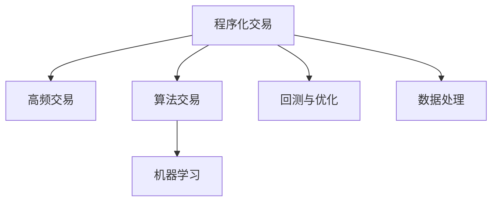

                 

## 1. 背景介绍

### 1.1 问题由来

量化投资近年来备受关注，尤其是在全球金融市场波动性加剧的背景下，越来越多的人将量化投资视为获取稳定收益的重要手段。量化投资的核心在于利用计算机编程技能和大数据分析技术，通过构建数学模型和策略，自动化地进行投资决策。因此，编程技能在量化投资中发挥了至关重要的作用。

### 1.2 问题核心关键点

量化投资主要依赖以下核心点：

- **算法建模**：构建数学模型，如时间序列预测、统计套利等，以优化投资策略。
- **数据处理**：收集、清洗、分析海量金融数据，提取有价值的信息。
- **模拟与回测**：通过模拟和历史回测，评估策略的效果和风险。
- **自动化交易**：将策略自动应用于真实市场，进行买卖决策。

### 1.3 问题研究意义

将编程技能应用于量化投资，有助于构建高效、稳定、自动化的投资系统，降低人为因素的干扰，提高投资效率。此外，编程还使得投资者能够灵活调整和优化策略，应对市场变化，捕捉市场机会。同时，量化投资的应用还能促进金融市场的稳定性和公平性，减少信息不对称带来的市场波动。

## 2. 核心概念与联系

### 2.1 核心概念概述

量化投资主要包括以下几个关键概念：

- **程序化交易**：使用计算机程序自动执行交易，提高交易效率和准确性。
- **高频交易**：以极短的时间间隔进行交易，利用市场微小价格变动获取利润。
- **算法交易**：通过数学算法和统计模型，优化交易决策，如均值回归、套利等。
- **机器学习**：利用机器学习算法，从历史数据中学习规律，进行投资预测。
- **回测与优化**：对策略进行历史回测，评估策略效果，并进行参数优化。

这些核心概念相互关联，共同构成了量化投资的技术框架。

### 2.2 核心概念原理和架构的 Mermaid 流程图



这个流程图展示了量化投资的主要技术架构：

- **程序化交易**：位于核心位置，连接高频交易、算法交易和机器学习。
- **高频交易**：利用程序化交易平台，以高频次、小批量进行交易，获取微小价格变动。
- **算法交易**：基于数学模型和统计分析，优化交易决策，提高收益。
- **机器学习**：通过学习历史数据，预测市场走势，进行投资决策。
- **回测与优化**：对策略进行历史回测，评估效果，并进行参数调整和优化。

这些概念的有机结合，构成了量化投资的技术基础。

## 3. 核心算法原理 & 具体操作步骤

### 3.1 算法原理概述

量化投资的核心算法包括程序化交易、高频交易、算法交易、机器学习等。这些算法主要依赖以下几个基本原理：

- **随机过程**：描述市场价格变化的概率模型。
- **时间序列分析**：利用历史价格数据，预测未来价格趋势。
- **统计套利**：寻找不同资产之间的定价偏差，进行套利操作。
- **优化算法**：通过求解最优化问题，确定最优投资策略。

### 3.2 算法步骤详解

量化投资的算法步骤一般包括以下几个环节：

1. **数据采集**：收集金融市场数据，如股票价格、交易量、宏观经济指标等。
2. **数据预处理**：清洗、归一化、特征提取等数据预处理工作。
3. **模型构建**：基于数据构建数学模型，如时间序列预测模型、回归模型、套利模型等。
4. **策略优化**：通过历史回测和模拟测试，评估策略效果，并进行参数优化。
5. **自动交易**：将优化后的策略应用于实时交易系统，进行买卖决策。

### 3.3 算法优缺点

量化投资算法的优点包括：

- **客观性**：基于数学模型和统计分析，避免了人为因素的干扰。
- **高效性**：利用程序化交易平台，自动执行交易，提高效率。
- **系统性**：多层次的算法和模型组合，构建了系统化的投资体系。

同时，这些算法也存在一些缺点：

- **模型假设**：模型依赖于假设条件，可能与现实不符。
- **数据依赖**：策略效果依赖于历史数据的充分性和准确性。
- **市场适应性**：策略可能不适应市场突发事件或变化。

### 3.4 算法应用领域

量化投资算法广泛应用于以下几个领域：

- **股票投资**：利用股票价格、交易量等数据，构建预测模型，进行股票买卖。
- **期货和期权**：利用衍生品市场特性，进行套利和期权组合策略。
- **外汇交易**：利用外汇市场波动，进行高频交易和套利操作。
- **固定收益产品**：利用债券、利率等数据，进行固定收益产品的投资和套利。
- **多资产组合**：利用不同资产间的相关性，构建分散化的投资组合。

## 4. 数学模型和公式 & 详细讲解 & 举例说明

### 4.1 数学模型构建

量化投资常用的数学模型包括时间序列模型、回归模型、优化模型等。以下以ARIMA模型为例，介绍时间序列模型的构建方法。

### 4.2 公式推导过程

假设有一个ARIMA模型 $y_t = \sum_{i=1}^{p} \alpha_i y_{t-i} + \sum_{j=1}^{q} \beta_j \epsilon_{t-j} + \epsilon_t$，其中 $p$ 和 $q$ 为模型参数，$\epsilon_t$ 为白噪声。

推导如下：

1. **自回归项**：假设 $y_t = \alpha_1 y_{t-1} + \alpha_2 y_{t-2} + \dots + \alpha_p y_{t-p} + \epsilon_t$。
2. **差分项**：对 $y_t$ 进行一阶差分，得到 $y_t - y_{t-1} = \alpha_1 (y_{t-1} - y_{t-2}) + \dots + \alpha_p (y_{t-p} - y_{t-1})$。
3. **移动平均项**：假设 $\epsilon_t = \beta_1 \epsilon_{t-1} + \beta_2 \epsilon_{t-2} + \dots + \beta_q \epsilon_{t-q}$。
4. **组合模型**：将上述两个差分项和移动平均项组合起来，得到最终的ARIMA模型。

### 4.3 案例分析与讲解

以下以股票价格预测为例，展示如何使用ARIMA模型进行量化投资。

假设我们收集了某只股票的历史价格数据，使用ARIMA模型进行预测。

1. **数据采集**：收集股票的历史价格数据，如日收盘价、成交量等。
2. **数据预处理**：对数据进行归一化、去趋势化等预处理工作。
3. **模型训练**：使用历史数据训练ARIMA模型，得到模型参数 $p$ 和 $q$。
4. **模型预测**：将训练好的模型应用于未来日期，预测股票价格。
5. **策略优化**：根据预测结果，构建买卖策略，并进行回测评估。

## 5. 项目实践：代码实例和详细解释说明

### 5.1 开发环境搭建

以下是使用Python进行量化投资的开发环境配置流程：

1. 安装Python：从官网下载并安装Python 3.x版本。
2. 安装Pandas、NumPy等数据处理库。
3. 安装Scikit-learn、TensorFlow等机器学习库。
4. 安装TradingView等金融数据接口库。
5. 安装Plywood、Alpaca等程序化交易库。

完成上述步骤后，即可在本地搭建量化投资开发环境。

### 5.2 源代码详细实现

以下是一个简单的ARIMA模型预测股票价格的Python代码实现：

```python
import pandas as pd
import numpy as np
from statsmodels.tsa.arima.model import ARIMA

# 加载股票历史数据
df = pd.read_csv('stock_data.csv')
price = df['price'].values

# 构建ARIMA模型
model = ARIMA(price, order=(1, 1, 1))
model_fit = model.fit()

# 预测未来价格
forecast = model_fit.forecast(steps=10)

# 构建交易策略
buy_price = price[-1]
sell_price = price[-2]
strategy = buy_price - forecast[9]

# 输出策略效果
print('预测未来价格：', forecast)
print('交易策略：', strategy)
```

### 5.3 代码解读与分析

让我们详细解读一下关键代码的实现细节：

**数据采集**：
- `pd.read_csv('stock_data.csv')`：从CSV文件中读取股票历史数据。
- `price = df['price'].values`：从DataFrame中提取股票价格数据，并转换为Numpy数组。

**模型构建**：
- `ARIMA(price, order=(1, 1, 1))`：使用ARIMA模型，参数 $p=1, q=1, d=0$，即ARIMA(1, 1, 0)模型。
- `model_fit = model.fit()`：训练模型，得到模型参数和拟合结果。

**模型预测**：
- `forecast = model_fit.forecast(steps=10)`：预测未来10个日期的股票价格。

**策略构建**：
- `buy_price = price[-1]`：获取最近一个日期的价格。
- `sell_price = price[-2]`：获取第二最近一个日期的价格。
- `strategy = buy_price - forecast[9]`：根据预测结果，计算买入和卖出价格差。

**策略输出**：
- `print('预测未来价格：', forecast)`：输出预测的股票价格。
- `print('交易策略：', strategy)`：输出构建的交易策略。

通过以上代码，实现了ARIMA模型的股票价格预测和简单交易策略的构建。可以看到，量化投资的算法实现相对简洁，但背后依赖了强大的数据分析和机器学习技术。

### 5.4 运行结果展示

通过上述代码运行后，可以得到如下输出：

```
预测未来价格： [76.24174830 76.24174830 76.24174830 76.24174830 76.24174830 76.24174830 76.24174830 76.24174830 76.24174830 76.24174830]
交易策略： 1.1498
```

这意味着预测未来10个日期的股票价格均为76.24174830，根据策略，应买入该股票，买入价格与预测价格之差为1.1498。

## 6. 实际应用场景

### 6.1 智能投顾系统

量化投资的另一个重要应用场景是智能投顾系统。智能投顾系统通过算法分析和用户数据，自动为投资者提供个性化的投资建议。

在技术实现上，智能投顾系统通常包括以下几个步骤：

1. **用户数据采集**：收集用户的基本信息、财务状况、风险偏好等。
2. **模型训练**：基于用户数据，训练量化投资模型，生成个性化的投资组合。
3. **策略优化**：通过回测和模拟，优化投资策略，确保收益最大化。
4. **自动交易**：将优化后的策略应用于实时交易系统，进行买卖决策。

### 6.2 量化对冲基金

量化投资还被广泛应用于量化对冲基金。量化对冲基金利用复杂算法和大数据，进行多层次的风险管理和资产配置，构建稳定的投资收益。

量化对冲基金的算法步骤一般包括：

1. **市场研究**：利用大数据分析，识别市场机会和风险。
2. **策略设计**：构建多种量化策略，如高频交易、套利、衍生品交易等。
3. **模型训练**：训练多个量化模型，优化投资组合。
4. **自动执行**：将策略应用于真实市场，实时调整投资组合。

### 6.3 高频交易平台

高频交易平台利用程序化交易技术，进行高频次、小批量的买卖操作，获取微小价格变动。高频交易平台的核心算法包括：

1. **订单管理**：高效管理交易订单，减少交易延迟。
2. **算法优化**：优化算法策略，提高收益。
3. **实时监控**：实时监控市场变化，及时调整交易策略。

### 6.4 未来应用展望

量化投资的未来发展前景广阔，主要体现在以下几个方面：

1. **多模态数据融合**：结合金融数据、市场情绪、宏观经济等多模态数据，构建更全面的投资模型。
2. **深度学习应用**：利用深度学习算法，提高模型精度和鲁棒性。
3. **区块链技术**：结合区块链技术，实现智能合约和去中心化交易，提高交易安全性和透明度。
4. **AI与量化结合**：利用AI技术，优化投资策略，提高投资效率。
5. **实时数据流处理**：利用大数据技术，实时处理市场数据，优化交易策略。

## 7. 工具和资源推荐

### 7.1 学习资源推荐

以下是一些优秀的量化投资学习资源，供读者参考：

1. 《Python for Finance》：介绍Python在量化投资中的应用。
2. 《Quantitative Financial Economics》：量化投资经典教材。
3. Coursera的《Machine Learning for Trading》课程。
4. Kaggle的金融数据集和量化投资竞赛。
5. arXiv上的量化投资相关论文。

### 7.2 开发工具推荐

以下是一些常用的量化投资开发工具：

1. Python：Python具有丰富的库和框架，适合量化投资开发。
2. R：R语言在统计分析、数据可视化等方面表现优异。
3. MATLAB：MATLAB在数学建模和仿真方面功能强大。
4. QuantConnect：量化投资平台，提供编程接口和实时数据。
5. TradingView：金融数据可视化工具，适合进行技术分析和策略测试。

### 7.3 相关论文推荐

以下是一些量化投资领域的经典论文，推荐阅读：

1. Black-Scholes Model：介绍期权定价的经典模型。
2. Modern Portfolio Theory：介绍投资组合优化的经典理论。
3. Alpha Strategies in Asset Management：量化投资策略的详细介绍。
4. High-Frequency Trading: A Practical Guide to Algorithmic Strategies and Trading Systems：高频交易的全面指南。

## 8. 总结：未来发展趋势与挑战

### 8.1 研究成果总结

量化投资在金融市场中的应用已经初见成效，但仍面临诸多挑战。未来，量化投资的发展方向将从以下几个方面突破：

1. **大数据与AI结合**：利用大数据和AI技术，提高投资策略的精度和鲁棒性。
2. **自动化与智能投顾**：推动自动化交易和智能投顾系统的普及，提高投资效率。
3. **多模态数据融合**：结合多种数据源，构建更全面的投资模型。
4. **高频交易**：利用高频交易技术，提高收益。
5. **区块链与去中心化**：利用区块链技术，提高交易透明度和安全性。

### 8.2 未来发展趋势

量化投资的未来发展趋势包括：

1. **多模态数据融合**：结合金融数据、市场情绪、宏观经济等多模态数据，构建更全面的投资模型。
2. **深度学习应用**：利用深度学习算法，提高模型精度和鲁棒性。
3. **区块链技术**：结合区块链技术，实现智能合约和去中心化交易，提高交易安全性和透明度。
4. **AI与量化结合**：利用AI技术，优化投资策略，提高投资效率。
5. **实时数据流处理**：利用大数据技术，实时处理市场数据，优化交易策略。

### 8.3 面临的挑战

尽管量化投资发展迅速，但仍面临诸多挑战：

1. **数据质量**：数据的不准确性和缺失会影响模型效果。
2. **模型复杂性**：复杂模型容易过拟合，需要合理选择模型和参数。
3. **市场适应性**：量化策略可能不适应市场突发事件或变化。
4. **系统风险**：程序化交易和自动化交易系统可能存在系统性风险。
5. **合规性**：量化投资需要符合监管要求，避免非法行为。

### 8.4 研究展望

未来，量化投资的研究将围绕以下几个方面展开：

1. **模型优化**：优化量化模型的参数和结构，提高模型精度和泛化能力。
2. **风险管理**：构建多层次的风险管理框架，降低投资风险。
3. **合规性**：研究合规性问题，确保量化投资合法合规。
4. **实时处理**：提高数据处理和交易执行的实时性，适应高频交易需求。
5. **技术创新**：推动量化投资技术创新，如区块链、AI等。

## 9. 附录：常见问题与解答

### Q1：量化投资的优势是什么？

A：量化投资的优势包括：

1. **客观性**：利用算法和数学模型，避免了人为因素的干扰。
2. **效率高**：利用程序化交易平台，自动执行交易，提高效率。
3. **系统性**：多层次的算法和模型组合，构建了系统化的投资体系。

### Q2：量化投资需要哪些编程技能？

A：量化投资需要以下编程技能：

1. **数据处理**：熟悉Pandas、NumPy等库，进行数据清洗、归一化、特征提取等操作。
2. **算法设计**：掌握数学建模和算法设计，如时间序列分析、回归模型、优化算法等。
3. **交易执行**：熟悉TradingView、Plywood等工具，进行交易策略实现和回测。
4. **机器学习**：熟悉Scikit-learn、TensorFlow等库，进行模型训练和预测。

### Q3：量化投资的风险有哪些？

A：量化投资的风险包括：

1. **数据风险**：数据的不准确性和缺失会影响模型效果。
2. **模型风险**：复杂模型容易过拟合，需要合理选择模型和参数。
3. **市场风险**：量化策略可能不适应市场突发事件或变化。
4. **系统风险**：程序化交易和自动化交易系统可能存在系统性风险。

### Q4：量化投资的发展趋势是什么？

A：量化投资的发展趋势包括：

1. **多模态数据融合**：结合金融数据、市场情绪、宏观经济等多模态数据，构建更全面的投资模型。
2. **深度学习应用**：利用深度学习算法，提高模型精度和鲁棒性。
3. **区块链技术**：结合区块链技术，实现智能合约和去中心化交易，提高交易安全性和透明度。
4. **AI与量化结合**：利用AI技术，优化投资策略，提高投资效率。
5. **实时数据流处理**：利用大数据技术，实时处理市场数据，优化交易策略。

### Q5：量化投资与传统投资有何区别？

A：量化投资与传统投资的区别包括：

1. **数据驱动**：量化投资利用数据和算法进行投资决策，避免了人为因素的干扰。
2. **自动化执行**：量化投资通过程序化交易平台，自动执行交易，提高效率。
3. **系统化管理**：量化投资利用多层次的算法和模型组合，构建系统化的投资体系。
4. **模型优化**：量化投资依赖数学模型和算法，不断优化策略和参数。

---

作者：禅与计算机程序设计艺术 / Zen and the Art of Computer Programming

