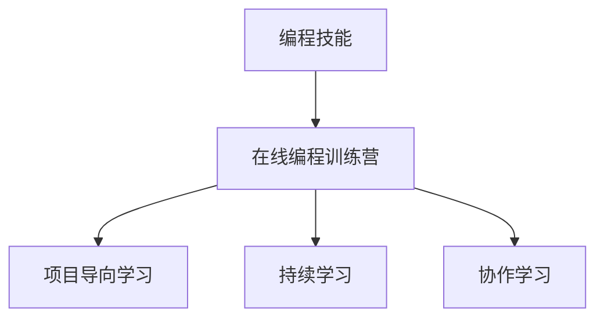

                 

## 1. 背景介绍

### 1.1 问题由来
随着信息技术的高速发展，编程技能已成为新时代必备的核心竞争力。然而，如何系统地掌握编程知识、快速提升编程能力，成为了广大编程爱好者和学生普遍关注的问题。近年来，在线编程训练营作为一种新型的编程学习模式，通过模拟真实编程项目，将编程技能转化为解决实际问题，获得了广泛的应用和认可。

### 1.2 问题核心关键点
在线编程训练营的核心在于其独特的教学方式和项目驱动的学习理念。通过设置具体的编程任务，并引导学习者利用所学知识完成项目，从而在实践中掌握编程技能。这种教学方法相比传统课堂式教学具有如下优点：

1. **实践导向**：将理论知识与实践项目紧密结合，让学习者在实践中掌握编程技能。
2. **项目驱动**：通过实际项目进行驱动，提高学习者的代码编写能力和问题解决能力。
3. **灵活学习**：学习者可以根据自己的时间安排和学习节奏进行学习，提高了学习的灵活性和自主性。
4. **社区互动**：学习者可以在线上社区进行交流互动，分享学习经验，互相帮助，共同进步。

然而，如何将编程技能系统地转化为在线编程训练营，仍然是一个复杂而富有挑战性的问题。本文将从核心概念、算法原理、操作步骤等角度，系统地探讨如何将编程技能转化为在线编程训练营。

## 2. 核心概念与联系

### 2.1 核心概念概述

为更好地理解在线编程训练营的实现，本节将介绍几个关键概念：

- **编程技能**：包括编程语言基础、算法与数据结构、软件设计模式、版本控制等，是计算机科学的核心技能之一。
- **在线编程训练营**：通过线上平台提供的编程任务和项目，引导学习者完成学习目标，系统提升编程能力。
- **项目导向学习**：基于具体项目，引导学习者在实践中学习和应用编程知识，掌握编程技能。
- **持续学习**：在线编程训练营注重持续学习，通过不断更新项目内容，保持学习者的学习动力和兴趣。
- **协作学习**：学习者可以在线上平台进行交流互动，分享学习经验，共同解决编程问题，增强学习效果。

这些核心概念之间的逻辑关系可以通过以下Mermaid流程图来展示：



这个流程图展示了编程技能向在线编程训练营转化的关键步骤和概念：

1. 通过具体的编程任务和项目，学习者在实践中掌握编程技能。
2. 持续更新项目内容，保持学习者的学习动力和兴趣。
3. 学习者通过线上社区进行交流互动，增强学习效果。

## 3. 核心算法原理 & 具体操作步骤

### 3.1 算法原理概述

在线编程训练营的实现原理主要基于**“项目导向学习”**和**“持续学习”**两大核心概念。具体而言，通过设置具体的编程项目，引导学习者在实践中学习和应用编程知识，同时通过持续更新项目内容，保持学习者的学习动力和兴趣。

### 3.2 算法步骤详解

在线编程训练营的实现步骤主要包括：

**Step 1: 设计项目库**
- 根据编程技能的不同层次，设计多个难度和复杂度不同的项目。每个项目包括任务描述、输入数据、期望输出和评估标准。
- 项目库的建立应考虑多样性和实用性，覆盖各种编程语言、算法和应用场景。

**Step 2: 实施学习路径**
- 根据项目难度和复杂度，制定学习路径，引导学习者逐步掌握编程技能。
- 学习路径应具备可扩展性和灵活性，允许学习者根据自己的兴趣和时间安排进行选择。

**Step 3: 提供交互式环境**
- 通过线上平台提供代码编写工具、环境模拟工具和在线调试工具，为学习者提供互动的学习环境。
- 在线编程环境应具备实时反馈、版本控制、代码审查等功能，支持学习者进行协作学习和问题解决。

**Step 4: 构建社区平台**
- 建立线上社区，为学习者提供交流互动的平台。
- 社区平台应具备讨论区、问答区、资源共享区等功能，促进学习者之间的交流和合作。

**Step 5: 持续更新项目内容**
- 定期更新项目库，引入新的编程任务和应用场景，保持学习内容的活力和新鲜度。
- 通过课程回顾、项目评估等方式，收集学习者的反馈，不断改进课程内容和教学方法。

### 3.3 算法优缺点

在线编程训练营具有以下优点：
1. **实践导向**：通过具体项目进行学习，增强学习者的代码编写和问题解决能力。
2. **灵活学习**：学习者可以根据自身时间安排和学习节奏进行学习，提高学习的灵活性和自主性。
3. **社区互动**：学习者可以在线上社区进行交流互动，分享学习经验，共同解决问题，增强学习效果。
4. **资源丰富**：项目库和社区平台提供了丰富的资源和工具，支持学习者进行自我学习和问题解决。

同时，该方法也存在一定的局限性：
1. **知识深度不足**：项目导向的学习方式可能导致学习者对特定领域的知识深度不够。
2. **学习依赖平台**：学习者的学习效果依赖于在线平台的稳定性和功能完善度。
3. **学习者自律性要求高**：学习者需要具备较高的自律性和自我管理能力，否则可能无法完成学习任务。
4. **项目难度控制困难**：项目难度和复杂度的控制需要精细的设计和实施，否则可能导致学习者无法完成项目，或对学习效果产生负面影响。

尽管存在这些局限性，但就目前而言，在线编程训练营仍是编程技能教学的重要模式之一。未来相关研究的重点在于如何进一步优化项目设计、提升学习效果，同时兼顾学习的灵活性和社区互动性等因素。

### 3.4 算法应用领域

在线编程训练营在以下几个领域中已得到广泛应用，并且取得了显著成效：

- **软件开发**：通过项目导向学习，提升开发者的代码编写能力和项目管理能力。
- **数据科学**：通过数据分析和机器学习项目，增强学习者的数据处理和建模能力。
- **人工智能**：通过深度学习、自然语言处理等项目，培养学习者的算法设计和应用能力。
- **移动应用开发**：通过移动应用开发项目，提高学习者的跨平台开发和用户体验设计能力。
- **Web开发**：通过Web开发项目，增强学习者的前端和后端开发能力。

除了上述这些经典领域外，在线编程训练营也被创新性地应用到更多场景中，如游戏开发、物联网、区块链等新兴技术领域，为编程技术的普及和应用提供了新的路径。

## 4. 数学模型和公式 & 详细讲解 & 举例说明

### 4.1 数学模型构建

本节将使用数学语言对在线编程训练营的实现过程进行更加严格的刻画。

假设在线编程训练营为 $C_{online}$，学习者总数为 $N$，每个学习者的编程能力初始值为 $C_i$，通过项目导向学习后，每个学习者的编程能力提升为 $C'_i$。则编程能力提升模型可以表示为：

$$
C'_i = f(C_i, P_i, M_i)
$$

其中 $P_i$ 表示学习者完成项目 $P$ 的次数，$M_i$ 表示学习者在学习社区平台上的互动次数。

学习者的编程能力提升取决于项目完成次数和社区互动次数，即：

$$
C'_i = \alpha C_i + \beta P_i + \gamma M_i
$$

其中 $\alpha, \beta, \gamma$ 为模型参数，分别表示编程能力提升对初始编程能力、项目完成次数和社区互动次数的依赖程度。

### 4.2 公式推导过程

以上公式可以通过以下步骤进行推导：

1. **模型定义**：设 $C_i$ 为学习者 $i$ 的初始编程能力，$P_i$ 和 $M_i$ 分别表示学习者完成项目和社区互动的次数。
2. **能力提升函数**：假设编程能力提升函数 $f$ 为线性函数，即 $C'_i = \alpha C_i + \beta P_i + \gamma M_i$。
3. **参数拟合**：通过实验数据对模型参数 $\alpha, \beta, \gamma$ 进行拟合，找到最优的参数组合。

### 4.3 案例分析与讲解

以软件开发项目为例，假设学习者 $i$ 的初始编程能力为 $C_i = 50$，完成项目 $P$ 的次数为 $P_i = 5$，社区互动次数为 $M_i = 10$，则编程能力提升模型为：

$$
C'_i = \alpha \times 50 + \beta \times 5 + \gamma \times 10
$$

如果模型参数拟合结果为 $\alpha = 0.8, \beta = 0.2, \gamma = 0.1$，则：

$$
C'_i = 0.8 \times 50 + 0.2 \times 5 + 0.1 \times 10 = 55.5
$$

即学习者 $i$ 的编程能力提升至 $55.5$。

## 5. 项目实践：代码实例和详细解释说明

### 5.1 开发环境搭建

在进行在线编程训练营开发前，我们需要准备好开发环境。以下是使用Python进行Flask开发的环境配置流程：

1. 安装Anaconda：从官网下载并安装Anaconda，用于创建独立的Python环境。

2. 创建并激活虚拟环境：
```bash
conda create -n flask-env python=3.8 
conda activate flask-env
```

3. 安装Flask：
```bash
pip install flask
```

4. 安装相关工具包：
```bash
pip install Jinja2 Flask-RESTful Flask-SQLAlchemy
```

完成上述步骤后，即可在`flask-env`环境中开始在线编程训练营的开发。

### 5.2 源代码详细实现

以下是使用Flask开发一个简单的在线编程训练营的代码实现：

```python
from flask import Flask, request, jsonify
from flask_sqlalchemy import SQLAlchemy
from flask_restful import Resource, Api
from flask_login import LoginManager, UserMixin, login_user, login_required, logout_user

app = Flask(__name__)
app.config['SQLALCHEMY_DATABASE_URI'] = 'sqlite:////tmp/test.db'
app.config['SECRET_KEY'] = 'supersecretkey'
db = SQLAlchemy(app)
login_manager = LoginManager()
login_manager.init_app(app)

class User(db.Model, UserMixin):
    id = db.Column(db.Integer, primary_key=True)
    username = db.Column(db.String(80), unique=True, nullable=False)
    password = db.Column(db.String(120), nullable=False)

@login_manager.user_loader
def load_user(user_id):
    return User.query.get(int(user_id))

class Project(db.Model):
    id = db.Column(db.Integer, primary_key=True)
    title = db.Column(db.String(120), nullable=False)
    description = db.Column(db.Text, nullable=False)
    status = db.Column(db.String(20), nullable=False)
    user_id = db.Column(db.Integer, db.ForeignKey('user.id', ondelete='CASCADE', nullable=False))

class Task(db.Model):
    id = db.Column(db.Integer, primary_key=True)
    project_id = db.Column(db.Integer, db.ForeignKey('project.id', ondelete='CASCADE', nullable=False))
    task_description = db.Column(db.Text, nullable=False)
    expected_output = db.Column(db.Text, nullable=False)
    status = db.Column(db.String(20), nullable=False)

class LoginResource(Resource):
    def get(self):
        return {'message': 'Login page'}

class Login(Resource):
    def post(self):
        username = request.form.get('username')
        password = request.form.get('password')
        user = User.query.filter_by(username=username).first()
        if user and user.password == password:
            login_user(user)
            return jsonify({'message': 'Login successful'})
        else:
            return jsonify({'message': 'Invalid username or password'})

class Projects(Resource):
    @login_required
    def get(self):
        projects = Project.query.all()
        project_list = []
        for project in projects:
            project_list.append({'id': project.id, 'title': project.title, 'description': project.description, 'status': project.status, 'user_id': project.user_id})
        return jsonify({'projects': project_list})

class Project(Resource):
    @login_required
    def get(self, project_id):
        project = Project.query.get(project_id)
        if not project:
            return jsonify({'message': 'Project not found'})
        return jsonify({'id': project.id, 'title': project.title, 'description': project.description, 'status': project.status, 'user_id': project.user_id})

class Tasks(Resource):
    @login_required
    def get(self, project_id):
        tasks = Task.query.filter_by(project_id=project_id).all()
        task_list = []
        for task in tasks:
            task_list.append({'task_description': task.task_description, 'expected_output': task.expected_output, 'status': task.status})
        return jsonify({'tasks': task_list})

class Task(Resource):
    @login_required
    def get(self, task_id):
        task = Task.query.get(task_id)
        if not task:
            return jsonify({'message': 'Task not found'})
        return jsonify({'task_description': task.task_description, 'expected_output': task.expected_output, 'status': task.status})

class TaskSubmit(Resource):
    @login_required
    def post(self, task_id):
        task = Task.query.get(task_id)
        if not task:
            return jsonify({'message': 'Task not found'})
        submit = request.form.get('submit')
        task.status = submit
        db.session.commit()
        return jsonify({'message': 'Task submitted'})

if __name__ == '__main__':
    app.run(debug=True)
```

### 5.3 代码解读与分析

让我们再详细解读一下关键代码的实现细节：

**User类和Project类**：
- `User`类表示学习者的基本信息，包括用户名和密码。
- `Project`类表示编程项目，包括项目标题、描述、状态和所属的学习者。

**Task类**：
- `Task`类表示编程任务，包括任务描述、预期输出和状态，属于某个编程项目。

**Flask的路由配置**：
- 使用Flask提供的装饰器，定义了多个路由，包括登录、获取项目、提交任务等。

**登录和项目管理**：
- 使用Flask-Login扩展，实现了用户登录和退出功能。
- 使用SQLAlchemy ORM，实现了对学习者、项目和任务的持久化操作。

**API接口**：
- 使用Flask-RESTful扩展，定义了多个API接口，用于获取学习者信息、项目信息、任务信息和任务提交等操作。

完成上述步骤后，即可在`flask-env`环境中启动在线编程训练营的Web服务，进行项目管理和任务提交。

## 6. 实际应用场景

### 6.1 软件开发项目

在线编程训练营在软件开发项目中的应用非常广泛。例如，一个软件开发者可以通过在线平台学习多种编程语言和框架，完成多个实际开发项目，逐步掌握开发技能。平台还可以提供项目评审和反馈功能，帮助开发者不断改进和优化代码质量。

### 6.2 数据科学项目

数据科学领域同样需要强大的编程技能。通过在线编程训练营，学习者可以学习Python、R等数据科学语言，完成数据分析、机器学习等项目，提升数据处理和建模能力。平台还可以提供在线数据集和工具，帮助学习者进行实验和分析。

### 6.3 人工智能项目

人工智能项目需要学习者掌握深度学习、自然语言处理等先进技术。在线编程训练营提供这些项目，并配备相应的在线学习资源和工具，帮助学习者掌握这些技术，并应用于实际项目中。

### 6.4 移动应用开发项目

移动应用开发项目需要学习者掌握多种编程语言和开发工具，如Java、Kotlin、Swift等。在线编程训练营通过项目导向学习，帮助学习者完成移动应用开发项目，掌握跨平台开发和用户体验设计能力。

## 7. 工具和资源推荐

### 7.1 学习资源推荐

为了帮助开发者系统掌握在线编程训练营的理论基础和实践技巧，这里推荐一些优质的学习资源：

1. **《Flask Web Development》**：一本介绍Flask框架的书籍，详细讲解了Flask的各个组件和扩展的使用方法。
2. **《Python Programming》**：一本介绍Python编程语言的书籍，涵盖了Python的基础语法和高级特性。
3. **《RESTful Web Services》**：一本介绍RESTful架构的书籍，详细讲解了RESTful服务的原理和实现方法。
4. **《SQL Alchemy》**：SQLAlchemy官方文档，提供了SQLAlchemy ORM的详细使用指南。
5. **《Flask-RESTful》**：Flask-RESTful官方文档，提供了Flask-RESTful扩展的详细使用指南。

通过对这些资源的学习实践，相信你一定能够快速掌握在线编程训练营的开发技术，并用于解决实际的编程问题。

### 7.2 开发工具推荐

高效的开发离不开优秀的工具支持。以下是几款用于在线编程训练营开发的常用工具：

1. **Visual Studio Code**：一款流行的代码编辑器，支持多种编程语言和扩展，适合在线编程训练营的开发。
2. **Git**：一款分布式版本控制系统，支持代码的协同开发和版本管理，适合在线编程训练营的版本控制需求。
3. **Jenkins**：一款开源的持续集成和持续部署工具，支持自动构建、测试和部署，适合在线编程训练营的持续集成需求。
4. **Kubernetes**：一款开源的容器编排工具，支持容器化应用的自动部署和扩展，适合在线编程训练营的自动化部署需求。
5. **Docker**：一款开源的容器化技术，支持应用和服务的打包和部署，适合在线编程训练营的容器化需求。

合理利用这些工具，可以显著提升在线编程训练营的开发效率，加快创新迭代的步伐。

### 7.3 相关论文推荐

在线编程训练营的发展源于学界的持续研究。以下是几篇奠基性的相关论文，推荐阅读：

1. **《Online Programming Education: An Exploratory Study of Student Outcomes》**：探讨了在线编程教育的有效性，分析了学习者在在线编程训练营中的学习效果。
2. **《A Comparison of Online and In-Person Programming Education》**：比较了在线编程教育和传统编程教育的效果，分析了在线编程训练营的优势和不足。
3. **《Programming Education Through Project-Based Learning》**：探讨了基于项目的学习方法在编程教育中的应用，分析了项目导向学习的效果。
4. **《An Evaluation of Online Programming Education》**：评估了在线编程教育的实践效果，分析了在线编程训练营的挑战和解决方案。

这些论文代表了大语言模型微调技术的发展脉络。通过学习这些前沿成果，可以帮助研究者把握学科前进方向，激发更多的创新灵感。

## 8. 总结：未来发展趋势与挑战

### 8.1 总结

本文对在线编程训练营的实现原理和操作步骤进行了详细讲解。首先阐述了在线编程训练营的实现背景和核心概念，明确了项目导向学习和持续学习在在线编程训练营中的重要作用。其次，从算法原理和具体操作步骤角度，详细讲解了在线编程训练营的实现过程，并给出了代码实例。同时，本文还广泛探讨了在线编程训练营在软件开发、数据科学、人工智能、移动应用开发等多个领域的应用前景，展示了其巨大的潜力和价值。此外，本文精选了在线编程训练营的相关学习资源，力求为开发者提供全方位的技术指引。

通过本文的系统梳理，可以看到，在线编程训练营作为一种新型的编程学习模式，正在成为编程技能教学的重要模式之一。通过具体的编程项目和持续的学习更新，学习者可以在实践中掌握编程技能，提升编程能力，广泛应用于各个领域。未来，伴随在线编程训练营的不断优化和普及，必将为编程技术的普及和应用提供新的路径，推动编程技术的进步和应用。

### 8.2 未来发展趋势

展望未来，在线编程训练营将呈现以下几个发展趋势：

1. **集成AI技术**：引入AI技术，如自然语言处理、机器学习等，增强在线编程训练营的智能化水平，提供更加个性化的学习体验。
2. **多模态学习**：支持语音、视频等多模态数据的学习，丰富在线编程训练营的教学方式和内容。
3. **开放教育**：向全球开放在线编程训练营，促进全球编程教育的公平和普及。
4. **持续更新**：通过持续更新项目内容和教学方法，保持在线编程训练营的新鲜度和活力。
5. **社区互动**：加强学习者之间的交流互动，构建更加活跃和有活力的学习社区。

以上趋势凸显了在线编程训练营的广阔前景。这些方向的探索发展，必将进一步提升编程教育的普及和应用，推动编程技术的普及和应用。

### 8.3 面临的挑战

尽管在线编程训练营在编程教育中已经取得了显著成效，但在迈向更加智能化、普适化应用的过程中，它仍面临着诸多挑战：

1. **学习依赖平台**：学习者的学习效果依赖于在线平台的稳定性和功能完善度，平台崩溃或功能不足可能影响学习效果。
2. **学习者自律性要求高**：学习者需要具备较高的自律性和自我管理能力，否则可能无法完成学习任务。
3. **知识深度不足**：项目导向的学习方式可能导致学习者对特定领域的知识深度不够。
4. **项目难度控制困难**：项目难度和复杂度的控制需要精细的设计和实施，否则可能导致学习者无法完成项目，或对学习效果产生负面影响。
5. **安全性和隐私保护**：在线编程训练营需要保障学习者的安全性和隐私保护，避免数据泄露和隐私问题。

尽管存在这些挑战，但通过不断优化在线编程训练营的平台功能和教学方法，提高学习者的自律性和自我管理能力，未来在线编程训练营必将在编程教育中发挥更大的作用，推动编程技术的普及和应用。

### 8.4 研究展望

未来，在线编程训练营的研究方向将集中在以下几个方面：

1. **多模态学习**：研究如何支持语音、视频等多模态数据的学习，提升在线编程训练营的教学效果。
2. **个性化学习**：研究如何利用AI技术，实现学习者的个性化学习路径和内容推荐。
3. **社区互动**：研究如何构建更加活跃和有活力的学习社区，增强学习者之间的交流互动。
4. **安全性和隐私保护**：研究如何保障学习者的安全性和隐私保护，确保数据和平台的安全。
5. **跨平台学习**：研究如何在不同平台和设备上进行在线编程训练营的学习，实现跨平台的学习体验。

这些研究方向将推动在线编程训练营的不断优化和普及，为编程教育的普及和应用提供新的路径，推动编程技术的进步和应用。

## 9. 附录：常见问题与解答

**Q1: 在线编程训练营如何实现项目导向学习？**

A: 在线编程训练营通过设置具体的编程项目，引导学习者在实践中学习和应用编程知识。学习者需要按照项目描述和要求，编写代码，完成项目，并在项目过程中不断优化代码，提高编程能力。平台还可以提供项目评审和反馈功能，帮助学习者不断改进和优化代码质量。

**Q2: 在线编程训练营如何解决学习依赖平台的问题？**

A: 在线编程训练营需要保障平台的稳定性和功能完善度，避免平台崩溃或功能不足影响学习效果。可以通过云服务提供商，如AWS、Google Cloud等，构建稳定的在线编程训练营平台。同时，还可以引入CDN技术，加速资源的访问和下载，提高平台的用户体验。

**Q3: 在线编程训练营如何实现个性化学习？**

A: 在线编程训练营可以通过AI技术，实现学习者的个性化学习路径和内容推荐。平台可以收集学习者的学习行为数据，利用机器学习算法，分析学习者的学习偏好和能力，自动推荐适合的项目和学习内容。同时，平台还可以根据学习者的反馈，不断优化推荐算法，提高推荐效果。

**Q4: 在线编程训练营如何保障学习者的安全性和隐私保护？**

A: 在线编程训练营需要保障学习者的安全性和隐私保护，避免数据泄露和隐私问题。可以通过数据加密、访问控制、身份认证等技术手段，确保学习者的数据安全。同时，平台还可以引入隐私保护机制，如差分隐私、联邦学习等，保障学习者的隐私权利。

**Q5: 在线编程训练营如何实现跨平台学习？**

A: 在线编程训练营可以通过云服务提供商，构建跨平台的学习环境。学习者可以在不同的设备和平台上进行在线编程训练营的学习，无需担心平台兼容性问题。同时，平台还可以提供离线功能，学习者可以将项目和代码下载到本地，在离线环境下进行学习和开发。

综上所述，通过在线编程训练营，学习者可以在实践中掌握编程技能，提升编程能力，广泛应用于各个领域。未来，伴随在线编程训练营的不断优化和普及，必将为编程技术的普及和应用提供新的路径，推动编程技术的进步和应用。

